# 网络爬虫与交互式可视化

到目前为止，本书主要聚焦于使用 Jupyter 构建可重复的数据分析流程和预测模型。在本章中我们将继续探讨这些话题，但本章的主要重点是数据获取。特别是，我们将展示如何通过 HTTP 请求从网上获取数据。这将涉及通过请求和解析 HTML 来抓取网页。最后，我们将通过使用交互式可视化技术来探索我们收集的数据，作为本章的总结。

网上可获得的数据量庞大且相对容易获取，而且数据量还在持续增长，变得越来越重要。部分持续增长的原因，是全球从报纸、杂志和电视转向在线内容的趋势。随着手机上随时可用的定制化新闻源，以及 Facebook、Reddit、Twitter 和 YouTube 等实时新闻源的出现，已经很难想象历史上的其他选择还能在未来长久存在。令人惊讶的是，这还仅仅是线上数据不断增长的一部分。

随着全球向通过 HTTP 服务（如博客、新闻网站、Netflix 等）消费内容的转变，使用数据驱动的分析方法的机会大量增加。例如，Netflix 会根据用户观看的电影，预测他们可能喜欢的电影，并基于此预测推荐相关电影。不过，在本章中，我们并不打算探讨这种“面向业务”的数据，而是将展示客户端如何将互联网作为数据库来利用。从未有过如此多样化且易于获取的数据。我们将使用网络爬虫技术来收集数据，然后利用 Jupyter 中的交互式可视化进行探索。

交互式可视化是一种数据表现形式，通过图表或图形帮助用户理解数据。交互式可视化帮助开发者或分析人员将数据呈现成简洁易懂的形式，非技术人员也能轻松理解。

在本章结束时，您将能够：

+   分析 HTTP 请求如何工作

+   从网页中爬取表格数据

+   构建与转换 Pandas 数据框

+   创建交互式可视化

# 爬取网页数据

在将互联网作为数据库的理念下，我们可以考虑通过爬取网页内容或与 Web API 接口来获取数据。通常，爬取内容意味着让计算机读取原本是为人类呈现的可读格式的数据。与此不同，Web API 则是通过机器可读的格式（最常见的是 JSON）传递数据。

在这个主题中，我们将重点讨论网页抓取。进行抓取的具体过程取决于页面和所需的内容。不过，正如我们将看到的，只要我们了解底层的概念和工具，从 HTML 页面中抓取任何我们需要的内容是非常容易的。在本节中，我们将以维基百科为例，抓取文章中的表格内容。然后，我们将应用相同的技术，从一个完全不同域的页面抓取数据。但首先，我们将花一些时间来介绍 HTTP 请求。

# HTTP 请求简介

超文本传输协议，简称 HTTP，是互联网数据通信的基础。它定义了如何请求一个页面以及响应应该是什么样子。例如，客户端可以请求一个销售笔记本电脑的亚马逊页面、一个本地餐馆的谷歌搜索结果，或者是他们的 Facebook 动态。除了 URL，请求中还会包含用户代理和可用的浏览器 Cookie，这些内容属于**请求头**。用户代理告诉服务器客户端正在使用的浏览器和设备，通常用于提供最适合用户的网页响应版本。也许他们最近登录了该网页；这些信息会存储在 Cookie 中，用于自动登录用户。

这些 HTTP 请求和响应的细节由 Web 浏览器在幕后处理。幸运的是，今天使用 Python 等高级语言进行请求时也是如此。对于许多用途，请求头的内容可以大体上忽略。

除非另有说明，否则这些请求通常是在请求 URL 时由 Python 自动生成的。不过，为了排查问题并理解请求产生的响应，理解 HTTP 的基础知识是很有用的。

HTTP 方法有很多种，如 GET、HEAD、POST 和 PUT。前两种用于请求从服务器发送数据到客户端，而后两种则用于将数据发送到服务器。

这些 HTTP 方法总结在以下表格中：

| **HTTP 方法** | **描述** |
| --- | --- |
| GET  | 从指定的 URL 获取信息 |
| HEAD | 从指定 URL 的 HTTP 头部获取元信息 |
| POST | 将附加信息发送到指定 URL 的资源进行附加 |
| PUT | 将附加信息发送到指定 URL 的资源以替换原有内容 |

每次我们在浏览器中输入网页地址并按下*Enter*键时，都会发送一个 GET 请求。在网页抓取中，这通常是我们唯一关心的 HTTP 方法，也是本章将要使用的唯一方法。

一旦请求被发送，服务器可以返回各种类型的响应。这些响应使用从 100 级到 500 级的代码进行标记，其中代码中的第一位数字表示响应的类别。可以将其描述如下：

+   **1xx**: 信息响应，例如，服务器正在处理请求。这种情况很少见。

+   **2xx**: 成功，例如，页面已正确加载。

+   **3xx**: 重定向，例如，请求的资源已移动，我们被重定向到一个新的 URL。

+   **4xx**: 客户端错误，例如，请求的资源不存在。

+   **5xx**: 服务器错误，例如，网站服务器正在接收过多的流量，无法完成请求。

对于网络抓取的目的，我们通常只关心响应类别，即响应代码的第一个数字。但是，每个类别中还有子类别，提供了更详细的信息。例如，401 代码表示未经授权的响应，而 404 代码表示*页面未找到*的响应。

这种区分很重要，因为 404 表示我们请求的页面不存在，而 401 告诉我们需要登录才能查看特定资源。

让我们看看如何在 Python 中进行 HTTP 请求，并使用 Jupyter Notebook 探索这些主题。

# 在 Jupyter Notebook 中进行 HTTP 请求

现在我们已经讨论了 HTTP 请求的工作原理及其应该期望的响应类型，让我们看看如何在 Python 中实现这一点。我们将使用一个名为**Requests**的库，这恰好是 Python 中下载次数最多的外部库。可以使用 Python 的内置工具，如`urllib`，来进行 HTTP 请求，但 Requests 更加直观，并且在官方 Python 文档中推荐使用它而不是`urllib`。

Requests 是进行简单和高级网络请求的一个很好的选择。它允许对头部、Cookie 和授权进行各种自定义设置。它跟踪重定向并提供方法来返回特定页面内容，例如 JSON。此外，还有一整套高级功能。但是，它不允许 JavaScript 渲染。

通常情况下，服务器返回包含 JavaScript 代码片段的 HTML，这些片段在加载时会自动在浏览器中运行。使用 Python 的 Requests 请求内容时，可以看到这些 JavaScript 代码，但不会运行。因此，任何由此创建或更改的元素均会缺失。通常情况下，这并不影响获取所需信息的能力，但在某些情况下，我们可能需要渲染 JavaScript 以正确地抓取页面。为此，我们可以使用类似 Selenium 这样的库。它与 Requests 库具有类似的 API，但提供了使用 Web 驱动程序来渲染 JavaScript 的支持。

让我们使用 Requests 库和 Python 在 Jupyter Notebook 中深入研究下一节。

# 在 Jupyter Notebook 中使用 Python 处理 HTTP 请求

1.  通过执行`jupyter notebook`从项目目录启动`NotebookApp`。导航到`*Chapter-3*`目录并打开`chapter-3-workbook.ipynb`文件。找到顶部附近加载包的单元格并运行它。

我们将请求一个网页，然后检查响应对象。市面上有很多不同的库可以用来发起请求，并且每个库在具体操作方式上也有很多选择。我们只会使用 Requests 库，因为它提供了出色的文档、强大的功能和简单的 API。

1.  向下滚动到子主题`HTTP 请求简介`，并运行该部分中的第一个单元格以导入 Requests 库。然后，运行包含以下代码的单元格以准备请求：

```py
  url = 'https://jupyter.org/'
  req = requests.Request('GET', url)
  req.headers['User-Agent'] = 'Mozilla/5.0'
  req = req.prepare() 
```

我们使用`Request 类`来准备一个 GET 请求，向 jupyter.org 主页发送请求。通过指定用户代理为`Mozilla/5.0`，我们请求的是一个适合标准桌面浏览器的响应。最后，我们准备好请求。

1.  通过运行包含`req?`的单元格来打印“**已准备好的请求**”req 的文档字符串：

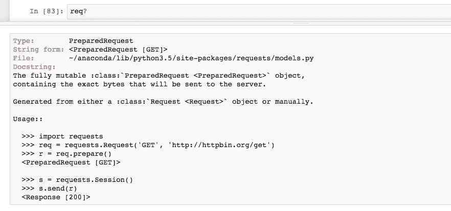

查看它的用法，我们可以看到如何使用会话发送请求。这类似于打开一个网页浏览器（启动会话），然后请求一个 URL。

1.  发起请求并将响应存储在一个名为 page 的变量中，运行以下代码：

```py
  with requests.Session() as sess:
  page = sess.send(req)
```

这段代码返回 HTTP 响应，通过`page`变量引用。通过使用 with 语句，我们初始化了一个作用范围仅限于缩进代码块的会话。这意味着我们不必显式地关闭会话，因为它会自动完成。

1.  运行笔记本中的接下来的两个单元格来检查响应。`page`的字符串表示应显示 200 状态码响应。这应该与`status_code`属性一致。

1.  将响应文本保存到 page_html 变量中，并通过`page_html[:1000]`查看字符串的头部：


如预期的那样，响应是 HTML。我们可以借助 BeautifulSoup 库更好地格式化这个输出，稍后我们将广泛使用它来解析 HTML。

1.  运行以下代码打印格式化 HTML 的头部：

```py
  from bs4 import BeautifulSoup
  print(BeautifulSoup(page_html, 'html.parser').prettify()[:1000])

```

我们导入 BeautifulSoup，然后打印格式化输出，输出中的新行根据它们在 HTML 结构中的层级关系进行缩进。

1.  我们可以进一步操作，实际上通过使用 IPython 显示模块在 Jupyter 中显示 HTML。通过运行以下代码来实现：

```py
  from IPython.display import HTML
  HTML(page_html) 
```

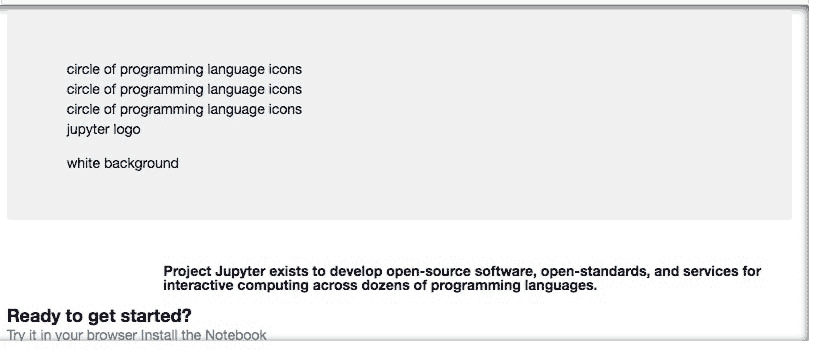

在这里，我们看到 HTML 渲染的效果，考虑到没有执行 JavaScript 代码，也没有加载外部资源。例如，托管在 jupyter.org 服务器上的图片没有被渲染，我们看到的是`alt 文本`：**编程图标的圆圈**、jupyter logo 等等。

1.  让我们将其与实时网站进行比较，该网站可以通过 IFrame 在 Jupyter 中打开。通过运行以下代码来实现：

```py
  from IPython.display import IFrame
  IFrame(src=url, height=800, width=800) 
```


在这里，我们可以看到整个网站被渲染出来，包括 JavaScript 和外部资源。事实上，我们甚至可以点击超链接，并在 IFrame 中加载那些页面，就像常规的浏览会话一样。

1.  关闭 IFrame 是一个良好的实践，这可以防止它占用过多的内存和处理能力。可以通过选择单元格并在 Jupyter Notebook 的 **Cell** 菜单中点击 **Current Outputs** | **Clear** 来关闭它。

回想一下我们如何使用一个准备好的请求和会话来获取内容并将其作为字符串在 Python 中使用。通常，我们也可以使用一个简便的方法来实现这一点。缺点是我们对请求头部的定制化程度较低，但通常这并不是什么问题。

1.  通过运行以下代码向 [`www.python.org/`](http://www.python.org/) 发起请求：

```py
  url = 'http://www.python.org/'
  page = requests.get(url)
  page
  <Response [200]> 
```

页面字符串表示（显示在单元格下方）应该显示一个 200 状态码，表示响应成功。

1.  运行接下来的两个单元格。在这里，我们打印页面的 `url` 和 `history` 属性。

返回的 URL 并不是我们输入的那个；注意到差异了吗？我们从输入的 URL [`www.python.org/`](http://www.python.org/) 被重定向到了该页面的安全版本 [`www.python.org/`](https://www.python.org/)。差异就在于协议中 URL 开头多了一个 s。所有的重定向信息都保存在历史记录属性中；在这个案例中，我们在其中找到了一个状态码为 301（永久重定向）的页面，它对应的是我们最初请求的 URL。

既然我们已经习惯了发起请求，现在我们将关注于解析 HTML。这有时是一门艺术，因为通常有多种方法可以处理它，而最佳方法往往取决于具体 HTML 的细节。

# 在 Jupyter Notebook 中解析 HTML

在从网页抓取数据时，在发起请求后，我们必须从响应内容中提取数据。如果内容是 HTML，那么最简单的方法是使用一个高级解析库，比如 Beautiful Soup。并不是说这是唯一的方式；原则上，我们也可以使用正则表达式或 Python 字符串方法，如 `split` 来提取数据，但采用这些方式会浪费时间，并且容易出错。因此，一般不推荐这样做，通常建议使用一个可信赖的解析工具。

为了理解如何从 HTML 中提取内容，了解 HTML 的基础知识非常重要。首先，HTML 代表 **超文本标记语言**。像 Markdown 或 XML（**可扩展标记语言**）一样，它只是用于标记文本的语言。

在 HTML 中，显示文本包含在 HTML 元素的内容部分，元素属性则指定该元素在页面上的显示方式。

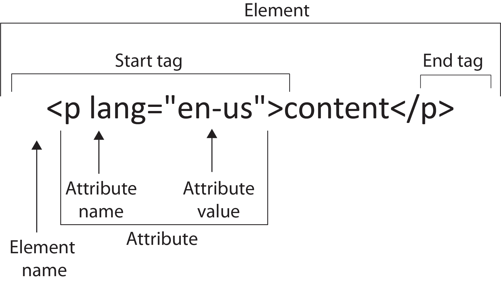

查看 HTML 元素的结构，如前图所示，我们可以看到内容被包裹在开始和结束标签之间。在这个例子中，标签是 `<p>`（段落）；其他常见的标签类型包括 `<div>`（文本块），`<table>`（数据表），`<h1>`（标题），``（图片），和 `<a>`（超链接）。标签有属性，属性可以存储重要的元数据。最常见的情况下，这些元数据用于指定元素文本在页面上的显示方式。此时 CSS 文件发挥作用。属性还可以存储其他有用信息，如 `<a>` 标签中的超链接 `href`，它指定了一个 URL 链接，或 `` 标签中的备用 alt 标签，用于在图片资源无法加载时显示的文本。

现在，让我们把注意力转回到 Jupyter Notebook，解析一些 HTML！虽然在本节学习时不一定需要使用，但在实际应用中，使用 Chrome 或 Firefox 的开发者工具来帮助识别感兴趣的 HTML 元素非常有用。接下来的章节我们会提供如何在 Chrome 中执行此操作的说明。

# 在 Jupyter Notebook 中使用 Python 解析 HTML

1.  在 `chapter-3-workbook.ipynb` 文件中，滚动到 `Parsing HTML with Python` 子主题的顶部。

在本节中，我们将抓取每个国家的中央银行利率，这些数据来自 Wikipedia。在进入代码之前，让我们先打开包含这些数据的网页。

1.  打开[`en.wikipedia.org/wiki/List_of_countries_by_central_bank_interest_rates`](https://en.wikipedia.org/wiki/List_of_countries_by_central_bank_interest_rates)这个链接，在浏览器中查看。尽可能使用 Chrome，因为在本节中我们将展示如何使用 Chrome 的开发者工具查看和搜索 HTML。

看这个页面，我们除了大列表的国家和其利率之外，几乎没有其他内容。这就是我们要抓取的表格。

1.  返回 Jupyter Notebook，并将 HTML 加载为 Beautiful Soup 对象，以便进行解析。通过运行以下代码来完成：

```py
  from bs4 import BeautifulSoup
  soup = BeautifulSoup(page.content, 'html.parser') 
```

我们使用 Python 默认的 `html.parser` 作为解析器，但如果需要，也可以使用第三方解析器，如 `lxml`。

通常，在使用像 Beautiful Soup 这样的新对象时，查看文档字符串是个好主意，方法是输入 `soup?`。然而，在这种情况下，文档字符串并不特别有用。另一个用于探索 Python 对象的工具是 `pdir`，它列出对象的所有属性和方法（可以通过 `pip install pdir2` 安装）。它本质上是 Python 内建 `dir` 函数的格式化版本。

1.  通过运行以下代码显示 BeautifulSoup 对象的属性和方法。无论是否安装了`pdir`外部库，都会运行此代码：

```py
 try:
 import pdir
 dir = pdir
 except:
 print('You can install pdir with:\npip install pdir2')
 dir(soup) 
```

在这里，我们看到一个方法和属性的列表，这些方法和属性可以在`soup`上调用。最常用的函数可能是`find_all`，它返回符合给定条件的元素列表。

1.  使用以下代码获取页面的 h1 标题：

```py
      h1 = soup.find_all('h1')
      h1
      >> [<h1 class="firstHeading" id="firstHeading" lang="en">
      List of countries by central bank interest rates</h1>] 
```

通常，页面上只有一个 H1 元素，因此很明显我们这里只找到一个。

1.  运行接下来的几个单元格。我们将 H1 重新定义为第一个（也是唯一的）列表元素，`h1 = h1[0]`，然后通过`h1.attrs`打印出 HTML 元素的属性：

```py
       >> {'class': ['firstHeading'], 'id': 'firstHeading', 'lang': 'en'} 
```

我们看到此元素的类和 ID，二者都可以通过 CSS 代码引用，以定义该元素的样式。

1.  通过打印`h1.text`获取 HTML 元素内容（即可见文本）。

1.  通过运行以下代码获取页面上的所有图片：

```py
      imgs = soup.find_all('img')
      len(imgs)
      >> 91 
```

页面上有很多图片，其中大多数是国家旗帜。

1.  通过运行以下代码打印每张图片的来源：

```py
      [element.attrs['src'] for element in imgs
        if 'src' in element.attrs.keys()] 
```


我们使用列表推导式遍历元素，选择每个元素的`src`属性（前提是该属性实际存在）。

现在，让我们抓取表格。我们将使用 Chrome 的开发者工具来定位包含该元素的部分。

1.  如果还没有完成，打开我们正在查看的维基百科页面（在 Chrome 中）。然后，在浏览器中从`视图菜单`中选择开发者工具。一个侧边栏将会打开。HTML 可以从开发者工具的`元素`标签中查看。

1.  选择工具侧边栏左上角的小箭头。这允许我们悬停在页面上，并查看 HTML 元素在侧边栏的“元素”部分的位置：

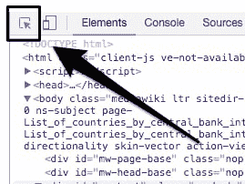

1.  将鼠标悬停在正文上，查看表格如何包含在具有`id="bodyContent"`的 div 中：

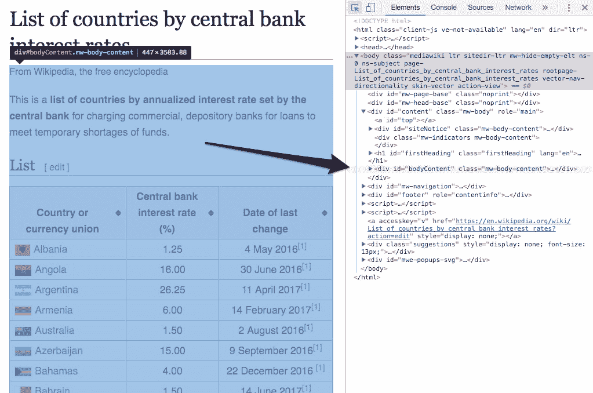

1.  通过运行以下代码选择该 div：

```py
     body_content = soup.find('div', {'id': 'bodyContent'}) 
```

我们现在可以在这个 HTML 的子集内查找表格。通常，表格被组织为标题`<th>`、行`<tr>`和数据条目`<td>`。

1.  通过运行以下代码获取表格标题：

```py
 table_headers = body_content.find_all('th')[:3]
 table_headers
 >>> [<th>Country or<br/>
 currency union</th>, <th>Central bank<br/>
 interest rate (%)</th>, <th>Date of last<br/>
 change</th>] 
```

在这里，我们看到三个标题。每个标题的内容中都有一个`<br/>`换行元素，这会使得文本稍微难以干净地解析。

1.  通过运行以下代码获取文本：

```py
      table_headers = [element.get_text().replace('\n', ' ')
      for element in table_headers]
      table_headers
      >> ['Country or currency union',
      'Central bank interest rate (%)',
      'Date of last change']
```

在这里，我们使用`get_text`方法获取内容，然后运行`replace string`方法以移除由`<br/>`元素引起的换行符。为了获取数据，我们首先进行一些测试，然后在一个单元格中抓取所有数据。

1.  通过运行以下代码获取第二个`<tr>`（行）元素中每个单元格的数据：

```py
      row_number = 2
      d1, d2, d3 = body_content.find_all('tr')[row_number]\.find_all('td')
```

我们找到所有的行元素，挑选出第三个，然后找出其中的三个数据元素。

让我们看看结果数据，看看如何解析每行的文本。

1.  运行接下来的几个单元格以打印`d1`及其`text`属性：


我们在前面获取了一些不需要的字符。这可以通过仅搜索`<a>`标签的文本来解决。

1.  运行`d1.find('a').text`以返回该单元格的正确清理数据。

1.  运行接下来的几个单元格以打印`d2`及其文本。此数据看起来足够干净，可以直接转换为平面格式。

1.  运行接下来的几个单元格以打印`d3`及其文本：


类似于`d1`，我们看到最好只获取`span`元素的文本。

1.  通过运行以下代码，正确解析此表格条目的日期：

```py
       d3.find_all('span')[0].text
       >> '30 June 2016' 
```

1.  现在，我们准备通过遍历行元素`<th>`来进行完整抓取。运行以下代码：

```py
       data = []
       for i, row in enumerate(body_content.find_all('tr')):
       ...
       ...
       >> Ignoring row 101 because len(data) != 3
       >> Ignoring row 102 because len(data) != 3 
```

我们遍历这些行，忽略任何包含三个以上数据元素的行。这些行不对应我们感兴趣的表格数据。那些确实包含三个数据元素的行被认为是表格中的数据，我们按照测试时确定的方式解析这些文本。

文本解析在`try/except`语句中完成，这将捕获任何错误并允许跳过该行而不会停止迭代。任何由于此语句导致错误的行应该进行检查。可以手动记录这些数据，或通过修改抓取循环并重新运行它来考虑这些行。在此情况下，为了节省时间，我们将忽略任何错误。

1.  通过运行`print(data[:10])`打印抓取数据列表的前 10 行：

```py
      >> [['Albania', 1.25, '4 May 2016'],
      ['Angola', 16.0, '30 June 2016'],
      ['Argentina', 26.25, '11 April 2017'],
      ['Armenia', 6.0, '14 February 2017'],
      ['Australia', 1.5, '2 August 2016'],
      ['Azerbaijan', 15.0, '9 September 2016'],
      ['Bahamas', 4.0, '22 December 2016'],    
      ['Bahrain', 1.5, '14 June 2017'],
      ['Bangladesh', 6.75, '14 January 2016'],
      ['Belarus', 12.0, '28 June 2017']] 
```

1.  我们将在本章稍后可视化这些数据。现在，先通过运行以下代码将数据保存为 CSV 文件：

```py
       f_path = '../data/countries/interest-rates.csv'
       with open(f_path, 'w') as f:
         f.write('{};{};{}\n'.format(*table_headers))
         for d in data:
           f.write('{};{};{}\n'.format(*d))
```

请注意，我们使用分号来分隔字段。

# 活动：使用 Jupyter Notebooks 进行网页抓取

我们将获取每个国家的人口数据。然后，在下一个主题中，这些数据将与上一节抓取的利率数据一起进行可视化。

本次活动中我们查看的页面可以在此访问：[`www.worldometers.info/world-population/population-by-country/`](http://www.worldometers.info/world-population/population-by-country/)。现在我们已经了解了网页抓取的基础知识，接下来我们将相同的技术应用到一个新网页并抓取更多数据！

由于本文档创建时页面可能已发生变化，如果此 URL 不再指向国家人口表格，请使用此 Wikipedia 页面：[`en.wikipedia.org/wiki/List_of_countries_by_population_(United_Nations)`](https://en.wikipedia.org/wiki/List_of_countries_by_population_(United_Nations))。

1.  对于此页面，数据可以使用以下代码片段进行抓取：

```py
      data = []
      for i, row in enumerate(soup.find_all('tr')):
          row_data = row.find_all('td')
              try:
                  d1, d2, d3 = row_data[1], row_data[5], row_data[6]
                  d1 = d1.find('a').text
                  d2 = float(d2.text)
                  d3 = d3.find_all('span')[1].text.replace('+', '')
              data.append([d1, d2, d3])
          except:
      print('Ignoring row {}'.format(i)) 
```

1.  在`chapter-3-workbook.ipynb` Jupyter Notebook 中，滚动至`Activity Web scraping with Python`部分。

1.  设置`url`变量并通过运行以下代码在笔记本中加载我们的页面的 IFrame：

```py
      url ='http://www.worldometers.info/world-population/
                population-bycountry/'
      IFrame(url, height=300, width=800)
```

1.  通过选择单元格并点击 Jupyter Notebook 的 Cell 菜单中的“Current Outputs | Clear”，来关闭 IFrame。

1.  通过运行以下代码请求页面并将其加载为 BeautifulSoup 对象：

```py
       page = requests.get(url)
       soup = BeautifulSoup(page.content,'html.parser') 
```

我们将页面内容传递给`BeautifulSoup`构造函数。回想一下，之前我们使用的是`page.text`。它们的区别在于，`page.content`返回的是原始的二进制响应内容，而`page.text`返回的是`UTF-8`解码后的内容。通常最好将字节对象传递给`BeautifulSoup`，让它来进行解码，而不是使用 Requests 中的`page.text`来处理。

1.  通过运行以下代码打印页面的`H1`：

```py
      soup.find_all('h1')
      >> [<h1>Countries in the world by population (2017)</h1>] 
```

我们将通过搜索`<th>`、`<tr>`和`<td>`元素来抓取表格数据，正如在前一部分中所做的那样。

1.  通过运行以下代码获取并打印表头：

```py
        table_headers = soup.find_all('th')
        table_headers
        >> [<th>#</th>,
            <th>Country (or dependency)</th>,
            <th>Population<br/> (2017)</th>,
           <th>Yearly<br/> Change</th>,
            <th>Net<br/> Change</th>,
            <th>Density<br/> (P/Km²)</th>,
            <th>Land Area<br/> (Km²)</th>,
           <th>Migrants<br/> (net)</th>,
            <th>Fert.<br/> Rate</th>,
            <th>Med.<br/> Age</th>,
            <th>Urban<br/> Pop %</th>,
           <th>World<br/> Share</th>] 
```

1.  我们只对前三列感兴趣。选择这些列并使用以下代码解析文本：

```py
      table_headers = table_headers[1:4]
      table_headers = [t.text.replace('\n', '') for t in table_headers]
```

在选择我们想要的表头子集后，我们将从每个表头中解析文本内容，并去除任何换行符。

现在，我们来获取数据。按照前一部分的流程，我们将测试如何解析一行样本数据。

1.  通过运行以下代码获取一行样本数据：

```py
     row_number = 2
     row_data = soup.find_all('tr')[row_number]\.find_all('td') 
```

1.  我们有多少列数据？通过运行`print(len(row_data))`来打印`row_data`的长度。

1.  通过运行`print(row_data[:4])`来打印前四个元素：

```py
      >> [<td>2</td>,
      <td style="font-weight: bold; font-size:15px; text-align:left"><a
      href="/world-population/india-population/">India</a></td>,
      <td style="font-weight: bold;">1,339,180,127</td>,
      <td>1.13 %</td>]
```

很明显，我们需要选择索引 1、2 和 3。第一个数据值可以忽略，因为它仅仅是索引。

1.  通过运行以下代码选择我们感兴趣的解析数据元素：

```py
      d1, d2, d3 = row_data[1:4] 

```

1.  看一下`row_data`的输出，我们可以找出如何正确地解析数据。我们将选择第一个数据元素中的`<a>`元素的内容，然后简单地从其他元素中提取文本。通过运行以下代码来测试这些假设：

```py
       print(d1.find('a').text)
       print(d2.text)
       print(d3.text)
       >> India
       >> 1,339,180,127
       >> 1.13 % 
```

很棒！看起来这运行得很顺利。现在，我们准备抓取整个表格。

1.  通过运行以下代码抓取并解析表格数据：

```py
      ata = []
      for i, row in enumerate(soup.find_all('tr')):
         try:
             d1, d2, d3 = row.fid_all('td')[1:4]
             d1 = d1.fid('a').text
             d2 = d2.text
             d3 = d3.text
             data.append([d1, d2, d3])
         except:
             print('Error parsing row {}'.format(i))

         >> Error parsing row 0 
```

这与之前的情况非常相似，当我们尝试解析文本时，如果出现错误，我们会跳过这一行。

1.  通过运行`print(data[:10])`来打印抓取数据的前十条：

```py
      >> [['China', '1,409,517,397', '0.43 %'],
      ['India', '1,339,180,127', '1.13 %'],
      ['U.S.', '324,459,463', '0.71 %'],
      ['Indonesia', '263,991,379', '1.10 %'],    
      ['Brazil', '209,288,278', '0.79 %'],
      ['Pakistan', '197,015,955', '1.97 %'],
      ['Nigeria', '190,886,311', '2.63 %'],
      ['Bangladesh', '164,669,751', '1.05 %'],
      ['Russia', '143,989,754', '0.02 %'],
      ['Mexico', '129,163,276', '1.27 %']] 
```

看起来我们已经成功地抓取了数据！请注意，尽管这个网页完全不同，但这个表格的抓取过程与维基百科的表格非常相似。当然，数据不一定总是以表格的形式存在，但无论如何，我们通常可以使用`find_all`作为主要的解析方法。

1.  最后，将数据保存为一个`CSV 文件`以供后续使用。通过运行以下代码实现：

```py
      f_path = '../data/countries/populations.csv'
      with open(f_path, 'w') as f:
        f.write('{};{};{}\n'.format(*table_headers))
        for d in data:
          f.write('{};{};{}\n'.format(*d)) 
```

总结一下，我们已经了解了如何使用 Jupyter Notebook 进行网页抓取。我们从学习 HTTP 方法和状态码开始。然后，我们使用 Requests 库来实际执行 HTTP 请求，并看到了如何使用 Beautiful Soup 库来解析 HTML 响应。

我们的 Jupyter Notebook 证明是进行此类工作的一个很好的工具。我们能够探索网页请求的结果，并尝试各种 HTML 解析技术。我们还能够在笔记本中渲染 HTML，甚至加载网页的实时版本！

在本章的下一个主题中，我们将转向一个全新的话题：交互式可视化。我们将展示如何在笔记本中创建和显示交互式图表，并使用这些图表作为探索我们刚刚收集的数据的一种方式。

# 交互式可视化

可视化是从数据集中提取信息的一个非常有用的手段。例如，通过条形图，比起查看表格中的数值，区分数值分布变得非常容易。当然，正如我们在本书前面所看到的，它们还可以用来研究数据集中一些否则很难识别的模式。此外，它们还可以帮助向不熟悉的人解释数据集。例如，如果包含在博客文章中，它们可以提升读者的兴趣，并用来打破一块块的文字内容。

当我们考虑交互式可视化时，它的好处与静态可视化相似，但由于它们允许观众进行主动探索，因此更加增强。不仅允许观众回答他们可能对数据有的问题，还可以在探索过程中提出新的问题。这对像博客读者或同事这样的外部人员有益，对于创作者来说也同样重要，因为它允许他们在不修改任何代码的情况下，轻松地对数据进行详细的即兴探索。

在本节中，我们将讨论并展示如何使用 Bokeh 在 Jupyter 中构建交互式可视化。但在此之前，我们将简要回顾 pandas 的 DataFrame，它在使用 Python 进行数据可视化时发挥着重要作用。

# 构建一个用于存储和组织数据的 DataFrame

正如我们在本书中一再看到的，pandas 是使用 Python 和 Jupyter Notebooks 进行数据科学的一个重要组成部分。DataFrame 提供了一种组织和存储带标签数据的方式，但更重要的是，pandas 提供了节省时间的方法，用于在 DataFrame 中转换数据。本书中我们看到的一些例子包括删除重复项、将字典映射到列、对列应用函数，以及填充缺失值。

关于可视化，数据框提供了创建各种 matplotlib 图形的方法，包括`df.plot.barh()`、`df.plot.hist()`等。交互式可视化库 Bokeh 以前依赖 Pandas 数据框来生成其*高级*图表。这些图表的工作方式类似于 Seaborn，正如我们在前一章看到的那样，其中数据框作为输入传递给绘图函数，并指定需要绘制的列。然而，Bokeh 的最新版本已不再支持这种行为。现在，图形的创建方式与 matplotlib 类似，数据可以存储在简单的列表或 NumPy 数组中。讨论的要点是，数据框并非绝对必要，但仍然非常有助于在可视化之前组织和处理数据。

# 构建和合并 Pandas 数据框

让我们直接进入一个练习，继续处理之前抓取的国家数据。回想一下，我们提取了每个国家的中央银行利率和人口，并将结果保存在 CSV 文件中。接下来，我们将从这些文件加载数据并将其合并成一个数据框，然后将作为后续交互式可视化的数据源。

1.  在`chapter-3-workbook.ipynb` Jupyter Notebook 中，滚动到子主题`构建一个数据框以存储和组织数据`。

我们首先将从`CSV 文件`加载数据，这样它就恢复到抓取后原始的状态。这将使我们能够练习从 Python 对象构建数据框，而不是使用`pd.read_csv`函数。

使用`pd.read_csv`时，每一列的数据类型将根据字符串输入自动推断。另一方面，当我们使用`pd.DataFrame`时，数据类型将根据输入变量的类型来决定。就我们来说，正如将要看到的，我们在读取文件后不会立即将变量转换为数字或日期时间类型，而是在实例化数据框后进行转换。

1.  通过运行以下代码将 CSV 文件加载到列表中：

```py
        with open('../data/countries/interest-rates.csv', 'r') as f:
          int_rates_col_names = next(f).split(',')
          int_rates = [line.split(',') for line in f.read().splitlines()]
        with open('../data/countries/populations.csv', 'r') as f:
          populations_col_names = next(f).split(',')
          populations = [line.split(',') for line in f.read().splitlines()] 
```

1.  通过运行接下来的两个单元格，检查结果列表的样子。我们应该能看到类似以下的输出：

```py
      print(int_rates_col_names)
      int_rates[:5]
      >> ['Country or currency union', 'Central bank interest ...    
      ...
      ['Indonesia', '263', '991', '379', '1.10 %'],    
      ['Brazil', '209', '288', '278', '0.79 %']] 
```

现在，数据处于标准的 Python 列表结构中，就像在前面章节从网页抓取后一样。接下来，我们将创建两个数据框并将它们合并，以便将所有数据组织到一个对象中。

1.  通过运行以下代码，使用标准的数据框构造函数创建两个数据框：

```py
      df_int_rates = pd.DataFrame(int_rates,columns=int_rates_col_names)
      df_populations = pd.DataFrame(populations,
                      columns=populations_col_names) 

```

这不是我们第一次在本书中使用这个函数。这里，我们传递数据列表（如前所示）和相应的列名。输入数据也可以是字典类型，当每列数据分别存储在不同的列表中时，这种方式非常有用。

接下来，我们将清理每个数据框。从利率数据框开始，让我们打印出前几行和后几行，并列出数据类型。

1.  显示整个数据框时，默认的最大行数为 60（适用于版本 0.18.1）。让我们通过运行以下代码将其减少为 10：

```py
      pd.options.display.max_rows = 10 
```

1.  通过运行以下代码显示利率数据框的头部和尾部：

```py
      df_int_rates 
```

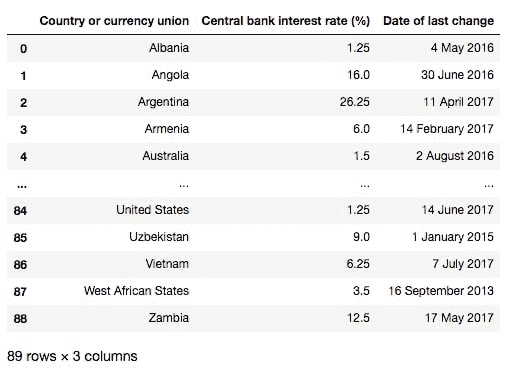

1.  通过运行以下命令打印数据类型：

```py
      df_int_rates.dtypes
      >> Country or currency union object
      >> Central bank interest rate (%) object
      >> Date of last change object
      >> dtype: object 
```

Pandas 已将每一列分配为字符串数据类型，这是合理的，因为输入变量都是字符串。我们将需要分别将这些转换为字符串、浮动和日期时间类型。

1.  通过运行以下代码将数据转换为正确的类型：

```py
        df_int_rates['Central bank interest rate (%)'] = \
        df_int_rates['Central bank interest rate (%)']\
        .astype(float,copy=False)
        df_int_rates['Date of last change'] = \
        pd.to_datetime(df_int_rates['Date of last change']) 
```

我们使用`astype`将利率值转换为浮动类型，并设置`copy=False`以节省内存。由于日期值的格式非常易读，因此可以通过使用`pd.to_datetime`轻松地将其转换。

1.  通过运行以下代码检查每一列的新数据类型：

```py
      df_int_rates.dtypes
        >> Country or currency union             object
        >> Central bank interest rate (%)        float64
        >> Date of last change             datetime64[ns]
        >> dtype: object
```

如所见，现在所有数据都已正确格式化。

1.  让我们对另一个数据框应用相同的过程。运行接下来的几个单元格来重复对`df_populations`执行前面的步骤：

```py
 df_populations 
```

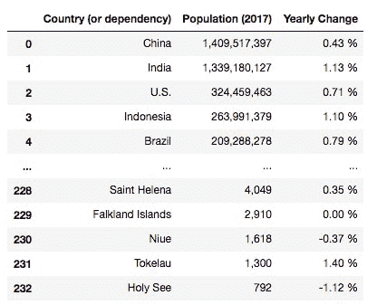

然后，运行此代码：

```py
      df_populations['Population (2017)'] = df_populations['Population
      (2017)']\.str.replace(',', '')\
      .astype(float, copy=False)
      df_populations['Yearly Change'] = df_populations['Yearly Change']\
      .str.rstrip('%')\
      .astype(float, copy=False) 
```

为了将数值列转换为浮动类型，我们必须首先对这些字符串做一些修改。我们使用字符串方法去掉了人口数据中的逗号，并去除了“年变化”列中的百分号。

现在，我们将根据每一行的国家名称合并数据框。请记住，这些仍然是从网络抓取的原始国家名称，因此在匹配字符串时可能需要进行一些工作。

1.  通过运行以下代码合并数据框：

```py
       df_merge = pd.merge(df_populations,
         df_int_rates,
         left_on='Country (or dependency)',
         right_on='Country or currency union',
         how='outer'
       df_merge

```

我们将左侧数据框中的人口数据和右侧数据框中的利率数据传入，并在国家列上执行外连接匹配。这将导致在两者不重叠的地方出现`NaN 值`。

1.  为了节省时间，让我们仅查看人口最多的国家，看看是否漏掉了任何匹配。理想情况下，我们应该检查所有内容。通过运行以下代码查看人口最多的国家：

```py
      df_merge.sort_values('Population (2017)', ascending=False)\ .head(10)
```

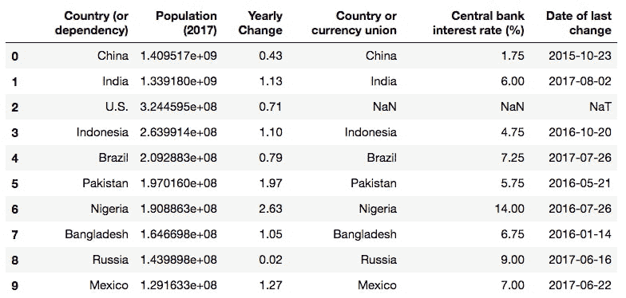

看起来美国（U.S.）没有匹配上。这是因为在利率数据中它被列为“United States”。让我们来修复这个问题。

1.  通过运行以下代码修正人口表中美国（U.S.）的标签：

```py
      col = 'Country (or dependency)'    
      df_populations.loc[df_populations[col] == 'U.S.'] = 'United States'
```

我们使用`loc`方法定位该行，并重命名人口数据框中的国家名称。现在，让我们正确地合并数据框。

1.  再次根据国家名称合并数据框，但这次使用内部合并来删除`NaN`值：

```py
      df_merge = pd.merge(df_populations,
                    df_int_rates,
                    left_on='Country (or dependency)',
                    right_on='Country or currency union',
                    how='inner') 
```

1.  我们在合并后的数据框中留下了两列相同的内容。通过运行以下代码删除其中一列：

```py
      del df_merge['Country or currency union'] 
```

1.  通过运行以下代码重命名列：

```py
      name_map = {'Country (or dependency)': 'Country',
          'Population (2017)': 'Population',
          'Central bank interest rate (%)': 'Interest rate'}

      df_merge = df_merge.rename(columns=name_map)     
```

我们得到了以下合并和清理后的数据框：

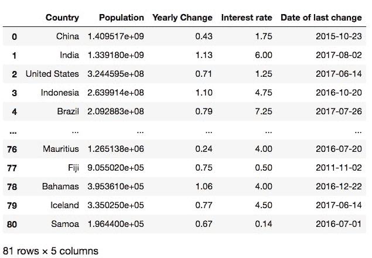

1.  现在我们已经将所有数据整理成一个结构良好的表格，接下来进入有趣的部分：可视化。我们将把这个表格保存为`CSV 文件`以供以后使用，然后讨论如何使用 Bokeh 创建可视化。使用以下代码将合并后的数据写入`CSV 文件`以供以后使用：

```py
      df_merge.to_csv('../data/countries/merged.csv', index=False)
```

# Bokeh 简介

Bokeh 是一个用于 Python 的交互式可视化库。其目标是提供类似于流行的 JavaScript 交互式可视化库`D3`的功能。Bokeh 的工作方式与`D3`截然不同，这并不令人惊讶，因为 Python 和 JavaScript 之间存在差异。总体而言，它更简单，且不像`D3`那样允许进行大量定制。然而，这正是它的优势所在，因为它更易于使用，并且仍然拥有一套出色的功能，我们将在本节中进行探讨。

让我们通过 Jupyter 笔记本的快速练习，直接通过示例介绍 Bokeh。

Bokeh 的在线文档很完善，但很多内容已经过时。例如，在 Google 中搜索`Bokeh 条形图`通常会找到旧版模块的文档，这些模块已经不再存在，如以前可以通过`bokeh.charts`访问的高级绘图工具（版本 0.12.0 之前）。这些工具接收类似于 Seaborn 绘图函数的 pandas DataFrame 作为输入。删除这些高级绘图工具模块使得 Bokeh 变得更加简化，并且能够专注于更有针对性的开发。现在，绘图工具主要被归类到 bokeh.`plotting 模块`中，正如在接下来的练习和活动中所看到的那样。

# 使用 Bokeh 进行交互式可视化简介

我们将加载所需的 Bokeh 模块，并展示一些简单的交互式图表，这些图表可以通过 Bokeh 创建。请注意，本书中的示例是使用 Bokeh 0.12.10 版本设计的。

1.  在`chapter-3-workbook.ipynb` Jupyter 笔记本中，滚动到子主题`Bokeh 简介`。

1.  与 scikit-learn 类似，Bokeh 模块通常是分块加载的（与 pandas 不同，后者会一次性加载整个库）。通过运行以下代码来导入一些基本的绘图模块：

```py
      from bokeh.plotting 
      import figure, show, output_notebook output_notebook()
```

我们需要运行`output_notebook()`，以便在 Jupyter 笔记本中渲染交互式可视化。

1.  通过运行以下代码生成随机数据进行绘图：

```py
      np.random.seed(30)
      data = pd.Series(np.random.randn(200),
      index=list(range(200)))\
      .cumsum()
      x = data.index
      y = data.values
```

随机数据是通过累积求和一组随机数生成的，这些随机数分布在零附近。其效果类似于股票价格时间序列的趋势。

1.  通过运行以下代码在 Bokeh 中绘制数据的折线图：

```py
      p = figure(title='Example plot', x_axis_label='x', y_axis_label='y') 
      p.line(x, y, legend='Random trend') show(p)
```

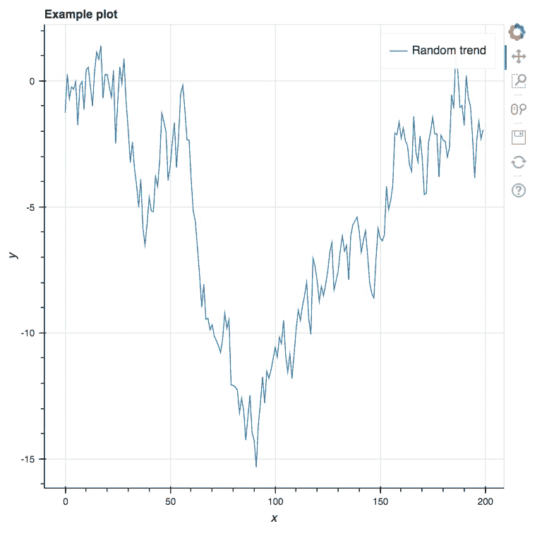

我们实例化了图形，如变量 p 所引用的那样，然后绘制了一条线。在 Jupyter 中运行这段代码会生成一个交互式图形，并在右侧显示各种选项。

前三个选项（截至版本 0.12.10）是**平移**、**框缩放**和**滚轮缩放**。尝试使用这些选项并实验它们的工作方式。使用重置选项重新加载默认的图表限制。

1.  其他图表可以通过`figure`的替代方法创建。通过运行以下代码绘制散点图，在该代码中，我们将前述代码中的`line`替换为`circle`：

```py
      size = np.random.rand(200) * 5
      p = figure(title='Example plot', x_axis_label='x', y_axis_label='y')
      p.circle(x, y, radius=size, alpha=0.5, legend='Random dots')
      show(p) 
```

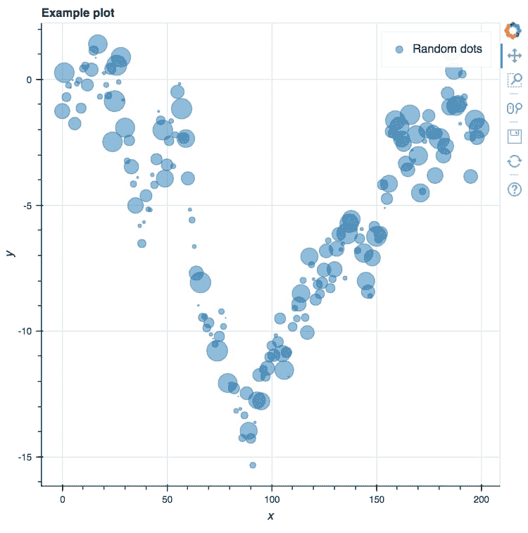

在这里，我们使用一组随机数字来指定每个圆的大小。

交互式可视化的一个非常诱人的功能是工具提示。这是一个悬停工具，允许用户通过悬停在某个点上来获取该点的信息。

1.  为了添加这个工具，我们将使用一种稍微不同的方法来创建图表。这将需要我们导入一些新的库。请运行以下代码：

```py
      p.circle(x, y, radius=size, alpha=0.5, legend='Random dots') show(p)
```

这次，我们将创建一个数据源并传递给绘图方法。它可以包含元数据，这些元数据可以通过悬停工具包含在可视化中。

1.  通过运行以下代码创建随机标签并绘制带有悬停工具的交互式可视化：

```py
      source = ColumnDataSource(data=dict(
      x=x,
      y=y,
      ...
      ...
      source=source,
        legend='Random dots')
      show(p) 
```

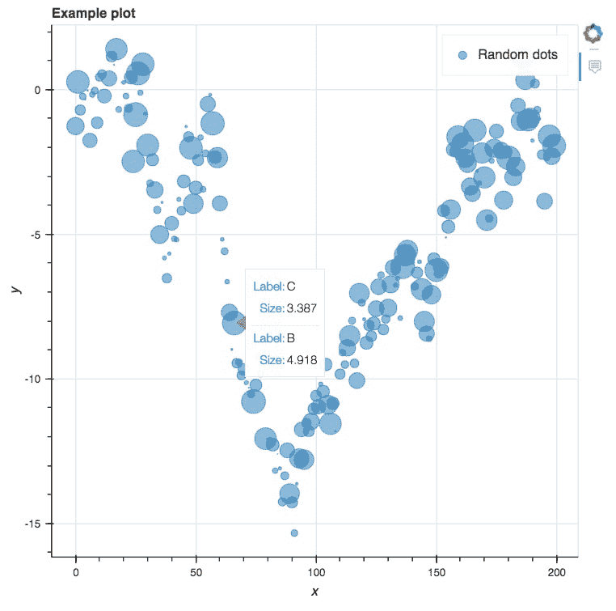

我们通过将一个键值对字典传递给`ColumnDataSource`构造函数来定义图表的数据源。该数据源包括每个点的*x*位置、*y*位置和大小，以及每个点的随机字母*A*、*B*或*C*。这些随机字母将作为悬停工具的标签，并显示每个点的大小。

然后将**悬停工具**添加到图表中，通过特定的绘图方法从每个元素中提取数据，在此例中是圆形。

结果是，我们现在可以在点上悬停并查看我们为**悬停工具**选择的数据！

我们注意到，通过查看位于图表右侧的工具栏，可以发现通过显式包含**悬停工具**，其他工具已经消失。通过手动将它们添加到传递给`bokeh.plotting.figure`的工具对象列表中，可以重新显示这些工具。

1.  通过运行以下代码，向图表添加平移、缩放和重置工具：

```py
     from bokeh.models 
     import PanTool, BoxZoomTool, WheelZoomTool, ResetTool
     ...
     ...
        legend='Random dots')
        show(p)
```

这段代码与之前展示的完全相同，唯一不同的是工具变量，它现在引用了我们从 Bokeh 库导入的多个新工具。

我们将在这里停止介绍性练习，但将在接下来的活动中继续创建和探索图表。

# 活动：通过交互式可视化探索数据

我们将继续使用 Bokeh，从前一个练习中断的位置开始，除了不再使用随机生成的数据，而是使用我们在本章第一部分从网页抓取的数据。

使用 Bokeh 来创建我们的抓取数据的交互式可视化。

1.  在`chapter-3-workbook.ipynb`文件中，滚动到`Activity: Interactive visualizations with Bokeh`部分。

1.  通过运行以下代码，加载先前抓取、合并和清理的网页数据：

```py
      df = pd.read_csv('../data/countries/merged.csv')
      df['Date of last change'] = pd.to_datetime(df['Date of last change']) 
```

1.  通过显示 DataFrame 来回顾数据的样子：

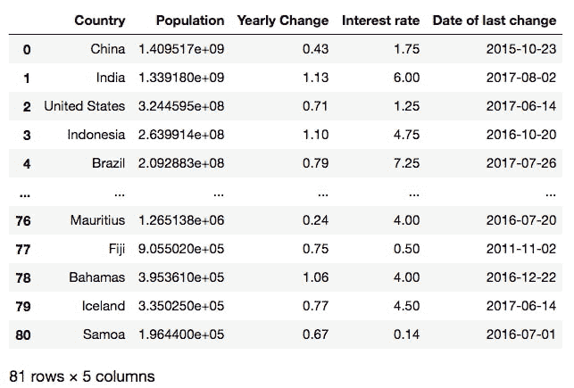

而在前一个练习中，我们关注的是了解 Bokeh 的工作原理，现在我们关注的是这份数据的样子。为了探索这个数据集，我们将使用交互式可视化。

1.  通过运行以下代码绘制人口与利率之间关系的散点图：

```py
      source = ColumnDataSource(data=dict(
          x=df['Interest rate'],
          y=df['Population'],
          desc=df['Country'],
       ))
       hover = HoverTool(tooltips=[
          ('Country', '@desc'),
          ('Interest Rate (%)', '@x'),
          ('Population', '@y')    
       ])
       tools = [hover, PanTool(), BoxZoomTool(), 
       WheelZoomTool(), ResetTool()]
          p = figure(tools=tools,
          x_axis_label='Interest Rate (%)',
          y_axis_label='Population')
       p.circle('x', 'y', size=10, alpha=0.5, source=source)
       show(p) 
```


这与我们在前一个练习中介绍 Bokeh 时看到的最终示例非常相似。我们设置了一个自定义数据源，其中包含每个点的 x 和 y 坐标，以及国家名称。这个国家名称会传递给**悬停工具**，使其在鼠标悬停在点上时可见。我们将此工具传递给图形，并添加了一组其他有用的工具。

1.  在数据中，我们看到一些明显的人口高峰值。将鼠标悬停在这些点上，查看它们对应的国家：

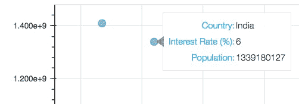

我们看到它们属于印度和中国。这些国家的利率相对平均。让我们使用**框选缩放**工具来调整视图窗口的大小，专注于其余的点。

1.  选择**框选缩放**工具，并调整视图窗口，以更好地查看大部分数据：

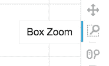

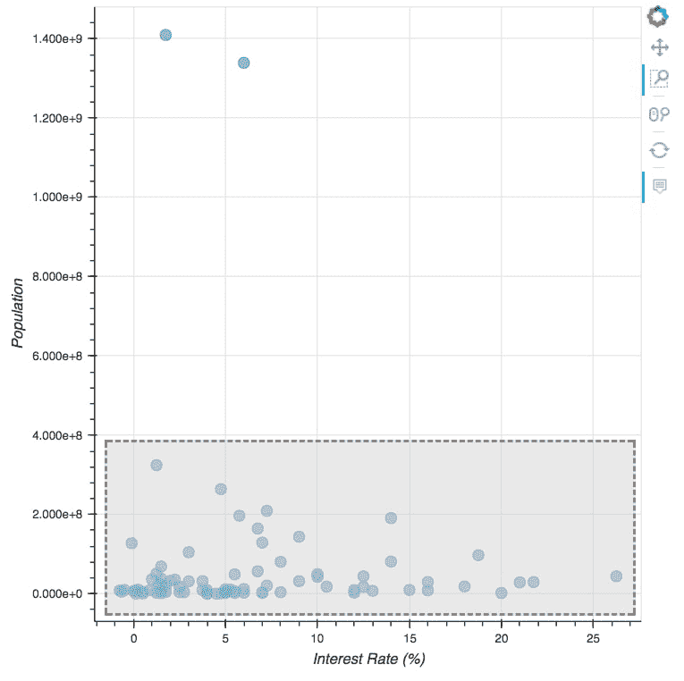

探索这些点，看看不同国家的利率是如何比较的。哪些国家的利率最高？

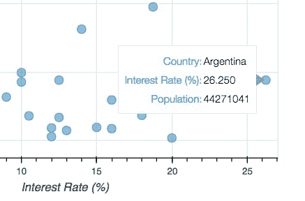

1.  一些人口较少的国家似乎出现了负利率。选择**滚轮缩放**工具并使用它来放大这一地区。如果需要，可以使用**平移**工具重新调整图表的中心，使负利率样本显示在视图中。将鼠标悬停在这些样本上，查看它们对应的国家：

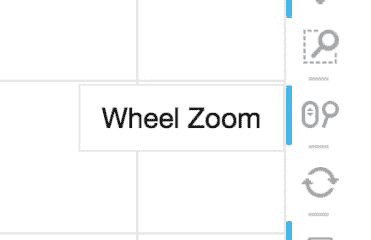

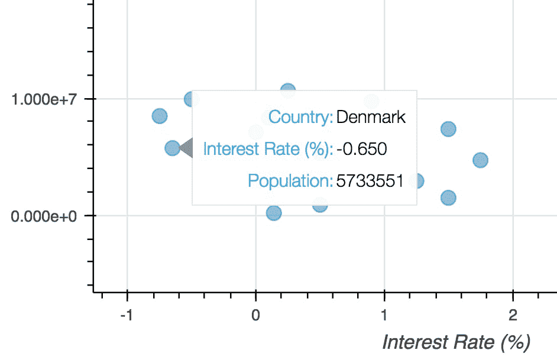

让我们重新绘制图形，基于最后利率变化的日期添加颜色。这对于搜索最后变动日期与利率或人口规模之间的关系非常有用。

1.  通过运行以下代码向 DataFrame 添加“最后变动年份”列：

```py
      def get_year(x):
        year = x.strftime('%Y')
        if year in ['2018', '2017', '2016']:
            return year
      else:         
            return 'Other'
      df['Year of last change'] = df['Date of last change'].apply(get_year)
```

我们首先定义一个函数，按最后变动年份对样本进行分组，然后将该函数应用于**最后变动日期**列。接下来，我们需要将这些值映射到颜色，以便进行可视化。

1.  通过运行以下代码创建一个地图，将最后变动日期分组到不同颜色类别中：

```py
      year_to_color = {
      '2018': 'black',
      '2017': 'blue',
      '2016': 'orange',
      'Other':'red'
      } 
```

一旦映射到`最后变动年份`列，这将根据可用的类别（2018 年、2017 年、2016 年和其他）将值分配给颜色。这里的颜色是标准字符串，但它们也可以用十六进制代码表示。

1.  通过运行以下代码创建彩色可视化：

```py
      source = ColumnDataSource(data=dict(
      x=df['Interest rate'],
      ...
      ...
          fill_color='colors', line_color='black',
          legend='label')
      show(p) 
```

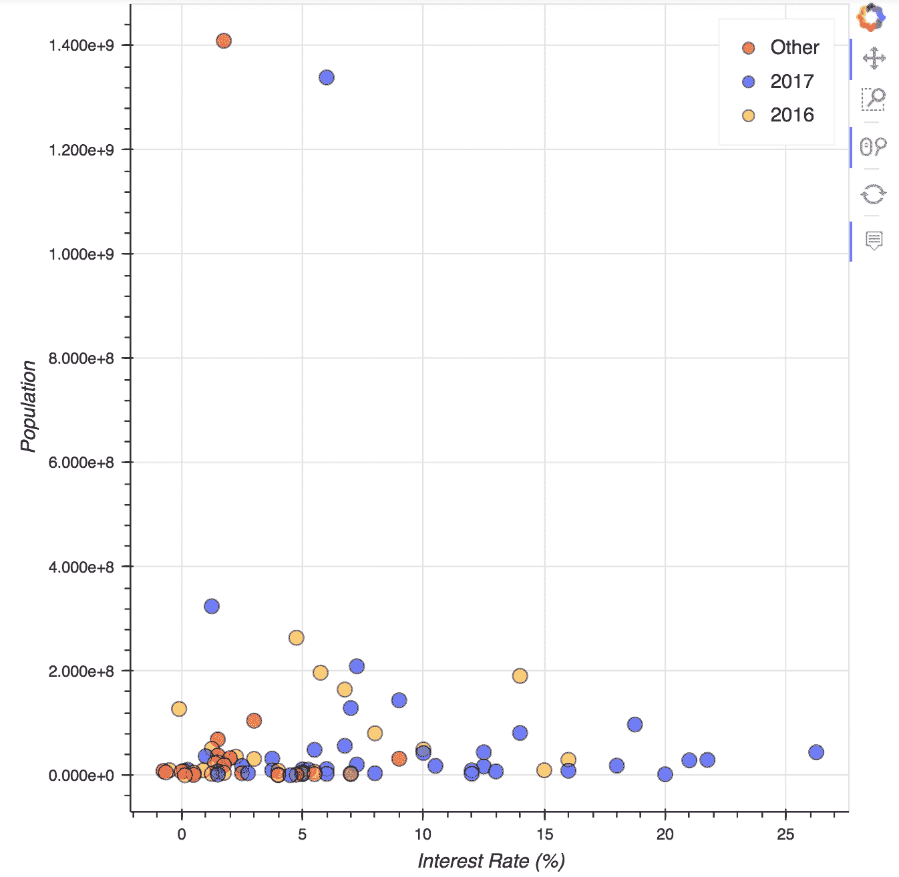

这里有一些重要的技术细节。首先，我们为每个点添加颜色和标签到`ColumnDataSource`中。然后在绘制圆圈时通过设置`fill_color`和 legend 参数引用这些信息。

1.  寻找模式，放大低人口国家的数据：

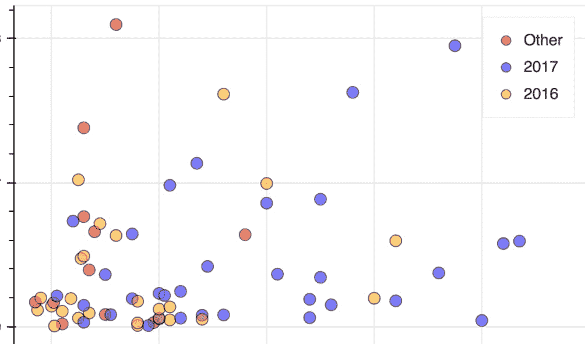

我们可以看到在绘图的右侧，黑色点更为显著。这表明利率较高的国家更有可能最近进行更新。

我们尚未查看的数据列是年度人口变化。让我们将其与利率进行比较，并查看是否存在任何趋势。我们还将通过基于国家人口设置圆圈大小来增强图表。

1.  将利率作为年度人口变化的函数来绘制，运行以下代码：

```py
      source = ColumnDataSource(data=dict(
          x=df['Yearly Change'],
      ...
      ...
      p.circle('x', 'y', size=10, alpha=0.5, source=source,    
      radius='radii')
      show(p) 
```

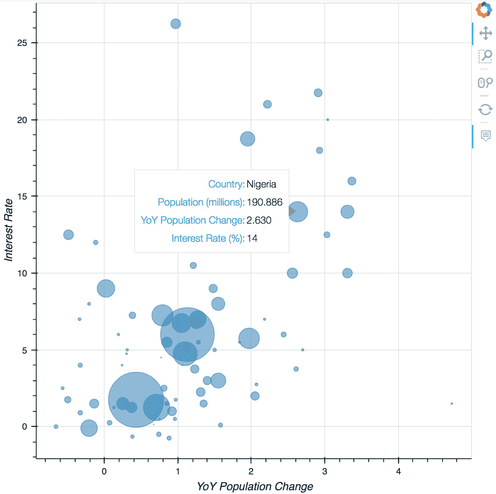

在这里，我们使用人口的平方根来作为半径，同时确保将结果缩小到适合可视化的尺寸。

我们看到年度人口变化与利率之间存在很强的相关性。当我们考虑人口规模时，这种相关性尤为明显，主要观察较大的圆圈。让我们添加一条最佳拟合线到图表中来说明这种相关性。

我们将使用 scikit-learn 根据国家人口（如在前面的图表中可视化）创建最佳拟合线。

1.  运行以下代码确定先前绘制的关系的最佳拟合线：

```py
        from sklearn.linear_model import LinearRegression
        X = df['Yearly Change'].values.reshape(-1, 1)
        y = df['Interest rate'].values
        weights = np.sqrt(df['Population'])/1e5
        lm = LinearRegression()
        lm.fit(X, y, sample_weight=weights)
        lm_x = np.linspace(X.flatten().min(), X.flatten().max(), 50)
        lm_y = lm.predict(lm_x.reshape(-1, 1)) 
```

Scikit-learn 代码应该在本书的早些时候就已经很熟悉了。正如承诺的那样，我们使用转换后的人口数据，就像在前面的图表中所见，作为权重。然后通过预测线性模型值的一系列*x*值来计算最佳拟合线。

要绘制线条，我们可以重复前面的代码，并在 Bokeh 中的线模块中添加额外的调用。我们还需要为这条线设置一个新的数据源。

1.  重新绘制前面的图表，并通过运行以下代码添加最佳拟合线：

```py
      source = ColumnDataSource(data=dict(
          x=df['Yearly Change'],
          y=df['Interest rate'],
       ...
       ...
       p.line('x', 'y', line_width=2, line_color='red',
          source=lm_source)
          show(p)
```

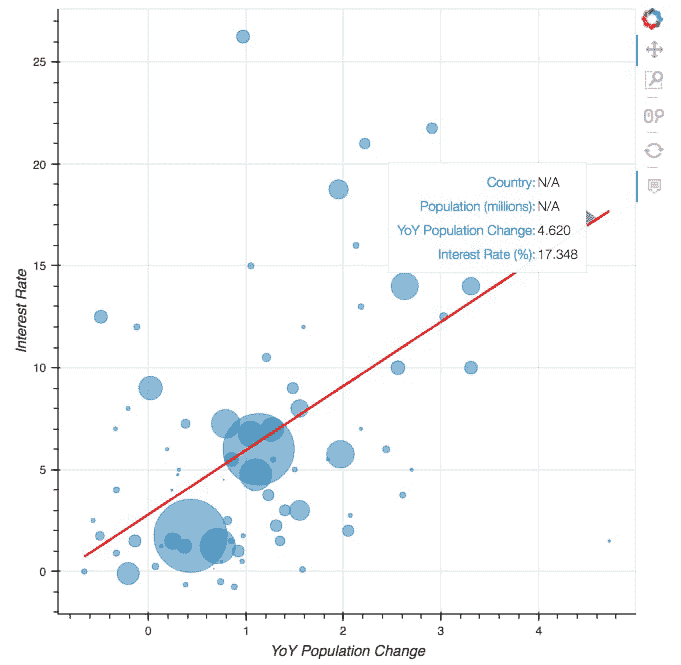

对于线条源`lm_source`，我们将国家名称和人口设置为 N/A，因为它们对于最佳拟合线不适用。当悬停在线条上时，可以看到它们确实出现在工具提示中。

这种可交互的可视化方式让我们有机会探索数据集中的离群值，例如右下角的小点。

1.  使用缩放工具并悬停在有趣的样本上来探索这个图表。请注意以下内容：

+   +   乌克兰的利率异常高，考虑到低的年度人口变化：

+   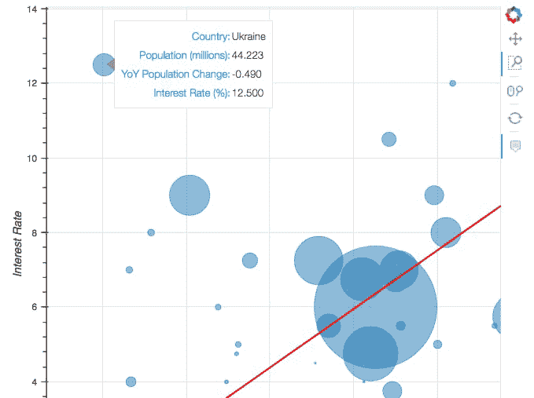

    +   作为一个小国家，巴林的利率异常低，考虑到高的年度人口变化：

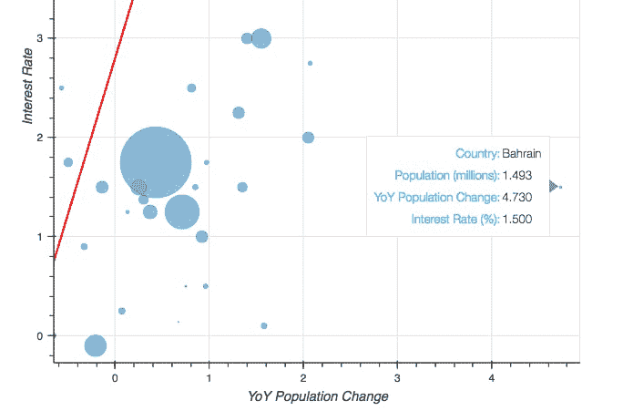

# 总结

在本章中，我们抓取了网页表格，并利用交互式可视化来研究数据。

我们首先了解了 HTTP 请求的工作原理，重点关注了 GET 请求及其响应状态码。接着，我们进入了 Jupyter Notebook，使用 Python 的 Requests 库发起了 HTTP 请求。我们看到，Jupyter 可以在笔记本中渲染 HTML，以及实际可以交互的网页。发起请求后，我们了解了如何使用 Beautiful Soup 来解析 HTML 中的文本，并利用这个库来抓取表格数据。

在抓取了两个数据表后，我们将它们存储在 pandas DataFrame 中。第一个表包含了各国中央银行的利率，第二个表则包含了人口数据。我们将它们合并成一个单独的表格，并用这个表格来创建交互式可视化。

最后，我们使用 Bokeh 在 Jupyter 中渲染了交互式可视化。我们学习了如何使用 Bokeh API 创建各种定制的图表，并制作了带有缩放、平移和悬停等交互功能的散点图。在定制化方面，我们明确展示了如何为每个数据样本设置点的半径和颜色。此外，在使用 Bokeh 探索抓取的各国人口数据时，悬停在点上时，工具提示展示了国家名称及相关数据。

恭喜你完成了这个使用 Jupyter Notebooks 的数据科学入门课程！无论你在阅读本书之前对 Jupyter 和 Python 有多少经验，你都学到了一些有用且可以应用于实际数据科学的技能！
