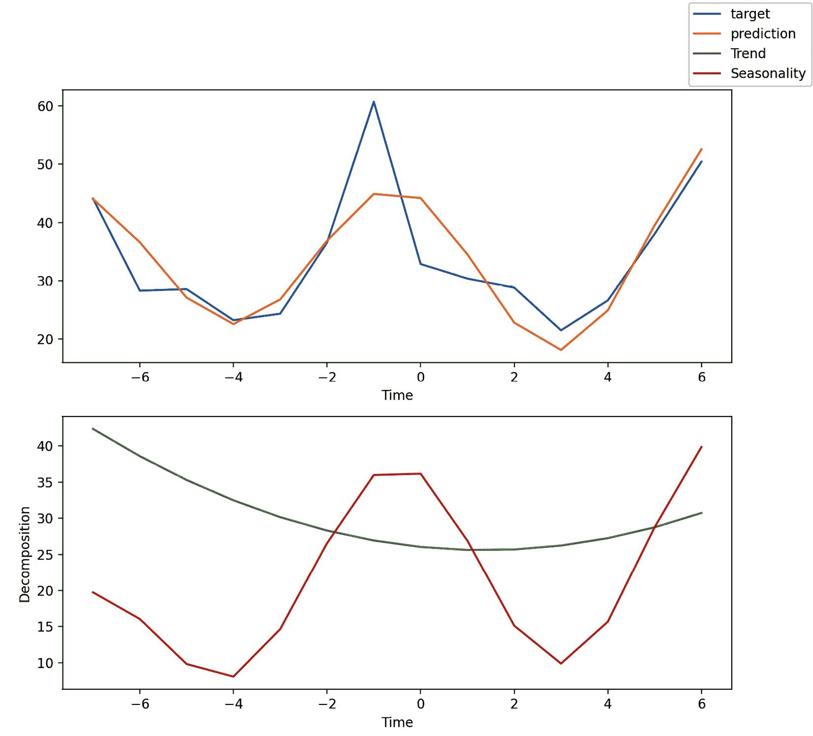
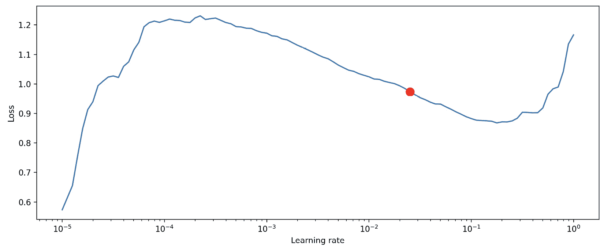
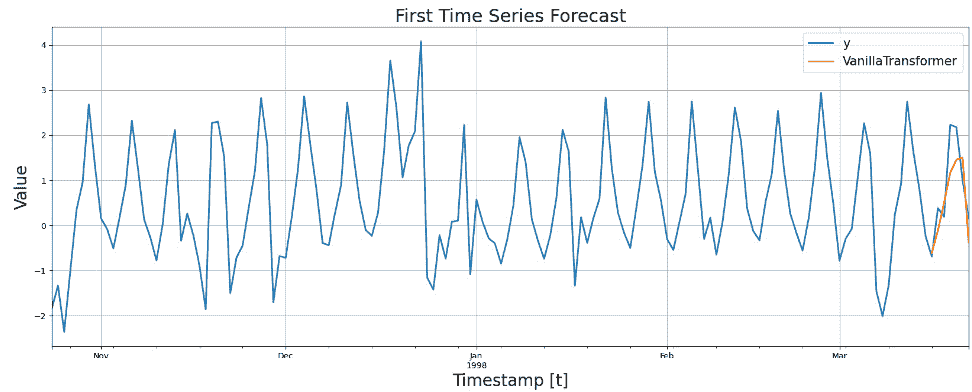
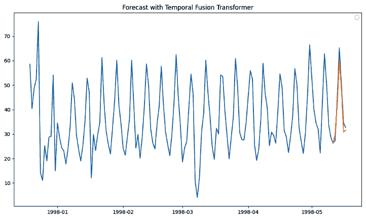
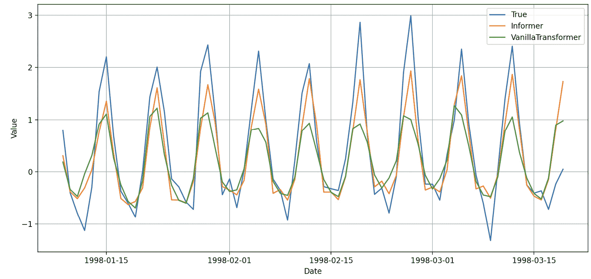

# 6

# 用于时间序列预测的高级深度学习架构

在前面的章节中，我们学习了如何使用不同类型的神经网络创建预测模型，但到目前为止，我们只处理了基本的架构，如前馈神经网络或 LSTM。本章将介绍如何使用最先进的方法，如 DeepAR 或 Temporal Fusion Transformers 来构建预测模型。这些方法由 Google 和 Amazon 等科技巨头开发，并已在不同的 Python 库中提供。这些先进的深度学习架构旨在解决各种类型的预测问题。

我们将涵盖以下几个食谱：

+   使用 N-BEATS 进行可解释的预测

+   使用 PyTorch Forecasting 优化学习率

+   使用 GluonTS 入门

+   使用 GluonTS 训练 DeepAR 模型

+   使用 NeuralForecast 训练 Transformer

+   使用 GluonTS 训练 Temporal Fusion Transformer

+   使用 NeuralForecast 训练 Informer 模型

+   使用 NeuralForecast 比较不同的 Transformer

到本章结束时，你将能够训练最先进的深度学习预测模型。

# 技术要求

本章需要以下 Python 库：

+   `numpy`（1.23.5）

+   `pandas`（1.5.3）

+   `scikit-learn`（1.2.1）

+   `sktime`（0.24.0）

+   `torch`（2.0.1）

+   `pytorch-forecasting`（1.0.0）

+   `pytorch-lightning`（2.1.0）

+   `gluonts`（0.13.5）

+   `neuralforecast`（1.6.0）

你可以通过 `pip` 一次性安装这些库：

```py
pip install -U pandas numpy scikit-learn sktime torch pytorch-forecasting pytorch-lightning gluonts neuralforecast
```

本章的代码可以在以下 GitHub 地址找到：[`github.com/PacktPublishing/Deep-Learning-for-Time-Series-Data-Cookbook`](https://github.com/PacktPublishing/Deep-Learning-for-Time-Series-Data-Cookbook)。

# 使用 N-BEATS 进行可解释的预测

本食谱介绍了 **用于可解释时间序列预测的神经基扩展分析**（**N-BEATS**），这是一种用于预测问题的深度学习方法。我们将向你展示如何使用 PyTorch Forecasting 训练 N-BEATS 并解释其输出。

## 准备工作

N-BEATS 特别设计用于处理多个单变量时间序列的问题。因此，我们将使用前一章中介绍的数据集（例如，参见 *为全局模型准备多个时间序列* 食谱）：

```py
import numpy as np
import pandas as pd
from gluonts.dataset.repository.datasets import get_dataset
from pytorch_forecasting import TimeSeriesDataSet
import lightning.pytorch as pl
from sklearn.model_selection import train_test_split
dataset = get_dataset('nn5_daily_without_missing', regenerate=False)
N_LAGS = 7
HORIZON = 7
datamodule = GlobalDataModule(data=dataset,
    n_lags=N_LAGS,
    horizon=HORIZON)
```

我们的目标是根据过去七个滞后值（`N_LAGS`），预测时间序列的下七个值（`HORIZON`）。

## 如何操作…

让我们创建训练、验证和测试数据集：

1.  我们通过调用 `GlobalDataModule` 类中的 `setup()` 方法开始：

    ```py
    datamodule.setup()
    ```

1.  N-BEATS 已经可以在 PyTorch Forecasting 中直接使用。你可以按如下方式定义模型：

    ```py
    from pytorch_forecasting import NBeats
    model = NBeats.from_dataset(
        dataset=datamodule.training,
        stack_types=['trend', 'seasonality'],
        num_blocks=[3, 3],
        num_block_layers=[4, 4],
        widths=[256, 2048],
        sharing=[True],
        backcast_loss_ratio=1.0,
    )
    ```

    我们使用前面的代码通过 `from_dataset()` 方法创建了一个 `NBeats` 实例。以下参数需要定义：

    +   `dataset`：包含训练集的 `TimeSeriesDataSet` 实例。

    +   `stack_types`：你希望运行 N-BEATS 的模式。`trend` 和 `seasonality` 类型的堆栈使得模型具有可解释性，而 `['generic']` 设置通常更为准确。

    +   `num_blocks`：块是 N-BEATS 模型的基石。它包含一组完全连接层，用于建模时间序列。

    +   `num_block_layers`：每个块中完全连接层的数量。

    +   `widths`：每个块中完全连接层的宽度。

    +   `sharing`：一个布尔参数，表示每个堆栈块是否共享权重。在可解释模式下，该参数应设置为 `True`。

    +   `backcast_loss_ratio`：模型中反向预测损失的相关性。反向预测（预测输入样本）是 N-BEATS 训练中的一个重要机制。这个参数平衡了反向预测损失与预测损失。

1.  创建模型后，您可以将其传递给 PyTorch Lightning 的 `Trainer` 进行训练：

    ```py
    import lightning.pytorch as pl
    from lightning.pytorch.callbacks import EarlyStopping
    early_stop_callback = EarlyStopping(monitor="val_loss",
        min_delta=1e-4,
        patience=10,
        verbose=False,
        mode="min")
    trainer = pl.Trainer(
        max_epochs=30,
        accelerator="auto",
        enable_model_summary=True,
        gradient_clip_val=0.01,
        callbacks=[early_stop_callback],
    )
    ```

1.  我们还包括了一个早停回调，用于指导训练过程。模型使用 `fit()` 方法进行训练：

    ```py
    trainer.fit(
        model,
        train_dataloaders=datamodule.train_dataloader(),
        val_dataloaders=datamodule.val_dataloader(),
    )
    ```

    我们将训练数据加载器传递给模型进行训练，并使用验证数据加载器进行早停。

1.  拟合模型后，我们可以评估其测试性能，并用它进行预测。在此之前，我们需要从保存的检查点加载模型：

    ```py
    best_model_path = trainer.checkpoint_callback.best_model_path
    best_model = NBeats.load_from_checkpoint(best_model_path)
    ```

1.  您可以通过以下方式从测试集获取预测值及其真实值：

    ```py
    predictions = best_model.predict(datamodule.test.to_dataloader(batch_size=1, shuffle=False))
    actuals = torch.cat(
        [y[0] for x, y in iter(
            datamodule.test.to_dataloader(batch_size=1, 
                shuffle=False))])
    ```

1.  我们通过计算这两个数量之间的平均绝对差来评估预测性能（即，平均绝对误差）：

    ```py
    (actuals - predictions).abs().mean()
    ```

    根据您的设备，您可能需要使用 `predictions.cpu()` 将 `predictions` 对象转换为 PyTorch 的 `tensor` 对象，然后再计算前面代码中指定的差异。

1.  数据模块还简化了为新实例进行预测的工作流：

    ```py
    forecasts = best_model.predict(datamodule.predict_dataloader())
    ```

    本质上，数据模块获取最新的观测值并将其传递给模型，后者会生成预测。

    N-BEATS 最有趣的方面之一是其可解释性组件。这些组件对于检查预测及其背后的驱动因素非常有价值：

1.  我们可以将预测拆解成不同的组件，并使用 `plot_interpretation()` 方法将它们绘制出来。为此，我们需要事先获取原始预测，如下所示：

    ```py
    raw_predictions = best_model.predict
        (datamodule.val_dataloader(),
        mode="raw",
        return_x=True)
    best_model.plot_interpretation(x=raw_predictions[1],
        output=raw_predictions[0],
        idx=0)
    ```

在前面的代码中，我们为测试集的第一个实例调用了绘图（`idx=0`）。以下是该绘图的样子：



图 6.1：将 N-BEATS 预测拆解成不同部分

上图展示了预测中的 `trend` 和 `seasonality` 组件。

## 它是如何工作的…

N-BEATS 基于两个主要组件：

+   一个包含预测和反向预测的残差连接双堆栈。在 N-BEATS 的上下文中，反向预测是指重建时间序列的过去值。它通过强迫模型在两个方向上理解时间序列结构，帮助模型学习更好的数据表示。

+   一个深层的密集连接层堆栈。

这种组合使得模型既具有高预测准确性，又具备可解释性能力。

训练、评估和使用模型的工作流程遵循 PyTorch Lightning 提供的框架。数据准备逻辑是在数据模块组件中开发的，特别是在 `setup()` 函数中。建模阶段分为两个部分：

1.  首先，你需要定义 N-BEATS 模型架构。在这个示例中，我们使用 `from_dataset()` 方法根据输入数据直接创建 `NBeats` 实例。

1.  然后，训练过程逻辑在 `Trainer` 实例中定义，包括你可能需要的任何回调函数。

一些回调函数，比如早停，会将模型的最佳版本保存在本地文件中，你可以在训练后加载该文件。

需要注意的是，解释步骤是通过 `plot_interpretation` 部分进行的，这是 N-BEATS 的一个特殊功能，帮助从业人员理解预测模型所做的预测。这也有助于了解模型在实际应用中不适用的条件。

N-BEATS 是一个在预测工具库中非常重要的模型。例如，在 M5 预测竞赛中，该竞赛包含了一组需求时间序列，N-BEATS 模型被应用于许多最佳解决方案。你可以在这里查看更多细节：[`www.sciencedirect.com/science/article/pii/S0169207021001874`](https://www.sciencedirect.com/science/article/pii/S0169207021001874)。

## 还有更多……

有一些方法可以最大化 N-BEATS 的潜力：

+   你可以查看 PyTorch Forecasting 库的文档，以更好地理解如何选择每个参数的值：[`pytorch-forecasting.readthedocs.io/en/stable/api/pytorch_forecasting.models.nbeats.NBeats.html`](https://pytorch-forecasting.readthedocs.io/en/stable/api/pytorch_forecasting.models.nbeats.NBeats.html)。

+   另一个有趣的方法是 NHiTS，你可以在以下链接中阅读更多内容：[`pytorch-forecasting.readthedocs.io/en/stable/api/pytorch_forecasting.models.nhits.NHiTS.html#pytorch_forecasting.models.nhits.NHiTS`](https://pytorch-forecasting.readthedocs.io/en/stable/api/pytorch_forecasting.models.nhits.NHiTS.html#pytorch_forecasting.models.nhits.NHiTS)。它在 PyTorch Forecasting 库中的实现遵循与 N-BEATS 相似的逻辑。

+   如前所述，N-BEATS 是为了处理涉及多个单变量时间序列的数据集而开发的。然而，它通过 N-BEATSx 方法得到了扩展，可以处理外生变量，该方法可以在`neuralforecast`库中找到：[`nixtla.github.io/neuralforecast/models.nbeatsx.html`](https://nixtla.github.io/neuralforecast/models.nbeatsx.html)。

关于可解释性，除了 N-BEATS 外，你还可以采用另外两种方法：

+   使用像 TimeShap 这样的模型无关解释器：[`github.com/feedzai/timeshap`](https://github.com/feedzai/timeshap)。

+   使用 **时序融合变压器**（**TFT**）深度学习模型，该模型还包含特殊的可解释性操作。您可以通过以下链接查看一个示例：[`pytorch-forecasting.readthedocs.io/en/stable/tutorials/stallion.html#Interpret-model`](https://pytorch-forecasting.readthedocs.io/en/stable/tutorials/stallion.html#Interpret-model)。

# 使用 PyTorch Forecasting 优化学习率

在本例中，我们展示了如何基于 PyTorch Forecasting 优化模型的学习率。

## 准备工作

学习率是所有深度学习方法的基石参数。顾名思义，它控制着网络学习过程的速度。在本示例中，我们将使用与前一个示例相同的设置：

```py
datamodule = GlobalDataModule(data=dataset,
    n_lags=N_LAGS,
    horizon=HORIZON,
    batch_size=32,
    test_size=0.2)
datamodule.setup()
```

我们还将以 N-BEATS 为例。然而，所有基于 PyTorch Forecasting 的模型，其过程是相同的。

## 如何做到这一点…

学习率的优化可以通过 PyTorch Lightning 的 `Tuner` 类进行。以下是使用 N-BEATS 的示例：

```py
from lightning.pytorch.tuner import Tuner
import lightning.pytorch as pl
from pytorch_forecasting import NBeats
trainer = pl.Trainer(accelerator="auto", gradient_clip_val=0.01)
tuner = Tuner(trainer)
model = NBeats.from_dataset(
    dataset=datamodule.training,
    stack_types=['trend', 'seasonality'],
    num_blocks=[3, 3],
    num_block_layers=[4, 4],
    widths=[256, 2048],
    sharing=[True],
    backcast_loss_ratio=1.0,
)
```

在前面的代码中，我们定义了一个 `Tuner` 实例，作为 `Trainer` 对象的封装。我们还像前一部分一样定义了一个 `NBeats` 模型。然后，我们使用 `lr_optim()` 方法优化学习率：

```py
lr_optim = tuner.lr_find(model,
    train_dataloaders=datamodule.train_dataloader(),
    val_dataloaders=datamodule.val_dataloader(),
    min_lr=1e-5)
```

完成此过程后，我们可以查看推荐的学习率值，并检查不同测试值的结果：

```py
lr_optim.suggestion()
fig = lr_optim.plot(show=True, suggest=True)
fig.show()
```

我们可以在下图中可视化结果：



图 6.2：使用 PyTorch Forecasting 进行学习率优化

在此示例中，推荐的学习率大约是 **0.05**。

## 它是如何工作的…

PyTorch Lightning 的 `lr_find()` 方法通过测试不同的学习率值，并选择一个最小化模型损失的值来工作。此方法使用训练和验证数据加载器来实现这一效果。

选择合适的学习率非常重要，因为不同的学习率值会导致不同性能的模型。较大的学习率收敛较快，但可能会收敛到一个次优解。然而，较小的学习率可能会需要过长的时间才能收敛。

在优化完成后，您可以像我们在之前的示例中一样，使用选定的学习率创建一个模型。

## 还有更多…

您可以在 PyTorch Forecasting 的 *教程* 部分了解更多关于如何充分利用像 N-BEATS 这样的模型的内容，详情请访问以下链接：[`pytorch-forecasting.readthedocs.io/en/stable/tutorials.html`](https://pytorch-forecasting.readthedocs.io/en/stable/tutorials.html)。

# 开始使用 GluonTS

GluonTS 是一个灵活且可扩展的工具包，用于使用 PyTorch 进行概率时间序列建模。该工具包提供了专门为时间序列任务设计的最先进的深度学习架构，以及一系列用于时间序列数据处理、模型评估和实验的实用工具。

本节的主要目标是介绍`gluonts`库的基本组件，强调其核心功能、适应性和用户友好性。

## 准备开始

为了开始我们的学习之旅，确保安装了`gluonts`及其后端依赖`pytorch`：

```py
pip install gluonts pytorch
```

安装完成后，我们可以深入探索`gluonts`的功能。

## 如何操作…

我们首先访问由库提供的示例数据集：

```py
from gluonts.dataset.repository.datasets import get_dataset
dataset = get_dataset("nn5_daily_without_missing", regenerate=False)
```

这将加载`nn5_daily_without_missing`数据集，这是`gluonts`提供的用于实验的数据集之一。

加载数据集后，可以检查其特性，使用`get_dataset()`函数进行操作。每个`dataset`对象包含元数据，提供关于时间序列频率、相关特征和其他相关属性的信息。你可以通过查看以下元数据了解数据集的更多信息：

```py
print(dataset.metadata)
```

为了增强时间序列数据，`gluonts`提供了一系列转换器。例如，`AddAgeFeature`数据转换器为数据集添加了一个`age`特征，表示每个时间序列的生命周期：

```py
from gluonts.transform import AddAgeFeature
transformation_with_age = Chain([
    AddAgeFeature(output_field="age",
    target_field="target",
    pred_length=dataset.metadata.prediction_length)
])
transformed_train_with_age = TransformedDataset(dataset.train, 
    transformation_with_age)
```

用于`gluonts`训练的数据通常表示为一个字典集合，每个字典代表一个时间序列，并附带可能的特征：

```py
training_data = list(dataset.train)
print(training_data[0])
```

`gluonts`中的基本模型之一是`SimpleFeedForwardEstimator`模型。以下是它的设置：

首先，通过确定预测长度、上下文长度（表示考虑的前几个时间步的数量）和数据频率等参数来初始化估算器：

```py
from gluonts.torch.model.simple_feedforward import SimpleFeedForwardEstimator
estimator_with_age = SimpleFeedForwardEstimator(
    hidden_dimensions=[10],
    prediction_length=dataset.metadata.prediction_length,
    context_length=100,
    trainer_kwargs={'max_epochs': 100}
)
```

要训练模型，只需在估算器上调用`train()`方法并提供训练数据：

```py
predictor_with_age = estimator_with_age.train
    (transformed_train_with_age)
```

该过程使用提供的数据训练模型，生成一个准备好进行预测的预测器。以下是我们如何从模型中获取预测：

```py
forecast_it_with_age, ts_it_with_age = make_evaluation_predictions(
    dataset=dataset.test,
    predictor=predictor_with_age,
    num_samples=100,
)
forecasts_with_age = list(forecast_it_with_age)
tss_with_age = list(ts_it_with_age)
fig, ax = plt.subplots(2, 1, figsize=(10, 8), sharex=True)
ts_entry_with_age = tss_with_age[0]
ax[0].plot(ts_entry_with_age[-150:].to_timestamp())
forecasts_with_age[0].plot(show_label=True, ax=ax[0])
ax[0].set_title("Forecast with AddAgeFeature")
ax[0].legend()
```

在前面的代码中，可以使用`make_evaluation_predictions()`方法生成预测，然后将其与实际值进行对比绘制。以下是包含预测和实际值的图表：


图 6.3：使用和不使用 AddAgeFeature 的预测对比分析

在前面的图中，我们展示了使用和不使用`AddAgeFeature`的预测对比分析。使用该特征可以提高预测准确性，这表明它是此数据集中一个重要的变量。

## 它是如何工作的…

GluonTS 提供了一系列内置功能，有助于时间序列分析和预测。例如，数据转换器使你能够快速基于原始数据集构建新特征。如我们实验中所用，`AddAgeFeature`转换器将一个`age`属性附加到每个时间序列。时间序列的年龄往往能为模型提供相关的上下文信息。一个典型的应用场景是股票数据，较旧的股票可能会展现出与较新的股票不同的波动模式。

在 GluonTS 中训练采用基于字典的结构，每个字典对应一个时间序列，并包含其他相关的特征。这种结构使得附加、修改或删除特征变得更为容易。

在我们的实验中，我们测试了一个简单的模型，使用了`SimpleFeedForwardEstimator`模型。我们定义了两个模型实例，一个使用了`AddAgeFeature`，另一个没有使用。使用`age`特征训练的模型显示了更好的预测准确性，如我们在*图 6.3*中所看到的那样。这一改进突显了在时间序列分析中，特征工程的重要性。

# 使用 GluonTS 训练 DeepAR 模型

DeepAR 是一种先进的预测方法，利用自回归循环网络来预测时间序列数据的未来值。该方法由亚马逊提出，旨在解决需要较长预测周期的任务，如需求预测。当需要为多个相关的时间序列生成预测时，这种方法特别强大。

## 准备工作

我们将使用与前一个示例相同的数据集：

```py
from gluonts.dataset.repository.datasets import get_dataset
dataset = get_dataset("nn5_daily_without_missing", regenerate=False)
```

现在，让我们看看如何使用这些数据构建 DeepAR 模型。

## 如何做…

我们从格式化数据开始进行训练：

1.  我们通过使用`ListDataset`数据结构来实现：

    ```py
    from gluonts.dataset.common import ListDataset
    from gluonts.dataset.common import FieldName
    train_ds = ListDataset(
        [
            {FieldName.TARGET: entry["target"], 
                FieldName.START: entry["start"]}
            for entry in dataset.train
        ],
        freq=dataset.metadata.freq,
    )
    ```

1.  接下来，使用`DeepAREstimator`类定义 DeepAR 估计器，并指定诸如`prediction_length`（预测周期）、`context_length`（滞后数）和`freq`（采样频率）等参数：

    ```py
    from gluonts.torch.model.deepar import DeepAREstimator
    N_LAGS=7
    HORIZON=7
    estimator = DeepAREstimator(
        prediction_length=HORIZON,
        context_length=N_LAGS,
        freq=dataset.metadata.freq,
        trainer_kwargs={"max_epochs": 100},
    )
    ```

1.  在定义估计器后，使用`train()`方法训练 DeepAR 模型：

    ```py
    predictor = estimator.train(train_ds)
    ```

1.  使用训练好的模型对测试数据进行预测并可视化结果：

    ```py
    forecast_it, ts_it = make_evaluation_predictions(
        dataset=dataset.test,
        predictor=predictor,
        num_samples=100,
    )
    forecasts = list(forecast_it)
    tss = list(ts_it)
    fig, ax = plt.subplots(1, 1, figsize=(10, 6))
    ts_entry = tss[0]
    ax.plot(ts_entry[-150:].to_timestamp())
    forecasts[0].plot(show_label=True, ax=ax, intervals=())
    ax.set_title("Forecast with DeepAR")
    ax.legend()
    plt.tight_layout()
    plt.show()
    ```

这是预测结果的图表：


图 6.4：DeepAR 预测与我们数据集中的真实值的比较

该模型能够紧密匹配真实值。

## 它是如何工作的…

DeepAR 使用 RNN 架构，通常利用 LSTM 单元或 GRU 来建模时间序列数据。

`context_length`参数至关重要，因为它决定了模型在做出预测时将考虑多少过去的观测值作为其上下文。例如，如果将`context_length`设置为`7`，则模型将使用过去一周的数据来预测未来的值。

相反，`prediction_length`参数定义了预测的时间范围（即模型应预测的未来步数）。在给定的代码中，我们使用了一周的预测范围。

DeepAR 的一个突出特点是能够生成概率性预测。它不仅提供单一的点估计，而是提供一个可能未来值的分布，从而帮助我们理解预测中蕴含的不确定性。

最后，在处理多个相关时间序列时，DeepAR 利用序列间的共性来提高预测的准确性。

## 还有更多…

当满足以下条件时，DeepAR 表现尤为出色：

+   你有多个相关时间序列；DeepAR 可以利用所有序列中的信息来改善预测。

+   你的数据具有季节性或周期性模式。

+   你希望生成概率性预测，这些预测会给出点估计并提供不确定性区间。我们将在下一章讨论不确定性估计。

你可以训练一个单一的 DeepAR 模型来处理全局数据集，并为数据集中的所有时间序列生成预测。另一方面，对于单独的时间序列，DeepAR 也可以分别训练每个序列，尽管这可能效率较低。

该模型特别适用于零售需求预测、股票价格预测和网站流量预测等应用。

# 使用 NeuralForecast 训练 Transformer 模型

现在，我们将目光转向近年来在人工智能各领域推动进步的 Transformer 架构。在本节中，我们将展示如何使用 NeuralForecast Python 库训练一个基础的 Transformer 模型。

## 准备工作

Transformer 已成为深度学习领域的主流架构，尤其在**自然语言处理**（**NLP**）任务中表现突出。Transformer 也已被应用于 NLP 以外的各种任务，包括时间序列预测。

与传统模型逐点分析时间序列数据不同，Transformer 能够同时评估所有时间步。这种方法类似于一次性观察整个时间线，确定每个时刻与其他时刻的相关性，以便对特定时刻进行评估。

Transformer 架构的核心是**注意力机制**。该机制根据特定输入的相关性，计算输入值或来自前一层的值的加权和。与逐步处理输入的 RNN 不同，这使得 Transformer 能够同时考虑输入序列的所有部分。

Transformer 的关键组成部分包括以下内容：

+   **自注意力机制**：计算所有输入值对的注意力得分，然后基于这些得分创建加权组合。

+   **多头注意力机制**：该模型可以通过并行运行多个注意力机制，针对不同的任务或原因，集中注意力于输入的不同部分

+   **逐位置前馈网络**：这些网络对注意力层的输出应用线性变换

+   **位置编码**：由于 Transformer 本身没有任何固有的顺序感知，因此会将位置编码添加到输入嵌入中，以为模型提供序列中每个元素的位置相关信息

让我们看看如何训练一个 Transformer 模型。在本教程中，我们将再次使用 `gluonts` 库提供的数据集。我们将使用 NeuralForecast 库中提供的 Transformer 实现。NeuralForecast 是一个 Python 库，包含了多种专注于预测问题的神经网络实现，包括几种 Transformer 架构。

## 如何执行…

首先，让我们为 Transformer 模型准备数据集。与逐步处理输入序列的序列到序列模型（如 RNN、LSTM 或 GRU）不同，Transformer 会一次性处理整个序列。因此，如何格式化和输入数据可能会有所不同：

1.  让我们从加载数据集和必要的库开始：

    ```py
    from gluonts.dataset.repository.datasets import get_dataset
    import pandas as pd
    from sklearn.preprocessing import StandardScaler
    import matplotlib.pyplot as plt
    from neuralforecast.core import NeuralForecast
    from neuralforecast.models import VanillaTransformer
    dataset = get_dataset("nn5_daily_without_missing", regenerate=False)
    N_LAGS = 7
    HORIZON = 7
    ```

1.  接下来，将数据集转换为 pandas DataFrame 并进行标准化。请记住，标准化是任何深度学习模型拟合的关键：

    ```py
    data_list = list(dataset.train)
    data_list = [
        pd.Series(
            ds["target"],
            index=pd.date_range(
                start=ds["start"].to_timestamp(),
                freq=ds["start"].freq,
                periods=len(ds["target"]),
            ),
        )
        for ds in data_list
    ]
    tseries_df = pd.concat(data_list, axis=1)
    tseries_df[tseries_df.columns] = 
        \StandardScaler().fit_transform(tseries_df)
    tseries_df = tseries_df.reset_index()
    df = tseries_df.melt("index")
    df.columns = ["ds", "unique_id", "y"]
    df["ds"] = pd.to_datetime(df["ds"])
    ```

1.  数据准备好后，我们将训练一个 Transformer 模型。与使用递归架构的 DeepAR 模型不同，Transformer 将依靠其注意力机制，在做出预测时考虑时间序列的各个部分：

    ```py
    model = [
        VanillaTransformer(
            h=HORIZON,
            input_size=N_LAGS,
            max_steps=100,
            val_check_steps=5,
            early_stop_patience_steps=3,
        ),
    ]
    nf = NeuralForecast(models=model, freq="D")
    Y_df = df[df["unique_id"] == 0]
    Y_train_df = Y_df.iloc[:-2*HORIZON]
    Y_val_df = Y_df.iloc[-2*HORIZON:-HORIZON]
    training_df = pd.concat([Y_train_df, Y_val_df])
    nf.fit(df=training_df, val_size=HORIZON)
    ```

1.  最后，展示预测结果：

    ```py
    forecasts = nf.predict()
    Y_df = df[df["unique_id"] == 0]
    Y_hat_df = forecasts[forecasts.index == 0].reset_index()
    Y_hat_df = Y_test_df.merge(Y_hat_df, how="outer", 
        on=["unique_id", "ds"])
    plot_df = pd.
        concat([Y_train_df, Y_val_df, Y_hat_df]).set_index("ds")
    plot_df = plot_df.iloc[-150:]
    fig, ax = plt.subplots(1, 1, figsize=(20, 7))
    plot_df[["y", "VanillaTransformer"]].plot(ax=ax, linewidth=2)
    ax.set_title("First Time Series Forecast with Transformer", fontsize=22)
    ax.set_ylabel("Value", fontsize=20)
    ax.set_xlabel("Timestamp [t]", fontsize=20)
    ax.legend(prop={"size": 15})
    ax.grid()
    plt.show()
    ```

下图展示了 Transformer 预测值与时间序列实际值的对比：



图 6.5：Transformer 预测与我们数据集的真实值对比

## 它是如何工作的…

`neuralforecast` 库要求数据采用特定格式。每个观察值由三部分信息组成：时间戳、时间序列标识符以及对应的值。我们从准备数据集开始，确保其符合此格式。Transformer 实现于 `VanillaTransformer` 类中。我们设置了一些参数，例如预测范围、训练步数或与提前停止相关的输入。你可以在以下链接查看完整的参数列表：[`nixtla.github.io/neuralforecast/models.vanillatransformer.html`](https://nixtla.github.io/neuralforecast/models.vanillatransformer.html)。训练过程通过 `NeuralForecast` 类实例中的 `fit()` 方法进行。

Transformer 通过使用自注意力机制对整个序列进行编码来处理时间序列数据，从而捕捉依赖关系，而不考虑它们在输入序列中的距离。这种全局视角在存在长时间跨度的模式或依赖关系时特别有价值，或者当过去数据的相关性动态变化时。

位置编码用于确保 Transformer 识别数据点的顺序。没有它们，模型会将时间序列视为一堆没有内在顺序的值。

多头注意力机制使 Transformer 能够同时关注不同的时间步长和特征，特别适用于具有多个交互模式和季节性变化的复杂时间序列。

## 还有更多…

由于以下原因，Transformer 在时间序列预测中可能非常有效：

+   它们捕捉数据中长期依赖关系的能力

+   在大规模数据集上的可扩展性

+   在建模单变量和多变量时间序列时的灵活性

与其他模型一样，Transformer 也能通过调整超参数来受益，例如调整注意力头的数量、模型的大小（即层数和嵌入维度）以及学习率。

# 使用 GluonTS 训练一个时序融合变换器

TFT 是一种基于注意力机制的架构，由 Google 开发。它具有递归层，用于学习不同尺度的时间关系，并结合自注意力层以提高可解释性。TFT 还使用变量选择网络进行特征选择，门控层用于抑制不必要的成分，并采用分位数损失作为其损失函数，用以生成预测区间。

本节将深入探讨如何使用 GluonTS 框架训练并进行 TFT 模型的推理。

## 准备工作

确保你的环境中安装了 GluonTS 库和 PyTorch 后端。我们将使用来自 GluonTS 仓库的`nn5_daily_without_missing`数据集作为工作示例：

```py
from gluonts.dataset.common import ListDataset, FieldName
from gluonts.dataset.repository.datasets import get_dataset
dataset = get_dataset("nn5_daily_without_missing", regenerate=False)
train_ds = ListDataset(
    [
        {FieldName.TARGET: entry["target"], FieldName.START: entry["start"]}
        for entry in dataset.train
    ],
    freq=dataset.metadata.freq,
)
```

在接下来的部分，我们将使用这个数据集训练一个 TFT 模型。

## 如何实现…

数据集准备好后，接下来定义 TFT 估计器：

1.  我们将从指定超参数开始，例如预测长度、上下文长度和训练频率：

    ```py
    from gluonts.torch.model.tft import TemporalFusionTransformerEstimator
    N_LAGS = 7
    HORIZON = 7
    estimator = TemporalFusionTransformerEstimator(
        prediction_length=HORIZON,
        context_length=N_LAGS,
        freq=dataset.metadata.freq,
        trainer_kwargs={"max_epochs": 100},
    )
    ```

1.  在定义估计器后，继续使用训练数据集训练 TFT 模型：

    ```py
    predictor = estimator.train(train_ds)
    ```

1.  训练完成后，我们可以使用模型进行预测。利用`make_evaluation_predictions()`函数来实现这一点：

    ```py
    from gluonts.evaluation import make_evaluation_predictions
    forecast_it, ts_it = make_evaluation_predictions(
        dataset=dataset.test,
        predictor=predictor,
        num_samples=100,
    )
    ```

1.  最后，我们可以通过可视化预测结果来了解模型的表现：

    ```py
    import matplotlib.pyplot as plt
    ts_entry = tss[0]
    ax.plot(ts_entry[-150:].to_timestamp())
    forecasts[0].plot(show_label=True, ax=ax, intervals=())
    ax.set_title("Forecast with Temporal Fusion Transformer")
    ax.legend()
    plt.tight_layout()
    plt.show()
    ```

以下是模型预测与数据集实际值的比较。



图 6.6：TFT 预测与我们数据集中的真实值比较

## 它是如何工作的…

我们使用`gluonts`中提供的 TFT 实现。主要参数包括滞后数（上下文长度）和预测时段。你还可以测试模型某些参数的不同值，例如注意力头的数量（`num_heads`）或 Transformer 隐状态的大小（`hidden_dim`）。完整的参数列表可以在以下链接中找到：[`ts.gluon.ai/stable/api/gluonts/gluonts.torch.model.tft.estimator.html`](https://ts.gluon.ai/stable/api/gluonts/gluonts.torch.model.tft.estimator.html)。

TFT 适用于多种使用场景，因为它具备完整的特征集：

+   **时间处理**：TFT 通过序列到序列模型解决了整合过去观察值和已知未来输入的挑战，利用 LSTM 编码器-解码器。

+   **注意力机制**：该模型使用注意力机制，能够动态地为不同的时间步分配重要性。这确保了模型只关注相关的历史数据。

+   **门控机制**：TFT 架构利用门控残差网络，提供在建模过程中的灵活性，能够适应数据的复杂性。这种适应性对于处理不同的数据集尤其重要，特别是对于较小或噪声较多的数据集。

+   **变量选择网络**：该组件用于确定每个协变量与预测的相关性。通过加权输入特征的重要性，它过滤掉噪声，仅依赖于重要的预测因子。

+   **静态协变量编码器**：TFT 将静态信息编码为多个上下文向量，丰富了模型的输入。

+   **分位数预测**：通过预测每个时间步的不同分位数，TFT 提供了可能结果的范围。

+   **可解释输出**：尽管 TFT 是一个深度学习模型，但它提供了特征重要性方面的见解，确保预测的透明性。

## 还有更多……

除了架构创新之外，TFT 的可解释性使其成为当需要解释预测是如何生成时的良好选择。诸如变量网络选择和时序多头注意力层等组件，揭示了不同输入和时间动态的重要性，使 TFT 不仅仅是一个预测工具，还是一个分析工具。

# 使用 NeuralForecast 训练 Informer 模型

在本教程中，我们将探索`neuralforecast` Python 库，用于训练 Informer 模型，Informer 是另一种基于 Transformer 的深度学习预测方法。

## 准备开始

Informer 是一种针对长期预测而量身定制的 Transformer 方法——即，具有较长预测时段的预测。与标准 Transformer 相比，Informer 的主要区别在于其改进的自注意力机制，这大大减少了运行模型和生成长序列预测的计算需求。

在这个教程中，我们将向你展示如何使用`neuralforecast`训练 Informer 模型。我们将使用与之前教程相同的数据集：

```py
from gluonts.dataset.repository.datasets import get_dataset
dataset = get_dataset('nn5_daily_without_missing')
```

## 如何实现……

这次，我们不是创建`DataModule`来处理数据预处理，而是使用基于`neuralforecast`模型的典型工作流程：

1.  我们首先准备时间序列数据集，以符合`neuralforecast`方法所期望的特定格式：

    ```py
    import pandas as pd
    from sklearn.preprocessing import StandardScaler
    data_list = list(dataset.train)
    data_list = [pd.Series(ds['target'],
        index=pd.date_range(start=ds['start'].to_timestamp(),
            freq=ds['start'].freq,
            periods=len(ds['target'])))
        for ds in data_list]
    tseries_df = pd.concat(data_list, axis=1)
    tseries_df[tseries_df.columns] = \
        StandardScaler().fit_transform(tseries_df)
    tseries_df = tseries_df.reset_index()
    df = tseries_df.melt('index')
    df.columns = ['ds', 'unique_id', 'y']
    df['ds'] = pd.to_datetime(df['ds'])
    n_time = len(df.ds.unique())
    val_size = int(.2 * n_time)
    ```

1.  我们将数据集转化为一个包含三列的 pandas DataFrame：`ds`、`unique_id`和`y`。它们分别表示时间戳、时间序列的 ID 和对应时间序列的值。在前面的代码中，我们使用`scikit-learn`的标准缩放器将所有时间序列转换为一个共同的数值范围。我们还将验证集的大小设置为时间序列大小的 20%。现在，我们可以如下设置 Informer 模型：

    ```py
    from neuralforecast.core import NeuralForecast
    from neuralforecast.models import Informer
    N_LAGS = 7
    HORIZON = 7
    model = [Informer(h=HORIZON,
        input_size=N_LAGS,
        max_steps=1000,
        val_check_steps=25,
        early_stop_patience_steps=10)]
    nf = NeuralForecast(models=model, freq='D')
    ```

1.  我们将 Informer 的上下文长度（滞后数）设置为`7`，以便在每个时间步预测接下来的 7 个值。训练步数设置为`1000`，我们还设置了早期停止机制以帮助拟合过程。这些仅是设置 Informer 时可以使用的部分参数。你可以通过以下链接查看完整的参数列表：[`nixtla.github.io/neuralforecast/models.informer.html`](https://nixtla.github.io/neuralforecast/models.informer.html)。模型被传递到`NeuralForecast`类实例中，我们还将时间序列的频率设置为每日（`D`关键字）。然后，训练过程如下进行：

    ```py
    nf.fit(df=df, val_size=val_size)
    ```

1.  `nf`对象用于拟合模型，然后可以用来进行预测：

    ```py
    forecasts = nf.predict()
    forecasts.head()
    ```

预测结果以 pandas DataFrame 的形式结构化，因此你可以通过使用`head()`方法查看预测的样本。

## 它是如何工作的……

`neuralforecast`库提供了一个简单的框架，用于训练强大的时间序列问题模型。在这种情况下，我们将数据逻辑处理放在框架外部，因为它会在内部处理数据传递给模型的过程。

`NeuralForecast`类实例接受一个模型列表作为输入（在本例中只有一个`Informer`实例），并负责训练过程。如果你想直接使用最先进的模型，这个库可以是一个不错的解决方案。其限制是，它的灵活性不如基础的 PyTorch 生态系统。

## 还有更多…

在这个教程中，我们描述了如何使用`neuralforecast`训练一个特定的 Transformer 模型。但这个库包含了其他你可以尝试的 Transformers，包括以下几种：

+   Vanilla Transformer

+   TFT

+   Autoformer

+   PatchTST

你可以在以下链接查看完整的模型列表：[`nixtla.github.io/neuralforecast/core.html`](https://nixtla.github.io/neuralforecast/core.html)。

# 使用 NeuralForecast 比较不同的 Transformer

NeuralForecast 包含几种深度学习方法，你可以用来解决时间序列问题。在本节中，我们将引导你通过 `neuralforecast` 比较不同基于 Transformer 的模型的过程。

## 准备工作

我们将使用与前一节相同的数据集（`df` 对象）。我们将验证集和测试集的大小分别设置为数据集的 10%：

```py
val_size = int(.1 * n_time)
test_size = int(.1 * n_time)
```

现在，让我们来看一下如何使用 `neuralforecast` 比较不同的模型。

## 如何操作…

我们首先定义要比较的模型。在这个例子中，我们将比较一个 Informer 模型和一个基础版 Transformer，我们将模型设置如下：

```py
from neuralforecast.models import Informer, VanillaTransformer
models = [
    Informer(h=HORIZON,
        input_size=N_LAGS,
        max_steps=1000,
        val_check_steps=10,
        early_stop_patience_steps=15),
    VanillaTransformer(h=HORIZON,
        input_size=N_LAGS,
        max_steps=1000,
        val_check_steps=10,
        early_stop_patience_steps=15),
]
```

每个模型的训练参数设置相同。我们可以使用 `NeuralForecast` 类，通过 `cross_validation()` 方法比较不同的模型，方法如下：

```py
from neuralforecast.core import NeuralForecast
nf = NeuralForecast(
    models=models,
    freq='D')
cv = nf.cross_validation(df=df,
    val_size=val_size,
    test_size=test_size,
    n_windows=None)
```

`cv` 对象是比较的结果。以下是每个模型在特定时间序列中的预测样本：



图 6.7：示例时间序列中两个 Transformer 模型的预测结果

Informer 模型似乎产生了更好的预测结果，我们可以通过计算平均绝对误差来验证这一点：

```py
from neuralforecast.losses.numpy import mae
mae_informer = mae(cv['y'], cv['Informer'])
mae_transformer = mae(cv['y'], cv['VanillaTransformer'])
```

Informer 的误差为 0.42，优于 `VanillaTransformer` 得到的 0.53 分数。

## 工作原理…

在背后，`cross_validation()` 方法的工作原理如下。每个模型使用训练集和验证集进行训练。然后，它们在测试实例上进行评估。测试集上的预测性能为我们提供了一个可靠的估计，表示我们期望模型在实际应用中达到的性能。因此，你应该选择能最大化预测性能的模型，并用整个数据集重新训练它。

`neuralforecast` 库包含其他可以进行比较的模型。你也可以比较同一种方法的不同配置，看看哪种最适合你的数据。
