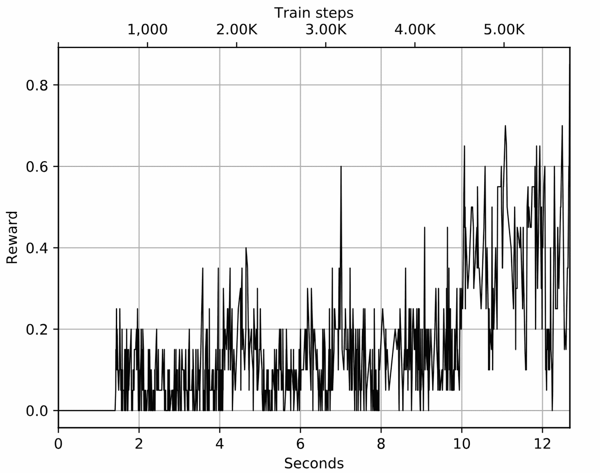
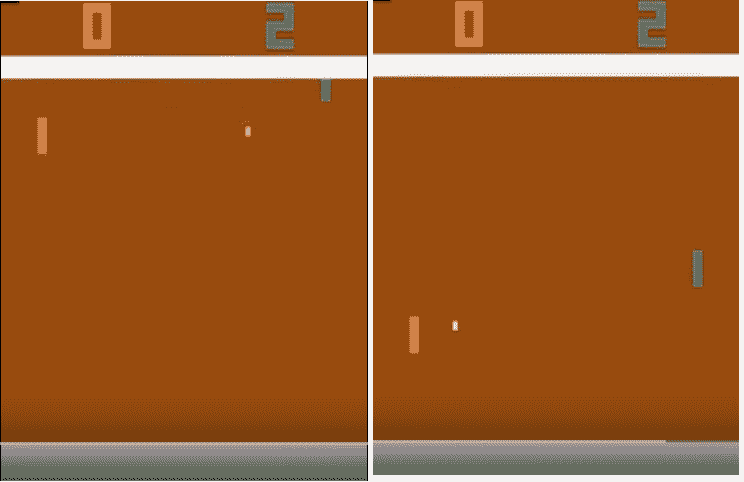
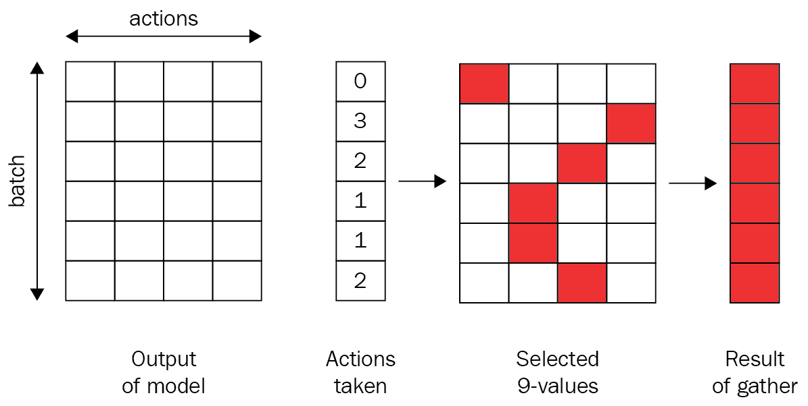
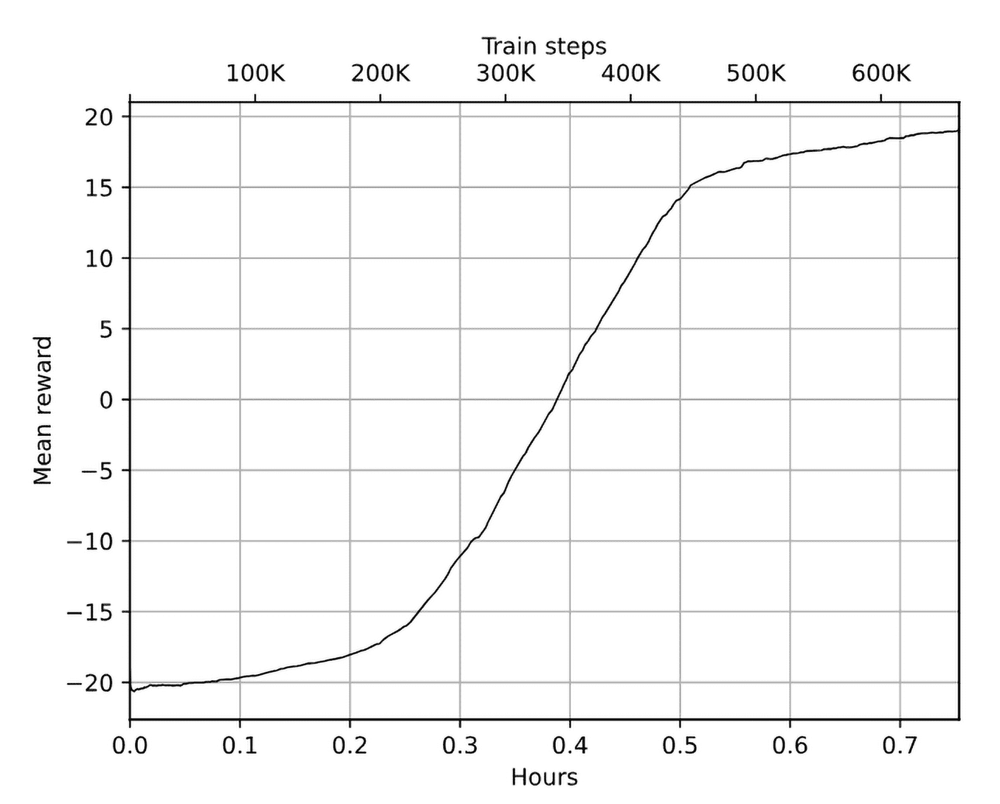

# 6

# 深度 Q 网络

在第五章中，你已经熟悉了贝尔曼方程以及其应用的实际方法——价值迭代。这个方法让我们在 FrozenLake 环境中显著提高了速度和收敛性，这很有前景，但我们能进一步提升吗？在本章中，我们将把相同的方法应用到复杂度更高的问题上：来自 Atari 2600 平台的街机游戏，这些游戏是强化学习（RL）研究社区的事实标准。

为了应对这一新的、更具挑战性的目标，本章将：

+   讨论价值迭代方法的问题，并考虑它的变体——Q 学习。

+   将 Q 学习应用于所谓的网格世界环境，这种方法被称为表格 Q 学习。

+   讨论 Q 学习与神经网络（NNs）的结合。这种结合被称为深度 Q 网络（DQN）。

在本章的结尾，我们将重新实现著名论文《Playing Atari with Deep Reinforcement Learning》[Mni13]中的 DQN 算法，该论文于 2013 年发布，并开启了强化学习发展的新纪元。虽然讨论这些基本方法的实际应用还为时过早，但随着你深入阅读本书，你会更清楚地看到这一点。

# 现实生活中的价值迭代

通过将交叉熵方法转换为价值迭代方法，我们在 FrozenLake 环境中取得的改进非常令人鼓舞，因此将价值迭代方法应用于更具挑战性的问题非常有吸引力。然而，重要的是要查看我们价值迭代方法的假设和局限性。但让我们先快速回顾一下这个方法。在每一步中，价值迭代方法会遍历所有状态，并对每个状态使用贝尔曼近似进行价值更新。对 Q 值（动作的价值）进行的相同方法变体几乎相同，但我们要为每个状态和动作近似并存储价值。那么，这个过程到底有什么问题呢？

第一个明显的问题是环境状态的数量以及我们遍历它们的能力。在价值迭代中，我们假设我们事先知道环境中的所有状态，能够遍历它们，并且可以存储它们的价值近似值。对于 FrozenLake 的简单网格世界环境，这很容易做到，但对于其他任务呢？

为了理解这一点，首先让我们看看价值迭代方法的可扩展性，换句话说，我们在每次循环中能够轻松遍历多少个状态。即使是中等大小的计算机，也可以在内存中存储数十亿个浮点值（在 32GB 的内存中是 85 亿），因此，价值表所需的内存似乎不是一个巨大的限制。遍历数十亿个状态和动作会更加消耗中央处理单元（CPU），但这并不是一个无法克服的问题。

现在，我们有了多核系统，这些系统大多是闲置的，所以通过使用并行处理，我们可以在合理的时间内遍历数十亿个值。真正的问题在于，获取状态转换动态的良好近似所需的样本数量。假设你有一个环境，假设有十亿个状态（这大约对应一个 31600 × 31600 大小的 FrozenLake）。要计算这个环境中每个状态的粗略近似，我们需要数百亿个状态之间均匀分布的转换，这在实践中是不可行的。

为了给你一个更大潜在状态数量的环境示例，我们再来看看 Atari 2600 游戏主机。这款主机在 1980 年代非常流行，并且有许多街机风格的游戏可供选择。虽然按照今天的游戏标准，Atari 主机显得过时，但它的游戏提供了一组很好的强化学习（RL）问题，人类可以相对快速地掌握这些问题，但对计算机来说仍然具有挑战性。不足为奇的是，正如我之前提到的，这个平台（当然是使用模拟器）在强化学习研究中是一个非常受欢迎的基准。

让我们来计算一下 Atari 平台的状态空间。屏幕的分辨率是 210 × 160 像素，每个像素有 128 种颜色。因此，每一帧屏幕有 210 ⋅ 160 = 33600 个像素，而所有可能的不同屏幕总数是 128³³⁶⁰⁰，约等于 10⁷⁰⁸⁰²。如果我们决定只列举一次 Atari 所有可能的状态，即使是最快的超级计算机也需要数十亿年。而且，这项工作中 99(.9)%的时间都将是浪费，因为大多数组合在长时间的游戏过程中从未出现过，我们也不会有这些状态的样本。然而，值迭代方法仍然想遍历这些状态，以防万一。

值迭代方法的第二个主要问题是，它将我们限制在离散动作空间中。实际上，Q(s,a) 和 V(s) 的近似都假设我们的动作是一个相互排斥的离散集合，但对于连续控制问题来说，动作可以表示连续的变量，例如方向盘的角度、执行器上的力，或者加热器的温度，这在此类问题中并不成立。这个问题比第一个问题更具挑战性，我们将在书的最后部分，专门讨论连续动作空间问题的章节中进行讲解。现在，假设我们有一个离散的动作计数，并且这个计数不是很大（即数量级为 10 的数量）。我们应该如何处理状态空间大小的问题呢？

# 表格 Q 学习

处理状态空间问题时需要关注的关键问题是，我们是否真的需要遍历状态空间中的每个状态？我们有一个环境，可以用作现实生活中状态样本的来源。如果某个状态没有被环境展示出来，为什么我们还需要关心它的价值呢？我们只能使用从环境中获得的状态来更新状态值，这样可以节省大量的工作。

如前所述，这种值迭代方法的修改被称为 Q 学习，对于具有明确状态到值映射的情况，它包括以下步骤：

1.  从一个空表开始，将状态映射到动作的值。

1.  通过与环境交互，获取元组 s, a, r, s′（状态、动作、奖励和新状态）。在此步骤中，你需要决定采取哪个动作，而且没有单一的正确方法来做出这个决策。我们在第一章中讨论过这个问题，探索与利用，并将在本章中深入讨论。

1.  使用 Bellman 近似更新 Q(s,a) 的值：

    ![π (a |s) = P[At = a|St = s] ](img/eq18.png)

1.  从第 2 步开始重复。

与值迭代一样，结束条件可以是某个更新的阈值，或者我们可以执行测试回合来估算策略的期望奖励。这里需要注意的另一点是如何更新 Q 值。当我们从环境中采样时，直接在现有值上分配新值通常是一个坏主意，因为训练可能会变得不稳定。

实践中通常采用的方法是使用一种“混合”技术更新 Q(s,a)，即通过学习率 α 对 Q 的旧值和新值进行平均，α 的值在 0 到 1 之间：

![π (a |s) = P[At = a|St = s] ](img/eq19.png)

这使得 Q 值能够平稳收敛，即使我们的环境是嘈杂的。最终版本的算法如下：

1.  从一个空表开始，表示 Q(s,a)。

1.  从环境中获取 (s, a, r, s′)。

1.  进行 Bellman 更新：

    ![π (a |s) = P[At = a|St = s] ](img/eq19.png)

1.  检查收敛条件。如果条件未满足，从第 2 步开始重复。

如前所述，这种方法被称为表格 Q 学习，因为我们维护一个包含状态及其 Q 值的表格。让我们在我们的 FrozenLake 环境中尝试一下。完整的示例代码在 Chapter06/01_frozenlake_q_learning.py 中：

首先，我们导入包并定义常量和使用的类型：

```py
import typing as tt 
import gymnasium as gym 
from collections import defaultdict 
from torch.utils.tensorboard.writer import SummaryWriter 

ENV_NAME = "FrozenLake-v1" 
GAMMA = 0.9 
ALPHA = 0.2 
TEST_EPISODES = 20 

State = int 
Action = int 
ValuesKey = tt.Tuple[State, Action] 

class Agent: 
    def __init__(self): 
        self.env = gym.make(ENV_NAME) 
        self.state, _ = self.env.reset() 
        self.values: tt.Dict[ValuesKey] = defaultdict(float)
```

这里的新内容是 α 的值，它将用作值更新中的学习率。我们现在的 Agent 类初始化更加简化，因为我们不再需要跟踪奖励和过渡计数的历史记录，只需要我们的值表。这将使我们的内存占用更小，虽然对于 FrozenLake 来说这不是一个大问题，但对于更大的环境可能至关重要。

方法 sample_env 用于从环境中获取下一个过渡：

```py
 def sample_env(self) -> tt.Tuple[State, Action, float, State]: 
        action = self.env.action_space.sample() 
        old_state = self.state 
        new_state, reward, is_done, is_tr, _ = self.env.step(action) 
        if is_done or is_tr: 
            self.state, _ = self.env.reset() 
        else: 
            self.state = new_state 
        return old_state, action, float(reward), new_state
```

我们从动作空间中随机采样一个动作，并返回包含旧状态、所采取的动作、获得的奖励和新状态的元组。该元组将在后续的训练循环中使用。

下一个方法接收环境的状态：

```py
 def best_value_and_action(self, state: State) -> tt.Tuple[float, Action]: 
        best_value, best_action = None, None 
        for action in range(self.env.action_space.n): 
            action_value = self.values[(state, action)] 
            if best_value is None or best_value < action_value: 
                best_value = action_value 
                best_action = action 
        return best_value, best_action
```

此方法通过选择在表格中具有最大值的动作来从给定的环境状态中找到最佳动作。如果我们没有与状态和动作对相关的值，则将其视为零。该方法将被使用两次：第一次，在测试方法中，它使用我们当前的值表进行一次回合（以评估我们的策略质量）；第二次，在执行值更新的方法中，用于获取下一个状态的值。

接下来，我们使用环境中的一步操作来更新我们的值表：

```py
 def value_update(self, state: State, action: Action, reward: float, next_state: State): 
        best_val, _ = self.best_value_and_action(next_state) 
        new_val = reward + GAMMA * best_val 
        old_val = self.values[(state, action)] 
        key = (state, action) 
        self.values[key] = old_val * (1-ALPHA) + new_val * ALPHA
```

在这里，我们首先通过将即时奖励与下一个状态的折扣值相加来计算我们当前状态 s 和动作 a 的贝尔曼近似。然后，我们获得状态和动作对的先前值，并使用学习率将这些值混合在一起。结果是状态 s 和动作 a 的新近似值，并将其存储在我们的表格中。

我们的 Agent 类中的最后一个方法使用提供的测试环境进行一次完整的回合：

```py
 def play_episode(self, env: gym.Env) -> float: 
        total_reward = 0.0 
        state, _ = env.reset() 
        while True: 
            _, action = self.best_value_and_action(state) 
            new_state, reward, is_done, is_tr, _ = env.step(action) 
            total_reward += reward 
            if is_done or is_tr: 
                break 
            state = new_state 
        return total_reward
```

每一步的动作都是使用我们当前的 Q 值表来选择的。该方法用于评估我们当前的策略，以检查学习的进展。请注意，此方法不会更改我们的值表，它仅仅使用值表来找到最佳动作。

示例的其余部分是训练循环，类似于第五章中的示例：我们创建一个测试环境、代理和摘要写入器，然后在循环中，我们在环境中进行一步操作，并使用获得的数据执行值更新。接下来，我们通过进行多个测试回合来测试我们当前的策略。如果获得了良好的奖励，则停止训练：

```py
if __name__ == "__main__": 
    test_env = gym.make(ENV_NAME) 
    agent = Agent() 
    writer = SummaryWriter(comment="-q-learning") 

    iter_no = 0 
    best_reward = 0.0 
    while True: 
        iter_no += 1 
        state, action, reward, next_state = agent.sample_env() 
        agent.value_update(state, action, reward, next_state) 

        test_reward = 0.0 
        for _ in range(TEST_EPISODES): 
            test_reward += agent.play_episode(test_env) 
        test_reward /= TEST_EPISODES 
        writer.add_scalar("reward", test_reward, iter_no) 
        if test_reward > best_reward: 
            print("%d: Best test reward updated %.3f -> %.3f" % (iter_no, best_reward, test_reward)) 
            best_reward = test_reward 
        if test_reward > 0.80: 
            print("Solved in %d iterations!" % iter_no) 
            break 
    writer.close()
```

示例的结果如下所示：

```py
Chapter06$ ./01_frozenlake_q_learning.py 
1149: Best test reward updated 0.000 -> 0.500 
1150: Best test reward updated 0.500 -> 0.550 
1164: Best test reward updated 0.550 -> 0.600 
1242: Best test reward updated 0.600 -> 0.650 
2685: Best test reward updated 0.650 -> 0.700 
2988: Best test reward updated 0.700 -> 0.750 
3025: Best test reward updated 0.750 -> 0.850 
Solved in 3025 iterations!
```

你可能已经注意到，与上一章的值迭代方法相比，这个版本使用了更多的迭代（但你的实验可能有不同的步骤数）来解决问题。原因在于我们不再使用在测试过程中获得的经验。在示例 Chapter05/02_frozenlake_q_iteration.py 中，周期性测试导致 Q 表统计的更新。在这里，我们在测试过程中不触及 Q 值，这导致在环境解决之前需要更多的迭代。

总体而言，从环境中所需的样本总数几乎相同。TensorBoard 中的奖励图也显示了良好的训练动态，这与值迭代方法非常相似（值迭代的奖励图如图 5.9 所示）：



图 6.1：FrozenLake 的奖励动态

在下一节中，我们将扩展 Q-learning 方法，结合神经网络（NNs）对环境状态的预处理。这将极大地扩展我们讨论过的方法的灵活性和适用性。

# 深度 Q 学习

我们刚刚介绍的 Q-learning 方法解决了遍历所有状态集的问题，但当可观察状态集的数量非常大时，它仍然可能遇到困难。例如，Atari 游戏可能有许多不同的屏幕，如果我们决定将原始像素作为单独的状态，我们很快就会意识到我们有太多的状态需要追踪和估算值。

在某些环境中，不同的可观察状态的数量几乎是无限的。例如，在 CartPole 中，环境给我们提供的状态是四个浮动点数。数值组合的数量是有限的（它们以比特表示），但这个数字极其庞大。仅用比特值表示时，约为 2^(4⋅32) ≈ 3.4 ⋅ 10³⁸。实际上，这个值会小一些，因为环境状态的值是有限制的，并非所有的 4 个 float32 值的比特组合都是可能的，但结果的状态空间依然太大。我们可以创建一些箱子来离散化这些值，但这通常会带来比解决更多问题；我们需要决定哪些参数范围重要，需要区分成不同的状态，而哪些范围可以归类在一起。由于我们尝试以一般的方式实现 RL 方法（而不深入了解环境的内部结构），这不是一个很有前景的方向。

在 Atari 游戏的情况下，单一像素的变化并不会造成太大差异，因此我们可能希望将相似的图像视为一个状态。然而，我们仍然需要区分一些状态。

下图展示了 Pong 游戏中的两种不同情况。我们正在与人工智能（AI）对手对战，通过控制一个挡板（我们的挡板在右侧，对手的挡板在左侧）。游戏的目标是将弹跳球送过对手的挡板，同时防止球从我们的挡板旁边飞过。我们可以认为这两种情况是完全不同的。在右侧展示的情况中，球靠近对手，因此我们可以放松并观察。然而，左侧的情况要求更高；假设球从左向右移动，球正朝我们的挡板移动，因此我们需要迅速移动我们的挡板，以避免失分。图 6.2 中的两种情况只是 10⁷⁰⁸⁰²种可能情况中的两种，但我们希望我们的智能体能对这些情况做出不同的反应。



图 6.2：Pong 中观察的模糊性。在左侧的图像中，球正向右移动，朝着我们的挡板，而在右侧，它的方向相反。

作为该问题的解决方案，我们可以使用一个非线性表示，将状态和动作映射到一个值。在机器学习中，这称为“回归问题”。表示和训练这种表示的具体方法可以有所不同，但正如你从本节标题中已经猜到的那样，使用深度神经网络（NN）是最流行的选择之一，尤其是当处理以屏幕图像表示的观察时。考虑到这一点，我们对 Q-learning 算法进行修改：

1.  使用一些初始近似值初始化 Q(s,a)。

1.  通过与环境交互，获得元组(s, a, r, s′)。

1.  计算损失：

    ![π (a |s) = P[At = a|St = s] ](img/eq20.png)![π (a |s) = P[At = a|St = s] ](img/eq21.png)

1.  通过使用随机梯度下降（SGD）算法更新 Q(s,a)，通过最小化关于模型参数的损失来进行更新。

1.  从步骤 2 开始重复，直到收敛。

这个算法看起来很简单，但不幸的是，它的效果并不好。让我们讨论一些可能出错的方面，以及我们可以如何处理这些情况。

## 与环境交互

首先，我们需要以某种方式与环境交互，以接收数据进行训练。在简单的环境中，比如 FrozenLake，我们可以随机行动，但这真的是最好的策略吗？想象一下 Pong 游戏。通过随机移动挡板，获得一个单独得分的概率是多少？这个概率不是零，但它极其小，这意味着我们需要等待很长时间，才能遇到这种罕见的情况。作为替代方案，我们可以使用 Q 函数的近似值作为行为的来源（就像我们在价值迭代方法中做的那样，当时我们在测试期间记住了自己的经验）。

如果我们的 Q 表示是好的，那么从环境中获得的经验将向代理提供相关的数据用于训练。然而，当我们的近似不完美时（例如在训练的初期），我们就会遇到问题。在这种情况下，我们的代理可能会在某些状态下一直采取错误的行为，而从未尝试过不同的行为。这就是在第一章中简要提到的探索与利用困境，我们将在此详细讨论。一方面，我们的代理需要探索环境，以建立完整的转移和动作结果的图景。另一方面，我们应当高效地利用与环境的交互；我们不应浪费时间随机尝试我们已经尝试过并且已知结果的动作。

如你所见，在训练初期，当我们的 Q 近似值较差时，随机行为反而更好，因为它能提供更多均匀分布的环境状态信息。随着训练的进展，随机行为变得低效，我们希望回归到 Q 近似值上，以决定如何行动。

执行这种两种极端行为混合的方法被称为 epsilon-贪婪方法，意思是使用概率超参数𝜖在随机行为和 Q 策略之间切换。通过改变𝜖的值，我们可以选择随机行为的比例。通常的做法是从𝜖 = 1.0（100%的随机行为）开始，并逐渐将其减少到一个较小的值，如 5%或 2%的随机行为。使用 epsilon-贪婪方法可以帮助我们在训练初期探索环境，并在训练结束时坚持好的策略。还有其他解决探索与利用问题的方法，我们将在本书的第三部分讨论其中的一些。这个问题是强化学习（RL）中的一个基础性未解问题，也是一个仍在积极研究的领域，离完全解决还远。

## SGD 优化

我们的 Q 学习过程的核心借鉴了监督学习。事实上，我们正试图用神经网络（NN）来逼近一个复杂的非线性函数 Q(s,a)。为此，我们必须使用贝尔曼方程计算该函数的目标值，然后假装我们面临的是一个监督学习问题。这是可以的，但 SGD 优化的一个基本要求是训练数据是独立同分布的（通常缩写为 iid），这意味着我们的训练数据是从我们试图学习的底层数据集中随机抽样的。

在我们的情况下，我们将用于 SGD 更新的数据不符合这些标准：

1.  我们的样本不是独立的。即使我们累积了大量的数据样本，它们之间也会非常接近，因为它们都属于同一个回合。

1.  我们的训练数据的分布将不完全等同于我们想要学习的最优策略提供的样本。我们拥有的数据将是其他策略（我们的当前策略、随机策略，或在 epsilon-贪婪情况下的两者结合）的结果，但我们并不想学习如何随机地行动：我们希望获得一个具有最佳奖励的最优策略。

为了应对这一难题，我们通常需要使用一个包含我们过去经验的大缓冲区，并从中抽取训练数据，而不是仅使用我们最新的经验。这种技术叫做回放缓冲区。最简单的实现方式是一个固定大小的缓冲区，新数据被添加到缓冲区的末尾，从而将最旧的经验推出缓冲区之外。

回放缓冲区允许我们在或多或少独立的数据上进行训练，但这些数据仍然足够新鲜，可以用于训练我们最近的策略生成的样本。在第八章中，我们将检查另一种回放缓冲区，优先级回放，它提供了一种更复杂的采样方法。

## 步骤之间的相关性

默认训练过程的另一个实际问题也与缺乏独立同分布（iid）数据有关，但方式稍有不同。贝尔曼方程通过 Q(s′,a′)为我们提供 Q(s,a)的值（这个过程称为自举，当我们递归使用该公式时）。然而，状态 s 和 s′之间只有一步之遥。这使得它们非常相似，神经网络很难区分它们。当我们更新神经网络的参数，使 Q(s,a)更接近预期结果时，我们可能会间接地改变 Q(s′,a′)和附近其他状态的值。这可能导致我们的训练非常不稳定，就像在追逐自己的尾巴；当我们更新状态 s 的 Q 值时，在随后的状态中，我们会发现 Q(s′,a′)变得更糟，但尝试更新它可能会进一步破坏 Q(s,a)的近似，依此类推。

为了使训练更加稳定，有一个技巧叫做目标网络，我们保留一份网络的副本，并用它来计算贝尔曼方程中的 Q(s′,a′)值。这个网络与我们的主网络只会定期同步，例如，每隔 N 步同步一次（其中 N 通常是一个较大的超参数，如 1k 或 10k 训练迭代）。

## 马尔可夫性质

我们的强化学习方法以马尔可夫决策过程（MDP）形式主义为基础，假设环境遵循马尔可夫性质：来自环境的观察是我们采取最优行动所需的全部信息。换句话说，我们的观察允许我们区分不同的状态。

如你从前面的 Pong 游戏截图（图 6.2）所见，一张来自 Atari 游戏的单一图像不足以捕获所有重要信息（仅使用一张图像，我们无法知道物体的速度和方向，比如球和我们对手的挡板）。这显然违反了马尔可夫性质，并将我们的单帧 Pong 环境移入部分可观察马尔可夫决策过程（POMDPs）的范畴。POMDP 基本上是没有马尔可夫性质的 MDP，它在实际应用中非常重要。例如，在大多数扑克牌游戏中，你无法看到对手的牌，这些游戏观察就是 POMDP，因为当前的观察（即你手中的牌和桌面上的牌）可能对应对手手中的不同牌。

本书中我们不会详细讨论部分可观察马尔可夫决策过程（POMDPs），但我们会使用一个小技巧将我们的环境推回到 MDP 领域。解决方案是维护过去的多个观察，并将它们用作状态。在 Atari 游戏的情况下，我们通常将 k 个连续的帧堆叠在一起，并将它们作为每个状态的观察。这让我们的智能体能够推断出当前状态的动态，例如，获取球的速度和方向。对于 Atari 游戏，通常的“经典”k 值是四。当然，这只是一个技巧，因为环境中可能存在更长的依赖关系，但对于大多数游戏来说，它表现得很好。

## DQN 训练的最终形式

研究人员已经发现了许多技巧，使得 DQN 训练更加稳定和高效，我们将在第八章介绍其中最好的方法。然而，epsilon-greedy 策略、回放缓冲区和目标网络构成了基础，使得 DeepMind 公司能够成功地在 49 款 Atari 游戏上训练 DQN，展示了这种方法在复杂环境中的效率。

原始论文《Playing Atari with deep reinforcement learning》[Mni13]（没有目标网络）发布于 2013 年底，测试使用了七款游戏。后来，在 2015 年初，文章经过修订，标题为《Human-level control through deep reinforcement learning》[Mni+15]，此时已使用了 49 款不同的游戏，并发表于《自然》杂志。

来自前述论文的 DQN 算法步骤如下：

1.  使用随机权重初始化 Q(s,a) 和 Q̂(s,a) 的参数，𝜖 ← 1.0，并清空回放缓冲区。

1.  以概率 𝜖 选择一个随机动作 a；否则，a = arg max[a]Q(s,a)。

1.  在模拟器中执行动作 a，并观察奖励 r 和下一个状态 s′。

1.  将过渡 (s, a, r, s′) 存储到回放缓冲区中。

1.  从回放缓冲区中随机抽取一个小批量的过渡。

1.  对于缓冲区中的每个过渡，计算目标：

    ![π (a |s) = P[At = a|St = s] ](img/eq22.png) ![π (a |s) = P[At = a|St = s] ](img/eq23.png)

1.  计算损失：ℒ = (Q(s,a) −y)²。

1.  通过最小化损失相对于模型参数，使用 SGD 算法更新 Q(s,a)。

1.  每隔 N 步，从 Q 复制权重到 Q̂。

1.  从第 2 步开始重复，直到收敛。

现在让我们实现这个算法，并尝试击败一些 Atari 游戏！

# DQN 在 Pong 游戏中的应用

在我们开始代码之前，需要进行一些介绍。我们的示例变得越来越具有挑战性和复杂性，这并不奇怪，因为我们要解决的问题的复杂性也在增加。尽管例子尽可能简单简洁，但有些代码初看可能难以理解。

另一个需要注意的事项是性能。我们之前的例子（例如 FrozenLake 或 CartPole）从资源角度来看并不苛刻，因为观察值较小，神经网络参数也很小，训练循环中的额外毫秒并不重要。然而，从现在开始，情况就不同了。来自 Atari 环境的每个观察值有 10 万个数据点，这些数据需要预处理、重新缩放并存储在回放缓冲区中。多一份数据副本可能会影响训练速度，这不再是秒和分钟的问题，而是即使是最快的图形处理单元（GPU）也可能需要数小时。

神经网络（NN）训练循环也可能成为瓶颈。当然，强化学习模型并不像最先进的大型语言模型（LLM）那样庞大，但即便是 2015 年的 DQN 模型也有超过 150 万个参数，需要调整数百万次。因此，简而言之，性能非常重要，尤其是在你进行超参数实验时，不仅需要等待一个模型训练完成，而是几十个模型。

PyTorch 相当具有表现力，因此效率较高的处理代码看起来通常不如优化过的 TensorFlow 图那么晦涩，但仍然存在很大机会做得很慢并犯错误。例如，一个简单版的 DQN 损失计算，它对每个批次样本进行循环处理，比并行版本慢大约两倍。然而，仅仅是对数据批次做一个额外的副本，就会使得相同代码的速度变慢 13 倍，这非常显著。

由于其长度、逻辑结构和可重用性，该示例被拆分为三个模块。模块如下：

+   Chapter06/lib/wrappers.py：这些是 Atari 环境的包装器，主要来自 Stable Baselines3（SB3）项目：[`github.com/DLR-RM/stable-baselines3`](https://github.com/DLR-RM/stable-baselines3)。

+   Chapter06/lib/dqn_model.py：这是 DQN 神经网络层，其架构与 DeepMind 在《Nature》论文中的 DQN 相同。

+   Chapter06/02_dqn_pong.py：这是主要模块，包含训练循环、损失函数计算和经验回放缓冲区。

## 包装器

使用强化学习（RL）解决 Atari 游戏在资源方面是相当有挑战的。为了加快速度，针对 Atari 平台的交互应用了几种转换，这些转换在 DeepMind 的论文中有详细描述。部分转换仅影响性能，而有些则是解决 Atari 平台的特性，这些特性使得学习过程既漫长又不稳定。转换通过不同种类的 Gym 包装器来实现。完整的列表相当长，并且同一个包装器有多个实现版本来自不同来源。我的个人偏好是 SB3 仓库，它是 OpenAI Baselines 代码的演变版本。

SB3 包含大量使用 PyTorch 实现的强化学习方法，旨在作为一个统一的基准，比较各种方法。目前，我们对这些方法的实现不感兴趣（我们打算自己重新实现大多数方法），但一些包装器非常有用。该仓库可以在[`github.com/DLR-RM/stable-baselines3`](https://github.com/DLR-RM/stable-baselines3)找到，包装器的文档可以在[`stable-baselines3.readthedocs.io/en/master/common/atari_wrappers.xhtml`](https://stable-baselines3.readthedocs.io/en/master/common/atari_wrappers.xhtml)查看。强化学习研究人员常用的 Atari 转换列表包括：

+   将游戏中的每个生命转化为单独的回合：一般来说，一个回合包含从游戏开始到“游戏结束”画面所有步骤，这可能会持续数千个游戏步骤（观察和动作）。通常，在街机游戏中，玩家会获得几条命，这提供了几次游戏尝试。这种转换将一个完整回合拆分为每条命对应的单独小回合。在内部，这是通过检查模拟器关于剩余生命的信息来实现的。并非所有游戏都支持此功能（尽管乒乓球游戏支持），但对于支持的环境，这通常有助于加速收敛，因为我们的回合变得更短。此逻辑在 SB3 代码中的 EpisodicLifeEnv 包装类中得到了实现。

+   在游戏开始时执行一个随机数量（最多 30 次）的空操作（也称为“无操作”）：这跳过了一些雅达利游戏中的介绍画面，这些画面与游戏玩法无关。它在 NoopResetEnv 包装类中得到了实现。

+   每 K 步做一次动作决策，其中 K 通常是 3 或 4：在中间帧上，所选的动作会被简单地重复。这使得训练能够显著加速，因为使用神经网络处理每一帧是一个非常费时的操作，但连续帧之间的差异通常较小。这在 MaxAndSkipEnv 包装类中得到了实现，该类也包含列表中的下一个转换（两帧之间的最大值）。

+   取每个像素在最后两帧中的最大值并作为观察值：一些雅达利游戏存在闪烁效果，这是由于平台的限制。（雅达利每帧上可以显示的精灵数量是有限的。）对于人眼来说，这种快速变化是不可见的，但它们可能会干扰神经网络（NN）。

+   在游戏开始时按下 FIRE 键：某些游戏（包括乒乓球和打砖块）需要用户按下 FIRE 按钮才能开始游戏。如果没有按下该按钮，环境将变为部分可观测的马尔可夫决策过程（POMDP），因为从观察中，代理无法判断是否已经按下了 FIRE 键。这在 FireResetEnv 包装类中得到了实现。

+   将每帧从 210 × 160 的三色图像缩放为单色的 84 × 84 图像：有不同的方法可以实现。例如，DeepMind 的论文将此转换描述为从 YCbCr 色彩空间中提取 Y 色通道，然后将整个图像重新缩放为 84 × 84 的分辨率。其他一些研究人员进行灰度转换，裁剪掉图像中不相关的部分然后进行缩放。在 SB3 的代码库中，使用了后一种方法。这在 WarpFrame 包装类中得到了实现。

+   将多个（通常是四个）连续的帧堆叠在一起，以向网络提供游戏中物体动态的信息：这种方法已经作为解决单一游戏帧缺乏游戏动态的快速方案进行了讨论。在 SB3 项目中没有现成的包装类，我在 wrappers.BufferWrapper 中实现了我的版本。

+   将奖励裁剪到 -1、0 和 1 的值：获得的分数在不同游戏之间可能差异很大。例如，在 Pong 游戏中，每当你将球打过对方的挡板时，你会获得 1 分。然而，在某些游戏中，如 KungFuMaster，每杀死一个敌人你会获得 100 分。奖励值的这种差异使得我们在不同游戏之间的损失函数尺度完全不同，这使得找到适用于一组游戏的通用超参数变得更加困难。为了解决这个问题，奖励被裁剪到 −1 到 1 的范围内。这在 ClipRewardEnv 封装器中实现。

+   重排观察维度以满足 PyTorch 卷积层的要求：由于我们将使用卷积，张量需要按 PyTorch 期望的方式进行重排。Atari 环境以（高度，宽度，颜色）的格式返回观察数据，但 PyTorch 卷积层要求通道维度排在最前面。这在 wrappers.ImageToPyTorch 中得以实现。

大多数这些封装器都在 stable-baseline3 库中实现，库中提供了 AtariWrapper 类，它根据构造函数的参数按需要的顺序应用封装器。它还会检测底层环境的属性，并在需要时启用 FireResetEnv。并非所有封装器都需要在 Pong 游戏中使用，但你应该了解现有的封装器，以防你决定尝试其他游戏。有时，当 DQN 不收敛时，问题并不在代码中，而是环境封装错误。我曾经花了几天时间调试收敛问题，结果是因为在游戏开始时没有按下 FIRE 按钮！

让我们来看看各个封装器的实现。我们将从 stable-baseline3 提供的类开始：

```py
class FireResetEnv(gym.Wrapper[np.ndarray, int, np.ndarray, int]): 
    def __init__(self, env: gym.Env) -> None: 
        super().__init__(env) 
        assert env.unwrapped.get_action_meanings()[1] == "FIRE" 
        assert len(env.unwrapped.get_action_meanings()) >= 3 

    def reset(self, **kwargs) -> AtariResetReturn: 
        self.env.reset(**kwargs) 
        obs, _, terminated, truncated, _ = self.env.step(1) 
        if terminated or truncated: 
            self.env.reset(**kwargs) 
        obs, _, terminated, truncated, _ = self.env.step(2) 
        if terminated or truncated: 
            self.env.reset(**kwargs) 
        return obs, {}
```

上述封装器在需要按下 FIRE 按钮才能开始游戏的环境中按下该按钮。除了按下 FIRE 按钮外，这个封装器还会检查一些在某些游戏中存在的边缘情况。

这个封装器结合了在 K 帧内重复执行的动作和来自两帧之间的像素信息：

```py
class MaxAndSkipEnv(gym.Wrapper[np.ndarray, int, np.ndarray, int]): 
    def __init__(self, env: gym.Env, skip: int = 4) -> None: 
        super().__init__(env) 
        self._obs_buffer = np.zeros((2, *env.observation_space.shape), 
            dtype=env.observation_space.dtype) 
        self._skip = skip 

    def step(self, action: int) -> AtariStepReturn: 
        total_reward = 0.0 
        terminated = truncated = False 
        for i in range(self._skip): 
            obs, reward, terminated, truncated, info = self.env.step(action) 
            done = terminated or truncated 
            if i == self._skip - 2: 
                self._obs_buffer[0] = obs 
            if i == self._skip - 1: 
                self._obs_buffer[1] = obs 
            total_reward += float(reward) 
            if done: 
                break 
        # Note that the observation on the done=True frame 
        # doesn’t matter 
        max_frame = self._obs_buffer.max(axis=0) 

        return max_frame, total_reward, terminated, truncated, info
```

以下封装器的目标是将来自模拟器的输入观察转换为一个分辨率为 210 × 160 像素并具有 RGB 颜色通道的图像，转换为一个灰度 84 × 84 的图像。它通过使用 CV2 库中的 cvtColor 函数来实现该操作，cvTColor 函数执行的是色度灰度转换（这种转换比简单的颜色通道平均更接近人类的颜色感知），然后图像会被缩放：

```py
class WarpFrame(gym.ObservationWrapper[np.ndarray, int, np.ndarray]): 
    def __init__(self, env: gym.Env, width: int = 84, height: int = 84) -> None: 
        super().__init__(env) 
        self.width = width 
        self.height = height 
        self.observation_space = spaces.Box( 
            low=0, high=255, shape=(self.height, self.width, 1), 
            dtype=env.observation_space.dtype, 
        ) 

    def observation(self, frame: np.ndarray) -> np.ndarray: 
        frame = cv2.cvtColor(frame, cv2.COLOR_RGB2GRAY) 
        frame = cv2.resize(frame, (self.width, self.height), interpolation=cv2.INTER_AREA) 
        return frame[:, :, None]
```

到目前为止，我们已经使用了 stable-baseline3 中的封装器（我跳过了 EpisodicLifeEnv 封装器，因为它有点复杂且与此不太相关）；你可以在仓库 stable_baselines3/common/atari_wrappers.py 中找到其他可用封装器的代码。现在，让我们来看一下来自 lib/wrappers.py 中的两个封装器：

```py
class BufferWrapper(gym.ObservationWrapper): 
    def __init__(self, env, n_steps): 
        super(BufferWrapper, self).__init__(env) 
        obs = env.observation_space 
        assert isinstance(obs, spaces.Box) 
        new_obs = gym.spaces.Box( 
            obs.low.repeat(n_steps, axis=0), obs.high.repeat(n_steps, axis=0), 
            dtype=obs.dtype) 
        self.observation_space = new_obs 
        self.buffer = collections.deque(maxlen=n_steps) 

    def reset(self, *, seed: tt.Optional[int] = None, options: tt.Optional[dict[str, tt.Any]] = None): 
        for _ in range(self.buffer.maxlen-1): 
            self.buffer.append(self.env.observation_space.low) 
        obs, extra = self.env.reset() 
        return self.observation(obs), extra 

    def observation(self, observation: np.ndarray) -> np.ndarray: 
        self.buffer.append(observation) 
        return np.concatenate(self.buffer)
```

BufferWrapper 类创建了一个堆栈（使用 deque 类实现），沿着第一维度堆叠随后的帧，并将它们作为观察值返回。目的是让网络了解物体的动态信息，比如乒乓球的速度和方向，或者敌人是如何移动的。这些信息非常重要，是从单一图像中无法获得的。

关于这个包装器有一个非常重要但不太显眼的细节，那就是观察方法返回的是我们缓冲区中观察值的副本。这一点非常重要，因为我们要将观察值保存在重放缓冲区中，因此需要副本以避免未来环境步骤中对缓冲区的修改。从原则上讲，我们可以通过在其中保存回合的观察值和它们的索引来避免制作副本（并将内存占用减少四倍），但这需要更加复杂的数据结构管理。目前需要注意的是，这个包装器必须是应用于环境的包装器链中的最后一个。

最后的包装器是 ImageToPyTorch，它将观察值的形状从高度、宽度、通道（HWC）格式转换为 PyTorch 所需的通道、高度、宽度（CHW）格式：

```py
class ImageToPyTorch(gym.ObservationWrapper): 
    def __init__(self, env): 
        super(ImageToPyTorch, self).__init__(env) 
        obs = self.observation_space 
        assert isinstance(obs, gym.spaces.Box) 
        assert len(obs.shape) == 3 
        new_shape = (obs.shape[-1], obs.shape[0], obs.shape[1]) 
        self.observation_space = gym.spaces.Box( 
            low=obs.low.min(), high=obs.high.max(), 
            shape=new_shape, dtype=obs.dtype) 

    def observation(self, observation): 
        return np.moveaxis(observation, 2, 0)
```

张量的输入形状的最后一维是颜色通道，但 PyTorch 的卷积层假设颜色通道是第一维。

文件的最后是一个简单的函数，它创建一个带有名称的环境，并将所有需要的包装器应用于它：

```py
def make_env(env_name: str, **kwargs): 
    env = gym.make(env_name, **kwargs) 
    env = atari_wrappers.AtariWrapper(env, clip_reward=False, noop_max=0) 
    env = ImageToPyTorch(env) 
    env = BufferWrapper(env, n_steps=4) 
    return env
```

如你所见，我们正在使用来自 stable-baseline3 的 AtariWrapper 类，并禁用了一些不必要的包装器。

这就是包装器的内容；接下来我们来看看我们的模型。

## DQN 模型

发表在《自然》杂志上的模型有三个卷积层，后面跟着两个全连接层。所有的层都由修正线性单元（ReLU）非线性函数分隔。该模型的输出是环境中每个可用动作的 Q 值，且没有应用非线性（因为 Q 值可以是任意值）。通过让所有 Q 值通过网络一次计算出来，这种方法相比将 Q(s,a)直接处理并将观察和动作输入网络以获取动作值的方法，显著提高了速度。

模型的代码在 Chapter06/lib/dqn_model.py 中：

```py
import torch 
import torch.nn as nn 

class DQN(nn.Module): 
    def __init__(self, input_shape, n_actions): 
        super(DQN, self).__init__() 

        self.conv = nn.Sequential( 
            nn.Conv2d(input_shape[0], 32, kernel_size=8, stride=4), 
            nn.ReLU(), 
            nn.Conv2d(32, 64, kernel_size=4, stride=2), 
            nn.ReLU(), 
            nn.Conv2d(64, 64, kernel_size=3, stride=1), 
            nn.ReLU(), 
            nn.Flatten(), 
        ) 
        size = self.conv(torch.zeros(1, *input_shape)).size()[-1] 
        self.fc = nn.Sequential( 
            nn.Linear(size, 512), 
            nn.ReLU(), 
            nn.Linear(512, n_actions) 
        )
```

为了能够以通用的方式编写我们的网络，它被实现为两部分：卷积部分和线性部分。卷积部分处理输入图像，它是一个 4 × 84 × 84 的张量。最后一个卷积滤波器的输出被展平为一个一维向量，并输入到两个线性层中。

另一个小问题是，我们不知道由给定形状输入产生的卷积层输出中确切的值的数量。然而，我们需要将这个数字传递给第一个全连接层的构造函数。一个可能的解决方案是硬编码这个数字，它是输入形状和最后一个卷积层配置的函数（对于 84 × 84 的输入，卷积层的输出将有 3,136 个值）；然而，这不是最好的方式，因为我们的代码会变得不太健壮，无法应对输入形状的变化。更好的解决方案是通过应用卷积部分到一个假输入张量，在运行时获取所需的维度。结果的维度将等于该应用返回的参数数量。这样做非常快速，因为这个调用只会在模型创建时执行一次，而且它还允许我们拥有通用的代码。

模型的最后一部分是 `forward()` 函数，它接受 4D 输入张量。第一个维度是批量大小，第二个维度是颜色通道，它是我们后续帧的堆叠；第三和第四个维度是图像尺寸：

```py
 def forward(self, x: torch.ByteTensor): 
        # scale on GPU 
        xx = x / 255.0 
        return self.fc(self.conv(xx))
```

在这里，在应用我们的网络之前，我们对输入数据进行了缩放和类型转换。这需要一些解释。

Atari 图像中的每个像素表示为一个无符号字节，值的范围从 0 到 255。这样做有两个好处：内存效率和 GPU 带宽。从内存的角度来看，我们应该尽量保持环境观察数据的大小，因为我们的回放缓冲区会保存成千上万的观察结果，我们希望它保持尽可能小。另一方面，在训练过程中，我们需要将这些观察数据转移到 GPU 内存中，以计算梯度并更新网络参数。主内存和 GPU 之间的带宽是有限资源，因此保持观察数据尽可能小也是有道理的。

这就是为什么我们将观察结果保持为 `dtype=uint8` 的 numpy 数组，并且网络的输入张量是 ByteTensor。但是 Conv2D 层期望输入的是浮动类型张量，因此通过将输入张量除以 255.0，我们将其缩放到 0…1 范围，并进行类型转换。这是快速的，因为输入字节张量已经在 GPU 内存中。之后，我们将网络的两个部分应用于结果的缩放张量。

## 训练

第三个模块包含经验回放缓冲区、智能体、损失函数计算和训练循环本身。在进入代码之前，需要先谈一下训练的超参数。

DeepMind 的 Nature 论文中包含了一个表格，列出了用于训练模型并评估所有 49 个 Atari 游戏的超参数的详细信息。DeepMind 对所有游戏保持了相同的参数设置（但每个游戏训练了单独的模型），他们的目的是展示该方法足够稳健，可以使用一个统一的模型架构和超参数解决多种复杂度、动作空间、奖励结构及其他细节各异的游戏。然而，我们的目标要谦逊得多：我们只希望解决 Pong 游戏。

Pong 相比于 Atari 测试集中其他游戏来说相当简单直接，因此文中提到的超参数对于我们的任务来说是过多的。例如，为了在所有 49 个游戏中获得最佳结果，DeepMind 使用了百万次观测的重放缓冲区，这需要大约 20 GB 的内存来存储，并且需要大量的环境样本来填充它。

所使用的 epsilon 衰减计划对于单一的 Pong 游戏也不是最优的。在训练过程中，DeepMind 将 epsilon 从 1.0 线性衰减到 0.1，衰减过程持续了从环境中获得的前百万帧。然而，我自己的实验表明，对于 Pong 游戏，衰减 epsilon 只需要在前 15 万帧内完成，然后保持稳定即可。重放缓冲区也可以更小：10k 次转换就足够了。

在以下示例中，我使用了我的参数。虽然这些参数与论文中的参数不同，但它们能让我们大约以 10 倍的速度解决 Pong 游戏。在 GeForce GTX 1080 Ti 上，以下版本大约 50 分钟就能收敛到 19.0 的平均分数，但使用 DeepMind 的超参数至少需要一天时间。

这种加速当然是针对特定环境的微调，并可能导致在其他游戏中无法收敛。你可以自由地调整选项和尝试 Atari 集合中的其他游戏。

首先，我们导入所需的模块：

```py
import gymnasium as gym 
from lib import dqn_model 
from lib import wrappers 

from dataclasses import dataclass 
import argparse 
import time 
import numpy as np 
import collections 
import typing as tt 

import torch 
import torch.nn as nn 
import torch.optim as optim 

from torch.utils.tensorboard.writer import SummaryWriter
```

然后我们定义超参数：

```py
DEFAULT_ENV_NAME = "PongNoFrameskip-v4" 
MEAN_REWARD_BOUND = 19
```

这两个值设置了默认的训练环境以及停止训练的奖励边界（最后 100 回合）。如果需要，你可以通过命令行 --env 参数重新定义环境名称：

```py
GAMMA = 0.99 
BATCH_SIZE = 32 
REPLAY_SIZE = 10000 
LEARNING_RATE = 1e-4 
SYNC_TARGET_FRAMES = 1000 
REPLAY_START_SIZE = 10000
```

上述参数定义了以下内容：

+   我们用于贝尔曼近似的 γ 值（GAMMA）

+   从重放缓冲区中采样的批次大小（BATCH_SIZE）

+   缓冲区的最大容量（REPLAY_SIZE）

+   我们在开始训练前等待的帧数，用于填充重放缓冲区（REPLAY_START_SIZE）

+   在这个示例中使用的 Adam 优化器的学习率（LEARNING_RATE）

+   我们将训练模型的权重同步到目标模型的频率，目标模型用于在贝尔曼近似中获取下一个状态的值（SYNC_TARGET_FRAMES）

```py
EPSILON_DECAY_LAST_FRAME = 150000 
EPSILON_START = 1.0 
EPSILON_FINAL = 0.01
```

最后一批超参数与 epsilon 衰减调度有关。为了实现适当的探索，我们在训练的早期阶段从 𝜖 = 1.0 开始，这会导致所有动作都被随机选择。然后，在前 150,000 帧中，𝜖 会线性衰减到 0.01，这对应于 1% 的步骤中采取随机动作。原始 DeepMind 论文中也使用了类似的方案，但衰减的持续时间几乎是原来的 10 倍（因此 𝜖 = 0.01 是在一百万帧后达到的）。

在这里，我们定义了类型别名和数据类 Experience，用于保存经验回放缓冲区中的条目。它包含当前状态、采取的动作、获得的奖励、终止或截断标志以及新的状态：

```py
State = np.ndarray 
Action = int 
BatchTensors = tt.Tuple[ 
    torch.ByteTensor,           # current state 
    torch.LongTensor,           # actions 
    torch.Tensor,               # rewards 
    torch.BoolTensor,           # done || trunc 
    torch.ByteTensor            # next state 
] 

@dataclass 
class Experience: 
    state: State 
    action: Action 
    reward: float 
    done_trunc: bool 
    new_state: State
```

下一段代码定义了我们的经验回放缓冲区，目的是保存从环境中获得的转移：

```py
class ExperienceBuffer: 
    def __init__(self, capacity: int): 
        self.buffer = collections.deque(maxlen=capacity) 

    def __len__(self): 
        return len(self.buffer) 

    def append(self, experience: Experience): 
        self.buffer.append(experience) 

    def sample(self, batch_size: int) -> tt.List[Experience]: 
        indices = np.random.choice(len(self), batch_size, replace=False) 
        return [self.buffer[idx] for idx in indices]
```

每次在环境中执行一步时，我们将转移推入缓冲区，只保留固定数量的步数（在我们的情况下是 10k 次转移）。在训练中，我们从回放缓冲区随机抽取一批转移，这样可以打破环境中后续步骤之间的相关性。

大部分经验回放缓冲区的代码都非常直接：它基本上利用了 deque 类来保持缓冲区中的指定数量的条目。在 sample() 方法中，我们创建一个随机索引的列表，并返回一个包含经验条目的列表，以便重新包装并转换为张量。

接下来我们需要的类是 Agent，它与环境进行交互，并将交互的结果保存到你刚才看到的经验回放缓冲区中：

```py
class Agent: 
    def __init__(self, env: gym.Env, exp_buffer: ExperienceBuffer): 
        self.env = env 
        self.exp_buffer = exp_buffer 
        self.state: tt.Optional[np.ndarray] = None 
        self._reset() 

    def _reset(self): 
        self.state, _ = env.reset() 
        self.total_reward = 0.0
```

在智能体初始化时，我们需要存储对环境和经验回放缓冲区的引用，跟踪当前的观察值和迄今为止累计的总奖励。

智能体的主要方法是在环境中执行一步并将其结果存储在缓冲区中。为此，我们需要先选择动作：

```py
 @torch.no_grad() 
    def play_step(self, net: dqn_model.DQN, device: torch.device, 
                  epsilon: float = 0.0) -> tt.Optional[float]: 
        done_reward = None 

        if np.random.random() < epsilon: 
            action = env.action_space.sample() 
        else: 
            state_v = torch.as_tensor(self.state).to(device) 
            state_v.unsqueeze_(0) 
            q_vals_v = net(state_v) 
            _, act_v = torch.max(q_vals_v, dim=1) 
            action = int(act_v.item())
```

以概率 epsilon（作为参数传递），我们采取随机动作；否则，我们使用模型来获得所有可能动作的 Q 值，并选择最优的动作。在此方法中，我们使用 PyTorch 的 no_grad() 装饰器在整个方法中禁用梯度追踪，因为我们根本不需要它们。

当动作被选中后，我们将其传递给环境以获取下一个观察值和奖励，将数据存储在经验缓冲区中，然后处理回合结束的情况：

```py
 new_state, reward, is_done, is_tr, _ = self.env.step(action) 
        self.total_reward += reward 

        exp = Experience( 
            state=self.state, action=action, reward=float(reward), 
            done_trunc=is_done or is_tr, new_state=new_state 
        ) 
        self.exp_buffer.append(exp) 
        self.state = new_state 
        if is_done or is_tr: 
            done_reward = self.total_reward 
            self._reset() 
        return done_reward
```

函数的结果是总的累计奖励，如果我们通过这一步已经到达了回合的结束，则返回奖励，否则返回 None。

函数 batch_to_tensors 接受一批 Experience 对象，并返回一个包含状态、动作、奖励、完成标志和新状态的元组，这些数据会被重新打包为对应类型的 PyTorch 张量：

```py
def batch_to_tensors(batch: tt.List[Experience], device: torch.device) -> BatchTensors: 
    states, actions, rewards, dones, new_state = [], [], [], [], [] 
    for e in batch: 
        states.append(e.state) 
        actions.append(e.action) 
        rewards.append(e.reward) 
        dones.append(e.done_trunc) 
        new_state.append(e.new_state) 
    states_t = torch.as_tensor(np.asarray(states)) 
    actions_t = torch.LongTensor(actions) 
    rewards_t = torch.FloatTensor(rewards) 
    dones_t = torch.BoolTensor(dones) 
    new_states_t = torch.as_tensor(np.asarray(new_state)) 
    return states_t.to(device), actions_t.to(device), rewards_t.to(device), \ 
           dones_t.to(device),  new_states_t.to(device)
```

当我们处理状态时，我们尽量避免内存复制（通过使用 np.asarray()函数），这是很重要的，因为 Atari 的观测数据量大（每帧有 84 × 84 字节，共四帧），并且我们有 32 个这样的对象。如果没有这个优化，性能会下降大约 20 倍。

现在是训练模块中最后一个函数的时间了，这个函数计算采样批次的损失。这个函数的写法旨在最大化利用 GPU 的并行计算，通过向量化操作处理所有批次样本，这使得它比一个简单的批次循环更难理解。然而，这个优化是值得的：并行版本比显式的循环快了两倍多。

提醒一下，这是我们需要计算的损失表达式：

![π (a |s) = P[At = a|St = s] ](img/eq24.png)

我们使用前面的方程处理非回合结束的步骤，使用以下方程处理最后的步骤：

![π (a |s) = P[At = a|St = s] ](img/eq25.png)

```py
def calc_loss(batch: tt.List[Experience], net: dqn_model.DQN, tgt_net: dqn_model.DQN, 
              device: torch.device) -> torch.Tensor: 
    states_t, actions_t, rewards_t, dones_t, new_states_t = batch_to_tensors(batch, device)
```

在这些参数中，我们传入了我们的批次、正在训练的网络和目标网络，目标网络会定期与训练好的网络同步。

第一个模型（作为 net 参数传入）用于计算梯度；第二个模型（在 tgt_net 参数中）用于计算下一个状态的值，这一计算不应影响梯度。为了实现这一点，我们使用 PyTorch 张量的 detach()函数来防止梯度流入目标网络的图中。这个函数在第三章中有描述。

在函数开始时，我们调用 batch_to_tensors 函数将批次重新打包成单独的张量变量。

下一行有点复杂：

```py
 state_action_values = net(states_t).gather( 
        1, actions_t.unsqueeze(-1) 
    ).squeeze(-1)
```

让我们详细讨论一下。在这里，我们将观测数据传入第一个模型，并使用 gather()张量操作提取已执行动作的特定 Q 值。gather()调用的第一个参数是我们希望进行聚合的维度索引（在我们的例子中，它等于 1，表示动作维度）。

第二个参数是一个元素索引的张量，用来选择需要的元素。为了计算 gather()函数的索引参数并去除我们创建的多余维度，分别需要额外的 unsqueeze()和 squeeze()调用。（索引应与我们处理的数据具有相同的维度数。）在图 6.3 中，您可以看到 gather()在示例中的作用，示例中有六个条目的批次和四个动作。



图 6.3：DQN 损失计算中的张量转换

请记住，gather()应用于张量的结果是一个可微分操作，它会保持与最终损失值相关的所有梯度。

接下来，我们禁用梯度计算（这会带来一些速度提升），将目标网络应用到下一个状态的观测中，并沿着相同行动维度（1）计算最大 Q 值：

```py
 with torch.no_grad(): 
        next_state_values = tgt_net(new_states_t).max(1)[0]
```

函数 max() 返回最大值及其索引（因此它同时计算 max 和 argmax），这非常方便。然而，在这种情况下，我们只对值感兴趣，因此我们取结果中的第一个条目（最大值）。

以下是下一行：

```py
 next_state_values[dones_t] = 0.0
```

在这里，我们进行一个简单但非常重要的转换：如果批次中的过渡来自回合的最后一步，那么我们的动作值就没有下一个状态的折扣奖励，因为没有下一个状态可以获取奖励。这看起来可能是小事，但在实际中非常重要；没有这一点，训练将无法收敛（我个人花了几个小时调试这个问题）。

在下一行中，我们将值从其计算图中分离出来，以防止梯度流入用于计算下一个状态的 Q 近似值的神经网络：

```py
 next_state_values = next_state_values.detach()
```

这很重要，因为如果没有这个，我们的损失反向传播将开始影响当前状态和下一个状态的预测。然而，我们不想触及下一个状态的预测，因为它们在贝尔曼方程中用于计算参考 Q 值。为了阻止梯度流入图的这个分支，我们使用张量的 detach() 方法，该方法返回一个没有连接到计算历史的张量。

最后，我们计算贝尔曼近似值和均方误差损失：

```py
 expected_state_action_values = next_state_values * GAMMA + rewards_t 
    return nn.MSELoss()(state_action_values, expected_state_action_values)
```

为了全面了解损失函数计算代码，让我们完整查看这个函数：

```py
def calc_loss(batch: tt.List[Experience], net: dqn_model.DQN, tgt_net: dqn_model.DQN, 
              device: torch.device) -> torch.Tensor: 
    states_t, actions_t, rewards_t, dones_t, new_states_t = batch_to_tensors(batch, device) 

    state_action_values = net(states_t).gather( 
        1, actions_t.unsqueeze(-1) 
    ).squeeze(-1) 
    with torch.no_grad(): 
        next_state_values = tgt_net(new_states_t).max(1)[0] 
        next_state_values[dones_t] = 0.0 
        next_state_values = next_state_values.detach() 

    expected_state_action_values = next_state_values * GAMMA + rewards_t 
    return nn.MSELoss()(state_action_values, expected_state_action_values)
```

这结束了我们的损失函数计算。

剩下的代码是我们的训练循环。首先，我们创建一个命令行参数解析器：

```py
if __name__ == "__main__": 
    parser = argparse.ArgumentParser() 
    parser.add_argument("--dev", default="cpu", help="Device name, default=cpu") 
    parser.add_argument("--env", default=DEFAULT_ENV_NAME, 
                        help="Name of the environment, default=" + DEFAULT_ENV_NAME) 
    args = parser.parse_args() 
    device = torch.device(args.dev)
```

我们的脚本允许我们指定一个用于计算的设备，并在与默认环境不同的环境中进行训练。

在这里，我们创建我们的环境：

```py
 env = wrappers.make_env(args.env) 
    net = dqn_model.DQN(env.observation_space.shape, env.action_space.n).to(device) 
    tgt_net = dqn_model.DQN(env.observation_space.shape, env.action_space.n).to(device)
```

我们的环境已经应用了所有必需的包装器，我们将训练的神经网络和具有相同架构的目标网络。最初，它们会用不同的随机权重初始化，但这并不重要，因为我们会每 1k 帧同步一次它们，这大致对应一个 Pong 回合。

然后，我们创建所需大小的经验回放缓冲区，并将其传递给智能体：

```py
 writer = SummaryWriter(comment="-" + args.env) 
    print(net) 
    buffer = ExperienceBuffer(REPLAY_SIZE) 
    agent = Agent(env, buffer) 
    epsilon = EPSILON_START
```

Epsilon 初始值为 1.0，但会在每次迭代时减小。以下是训练循环开始前我们所做的最后几件事：

```py
 optimizer = optim.Adam(net.parameters(), lr=LEARNING_RATE) 
    total_rewards = [] 
    frame_idx = 0 
    ts_frame = 0 
    ts = time.time() 
    best_m_reward = None
```

我们创建了一个优化器、一个用于存储完整回合奖励的缓冲区、一个帧计数器和几个变量来跟踪我们的速度，以及达到的最佳平均奖励。每当我们的平均奖励突破记录时，我们会将模型保存到文件中。

在训练循环开始时，我们会计算完成的迭代次数，并根据我们的计划降低 epsilon 值：

```py
 while True: 
        frame_idx += 1 
        epsilon = max(EPSILON_FINAL, EPSILON_START - frame_idx / EPSILON_DECAY_LAST_FRAME)
```

Epsilon 会在给定的帧数（EPSILON_DECAY_LAST_FRAME=150k）内线性下降，然后保持在相同的水平，即 EPSILON_FINAL=0.01。

在这段代码中，我们让我们的智能体在环境中执行一步操作（使用当前的网络和 epsilon 的值）：

```py
 reward = agent.play_step(net, device, epsilon) 
        if reward is not None: 
            total_rewards.append(reward) 
            speed = (frame_idx - ts_frame) / (time.time() - ts) 
            ts_frame = frame_idx 
            ts = time.time() 
            m_reward = np.mean(total_rewards[-100:]) 
            print(f"{frame_idx}: done {len(total_rewards)} games, reward {m_reward:.3f}, " 
                  f"eps {epsilon:.2f}, speed {speed:.2f} f/s") 
            writer.add_scalar("epsilon", epsilon, frame_idx) 
            writer.add_scalar("speed", speed, frame_idx) 
            writer.add_scalar("reward_100", m_reward, frame_idx) 
            writer.add_scalar("reward", reward, frame_idx)
```

该函数仅在此步骤为回合的最后一步时返回浮动值。在这种情况下，我们报告我们的进度。具体来说，我们计算并显示以下值，在控制台和 TensorBoard 中展示：

+   速度（每秒处理的帧数）

+   已进行的回合数

+   过去 100 个回合的平均奖励

+   当前 epsilon 的值

每当过去 100 个回合的平均奖励达到最大值时，我们会报告这一情况并保存模型参数：

```py
 if best_m_reward is None or best_m_reward < m_reward: 
                torch.save(net.state_dict(), args.env + "-best_%.0f.dat" % m_reward) 
                if best_m_reward is not None: 
                    print(f"Best reward updated {best_m_reward:.3f} -> {m_reward:.3f}") 
                best_m_reward = m_reward 
            if m_reward > MEAN_REWARD_BOUND: 
                print("Solved in %d frames!" % frame_idx) 
                break
```

如果我们的平均奖励超过了指定的边界，则停止训练。对于 Pong，边界是 19.0，意味着从 21 场比赛中赢得超过 19 场。

在这里，我们检查我们的缓冲区是否足够大，能够进行训练：

```py
 if len(buffer) < REPLAY_START_SIZE: 
            continue 
        if frame_idx % SYNC_TARGET_FRAMES == 0: 
            tgt_net.load_state_dict(net.state_dict())
```

首先，我们应该等待足够的数据积累，在我们的案例中是 10k 次过渡。下一个条件是在每个 SYNC_TARGET_FRAMES（默认是 1k）周期后，从主网络同步参数到目标网络。

训练循环的最后一部分非常简单，但需要花费最多的时间来执行：

```py
 optimizer.zero_grad() 
        batch = buffer.sample(BATCH_SIZE) 
        loss_t = calc_loss(batch, net, tgt_net, device) 
        loss_t.backward() 
        optimizer.step()
```

在这里，我们将梯度归零，从经验重放缓冲区中采样数据批次，计算损失，并执行优化步骤以最小化损失。

## 运行与性能

这个例子对资源要求较高。在 Pong 上，它需要大约 400k 帧才能达到平均奖励 17（这意味着赢得超过 80% 的比赛）。为了从 17 提升到 19，类似数量的帧也会被消耗，因为我们的学习进度将饱和，模型很难“润色策略”并进一步提高分数。因此，平均来说，需要一百万个游戏帧来完全训练它。在 GTX 1080Ti 上，我的速度大约是 250 帧每秒，大约需要一个小时的训练。在 CPU（i5-7600k）上，速度要慢得多，大约是 40 帧每秒，训练将需要大约七小时。记住，这个是在 Pong 上，Pong 相对容易解决。其他游戏可能需要数亿帧和一个大 100 倍的经验重放缓冲区。

在第八章中，我们将探讨自 2015 年以来研究人员发现的各种方法，这些方法可以帮助提高训练速度和数据效率。第九章将专注于加速 RL 方法性能的工程技巧。尽管如此，针对 Atari，你仍然需要资源和耐心。以下图表展示了训练过程中奖励动态的变化：



图 6.4：计算过去 100 个回合的平均奖励动态

现在，让我们看一下训练过程中的控制台输出（这里只展示输出的开始部分）：

```py
Chapter06$ ./02_dqn_pong.py --dev cuda 
A.L.E: Arcade Learning Environment (version 0.8.1+53f58b7) 
[Powered by Stella] 
DQN( 
  (conv): Sequential( 
   (0): Conv2d(4, 32, kernel_size=(8, 8), stride=(4, 4)) 
   (1): ReLU() 
   (2): Conv2d(32, 64, kernel_size=(4, 4), stride=(2, 2)) 
   (3): ReLU() 
   (4): Conv2d(64, 64, kernel_size=(3, 3), stride=(1, 1)) 
   (5): ReLU() 
   (6): Flatten(start_dim=1, end_dim=-1) 
  ) 
  (fc): Sequential( 
   (0): Linear(in_features=3136, out_features=512, bias=True) 
   (1): ReLU() 
   (2): Linear(in_features=512, out_features=6, bias=True) 
  ) 
) 
940: done 1 games, reward -21.000, eps 0.99, speed 1214.95 f/s 
1946: done 2 games, reward -20.000, eps 0.99, speed 1420.09 f/s 
Best reward updated -21.000 -> -20.000 
2833: done 3 games, reward -20.000, eps 0.98, speed 1416.26 f/s 
3701: done 4 games, reward -20.000, eps 0.98, speed 1421.84 f/s 
4647: done 5 games, reward -20.200, eps 0.97, speed 1421.63 f/s 
5409: done 6 games, reward -20.333, eps 0.96, speed 1395.67 f/s 
6171: done 7 games, reward -20.429, eps 0.96, speed 1411.90 f/s 
7063: done 8 games, reward -20.375, eps 0.95, speed 1404.49 f/s 
7882: done 9 games, reward -20.444, eps 0.95, speed 1388.26 f/s 
8783: done 10 games, reward -20.400, eps 0.94, speed 1283.64 f/s 
9545: done 11 games, reward -20.455, eps 0.94, speed 1376.47 f/s 
10307: done 12 games, reward -20.500, eps 0.93, speed 431.94 f/s 
11362: done 13 games, reward -20.385, eps 0.92, speed 276.14 f/s 
12420: done 14 games, reward -20.214, eps 0.92, speed 276.44 f/s
```

在前 10k 步中，我们的速度非常快，因为我们没有进行任何训练，而训练是我们代码中最昂贵的操作。10k 步后，我们开始采样训练批次，性能下降到更具代表性的数字。在训练过程中，性能也会略有下降，这只是因为𝜖的减小。当𝜖较高时，动作是随机选择的。当𝜖接近零时，我们需要执行推理来获得 Q 值以进行动作选择，这也会消耗时间。

几十场游戏之后，我们的 DQN 应该开始弄明白如何在 21 场比赛中赢得 1 到 2 场，并且平均奖励开始增长（通常在𝜖 = 0.5 时发生）：

```py
66024: done 68 games, reward -20.162, eps 0.56, speed 260.89 f/s 
67338: done 69 games, reward -20.130, eps 0.55, speed 257.63 f/s 
68440: done 70 games, reward -20.100, eps 0.54, speed 260.17 f/s 
69467: done 71 games, reward -20.113, eps 0.54, speed 260.02 f/s 
70792: done 72 games, reward -20.125, eps 0.53, speed 258.88 f/s 
72031: done 73 games, reward -20.123, eps 0.52, speed 259.54 f/s 
73314: done 74 games, reward -20.095, eps 0.51, speed 258.16 f/s 
74815: done 75 games, reward -20.053, eps 0.50, speed 257.56 f/s 
76339: done 76 games, reward -20.026, eps 0.49, speed 256.79 f/s 
77576: done 77 games, reward -20.013, eps 0.48, speed 257.86 f/s 
78978: done 78 games, reward -19.974, eps 0.47, speed 255.90 f/s 
80093: done 79 games, reward -19.962, eps 0.47, speed 256.84 f/s 
81565: done 80 games, reward -19.938, eps 0.46, speed 256.34 f/s 
83365: done 81 games, reward -19.901, eps 0.44, speed 254.22 f/s 
84841: done 82 games, reward -19.878, eps 0.43, speed 254.80 f/s
```

最后，经过更多的比赛，我们的 DQN 终于能够主宰并击败（不太复杂的）内置 Pong AI 对手：

```py
737860: done 371 games, reward 18.540, eps 0.01, speed 225.22 f/s 
739935: done 372 games, reward 18.650, eps 0.01, speed 232.70 f/s 
Best reward updated 18.610 -> 18.650 
741910: done 373 games, reward 18.650, eps 0.01, speed 231.66 f/s 
743964: done 374 games, reward 18.760, eps 0.01, speed 231.59 f/s 
Best reward updated 18.650 -> 18.760 
745939: done 375 games, reward 18.770, eps 0.01, speed 223.45 f/s 
Best reward updated 18.760 -> 18.770 
747950: done 376 games, reward 18.810, eps 0.01, speed 229.84 f/s 
Best reward updated 18.770 -> 18.810 
749925: done 377 games, reward 18.810, eps 0.01, speed 228.05 f/s 
752008: done 378 games, reward 18.910, eps 0.01, speed 225.41 f/s 
Best reward updated 18.810 -> 18.910 
753983: done 379 games, reward 18.920, eps 0.01, speed 229.75 f/s 
Best reward updated 18.910 -> 18.920 
755958: done 380 games, reward 19.030, eps 0.01, speed 228.71 f/s 
Best reward updated 18.920 -> 19.030 
Solved in 755958 frames!
```

由于训练过程中存在随机性，你的实际动态可能与这里展示的不同。在一些罕见的情况下（根据我的实验，大约 10 次运行中有 1 次），训练根本无法收敛，表现为长时间的奖励始终为−21。这在深度学习中并不罕见（由于训练的随机性），在强化学习中可能会更常见（由于环境交互的额外随机性）。如果你的训练在前 100k 到 200k 次迭代中没有任何正向动态，你应该重新开始训练。

## 你的模型在实践中的表现

训练过程只是整个过程的一部分。我们的最终目标不仅仅是训练模型；我们还希望我们的模型能以良好的结果来玩游戏。在训练过程中，每次更新过去 100 场游戏的平均奖励最大值时，我们都会将模型保存到文件 PongNoFrameskip-v4-best_<score>.dat 中。在 Chapter06/03_dqn_play.py 文件中，我们有一个程序可以加载这个模型文件并进行一次游戏，展示模型的动态。

代码非常简单，但看到几个矩阵（仅有百万个参数）通过观察像素，能够以超人精度玩 Pong 游戏，简直像魔法一样。

首先，我们导入熟悉的 PyTorch 和 Gym 模块：

```py
import gymnasium as gym 
import argparse 
import numpy as np 
import typing as tt 

import torch 

from lib import wrappers 
from lib import dqn_model 

import collections 

DEFAULT_ENV_NAME = "PongNoFrameskip-v4"
```

脚本接受已保存模型的文件名，并允许指定 Gym 环境（当然，模型和环境必须匹配）：

```py
if __name__ == "__main__": 
    parser = argparse.ArgumentParser() 
    parser.add_argument("-m", "--model", required=True, help="Model file to load") 
    parser.add_argument("-e", "--env", default=DEFAULT_ENV_NAME, 
                        help="Environment name to use, default=" + DEFAULT_ENV_NAME) 
    parser.add_argument("-r", "--record", required=True, help="Directory for video") 
    args = parser.parse_args()
```

此外，你还需要传递选项 -r，并指定一个不存在的目录名，系统将把你游戏的录像保存在该目录下。

以下代码也不太复杂：

```py
 env = wrappers.make_env(args.env, render_mode="rgb_array") 
    env = gym.wrappers.RecordVideo(env, video_folder=args.record) 
    net = dqn_model.DQN(env.observation_space.shape, env.action_space.n) 
    state = torch.load(args.model, map_location=lambda stg, _: stg) 
    net.load_state_dict(state) 

    state, _ = env.reset() 
    total_reward = 0.0 
    c: tt.Dict[int, int] = collections.Counter()
```

我们创建环境，将其包装在 RecordVideo 封装器中，创建模型，然后从传入的文件中加载权重。传递给 torch.load() 函数的 map_location 参数用于将加载的张量位置从 GPU 映射到 CPU。默认情况下，torch 尝试加载与保存时相同设备上的张量，但如果你将模型从用于训练的机器（有 GPU）复制到没有 GPU 的笔记本电脑上，就需要重新映射位置。我们的示例完全不使用 GPU，因为推理速度足够快，不需要加速。

这是几乎与训练代码中的 Agent 类的 play_step() 方法完全相同的代码，不包含 epsilon-greedy 动作选择：

```py
 while True: 
        state_v = torch.tensor([state]) 
        q_vals = net(state_v).data.numpy()[0] 
        action = int(np.argmax(q_vals)) 
        c[action] += 1
```

我们只需将观察结果传递给智能体，并选择具有最大值的动作。

剩余的代码也很简单：

```py
 state, reward, is_done, is_trunc, _ = env.step(action) 
        total_reward += reward 
        if is_done or is_trunc: 
            break 
    print("Total reward: %.2f" % total_reward) 
    print("Action counts:", c) 
    env.close()
```

我们将动作传递给环境，计算总奖励，并在回合结束时停止循环。回合结束后，我们显示总奖励和智能体执行动作的次数。

在这个 YouTube 播放列表中，你可以找到在训练不同阶段的游戏录像：[`www.youtube.com/playlist?list=PLMVwuZENsfJklt4vCltrWq0KV9aEZ3ylu`](https://www.youtube.com/playlist?list=PLMVwuZENsfJklt4vCltrWq0KV9aEZ3ylu)。

# 尝试的事项

如果你感到好奇并想自己尝试本章的内容，以下是一些值得探索的方向。需要警告的是：这些实验可能会耗费大量时间，并且在实验过程中可能会让你感到挫折。然而，从实践角度看，这些实验是掌握材料的非常有效的方式：

+   尝试从 Atari 套件中选择其他游戏，例如《Breakout》、《Atlantis》或《River Raid》（我童年的最爱）。这可能需要调整超参数。

+   作为 FrozenLake 的替代方案，还有另一个表格环境，Taxi，它模拟一个出租车司机需要接送乘客并将其送到目的地的场景。

+   尝试调整 Pong 的超参数。是否有可能训练得更快？OpenAI 声称使用异步优势演员-评论家方法（本书第三部分的主题）可以在 30 分钟内解决 Pong 问题。也许用 DQN 也能做到。

+   你能让 DQN 训练代码更快吗？OpenAI Baselines 项目已经在 GTX 1080 Ti 上使用 TensorFlow 实现了 350 FPS。因此，优化 PyTorch 代码是可能的。我们将在第九章讨论这个话题，但同时你也可以进行自己的实验。

+   在视频录制中，你可能会注意到，平均分接近零的模型表现得相当不错。实际上，我有一种印象，平均分在 10-19 之间的模型表现得不如这些模型。这可能是因为模型对特定的游戏情况过拟合。你能尝试修复这个问题吗？也许可以使用生成对抗网络风格的方法，让一个模型与另一个模型对战？

+   你能通过一个平均得分为 21 的最终 Pong 主宰者模型吗？这应该不难——学习率衰减是一个显而易见的尝试方法。

# 总结

在这一章中，我们涉及了许多新的复杂内容。你已经了解了在具有大观测空间的复杂环境中，值迭代的局限性，并讨论了如何通过 Q 学习来克服这些局限性。我们在 FrozenLake 环境中验证了 Q 学习算法，并讨论了使用神经网络（NNs）对 Q 值进行逼近，以及由此逼近带来的额外复杂性。

我们介绍了多个针对深度 Q 网络（DQNs）的技巧，以提高它们的训练稳定性和收敛性，例如经验回放缓冲区、目标网络和帧堆叠。最后，我们将这些扩展整合到一个单一的 DQN 实现中，成功解决了 Atari 游戏套件中的 Pong 环境。

在下一章中，我们将简要了解一些更高级的强化学习（RL）库，之后，我们将回顾一组自 2015 年以来研究人员发现的技巧，用以改善 DQN 的收敛性和质量，这些技巧（综合起来）可以在大多数 54 款（新添加的）Atari 游戏上实现最先进的成果。这些技巧在 2017 年发布，我们将分析并重新实现所有这些技巧。
