# 12

# 演员-评论员方法：A2C 和 A3C

在第十一章中，我们开始研究一种基于策略的方法，作为传统值基方法的替代方案。特别地，我们重点关注了名为 REINFORCE 的方法及其修改版，该方法使用折扣奖励来获得策略的梯度（该梯度告诉我们改善策略的方向）。这两种方法在小型的 CartPole 问题上表现良好，但在更复杂的 Pong 环境中，我们没有得到收敛。

在这里，我们将讨论另一种对普通策略梯度方法的扩展，它神奇地改善了该方法的稳定性和收敛速度。尽管这种修改只是微小的，但新方法有了自己的名字——演员-评论员，它是深度强化学习（RL）中最强大的方法之一。

在本章中，我们将：

+   探索基准方法如何影响统计数据和梯度的收敛性

+   扩展基准方法的概念

+   实现优势演员评论员（A2C）方法，并在 Pong 环境中进行测试

+   使用两种不同的方法：数据并行和梯度并行，为 A2C 方法增加异步执行

# 方差减少

在前一章中，我简要提到过，改善策略梯度方法稳定性的一种方式是减少梯度的方差。现在让我们尝试理解为什么这很重要，以及减少方差意味着什么。在统计学中，方差是随机变量与该变量的期望值之间的平方偏差的期望值：

![π (a |s) = P[At = a|St = s] ](img/eq44.png)

方差展示了数值与均值之间的分散程度。当方差较高时，随机变量可能会取到与均值相差较大的值。在下图中，存在一个均值为μ = 10 的正态（高斯）分布，但其方差值不同。

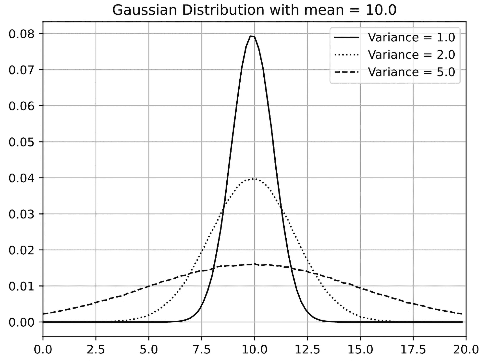

图 12.1：方差对高斯分布的影响

现在让我们回到策略梯度。前一章中提到过，策略梯度的核心思想是提高良好动作的概率并降低不良动作的概率。在数学表示中，我们的策略梯度被写为∇J ≈𝔼[Q(s,a)∇log π(a|s)]。缩放因子 Q(s,a)指定了我们希望在特定状态下增加或减少动作概率的多少。在 REINFORCE 方法中，我们使用折扣总奖励作为梯度的缩放因子。为了提高 REINFORCE 的稳定性，我们从梯度的缩放因子中减去了平均奖励。

为了理解为什么这有帮助，我们来看一个非常简单的优化步骤场景，在这个场景中，我们有三种动作，它们的总折扣奖励不同：Q[1]、Q[2]和 Q[3]。现在让我们检查在关于这些 Q[s]的相对值的情况下，策略梯度会发生什么。

作为第一个例子，假设 Q[1]和 Q[2]都等于某个小的正数，而 Q[3]是一个较大的负数。因此，第一步和第二步的行动获得了一些小的奖励，但第三步的结果并不理想。所有三步的综合梯度将尝试将我们的策略远离第三步的行动，并稍微推动它朝着第一步和第二步的行动方向发展，这完全是合理的做法。

现在让我们假设我们的奖励始终为正且只有数值不同。这相当于在前一个例子中的每个奖励值上添加一个常量：Q[1]、Q[2]和 Q[3]。在这种情况下，Q[1]和 Q[2]将变为大的正数，而 Q[3]将具有一个小的正值。然而，我们的策略更新将变得不同！我们将努力将策略推向第一步和第二步的行动，并稍微推向第三步的行动。因此，严格来说，尽管相对奖励相同，我们不再试图避免第三步的行动。

我们的策略更新依赖于添加到奖励中的常量，这可能会显著减缓训练进度，因为我们可能需要更多的样本来平滑这种策略梯度的变化。更糟的是，随着我们总的折扣奖励随时间变化，代理不断学习如何做得更好，我们的策略梯度方差也可能发生变化。例如，在 Atari Pong 环境中，开始时的平均奖励是−21...−20，因此所有的行动看起来几乎同样糟糕。

为了解决这个问题，在上一章中，我们从 Q 值中减去了总奖励的均值，并称这个均值为基准。这一技巧将我们的策略梯度归一化：例如，当平均奖励为−21 时，获得−20 的奖励看起来像是代理的胜利，这将推动其策略朝着采取的行动方向发展。

# CartPole 方差

为了在实践中验证这个理论结论，让我们绘制基准版本和不使用基准版本的训练过程中的策略梯度方差。完整示例位于 Chapter12/01_cartpole_pg.py，且大部分代码与第十一章相同。该版本的不同之处如下：

+   它现在接受命令行选项`--baseline`，启用从奖励中减去均值。默认情况下，不使用基准。

+   在每个训练循环中，我们从策略损失中获取梯度，并使用这些数据来计算方差。

为了仅收集来自策略损失的梯度，并排除为了探索而添加的熵奖励的梯度，我们需要分两阶段计算梯度。幸运的是，PyTorch 使得这一操作变得简单。以下代码中仅包含了训练循环的相关部分，用于说明这一思路：

```py
 optimizer.zero_grad() 
        logits_v = net(states_v) 
        log_prob_v = F.log_softmax(logits_v, dim=1) 
        log_p_a_v = log_prob_v[range(BATCH_SIZE), batch_actions_t] 
        log_prob_actions_v = batch_scale_v * log_p_a_v 
        loss_policy_v = -log_prob_actions_v.mean()
```

我们像以前一样计算策略损失，通过计算已采取动作的概率的对数并将其乘以策略尺度（如果我们没有使用基准线，它是总折扣奖励，或者是总奖励减去基准线）。

在下一步中，我们请求 PyTorch 反向传播策略损失，计算梯度并将它们保存在模型的缓冲区中：

```py
 loss_policy_v.backward(retain_graph=True)
```

由于我们之前执行了 optimizer.zero_grad()，这些缓冲区将只包含来自策略损失的梯度。这里有一个棘手的地方是我们在调用 backward() 时使用了 retain_graph=True 选项。它指示 PyTorch 保留变量的图结构。通常，调用 backward() 时会销毁图结构，但在我们的情况下，这不是我们想要的。一般来说，当我们需要在调用优化器之前多次反向传播损失时，保留图结构可能会很有用，尽管这不是一种非常常见的情况。

然后，我们遍历模型中的所有参数（模型的每个参数都是一个包含梯度的张量），并将它们的 grad 字段提取到一个展平的 NumPy 数组中：

```py
 grads = np.concatenate([p.grad.data.numpy().flatten() 
                                for p in net.parameters() 
                                if p.grad is not None])
```

这会给我们一个包含模型变量中所有梯度的长数组。然而，我们的参数更新不仅应该考虑策略梯度，还应考虑由熵奖励提供的梯度。为了实现这一点，我们计算熵损失并再次调用 backward()。为了能够第二次执行这一操作，我们需要传递 retain_graph=True。

在第二次调用 backward() 时，PyTorch 将反向传播我们的熵损失，并将梯度添加到内部梯度缓冲区中。因此，我们现在需要做的就是请求优化器使用这些合并的梯度执行优化步骤：

```py
 prob_v = F.softmax(logits_v, dim=1) 
        entropy_v = -(prob_v * log_prob_v).sum(dim=1).mean() 
        entropy_loss_v = -ENTROPY_BETA * entropy_v 
        entropy_loss_v.backward() 
        optimizer.step()
```

然后，我们需要做的唯一事情就是将我们感兴趣的统计数据写入 TensorBoard：

```py
 g_l2 = np.sqrt(np.mean(np.square(grads))) 
        g_max = np.max(np.abs(grads)) 
        writer.add_scalar("grad_l2", g_l2, step_idx) 
        writer.add_scalar("grad_max", g_max, step_idx) 
        writer.add_scalar("grad_var", np.var(grads), step_idx)
```

通过运行这个示例两次，一次使用 --baseline 命令行选项，一次不使用，我们可以得到策略梯度的方差图。以下图表显示了平滑的奖励（过去 100 集的平均值）和方差（使用窗口 20 平滑）：

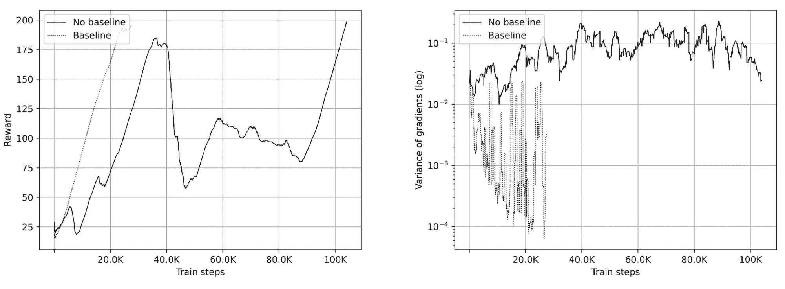

图 12.2：平滑奖励（左）和方差（右）

接下来的两个图表显示了梯度的大小（L2 范数）和最大值。所有值都经过窗口 20 平滑处理：

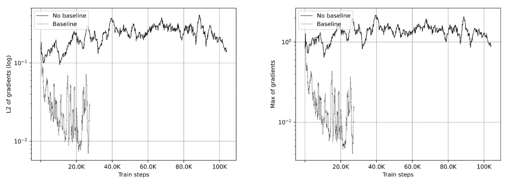

图 12.3：梯度的 L2 范数（左）和最大值（右）

如您所见，带有基准线的版本的方差比没有基准线的版本低两个到三个数量级，这有助于系统更快地收敛。

# 优势行为者-评论员（A2C）

减少方差的下一步是使我们的基准状态依赖性（这是个好主意，因为不同的状态可能具有非常不同的基准）。实际上，为了决定某个状态下某个动作的适用性，我们使用该动作的折扣总奖励。然而，总奖励本身可以表示为状态的值加上动作的优势：Q(s,a) = V (s) + A(s,a)。你在第八章中见过这种方法，当时我们讨论了 DQN 的修改，特别是对抗 DQN。

那么，为什么我们不能用 V(s) 作为基准呢？在这种情况下，我们的梯度规模将只是优势 A(s,a)，表示此动作相对于平均状态值的改善。实际上，我们可以这样做，这对于改进策略梯度方法是一个非常好的主意。唯一的问题是我们不知道需要从折扣总奖励 Q(s,a) 中减去的状态值 V(s)。为了解决这个问题，我们使用另一个神经网络，它将为每个观测值近似 V(s)。为了训练它，我们可以利用在 DQN 方法中使用的相同训练过程：我们将执行贝尔曼步骤，然后最小化均方误差来改进 V(s) 的近似。

当我们知道任何状态的值（或至少有一些近似值）时，我们可以利用它来计算策略梯度，并更新我们的策略网络，以增加具有良好优势值的动作的概率，并减少具有不良优势值的动作的机会。策略网络（返回动作概率分布）被称为演员（actor），因为它告诉我们该做什么。另一个网络称为评论员（critic），因为它通过返回 V(s) 让我们了解我们的动作有多好。这种改进有一个独立的名称，称为优势演员-评论员方法，通常缩写为 A2C。图 12.4 是其架构的示意图：

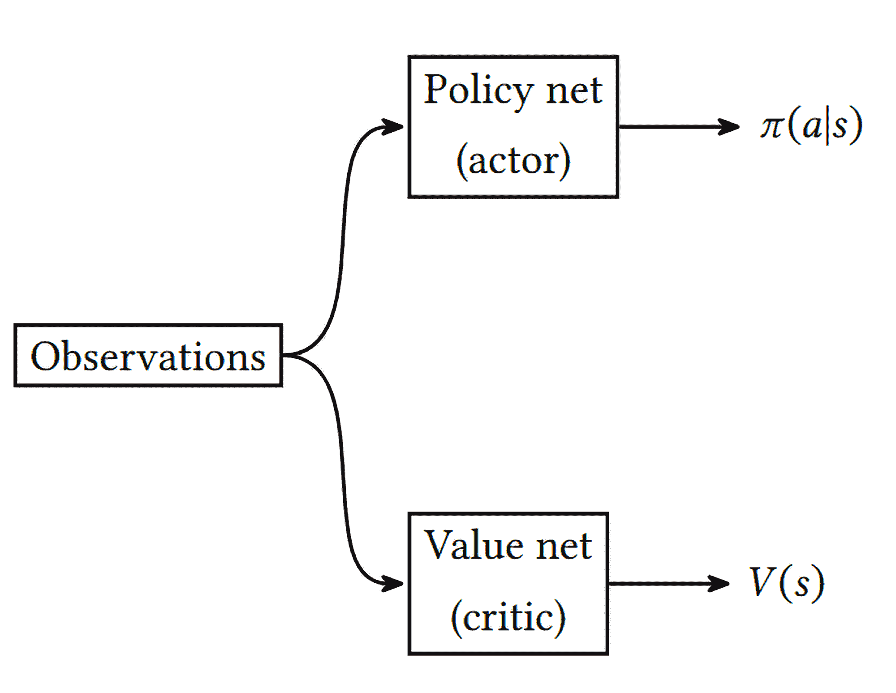

图 12.4：A2C 架构

实际上，策略网络和值网络部分重叠，主要是出于效率和收敛性的考虑。在这种情况下，策略和值被实现为网络的不同“头部”，它们从共享的主体获取输出，并将其转化为概率分布和一个表示状态值的单一数字。

这有助于两个网络共享低层次特征（例如 Atari 代理中的卷积滤波器），但以不同的方式将它们结合起来。下图展示了这种架构：

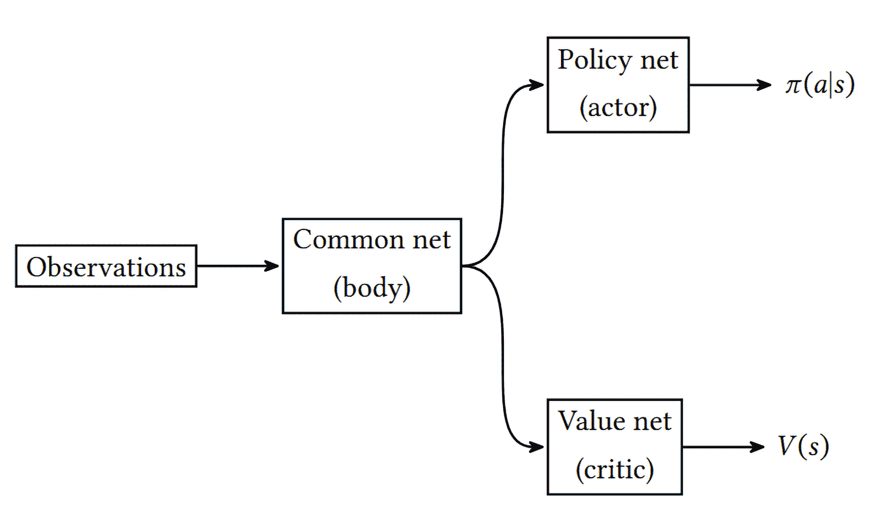

图 12.5：带有共享网络主体的 A2C 架构

从训练的角度来看，我们完成以下步骤：

1.  用随机值初始化网络参数，𝜃。

1.  在环境中执行 N 步，使用当前策略 π[𝜃]，并保存状态 s[t]、动作 a[t] 和奖励 r[t]。

1.  如果到达回合结束或 V 𝜃，则设置 R ← 0。

1.  对于 i = t − 1…t[start]（注意步骤是逆向处理的）：

    +   R ←r[i] + γR

    +   累积策略梯度：

        ![π (a |s) = P[At = a|St = s] ](img/eq45.png)

    +   累积值梯度：

        ![π (a |s) = P[At = a|St = s] ](img/eq46.png)

1.  使用累积的梯度更新网络参数，沿着策略梯度 ∂𝜃[π] 的方向移动，反方向则是值梯度 ∂𝜃[v]。

1.  从第 2 步开始重复，直到收敛。

这个算法只是一个大致的框架，类似于通常在研究论文中打印的内容。实际上，可能会使用一些扩展方法来提高该方法的稳定性：

+   通常会添加一个熵奖励来改善探索。这通常表现为一个熵值，添加到损失函数中：

    ![π (a |s) = P[At = a|St = s] ](img/eq47.png)

    当概率分布是均匀时，这个函数有一个最小值，因此通过将其添加到损失函数中，我们可以让智能体避免对自己的动作过于确定。β 的值是一个超参数，用来缩放熵奖励并在训练过程中优先进行探索。通常情况下，它是常数或在训练过程中线性递减的。

+   梯度累积通常作为一个损失函数实现，结合了三个部分：策略损失、值损失和熵损失。你应该注意这些损失的符号，因为策略梯度显示了策略改进的方向，但值损失和熵损失应该最小化。

+   为了提高稳定性，值得使用多个环境，提供并行的观察数据（当你有多个环境时，训练批次将从这些观察数据中创建）。我们将在本章后续讨论 A3C 方法时探讨几种实现方式。

前面方法的版本，通过并行运行多个环境来实现，称为优势异步演员-评论员方法，也被称为 A3C。A3C 方法将在后续讨论，但现在，我们先实现 A2C。

## A2C 在 Pong 中的应用

在上一章中，你看到了一次（不太成功的）尝试，使用策略梯度方法解决我们最喜欢的 Pong 环境。让我们再尝试一下，手头有演员-评论员方法。完整的源代码可以在 Chapter12/02_pong_a2c.py 中找到。

我们像往常一样，从定义超参数开始（省略了导入部分）：

```py
GAMMA = 0.99 
LEARNING_RATE = 0.001 
ENTROPY_BETA = 0.01 
BATCH_SIZE = 128 
NUM_ENVS = 50 

REWARD_STEPS = 4 
CLIP_GRAD = 0.1
```

这些值并未调整，这部分留给读者自己完成。这里有一个新的值：CLIP_GRAD。这个超参数指定了梯度裁剪的阈值，基本上它防止了在优化阶段梯度变得过大，从而使我们的策略过于偏离。裁剪是使用 PyTorch 的功能实现的，但这个概念非常简单：如果梯度的 L2 范数大于这个超参数，则梯度向量会被裁剪到这个值。

REWARD_STEPS 超参数确定我们将向前走多少步，以近似每个行动的总折扣奖励。

在策略梯度方法中，我们使用了大约 10 步，但在 A2C 中，我们将使用我们的值近似来获得进一步步骤的状态值，因此减少步数是可以的。以下是我们的网络架构：

```py
class AtariA2C(nn.Module): 
    def __init__(self, input_shape: tt.Tuple[int, ...], n_actions: int): 
        super(AtariA2C, self).__init__() 

        self.conv = nn.Sequential( 
            nn.Conv2d(input_shape[0], 32, kernel_size=8, stride=4), 
            nn.ReLU(), 
            nn.Conv2d(32, 64, kernel_size=4, stride=2), 
            nn.ReLU(), 
            nn.Conv2d(64, 64, kernel_size=3, stride=1), 
            nn.ReLU(), 
            nn.Flatten(), 
        ) 

        size = self.conv(torch.zeros(1, *input_shape)).size()[-1] 
        self.policy = nn.Sequential( 
            nn.Linear(size, 512), 
            nn.ReLU(), 
            nn.Linear(512, n_actions) 
        ) 
        self.value = nn.Sequential( 
            nn.Linear(size, 512), 
            nn.ReLU(), 
            nn.Linear(512, 1) 
        )
```

它具有共享的卷积体和两个头部：第一个返回包含我们行动概率分布的策略，第二个头部返回一个单一数字，该数字将近似于状态的值。它可能看起来与我们在第八章中提到的对抗性 DQN 架构相似，但我们的训练过程不同。

网络的前向传递返回一个包含两个张量的元组——策略和值：

```py
 def forward(self, x: torch.ByteTensor) -> tt.Tuple[torch.Tensor, torch.Tensor]: 
        xx = x / 255 
        conv_out = self.conv(xx) 
        return self.policy(conv_out), self.value(conv_out)
```

现在我们需要讨论一个重要的大函数，它接受环境转移的批次并返回三个张量：状态批次、采取的行动批次和使用公式 Q(s,a) = ∑ [i=0]^(N−1)γ^ir[i] + γ^NV(s[N])计算的 Q 值批次。这个 Q 值将在两个地方使用：计算均方误差（MSE）损失以改善值的近似，就像 DQN 一样；以及计算行动的优势。

```py
def unpack_batch(batch: tt.List[ExperienceFirstLast], net: AtariA2C, 
                 device: torch.device, gamma: float, reward_steps: int): 
    states = [] 
    actions = [] 
    rewards = [] 
    not_done_idx = [] 
    last_states = [] 
    for idx, exp in enumerate(batch): 
        states.append(np.asarray(exp.state)) 
        actions.append(int(exp.action)) 
        rewards.append(exp.reward) 
        if exp.last_state is not None: 
            not_done_idx.append(idx) 
            last_states.append(np.asarray(exp.last_state))
```

一开始，我们只需要遍历我们的转移批次并将它们的字段复制到列表中。注意，奖励值已经包含了 REWARD_STEPS 的折扣奖励，因为我们使用了 ptan.ExperienceSourceFirstLast 类。我们还需要处理回合结束的情况，并记住非终止回合的批次条目索引。

在以下代码中，我们将收集到的状态和动作转换为 PyTorch 张量，并根据需要将其复制到图形处理单元（GPU）中：

```py
 states_t = torch.FloatTensor(np.asarray(states)).to(device) 
    actions_t = torch.LongTensor(actions).to(device)
```

在这里，对 np.asarray()的额外调用可能看起来是多余的，但没有它，张量创建的性能会降低 5 到 10 倍。这在 PyTorch 中被称为[问题 #13918](https://github.com/pytorch/pytorch/issues/13918)，并且在写作时尚未解决，因此一种解决方案是传递一个单一的 NumPy 数组，而不是数组列表。

函数的其余部分计算 Q 值，考虑了终止回合的情况：

```py
 rewards_np = np.array(rewards, dtype=np.float32) 
    if not_done_idx: 
        last_states_t = torch.FloatTensor( 
            np.asarray(last_states)).to(device) 
        last_vals_t = net(last_states_t)[1] 
        last_vals_np = last_vals_v.data.cpu().numpy()[:, 0] 
        last_vals_np *= gamma ** reward_steps 
        rewards_np[not_done_idx] += last_vals_np
```

上面的代码准备了变量，存储我们转移链中的最后一个状态，并查询我们的网络以获取 V(s)的近似值。然后，将该值乘以折扣因子并加上即时奖励。

在函数的末尾，我们将 Q 值打包到张量中并返回：

```py
 ref_vals_t = torch.FloatTensor(rewards_np).to(device) 
    return states_t, actions_t, ref_vals_t
```

在以下代码中，你可以注意到一种新的创建环境的方式，使用类 gym.vector.SyncVectorEnv，它传入一个包含创建底层环境的 lambda 函数的列表：

```py
if __name__ == "__main__": 
    parser = argparse.ArgumentParser() 
    parser.add_argument("--dev", default="cpu", help="Device to use, default=cpu") 
    parser.add_argument("--use-async", default=False, action=’store_true’, 
                        help="Use async vector env (A3C mode)") 
    parser.add_argument("-n", "--name", required=True, help="Name of the run") 
    args = parser.parse_args() 
    device = torch.device(args.dev) 

    env_factories = [ 
        lambda: ptan.common.wrappers.wrap_dqn(gym.make("PongNoFrameskip-v4")) 
        for _ in range(NUM_ENVS) 
    ] 
    if args.use_async: 
        env = gym.vector.AsyncVectorEnv(env_factories) 
    else: 
        env = gym.vector.SyncVectorEnv(env_factories) 
    writer = SummaryWriter(comment="-pong-a2c_" + args.name)
```

类 gym.vector.SyncVectorEnv 是 Gymnasium 提供的，允许将多个环境封装成一个单一的“向量化”环境。底层环境必须具有相同的动作空间和观察空间，这使得向量化环境能够接受一组动作并返回一批观察和奖励。你可以在 Gymnasium 文档中找到更多细节：[`gymnasium.farama.org/api/vector/`](https://gymnasium.farama.org/api/vector/)。

同步向量化环境（SyncVectorEnv 类）几乎与我们在第九章“多个环境”部分中使用的优化完全相同，当时我们将多个 gym 环境传入经验源以提高 DQN 训练的性能。

但在向量化环境的情况下，必须使用不同的经验源类：VectorExperienceSourceFirstLast，它考虑了向量化，并优化了代理对观察的应用。从外部看，这个经验源的接口与之前完全相同。

命令行参数--use-async（它将我们的包装类从 SyncVectorEnv 切换为 AsyncVectorEnv）目前不相关——我们稍后会使用它，在讨论 A3C 方法时。

然后，我们创建网络、代理和经验源：

```py
 net = common.AtariA2C(env.single_observation_space.shape, 
                          env.single_action_space.n).to(device) 
    print(net) 

    agent = ptan.agent.PolicyAgent(lambda x: net(x)[0], apply_softmax=True, device=device) 
    exp_source = VectorExperienceSourceFirstLast( 
        env, agent, gamma=GAMMA, steps_count=REWARD_STEPS) 

    optimizer = optim.Adam(net.parameters(), lr=LEARNING_RATE, eps=1e-3)
```

这里有一个非常重要的细节是将 eps 参数传递给优化器。如果你熟悉 Adam 算法，你可能知道 epsilon 是一个加到分母上的小数，用来防止零除错误。通常，这个值设置为一些小数字，如 10^(-8)或 10^(-10)，但在我们的情况下，这些值太小了。我没有严格的数学解释，但使用默认的 epsilon 值时，方法根本无法收敛。很可能，除以一个小值 10^(-8)会导致梯度过大，这对训练稳定性来说是致命的。

另一个细节是使用 VectorExperienceSourceFirstLast 而不是 ExperienceSourceFirstLast。这是必要的，因为向量化环境将多个普通的 Atari 环境封装在一起。向量化环境还暴露了 single_observation_space 和 single_action_space 这两个属性，它们分别是单个环境的观察空间和动作空间。

在训练循环中，我们使用两个包装器：

```py
 batch = [] 

    with common.RewardTracker(writer, stop_reward=18) as tracker: 
        with TBMeanTracker(writer, batch_size=10) as tb_tracker: 
            for step_idx, exp in enumerate(exp_source): 
                batch.append(exp) 

                new_rewards = exp_source.pop_total_rewards() 
                if new_rewards: 
                    if tracker.reward(new_rewards[0], step_idx): 
                        break 

                if len(batch) < BATCH_SIZE: 
                    continue
```

代码中的第一个包装器你已经很熟悉：common.RewardTracker，它计算最后 100 个回合的平均奖励，并告诉我们当这个平均奖励超过所需阈值时。另一个包装器 TBMeanTracker 来自 PTAN 库，负责将最后 10 步中测量的参数的平均值写入 TensorBoard。这是非常有帮助的，因为训练可能需要上百万步，我们不希望每一步都写入 TensorBoard，而是每 10 步写入平滑后的值。

下一段代码负责我们计算损失的部分，这是 A2C 方法的核心。首先，我们使用之前描述的函数解包批次，并要求网络返回该批次的策略和值：

```py
 states_t, actions_t, vals_ref_t = common.unpack_batch( 
                    batch, net, device=device, gamma=GAMMA, reward_steps=REWARD_STEPS) 
                batch.clear() 

                optimizer.zero_grad() 
                logits_t, value_t = net(states_t)
```

策略以未归一化的形式返回，因此为了将其转换为概率分布，我们需要对其应用 softmax。由于策略损失需要概率分布的对数，我们将使用 log_softmax 函数，这比先调用 softmax 再取对数更加稳定。

在价值损失部分，我们计算网络返回的值与我们通过展开四步的贝尔曼方程所进行的近似之间的均方误差（MSE）：

```py
 loss_value_t = F.mse_loss(value_t.squeeze(-1), vals_ref_t)
```

接下来，我们计算策略损失以获得策略梯度：

```py
 log_prob_t = F.log_softmax(logits_t, dim=1) 
                adv_t = vals_ref_t - value_t.detach() 
                log_act_t = log_prob_t[range(BATCH_SIZE), actions_t] 
                log_prob_actions_t = adv_t * log_act_t 
                loss_policy_t = -log_prob_actions_t.mean()
```

前两步获得我们策略的日志并计算行动的优势，优势 A(s,a) = Q(s,a) −V (s)。调用 value_t.detach() 很重要，因为我们不希望将策略梯度传播到我们的价值近似头部。然后，我们对采取的行动的概率取对数，并用优势对其进行缩放。我们的策略梯度损失值将等于该缩放后的策略对数的负均值，因为策略梯度引导我们朝着策略改进的方向，但损失值应该最小化。

我们损失函数的最后一部分是熵损失：

```py
 prob_t = F.softmax(logits_t, dim=1) 
                entropy_loss_t = ENTROPY_BETA * (prob_t * log_prob_t).sum(dim=1).mean()
```

熵损失等于我们策略的缩放熵，并取其相反符号（熵的计算公式是 H(π) = −∑ π log π）。

在接下来的代码中，我们计算并提取我们策略的梯度，这些梯度将用于追踪最大梯度、其方差和 L2 范数：

```py
 loss_policy_t.backward(retain_graph=True) 
                grads = np.concatenate([ 
                    p.grad.data.cpu().numpy().flatten() 
                    for p in net.parameters() if p.grad is not None 
                ])
```

作为训练的最后一步，我们反向传播熵损失和价值损失，裁剪梯度，并要求优化器更新网络：

```py
 loss_v = entropy_loss_t + loss_value_t 
                loss_v.backward() 
                nn_utils.clip_grad_norm_(net.parameters(), CLIP_GRAD) 
                optimizer.step() 
                loss_v += loss_policy_t
```

在训练循环的最后，我们追踪所有需要在 TensorBoard 中监控的值：

```py
 tb_tracker.track("advantage", adv_t, step_idx) 
                tb_tracker.track("values", value_t, step_idx) 
                tb_tracker.track("batch_rewards", vals_ref_t, step_idx) 
                tb_tracker.track("loss_entropy", entropy_loss_t, step_idx) 
                tb_tracker.track("loss_policy", loss_policy_t, step_idx) 
                tb_tracker.track("loss_value", loss_value_t, step_idx) 
                tb_tracker.track("loss_total", loss_v, step_idx) 
                tb_tracker.track("grad_l2", np.sqrt(np.mean(np.square(grads))), step_idx) 
                tb_tracker.track("grad_max", np.max(np.abs(grads)), step_idx) 
                tb_tracker.track("grad_var", np.var(grads), step_idx)
```

有很多值需要监控，我们将在下一部分中讨论它们。

## 结果

要开始训练，请运行 02_pong_a2c.py 并使用 --dev（表示使用 GPU）和 -n 选项（为 TensorBoard 提供一个运行名称）：

```py
Chapter12$ ./02_pong_a2c.py --dev cuda -n tt 
A.L.E: Arcade Learning Environment (version 0.8.1+53f58b7) 
[Powered by Stella] 
AtariA2C( 
  (conv): Sequential( 
   (0): Conv2d(4, 32, kernel_size=(8, 8), stride=(4, 4)) 
   (1): ReLU() 
   (2): Conv2d(32, 64, kernel_size=(4, 4), stride=(2, 2)) 
   (3): ReLU() 
   (4): Conv2d(64, 64, kernel_size=(3, 3), stride=(1, 1)) 
   (5): ReLU() 
   (6): Flatten(start_dim=1, end_dim=-1) 
  ) 
  (policy): Sequential( 
   (0): Linear(in_features=3136, out_features=512, bias=True) 
   (1): ReLU() 
   (2): Linear(in_features=512, out_features=6, bias=True) 
  ) 
  (value): Sequential( 
   (0): Linear(in_features=3136, out_features=512, bias=True) 
   (1): ReLU() 
   (2): Linear(in_features=512, out_features=1, bias=True) 
  ) 
) 
37850: done 1 games, mean reward -21.000, speed 1090.79 f/s 
39250: done 2 games, mean reward -21.000, speed 1111.24 f/s 
39550: done 3 games, mean reward -21.000, speed 1118.06 f/s 
40000: done 4 games, mean reward -21.000, speed 1083.18 f/s 
40300: done 5 games, mean reward -21.000, speed 1141.46 f/s 
40750: done 6 games, mean reward -21.000, speed 1077.44 f/s 
40850: done 7 games, mean reward -21.000, speed 940.09 f/s 
...
```

作为警告，训练过程比较漫长。使用原始超参数，它大约需要 1000 万帧来解决问题，大约在 GPU 上需要三个小时。

本章后面，我们将查看 A2C 方法的异步版本，它在一个单独的进程中执行环境（这提高了训练的稳定性和性能）。但首先，让我们集中关注 TensorBoard 中的图表。

奖励动态比上一章的示例要好得多：

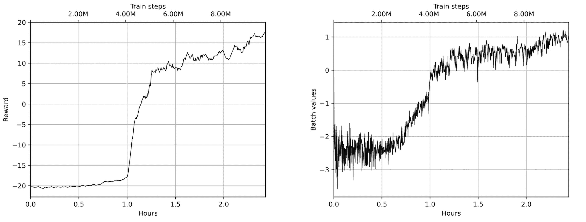

图 12.6：平滑奖励（左侧）和平均批次值（右侧）

左侧的图是过去 100 个训练回合的平均奖励。右侧的图，“批次值”，展示了使用贝尔曼方程近似的 Q 值以及 Q 近似的整体正向动态。这表明我们的训练过程在时间上基本上是持续改进的。

接下来的四个图与我们的损失相关，包含了各个损失组件和总损失：

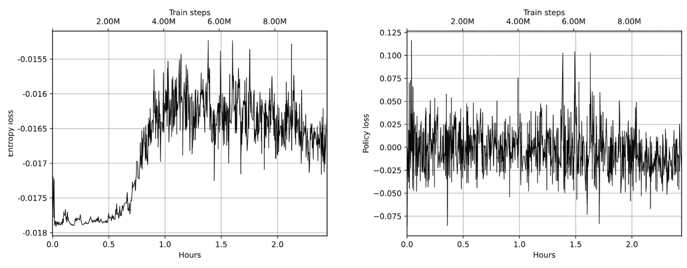

图 12.7：熵损失（左侧）和策略损失（右侧）


图 12.8：价值损失（左侧）和总损失（右侧）

在这里，我们必须注意以下几点：

+   首先，我们的价值损失（图 12.8，在左侧）持续减少，这表明我们的 V(s)近似值在训练过程中得到了改善。

+   第二个观察结果是我们的熵损失（图 12.7，左侧）在训练的中期增长，但它在总损失中并不占主导地位。这基本上意味着随着策略变得不再均匀，我们的代理在其动作上变得更加自信。

+   这里最后需要注意的是，策略损失（图 12.7，右侧）大多数时候在减少，并且与总损失相关联，这是好的，因为我们首先关注的是我们策略的梯度。

最后一组图显示了优势值和策略梯度度量：

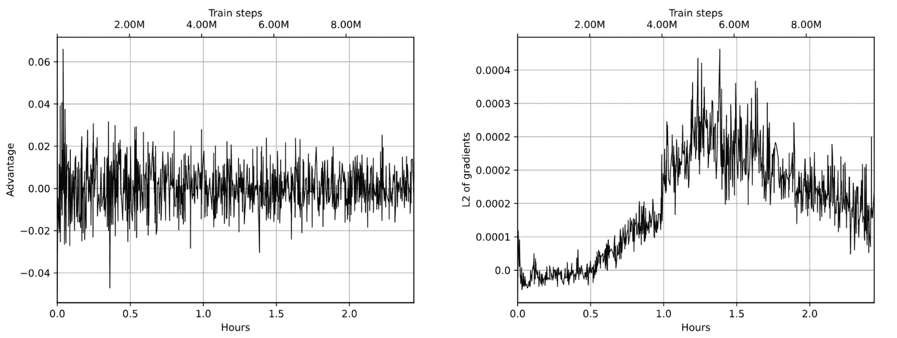

图 12.9：优势（左侧）和梯度的 L2 范数（右侧）

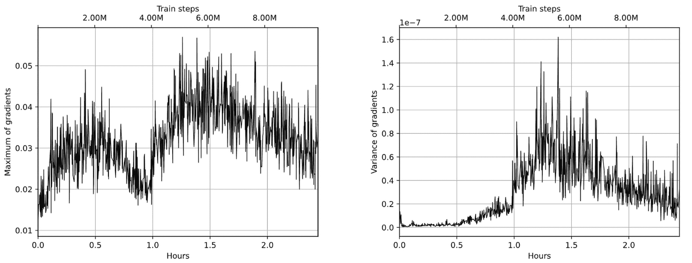

图 12.10：梯度的最大值（左侧）和梯度方差（右侧）

优势是我们策略梯度的尺度，它等于 Q(s,a) − V(s)。我们期望它在 0 周围波动（因为从平均而言，单一动作对状态值的影响不应该很大），而图表符合我们的预期。梯度图表表明我们的梯度既不太小也不太大。方差在训练的最初阶段（前 200 万帧）非常小，但后来开始增长，这意味着我们的策略在发生变化。

# 异步优势演员评论员（A3C）

在本节中，我们将扩展 A2C 方法。这个扩展加入了真正的异步环境交互，被称为异步优势演员评论员（A3C）。该方法是 RL 实践者最广泛使用的算法之一。

我们将介绍两种为基础 A2C 方法添加异步行为的方式：数据级并行和梯度级并行。它们有不同的资源需求和特点，这使得它们适用于不同的情况。

## 相关性与样本效率

改进策略梯度方法稳定性的一种方式是使用多个环境并行训练。其背后的原因是我们在第六章中讨论的基本问题，即样本之间的相关性，这破坏了独立同分布（iid）假设，而这个假设对于随机梯度下降（SGD）优化至关重要。相关性的负面影响是梯度方差非常大，这意味着我们的训练批次包含了非常相似的样本，它们都会将我们的网络推向相同的方向。然而，这个方向在全局上可能完全是错误的，因为所有这些样本可能来自同一个幸运或不幸运的回合。

使用我们的深度 Q 网络（DQN），我们通过在重放缓冲区中存储大量的历史状态，并从这个缓冲区中抽取训练批次来解决这个问题。如果缓冲区足够大，从中随机抽取的样本将更好地代表状态的整体分布。不幸的是，这个方法不能应用于策略梯度方法。这是因为大多数策略梯度方法是基于当前策略进行训练的，也就是说，我们必须使用当前策略生成的样本来训练，因此不能再记住旧的转换。你可以尝试这样做，但最终得到的策略梯度会是基于旧策略生成样本的梯度，而不是你想更新的当前策略。

研究人员已经研究这个问题多年，提出了几种解决方案，但这个问题仍远未解决。最常用的解决方案是通过多个并行环境收集转换，这些环境都利用当前的策略。这种方法打破了单一回合中的相关性，因为我们现在是在多个不同环境中收集的多个回合上进行训练。同时，我们依然使用当前的策略。这种方法的一个重大缺点是样本效率低，因为我们基本上会丢弃在单一训练轮次中获得的所有经验。

将 DQN 与策略梯度方法进行比较非常简单。例如，对于 DQN，如果我们使用 100 万个回放缓冲区样本，每个新帧的训练批量大小为 32 个样本，那么每个过渡状态大约会在从经验回放中推送之前被使用 32 次。对于优先回放缓冲区（在第八章讨论过），这个数字可能会高得多，因为样本的选择概率不是均匀的。在策略梯度方法的情况下，从环境中获得的每个经验只能使用一次，因为我们的方法需要新鲜的数据，因此策略梯度方法的数据效率可能比基于价值的离线方法低一个数量级。

另一方面，我们的 A2C 代理在 Pong 上收敛用了 800 万帧，这仅是第六章和第八章中基本 DQN 的 100 万帧的八倍。因此，这向我们展示了策略梯度方法并非完全无用；它们只是不同的，并且有其自身的特点，你在选择方法时需要考虑这些特点。如果你的环境在代理交互方面是“便宜”的（环境响应快速，内存占用低，支持并行化等），那么策略梯度方法可能是更好的选择。另一方面，如果环境“昂贵”，并且获取大量经验可能会减慢训练过程，那么基于价值的方法可能是更聪明的选择。

## 向 A2C 中添加额外的“A”

从实践角度看，与多个并行环境进行通信是简单的。我们已经在第九章和当前章节的前面部分做过这件事，但并没有明确说明。在 A2C 代理中，我们将一个 Gym 环境的数组传递给 ExperienceSource 类，该类将其切换为轮询数据收集模式。这意味着每次我们从经验源请求过渡时，该类会使用我们数组中的下一个环境（当然，会为每个环境保持状态）。这种简单的方法相当于与环境进行并行通信，但有一个小小的区别：通信不是严格意义上的并行，而是以串行的方式进行。然而，我们的经验源中的样本是打乱的。这个思路在下图中展示：

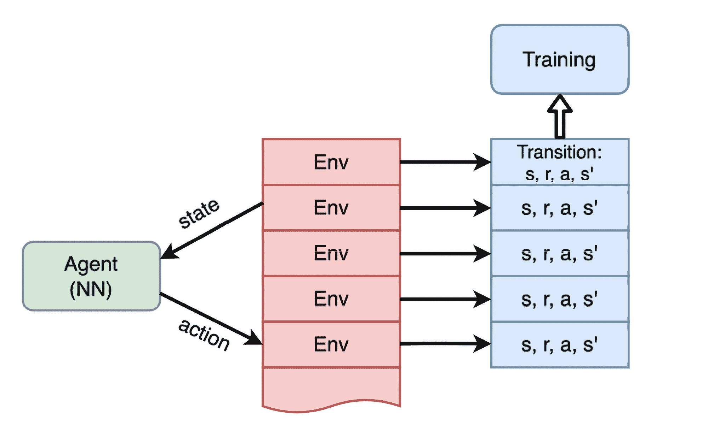

图 12.11：一个代理在多个环境中并行训练

这种方法运行良好，并帮助我们在 A2C 方法中达到了收敛，但在计算资源利用方面仍不完美，因为所有处理都是顺序进行的。即使是现在的一台普通工作站，也拥有多个 CPU 核心，可以用于计算，如训练和环境交互。另一方面，平行编程比传统范式更难，当你有一个清晰的执行流时，传统方法相对更简单。幸运的是，Python 是一种非常具有表达力和灵活性的语言，拥有大量的第三方库，允许你轻松进行平行编程。我们已经在第 9 章中看到过 torch.multiprocessing 库的示例，在 DQN 训练中我们平行化了代理的执行。但还有其他更高级的库，如 ray，它允许我们平行化代码执行，隐藏底层的通信细节。

关于演员-评论家并行化，有两种方法：

1.  数据并行性：我们可以有多个进程，每个进程与一个或多个环境进行通信，并提供过渡数据（s,r,a,s′）。所有这些样本将汇聚到一个单独的训练过程中，计算损失并执行 SGD 更新。然后，更新后的神经网络（NN）参数需要广播到所有其他进程，以便在未来的环境通信中使用。这个模型在图 12.12 中有所说明。

1.  梯度并行性：由于训练过程的目标是计算梯度来更新我们的神经网络（NN），我们可以有多个进程在各自的训练样本上计算梯度。然后，这些梯度可以汇总在一个进程中执行 SGD 更新。当然，更新后的 NN 权重也必须传播回所有工作进程，以保持数据的一致性。这在图 12.13 中有所说明。

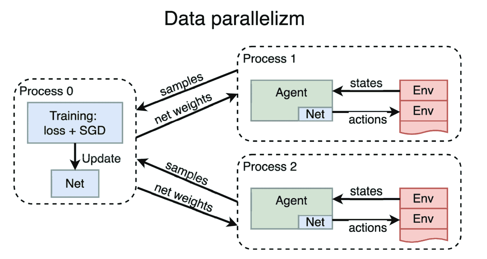

图 12.12：第一种演员-评论家并行化方法，基于分布式训练样本的汇集

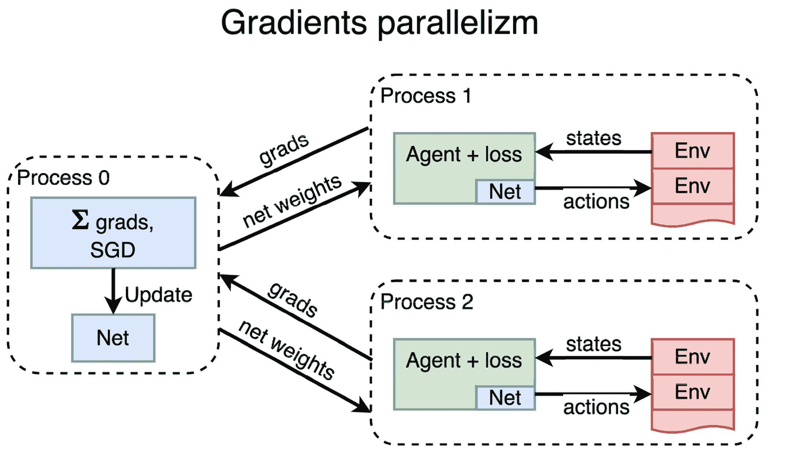

图 12.13：第二种并行化方法，为模型汇集梯度

这两种方法之间的差异从图表上看可能并不十分显著，但你需要意识到计算成本的差异。A2C 优化中的最重操作是训练过程，它包括从数据样本中计算损失（前向传播）以及根据该损失计算梯度。SGD 优化步骤相对轻量——基本上只是将缩放后的梯度加到神经网络（NN）的权重上。通过将第二种方法（梯度并行）中的损失计算和梯度计算从中央处理过程移出，我们消除了主要的潜在瓶颈，并使整个过程变得更加可扩展。

实际上，选择哪种方法主要取决于你的资源和目标。如果你有一个单一的优化问题，并且拥有大量分布式计算资源，比如在网络中分布的数十个 GPU，那么梯度并行将是加速训练的最佳方法。

然而，如果只有一个 GPU，两种方法会提供类似的性能，但第一种方法通常更易于实现，因为你无需处理低级别的梯度值。在本章中，我们将通过我们最喜欢的 Pong 游戏比较这两种方法，看看它们的差异，并探索 PyTorch 的多进程能力。

## A3C 与数据并行

我们将检查的 A3C 并行化的第一个版本（如图 12.12 所示）有一个主要进程负责执行训练，多个子进程与环境进行通信并收集经验进行训练。

事实上，我们在第九章中已经实现了这个版本，当时我们在子进程中运行多个代理，训练 DQN 模型（那时我们在 FPS 方面获得了 27%的加速）。在这一部分，我不会用 A3C 方法重新实现相同的方法，而是想展示“库的力量”。

我们已经简要提到过 Gymnasium 中的类`gym.vector.SyncVectorEnv`（它仅存在于 Farama 的分支中，而不在原始的 OpenAI Gym 中）和 PTAN 经验源，它支持“向量化”环境：`VectorExperienceSourceFirstLast`。类`SyncVectorEnv`按顺序处理封装的环境，但有一个替代类`AsyncVectorEnv`，它使用`mp.multiprocessing`处理子环境。所以，为了获得 A2C 方法的数据并行版本，我们只需要将`SyncVectorEnv`替换为`AsyncVectorEnv`，这样就完成了。

第十二章的代码（Chapter12/02_pong_a2c.py）已经支持这个替换操作，方法是传递`--use-async`命令行选项。

### 结果

异步版本在 50 个环境下展示了 2000 FPS 的性能，比顺序版本提高了 2 倍。以下图表比较了这两个版本的性能和奖励动态：

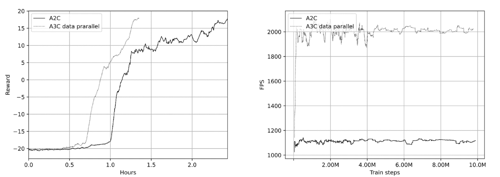

图 12.14：A2C 和 A3C 在奖励（左）和速度（右）上的比较

## A3C 与梯度并行

接下来，我们将考虑一种并行化 A2C 实现的方法，它将有多个子进程，但它们不是将训练数据传递给中央训练循环，而是使用它们本地的训练数据计算梯度，并将这些梯度发送给中央主进程。这个主进程负责将这些梯度合并（基本上就是求和）并对共享网络进行 SGD 更新。

这个差异看起来可能微不足道，但这种方法的可扩展性更强，特别是当你有多个强大的节点并且这些节点通过多个 GPU 连接到网络时。在这种情况下，数据并行模型中的中央处理过程很快就会成为瓶颈，因为损失计算和反向传播是计算密集型的。梯度并行化可以将负载分配到多个 GPU 上，在中央位置仅执行相对简单的梯度组合操作。

### 实现

完整的示例在 Chapter12/03_a3c_grad.py 文件中，并且使用我们已经看到的 Chapter12/lib/common.py 模块。

和往常一样，我们首先定义超参数：

```py
GAMMA = 0.99 
LEARNING_RATE = 0.001 
ENTROPY_BETA = 0.01 
REWARD_STEPS = 4 
CLIP_GRAD = 0.1 

PROCESSES_COUNT = 4 
NUM_ENVS = 8 
GRAD_BATCH = 64 
TRAIN_BATCH = 2 

ENV_NAME = "PongNoFrameskip-v4" 
NAME = ’pong’ 
REWARD_BOUND = 18
```

这些与之前的示例大致相同，唯一的区别是 BATCH_SIZE 被两个参数取代：GRAD_BATCH 和 TRAIN_BATCH。GRAD_BATCH 的值定义了每个子进程用于计算损失并获取梯度值的批次大小。第二个参数 TRAIN_BATCH 指定了每个 SGD 迭代中将结合来自子进程的多少个梯度批次。每个由子进程产生的条目具有与我们的网络参数相同的形状，我们将其 TRAIN_BATCH 的值相加。因此，对于每一步优化，我们使用 TRAIN_BATCH * GRAD_BATCH 个训练样本。由于损失计算和反向传播是相当繁重的操作，我们使用较大的 GRAD_BATCH 来提高它们的效率。

由于这个大批次，我们应该保持相对较低的 TRAIN_BATCH，以保持网络的策略更新。

现在我们有两个函数——make_env()，用于创建一个封装的 Pong 环境，以及 grads_func()，它更加复杂，实现了我们通常在训练循环中执行的大部分训练逻辑。作为补偿，主进程中的训练循环变得几乎是微不足道的：

```py
def make_env() -> gym.Env: 
    return ptan.common.wrappers.wrap_dqn(gym.make("PongNoFrameskip-v4")) 

def grads_func(proc_name: str, net: common.AtariA2C, device: torch.device, 
               train_queue: mp.Queue): 
    env_factories = [make_env for _ in range(NUM_ENVS)] 
    env = gym.vector.SyncVectorEnv(env_factories) 

    agent = ptan.agent.PolicyAgent(lambda x: net(x)[0], device=device, apply_softmax=True) 
    exp_source = VectorExperienceSourceFirstLast( 
        env, agent, gamma=GAMMA, steps_count=REWARD_STEPS) 

    batch = [] 
    frame_idx = 0 
    writer = SummaryWriter(comment=proc_name)
```

在创建子进程时，我们将几个参数传递给 grads_func() 函数：

+   用于创建 TensorBoard 写入器的进程名称。在这个示例中，每个子进程都写入自己的 TensorBoard 数据集。

+   共享神经网络。

+   一个 torch.device 实例，用于指定计算设备。

+   用于将计算出的梯度传递给中央处理过程的队列。

我们的子进程函数与数据并行版本中的主训练循环非常相似，这并不令人惊讶，因为我们的子进程承担的责任增加了。然而，我们并没有要求优化器更新网络，而是收集梯度并将其发送到队列中。其余的代码几乎没有变化：

```py
 with common.RewardTracker(writer, REWARD_BOUND) as tracker: 
        with TBMeanTracker(writer, 100) as tb_tracker: 
            for exp in exp_source: 
                frame_idx += 1 
                new_rewards = exp_source.pop_total_rewards() 
                if new_rewards and tracker.reward(new_rewards[0], frame_idx): 
                    break 

                batch.append(exp) 
                if len(batch) < GRAD_BATCH: 
                    continue
```

到目前为止，我们已经收集了包含转换的批次并处理了回合结束的奖励。

在函数的下一部分，我们从训练数据中计算组合损失并执行损失的反向传播：

```py
 data = common.unpack_batch(batch, net, device=device, gamma=GAMMA, 
                                           reward_steps=REWARD_STEPS) 
                states_v, actions_t, vals_ref_v = data 
                batch.clear() 

                net.zero_grad() 
                logits_v, value_v = net(states_v) 
                loss_value_v = F.mse_loss(value_v.squeeze(-1), vals_ref_v) 

                log_prob_v = F.log_softmax(logits_v, dim=1) 
                adv_v = vals_ref_v - value_v.detach() 
                log_p_a = log_prob_v[range(GRAD_BATCH), actions_t] 
                log_prob_actions_v = adv_v * log_p_a 
                loss_policy_v = -log_prob_actions_v.mean() 

                prob_v = F.softmax(logits_v, dim=1) 
                ent = (prob_v * log_prob_v).sum(dim=1).mean() 
                entropy_loss_v = ENTROPY_BETA * ent 

                loss_v = entropy_loss_v + loss_value_v + loss_policy_v 
                loss_v.backward()
```

在接下来的代码中，我们将传送在训练过程中要监视的中间值到 TensorBoard：

```py
 tb_tracker.track("advantage", adv_v, frame_idx) 
                tb_tracker.track("values", value_v, frame_idx) 
                tb_tracker.track("batch_rewards", vals_ref_v, frame_idx) 
                tb_tracker.track("loss_entropy", entropy_loss_v, frame_idx) 
                tb_tracker.track("loss_policy", loss_policy_v, frame_idx) 
                tb_tracker.track("loss_value", loss_value_v, frame_idx) 
                tb_tracker.track("loss_total", loss_v, frame_idx)
```

在循环结束时，我们需要剪裁梯度，并将其从网络的参数中提取到一个单独的缓冲区中（以防它们被下次循环的迭代损坏）。在这里，我们实际上将梯度存储在每个网络参数的`tensor.grad`字段中。这可以在不需要与其他工作进程同步的情况下完成，因为我们的网络参数是共享的，但梯度是由每个进程本地分配的：

```py
 nn_utils.clip_grad_norm_( 
                    net.parameters(), CLIP_GRAD) 
                grads = [ 
                    param.grad.data.cpu().numpy() if param.grad is not None else None 
                    for param in net.parameters() 
                ] 
                train_queue.put(grads) 

    train_queue.put(None)
```

`grads_func`中的最后一行将 None 放入队列，表示该子进程已达到游戏解决状态，训练应当停止。

主进程从创建网络并共享其权重开始：

```py
if __name__ == "__main__": 
    mp.set_start_method(’spawn’) 
    os.environ[’OMP_NUM_THREADS’] = "1" 
    parser = argparse.ArgumentParser() 
    parser.add_argument("--dev", default="cpu", help="Device to use, default=cpu") 
    parser.add_argument("-n", "--name", required=True, help="Name of the run") 
    args = parser.parse_args() 
    device = torch.device(args.dev) 

    env = make_env() 
    net = common.AtariA2C(env.observation_space.shape, env.action_space.n).to(device) 
    net.share_memory()
```

在这里，与前一部分一样，我们需要为`torch.multiprocessing`设置启动方法，并限制 OpenMP 启动的线程数量。这是通过设置环境变量`OMP_NUM_THREADS`来完成的，该变量告诉 OpenMP 库可以启动的线程数。OpenMP（[`www.openmp.org/`](https://www.openmp.org/)）被 Gym 和 OpenCV 库广泛使用，以在多核系统上提供加速，大多数情况下这是好事。默认情况下，使用 OpenMP 的进程会为系统中的每个核心启动一个线程。但在我们的案例中，OpenMP 的效果正好相反：由于我们正在实现自己的并行化，通过启动多个进程，额外的线程会通过频繁的上下文切换给核心带来负担，从而对性能产生负面影响。为避免这种情况，我们明确将线程数限制为一个线程。如果你愿意，可以自己尝试调整这个参数。在我的系统上，没有设置该环境变量时，我体验到了 3-4 倍的性能下降。

然后，我们创建通信队列并生成所需数量的子进程：

```py
 optimizer = optim.Adam(net.parameters(), lr=LEARNING_RATE, eps=1e-3) 

    train_queue = mp.Queue(maxsize=PROCESSES_COUNT) 
    data_proc_list = [] 
    for proc_idx in range(PROCESSES_COUNT): 
        proc_name = f"-a3c-grad_pong_{args.name}#{proc_idx}" 
        p_args = (proc_name, net, device, train_queue) 
        data_proc = mp.Process(target=grads_func, args=p_args) 
        data_proc.start() 
        data_proc_list.append(data_proc)
```

现在我们可以进入训练循环：

```py
 batch = [] 
    step_idx = 0 
    grad_buffer = None 

    try: 
        while True: 
            train_entry = train_queue.get() 
            if train_entry is None: 
                break
```

与数据并行版本的 A3C 相比，主要的区别在于训练循环，这里更加简单，因为子进程已经为我们完成了所有繁重的计算。在循环开始时，我们处理当某个进程已达到所需的平均奖励时的情况（此时队列中为 None）。在这种情况下，我们直接退出循环以停止训练。

我们将所有网络参数的梯度加总在一起：

```py
 step_idx += 1 

            if grad_buffer is None: 
                grad_buffer = train_entry 
            else: 
                for tgt_grad, grad in zip(grad_buffer, train_entry): 
                    tgt_grad += grad
```

当我们累积了足够的梯度片段后，我们将梯度总和转换为 PyTorch 的 FloatTensor，并将其赋值给网络参数的`grad`字段。为了对不同子进程的梯度进行平均，我们会为每个获取到的`TRAIN_BATCH`梯度调用优化器的 step()函数。对于中间步骤，我们仅仅将对应的梯度加在一起：

```py
 if step_idx % TRAIN_BATCH == 0: 
                for param, grad in zip(net.parameters(), grad_buffer): 
                    param.grad = torch.FloatTensor(grad).to(device) 

                nn_utils.clip_grad_norm_(net.parameters(), CLIP_GRAD) 
                optimizer.step() 
                grad_buffer = None
```

之后，我们所需要做的就是调用优化器的 step()方法，通过累积的梯度更新网络参数。

当退出训练循环时，我们停止所有子进程，以确保它们已被终止，即使按下 Ctrl + C 停止优化：

```py
 finally: 
        for p in data_proc_list: 
            p.terminate() 
            p.join()
```

这个步骤是为了防止僵尸进程占用 GPU 资源。

### 结果

这个示例可以像之前的示例一样启动，过一段时间后，应该开始显示速度和平均奖励。然而，你需要注意，显示的信息对于每个子进程都是局部的，这意味着速度、完成的游戏数量和帧数需要乘以进程的数量。我的基准测试显示每个子进程的速度大约是 500-600 FPS，总计大约是 2,000-2,400 FPS。

收敛动态与先前版本非常相似。总的观察次数大约为 800 万到 1000 万，完成这些需要大约 1.5 小时。左侧的奖励图显示了各个进程，右侧的速度图显示了所有进程的总和。如你所见，梯度并行比数据并行略微提高了性能：

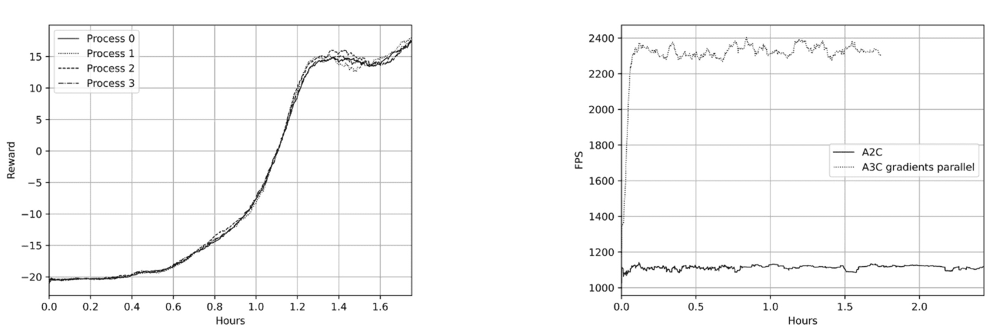

图 12.15：A2C 和 A3C 在奖励（左）和速度（右）方面的比较

# 总结

在本章中，你学习了深度强化学习中最广泛使用的方法之一：A2C，该方法巧妙地将策略梯度更新与状态近似值结合起来。我们分析了基准（baseline）对统计量和梯度收敛的影响。然后，我们检查了基准思想的扩展：A2C，其中一个独立的网络头为我们提供当前状态的基准。此外，我们讨论了为什么对于策略梯度方法来说，从多个环境收集训练数据非常重要，因为它们是基于策略的（on-policy）。我们还实现了两种不同的 A3C 方法，以实现训练过程的并行化和稳定化。并行化将在本书中再次出现，我们将在讨论黑盒方法时提到（第十七章）。

在接下来的两章中，我们将探讨使用策略梯度方法可以解决的实际问题，这也将总结本书关于策略梯度方法的部分内容。

# 加入我们在 Discord 上的社区

与其他用户、深度学习专家以及作者本人一起阅读本书。提问，向其他读者提供解决方案，通过“问我任何问题”（Ask Me Anything）环节与作者交流，等等。扫描二维码或访问链接加入社区。[`packt.link/rl`](https://packt.link/rl)


