# 15

# 连续动作空间

本章通过探讨一个到目前为止仅简要提到过的问题——当我们的动作空间不是离散的时，如何处理环境，来开启本书的强化学习（RL）高级部分。连续动作空间问题是强化学习中的一个重要子领域，无论在理论上还是实践中，它们在机器人学、控制问题以及与物理对象互动的其他领域都有重要应用。在本章中，你将会熟悉在这种情况下出现的挑战，并学习如何解决这些问题。

本材料甚至可能适用于我们已经遇到的问题和环境。例如，在上一章中，当我们在浏览器环境中实现鼠标点击时，点击位置的 x 和 y 坐标可以看作是两个连续变量，作为动作进行预测。这看起来可能有点人为，但从环境的角度来看，这种表示方式是非常合理的：它更加紧凑，能够自然地捕捉到可能的点击分布。最后，在坐标 (x,y) 上点击与在 (x + 1, y + 1) 位置上点击，对大多数任务来说并没有太大区别。

在本章中，我们将：

+   介绍连续动作空间，解释它的重要性，如何与我们已熟悉的离散动作空间不同，并且如何在 Gym API 中实现

+   讨论使用强化学习方法（RL）解决连续控制领域的问题

+   检查三种不同算法在四足机器人问题上的表现

# 为什么是连续空间？

到目前为止，我们在本书中看到的所有例子都是离散动作空间，因此你可能会产生一种错误的印象，认为离散动作主导了这个领域。当然，这是一种非常偏颇的观点，反映的只是我们选择的测试问题的领域。除了 Atari 游戏和简单的经典强化学习问题外，还有许多任务需要的不仅仅是从一个小而离散的动作集合中进行选择。

举个例子，想象一个简单的机器人，只有一个可控关节，能够在某个角度范围内旋转。通常，要控制一个物理关节，你必须指定期望的位置或施加的力。在这两种情况下，你都需要做出一个关于连续值的决策。这个值与离散动作空间本质上是不同的，因为你可以做出决策的值集合可能是无限的。例如，你可以要求关节转到 13.5^∘ 角度或 13.512^∘ 角度，结果可能会不同。当然，系统总是存在一些物理限制，你不能以无限精度来指定动作，但潜在值的大小可能会非常大。

事实上，当你需要与物理世界进行交互时，连续动作空间比离散动作集合更为常见。例如，不同种类的机器人控制系统（如加热/冷却控制器）。强化学习的方法可以应用于这一领域，但在使用优势演员-评论员（A2C）或深度 Q 网络（DQN）方法之前，有一些细节需要考虑。

本章我们将探讨如何处理这一系列问题。这将作为学习强化学习这一非常有趣且重要领域的良好起点。

## 动作空间

与连续动作空间的根本且明显的区别在于其连续性。与离散动作空间相对，当动作被定义为一个离散的、互斥的选项集合（例如 {left, right}，仅包含两个元素）时，连续动作则是某个范围内的值（例如 [0…1]，包含无限多个元素，如 0.5、 和 ）。在每个时间步骤中，代理需要为动作选择一个具体的值并将其传递给环境。

在 Gym 中，连续动作空间由 gym.spaces.Box 类表示，这在我们讨论观察空间时已有描述。你可能还记得，Box 包括一组具有形状和边界的值。例如，从 Atari 模拟器得到的每个观察值被表示为 Box(low=0, high=255, shape=(210, 160, 3))，这意味着 100,800 个值以 3D 张量的形式组织，值的范围为 0 到 255。对于动作空间来说，你不太可能处理如此大量的动作。例如，我们将用作测试环境的四足机器人有八个连续动作，分别对应每条腿上的两个马达。对于这个环境，动作空间将被定义为 Box(low=-1, high=1, shape=(8,))，这意味着每个时间戳需要选择来自 −1 到 1 范围内的八个值来控制机器人。

在这种情况下，传递给 env.step() 的动作在每一步将不再是整数，而是具有某种形状的 NumPy 向量，包含单独的动作值。当然，也可能出现更复杂的情况，当动作空间是离散动作和连续动作的组合时，可能会用 gym.spaces.Tuple 类来表示。

## 环境

大多数包含连续动作空间的环境与物理世界相关，因此通常使用物理仿真。现在有许多软件包可以模拟物理过程，从非常简单的开源工具到复杂的商业软件包，这些包可以模拟多物理过程（如流体、燃烧和强度仿真）。

在机器人领域，最受欢迎的一个软件包是 MuJoCo，它代表了带有接触的多关节动力学（[`www.mujoco.org`](https://www.mujoco.org)）。这是一个物理引擎，你可以在其中定义系统的各个组件及其交互和属性。然后，模拟器负责根据你的干预解决系统，找到组件的参数（通常是位置、速度和加速度）。这使得它成为强化学习环境的理想测试场，因为你可以定义相当复杂的系统（如多足机器人、机械臂或人形机器人），然后将观察结果输入到强化学习代理中，获得反馈的动作。

长时间以来，MuJoCo 是一个商业软件包，需要购买昂贵的许可证。虽然有试用许可证和教育许可证，但它们限制了该软件的受众。但在 2022 年，DeepMind 收购了 MuJoCo，并将源代码公开给所有人使用，这无疑是一次伟大而慷慨的举动。Farama Gymnasium 包含了多个 MuJoCo 环境（[`gymnasium.farama.org/environments/mujoco/`](https://gymnasium.farama.org/environments/mujoco/)），开箱即用；要使它们正常工作，你需要安装 gymnasium[mujoco]包。

除了 MuJoCo 外，还有其他物理模拟器可以用于强化学习。其中一个最受欢迎的是 PyBullet（[`pybullet.org/`](https://pybullet.org/)），它从一开始就是开源的。在本章中，我们将使用 PyBullet 进行实验，稍后的章节中，我们也会介绍 MuJoCo。要安装 PyBullet，你需要在 Python 环境中执行 pip install pybullet==3.2.6。由于 PyBullet 没有更新到 Gymnasium API，我们还需要安装 OpenAI Gym 以确保兼容性：

```py
pip install gym==0.25.1
```

我们使用版本 0.25.1，因为 OpenAI Gym 的后续版本与 PyBullet 的最新版本不兼容。

以下代码（位于 Chapter15/01_check_env.py 中）允许你检查 PyBullet 是否正常工作。它会查看动作空间，并渲染出我们将在本章中作为实验对象使用的环境图像：

```py
import gymnasium as gym 

ENV_ID = "MinitaurBulletEnv-v0" 
ENTRY = "pybullet_envs.bullet.minitaur_gym_env:MinitaurBulletEnv" 
RENDER = True 

if __name__ == "__main__": 
    gym.register(ENV_ID, entry_point=ENTRY, max_episode_steps=1000, 
                 reward_threshold=15.0, disable_env_checker=True) 
    env = gym.make(ENV_ID, render=RENDER) 

    print("Observation space:", env.observation_space) 
    print("Action space:", env.action_space) 
    print(env) 
    print(env.reset()) 
    input("Press any key to exit\n") 
    env.close()
```

启动该工具后，它应当打开图形用户界面（GUI）窗口，显示我们的四足机器人，如下图所示，我们将训练它进行移动：

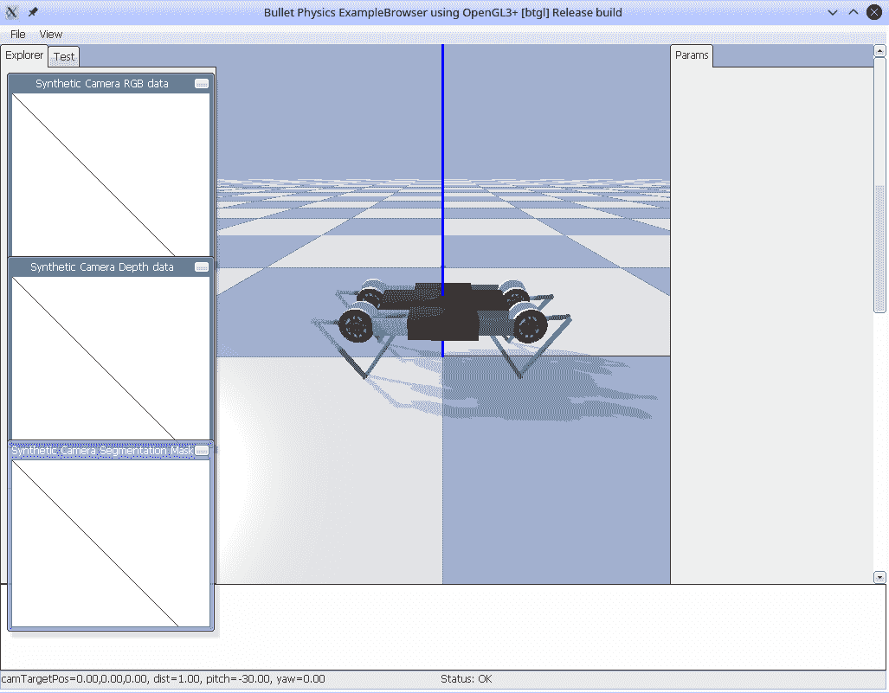

图 15.1：PyBullet GUI 中的 Minitaur 环境（欲更好地可视化，参考 https://packt.link/gbp/9781835882702）

该环境提供 28 个数字作为观察值，它们对应机器人不同的物理参数：速度、位置和加速度。（你可以查看 MinitaurBulletEnv-v0 的源代码以获取详细信息。）动作空间是 8 个数字，定义了电机的参数。每条腿上有两个电机（每个膝盖一个）。该环境的奖励是机器人行进的距离减去消耗的能量。

# A2C 方法

我们将应用于我们的行走机器人问题的第一个方法是 A2C，这是我们在本书第三部分中进行实验的内容。选择这个方法是显而易见的，因为 A2C 非常容易适应连续动作域。简要回顾一下，A2C 的理念是估计我们策略的梯度，即∇J = ∇[𝜃] log π𝜃(R −V 𝜃)。策略π𝜃应该提供给定观察状态下的动作概率分布。量 V 𝜃称为评论员，等于状态的值，并使用评论员回报与由 Bellman 方程估计的值之间的均方误差（MSE）损失进行训练。为了提高探索性，通常会在损失中添加熵奖励 L[H] = π𝜃log π𝜃。

显然，对于连续动作，演员-评论员的值头将保持不变。唯一受到影响的是策略的表示。在我们之前看到的离散情况中，只有一个动作具有多个互斥的离散值。对于这种情况，策略的明显表示就是所有动作的概率分布。

在连续情况下，我们通常有多个动作，每个动作都可以从某个范围内取值。考虑到这一点，最简单的策略表示将是每个动作返回的值。这些值不应与状态的值 V(s)混淆，后者表示我们可以从该状态获得多少奖励。为了说明这两者的区别，我们可以想象一个简单的汽车转向案例，在该案例中，我们只能转动方向盘。每时每刻的动作将是方向盘的角度（动作值），但每个状态的值将是该状态下潜在的折扣奖励（例如，汽车可以行驶的距离），这完全是不同的概念。

回到我们的动作表示选项，如果你记得我们在第十一章的策略表示部分中讨论的内容，作为一个具体值表示的动作有不同的缺点，主要与环境探索有关。一个更好的选择是随机的，例如，网络返回高斯分布的参数。对于 N 个动作，这些参数将是两个大小为 N 的向量。第一个向量将是均值μ，第二个向量将包含方差σ²。在这种情况下，我们的策略将表示为一个随机的 N 维无相关的正态分布随机变量向量，我们的网络可以对每个变量的均值和方差做出选择。

根据定义，Gaussian 分布的概率密度函数由下式给出：


我们可以直接使用这个公式来获取概率，但为了提高数值稳定性，值得进行一些数学推导并简化 log π𝜃的表达式。

最终结果将是这个：


高斯分布的熵可以通过微分熵的定义获得，其结果为 。现在我们已经具备了实现 A2C 方法所需的一切，接下来我们开始实现。

## 实现

完整的源代码位于 02_train_a2c.py、lib/model.py 和 lib/common.py 中。你会熟悉大部分代码，所以下面只列出了不同的部分。我们从 lib/model.py 中定义的模型类开始：

```py
HID_SIZE = 128 

class ModelA2C(nn.Module): 
    def __init__(self, obs_size: int, act_size: int): 
        super(ModelA2C, self).__init__() 

        self.base = nn.Sequential( 
            nn.Linear(obs_size, HID_SIZE), 
            nn.ReLU(), 
        ) 
        self.mu = nn.Sequential( 
            nn.Linear(HID_SIZE, act_size), 
            nn.Tanh(), 
        ) 
        self.var = nn.Sequential( 
            nn.Linear(HID_SIZE, act_size), 
            nn.Softplus(), 
        ) 
        self.value = nn.Linear(HID_SIZE, 1)
```

如你所见，我们的网络有三个头，而不是 A2C 离散版本中的两个。前两个头返回动作的均值和方差，而最后一个是返回状态值的评论员头。返回的均值使用双曲正切激活函数，该激活函数将输出压缩到范围−1…1。方差使用 softplus 激活函数进行变换，该函数为 log(1 + e^x)，其形状类似于平滑的修正线性单元（ReLU）函数。这个激活函数有助于确保我们的方差为正。值头与往常一样，没有应用激活函数。

前向传播是显而易见的；我们首先应用常规层，然后计算各个头：

```py
 def forward(self, x: torch.Tensor): 
        base_out = self.base(x) 
        return self.mu(base_out), self.var(base_out), self.value(base_out)
```

下一步是实现 PTAN 代理类，它用于将观察值转换为动作：

```py
class AgentA2C(ptan.agent.BaseAgent): 
    def __init__(self, net: ModelA2C, device: torch.device): 
        self.net = net 
        self.device = device 

    def __call__(self, states: ptan.agent.States, agent_states: ptan.agent.AgentStates): 
        states_v = ptan.agent.float32_preprocessor(states) 
        states_v = states_v.to(self.device) 

        mu_v, var_v, _ = self.net(states_v) 
        mu = mu_v.data.cpu().numpy() 
        sigma = torch.sqrt(var_v).data.cpu().numpy() 
        actions = np.random.normal(mu, sigma) 
        actions = np.clip(actions, -1, 1) 
        return actions, agent_states
```

在离散情况下，我们使用了 ptan.agent.DQNAgent 和 ptan.agent.PolicyAgent 类，但对于我们的这个问题，我们需要自己编写一个，编写并不复杂：你只需要编写一个类，继承自 ptan.agent.BaseAgent，并重写 __call__ 方法，该方法需要将观察值转换为动作。

在这个类中，我们从网络中获取均值和方差，并使用 NumPy 函数对正态分布进行采样。为了防止动作超出环境的−1…1 范围，我们使用 np.clip()，它将所有小于-1 的值替换为-1，将所有大于 1 的值替换为 1。agent_states 参数没有使用，但它需要与所选择的动作一起返回，因为我们的 BaseAgent 支持保持代理的状态。我们现在不需要这个功能，但它将在下一部分的深度确定性策略梯度中派上用场，届时我们将需要使用奥恩斯坦-乌伦贝克（OU）过程实现随机探索。

有了模型和代理之后，我们现在可以进入训练过程，这部分在 02_train_a2c.py 中定义。它包括训练循环和两个函数。第一个函数用于在独立的测试环境中定期测试我们的模型。在测试过程中，我们不需要进行任何探索；我们将直接使用模型返回的均值，不进行任何随机采样。测试函数如下所示：

```py
def test_net(net: model.ModelA2C, env: gym.Env, count: int = 10, 
             device: torch.device = torch.device("cpu")): 
    rewards = 0.0 
    steps = 0 
    for _ in range(count): 
        obs, _ = env.reset() 
        while True: 
            obs_v = ptan.agent.float32_preprocessor([obs]) 
            obs_v = obs_v.to(device) 
            mu_v = net(obs_v)[0] 
            action = mu_v.squeeze(dim=0).data.cpu().numpy() 
            action = np.clip(action, -1, 1) 
            obs, reward, done, is_tr, _ = env.step(action) 
            rewards += reward 
            steps += 1 
            if done or is_tr: 
                break 
    return rewards / count, steps / count
```

训练模块中定义的第二个函数实现了根据策略计算所采取动作的概率的对数。该函数是我们之前看到的公式的直接实现：


```py
def calc_logprob(mu_v: torch.Tensor, var_v: torch.Tensor, actions_v: torch.Tensor): 
    p1 = - ((mu_v - actions_v) ** 2) / (2*var_v.clamp(min=1e-3)) 
    p2 = - torch.log(torch.sqrt(2 * math.pi * var_v)) 
    return p1 + p2
```

唯一的微小区别是在使用 torch.clamp()函数，以防当返回的方差太小时发生除零错误。

训练循环照常创建网络和代理，然后实例化两步经验源和优化器。使用的超参数如下所示。它们没有经过太多调整，因此仍有很大的优化空间：

```py
GAMMA = 0.99 
REWARD_STEPS = 2 
BATCH_SIZE = 32 
LEARNING_RATE = 5e-5 
ENTROPY_BETA = 1e-4 

TEST_ITERS = 1000
```

用于对收集到的批次执行优化步骤的代码与我们在第十二章中实现的 A2C 训练非常相似。唯一的区别是使用了我们的 calc_logprob()函数以及不同的熵奖励表达式，接下来会展示：

```py
 states_v, actions_v, vals_ref_v = common.unpack_batch_a2c( 
                    batch, net, device=device, last_val_gamma=GAMMA ** REWARD_STEPS) 
                batch.clear() 

                optimizer.zero_grad() 
                mu_v, var_v, value_v = net(states_v) 

                loss_value_v = F.mse_loss(value_v.squeeze(-1), vals_ref_v) 
                adv_v = vals_ref_v.unsqueeze(dim=-1) - value_v.detach() 
                log_prob_v = adv_v * calc_logprob(mu_v, var_v, actions_v) 
                loss_policy_v = -log_prob_v.mean() 
                ent_v = -(torch.log(2*math.pi*var_v) + 1)/2 
                entropy_loss_v = ENTROPY_BETA * ent_v.mean() 

                loss_v = loss_policy_v + entropy_loss_v + loss_value_v 
                loss_v.backward() 
                optimizer.step()
```

每隔 TEST_ITERS 帧，模型会进行一次测试，并在获得最佳奖励时保存模型权重。

## 结果

与我们在本章中将要探讨的其他方法相比，A2C 的表现最差，无论是在最佳奖励还是收敛速度上。这很可能是因为经验收集仅使用了单一环境，而这是策略梯度（PG）方法的一个弱点。因此，你可能想要检查多个并行环境对 A2C 的影响。

要开始训练，我们传递-n 参数以及运行名称，该名称将在 TensorBoard 中使用，并且会创建一个新的目录以保存模型。可以使用--dev 选项启用 GPU，但由于输入的维度较小且网络规模较小，它只会带来微小的速度提升。

在经过 9M 帧（16 小时的优化过程）后，训练过程在测试中达到了最佳得分 0.35，虽然不算很出色。如果我们让它运行一两周，可能能获得更好的分数。训练和测试中的奖励以及回合步骤如下图所示：

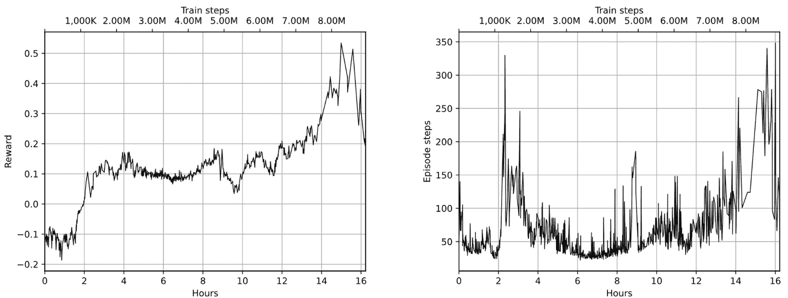

图 15.2：训练回合的奖励（左）和步骤（右）

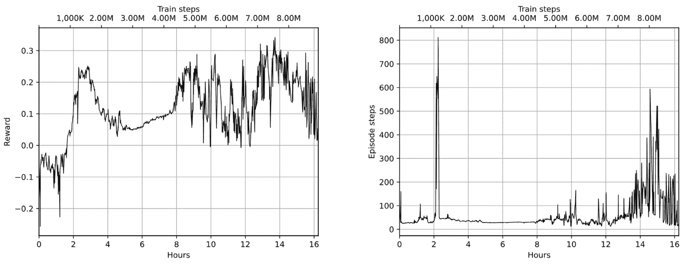

图 15.3：测试回合的奖励（左）和步骤（右）

该图中的回合步骤图（右侧的图表）显示了回合结束前每个回合执行的平均步数。环境的时间限制为 1,000 步，因此低于 1,000 的值表示回合因环境检查而停止。对于大多数 PyBullet 环境，内部实现了自我损害检查，这会停止仿真。

## 使用模型和录制视频

正如你之前所看到的，物理模拟器可以呈现环境的状态，这使得我们可以观察训练后的模型行为。为了实现这一点，对于我们的 A2C 模型，提供了一个工具：03_play_a2c.py。其逻辑与 test_net()函数相同，因此这里不展示代码。

要启动它，你需要传递 -m 选项和模型文件，以及可选的 -r 参数，后者是一个目录名称，将用于保存视频，使用我们在第二章中讨论的 RecordVideo 包装器。

在模拟结束时，效用显示了步骤数和累积奖励。例如，我的训练中最好的 A2C 模型能够获得 0.312 的奖励，而视频只有 2 秒长（你可以在这里找到它：[`youtu.be/s9BReDUtpQs`](https://youtu.be/s9BReDUtpQs)）。图 15.4 显示了视频的最后一帧，看起来我们的模型在保持平衡方面遇到了一些问题。

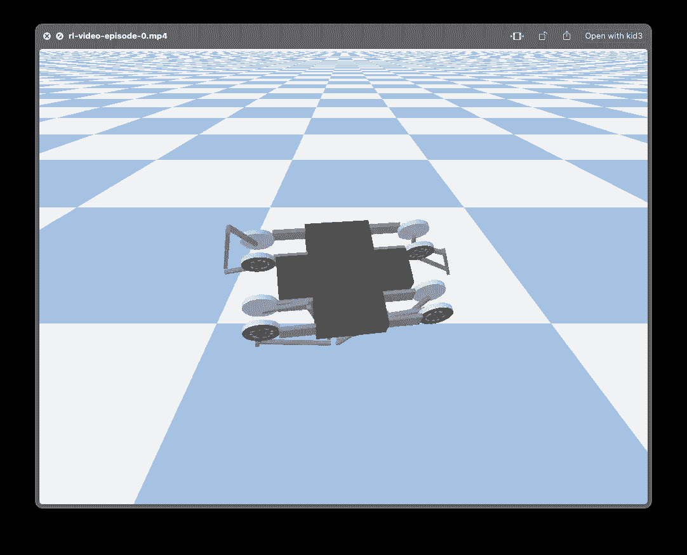

图 15.4：A2C 模型模拟的最后一帧

# 深度确定性策略梯度（DDPG）

接下来我们将看看的一种方法叫做深度确定性策略梯度（DDPG），它是一种演员-评论员方法，但有一个非常好的特性——它是脱离策略的。以下是对严格证明的简化解释。如果你有兴趣深入理解这种方法的核心，可以随时参考 Silver 等人于 2014 年发表的名为《确定性策略梯度算法》[Sil+14]的文章，以及 Lillicrap 等人于 2015 年发表的名为《使用深度强化学习进行连续控制》[Lil15]的论文。

说明这种方法最简单的方式是与我们已经熟悉的 A2C 方法进行比较。在这种方法中，演员估计的是随机策略，该策略返回离散动作的概率分布，或者像我们在上一节中讲解的那样，正态分布的参数。在这两种情况下，我们的策略都是随机的，换句话说，我们采取的动作是从这个分布中采样的。

确定性策略梯度也属于 A2C 家族，但其策略是确定性的，这意味着它直接提供我们在某一状态下应采取的动作。这使得可以对 Q 值应用链式法则，通过最大化 Q，策略也会得到改进。为了理解这一点，我们来看一下演员和评论员在连续动作域中是如何连接的。

我们先从演员（actor）开始，因为它是两者中更简单的一个。我们从它这里需要的是在每个给定状态下采取的动作。在连续动作域中，每个动作都是一个数字，因此演员网络会将状态作为输入，并返回 N 个值，每个值对应一个动作。这个映射是确定性的，因为相同的网络如果输入相同，始终返回相同的输出。（我们不会使用 dropout 或任何增加推断随机性的技术；我们只会使用普通的前馈网络。）

现在让我们来看一下评论员。评论员的作用是估算 Q 值，即在某个状态下采取的动作的折扣奖励。然而，我们的动作是一个数字向量，所以我们的评论员网络现在接受两个输入：状态和动作。评论员的输出将是一个数字，表示 Q 值。这个架构不同于 DQN，当时我们的动作空间是离散的，并且为了提高效率，我们在一次传递中返回所有动作的值。这个映射也是确定性的。

所以，我们有两个函数：

+   演员，我们称之为μ(s)，将状态转换为动作

+   评论员通过状态和动作，给我们 Q 值：Q(s,a)

我们可以将演员函数代入评论员，并得到只有一个输入参数的表达式：Q(s,μ(s))。最终，神经网络只是函数。

现在，评论员的输出给出了我们最初想要最大化的实体的近似值：折扣总奖励。这个值不仅依赖于输入状态，还依赖于𝜃[μ]演员和𝜃[Q]评论员网络的参数。在我们优化的每一步中，我们都希望改变演员的权重，以提高我们获得的总奖励。从数学角度看，我们希望得到我们策略的梯度。

在他的确定性策略梯度定理中，Silver 等人证明了随机策略梯度等同于确定性策略梯度。换句话说，想要改进策略，我们只需要计算 Q(s,μ(s))函数的梯度。通过应用链式法则，我们得到梯度：∇[a]Q(s,a)∇[𝜃[μ]]μ(s)。

注意，尽管 A2C 和 DDPG 方法都属于 A2C 家族，但评论员的使用方式是不同的。在 A2C 中，我们使用评论员作为经验轨迹中奖励的基准，因此评论员是一个可选部分（没有它，我们将得到 REINFORCE 方法），并用于提高稳定性。这是因为 A2C 中的策略是随机的，这在我们的反向传播能力中建立了一个屏障（我们无法区分随机采样步骤）。

在 DDPG 中，评论员以不同的方式使用。由于我们的策略是确定性的，我们现在可以从 Q 中计算梯度，Q 是从评论员网络获得的，评论员使用由演员产生的动作（见图 15.5），因此整个系统是可微的，并且可以通过随机梯度下降（SGD）进行端到端优化。为了更新评论员网络，我们可以使用贝尔曼方程来找到 Q(s,a)的近似值并最小化均方误差（MSE）目标。

所有这些可能看起来有些晦涩，但背后是一个相当简单的思想：评论员像我们在 A2C 中做的那样进行更新，演员则通过最大化评论员输出的方式进行更新。这种方法的优点在于它是脱离策略的，这意味着我们现在可以拥有一个巨大的重放缓冲区，以及在 DQN 训练中使用的其他技巧。不错吧？

## 探索

我们为所有这些好处付出的代价是我们的策略现在是确定性的，因此我们必须以某种方式探索环境。我们可以通过在将动作传递给环境之前，向演员返回的动作中添加噪声来实现这一点。这里有几种选择。最简单的方法就是直接将随机噪声添加到动作中：μ(s) + 𝜖𝒩。我们将在本章中考虑的下一个方法中使用这种方式。

一种更先进的（有时能获得更好结果的）探索方法是使用之前提到的 Ornstein-Uhlenbeck 过程，这在金融领域及其他处理随机过程的领域中非常流行。这个过程模拟了一个大质量布朗粒子在摩擦力作用下的速度，并通过以下随机微分方程定义：

∂x[t] = 𝜃(μ −x[t])∂t + σ∂W，

其中 𝜃、μ 和 σ 是过程的参数，W[t] 是维纳过程。在离散时间的情况下，OU 过程可以写作：

x[t+1] = x[t] + 𝜃(μ −x) + σ𝒩。

这个方程表示通过加入正态噪声 𝒩 来生成过程的下一个值。在我们的探索中，我们将把 OU 过程的值添加到演员返回的动作中。

## 实现

这个例子由三个源文件组成：

+   lib/model.py 包含模型和 PTAN 代理

+   lib/common.py 中有一个用于解包批次的函数

+   04_train_ddpg.py 包含启动代码和训练循环

在这里，我将只展示代码中的重要部分。模型由两个独立的网络组成，分别是演员和评论员，它遵循 Lillicrap 等人论文中的架构[Lil15]。演员非常简单，是一个具有两个隐藏层的前馈网络。输入是一个观察向量，而输出是一个包含 N 个值的向量，每个动作对应一个值。输出的动作经过双曲正切非线性变换，将值压缩到 −1…1 范围内。

评论员有些不寻常，因为它包括观察和动作的两个独立路径，这些路径被连接在一起并转化为评论员的输出结果——一个数字。图 15.5 展示了两个网络的结构：

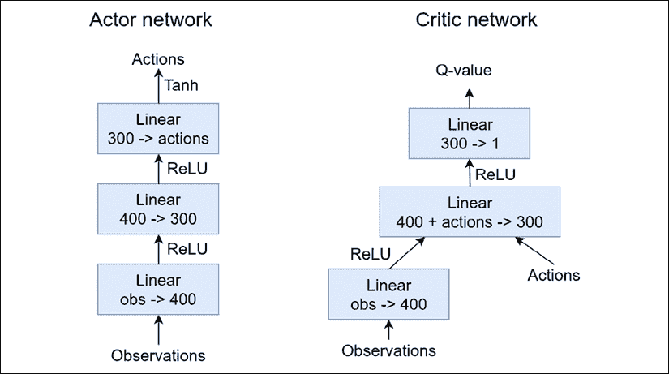

图 15.5：DDPG 演员和评论员网络

演员的代码包括一个三层网络，用于产生动作值：

```py
class DDPGActor(nn.Module): 
    def __init__(self, obs_size: int, act_size: int): 
        super(DDPGActor, self).__init__() 

        self.net = nn.Sequential( 
            nn.Linear(obs_size, 400), 
            nn.ReLU(), 
            nn.Linear(400, 300), 
            nn.ReLU(), 
            nn.Linear(300, act_size), 
            nn.Tanh() 
        ) 

    def forward(self, x: torch.Tensor): 
        return self.net(x)
```

类似地，以下是用于评论员的代码：

```py
class DDPGCritic(nn.Module): 
    def __init__(self, obs_size: int, act_size: int): 
        super(DDPGCritic, self).__init__() 

        self.obs_net = nn.Sequential( 
            nn.Linear(obs_size, 400), 
            nn.ReLU(), 
        ) 

        self.out_net = nn.Sequential( 
            nn.Linear(400 + act_size, 300), 
            nn.ReLU(), 
            nn.Linear(300, 1) 
        ) 

    def forward(self, x: torch.Tensor, a: torch.Tensor): 
        obs = self.obs_net(x) 
        return self.out_net(torch.cat([obs, a], dim=1))
```

critic 的 forward()函数首先通过其小型网络转化观察结果，然后将输出和给定的动作拼接起来，转化为一个 Q 值。为了使用 PTAN 经验源中的演员网络，我们需要定义一个智能体类，该类必须将观察结果转化为动作。这个类是实现 OU 探索过程的最方便的地方，但为了正确实现这一点，我们应该使用 PTAN 智能体尚未使用的功能：可选的状态性。

这个想法很简单：我们的智能体将观察转化为动作。但是，如果它需要在观察之间记住某些信息呢？到目前为止，我们的所有示例都是无状态的，但有时这并不够。OU 的问题在于我们需要在观察之间跟踪 OU 值。

另一种非常有用的状态智能体应用场景是部分可观察的马尔可夫决策过程（POMDP），该过程在第六章和第十四章中简要提及。POMDP 是一个马尔可夫决策过程，其中智能体观察到的状态不符合马尔可夫性质，且不包含区分一个状态与另一个状态所需的完整信息。在这种情况下，我们的智能体需要跟踪状态以便能够采取适当的行动。

因此，实现 OU 探索的智能体代码如下：

```py
class AgentDDPG(ptan.agent.BaseAgent): 
    def __init__(self, net: DDPGActor, device: torch.device = torch.device(’cpu’), 
                 ou_enabled: bool = True, ou_mu: float = 0.0, ou_teta: float = 0.15, 
                 ou_sigma: float = 0.2, ou_epsilon: float = 1.0): 
        self.net = net 
        self.device = device 
        self.ou_enabled = ou_enabled 
        self.ou_mu = ou_mu 
        self.ou_teta = ou_teta 
        self.ou_sigma = ou_sigma 
        self.ou_epsilon = ou_epsilon 

    def initial_state(self): 
        return None
```

构造函数接受很多参数，其中大部分是来自论文《Continuous Control with Deep Reinforcement Learning》的 OU 过程的默认超参数。

initial_state()方法源自 BaseAgent 类，当一个新回合开始时，它必须返回智能体的初始状态。由于我们的初始状态必须与动作具有相同的维度（我们希望为环境的每个动作拥有独立的探索轨迹），因此我们通过返回 None 作为初始状态来推迟初始化。

在 __call__ 方法中，我们会考虑到这一点：

```py
 def __call__(self, states: ptan.agent.States, agent_states: ptan.agent.AgentStates): 
        states_v = ptan.agent.float32_preprocessor(states) 
        states_v = states_v.to(self.device) 
        mu_v = self.net(states_v) 
        actions = mu_v.data.cpu().numpy()
```

该方法是智能体的核心，目的是将观察到的状态和内部智能体状态转化为动作。作为第一步，我们将观察结果转化为适当的形式，并请求演员网络将其转化为确定性动作。该方法的其余部分是通过应用 OU 过程来添加探索噪声。

在这个循环中，我们遍历观察的批次和来自上次调用的智能体状态列表，并更新 OU 过程值，这是对已展示公式的简单实现：

```py
 if self.ou_enabled and self.ou_epsilon > 0: 
            new_a_states = [] 
            for a_state, action in zip(agent_states, actions): 
                if a_state is None: 
                    a_state = np.zeros(shape=action.shape, dtype=np.float32) 
                a_state += self.ou_teta * (self.ou_mu - a_state) 
                a_state += self.ou_sigma * np.random.normal(size=action.shape) 

                action += self.ou_epsilon * a_state 
                new_a_states.append(a_state)
```

为了完成这个循环，我们将 OU 过程中的噪声添加到我们的动作中，并将噪声值保存到下一个步骤。

最后，我们对动作进行裁剪，确保它们落入−1 到 1 的范围内；否则，PyBullet 将抛出异常：

```py
 else: 
            new_a_states = agent_states 
        actions = np.clip(actions, -1, 1) 
        return actions, new_a_states
```

DDPG 实现的最后一部分是 04_train_ddpg.py 文件中的训练循环。为了提高稳定性，我们使用了具有 100,000 个转换的重放缓冲区，并为演员和评论员都使用了目标网络（我们在第六章中讨论了这两者）。

```py
 act_net = model.DDPGActor(env.observation_space.shape[0], 
                              env.action_space.shape[0]).to(device) 
    crt_net = model.DDPGCritic(env.observation_space.shape[0], 
                               env.action_space.shape[0]).to(device) 
    print(act_net) 
    print(crt_net) 
    tgt_act_net = ptan.agent.TargetNet(act_net) 
    tgt_crt_net = ptan.agent.TargetNet(crt_net) 

    writer = SummaryWriter(comment="-ddpg_" + args.name) 
    agent = model.AgentDDPG(act_net, device=device) 
    exp_source = ptan.experience.ExperienceSourceFirstLast( 
        env, agent, gamma=GAMMA, steps_count=1) 
    buffer = ptan.experience.ExperienceReplayBuffer(exp_source, buffer_size=REPLAY_SIZE) 
    act_opt = optim.Adam(act_net.parameters(), lr=LEARNING_RATE) 
    crt_opt = optim.Adam(crt_net.parameters(), lr=LEARNING_RATE)
```

我们还使用了两种不同的优化器，以简化我们处理演员和评论员训练步骤的梯度方式。最有趣的代码在训练循环内部。在每次迭代时，我们将经验存储到重放缓冲区，并抽取训练批次：

```py
 batch = buffer.sample(BATCH_SIZE) 
                states_v, actions_v, rewards_v, dones_mask, last_states_v = \ 
                    common.unpack_batch_ddqn(batch, device)
```

然后，执行两个独立的训练步骤。为了训练评论员，我们需要使用一步贝尔曼方程计算目标 Q 值，其中目标评论员网络作为下一个状态的近似：

```py
 crt_opt.zero_grad() 
                q_v = crt_net(states_v, actions_v) 
                last_act_v = tgt_act_net.target_model(last_states_v) 
                q_last_v = tgt_crt_net.target_model(last_states_v, last_act_v) 
                q_last_v[dones_mask] = 0.0 
                q_ref_v = rewards_v.unsqueeze(dim=-1) + q_last_v * GAMMA
```

当我们得到参考后，我们可以计算 MSE 损失，并请求评论员的优化器调整评论员的权重。整个过程类似于 DQN 的训练，所以这里没有什么新东西：

```py
 critic_loss_v = F.mse_loss(q_v, q_ref_v.detach()) 
                critic_loss_v.backward() 
                crt_opt.step() 
                tb_tracker.track("loss_critic", critic_loss_v, frame_idx) 
                tb_tracker.track("critic_ref", q_ref_v.mean(), frame_idx)
```

在演员的训练步骤中，我们需要更新演员的权重，朝着增加评论员输出的方向进行。由于演员和评论员都表示为可微函数，我们需要做的只是将演员的输出传递给评论员，然后最小化评论员返回的负值：

```py
 act_opt.zero_grad() 
                cur_actions_v = act_net(states_v) 
                actor_loss_v = -crt_net(states_v, cur_actions_v) 
                actor_loss_v = actor_loss_v.mean()
```

评论员的负输出可以作为损失，用于反向传播到评论员网络，最终再传播到演员。我们不希望触碰评论员的权重，因此只要求演员的优化器执行优化步骤。这时，评论员的权重仍然保持着来自此调用的梯度，但它们会在下一次优化步骤中被丢弃：

```py
 actor_loss_v.backward() 
                act_opt.step() 
                tb_tracker.track("loss_actor", actor_loss_v, frame_idx)
```

作为训练循环的最后一步，我们以一种不寻常的方式更新目标网络：

```py
 tgt_act_net.alpha_sync(alpha=1 - 1e-3) 
                tgt_crt_net.alpha_sync(alpha=1 - 1e-3)
```

之前，我们定期将优化后的网络权重同步到目标网络。在连续动作问题中，这种同步比所谓的“软同步”效果差。软同步在每一步进行，但仅将优化网络权重的一小部分添加到目标网络中。这使得从旧权重到新权重的过渡变得平滑而缓慢。

## 结果与视频

代码可以像 A2C 示例那样启动：你需要传递运行名称和可选的 --dev 标志。我的实验表明，使用 GPU 可以提高约 30% 的速度，因此如果你赶时间，使用 CUDA 可能是个好主意，但增速并不像在 Atari 游戏中看到的那样剧烈。

在 5M 次观察之后，耗时大约 20 小时，DDPG 算法能够在 10 次测试中达到 4.5 的平均奖励，这比 A2C 的结果有所提升。训练动态显示在图 15.6 和图 15.7 中。

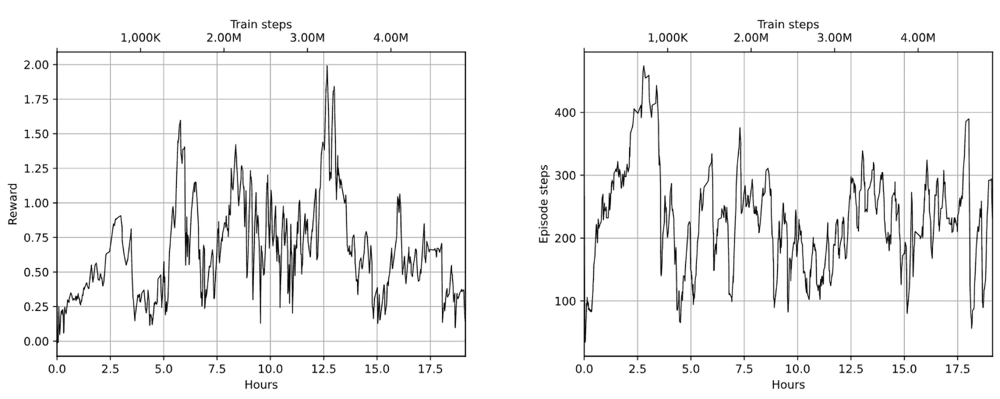

图 15.6：训练回合的奖励（左）和步数（右）

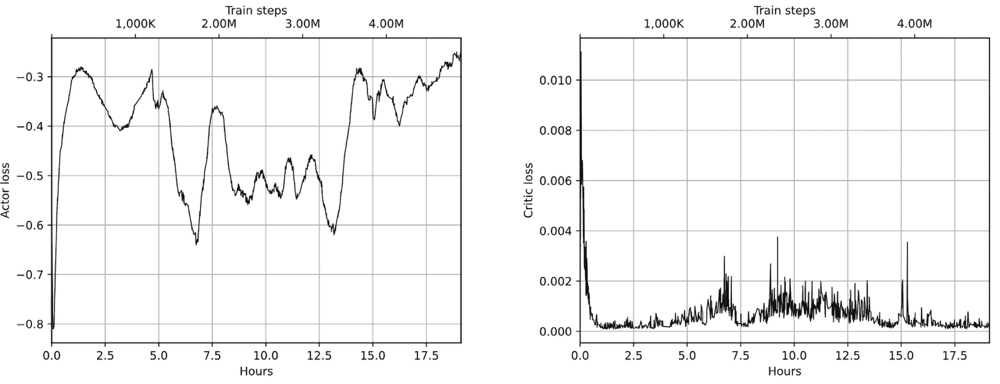

图 15.7：训练过程中的演员损失（左）和评论员损失（右）

“Episode steps”图显示了我们用于训练的实验平均步数。评论者损失是均方误差（MSE）损失，应该较低，而演员损失，正如你所记得的，是评论者输出的负值，因此它越小，演员能（潜在地）获得的奖励就越好。

在图 15.8 中，所示的数值是在测试过程中获得的（这些是 10 次实验的平均值）。

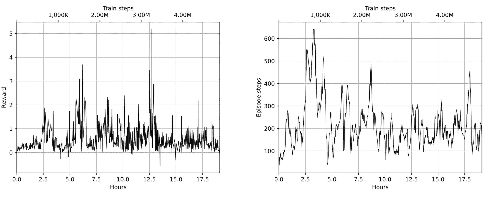

图 15.8：测试实验的奖励（左）和步数（右）

要测试保存的模型并像我们对 A2C 模型所做的那样记录视频，你可以使用实用程序 05_play_ddpg.py。它使用相同的命令行选项，但应该加载 DDPG 模型。在图 15.9 中，展示了我的视频的最后一帧：

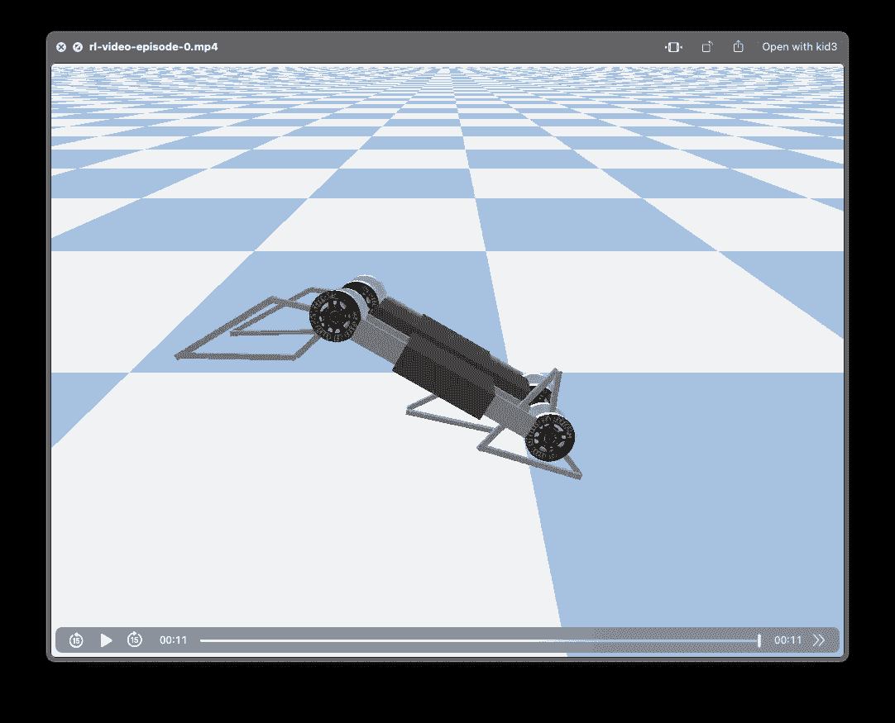

图 15.9：DDPG 模型仿真最后一帧

测试过程中的得分为 3.033，视频可以在[`youtu.be/vVnd0Nu1d9s`](https://youtu.be/vVnd0Nu1d9s)观看。现在该视频时长为 11 秒，模型在前倾后失败。

# 分布式策略梯度

作为本章的最后一种方法，我们将看看 Barth-Maron 等人于 2018 年发布的论文《Distributed distributional deterministic policy gradients》[Bar+18]。

该方法的全名是分布式分布式深度确定性策略梯度，简称 D4PG。作者对 DDPG 方法提出了几项改进，以提高稳定性、收敛性和样本效率。

首先，他们采用了 Bellemare 等人于 2017 年提出的 Q 值分布表示方法，该方法在论文《A distributional perspective on reinforcement learning》中进行了阐述[BDM17]。我们在第八章讨论了这种方法，讲解了 DQN 的改进，因此可以参考该章或 Bellemare 的原始论文以获取更多细节。核心思想是将评论者的单一 Q 值替换为一个概率分布。Bellman 方程被 Bellman 算子所取代，它以类似的方式转化这种分布式表示。第二个改进是使用 n 步 Bellman 方程，通过展开加速收敛。我们在第八章也详细讨论了这个问题。

与原始 DDPG 方法的另一个不同之处是使用了优先重放缓冲区，而不是均匀采样缓冲区。因此，严格来说，作者从 Hassel 等人的论文《Rainbow: Combining Improvements in Deep Reinforcement Learning》中吸取了相关的改进，并将其适配到 DDPG 方法中，该论文于 2017 年发布[Hes+18]。结果令人印象深刻：这种组合在一系列连续控制问题上展现了最先进的结果。让我们尝试重新实现这个方法，并自己检查一下。

## 架构

D4PG 和 DDPG 之间最显著的变化是评论员的输出。评论员不再返回给定状态和动作的单一 Q 值，而是返回 N_ATOMS 个值，这些值对应于预定义范围内各个值的概率。在我的代码中，我使用了 N_ATOMS=51 和分布范围 Vmin=-10，Vmax=10，因此评论员返回了 51 个数字，表示折扣奖励落入[−10,−9.6,−9.2,…,9.6,10]区间的概率。

D4PG 和 DDPG 之间的另一个区别是探索。DDPG 使用 OU 过程进行探索，但根据 D4PG 论文的作者所述，他们尝试了 OU 和向动作中添加简单随机噪声两种方式，结果是相同的。因此，他们在论文中使用了更简单的探索方法。

代码中的最后一个显著差异与训练有关，因为 D4PG 使用交叉熵损失来计算两个概率分布之间的差异（一个是评论员返回的，另一个是通过贝尔曼算子得到的）。为了使这两个分布对齐到相同的支持原子，使用了分布投影，方法与 Bellemare 等人在原始论文中使用的相同。

## 实现

完整的源代码位于 06_train_d4pg.py、lib/model.py 和 lib/common.py 中。如前所述，我们首先从模型类开始。演员类的架构与 DDPG 完全相同，因此在训练类中，使用了 DDPGActor。评论员的隐藏层数量和大小与之前相同；然而，输出不是一个数字，而是 N_ATOMS：

```py
class D4PGCritic(nn.Module): 
    def __init__(self, obs_size: int, act_size: int, 
                 n_atoms: int, v_min: float, v_max: float): 
        super(D4PGCritic, self).__init__() 

        self.obs_net = nn.Sequential( 
            nn.Linear(obs_size, 400), 
            nn.ReLU(), 
        ) 

        self.out_net = nn.Sequential( 
            nn.Linear(400 + act_size, 300), 
            nn.ReLU(), 
            nn.Linear(300, n_atoms) 
        ) 

        delta = (v_max - v_min) / (n_atoms - 1) 
        self.register_buffer("supports", torch.arange(v_min, v_max + delta, delta))
```

我们还创建了一个带有奖励支持的辅助 PyTorch 缓冲区，它将用于从概率分布中获取单一的均值 Q 值：

```py
 def forward(self, x: torch.Tensor, a: torch.Tensor): 
        obs = self.obs_net(x) 
        return self.out_net(torch.cat([obs, a], dim=1)) 

    def distr_to_q(self, distr: torch.Tensor): 
        weights = F.softmax(distr, dim=1) * self.supports 
        res = weights.sum(dim=1) 
        return res.unsqueeze(dim=-1)
```

如您所见，softmax() 的应用不是网络 forward() 方法的一部分，因为在训练期间我们将使用更稳定的 log_softmax() 函数。因此，softmax() 需要在我们想要获取实际概率时应用。

对于 D4PG，智能体类要简单得多，并且没有需要跟踪的状态：

```py
class AgentD4PG(ptan.agent.BaseAgent): 
    def __init__(self, net: DDPGActor, device: torch.device = torch.device("cpu"), 
                 epsilon: float = 0.3): 
        self.net = net 
        self.device = device 
        self.epsilon = epsilon 

    def __call__(self, states: ptan.agent.States, agent_states: ptan.agent.AgentStates): 
        states_v = ptan.agent.float32_preprocessor(states) 
        states_v = states_v.to(self.device) 
        mu_v = self.net(states_v) 
        actions = mu_v.data.cpu().numpy() 
        actions += self.epsilon * np.random.normal(size=actions.shape) 
        actions = np.clip(actions, -1, 1) 
        return actions, agent_states
```

为了将每个状态转换为动作，智能体应用演员网络并向动作中添加高斯噪声，噪声大小由 epsilon 值缩放。在训练代码中，我们有以下超参数：

```py
GAMMA = 0.99 
BATCH_SIZE = 64 
LEARNING_RATE = 1e-4 
REPLAY_SIZE = 100000 
REPLAY_INITIAL = 10000 
REWARD_STEPS = 5 

TEST_ITERS = 1000 

Vmax = 10 
Vmin = -10 
N_ATOMS = 51 
DELTA_Z = (Vmax - Vmin) / (N_ATOMS - 1)
```

我使用了一个较小的回放缓冲区，大小为 100,000，效果良好。（在 D4PG 论文中，作者使用了 1M 的过渡数据存储在缓冲区中。）缓冲区预先填充了来自环境的 10,000 个样本，然后开始训练。

对于每个训练循环，我们执行与之前相同的两个步骤：训练评论员和演员。区别在于评论员损失计算的方式：

```py
 batch = buffer.sample(BATCH_SIZE) 
                states_v, actions_v, rewards_v, dones_mask, last_states_v = \ 
                    common.unpack_batch_ddqn(batch, device) 

                crt_opt.zero_grad() 
                crt_distr_v = crt_net(states_v, actions_v) 
                last_act_v = tgt_act_net.target_model(last_states_v) 
                last_distr_v = F.softmax( 
                    tgt_crt_net.target_model(last_states_v, last_act_v), dim=1)
```

作为评论者训练的第一步，我们要求它返回状态和采取的动作的概率分布。这个概率分布将作为输入用于交叉熵损失的计算。为了获得目标概率分布，我们需要计算批次中最后状态的分布，然后执行分布的贝尔曼投影：

```py
 proj_distr = distr_projection( 
                    last_distr_v.detach().cpu().numpy(), rewards_v.detach().cpu().numpy(), 
                    dones_mask.detach().cpu().numpy(), gamma=GAMMA**REWARD_STEPS) 
                proj_distr_v = torch.tensor(proj_distr).to(device)
```

这个投影函数有点复杂，完全与第八章中详细解释的实现相同。简要地说，它计算最后状态的概率分布的变换，该分布根据即时奖励进行了偏移，并按折扣因子进行缩放。结果是我们希望网络返回的目标概率分布。由于 PyTorch 中没有通用的交叉熵损失函数，我们通过将输入概率的对数与目标概率相乘来手动计算它：

```py
 prob_dist_v = -F.log_softmax(crt_distr_v, dim=1) * proj_distr_v 
                critic_loss_v = prob_dist_v.sum(dim=1).mean() 
                critic_loss_v.backward() 
                crt_opt.step()
```

演员的训练要简单得多，唯一与 DDPG 方法的区别是使用模型的 distr_to_q() 方法，将概率分布转换为单一的均值 Q 值，使用支持原子：

```py
 act_opt.zero_grad() 
                cur_actions_v = act_net(states_v) 
                crt_distr_v = crt_net(states_v, cur_actions_v) 
                actor_loss_v = -crt_net.distr_to_q(crt_distr_v) 
                actor_loss_v = actor_loss_v.mean() 
                actor_loss_v.backward() 
                act_opt.step()
```

## 结果

D4PG 方法在收敛速度和获得的奖励方面都表现最好。经过 20 小时的训练，大约 350 万次观测后，它能够达到 17.912 的平均测试奖励。鉴于“gym 环境阈值”是 15.0（这是环境认为任务已解决时的分数），这是一个很棒的结果。而且这个结果还可以进一步提高，因为步骤数不到 1,000（这是环境的时间限制）。这意味着我们的模型因内部环境检查而被提前终止。在图 15.10 和图 15.11 中，我们展示了训练和测试的指标。

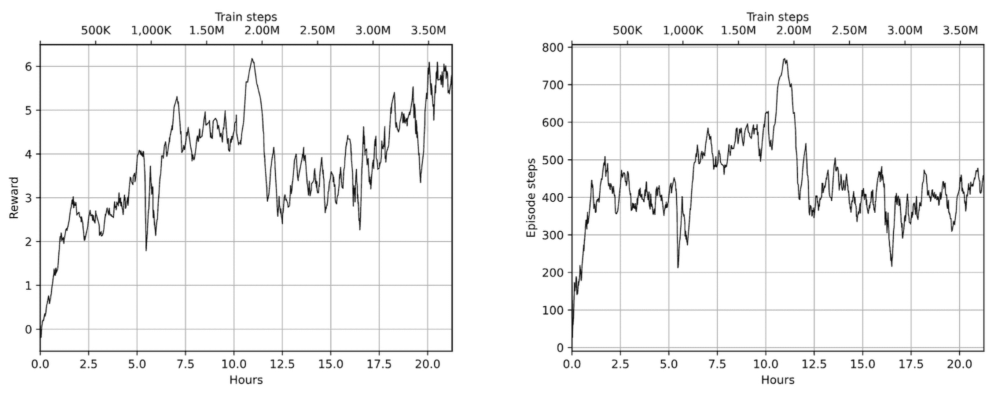

图 15.10：训练回合的奖励（左）和步骤（右）

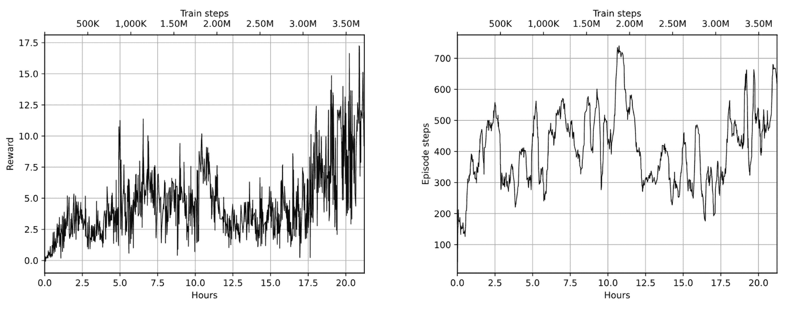

图 15.11：测试回合的奖励（左）和步骤（右）

为了比较实现的方法，图 15.12 包含了三种方法的测试回合指标。


图 15.12：测试回合的奖励（左）和步骤（右）

要检查模型的“实际表现”，你可以使用相同的工具 05_play_ddpg.py（因为演员网络结构与 DDPG 中的相同）。现在，最佳模型生成的视频时长为 33 秒，最终得分为 17.827。你可以在这里观看：[`youtu.be/XZdVrGPaI0M`](https://youtu.be/XZdVrGPaI0M)。

# 需要尝试的事项

以下是可以帮助你提升对该主题理解的事项：

+   在 D4PG 代码中，我使用了一个简单的重放缓冲区，这足以比 DDPG 获得更好的改进。你可以尝试将示例切换为优先重放缓冲区，就像我们在第八章中做的那样。

+   周围有很多有趣且具有挑战性的环境。例如，你可以从其他 PyBullet 环境开始，但也有 DeepMind 控制套件（Tassa 等人，DeepMind 控制套件，arXiv abs/1801.00690（2018）），Gym 中的基于 MuJoCo 的环境，以及其他许多环境。

+   你可以尝试参加非常具有挑战性的“学习跑步”竞赛，该竞赛源自 NIPS-2017（并且在 2018 年和 2019 年也有举办，问题更具挑战性），在这个竞赛中，你将获得一个人体仿真器，而你的智能体需要弄清楚如何使其运动。

# 总结

在本章中，我们快速浏览了使用强化学习方法进行连续控制的非常有趣的领域，并在四足机器人这一问题上检查了三种不同的算法。在我们的训练中，我们使用了一个仿真器，但 Ghost Robotics 公司制造了这种机器人的真实模型。（你可以在 YouTube 上查看这个很酷的视频：[`youtu.be/bnKOeMoibLg`](https://youtu.be/bnKOeMoibLg)。）我们将三种训练方法应用于这个环境：A2C，DDPG 和 D4PG（后者显示出了最好的结果）。

在接下来的章节中，我们将继续探索连续动作领域，并查看一组不同的改进方法：信任域扩展。
