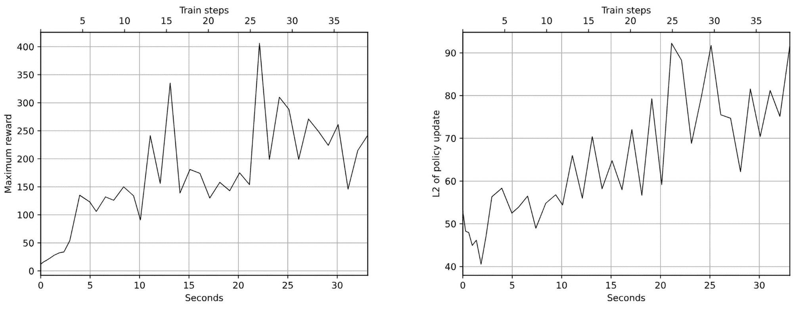
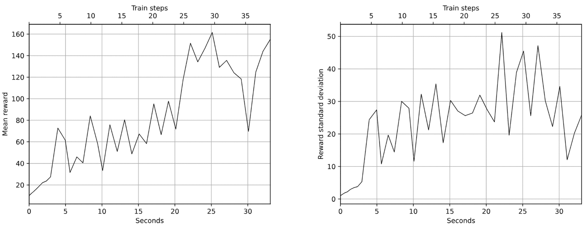
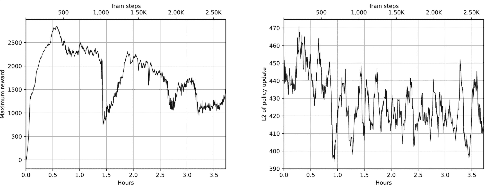
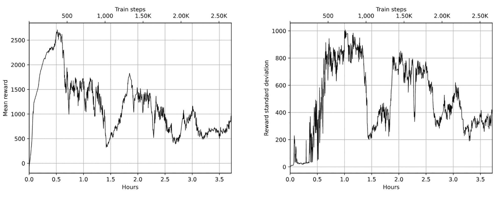
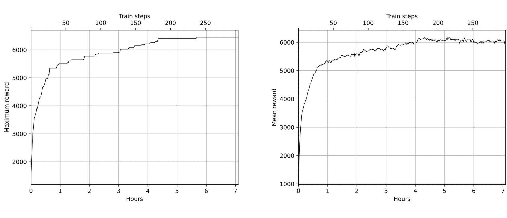

# 17

# 强化学习中的黑盒优化

在本章中，我们将再次改变对强化学习（RL）训练的看法，转向所谓的黑盒优化方法。这些方法至少已有十年历史，但最近进行的一些研究表明，它们在大规模 RL 问题中的适用性，并且与价值迭代和策略梯度方法具有竞争力。尽管它们已经有些年头，但在某些情况下，这类方法仍然更为高效。本章将介绍两种黑盒优化方法的例子：

+   进化策略

+   遗传算法

# 黑盒方法

首先，让我们讨论一下黑盒方法的整体家族，以及它与我们之前讨论过的内容的区别。黑盒优化方法是优化问题的通用方法，它将你正在优化的目标视为黑盒，不对目标的可微性、价值函数、目标的平滑性等做任何假设。唯一的要求是这些方法能够计算适应度函数，这应该为我们提供优化实体的特定实例的适应度度量。这个家族中最简单的一个例子是随机搜索，它是指你随机选择你要寻找的对象（在 RL 中是策略π(a|s)），检查该候选对象的适应度，如果结果足够好（根据某些奖励标准），那么你就完成了。否则，你会一遍又一遍地重复这个过程。尽管这种方法简单，甚至有些天真，特别是与到目前为止你所看到的复杂方法相比，但它是一个很好的例子，能说明黑盒方法的思想。

此外，通过一些修改，正如你很快会看到的，这种简单的方法在效率和生成的策略质量方面，可以与深度 Q 网络（DQN）和策略梯度方法相比较。除此之外，黑盒方法还有一些非常吸引人的特性：

+   它们至少比基于梯度的方法快两倍，因为我们不需要执行反向传播步骤来获得梯度。

+   对于优化目标和作为黑盒处理的策略，几乎没有任何假设。传统方法在奖励函数不平滑或策略中包含随机选择步骤时会遇到困难。而这一切对于黑盒方法来说都不是问题，因为它们对黑盒的内部实现没有太多要求。

+   这些方法通常可以很好地并行化。例如，上述的随机搜索可以轻松扩展到数千个中央处理单元（CPU）或图形处理单元（GPU）并行工作，且彼此之间没有任何依赖关系。对于 DQN 或策略梯度方法而言，情况则不同，因为需要积累梯度并将当前策略传播给所有并行工作者，这会降低并行性。

前述方法的缺点通常是样本效率较低。特别是，使用具有五十万个参数的神经网络（NN）进行的天真随机搜索策略，成功的概率非常低。

# 进化策略

黑盒优化方法的一类被称为进化策略（ES），它的灵感来源于进化过程。在 ES 中，最成功的个体对搜索的整体方向有最大的影响。这个类别下有许多不同的方法，在本章中，我们将讨论 OpenAI 研究人员 Salimans 等人在他们的论文《进化策略作为强化学习的可扩展替代方法》[Sal+17]中提出的方法，该论文于 2017 年 3 月发布。

ES 方法的基本思想是在每次迭代时，我们对当前的策略参数进行随机扰动，并评估由此产生的策略适应度函数。然后，我们根据相对的适应度函数值调整策略权重。

Salimans 等人使用的具体方法被称为协方差矩阵适应进化策略（CMA-ES），其中执行的扰动是从均值为零、方差为单位矩阵的正态分布中采样的随机噪声。然后，我们计算具有权重等于原始策略权重加上缩放噪声的策略的适应度函数值。接下来，根据得到的值，我们通过将噪声乘以适应度函数值来调整原始策略权重，这样可以使我们的策略朝着具有更高适应度函数值的权重方向移动。为了提高稳定性，权重更新是通过对具有不同随机噪声的多个步骤批次进行平均来完成的。

更正式地说，这个方法可以表达为以下步骤序列：

1.  初始化学习率 α、噪声标准差 σ 和初始策略参数 𝜃[0]。

1.  对 t = 0,1,… 执行：

    1.  噪声样本批次，其形状与来自均值为零、方差为一的正态分布的权重相同：𝜖[1],…,𝜖[n] ∼𝒩(0,I)

    1.  计算回报 F[i] = F(𝜃[t] + σ𝜖[i])，其中 i = 1,…,n

    1.  更新权重：

        ![π (a |s) = P[At = a|St = s] ](img/eq69.png)

该算法是论文中提出方法的核心，但像强化学习领域中的常见情况一样，单靠这个方法不足以获得良好的结果。因此，论文中包含了几个调整以改善方法，尽管核心方法保持不变。

## 在 CartPole 上实现 ES

让我们在我们的果蝇环境中实现并测试论文中的方法：倒立摆（CartPole）。你可以在 Chapter17/01_cartpole_es.py 文件中找到完整的例子。

在这个例子中，我们将使用单一环境来检查扰动后的网络权重的适应度。我们的适应度函数将是该回合的未折扣总奖励。

我们从导入开始：

```py
import gymnasium as gym 
import time 
import numpy as np 
import typing as tt 

import torch 
import torch.nn as nn 

from torch.utils.tensorboard.writer import SummaryWriter
```

从导入语句中，你可以看到我们的例子是多么自包含。我们没有使用 PyTorch 优化器，因为我们根本不进行反向传播。事实上，我们完全可以避免使用 PyTorch，只使用 NumPy，因为我们唯一用 PyTorch 的地方就是执行前向传播并计算网络的输出。

接下来，我们定义超参数：

```py
MAX_BATCH_EPISODES = 100 
MAX_BATCH_STEPS = 10000 
NOISE_STD = 0.001 
LEARNING_RATE = 0.001 

TNoise = tt.List[torch.Tensor]
```

超参数的数量也很少，包括以下几个值：

+   MAX_BATCH_EPISODES 和 MAX_BATCH_STEPS：用于训练的回合数和步骤数的限制

+   NOISE_STD：用于权重扰动的噪声标准差，σ

+   LEARNING_RATE：用于调整训练步骤中权重的系数

我们还定义了一个类型别名，表示包含权重噪声的张量列表。这样可以简化代码，因为我们将会频繁处理噪声。

现在让我们检查网络：

```py
class Net(nn.Module): 
    def __init__(self, obs_size: int, action_size: int): 
        super(Net, self).__init__() 
        self.net = nn.Sequential( 
            nn.Linear(obs_size, 32), 
            nn.ReLU(), 
            nn.Linear(32, action_size), 
            nn.Softmax(dim=1) 
        ) 

    def forward(self, x: torch.Tensor) -> torch.Tensor: 
        return self.net(x)
```

我们使用的模型是一个简单的单隐层神经网络（NN），它根据观察结果给出需要采取的行动。我们在这里使用 PyTorch 的神经网络模块仅是为了方便，因为我们只需要前向传播，但它也可以通过矩阵乘法和非线性应用来替代。

evaluate() 函数使用给定的策略进行完整的回合，并返回总奖励和步数：

```py
def evaluate(env: gym.Env, net: Net) -> tt.Tuple[float, int]: 
    obs, _ = env.reset() 
    reward = 0.0 
    steps = 0 
    while True: 
        obs_v = torch.FloatTensor(np.expand_dims(obs, 0)) 
        act_prob = net(obs_v) 
        acts = act_prob.max(dim=1)[1] 
        obs, r, done, is_tr, _ = env.step(acts.data.numpy()[0]) 
        reward += r 
        steps += 1 
        if done or is_tr: 
            break 
    return reward, steps
```

奖励将作为适应度值，而步数则用于限制我们花费在形成批次上的时间。行动选择通过计算网络输出的最大值（argmax）以确定性方式进行。原则上，我们可以从分布中进行随机采样，但我们已经通过向网络参数添加噪声来进行探索，因此在这里进行确定性行动选择是可以的。

在 sample_noise() 函数中，我们创建了均值为零、方差为一的随机噪声，其形状与我们的网络参数相同：

```py
def sample_noise(net: Net) -> tt.Tuple[TNoise, TNoise]: 
    pos = [] 
    neg = [] 
    for p in net.parameters(): 
        noise = np.random.normal(size=p.data.size()) 
        noise_t = torch.FloatTensor(noise) 
        pos.append(noise_t) 
        neg.append(-noise_t) 
    return pos, neg
```

该函数返回两组噪声张量：一组是正噪声，另一组是取负号后的相同随机值。这两组样本稍后会作为独立样本放入一个批次中。这种技术称为镜像采样，用来提高收敛的稳定性。实际上，如果没有负噪声，收敛会变得非常不稳定，因为正噪声会将权重推向单一方向。

eval_with_noise() 函数接受由 sample_noise() 创建的噪声数组，并在添加噪声后评估网络：

```py
def eval_with_noise(env: gym.Env, net: nn.Module, noise: TNoise, noise_std: float, 
        get_max_action: bool = True, device: torch.device = torch.device("cpu") 
    old_params = net.state_dict() 
    for p, p_n in zip(net.parameters(), noise): 
        p.data += NOISE_STD * p_n 
    r, s = evaluate(env, net) 
    net.load_state_dict(old_params) 
    return r, s
```

为了实现这一点，我们将噪声加到网络的参数上，并调用评估函数来获得奖励和所采取的步骤数。之后，我们需要恢复网络的权重到其原始状态，这通过加载网络的状态字典来完成。

方法的最后一个也是核心的函数是`train_step()`，它接受带噪声和相应奖励的批次，并通过应用公式计算对网络参数的更新：

![π (a |s) = P[At = a|St = s] ](img/eq69.png)

这可以通过以下方式实现：

```py
def train_step(net: Net, batch_noise: tt.List[common.TNoise], batch_reward: tt.List[float], 
               writer: SummaryWriter, step_idx: int): 
    weighted_noise = None 
    norm_reward = np.array(batch_reward) 
    norm_reward -= np.mean(norm_reward) 
    s = np.std(norm_reward) 
    if abs(s) > 1e-6: 
        norm_reward /= s
```

在开始时，我们对奖励进行归一化，使其均值为零，方差为一，这有助于提高方法的稳定性。

然后，我们遍历批次中的每一对（噪声，奖励），将噪声值与归一化的奖励相乘，并将每个参数的相应噪声相加：

```py
 for noise, reward in zip(batch_noise, norm_reward): 
        if weighted_noise is None: 
            weighted_noise = [reward * p_n for p_n in noise] 
        else: 
            for w_n, p_n in zip(weighted_noise, noise): 
                w_n += reward * p_n
```

最后一步是使用积累的缩放噪声来调整网络参数：

```py
 m_updates = [] 
    for p, p_update in zip(net.parameters(), weighted_noise): 
        update = p_update / (len(batch_reward) * NOISE_STD) 
        p.data += LEARNING_RATE * update 
        m_updates.append(torch.norm(update)) 
    writer.add_scalar("update_l2", np.mean(m_updates), step_idx)
```

从技术上讲，我们在这里做的是梯度上升，尽管梯度并不是通过反向传播获得的，而是通过随机采样（也称为蒙特卡洛采样）得到的。Salimans 等人也证明了这一点，作者展示了 CMA-ES 与策略梯度方法非常相似，区别仅在于我们获得梯度估计的方式。

训练循环前的准备工作很简单；我们创建环境和网络：

```py
if __name__ == "__main__": 
    writer = SummaryWriter(comment="-cartpole-es") 
    env = gym.make("CartPole-v1") 

    net = Net(env.observation_space.shape[0], env.action_space.n) 
    print(net)
```

每次训练循环的迭代都从批次创建开始，在这里我们对噪声进行采样并获得正向和反向噪声的奖励：

```py
 step_idx = 0 
    while True: 
        t_start = time.time() 
        batch_noise = [] 
        batch_reward = [] 
        batch_steps = 0 
        for _ in range(MAX_BATCH_EPISODES): 
            noise, neg_noise = sample_noise(net) 
            batch_noise.append(noise) 
            batch_noise.append(neg_noise) 
            reward, steps = eval_with_noise(env, net, noise) 
            batch_reward.append(reward) 
            batch_steps += steps 
            reward, steps = eval_with_noise(env, net, neg_noise) 
            batch_reward.append(reward) 
            batch_steps += steps 
            if batch_steps > MAX_BATCH_STEPS: 
                break
```

当我们达到批次的最大集数，或者总步数的上限时，我们停止收集数据并进行训练更新。

要执行网络的更新，我们调用已经看到的`train_step()`函数：

```py
 step_idx += 1 
        m_reward = float(np.mean(batch_reward)) 
        if m_reward > 199: 
            print("Solved in %d steps" % step_idx) 
            break 

        train_step(net, batch_noise, batch_reward, writer, step_idx)
```

`train_step()`函数的目标是根据总奖励来缩放噪声，然后将策略权重调整到平均噪声的方向。

训练循环的最后步骤将度量数据写入 TensorBoard，并在控制台上显示训练进度：

```py
 writer.add_scalar("reward_mean", m_reward, step_idx) 
        writer.add_scalar("reward_std", np.std(batch_reward), step_idx) 
        writer.add_scalar("reward_max", np.max(batch_reward), step_idx) 
        writer.add_scalar("batch_episodes", len(batch_reward), step_idx) 
        writer.add_scalar("batch_steps", batch_steps, step_idx) 
        speed = batch_steps / (time.time() - t_start) 
        writer.add_scalar("speed", speed, step_idx) 
        print("%d: reward=%.2f, speed=%.2f f/s" % ( 
            step_idx, m_reward, speed))
```

## CartPole 结果

训练可以通过直接运行程序而不需要参数来开始：

```py
Chapter17$ ./01_cartpole_es.py 
Net( 
  (net): Sequential( 
   (0): Linear(in_features=4, out_features=32, bias=True) 
   (1): ReLU() 
   (2): Linear(in_features=32, out_features=2, bias=True) 
   (3): Softmax(dim=1) 
  ) 
) 
1: reward=10.00, speed=7458.03 f/s 
2: reward=11.93, speed=8454.54 f/s 
3: reward=13.71, speed=8677.55 f/s 
4: reward=15.96, speed=8905.25 f/s 
5: reward=18.75, speed=9098.71 f/s 
6: reward=22.08, speed=9220.68 f/s 
7: reward=23.57, speed=9272.45 f/s 
...
```

根据我的实验，ES 通常需要大约 40 到 60 个批次来解决 CartPole。前面运行的收敛动态如图 17.1 和图 17.2 所示。



图 17.1：ES 在 CartPole 上的最大奖励（左）和策略更新（右）



图 17.2：ES 在 CartPole 上的奖励均值（左）和标准差（右）

前面的图表看起来相当不错——在 30 秒内解决环境问题与第四章中的交叉熵方法相当。

## ES 在 HalfCheetah 上的表现

在下一个示例中，我们将超越最简单的 ES 实现，探讨如何使用 Salimans 等人提出的共享种子策略高效地并行化该方法。为了展示这种方法，我们将使用 MuJoCo 物理模拟器中的 HalfCheetah 环境。我们已经在前一章中进行了实验，因此如果你还没有安装 gymnasium[mujoco]包，应该先安装。

首先，让我们讨论共享种子的概念。ES 算法的性能主要取决于我们收集训练批次的速度，训练批次由采样噪声和检查扰动噪声的总奖励组成。由于我们的训练批次项是独立的，我们可以轻松地将这一步并行化到大量位于远程机器上的工人（这有点类似于第十二章中的示例，当时我们从 A3C 工人那里收集梯度）。然而，天真的并行化实现将需要将大量数据从工人进程传输到中央主进程，主进程应当合并工人检查过的噪声并执行策略更新。大部分数据是噪声向量，其大小等于我们策略参数的大小。

为了避免这种开销，Salimans 等人提出了一个相当优雅的解决方案。由于工人上采样的噪声是由伪随机数生成器产生的，这使得我们可以设置随机种子并重现生成的随机序列，因此工人只需将用于生成噪声的种子传输给主进程。然后，主进程可以使用该种子再次生成相同的噪声向量。当然，每个工人的种子需要随机生成，以保持随机优化过程的性质。这样做的效果是显著减少了需要从工人传输到主进程的数据量，从而提高了方法的可扩展性。例如，Salimans 等人报告了在云端使用 1,440 个 CPU 进行优化时的线性加速。在我们的示例中，我们将使用相同的方法进行本地并行化。

## 在 HalfCheetah 上实现 ES

代码位于 Chapter17/02_cheetah_es.py 中。由于代码与 CartPole 版本有显著重叠，我们在此只关注其中的差异。

我们将从工人开始，工人作为单独的进程使用 PyTorch 的多进程封装器启动。工人的职责很简单：每次迭代时，它从主进程获取网络参数，然后执行固定次数的迭代，在每次迭代中它采样噪声并评估奖励。带有随机种子的结果通过队列发送给主进程。

以下数据类由工人使用，用于将扰动策略评估的结果发送到主进程：

```py
@dataclass(frozen=True) 
class RewardsItem: 
    seed: int 
    pos_reward: float 
    neg_reward: float 
    steps: int
```

它包括随机种子、通过正负噪声获得的奖励，以及我们在两个测试中执行的总步骤数。

每次训练迭代时，工作程序会等待主控程序广播网络参数：

```py
def worker_func(params_queue: mp.Queue, rewards_queue: mp.Queue, 
                device: torch.device, noise_std: float): 
    env = make_env() 
    net = Net(env.observation_space.shape[0], env.action_space.shape[0]).to(device) 
    net.eval() 

    while True: 
        params = params_queue.get() 
        if params is None: 
            break 
        net.load_state_dict(params)
```

None 的值表示主控程序希望停止工作程序。

其余部分几乎与前一个示例相同，主要的区别在于在噪声生成之前生成并分配的随机种子。这使得主控程序能够重新生成相同的噪声，只是从种子开始：

```py
 for _ in range(ITERS_PER_UPDATE): 
            seed = np.random.randint(low=0, high=65535) 
            np.random.seed(seed) 
            noise, neg_noise = common.sample_noise(net, device=device) 
            pos_reward, pos_steps = common.eval_with_noise(env, net, noise, noise_std, 
                get_max_action=False, device=device) 
            neg_reward, neg_steps = common.eval_with_noise(env, net, neg_noise, noise_std, 
                get_max_action=False, device=device) 
            rewards_queue.put(RewardsItem(seed=seed, pos_reward=pos_reward, 
                neg_reward=neg_reward, steps=pos_steps+neg_steps))
```

另一个区别在于主控程序执行训练步骤时使用的函数：

```py
def train_step(optimizer: optim.Optimizer, net: Net, batch_noise: tt.List[common.TNoise], 
               batch_reward: tt.List[float], writer: SummaryWriter, step_idx: int, 
               noise_std: float): 
    weighted_noise = None 
    norm_reward = compute_centered_ranks(np.array(batch_reward))
```

在 CartPole 示例中，我们通过减去均值并除以标准差对奖励批次进行了归一化。根据 Salimans 等人的说法，使用秩而非实际奖励可以获得更好的结果。由于 ES 对适应度函数（在我们的案例中即为奖励）没有假设，我们可以对奖励进行任何重新排列，这在 DQN 的情况下是不可行的。

在这里，数组的秩变换意味着用排序数组的索引替换原数组。例如，数组 [0.1, 10, 0.5] 将变为秩数组 [0, 2, 1]。`compute_centered_ranks` 函数接受一个包含批次总奖励的数组，计算数组中每个项目的秩，然后对这些秩进行归一化。例如，输入数组 [21.0, 5.8, 7.0] 将得到秩 [2, 0, 1]，最终的居中秩将是 [0.5, -0.5, 0.0]。

训练函数的另一个主要区别是使用了 PyTorch 优化器：

```py
 for noise, reward in zip(batch_noise, norm_reward): 
        if weighted_noise is None: 
            weighted_noise = [reward * p_n for p_n in noise] 
        else: 
            for w_n, p_n in zip(weighted_noise, noise): 
                w_n += reward * p_n 
    m_updates = [] 
    optimizer.zero_grad() 
    for p, p_update in zip(net.parameters(), weighted_noise): 
        update = p_update / (len(batch_reward) * noise_std) 
        p.grad = -update 
        m_updates.append(torch.norm(update)) 
    writer.add_scalar("update_l2", np.mean(m_updates), step_idx) 
    optimizer.step()
```

为了理解为什么使用这些方法以及如何在不进行反向传播的情况下实现这一点，必须做一些解释。

首先，Salimans 等人表明，ES 算法使用的优化方法与梯度上升法非常相似，区别在于梯度的计算方式。通常应用随机梯度下降（SGD）方法时，梯度是通过计算网络参数关于损失值的导数从损失函数中获得的。这要求网络和损失函数是可微的，但这并非总是成立；例如，ES 方法执行的秩变换是不可微的。

另一方面，ES 执行的优化过程则有所不同。我们通过向当前参数添加噪声并计算适应度函数，随机采样周围的邻域。根据适应度函数的变化，我们调整参数，推动参数朝着更高的适应度函数方向前进。其结果与基于梯度的方法非常相似，但对适应度函数的要求要宽松得多：唯一的要求是能够计算它。

然而，如果我们通过随机采样适应度函数来估计某种梯度，我们可以使用 PyTorch 中的标准优化器。通常，优化器使用积累在参数 `grad` 字段中的梯度来调整网络的参数。

这些梯度在反向传播步骤后被积累，但由于 PyTorch 的灵活性，优化器不关心梯度的来源。因此，我们需要做的唯一事情就是将估计的参数更新复制到 `grad` 字段，并要求优化器更新它们。请注意，更新是带有负号的，因为优化器通常执行梯度下降（如同正常操作中我们最小化损失函数一样），但在这种情况下，我们希望执行梯度上升。这与我们在第十二章中涉及的演员-评论员方法非常相似，其中估计的策略梯度带有负号，因为它显示了改进策略的方向。代码中的最后一部分差异来自主进程执行的训练循环。它的职责是等待来自工作进程的数据，执行参数的训练更新，并将结果广播到工作进程。主进程和工作进程之间的通信通过两组队列来完成。第一组队列是每个工作进程的队列，用于主进程发送当前使用的策略参数。第二组队列是由工作进程共享的，用于发送已经提到的 `RewardItem` 结构，其中包含随机种子和奖励：

```py
 params_queues = [mp.Queue(maxsize=1) for _ in range(PROCESSES_COUNT)] 
    rewards_queue = mp.Queue(maxsize=ITERS_PER_UPDATE) 
    workers = [] 

    for params_queue in params_queues: 
        p_args = (params_queue, rewards_queue, device, args.noise_std) 
        proc = mp.Process(target=worker_func, args=p_args) 
        proc.start() 
        workers.append(proc) 

    print("All started!") 
    optimizer = optim.Adam(net.parameters(), lr=args.lr)
```

在主进程开始时，我们创建所有队列，启动工作进程，并创建优化器。

每次训练迭代开始时，网络参数会广播到工作进程：

```py
 for step_idx in range(args.iters): 
        params = net.state_dict() 
        for q in params_queues: 
            q.put(params)
```

然后，在循环中，主进程等待从工作进程获取足够的数据：

```py
 t_start = time.time() 
        batch_noise = [] 
        batch_reward = [] 
        results = 0 
        batch_steps = 0 
        while True: 
            while not rewards_queue.empty(): 
                reward = rewards_queue.get_nowait() 
                np.random.seed(reward.seed) 
                noise, neg_noise = common.sample_noise(net) 
                batch_noise.append(noise) 
                batch_reward.append(reward.pos_reward) 
                batch_noise.append(neg_noise) 
                batch_reward.append(reward.neg_reward) 
                results += 1 
                batch_steps += reward.steps 

            if results == PROCESSES_COUNT * ITERS_PER_UPDATE: 
                break 
            time.sleep(0.01)
```

每当新结果到达时，我们使用随机种子重新生成噪声。

作为训练循环的最后一步，我们调用 `train_step()` 函数：

```py
 train_step(optimizer, net, batch_noise, batch_reward, 
                   writer, step_idx, args.noise_std)
```

你已经见过这个函数，它计算来自噪声和奖励的更新，并调用优化器调整权重。

## HalfCheetah 结果

该代码支持可选的 `--dev` 标志，但根据我的实验，如果启用了 GPU，速度会变慢：没有 GPU 时，平均速度是每秒 20-21k 次观察，但启用 CUDA 后只有 9k。这看起来可能有些反直觉，但我们可以用非常小的网络和单次观察的批量大小来解释这一点。可能通过增加批量大小来减少这一差距（甚至可能实现加速），但这会使我们的代码变得更加复杂。

在训练过程中，我们展示平均奖励、训练速度（每秒观察次数）以及两个时间值（显示收集数据和执行训练步骤所花费的时间）：

```py
$ ./02_cheetah_es.py 
Net( 
  (mu): Sequential( 
   (0): Linear(in_features=17, out_features=64, bias=True) 
   (1): Tanh() 
   (2): Linear(in_features=64, out_features=6, bias=True) 
   (3): Tanh() 
  ) 
) 
All started! 
0: reward=-505.09, speed=17621.60 f/s, data_gather=6.792, train=0.018 
1: reward=-440.50, speed=20609.56 f/s, data_gather=5.815, train=0.007 
2: reward=-383.76, speed=20568.74 f/s, data_gather=5.827, train=0.007 
3: reward=-326.02, speed=20413.63 f/s, data_gather=5.871, train=0.007 
4: reward=-259.58, speed=20181.74 f/s, data_gather=5.939, train=0.007 
5: reward=-198.80, speed=20496.81 f/s, data_gather=5.848, train=0.007 
6: reward=-113.22, speed=20467.71 f/s, data_gather=5.856, train=0.007
```

训练的动态显示出开始时策略的快速改进：仅在 100 次更新内，训练 9 分钟，代理就能够达到 1,500-1,600 的分数。30 分钟后，峰值奖励为 2,833；但随着更多训练，策略开始退化。

奖励的最大值、均值和标准差如图 17.3 和图 17.4 所示。



图 17.3：ES 在 HalfCheetah 上的最大奖励（左）和策略更新（右）



图 17.4：ES 在 HalfCheetah 上的奖励均值（左）和标准差（右）

# 遗传算法

另一类流行的黑箱方法是遗传算法（GA）。它是一个历史悠久、拥有二十多年历史的大型优化方法家族，核心思想简单，即生成一个 N 个个体（具体模型参数）的人口，每个个体都通过适应度函数进行评估。然后，部分表现最好的个体用于生成下一代种群（此过程称为变异）。这一过程会一直重复，直到我们对种群的表现感到满意为止。

遗传算法（GA）家族中有许多不同的方法，例如，如何执行个体的变异以生成下一代，或者如何对表现者进行排名。在这里，我们将考虑一些扩展的简单 GA 方法，最早由 Such 等人发布，名为“深度神经进化：遗传算法是训练深度神经网络进行强化学习的有力竞争者”[Suc+17]。

在本文中，作者分析了简单的 GA 方法，该方法通过对父代权重施加高斯噪声扰动来执行变异。在每次迭代中，表现最好的个体会被复制且不做修改。简单 GA 方法的步骤可以用算法形式写成如下：

1.  初始化变异强度 σ、种群大小 N、选择个体的数量 T 和初始种群 P⁰，其中 P⁰ 是随机初始化的 N 个策略及其适应度：F⁰ = {F(P[i]⁰)|i = 1…N}

1.  对于代数 g = 1…G：

    1.  按照适应度函数值 F^(g−1) 的降序对上一代 P^(n−1) 进行排序

    1.  复制精英 P[1]^g = P[1]^(g−1)，F[1]^g = F[1]^(g−1)

    1.  对于个体 i = 2…N：

        1.  选择 k：从 1…T 中随机选择父代

        1.  采样 𝜖 ∼𝒩(0,I)

        1.  变异父代：P[i]^g = P[i]^(g−1) + σ𝜖

        1.  获取其适应度：F[i]^g = F(P[i]^g)

来自文献[2]的基础方法已有多个改进，我们将在后文讨论。现在，让我们检查一下核心算法的实现。

## CartPole 上的 GA

源代码位于 Chapter17/03_cartpole_ga.py，与我们的 ES 示例有很多相似之处。不同之处在于缺少梯度上升代码，而是用网络变异函数代替：

```py
def mutate_parent(net: Net) -> Net: 
    new_net = copy.deepcopy(net) 
    for p in new_net.parameters(): 
        noise = np.random.normal(size=p.data.size()) 
        noise_t = torch.FloatTensor(noise) 
        p.data += NOISE_STD * noise_t 
    return new_net
```

该函数的目标是通过向所有权重添加随机噪声，创建给定策略的变异副本。父代的权重保持不变，因为父代是通过替换方式随机选择的，因此该网络稍后可能会再次使用。

超参数的数量甚至比 ES 方法还要少，包括变异时添加噪声的标准差、种群大小和用于生成后续世代的顶级表现者数量：

```py
NOISE_STD = 0.01 
POPULATION_SIZE = 50 
PARENTS_COUNT = 10
```

在训练循环之前，我们创建随机初始化的网络种群，并获取它们的适应度：

```py
if __name__ == "__main__": 
    env = gym.make("CartPole-v1") 
    writer = SummaryWriter(comment="-cartpole-ga") 

    gen_idx = 0 
    nets = [ 
        Net(env.observation_space.shape[0], env.action_space.n) 
        for _ in range(POPULATION_SIZE) 
    ] 
    population = [ 
        (net, common.evaluate(env, net)) 
        for net in nets 
    ]
```

在每一代开始时，我们根据上一代的适应度对其进行排序，并记录关于未来父代的统计数据：

```py
 while True: 
        population.sort(key=lambda p: p[1], reverse=True) 
        rewards = [p[1] for p in population[:PARENTS_COUNT]] 
        reward_mean = np.mean(rewards) 
        reward_max = np.max(rewards) 
        reward_std = np.std(rewards) 

        writer.add_scalar("reward_mean", reward_mean, gen_idx) 
        writer.add_scalar("reward_std", reward_std, gen_idx) 
        writer.add_scalar("reward_max", reward_max, gen_idx) 
        print("%d: reward_mean=%.2f, reward_max=%.2f, reward_std=%.2f" % ( 
            gen_idx, reward_mean, reward_max, reward_std)) 
        if reward_mean > 199: 
            print("Solved in %d steps" % gen_idx) 
            break
```

在一个单独的循环中，我们随机选取一个父代，进行变异，并评估其适应度得分：

```py
 prev_population = population 
        population = [population[0]] 
        for _ in range(POPULATION_SIZE-1): 
            parent_idx = np.random.randint(0, PARENTS_COUNT) 
            parent = prev_population[parent_idx][0] 
            net = mutate_parent(parent) 
            fitness = common.evaluate(env, net) 
            population.append((net, fitness)) 
        gen_idx += 1
```

启动实现后，你应该能看到如下内容（具体输出和步骤数可能因执行中的随机性而有所不同）：

```py
Chapter17$ ./03_cartpole_ga.py 
0: reward_mean=29.50, reward_max=109.00, reward_std=27.86 
1: reward_mean=65.50, reward_max=111.00, reward_std=27.61 
2: reward_mean=149.10, reward_max=305.00, reward_std=57.76 
3: reward_mean=175.00, reward_max=305.00, reward_std=47.35 
4: reward_mean=200.50, reward_max=305.00, reward_std=39.98 
Solved in 4 steps
```

如你所见，GA 方法比 ES 方法更高效。

## GA 改进

Such 等人提出了对基本 GA 算法的两项改进：

+   第一个方法，名为深度 GA，旨在提高实现的可扩展性。我们将在后面的 GA on HalfCheetah 部分实现这一点。

+   第二个方法，叫做新颖性搜索，是尝试用不同的指标替代奖励目标。我们将这一部分留给你作为一个练习来尝试。

在接下来的 GA on HalfCheetah 部分使用的示例中，我们将实现第一个改进，而第二个改进则作为一个可选练习。

### 深度 GA

作为一种无梯度方法，GA 在速度上可能比 ES 方法更具可扩展性，因为优化过程涉及更多的 CPU。然而，你看到的简单 GA 算法在与 ES 方法相似的瓶颈上也存在问题：策略参数必须在工作者之间交换。Such 等人（作者）提出了一个类似于共享种子方法的技巧，但他们将其推向了极限（因为我们使用种子来跟踪成千上万的变异）。他们称之为深度 GA，其核心思想是，策略参数被表示为一组随机种子的列表，这些种子用于创建该策略的权重。

事实上，初始网络的权重是在第一次种群中随机生成的，因此列表中的第一个种子定义了这种初始化。在每一代种群中，变异也完全由每个变异的随机种子来指定。因此，我们需要重构权重的唯一信息就是这些种子本身。在这种方法中，我们需要在每个工作者上重构权重，但通常，这种开销远小于在网络中传输完整权重的开销。

### 新颖性搜索

基本遗传算法（GA）方法的另一个修改是新颖性搜索（NS），这是 Lehman 和 Stanley 在他们的论文《放弃目标：仅通过寻找新颖性进行进化》（Abandoning objectives: Evolution through the search for novelty alone）中提出的，该论文于 2011 年发布[LS11]。

NS 的思想是改变我们优化过程中的目标。我们不再试图增加来自环境的总奖励，而是奖励代理探索它以前从未检查过的行为（即新颖的行为）。根据作者在迷宫导航问题中的实验，迷宫中有许多陷阱，NS 比其他基于奖励的算法表现得更好。

为了实现新颖性搜索（NS），我们定义了所谓的行为特征（BC）（π），它描述了策略的行为和两个 BC 之间的距离。然后，使用 k 近邻方法检查新策略的新颖性，并根据这个距离驱动遗传算法。在 Such 等人的论文中，代理的充分探索是必需的。NS 方法显著优于进化策略（ES）、遗传算法（GA）和其他更传统的强化学习（RL）方法。

## 半猎豹上的遗传算法（GA）

在本章的最后一个例子中，我们将在半猎豹环境中实现并行化深度遗传算法（GA）。完整代码见 04_cheetah_ga.py。架构与并行进化策略（ES）版本非常相似，有一个主进程和多个工作进程。每个工作进程的目标是评估一批网络并将结果返回给主进程，主进程将部分结果合并成完整的种群，并根据获得的奖励对个体进行排序，生成下一个待评估的种群。

每个个体由一个随机种子列表编码，用于初始化初始网络权重和所有后续变异。这种表示方式允许非常紧凑地编码网络，即使在策略中参数数量不多的情况下也是如此。例如，在我们有一个包含 64 个神经元的隐藏层的网络中，我们有 1542 个浮动值（输入为 17 个值，动作为 6 个浮动值，因此 17 × 64 + 64 + 64 × 6 + 6 = 1542）。每个浮动值占用 4 个字节，这与随机种子使用的大小相同。因此，论文提出的深度遗传算法表示方式将使优化过程中的种群规模最多缩小到 1542 代。

### 实现

在我们的例子中，我们将在本地 CPU 上进行并行化处理，因此数据来回传输的数量并不太重要；然而，如果你有几百个核心可用，那么这种表示方式可能会成为一个显著的问题。

超参数集与 CartPole 示例相同，唯一的区别是种群规模较大：

```py
NOISE_STD = 0.01 
POPULATION_SIZE = 2000 
PARENTS_COUNT = 10 
WORKERS_COUNT = 6 
SEEDS_PER_WORKER = POPULATION_SIZE // WORKERS_COUNT 
MAX_SEED = 2**32 - 1
```

有两个函数用于根据给定的种子构建网络。第一个函数对已经创建的策略网络执行一次变异操作：

```py
def mutate_net(net: Net, seed: int, copy_net: bool = True) -> Net: 
    new_net = copy.deepcopy(net) if copy_net else net 
    np.random.seed(seed) 
    for p in new_net.parameters(): 
        noise = np.random.normal(size=p.data.size()) 
        noise_t = torch.FloatTensor(noise) 
        p.data += NOISE_STD * noise_t 
    return new_net
```

前面的函数可以原地执行变异，或者根据参数复制目标网络（对于第一代需要复制）。

第二个函数从头开始使用种子列表创建网络：

```py
def build_net(env: gym.Env, seeds: tt.List[int]) -> Net: 
    torch.manual_seed(seeds[0]) 
    net = Net(env.observation_space.shape[0], env.action_space.shape[0]) 
    for seed in seeds[1:]: 
        net = mutate_net(net, seed, copy_net=False) 
    return net
```

这里，第一个种子传递给 PyTorch，用于影响网络初始化，后续的种子用于应用网络突变。

worker 函数获取待评估的种子列表，并为每个获得的结果输出单独的 OutputItem 数据类项：

```py
@dataclass 
class OutputItem: 
    seeds: tt.List[int] 
    reward: float 
    steps: int 

def worker_func(input_queue: mp.Queue, output_queue: mp.Queue): 
    env = gym.make("HalfCheetah-v4") 
    cache = {} 

    while True: 
        parents = input_queue.get() 
        if parents is None: 
            break 
        new_cache = {} 
        for net_seeds in parents: 
            if len(net_seeds) > 1: 
                net = cache.get(net_seeds[:-1]) 
                if net is not None: 
                    net = mutate_net(net, net_seeds[-1]) 
                else: 
                    net = build_net(env, net_seeds) 
            else: 
                net = build_net(env, net_seeds) 
            new_cache[net_seeds] = net 
            reward, steps = common.evaluate(env, net, get_max_action=False) 
            output_queue.put(OutputItem(seeds=net_seeds, reward=reward, steps=steps)) 
        cache = new_cache
```

这个函数维护了网络的缓存，以最小化重新创建种子列表中参数所花费的时间。每次生成都会清除缓存，因为每一代新网络都是从当前代的赢家中创建的，所以旧网络从缓存中复用的可能性非常小。

主进程的代码也很简单：

```py
 batch_steps = 0 
        population = [] 
        while len(population) < SEEDS_PER_WORKER * WORKERS_COUNT: 
            out_item = output_queue.get() 
            population.append((out_item.seeds, out_item.reward)) 
            batch_steps += out_item.steps 
        if elite is not None: 
            population.append(elite) 
        population.sort(key=lambda p: p[1], reverse=True) 
        elite = population[0] 
        for worker_queue in input_queues: 
            seeds = [] 
            for _ in range(SEEDS_PER_WORKER): 
                parent = np.random.randint(PARENTS_COUNT) 
                next_seed = np.random.randint(MAX_SEED) 
                s = list(population[parent][0]) + [next_seed] 
                seeds.append(tuple(s)
```

对于每一代，我们将当前种群的种子发送给工作者进行评估，并等待结果。然后，我们对结果进行排序，并基于表现最好的个体生成下一代。在主进程端，突变只是一个随机生成的种子编号，追加到父代的种子列表中。

### 结果

在这个例子中，我们使用的是 MuJoCo HalfCheetah 环境，它内部没有健康检查，因此每个回合需要 2,000 步。由于这个原因，每个训练步骤大约需要一分钟，因此需要耐心等待。在 300 轮突变后（大约用了 7 小时），最佳策略获得了 6454 的奖励，这是一个很好的结果。如果你还记得我们在上一章的实验，只有 SAC 方法能在 MuJoCo HalfCheetah 上获得更高的奖励 7063。当然，HalfCheetah 的挑战性不大，但仍然——非常好。

图表见图 17.5 和图 17.6。



图 17.5：GA 在 HalfCheetah 上的最大（左）和平均（右）奖励


图 17.6：GA 在 HalfCheetah 上的奖励标准差

# 总结

在这一章中，你看到了两种黑盒优化方法的示例：进化策略和遗传算法，它们可以与其他分析梯度方法竞争。它们的优势在于可以在大量资源上进行良好的并行化，并且对奖励函数的假设较少。

在下一章，我们将探讨强化学习中的一个非常重要的方面：高级探索方法。
