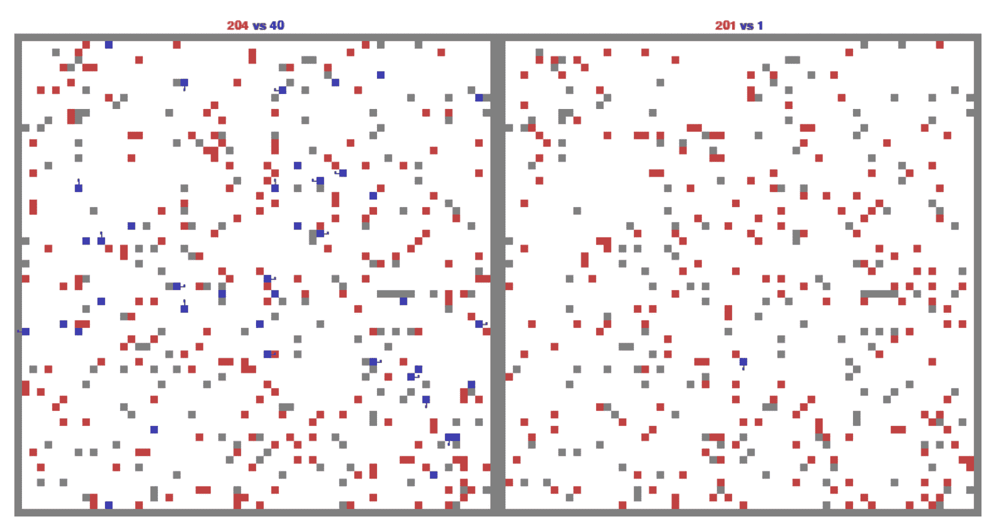
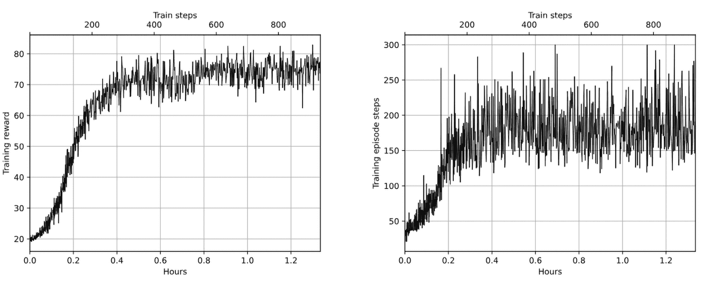
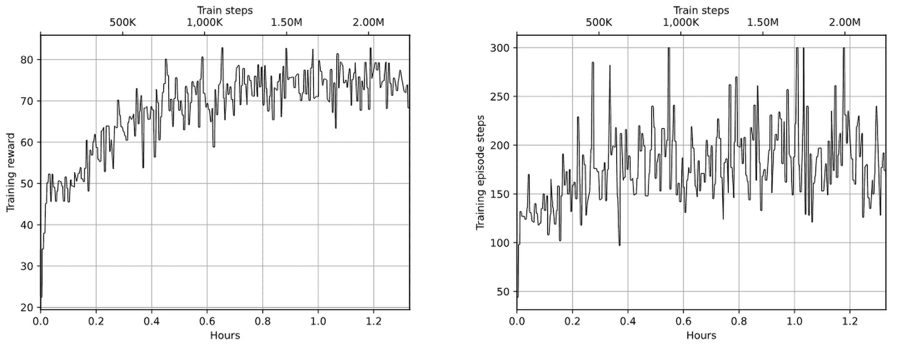
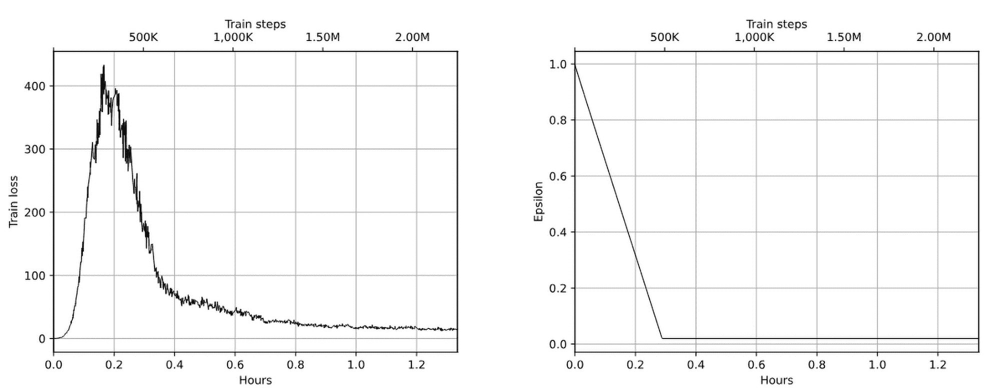
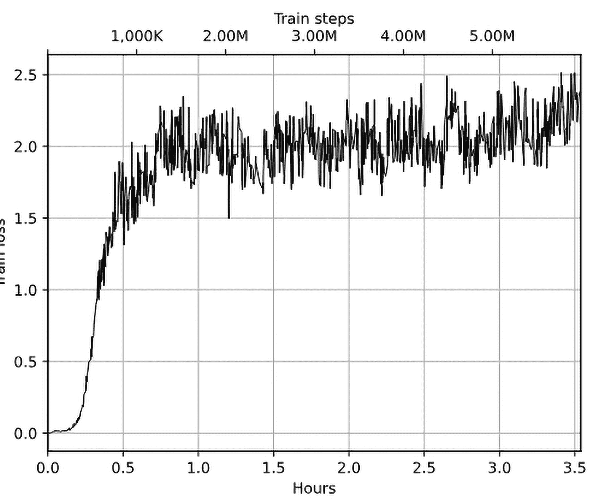
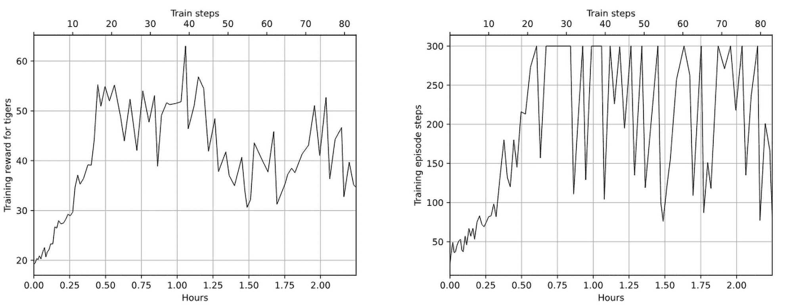
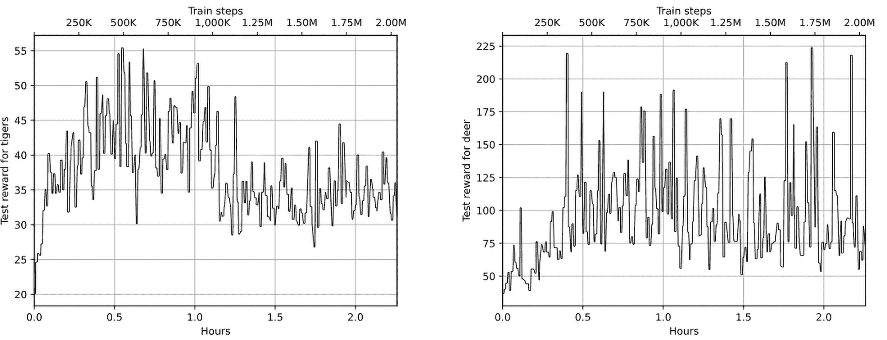
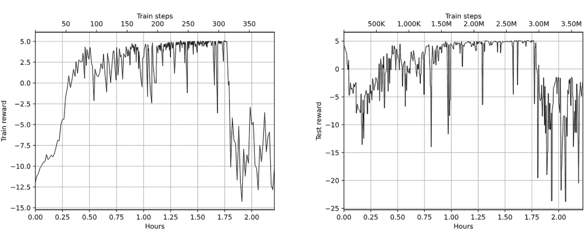

# 22

# 多智能体强化学习

在上一章中，我们讨论了离散优化问题。在本章中，我们将介绍多智能体强化学习（有时缩写为 MARL），这是一种相对较新的强化学习（RL）和深度强化学习（Deep RL）方向，涉及多个智能体在环境中进行交互的情况。现实生活中，这类问题出现在拍卖、宽带通信网络、物联网等场景中。

在本章中，我们将快速浏览一下 MARL，并在简单环境中进行一些实验；但当然，如果你对此感兴趣，仍有很多事情可以尝试。在我们的实验中，我们将采用一种直接的方式，智能体共享我们正在优化的策略，但观察结果将基于智能体的视角，并包括关于其他智能体位置的信息。通过这种简化，我们的 RL 方法将保持不变，唯一需要预处理的是环境，并且必须处理多个智能体的存在。

更具体来说，我们将：

+   从经典单一智能体强化学习问题与多智能体强化学习（MARL）之间的相似性和差异性概述开始

+   探索由 Geek.AI 英中研究小组实现并开源，后来被 Farama 基金会采纳的 MAgent 环境

+   使用 MAgent 在不同的环境中训练多个智能体群体的模型

# 什么是多智能体强化学习？

多智能体设置是我们在第一章中讨论的熟悉 RL 模型的自然扩展。在经典 RL 设置中，我们有一个智能体通过观察、奖励和行动与环境进行交互。但在一些经常出现在现实生活中的问题中，我们有多个智能体参与到环境交互中。为了举一些具体的例子：

+   一场象棋比赛，当我们的程序试图击败对手时

+   一个市场模拟，如产品广告或价格变化，当我们的行动可能引发其他参与者的反应时

+   多人游戏，如《Dota 2》或《StarCraft II》，当智能体需要控制多个单位与其他玩家的单位竞争时（在这种情况下，单一玩家控制的多个单位也可能会合作以实现目标）

如果其他智能体不在我们的控制范围内，我们可以将其视为环境的一部分，并继续坚持使用单智能体的常规 RL 模型。如你在第二十章所见，通过自对弈训练是一种非常强大的技术，可以在环境方面不需过多复杂化的情况下获得良好的策略。但在某些情况下，这种方法过于局限，并不是我们所需要的。

此外，研究表明，一组简单的智能体可能表现出远比预期更为复杂的协作行为。一些例子包括 OpenAI 博客文章 [`openai.com/blog/emergent-tool-use/`](https://openai.com/blog/emergent-tool-use/) 和由 Baker 等人撰写的论文《多智能体自动课程中的突现工具使用》[Bak+20]，其中讨论了“捉迷藏”游戏，在这个游戏中，一组智能体合作并逐渐发展出越来越复杂的策略和反策略，以战胜另一组智能体。例如，“用现有物品建造栅栏”和“使用蹦床抓住栅栏后面的智能体”。

在智能体可能进行交流的不同方式方面，可以将其分为两类：

+   竞争性：当两个或更多的智能体试图互相击败以最大化自己的奖励时。最简单的设置是双人游戏，如象棋、双陆棋或 Atari Pong。

+   协作性：当一组智能体需要共同努力以达成某个目标时。

有很多例子属于这些群体中的一种，但最有趣且最接近现实生活的场景通常是两种行为的混合。例子数不胜数，从一些允许你结盟的棋盘游戏到现代公司，在这些公司中，假设 100% 的合作是理所当然的，但现实生活通常比这复杂得多。

从理论角度来看，博弈论为这两种交流形式提供了相当成熟的基础，但为了简洁起见，我们不会深入探讨这一领域，它庞大且有不同的术语。如果你感兴趣，可以找到大量的书籍和课程，深入探讨这个话题。举个例子，最小最大算法是博弈论中的一个著名结果，你在第二十章看到过它的应用。

MARL 是一个相对较年轻的领域，但随着时间的推移，活动逐渐增多；因此，关注这个领域可能会很有趣。

# 开始使用环境

在我们开始第一个 MARL 示例之前，先来看看我们可以使用的环境。如果你想玩 MARL，选择有些有限。Gym 提供的所有环境只支持一个智能体。虽然有一些针对 Atari Pong 的补丁，可以将其切换为双人模式，但它们并不是标准的，而是例外而非常规。

DeepMind 与 Blizzard 一起使《星际争霸 II》公开可用（[`github.com/deepmind/pysc2`](https://github.com/deepmind/pysc2)），为实验提供了一个非常有趣且具有挑战性的环境。然而，对于刚接触 MARL 的人来说，这可能过于复杂。在这方面，我发现由 Geek.AI 最初开发的 MAgent 环境非常合适；它简单、快速，并且依赖最小，但仍然允许您模拟不同的多智能体场景进行实验。它没有提供与 Gym 兼容的 API，但我们将自行实现。

如果你对 MARL 感兴趣，你还可以查看 Farama Foundation 提供的 PettingZoo 包：[`pettingzoo.farama.org`](https://pettingzoo.farama.org)。它包含更多的环境和统一的 API 用于通信，但在本章中，我们只关注 MAgent 环境。

## MAgent 概览

让我们从高层次来看 MAgent。它提供了一个二维智能体栖息的网格世界的模拟。这些智能体可以观察周围的事物（根据它们的感知范围），移动到离当前位置一定距离的地方，并攻击周围的其他智能体。

可能会有不同的智能体群体，具有不同的特征和交互参数。例如，我们将考虑的第一个环境是一个捕食者-猎物模型，其中“老虎”捕猎“鹿”并为此获得奖励。在环境配置中，您可以指定群体的许多方面，如感知、移动、攻击距离、群体中每个智能体的初始健康、它们在移动和攻击时消耗多少健康等等。除了智能体，环境中可能还包含墙壁，智能体无法穿越这些墙壁。

MAgent 的优点在于它非常具有可扩展性，因为它内部是用 C++实现的，只暴露 Python 接口。这意味着环境中可以有数千个智能体，提供观察并处理智能体的行为。

## 安装 MAgent

正如常常发生的那样，MAgent 的原始版本已经有一段时间没有维护了。幸运的是，Farama Foundation 分叉了原始的代码库并且目前在维护它，提供了大部分原始功能。他们的版本叫做 MAgent2，文档可以在这里找到：[`magent2.farama.org/`](https://magent2.farama.org/)。GitHub 代码库在这里：[`github.com/Farama-Foundation/magent2`](https://github.com/Farama-Foundation/magent2)。要安装 MAgent2，您需要运行以下命令：

```py
pip install magent2==0.3.3
```

## 设置随机环境

为了快速理解 MAgent API 和逻辑，我实现了一个简单的环境，其中有“老虎”和“鹿”智能体，两个组都由随机策略驱动。从强化学习的角度来看，它可能不太有趣，但它将帮助我们快速了解足够的 API 内容，以实现 Gym 环境包装器。示例可以在 Chapter22/forest_random.py 中找到，我们将在这里逐步讲解。

我们从 lib/data.py 中定义的 ForestEnv 开始，它定义了环境。这个类继承自 magent_parallel_env（是的，类名是小写的，违反了 Python 风格指南，但它在库中就是这样定义的），这是 MAgent 环境的基类：

```py
class ForestEnv(magent_parallel_env, EzPickle): 
    metadata = { 
        "render_modes": ["human", "rgb_array"], 
        "name": "forest_v4", 
        "render_fps": 5, 
    }
```

这个类模拟了 Gym API，但它不是 100% 兼容的，因此我们稍后需要在代码中处理这个问题。

在构造函数中，我们实例化了 GridWorld 类，它作为 Python 适配器围绕低级的 MAgent C++ 库 API 工作：

```py
 def __init__(self, map_size: int = MAP_SIZE, max_cycles: int = MAX_CYCLES, 
                 extra_features: bool = False, render_mode: tt.Optional[str] = None, 
                 seed: tt.Optional[int] = None, count_walls: int = COUNT_WALLS, 
                 count_deer: int = COUNT_DEER, count_tigers: int = COUNT_TIGERS): 
        EzPickle.__init__(self, map_size, max_cycles, extra_features, render_mode, seed) 
        env = GridWorld(self.get_config(map_size), map_size=map_size) 

        handles = env.get_handles() 
        self.count_walls = count_walls 
        self.count_deer = count_deer 
        self.count_tigers = count_tigers 

        names = ["deer", "tiger"] 
        super().__init__(env, handles, names, map_size, max_cycles, [-1, 1], 
                         False, extra_features, render_mode)
```

在前面的代码中，我们实例化了 GridWorld 类，它实现了我们环境的大部分逻辑。

GridWorld 类由 get_config 函数返回的 Config 实例配置：

```py
 @classmethod 
    def get_config(cls, map_size: int): 
        # Standard forest config, but deer get reward after every step 
        cfg = forest_config(map_size) 
        cfg.agent_type_dict["deer"]["step_reward"] = 1 
        return cfg
```

这个函数使用了来自 magent.builtin.config.forest 包的 forest_config 函数，并调整配置，在每一步都为鹿添加奖励。当我们开始训练鹿模型时，这将非常重要，因此每一步奖励 1 会激励智能体活得更久。

其余的配置没有在这里包含，因为它大部分没有变化，定义了许多关于环境的细节，包括以下内容：

+   环境中有多少组智能体？在我们的例子中，有两组： “鹿” 和 “老虎”。

+   每组的属性是什么——它们从当前位置能看到多远？举个例子，鹿可以看到一格远，而老虎可以看到四格。它们能攻击其他人吗，攻击范围多远？每个智能体的初始生命值是多少？它们从伤害中恢复的速度有多快？你可以指定很多参数。

+   它们如何攻击其他组，以及造成什么样的伤害？这有很多灵活性——例如，你可以模拟捕食者仅成对狩猎的场景（我们稍后在本章会做这个实验）。在我们当前的设置中，情况很简单——任何一只老虎都可以攻击任何一只鹿，没有限制。

ForestEnv 类中的最后一个函数是 generate_map，它会将墙壁、鹿和老虎随机放置在地图上：

```py
 def generate_map(self): 
        env, map_size = self.env, self.map_size 
        handles = env.get_handles() 

        env.add_walls(method="random", n=self.count_walls) 
        env.add_agents(handles[0], method="random", n=self.count_deer) 
        env.add_agents(handles[1], method="random", n=self.count_tigers)
```

现在让我们来看一下 forest_random.py 的源代码。一开始，我们导入 lib.data 包和来自 Gymnasium 的 VideoRecorder 类：

```py
from gymnasium.wrappers.monitoring.video_recorder import VideoRecorder 
from lib import data 

RENDER_DIR = "render"
```

在第二章中，我们使用了 RecordVideo 封装器来自动捕获环境观察，但在 MAgent 环境中，由于返回值不同（所有方法一次返回所有代理的字典而不是单个值），这无法实现。为了解决这个问题，我们将使用 VideoRecorder 类来捕获视频并写入 RENDER_DIR 目录。

首先，我们创建一个 ForestEnv 实例和视频记录器。环境对象包含属性 agents，保存所有代理的字符串标识符。在我们的案例中，它将是一个类似 deer_12 或 tiger_3 的值列表。使用默认配置，在 64×64 的地图上，我们有 204 只鹿代理和 40 只老虎，因此 env.agents 列表包含 244 项：

```py
if __name__ == "__main__": 
    env = data.ForestEnv(render_mode="rgb_array") 
    recorder = VideoRecorder(env, RENDER_DIR + "/forest-random.mp4") 
    sum_rewards = {agent_id: 0.0 for agent_id in env.agents} 
    sum_steps = {agent_id: 0 for agent_id in env.agents}
```

我们使用 reset()方法重置环境，但现在它返回一个值（而不是 Gym API 中的两个值）。返回的值是一个字典，键是代理的 ID，值是观察张量：

```py
 obs = env.reset() 
    recorder.capture_frame() 
    assert isinstance(obs, dict) 
    print(f"tiger_0: obs {obs[’tiger_0’].shape}, act: {env.action_space(’tiger_0’)}") 
    print(f"deer_0: obs {obs[’deer_0’].shape}, act: {env.action_space(’deer_0’)}\n") 
    step = 0
```

上述代码产生以下输出：

```py
tiger_0: obs (9, 9, 5), act: Discrete(9) 
deer_0: obs (3, 3, 5), act: Discrete(5)
```

行为空间包含五个互斥的行为，适用于鹿（四个方向+一个“不作为”行为）。老虎也可以执行这些动作，但它们还可以在四个方向上进行攻击。

就观察而言，每只老虎会得到一个 9×9 的矩阵，其中包含五个不同的观察平面。鹿的视野较短，所以他们的观察范围仅为 3×3。观察总是以代理为中心，因此它显示的是围绕该特定代理的网格。五个观察平面包括：

+   墙壁：如果该单元格包含墙壁，则为 1，否则为 0。

+   第一组（代理所属组）：如果单元格中包含来自代理组的代理，则为 1，否则为 0。

+   第一组健康：该单元格中代理的相对健康值。

+   第二组（敌方代理所在组）：如果单元格中有敌人，则为 1，否则为 0。

+   第二组健康：敌人的相对健康值，如果没有敌人则为 0。

如果配置了更多的组，观察将包含更多的观察平面。此外，MAgent 有一个“迷你地图”功能，可以显示每个组的代理的“缩小视图”位置。这个迷你地图功能在我的示例中被禁用，但你可以试着开启它，检查它对训练的影响。如果没有这个功能，每个代理只能看到周围有限范围内的单元格，但迷你地图允许他们更全面地了解环境。

第 1 组和第 2 组是相对于代理组的；因此，在第二平面中，鹿获取其他鹿的信息，而老虎则获得其他老虎的信息。这使得观察独立于组，从而如果需要的话，我们可以为两个组训练一个单一的策略。

观察的另一个可选部分是所谓的“额外特征”，包括代理的 ID、上一个行为、上一个奖励和归一化位置。具体细节可以在 MAgent 源代码中找到，但我们在示例中不使用此功能。

让我们继续描述我们的代码。我们有一个循环，直到环境中没有活着的代理。在每次迭代中，我们为所有代理随机采样动作，并在环境中执行它们：

```py
 while env.agents: 
        actions = {agent_id: env.action_space(agent_id).sample() for agent_id in env.agents} 
        all_obs, all_rewards, all_dones, all_trunc, all_info = env.step(actions) 
        recorder.capture_frame()
```

从`env.step()`函数返回的所有值都是以`agent_id`为键的字典。关于 MAgent 环境的另一个非常重要的细节是，代理集是易变的：代理可以从环境中消失（例如，当它们死亡时）。在我们的“森林”环境中，老虎每步失去 0.1 点健康值，吃掉鹿后这一损失可能会增加。鹿只有在受到攻击后才会失去健康值，而在每步中会恢复健康（很可能是因为吃了草）。

当代理死亡（如老虎因饥饿死亡或鹿因老虎的攻击死亡）时，`all_dones`字典中的相应条目被设置为 True，并且在下一次迭代中，代理会从所有字典和`env.agents`列表中消失。因此，在一个代理死亡后，整个回合会继续，我们需要在训练过程中考虑到这一点。

在前面的例子中，循环会一直执行，直到没有代理存活。由于老虎和鹿都在随机行动（而且老虎每步都在失去健康），因此所有老虎很可能会因饥饿而死亡，而幸存的鹿将无限期地快乐生活下去。但环境被配置为在没有老虎的情况下自动移除所有鹿，因此我们的程序在 30-40 步后结束。

在循环结束时，我们将代理获得的奖励加总，并跟踪它们存活的步数：

```py
 for agent_id, r in all_rewards.items(): 
            sum_rewards[agent_id] += r 
            sum_steps[agent_id] += 1 
        step += 1
```

循环结束后，我们展示按奖励排序的前 20 个代理：

```py
 final_rewards = list(sum_rewards.items()) 
    final_rewards.sort(key=lambda p: p[1], reverse=True) 
    for agent_id, r in final_rewards[:20]: 
        print(f"{agent_id}: got {r:.2f} in {sum_steps[agent_id]} steps") 
    recorder.close()
```

此工具的输出可能如下所示：

```py
$ ./forest_random.py 
tiger_0: obs (9, 9, 5), act: Discrete(9) 
deer_0: obs (3, 3, 5), act: Discrete(5) 

tiger_5: got 34.80 in 37 steps 
tiger_37: got 19.70 in 21 steps 
tiger_31: got 19.60 in 21 steps 
tiger_9: got 19.50 in 21 steps 
tiger_24: got 19.40 in 21 steps 
tiger_36: got 19.40 in 21 steps 
tiger_38: got 19.40 in 21 steps 
tiger_1: got 19.30 in 21 steps 
tiger_3: got 19.30 in 21 steps 
tiger_11: got 19.30 in 21 steps 
tiger_12: got 19.30 in 21 steps 
tiger_17: got 19.30 in 21 steps 
tiger_19: got 19.30 in 21 steps 
tiger_26: got 19.30 in 21 steps 
tiger_32: got 19.30 in 21 steps 
tiger_2: got 19.20 in 21 steps 
tiger_8: got 19.20 in 21 steps 
tiger_10: got 19.20 in 21 steps 
tiger_23: got 19.20 in 21 steps 
tiger_25: got 19.20 in 21 steps 
Moviepy - Building video render/forest-random.mp4\. 
Moviepy - Writing video render/forest-random.mp4
```

在我的模拟中，有一个代理（tiger_5）特别幸运，活得比其他的都久。最后，程序保存了这一回合的视频。我运行的结果可以在这里查看：[`youtube.com/shorts/pH-Rz9Q4yrI`](https://youtube.com/shorts/pH-Rz9Q4yrI)。

在图 22.1 中，显示了两种不同的状态：游戏开始时和接近结束时。老虎用蓝点表示（如果你是用灰度模式查看，则是较深的蓝点），红点表示鹿，灰点表示墙壁（你可以参考书的数字版查看截图中的颜色）。攻击方向用小黑箭头表示。



图 22.1：森林环境的两种状态：在回合开始时（左侧）和接近结束时（右侧）

在这个例子中，两个代理组的行为是随机的，这并不特别有趣。在接下来的章节中，我们将应用深度 Q 网络（DQN）来提高老虎的狩猎技能。

# 老虎的深度 Q 网络

在这里，我们将应用 DQN 模型到老虎代理组，检查它们是否能学会更好地狩猎。所有代理共享网络，因此它们的行为将是相同的。鹿群将在本示例中保持随机行为，以便简化处理；我们将在本章后面训练它们。

训练代码可以在 Chapter22/forest_tigers_dqn.py 中找到；它与前几章的其他 DQN 版本没有太大区别。

## 理解代码

为了使 MAgent 环境与我们的类兼容，实施了一个专门版本的 ExperienceSourceFirstLast 来处理环境的特定情况。这个类被称为 MAgentExperienceSourceFirstLast，可以在 lib/data.py 中找到。我们来查看一下它，了解它如何融入代码的其他部分。

我们定义的第一个类是由我们的 ExperienceSource 生成的条目。正如我们在第七章中讨论的，ExperienceFirstLast 类的实例包含以下字段：

+   state: 当前步骤中来自环境的观测数据

+   action: 我们执行的动作

+   reward: 我们获得的奖励数量

+   last_state: 执行动作后的观测数据

在多代理设置中，每个代理都会生成相同的数据集，但我们还需要能够识别该代理属于哪个组（在这个老虎-鹿的例子中，这个经验是属于老虎还是鹿的轨迹？）。为了保留这一信息，我们定义了一个子类 ExperienceFirstLastMARL，并添加了一个新字段来保存组名：

```py
@dataclass(frozen=True) 
class ExperienceFirstLastMARL(ExperienceFirstLast): 
    group: str 

class MAgentExperienceSourceFirstLast: 
    def __init__(self, env: magent_parallel_env, agents_by_group: tt.Dict[str, BaseAgent], 
                 track_reward_group: str, env_seed: tt.Optional[int] = None, 
                 filter_group: tt.Optional[str] = None):
```

在 MAgentExperienceSourceFirstLast 的构造函数中，我们传递了以下参数：

+   magent_parallel_env: MAgent 并行环境（我们在前一节中进行了实验）。

+   agents_by_group: 每个代理组的 PTAN BaseAgent 对象。在我们的老虎 DQN 示例中，老虎将由神经网络（ptan.agent.DQNAgent）控制，而鹿则是随机行为。

+   track_reward_group: 指定我们要追踪的组的参数，该组用于追踪回合的奖励。

+   filter_group: 可选的组过滤器，用于生成经验的组。在我们当前的示例中，我们只需要来自老虎的观测数据（因为我们只训练老虎），但在下一节中，我们将训练一个同时适用于老虎和鹿的 DQN，因此该过滤器将被禁用。

在随后的构造函数代码中，我们存储参数并为代理创建两个有用的映射：从代理 ID 到组名，再从组名回到代理 ID：

```py
 self.env = env 
        self.agents_by_group = agents_by_group 
        self.track_reward_group = track_reward_group 
        self.env_seed = env_seed 
        self.filter_group = filter_group 
        self.total_rewards = [] 
        self.total_steps = [] 

        # forward and inverse map of agent_id -> group 
        self.agent_groups = { 
            agent_id: self.agent_group(agent_id) 
            for agent_id in self.env.agents 
        } 
        self.group_agents = collections.defaultdict(list) 
        for agent_id, group in self.agent_groups.items(): 
            self.group_agents[group].append(agent_id) 

    @classmethod 
    def agent_group(cls, agent_id: str) -> str: 
        a, _ = agent_id.split("_", maxsplit=1) 
        return a
```

我们还定义了一个实用方法来提取代理的数字 ID，从而获得组名（在我们的例子中，它将是老虎或鹿）。

接下来是该类的主要方法：迭代器接口，用于从环境中生成经验条目：

```py
 def __iter__(self) -> tt.Generator[ExperienceFirstLastMARL, None, None]: 
        # iterate episodes 
        while True: 
            # initial observation 
            cur_obs = self.env.reset(self.env_seed) 

            # agent states are kept in groups 
            agent_states = { 
                prefix: [self.agents_by_group[prefix].initial_state() for _ in group] 
                for prefix, group in self.group_agents.items() 
            }
```

在此，我们在开始时重置环境，并为代理创建初始状态（以防我们的代理会保持某些状态，但在本章的示例中，它们是无状态的）。

然后，我们迭代本集，直到有存活的代理（就像我们在上一节的示例中所做的那样）。在这个循环中，我们将动作填充到字典中，将代理 ID 映射到动作。为此，我们使用 PTAN BaseAgent 实例，它们可以处理一批观察数据，因此可以非常高效地为整个代理组生成动作：

```py
 episode_steps = 0 
            episode_rewards = 0.0 
            # steps while we have alive agents 
            while self.env.agents: 
                # calculate actions for the whole group and unpack 
                actions = {} 
                for prefix, group in self.group_agents.items(): 
                    gr_obs = [ 
                        cur_obs[agent_id] 
                        for agent_id in group if agent_id in cur_obs 
                    ] 
                    gr_actions, gr_states = self.agents_by_groupprefix 
                    agent_states[prefix] = gr_states 
                    idx = 0 
                    for agent_id in group: 
                        if agent_id not in cur_obs: 
                            continue 
                        actions[agent_id] = gr_actions[idx] 
                        idx += 1
```

一旦我们有了要执行的动作，我们将其发送到环境中，并获得包含新观察值、奖励、完成标志和截断标志的字典。然后，我们为每个当前存活的代理生成经验项：

```py
 new_obs, rewards, dones, truncs, _ = self.env.step(actions) 

                for agent_id, reward in rewards.items(): 
                    group = self.agent_groups[agent_id] 
                    if group == self.track_reward_group: 
                        episode_rewards += reward 
                    if self.filter_group is not None: 
                        if group != self.filter_group: 
                            continue 
                    last_state = new_obs[agent_id] 
                    if dones[agent_id] or truncs[agent_id]: 
                        last_state = None 
                    yield ExperienceFirstLastMARL( 
                        state=cur_obs[agent_id], action=actions[agent_id], 
                        reward=reward, last_state=last_state, group=group 
                    ) 
                cur_obs = new_obs 
                episode_steps += 1
```

在本节的结尾，我们记录了小组的步数和获得的平均奖励：

```py
 self.total_steps.append(episode_steps) 
            tr_group = self.group_agents[self.track_reward_group] 
            self.total_rewards.append(episode_rewards / len(tr_group))
```

有了这个类，我们的 DQN 训练代码几乎与单代理 RL 情况相同。这个示例的完整源代码可以在`forest_tigers_dqn.py`中找到。在这里，我将仅展示一部分代码，展示如何创建 PTAN 代理和经验源（以说明`MAgentExperienceSourceFirstLast`是如何使用的）：

```py
 action_selector = ptan.actions.EpsilonGreedyActionSelector(epsilon=PARAMS.epsilon_start) 
    epsilon_tracker = common.EpsilonTracker(action_selector, PARAMS) 
    tiger_agent = ptan.agent.DQNAgent(net, action_selector, device) 
    deer_agent = data.RandomMAgent(env, env.handles[0]) 
    exp_source = data.MAgentExperienceSourceFirstLast( 
        env, 
        agents_by_group={’deer’: deer_agent, ’tiger’: tiger_agent}, 
        track_reward_group="tiger", 
        filter_group="tiger", 
    ) 
    buffer = ptan.experience.ExperienceReplayBuffer(exp_source, PARAMS.replay_size)
```

如你所见，老虎是由神经网络控制的（这个网络非常简单，由一个两层卷积层和一个两层全连接层组成）。一群鹿是由随机数生成器控制的。经验回放缓冲区只会填充老虎的经验，这是因为使用了`filter_group="tiger"`的参数。

## 训练与结果

要开始训练，请运行`./forest_tigers_dqn.py -n run_name --dev cuda`。在一个小时的训练中，老虎的测试奖励达到了最佳得分 82，相较于随机基准，取得了显著的提升。随机行动下，大多数老虎在 20 步后死亡，只有少数幸运的老虎能活得更久。

让我们来计算为了获得这个分数，吃掉了多少只鹿。最初，每只老虎的生命值为 10，每一步消耗 0.5 的生命值。总共有 40 只老虎和 204 只鹿在地图上（你可以通过命令行参数来改变这个数量）。每吃掉一只鹿，老虎获得 8 点生命值，使它们可以多存活 16 步。每步每只老虎获得 1 点奖励，所以 40 只老虎吃掉鹿所带来的“超额奖励”是 82 ⋅ 40 − 20 ⋅ 40 = 2480。每只鹿提供 8 点生命值，这转化为老虎多活 16 步，因此吃掉的鹿的数量是 2480∕16 = 155。所以，差不多 76%的鹿是被我们获得的最佳策略猎杀的。考虑到鹿是随机放置在地图上的，而老虎需要找到它们并进行攻击，这个成绩不错。

很可能是由于老虎视野有限，策略停止了改进。如果你感兴趣，可以在环境设置中启用小地图并进行实验。通过获得更多关于食物位置的信息，策略有可能得到进一步的改善。

在图 22.2 中，显示了训练期间的平均奖励和步数。从中可以看出，主要的增长发生在前 300 个回合，而后来的训练进展几乎为 0：



图 22.2：训练回合中的平均奖励（左）和步数（右）

然而，图 22.3 显示了测试奖励和步数的图表，表明即使在 300 个回合后（大约 0.4 小时的训练），策略仍在持续改进：



图 22.3：测试回合的平均奖励（左）和步数（右）

图 22.4 中的最后一对图表显示了训练过程中的训练损失和 epsilon。两个图表是相关的，这表明训练过程中大部分的新颖性是在探索阶段获得的（因为损失值较高，意味着在训练中会出现新情况）。这可能表明更好的探索方法可能对最终策略有所帮助。



图 22.4：训练期间的平均损失（左）和 epsilon（右）

像往常一样，除了训练外，我还实现了一个工具来检查模型的实际表现。它叫做 forest_tigers_play.py，加载经过训练的模型并在回合中使用，生成观察视频记录。最佳模型的视频（测试得分 82.89）可以在此观看：[`www.youtube.com/shorts/ZZf80AHk538`](https://www.youtube.com/shorts/ZZf80AHk538)。如您所见，老虎的狩猎技巧现在明显优于随机策略：在回合结束时，初始的 204 只鹿中只剩下 53 只。

# 老虎之间的合作

我实施的第二个实验旨在使老虎的生活变得更加复杂，并鼓励它们之间的合作。训练和游戏代码是相同的；唯一的区别在于 MAgent 环境的配置。

如果将参数--mode double_attack 传递给训练工具，则将使用环境数据.DoubleAttackEnv。唯一的区别是配置对象，它为老虎的攻击设置了额外的约束。在新的设置中，它们只能成对攻击鹿，并且必须同时进行。单只老虎的攻击没有任何效果。这无疑使训练和狩猎变得更加复杂，因为现在老虎从吃鹿中获得奖励变得更加困难。要开始训练，可以运行相同的训练工具，但需要额外的命令行参数：

```py
./forest_tigers_dqn.py -n run-name --dev cuda --mode double_attack
```

让我们来看一下结果。

在图 22.5 中，显示了训练回合中的奖励和步骤图。正如你所见，即使经过 2 小时的训练，奖励仍在提高。同时，回合中的步骤数从未超过 300，这可能表明老虎没有附近的鹿可以吃，最终因饥饿而死（也有可能只是环境中步骤的内部限制）。


图 22.5：双重攻击模式下训练回合的平均奖励（左）和步骤计数（右）

与单只老虎狩猎模式相比，训练过程中的损失没有减少（如图 22.6 所示），这可能表明训练超参数可以改进：



图 22.6：训练过程中的平均损失

要测试模型的实际效果，你可以使用之前相同的工具；只需传入 --mode double_attack 参数即可。我获得的最佳模型的视频记录可以在这里查看：[`youtu.be/VjGbzP1r7HY`](https://youtu.be/VjGbzP1r7HY)。正如你所见，老虎现在成双成对地移动，一起攻击鹿。

# 训练老虎和鹿

下一个示例是老虎和鹿由不同的 DQN 模型控制并同时训练的场景。老虎因生存时间长而获得奖励，这刺激它们吃更多的鹿，因为在模拟的每一步中，它们都会失去健康点。鹿在每个时间戳也会获得奖励。

代码位于 forest_both_dqn.py 中，是前一个示例的扩展。对于两组智能体，我们分别有一个 DQNAgent 类实例，它使用独立的神经网络将观察转化为动作。经验源是相同的，但现在我们不再过滤老虎的组经验（即参数 filter_group=None）。因此，我们的回放缓冲区现在包含来自环境中所有智能体的观察，而不仅仅是像前一个示例那样来自老虎的观察。在训练过程中，我们会抽取一个批次，并将老虎和鹿的例子分成两个独立的批次，用于训练它们的网络。

我这里不会包含所有代码，因为与前一个示例相比，差别仅在一些细节上。如果你感兴趣，可以查看 GitHub 仓库中的源代码。图 22.7 显示了老虎的训练奖励和步骤。你可以看到，最初，老虎能够稳定地提高它们的奖励，但后来增长停止了：



图 22.7：老虎的平均奖励（左）和训练回合中的步骤计数（右）

在图 22.8 的接下来的两个图中，显示了老虎和鹿在测试中的奖励。这里没有明确的趋势；两组都在竞争，试图击败对方：



图 22.8：老虎（左）和鹿（右）的测试奖励

正如你从图 22.8 中看到的，鹿比老虎更成功，这并不令人惊讶，因为两者的速度相同，鹿只需要一直移动，等待老虎因饥饿而死亡。如果你愿意，可以通过提高老虎的速度或墙体密度来实验环境设置。

和之前一样，你可以使用 utility 工具 forest_both_play.py 来可视化学习到的策略，但现在需要传递两个模型文件。这里有一个视频，比较了鹿的最佳模型和老虎的最佳模型：[`youtube.com/shorts/vuVL1e26KqY`](https://youtube.com/shorts/vuVL1e26KqY)。在视频中，所有鹿都只是朝场地的左边移动。很可能，老虎能够利用这一简单的策略来为自己谋取利益。

# 战斗环境

除了老虎-鹿环境外，MAgent 还包含了其他一些预定义的配置，你可以在 magent2.builtin.config 和 magent2.environment 包中找到它们。本章的最后一个示例，我们将看看“战斗”配置，其中两组智能体互相对抗（幸好没有吃掉对方）。两个智能体的健康值都是 10，每次攻击造成 2 点健康损失，因此需要 5 次连续攻击才能获得奖励。

你可以在 battel_dqn.py 中找到代码。在这个设置中，一组是随机行为，另一组使用 DQN 来改进策略。训练持续了两小时，DQN 成功找到了一种不错的策略，但最终，训练过程出现了发散。在图 22.9 中，展示了训练和测试的奖励图：



图 22.9：在战斗场景中的训练期间（左）和测试期间（右）平均奖励

视频记录（由工具 battle_play.py 生成）可以在这里找到：[`youtube.com/shorts/ayfCa8xGY2k`](https://youtube.com/shorts/ayfCa8xGY2k)。蓝队是随机的，红队由 DQN 控制。

# 总结

在本章中，我们仅简单介绍了一个非常有趣且充满活力的领域——多智能体强化学习（MARL），该领域在交易仿真、通信网络等方面有着多个实际应用。你可以在 MAgent 环境或其他环境（如 PySC2）中自行尝试许多实验。

恭喜你读完了这本书！我希望这本书对你有所帮助，并且你像我在收集材料和撰写章节时一样，享受阅读它。最后，我希望你在这个令人兴奋且充满活力的强化学习领域好运。这个领域正在快速发展，但只要掌握了基础，追踪该领域的新进展和研究将变得更加简单。

还有许多非常有趣的话题没有覆盖，例如部分可观察的马尔可夫决策过程（环境观察不满足马尔可夫性质）或近期的探索方法，比如基于计数的方法。最近围绕多智能体方法也有很多活动，其中多个智能体需要学习如何协调合作解决共同的问题。我也没有提到基于记忆的强化学习方法，在这种方法中，智能体可以维持某种记忆以保存其知识和经验。为了提高强化学习的样本效率，付出了大量努力，理想情况下，未来有一天它将接近人类的学习表现，但目前这仍是一个遥远的目标。当然，仅仅一本书是不可能覆盖完整领域的，因为几乎每天都有新思想出现。然而，本书的目标是为您提供该领域的实践基础，简化您对常用方法的学习。

我想引用 Volodymyr Mnih 在 2017 年伯克利深度强化学习训练营上发表的《深度强化学习的最新进展、前沿与未来》演讲中的话，这些话仍然非常相关：“深度强化学习领域非常新，所有的东西都令人兴奋。字面上说，什么都还没有解决！”

# 留下评论！

感谢您从 Packt 出版公司购买本书——我们希望您喜欢这本书！您的反馈对于我们来说非常宝贵，它帮助我们改进和成长。在您读完本书后，请花一点时间留下一个[亚马逊评论](https://packt.link/r/1835882714)，这只需几分钟，但对像您这样的读者来说意义重大。

扫描下面的二维码，领取您选择的免费电子书。


*https://packt.link/NzOWQ*
