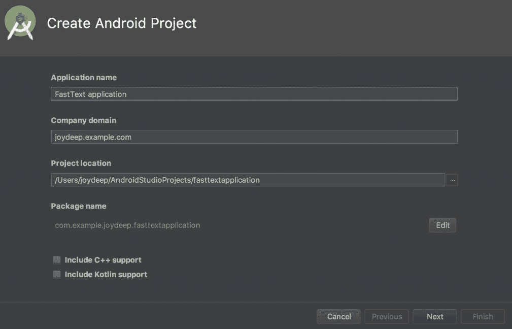
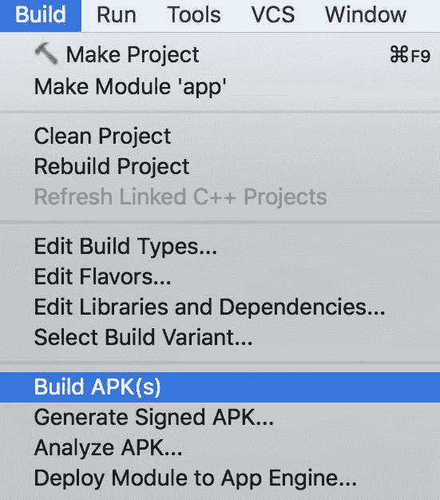
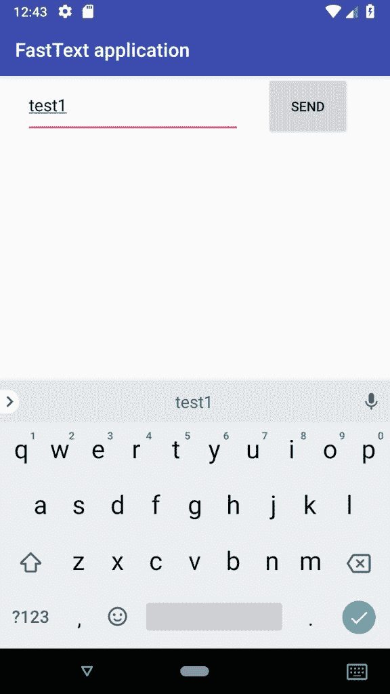
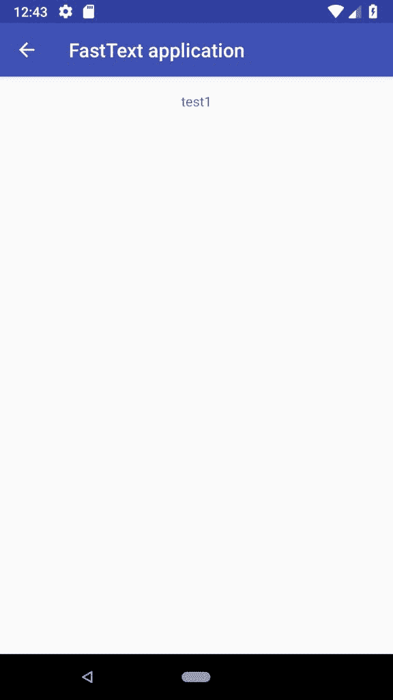
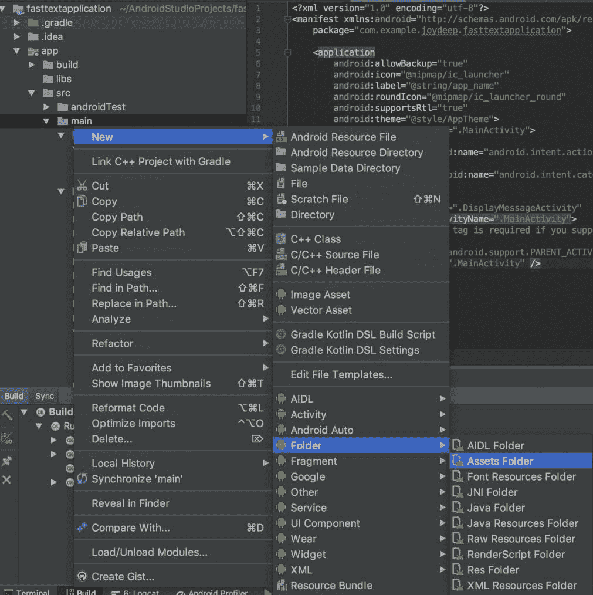
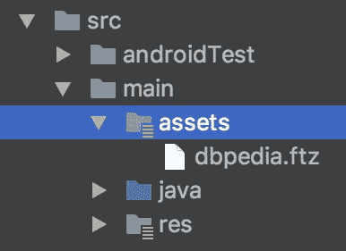
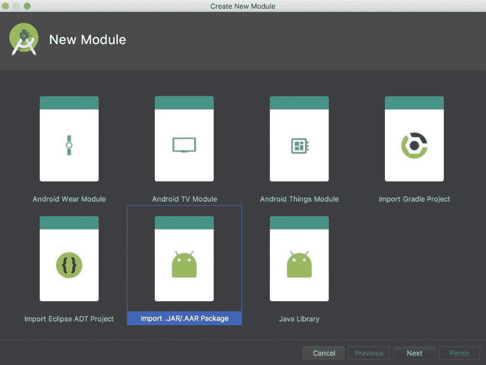
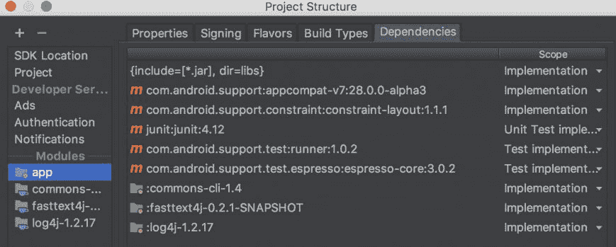
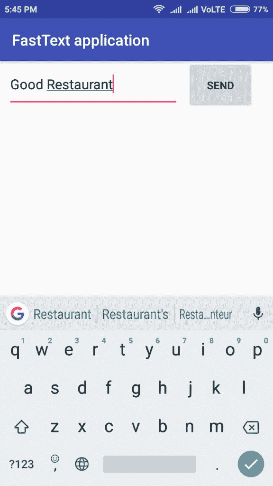

# 部署模型到 Web 和移动端

对于依赖机器学习的公司来说，以可扩展的方式部署模型非常重要。模型应该以创建时的方式运行。无论是监督学习还是无监督学习，fastText 模型的部署可以通过多种方式实现。选择方法将取决于你个人的需求。

在本章中，我们将重点讨论如何在 Web 和移动场景中部署 fastText 模型。涉及的主题包括：

+   部署到 Web

+   Flask

+   FastText 函数

+   Flask 端点

+   部署到更小的设备

+   前提条件 – 完成 Google 教程

+   应用考虑事项

+   添加 fastText 模型

+   Java 中的 FastText

+   向 Android 添加库依赖

+   在 Android 中使用库依赖

+   最终，应用

# 部署到 Web

现在你已经掌握了创建自己 fastText 模型的方法，你可能需要将它们部署到生产环境，以便可以利用这些模型来创建应用和端点。Python 中有许多框架可以用来创建这样的 Web 应用。Flask、Django 和 Pyramid 是一些流行的 Python Web 框架。在本节中，我们将以 Flask 为例，构建一个简单的 Web 最近邻搜索应用。

# Flask

Flask 是一个流行的 Web 框架，被归类为微框架，因为它不需要任何外部工具或库。Flask 内部没有数据库抽象层、表单验证或其他组件。其优点是，你可以用最少的代码行构建一个简单的 Web 应用。这有助于快速原型设计，并让你专注于应用本身的代码。

对于本节讨论的代码，可以查看仓库中的 `chapter 7` 文件夹。你将找到两个文件，`ft_server.py` 和 `ft_utils.py`。`ft_utils.py` 模块包含与 fastText 服务器相关的代码，而 `ft_server.py` 包含与 Flask 端点相关的代码。

# fastText 函数

如果你查看代码，我们是通过 `FT_MODEL` 环境变量加载 fastText 模块的。这个模型被作为全局变量加载，以便可以在函数中使用。另一个好处是，当 Flask 应用初始化时，模型也会被加载到内存中。将模型加载到内存中是一个计算密集型操作，因此如果我们将此操作延迟到初始化阶段，将能提高响应时间：

```py
print('loading the model')
FT_MODEL = os.environ.get('FT_MODEL')
if not FT_MODEL:
    raise ValueError('No fasttext model has been linked.')
FT_MODEL = fastText.load_model(FT_MODEL)
print('model is loaded')
```

现在，我们还将基于一个阈值获取词汇表中最常见的词汇，并将其保存在内存中。我们将词向量作为全局变量保存，这样词向量的计算就会在应用初始化时完成，类似于之前的方式：

```py
# Gets words with associated frequency sorted by default by descending order
words, freq = FT_MODEL.get_words(include_freq=True)
words = words[:threshold]
vectors = np.zeros((len(words), FT_MODEL.get_dimension()), dtype=float)
for i in range(len(words)):
    wv = FT_MODEL.get_word_vector(words[i])
    wv = wv / np.linalg.norm(wv)
    vectors[i] = wv

# For efficiency preallocate the memory to calculate cosine similarities
cossims = np.zeros(len(words), dtype=float)
```

接下来的两个函数基本上是如何根据问题词的词向量与其他词的词向量之间的距离来获取最接近的词。这些函数在第五章，*Python 中的 FastText*中也有讨论。

你应该能够单独运行这个模块。同时，注意运行整个模块所需的时间。

在我的笔记本上，运行整个代码大约需要 10 秒钟。

# Flask 端点

为了简洁起见，本文中只讨论了一个端点。基本上，它用于获取传入的问题词，使用 `ft_utils.py` 文件中定义的 `nn` 函数获取答案，然后以 JSON 格式提供答案：

```py
@app.route('/nn/<question_word>')
def nearest_neighbours(question_word):
    answers = [a for a in nn(FT_MODEL, question_word, k=5)]
    return jsonify(dict(question=question_word, answers=answers))
```

现在，以开发模式运行应用，这样你就可以调试它：

```py
$ export FLASK_APP=ft_server.py
$ export FLASK_ENV=development
$ export FT_MODEL=wiki.simple.bin
$ flask run
```

打开一个新的终端并发送一个 curl 请求；你应该能在终端看到响应。你可以看到响应也很快：

```py
$ time curl http://127.0.0.1:5000/nn/dog
 {
 "answers": [
 "dogs",
 "catdog",
 "sheepdog",
 "sheepdogs",
 "breed"
 ],
 "question": "dog"
 }
$ curl http://127.0.0.1:5000/nn/dog 0.01s user 0.00s system 9% cpu 0.105 total
```

我们能够在 Flask 应用中获得非常快速的响应，因为我们尽可能将计算开销大的部分代码移至应用初始化阶段。这通常是一个不错的做法。作为 Web 应用的一部分，只做绝对必要的事情，并将请求处理过程中的计算量保持在最低限度。这将确保你构建出高效且实用的 Web 应用，适合部署 fastText 模型和机器学习应用。

# 部署到较小的设备

正如你在第二章中看到的，*使用 FastText 命令行创建模型*，你可以使用类似下面的命令从完整模型创建一个压缩的 fastText 模型：

```py
$ ./fasttext quantize -output <model prefix> -input <training file> -qnorm -retrain -epoch <number of epochs> -cutoff <number of words to consider>
```

在第四章，*FastText 中的句子分类*，我们也重新讨论了压缩模型的概念，以及如何在性能几乎不丢失的情况下实现压缩。

这使得你也可以在较小的设备上部署机器。首先想到的一个问题是，文件是否可以与 Android 应用打包并部署在 Android 应用中。

在本节中，我将展示所有应该能帮助你部署 Android fastText 应用所需的要求和依赖项。

# 前提条件 – 完成 Google 教程

一个值得参考的最佳示例是 Google 教程中的 Android 应用示例。如果你是 Android 新手，请访问[`developer.android.com/training/basics/firstapp/`](https://developer.android.com/training/basics/firstapp/)并完成那里的教程。我们在这里不再详细介绍，所以总结起来，步骤是：

1.  安装 Android Studio

1.  创建一些简单的用户界面

1.  创建活动并定义意图

1.  构建并创建 APK 文件

对于我们的应用程序，我们将沿着类似的思路进行。我们项目的名称是 `Fasttext application`。因此，下载最新版本的 Android Studio 并启动它：



继续点击“Next”，选择空活动并点击“Finish”。你应该会进入一个新的项目窗口，其中已经为你完成了大量 Android 的模板代码。现在，打开 Google 的教程并按照教程中的所有步骤进行操作。如果你已经是经验丰富的 Android 开发者，你可以从 GitHub 仓库中打开项目。首先，执行 `git fetch` 并切换到 `android_starting` 分支：

```py
git fetch
git checkout android_starting
```

现在，如果你编译应用并创建 APK，你应该能够看到以下界面。或者，如果你已经设置了 ADB，你可以选择运行并在模拟器中查看应用。

要构建 APK，你可以在 Android Studio 中点击“Build APK(s)”按钮：



请按照 Google Android 教程中“构建简单用户界面”部分的步骤操作，以便最终运行一个类似于这个的简单应用：


现在，按照“开始另一个活动”教程进行操作，完成另一个活动的创建。这个教程的目的是让你能够从第一个活动触发另一个单独的活动：

           =>              

# 应用程序考虑事项

现在你已经有了两个活动，你可能已经猜到了我们 fastText 应用的目标。我们将在第一个活动中输入文本标签，并且它应该在第二个活动中给出标签。

要实现这一点，你需要做两件事：

1.  将预构建的 fastText 模型添加到 Android 应用中

1.  添加一个库来解析 fastText 模型并提供预测结果

有几点我想在这里提一下。我们将在这里使用 fastText FTZ 模型。你可以争辩说，正如我们所见，fastText 模型是通过产品量化方法构建的，使用了像最近邻中心估计、词汇修剪和哈希等方法。这会导致信息丢失，尽管有争议称这种丢失对性能没有显著影响。但如果你不信服，你可以选择按照前面章节讨论的那样，创建一个 Web 应用并通过 Android 应用访问结果，这意味着将 Android 应用作为只读视图，所有计算都由服务器完成。这是一个合理的方案，但更多的是一个工程挑战，并不在本书的范围内。在本节中，我们更感兴趣的是能否利用 fastText 的能力创建非常小的模型，将其部署到移动设备，并在我们的应用程序中使用它们。

现在，在继续之前，先构建 APK 并注意当前应用程序的大小，因为大小对于用户来说是一个重要问题。如果你希望用户下载并使用应用程序，大小问题不容忽视。你肯定不希望因为内存已满而让用户卸载应用程序，或者用户处在互联网非常慢的地方，下载应用程序会非常耗时。因此，在为小型设备设计应用时，始终要记得考虑应用程序的大小。

目前，构建仅占用 1.5 MB 的内存：

```py
$ du -sh app-debug.apk
1.6M app-debug.apk
```

# 添加 fastText 模型

接下来，你需要将 fastText 模型添加到应用程序中。Android 有一个资产管理系统，可以用来实现这一点。

首先，下载或创建一个 FTZ 模型。我从 fastText 网站的监督模型部分下载了`dbpedia.ftz`文件。该文件大约 1.6 MB，因此不应该增加最终构建的 APK 大小。

Android 有一个资源管理系统，你可以用它来实现这一目的。在主文件夹下创建一个 assets 文件夹，并将你的 FTZ 文件复制/粘贴到其中：



你应该能够看到文件，如下所示：



完成后，添加代码以使用资源管理器访问文件。由于我们在第二个活动中进行预测，让我们在`DisplayMessageActivity.java`文件中访问该文件。

在`onCreate`方法中，创建一个`AssetManager`实例以访问资产文件，并创建一个`InputStream`实例，以便文件可以转换为流。数据将从这个流中读取和操作，代码如下：

```py
public class DisplayMessageActivity extends AppCompatActivity {

    @Override
    protected void onCreate(Bundle savedInstanceState) {
        super.onCreate(savedInstanceState);
        setContentView(R.layout.activity_display_message);

        // Get the Intent that started this activity and extract the string
        Intent intent = getIntent();
        String message = intent.getStringExtra(MainActivity.EXTRA_MESSAGE);

        // Get the assets from the asset manager.
        AssetManager assetManager = getAssets();
        InputStream inputStream = null;
        try {
            inputStream = assetManager.open("dbpedia.ftz");
        } catch (IOException e) {
            e.printStackTrace();
        }

        // Capture the layout's TextView and set the string as its text
        TextView textView = findViewById(R.id.textView);
        textView.setText(message);

    }
```

按下*Alt* + *Enter*（在 Mac 上是*Option* + *Enter*）来导入缺失的类。你的导入应该如下所示：

```py
import android.content.Intent;
import android.content.res.AssetManager;
import android.support.v7.app.AppCompatActivity;
import android.os.Bundle;
import android.widget.TextView;

import java.io.IOException;
import java.io.InputStream;
```

# Java 中的 FastText

现在你已经在 Android 应用中部署了 fastText 模型，你需要一种方法来访问文件并提供预测。你可以通过编写 Java 自定义代码来实现这一点，参考 fastText 的 GitHub 库。这样做的优势在于你对代码有更多的控制，且如果你在编写企业级应用时，可能是唯一的选择，因为 fastText 的代码是 BSD 许可下发布的。另一种选择是将 fastText 代码编译成 Android 库的一部分，但服务原生代码存在很多问题，且可能在所有设备上无法正常工作。对我来说，添加外部依赖的最佳方法是找到能够为你完成工作的核心 Java 库。

幸运的是，在这种情况下，我们有一个符合要求的库。`fastText4j`是一个由`linkfluence`在 GitHub 上发布的优秀 Java 库，包含所有 Java 代码，并且能够加载和解析 Java 库。除了能够读取 bin 和 FTZ 文件，我们还能够读取和创建 Java 内存映射文件，尽管在这里我们不会使用它。使用以下仓库克隆这个库，它是原始`linkfluence`库的克隆：

```py
$ git clone https://github.com/infinite-Joy/fastText4j.git
$ cd fastText4j
$ mvn clean
```

还需要将包编译为应用程序，因为我们将需要它进行测试和编译。解压生成的文件：

```py
$ mvn install -Papp
$ unzip app/fasttext4j-app.zip
$ cp target/fasttext4j-0.2.1-SNAPSHOT.jar lib/fasttext4j-0.2.1-SNAPSHOT.jar
```

这将把`lib/`文件夹和`fasttext-mmap.sh`文件复制到当前目录。最后的复制步骤现在并非必须，但这样做是为了向你展示，当你对这个仓库做出更改并重新编译 JAR 时，这一步是需要的。现在，文件将包含稍有不同的命令行。修改`src/main/java/fasttext/FastText.java`中的`main`方法：

```py
  public static void main(String[] args) throws Exception {

    Options options = new Options();

    Option input = new Option("i", "input", true, "input model path");
    input.setRequired(true);
    options.addOption(input);

    CommandLineParser parser = new DefaultParser();
    HelpFormatter formatter = new HelpFormatter();
    CommandLine cmd;

    try {
      cmd = parser.parse(options, args);
    } catch (ParseException e) {
      System.out.println(e.getMessage());
      formatter.printHelp("fasttext.FastText", options);

      System.exit(1);
      return;
    }

    String inputModelPath = cmd.getOptionValue("input");

    logger.info("Loading fastText model to convert...");
    FastText model = FastText.loadModel(inputModelPath);
    FastTextPrediction label = model.predict("Good restaurant");
    System.out.println(label.label());
  }
```

输出参数已被移除，我们现在将模型作为输入并获取参数。编译此代码并复制我们下载的 FTZ 模型路径。现在我们来测试这个库：

```py
$ mvn clean package
$ cp target/fasttext4j-0.2.1-SNAPSHOT.jar lib/fasttext4j-0.2.1-SNAPSHOT.jar
$ time bash fasttext-mmap.sh -i <path to>/dbpedia.ftz
__label__7
bash fasttext-mmap.sh -i 0.64s user 0.11s system 168% cpu 0.444 total
```

输出命令将会有大量日志。我们现在不会展示这些日志。只需检查日志中是否有任何错误消息，可能会标记缺少的依赖库。此外，正如你所见，在我的本地机器上加载并提供 FTZ 文件的预测非常快。假设在低性能的 Android 应用中，它也应该表现得很高效。

既然我们已经确认库可以工作并且能够给出预测，移除`main`方法，因为我们在 Android 应用中不需要它。编译 JAR 并将其放置在`lib`文件夹中：

```py
$ mvn clean package
$ mvn install -Papp
$ unzip app/fasttext4j-app.zip
$ cp target/fasttext4j-0.2.1-SNAPSHOT.jar lib/fasttext4j-0.2.1-SNAPSHOT.jar
```

# 将库依赖添加到 Android 中

检查`lib`文件夹。所有作为此项目依赖的库都会放在这里。如果我们希望在 Android 应用中使用这个库，必须将这些依赖添加到应用中。

打开 文件 | 新建 | 新建模块...：


导入 JAR/AAR 包：



现在，将`lib`文件夹中的所有库添加为依赖项。现在，项目结构应该列出这些库作为依赖项。然后，点击应用 | 依赖项，将它们也作为应用的依赖项添加。将库文件作为模块依赖添加：



现在依赖已经添加，我们可以开始在我们的活动中使用这个库了。

# 在 Android 中使用库依赖

要在 Android 中使用这个库，修改`DisplayMessageActivity.java`并编写你在库测试阶段看到的相同代码。

在编译之前，在`gradle.build`文件中添加`guava`依赖，因为`guava`库中的`UnsignedLong`依赖：

```py
compile 'com.google.guava:guava:21.0'
```

同时，添加编译版本，以便能够编译 Java 代码：

```py
apply plugin: 'com.android.application'

android {
    compileSdkVersion 28
    defaultConfig {
        ...
    }
    buildTypes {
        ...
    }
    compileOptions {
        sourceCompatibility JavaVersion.VERSION_1_8
        targetCompatibility JavaVersion.VERSION_1_8
    }
}

dependencies {
    ...
    compile 'com.google.guava:guava:21.0'
}
```

# 最终的应用

现在，编译应用并在你的手机上运行。你应该能够看到这些变化：

     =>    

让我们也来看一下创建的 APK 文件。在我的机器上，应用的大小已变为 4.6 MB。够小了吗？我将把这个问题留给你自己判断：

```py
$du -sh app-debug.apk
4.6M app-debug.apk
```

# 总结

在本章中，我们研究了如何在网页和移动环境中实现 fastText 的方法，特别是针对 Android 平台。我们还探讨了在部署到网页或移动设备时需要考虑的不同因素。这将帮助你创建出色的应用，并将 fastText 集成到你的移动应用中。
