# 15

# 扩散模型与 AI 艺术

在之前的章节中，我们已经看到生成模型如何用于创建新颖的图像的示例；我们还看到语言模型如何用于回答问题或创建像诗歌这样完全新颖的文本。在本章中，我们通过展示如何将用户提示转换为图像，将这两个概念结合起来，允许您使用自然语言创作“AI 艺术”。除了创建新颖的图像外，我们还可以执行一些有用的功能，如扩展图像超出其当前边界（“outfilling”）并定义安全筛选功能在我们的结果中。我们还将探讨支持这种图像生成方法的基本思想之一，即*扩散模型*，它使用热传递的概念来表示随机数输入如何被“解码”为图像。为了说明这些想法，我们主要将使用*稳定扩散*，这是一个开源生成模型，但类似的概念也适用于闭源模型，如*Midjourney*和*DALL-E*。我们将涵盖的主题包括：

+   扩散模型与其他类型的图像生成模型的关系

+   稳定扩散模型如何结合**变分自编码器**（**VAEs**）和扩散模型，以创建极其高效的图像采样

+   在 Hugging Face 流水线库中使用稳定扩散模型的一些示例，我们：

    +   评估影响图像生成任务输出的关键参数

    +   演示 Hugging Face 流水线的各个步骤如何实现图像生成任务，从用户提示创建图片：

        +   将用户提示标记为字节字符串

        +   将字节字符串提示编码为向量

        +   生成随机数向量

        +   使用编码的提示和随机输入运行多个去噪步骤，生成新图像的压缩形式

        +   使用 VAE 的解码器部分解压新图像

# 图像生成的详细步骤：为什么我们需要扩散模型

扩散模型是最新和最流行的图像生成方法之一，特别是基于用户提供的自然语言提示。这一类图像生成模型的概念挑战在于创建一种方法，即：

+   可扩展进行训练和执行

+   能够生成多样化的图像，包括使用用户引导的提示

+   能够生成看起来自然的图像

+   具有稳定的训练行为，易于复制

解决这个问题的一种方法是“自回归”模型，其中图像是逐像素生成的，使用先前生成的像素作为连续输入 1。 这些模型的输入可以是图像像素集合，也可以是用户提供的自然语言指令，这些指令被编码为嵌入向量。 这种方法比较慢，因为它使得每个像素依赖于模型输出中的前几个步骤。 正如我们在前几章中所看到的，**生成对抗网络**（**GANs**）也可以用来合成图像，但它们的训练行为不稳定，难以复制，并且容易陷入局部“模式”，而不是生成更广泛的自然图像分布²。 正如我们在*第十一章*中看到的那样，基于逐像素近似的目标函数可能无法创建最逼真的图像。 最近，*扩散模型*作为一种有前景的替代方法崭露头角。 它们是什么？它们如何解决我们提到的一些挑战？

## 从噪声到图像：使用扩散模型来模拟自然图像的变化性

扩散模型的核心思想是，我们可以将图像表示为一组像素，这些像素就像高维空间中的一个云团。 这个云团是高度结构化的，代表了颜色斑块和物体。 如果我们添加噪声——比如随机正态噪声——到这个结构中，它将变成一个球形云团。 然而，如果我们有一种方法可以逆转这种图像的“模糊”，我们就可以从一组随机点中生成新图像。

让我们看一下如何将其用数学形式写出来。我们从“前向过程”开始，它接受输入数据，例如一张图片，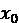，并应用逐步噪声将其转化为一个随机正态向量。我们将这个前向“模糊”过程标记为 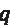*,* 并且可以将其表示为一个*马尔可夫*过程，其中每一步仅依赖于前一步：

换句话说，最终由随机像素组成的图像是通过反复应用一个函数  到步骤 ，依赖于  的先前值创建的。 这个函数  定义了一个转移过程，它遵循一个由 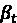 参数化的高斯分布，该参数控制方差³。  的值决定了在每一步应用的噪声水平——较小的值（低 ）导致噪声逐渐增加，而较大的值（高 ）则加速转变，使图像更快地退化成一组随机像素。 一旦我们应用足够多次这个“模糊”变换，数据将处于如随机正态分布的状态。

那么，如果我们现在想从这个模糊的云团中恢复一张图像怎么办？我们只需要应用“反向”变换 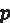，使用类似的公式：

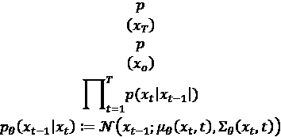

我们可以看到！ 和！ 是彼此的反向过程，但！ 还代表了一个从随机数据生成图像的过程。

该过程如下所示：

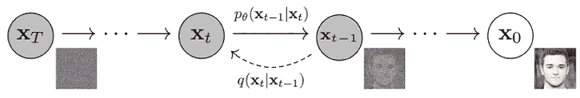

图 15.1：加噪和去噪图像的扩散过程⁴

这种设计在概念上似乎很有前景，但我们不清楚如何保证！ 和！ 足够接近，以便在应用时能够生成高质量的样本。换句话说，我们需要一种方法来优化！ 和！ 的参数，使它们调整到生成输入图像的高质量重构，当图像经过模糊并通过！ 恢复后。这可能并不令人惊讶，因为在我们讨论变分自编码器（VAE）时，熟悉的！ 和！ 分布出现在 *第十一章* 中，因此这个问题可以通过变分推断来解决⁴。让我们看看如何做到。

## 使用变分推断生成高质量的扩散模型

记住，**证据下界**（**ELBO**）给出了一个表达式，用于表示一个难以计算的分布 p 的对数似然，它通过一个易于计算的近似分布来表示！：

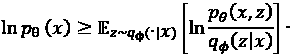

我们不是直接最大化！ 的似然性，而是最大化右边的部分，即！ 似然性的下界，该下界与一个近似分布！ 的散度相关。为了方便起见，我们通常最小化负对数似然（因为许多计算包采用最小化函数），这就得到了以下扩散模型的方程：

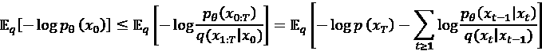

请注意，这个方程可以在加噪/去噪过程中的多个步骤 t 上进行评估。我们可以将其更明确地写成一个包含起始、中间和最终值的损失函数。

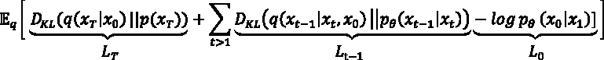

这里，DKL 是 Kullback–Leibler 散度，正如我们在 *第十一章* 中所看到的。记住，前向加噪过程 *q* 的方差为！。我们可以尝试学习这个值，但由于它通常较小，我们可以将其视为固定值。因此，这个方程中的最后一项，在时间 *T* 时会消失，因为它是一个常数。那么，从 *t*=1 到 *T*-1 的值如何呢？我们已经描述过 *q* 没有可学习的参数，因此我们关心的是学习 *p* 的参数，即将随机噪声转化为图像的反向过程。在这个表达式中：

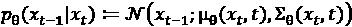

我们通常将方差保持为固定值，因此我们只需要学习一个预测均值的函数——这个函数可以是一个神经网络，接受给定步长的输入像素，并输出稍微减少噪声的图像。然而，我们可以重新参数化这个方程，以使其更易于优化。使用正态分布，我们可以将这个中间似然度  写为：

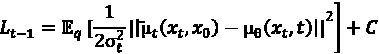

C 是一个常数，并且在最小化过程中消失。我们可以使用每步的平均方差来计算给定时间点的均值。设：

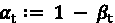

并且：

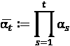

然后，在每个时间步，*x* 可以表示为：

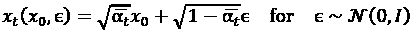

然后，我们将优化：

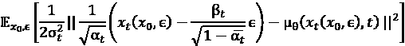

这个表达式展示了如何将预测 *x* 均值的函数表示为一个方程，其中未知数是预测噪声 *e* 作为 *t* 的函数：

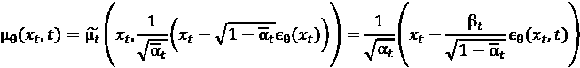

最终，这将导致我们得到以下表达式：

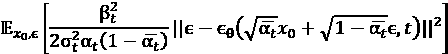

给定固定的值 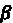，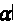 和 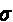，以及输入数据 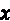，我们正在优化一个函数，用于预测我们在每一步反向过程 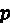 中应该减去的噪声，以便从一个随机噪声样本获得图像 。就像 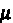 一样，那个 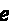 将是一个神经网络，这也是我们在 Stable Diffusion 模型中看到的实现方式。

对于前一页扩散方程中的项 L[o]（即 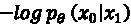），实际上，训练一个概率扩散函数时发现不需要它，因此它被去掉了。我们可以再做一次改进；如果样本已经具有较低的噪声（在我们进行了多步反向过程之后），我们可以在减去模型预测的噪声时对后续样本进行降权。我们通过将模拟步骤 t 显式地作为噪声预测神经网络 *e* 中的一项来做到这一点，并去掉乘法因子：

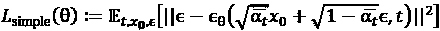

正如我们稍后所见，在每一步模拟中如何执行 e，以逐步去除随机图像中的噪声，是扩散模型中的一个重要设计选择，称为调度器（scheduler）。

然而，我们还有一个最后的挑战需要解决；我们可以高效地优化上面的似然函数，但实际生成步骤将是昂贵的，因为我们可能处理的是大图像，并且 *x* 的大小在整个模拟步骤中保持固定。这就是 Stable Diffusion 的作用：它利用我们在 *第十一章* 中看到的 VAE 模型，在一个比原始图像小得多的潜在空间中执行我们上面描述的正向和反向过程，这意味着它在训练和推理时速度更快。我们来看看。

## Stable Diffusion：在潜在空间中生成图像

正如我们所描述的，Stable Diffusion 模型的一个重要见解是，我们并不是通过变分推断在图像空间中执行前向过程*q*和反向过程*p*，而是使用 VAE 来压缩图像，这使得计算比在原始像素空间中执行的较慢扩散计算要快得多；这个过程在*图 15.2*中展示。

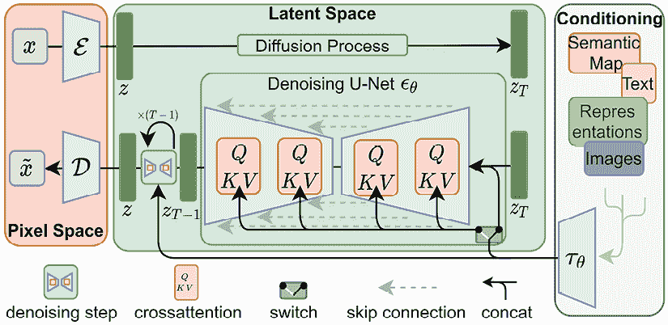

图 15.2：Stable Diffusion 模型⁵

让我们逐步了解一下这个工作流的一些要素。在最右侧，输入图像*x*通过 VAE 被“模糊化”为潜在向量*z*。因此，前向步骤*q*通过一次 VAE 的传递执行！接下来，我们可以通过最右侧的嵌入方法，结合“条件信息”（如用户的文本提示）。现在，为了执行“反向过程”*p*，我们运行一个随时间变化的 U-Net⁶来预测我们应该从每个时间步骤的随机图像中去除的噪声 e。U-Net（*图 15.2*）由多个变换器层组成，这些层将 VAE 生成的潜在向量 z（或随机采样的）压缩成更小的长度，再扩展它，以增强潜在向量的显著特征。名字中的“U”来自于这个事实：如果将各层按视觉方式排列，最大的最外层在顶部，最内层的最窄层在网络图的底部，它看起来像字母 U。由于这种架构，U-Net 非常适合提取图像中的特征/细节（通过前向编码路径），这些特征随后在像素级别进行标记/突出显示（通过反向解码路径将图像扩展到其原始尺寸）。在我们的示例中，我们使用潜在向量代替原始图像，每次通过 U-Net 传递潜在向量代表去噪过程的一个“步骤” 。你还会注意到，我们在这个 U-Net 中加入了残差连接，以便信息能高效地在网络中流动。然后，我们通过 VAE 反向解码“去噪”的潜在向量。

在该模型的训练阶段，我们将成对的图像和描述它们的提示输入模型，并优化上述的下界。如果我们不训练模型，则无需运行 VAE 前向传递来创建随机向量；我们只需对其进行采样。现在我们已经了解了 Stable Diffusion 的设置，以及它是如何从早期的图像生成思想演变而来的，让我们看看如何将其付诸实践。

# 在云端运行 Stable Diffusion

首先，让我们快速在 Python 代码中设置自己的 Stable Diffusion 模型实例并运行示例。为此，我们将使用 Google Colab（[`colab.research.google.com/`](https://colab.research.google.com/)），一个允许你利用来自笔记本的高性能**图形处理单元**（**GPU**）计算和大内存资源的云环境。Colab 是免费的，但如果需要，你也可以支付更高可用性的资源费用。该界面类似于你过去可能使用过的 Python Jupyter 笔记本（[`jupyter.org/`](https://jupyter.org/)）。

## 安装依赖并运行示例

设置好 Colab 帐户后，你只需安装 diffusers 包及其一些依赖项即可。Diffusers 是由 Hugging Face 公司创建的一个库（[`huggingface.co/docs/diffusers/index`](https://huggingface.co/docs/diffusers/index)），提供了对一组最先进的扩散模型（包括 Stable Diffusion）的简便访问。它利用 Hugging Face 开发的管道 API，该 API 将这些模型的许多复杂性抽象为一个简单的接口。*图 15.3* 展示了你在 Colab 笔记本中提供的安装 diffusers 及其依赖项的命令。

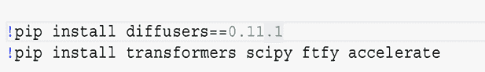

图 15.3：Diffusers 的依赖项

对于这个示例，你需要确保你的运行时启用了 GPU，这可以通过进入*运行时*，然后在笔记本顶部的功能区选择*更改运行时类型*来完成。

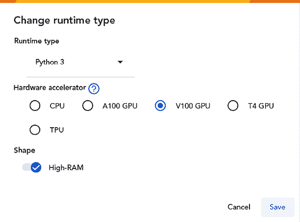

图 15.4：Diffusers 示例的运行时

从这里开始，我们将使用一系列简单的命令初始化 Stable Diffusion 1.4 模型。首先，我们加载模型，然后在运行时的 GPU 上初始化管道。接着，我们只需要向管道提供文本提示；模型将以交互方式运行，并且我们可以直接在笔记本中显示结果。

一开始，我们将使用 Stable Diffusion 论文中的一个示例。用户提示是“以毕加索风格的僵尸”，Stable Diffusion 模型将这个提示转换为一幅表现出僵尸怪物的图像，图像采用著名 20 世纪艺术家巴勃罗·毕加索的抽象立体主义风格：

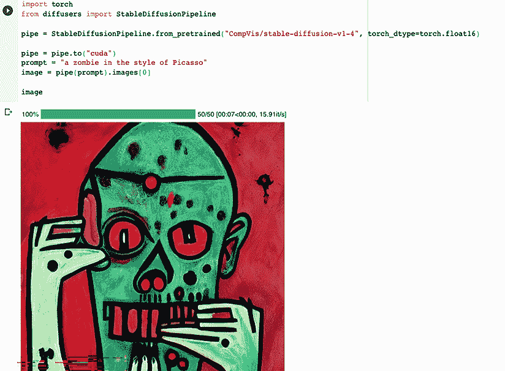

图 15.5：使用 Picasso 僵尸提示的示例输出

然而，请记住，这并不是像典型机器学习预测那样的确定性输出，即对于给定输入我们会得到相同的输出。相反，我们是从可能的模型输出中进行采样，因此我们不限于生成单一的输出。事实上，如果我们修改`num_images_per_prompt`参数，我们可以通过打印 `images` 列表的每个元素，生成一组来自相同提示的图像。

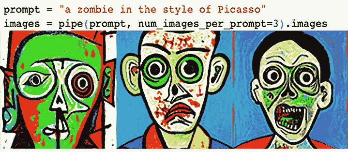

图 15.6：从僵尸提示生成替代图像

现在我们已经看了一个基本示例，让我们修改一些参数，看看它们如何影响输出。

## 稳定扩散文本到图像生成的关键参数

除了生成多张图像，我们还可以在这个示例中修改哪些其他参数？其中一个是去除提示词（提供空白提示），看看我们会得到什么输出：

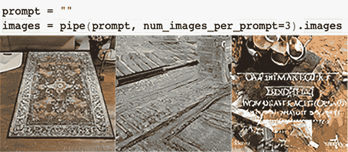

图 15.7：使用空白提示运行稳定扩散模型

有趣的是，正如在*图 15.7*中所见，结果是一组看似随机的图像，但不是空白图像或完全随机的噪声。这可以通过管道中的一个组件——我们在*第十一章*中讲过的 VAE，以及用于开发它的数据来解释，正如我们将在本章后面看到的那样。

我们还可以通过修改在生成图像时给提示词的重要性，使用*引导尺度*参数。如我们在概述稳定扩散模型时所见，我们可以将图像生成步骤看作是将图像中的像素建模为在多维空间中漂移的粒子。这些粒子的运动可以根据用户输入的提示词朝特定方向推动，或者根据其初始配置随机移动。引导尺度的默认值为 7.5——让我们看看将其改为 0 到 10 之间的其他值会发生什么：

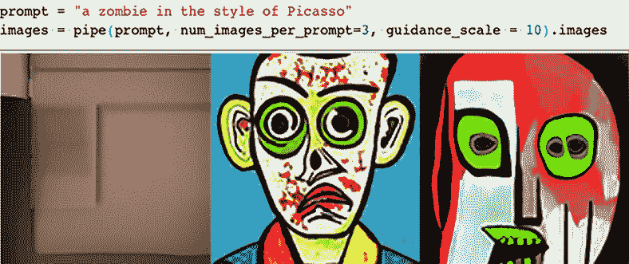

图 15.8：将引导尺度从 0 修改为 10

你可以看到，随着引导尺度从 0 增加到 10，生成的图像越来越明显地与提示词相符。在 0 的图像看起来非常像*图 15.6*中的空白提示示例——事实上，在这个设置下，模型使用的是空白输入。在 0 时，模型不会关注提示词，正如我们将在本章后面看到的那样。

当使用更复杂的提示时，这个参数的影响可能更为显著，正如我们在上一章中使用的提示：

> 一只以莫奈风格绘制的僵尸。僵尸穿着农民服装，手持画笔和画布。太阳正在落山，远处有群山。僵尸站立的田地里的干草高到它的腰部。田野中有红色的花朵。

*图 15.9* 显示了应用引导尺度从 0 到 10 的比较；你可以在最终的图像中看到僵尸形象开始显现。

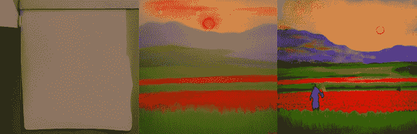

图 15.9：使用引导尺度 0、7.5 和 10，通过复杂提示生成的图像

除了引导尺度外，图像生成过程中扩散步骤的数量也会影响输出的清晰度。正如我们所看到的，模型生成的图像可以通过像粒子在空间中移动的像素来表示。它们能够移动的时间越长，它们就能从初始的随机排列过渡到一个新的配置，最终形成一幅类似图像的效果。该管道中的默认设置为 50 步：让我们看看如果我们将其修改为 `1`、`3` 和 `10` 时会发生什么，如*图 15.10*所示：

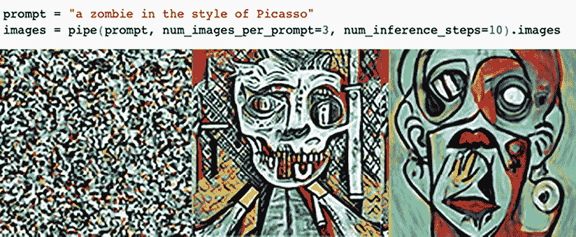

图 15.10：通过 1、3 和 10 步模拟生成的图像

随着模拟步骤数量的增加，生成的图像从模糊变得越来越像我们的初始示例——在 3 步时，我们看到的输出与提示相似，但没有简化的立体派线条，随着更多模拟步骤的进行，这些线条变得更加清晰。稍后在本章中，我们将看到每个模拟如何尝试从图像中减去“噪声”，从而使图像随着更多步骤的进行变得更加清晰。

我们修改输入的另一种方式是通过引入“负面”提示，这会取消初始提示的一部分。让我们通过在*图 15.11*中提供 `zombie`、`Picasso` 或 `Cubist` 作为负面提示来看一下这如何起作用：

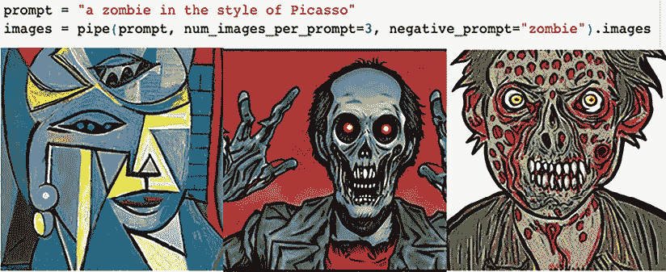

图 15.11：通过负面提示生成的图像

你可以看到，如果我们提供提示词的元素（`zombie` 或 `Picasso`），我们可以取消图像的主题或风格。我们甚至不需要使用精确的词语；正如你所看到的，使用 `Cubist`（一个与毕加索艺术风格紧密相关的术语）生成的结果与使用艺术家名字明确作为负面提示的输出非常相似。这是因为当提示词被传递给模型时，它们被编码为数值向量，从而使得模型能够比较词语之间的相似性，正如我们稍后在讨论嵌入步骤时会看到的那样。

除了修改图像的内容外，我们还可以轻松改变其大小，正如你在*图 15.12*中看到的那样。

图 15.12：生成具有不同尺寸的图像

通过修改管道最后步骤中最终解码层的大小，可以轻松改变生成图像的尺寸，稍后我们将看到这一点。

在应用中生成图像的风险之一是输出可能会冒犯他人；幸运的是，这个示例中的管道具有内建的安全检查器，能够筛查此类潜在的不当内容。我们可以通过修改提示来看出这个效果（*图 15.13*）：

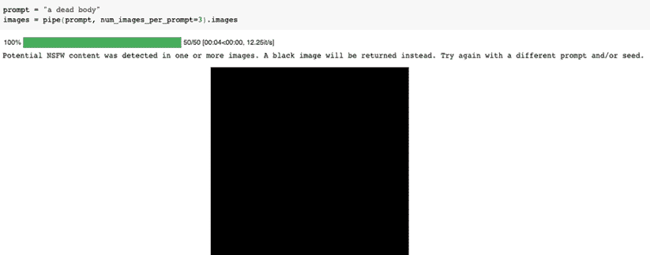

图 15.13：通过有毒/冒犯性提示生成的图像

安全检查器是一个模型，它将生成的图像特征分类为**不适宜工作**（**NSFW**）并加以阻止。它用于进行这种分类的特征与用来将提示词输入模型以生成图像的嵌入特征非常相似。

现在我们已经看到许多可以通过各种参数调整模型输出的方法，让我们一步步探索这些参数是如何出现在流水线的每个组件中的。

# 深入探讨文本到图像的流水线

在上一节中，我们通过直接向流水线提供提示词和各种参数生成了所有示例。流水线由几个按顺序执行的组件组成，这些组件从提示词中生成图像。这些组件包含在`Pipeline`类的 Python 字典中，因此，像任何 Python 字典一样，你可以打印字段的键名称来检查组件（*图 15.14*）。

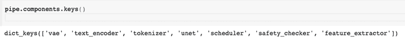

图 15.14：稳定扩散流水线的组件

我们在之前的示例中已经看到过这些组件的实际应用，随着我们逐步执行每个组件，相关细节将变得更加清晰：

+   分词器将我们的提示词转换为字节表示

+   文本编码器将字节表示转换为数值向量

+   U-Net，它接受一个随机数向量和编码后的提示词，并将其合并

+   调度器，运行扩散步骤以对合并后的向量进行“去噪”

+   VAE（变分自编码器），它将合并后的向量转换为一个或多个生成的图像

+   特征提取器，它从生成的图像中提取可能被标记为不适宜的元素

+   安全检查器，它对提取的元素进行评分，以判断图像是否可能被审查

让我们逐步解析每个组件，看看我们之前提到的参数如何在执行过程中发挥作用。

## 分词器

该流水线的第一步是将提示词转换为一组*token*，或者是传递给文本嵌入步骤的单个元素。你可以通过在笔记本中打印该流水线组件来访问分词器的很多信息：

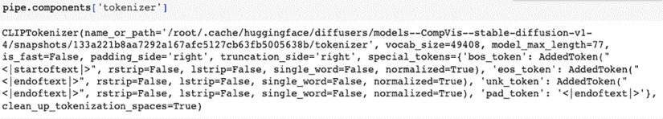

图 15.15：分词器属性

稳定扩散使用**对比语言图像处理**（**CLIP**）模型来计算嵌入，该模型在图像及其描述的联合数据集上进行训练²。标记器提供了原始输入，用以计算在图像生成过程中使用的文本向量。你可能曾在过去的自然语言处理中的独热编码中遇到过标记化，在这种方法中，一个单词（或字符）通过一个数字进行索引（例如，英文字母的每个字母可以通过数字 0 到 25 来索引）。稳定扩散和类似的最先进模型使用比简单将每个单词映射到一个索引更高效的嵌入方式——它们将文本映射为字节（使用如 UTF-8 等编码），并将常见的字节对表示为一个字节，这种技术称为**字节对编码**（**BPE**）⁸。

BPE 的基本思想是，通过寻找常见的重复模式来压缩字符串。我们来举个例子：

abcabcabde

在第一次处理时，我们注意到最常出现的字符对是*ab*；我们可以将其转换为一个新字符，*f*：

fcfcfde

现在，*fc*是最常出现的字符对。将其转换为*g*：

ggfde

最后，将*gg*转换为*h*：

hfde

我们现在将输入字符串从 10 个字符压缩成了 4 个字符，这在计算上更为高效。如果我们需要恢复原始字符串，只需存储一个包含字符对及其对应字符的查找表，便可逆转此操作，我们可以递归地执行这一操作。

另一个细节是，尽管这个示例使用了字符，但实际上我们使用的是字节。这是因为像表情符号这样的特殊字符会破坏固定词汇表字符对压缩器，因为这些特殊字符可能不在查找表中，而所有文本都可以统一表示为字节，这使得它更加健壮。

总结一下，标记器将提示中的单词转换为字节，并使用预先计算好的常见字节对查找表，将这些字节索引为一组 ID。你可以通过运行标记器处理输入提示来看到这一过程，正如在*图 15.16*中所示：

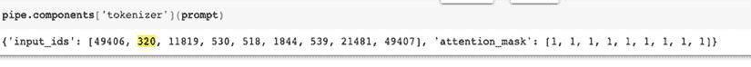

图 15.16：将提示转换为字节令牌 ID

你可以通过`encoder`属性访问稳定扩散编码器使用的编码映射，并验证“320”对应字母“a”和空格的字节对。同样，“49406”是一个占位符字符，表示句子的开始。

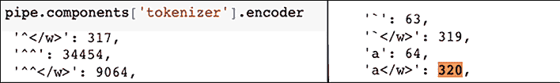

图 15.17：标记器编码映射

## 生成文本嵌入

流水线的下一步是将字节索引的提示转换为数值向量，这些向量可作为模型生成图像步骤的输入。这一嵌入操作由 CLIP 神经网络执行，你可以在笔记本中检查其属性，正如在*图 15.18*中所示：

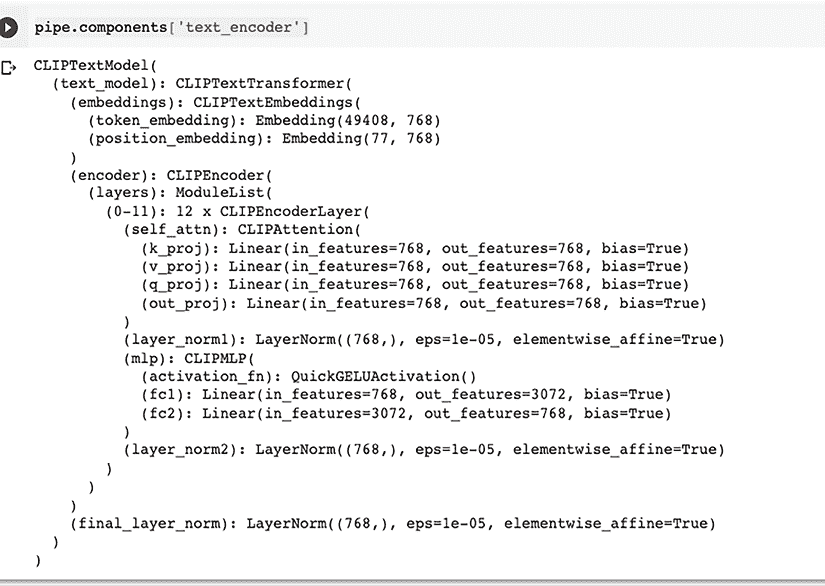

图 15.18：嵌入模型

与查找表形式的分词器不同，这个组件是一个神经网络，它生成大小为 768 的嵌入向量。你可以看到，这个网络的层次是由 12 个 transformer 模块堆叠而成，最后是一层归一化层。

如果我们在前一步的输出上执行此模型（将其转换为张量，这是嵌入模型所需的输入类型，并通过`to`命令发送到 GPU），我们将得到一个大小为 768 的输出（每个令牌对应一个值），表示嵌入的提示：

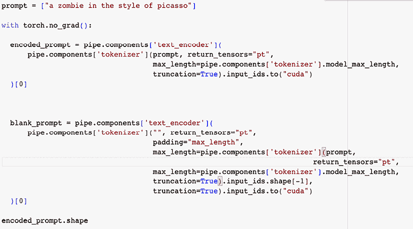

图 15.19：从提示生成嵌入

让我们剖析*图 15.19*中代码块发生的事情。提示（`"a zombie in the style of Picasso"`）首先传递到管道中的分词器，最大长度为 77（可嵌入令牌的最大数量）。正如我们上面所看到的，这个函数将返回一个字节对编码的提示表示。这些令牌然后被映射到一个长度为 768 的数值向量，你可以通过检查模型输出的形状来验证这一点。

除了将提示本身编码为数值向量外，我们还会编码一个空白提示（“”）。这是因为当我们稍后将嵌入的提示传递到图像生成步骤时，我们希望控制在生成图像时分配给提示的权重（使用我们稍后会看到的*引导尺度*参数）。为了提供一个参考，我们还需要提供一个没有任何提示的嵌入，这两者之间的差异将为图像生成模型提供信息，告诉模型在每个步骤中如何修改生成的图像。

## 使用 VAE 解码器生成潜在图像

为了根据你的提示创建图像，Stable Diffusion 从一组服从正态分布的随机数矩阵开始。这是因为，正如我们之前提到的，该模型是通过 VAE 生成的随机向量（*潜在*向量）开发的，VAE 在我们在*第十一章*中看到过，它由一个*编码器*和一个*解码器*组成。作为提醒，编码器是一个神经网络，它将图像作为输入，并输出生成一个（通常是低维的）随机数向量或矩阵。这个随机数矩阵就像图像的“条形码”，它允许将重要信息压缩到一个低维空间，从而减少计算机上的内存占用——这些向量比原始图像要小，这是使 Stable Diffusion 算法能够如此有效的关键优化之一。解码器是第二个神经网络，用来逆转这一压缩过程，将一组随机数转回为图像。

为了理解这个过程，你可以将一张图像输入到 Stable Diffusion 流水线中的 `vae` 组件，如*图 15.20*所示。首先，你需要使用 `torchvision to_tensor` 函数将输入图像转换为张量，然后通过编码器将其传递，生成一个 4 x 64 x 64 的输出——`half()` 命令是将输入转换为 float16。在这个例子中，你可以看到我们已经将一张 512 x 512 的 RGB 图像压缩成了一个 4 x 64 x 64 的向量。

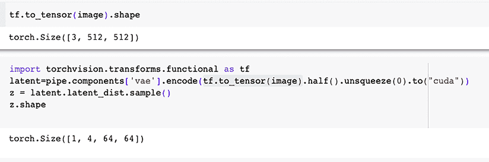

图 15.20：使用 VAE 生成潜在向量

现在，你可以运行解码器来验证是否能将这个潜在向量转换回图像（这是你稍后会看到的 Stable Diffusion 算法的最后一步），如*图 15.21*所示。

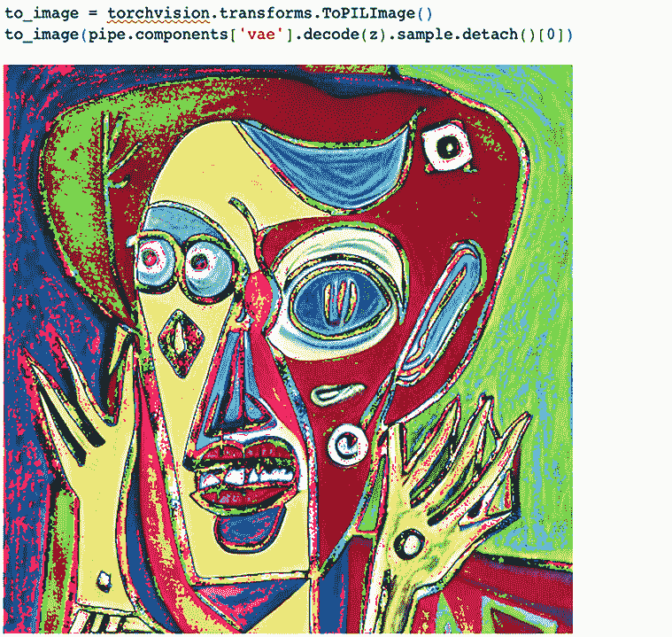

图 15.21：解码潜在向量

现在我们已经能够从潜在向量生成样本并编码我们的提示，准备好使用 U-Net 来生成图像，这是 Stable Diffusion 流水线中的最终网络。

## U-Net

Stable Diffusion 流水线的最后一个元素是 U-Net，它接受编码的提示和一个与 VAE 编码图像形状相同的随机噪声向量（*图 15.2*）。U-Net 类似于 VAE，通过一组神经网络层执行编码操作，然后将该输出解码成一个与随机输入相同大小的向量。每次我们将潜在向量通过 U-Net 时，我们都在预测在最后一步需要从潜在向量中减去多少噪声，*e*。多次运行这个操作构成了 Stable Diffusion 模型的“反向”过程。

由于没有原始图像——我们提供了一个随机向量——编码的提示为模型提供了生成图像的上下文。

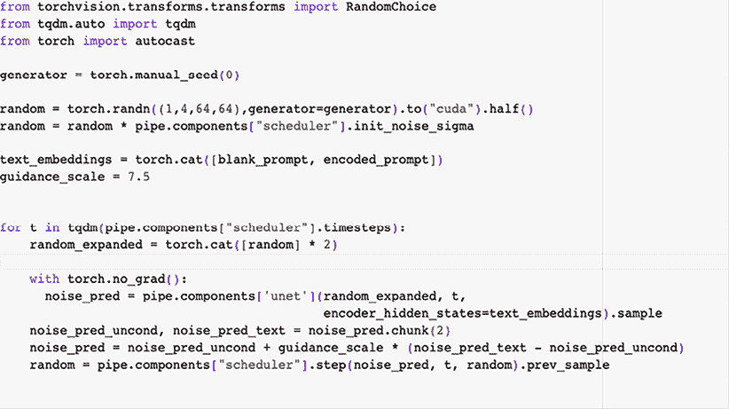

图 15.22：U-Net 图像生成过程

让我们一步步走过生成图像的过程。我们的第一步是使用 `torch.randn` 生成一个与 VAE 输出相同维度的随机输入。我们设置一个固定种子（手动种子），这样每次调用代码时都能生成相同的随机向量——这将方便我们进行调试。

执行扩散过程——将随机向量转换为生成图像——的管道组件被称为*调度器*。它指定了运行此扩散过程所需的时间步数，以及每个时间步的属性。对于我们使用的稳定扩散管道，默认的调度器是*PNDMScheduler*⁹。它指定了一组微分方程，用于更新每步模拟中的噪声预测；噪声的量由一个参数（`init_noise_sigma`）来确定，用于缩放我们的简单随机输入。有些调度器会在每个模拟步骤中应用不同的缩放/噪声，但 PNDM 调度器不会，因此我们不需要在每步调用调度器的`scale_model_input`函数。

你会注意到，我们还将空白嵌入和提示拼接在一起；这种方法比顺序处理并比较输出更高效，并且允许我们并行执行这些计算。最后，我们设置了*指导尺度*参数，默认值为 7.5。较小的值会减少输入提示的重要性，从而生成的图像与提示的相似度较低。较大的值则会更加重视提示。

在每一步的扩散过程中，我们都会复制潜在向量，以便将其与空白嵌入和提示进行比较。然后，我们将文本嵌入和潜在图像向量传递给 U-Net，U-Net 返回一个没有噪声的潜在向量预测。我们将该输出分成两部分：一部分是使用嵌入的提示条件化的输出，另一部分接收空白嵌入。

然后，我们在扩散过程的每一步创建最终的 U-Net 输出`noise_pred`，方法是将提示条件化输出和无条件输出之间的加权差异相加，这个差异的权重由`guidance_scale`提供。接着，我们运行调度器扩散方程，以生成下一轮输入。

经过多轮（这里是 50 轮）将随机向量通过 U-Net，我们使用 VAE 进行解码以获得最终输出。*图 15.23*中的代码展示了这一过程是如何发生的。

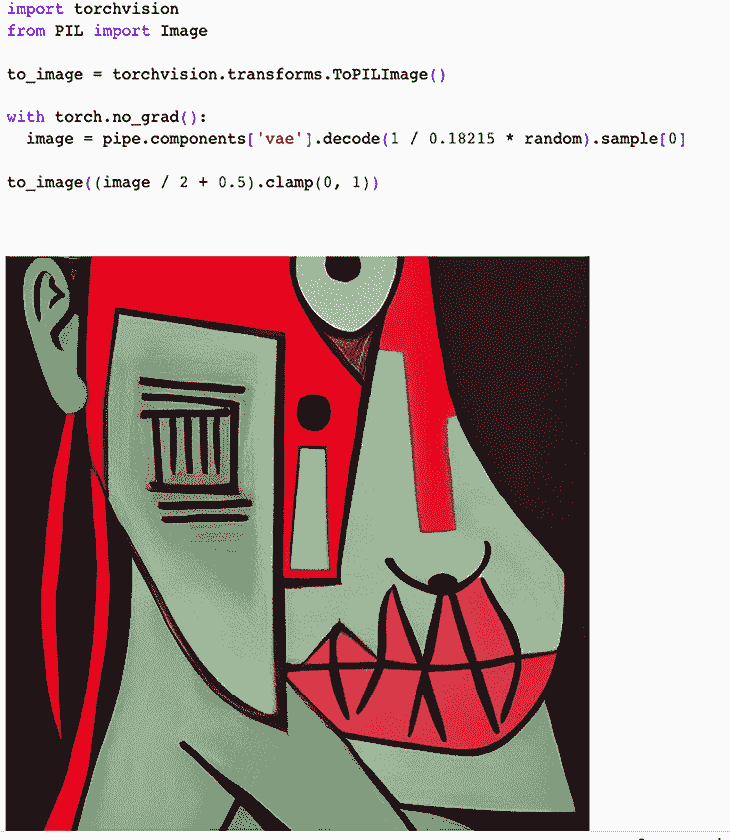

图 15.23：使用 VAE 解码 U-Net 输出

我们需要通过除以在调度器开始时应用的*随机*变量（`init_sigma_noise`），以撤销我们在调度器开始时进行的噪声缩放操作。然后，使用 VAE 的解码器臂从潜在向量中获取图像。我们重新调整输出的中心位置，并将其绑定在 0 和 1 之间，以确保颜色在笔记本中正确显示。

# 总结

在本章中，我们探讨了稳定扩散算法是如何开发的，以及它是如何通过 Hugging Face pipeline API 实现的。在这个过程中，我们看到扩散模型是如何通过建模自然像素的分布来解决自回归变换器和 GAN 模型的概念性问题的。我们还看到，这一生成性扩散过程可以被表示为一个可逆的马尔可夫过程，以及我们如何通过变分界限训练扩散模型的参数，这与 VAE 类似。

此外，我们还看到，在稳定扩散模型中，通过在潜在空间中执行正向和反向过程，扩散模型的效率得到了提高。我们还说明了如何将自然语言用户提示表示为字节编码，并将其转换为数值向量。最后，我们探讨了 VAE 在生成压缩图像向量中的作用，以及稳定扩散的 U-Net 如何使用嵌入的用户提示和随机数向量，通过预测每一步反向过程中应去除的噪声量来生成图像。

# 参考文献

1.  Ramesh, Aditya 等人. “*零-shot 文本到图像生成.*” *ArXiv* abs/2102.12092 (2021).

1.  Brock, Andrew; Donahue, Jeff; 和 Simonyan, Karen. “*大规模 GAN 训练用于高保真自然图像合成.*” *arXiv 预印本 arXiv:1809.11096* (2018).

1.  Sohl-Dickstein, Jascha; Weiss, Eric; Maheswaranathan, Niru; 和 Ganguli, Surya (2015-06-01). `"深度无监督学习与非平衡热力学"`（PDF）。*第 32 届国际机器学习大会论文集*。37\. PMLR: 2256–2265.

1.  Ho, Jonathan; Jain, Ajay; 和 Abbeel, Pieter. “*去噪扩散概率模型.*” *神经信息处理系统进展* 33 (2020): 6840-6851.

1.  Rombach, Robin 等人. “*基于潜在扩散模型的高分辨率图像合成.*” *2022 IEEE/CVF 计算机视觉与模式识别会议（CVPR）* (2021): 10674-10685.

1.  Ronneberger, Olaf; Fischer, Philipp; 和 Brox, Thomas. Unet: 用于生物医学图像分割的卷积网络. 在 MICCAI (3) 中，计算机科学讲义第 9351 卷，页 234–241\. Springer，2015。

1.  Radford, Alec 等人. “*从自然语言监督中学习可迁移的视觉模型.*” *国际机器学习大会*。PmLR，2021。

1.  [`www.pennelynn.com/Documents/CUJ/HTML/94HTML/19940045.HTM`](http://www.pennelynn.com/Documents/CUJ/HTML/94HTML/19940045.HTM)

1.  [`arxiv.org/pdf/2202.09778.pdf`](https://arxiv.org/pdf/2202.09778.pdf) Liu, Luping 等人. “*流形上的扩散模型伪数值方法.*” *arXiv 预印本 arXiv:2202.09778* (2022).

# 加入我们在 Discord 和 Reddit 上的社区

对本书有疑问或想参与生成式 AI 和 LLM 的讨论？加入我们的 Discord 服务器 [`packt.link/I1tSU`](https://packt.link/I1tSU) 和 Reddit 频道 [`packt.link/rmYYs`](https://packt.link/rmYYs)，与志同道合的 AI 专业人士连接、分享和合作。

| **Discord 二维码** | **Reddit 二维码** |
| --- | --- |
| 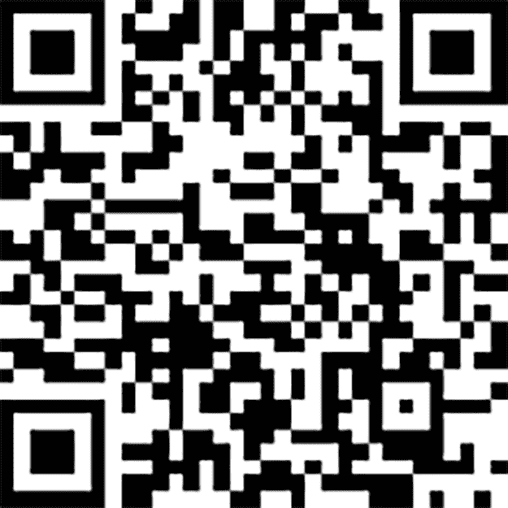 |  |

[www.packtpub.com](https://www.packtpub.com)

订阅我们的在线数字图书馆，完全访问超过 7,000 本书籍和视频，以及行业领先的工具，帮助你规划个人发展并推进职业生涯。更多信息，请访问我们的网站。

# 为什么要订阅？

+   通过来自 4000 多名行业专家的实用电子书和视频，减少学习时间，增加编码时间

+   通过为你量身定制的技能计划提高学习效果

+   每月获得一本免费的电子书或视频

+   完全可搜索，轻松访问重要信息

+   复制粘贴、打印和书签内容

在 [www.packt.com](https://www.packt.com)，你还可以阅读一系列免费的技术文章，注册各种免费的新闻通讯，并获得 Packt 书籍和电子书的独家折扣和优惠。

# 你可能会喜欢的其他书籍

如果你喜欢这本书，可能会对 Packt 的其他书籍感兴趣：

**LLM 工程师手册**

Paul Iusztin，Maxime Labonne

ISBN: 978-1-83620-007-9

+   实施强大的数据管道并管理 LLM 训练周期

+   创建你自己的 LLM，并通过实际案例的帮助来优化它

+   通过深入了解核心 MLOps 原则（如协调器和提示监控）开始学习 LLMOps

+   执行监督式微调和 LLM 评估

+   使用 AWS 和其他工具部署端到端的 LLM 解决方案

+   设计可扩展和模块化的 LLM 系统

+   通过构建特性和推理管道来了解 RAG 应用

**通过 Amazon Bedrock 生成式 AI**

Shikhar Kwatra，Bunny Kaushik

ISBN: 978-1-80324-728-1

+   探索 Amazon Bedrock 中的生成式 AI 领域和基础模型

+   微调生成式模型以提高其性能

+   探索不同商业用例的多个架构模式

+   获取有关道德 AI 实践、模型治理和风险缓解策略的见解

+   增强你使用代理开发智能和协调任务的技能

+   监控和理解 Amazon Bedrock 模型响应的指标

+   探索各种工业用例和架构，利用 RAG 解决现实世界的商业问题

+   紧跟架构最佳实践和行业标准

# Packt 正在寻找像你这样的作者

如果你有兴趣成为 Packt 的作者，请访问 [authors.packtpub.com](https://authors.packtpub.com) 并今天就申请。我们已经与成千上万的开发者和技术专业人士合作，像你一样，帮助他们与全球技术社区分享他们的见解。你可以提交一般申请，申请我们正在招聘作者的特定热门话题，或者提交你自己的创意。

# 分享你的想法

现在你已经完成了 *《Python 和 PyTorch 的生成式 AI》*（*第二版*），我们很想听听你的想法！如果你是从 Amazon 购买的本书，请 [点击这里直接进入 Amazon 书评页面](https://packt.link/r/1835884458)，分享你的反馈或在你购买的站点上留下评论。

你的评论对我们和技术社区来说非常重要，将帮助我们确保提供卓越的内容质量。
