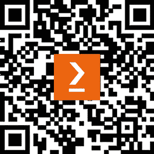

# 索引

符号

3D 可变模型 358

68 点坐标系统（68 点系统）360

A

自适应梯度（AdaGrad）54

自适应动量估计（ADAM）54

加性 PEFT 233

提示调优技术 233, 234

高级提示技术

思维链 183

ReAct 185, 186

自一致性 186

思维树 184

对抗损失 337

对抗性提示 188

防御机制 190

越狱 189

提示注入与泄露 189, 190

人工智能寒冬 32

AlexNet

架构 47, 48

其他 CNN 创新 45, 46

人工通用智能（AGI）257

注意力机制 94-96

自编码器 263

B

反向传播

实现 36-39

限制 40-42

时间反向传播（BPTT）50, 75

词袋模型（BoW）64

度量定义 65, 66

词汇定义 65

批量推理 237

贝叶斯定理 8, 9

波束搜索 80, 81

伯努利 MLP 层

创建 276, 277

双向 LSTM 85-87

瓶颈特征 326

字节对编码（BPE）397

C

因果卷积 89

思维链提示 183

字符级语言模型 75-79

聊天界面

添加 204-206

CIFAR-10 数据集

导入 273-275

复杂应用，使用 LangGraph

聊天界面，添加 204-206

创建 203

人类中断，添加 210, 212

内存线程，添加 209

搜索功能，添加 212-214

向量存储，添加用于 RAG206-209

条件 GAN（C-GANs）307-311

上下文表示 72, 73

连续词袋（CBOW）模型 67, 68, 69

对比散度（CD）267

对比语言图像处理（CLIP）397

卷积核 43

卷积神经网络（CNNs）43, 44

卷积和文本 87, 88, 89

跨领域提示 186-188

循环一致性 336

CycleGAN335

对抗损失 337, 338

循环损失 338

判别器设置 341

GAN 设置 342

生成器设置 340, 341

身份损失 338, 339

总体损失 339

设置 336, 337

训练循环 342-346

循环损失 338

D

仅解码器架构 103

解码策略 79

动作 83-85

启发式搜索 80, 81

贪心解码 79

采样 81、82

深度卷积 GANs 305-307

DeepFaceLab

URL 376

Deepfakes 350

挑战 373

生成内容 353

现成实现 375

概述 351、352

来源 353

目标 353

技术挑战 374

深度学习 11

稠密表示 67

上下文表示 72、73

FastText 71

GloVe 71

Word2vec 67

判别建模 8

判别模型 5、295、296

与生成模型 2、3 的对比

DistilBERT 104、105

最佳实践 106-110

Dlib

用于面部关键点检测 360-362

Dolly 161、162

配音方法 355

E

来自语言模型的嵌入（ELMo）72

编码器-解码器架构 103、104

仅编码器架构 102

证据下界（ELBO）268

F

面部识别 363

FaceSwap

URL 375

FaceSwap-GAN

URL 376

面部动作编码系统（FACS）357、358

面部关键点 359

使用 Dlib 进行检测 360、362

使用 MTCNN 进行检测 362

使用 OpenCV 进行检测 359

FakeApp 374

Falcon 163

FastText 71

少量样本 117

可编程门阵列（FPGAs）25

微调优化

优化 232

参数高效微调 233

Flickr-Faces-HQ（FFHQ）数据集 293

G

GAN 挑战

模式崩溃 317, 318

训练不稳定性 317

无信息损失与评估指标 319

高斯混合模型 10

高斯 MLP 层

创建 277-279

通用图图机器学习（ggML）239

生成对抗网络（GANs）288, 294, 351, 382

挑战 317

判别器模型 295, 296

生成器模型 296

最大似然游戏 299

非饱和生成器成本 298

训练 297, 298

生成建模 293

生成模型 10

挑战 18

数据增强 13

示例 9

假新闻与聊天机器人 16

图像，生成 11, 12

实现 4, 5

风格迁移与图像转换 13-16

生成器模型 296

GloVe 71

Google Colab

参考链接 388

GPT-2 模型 112

最佳实践 112-116

GPT-3 模型 116-119

少量样本学习 117

一次性学习 117

零样本学习 117

GPT 文本生成 110

生成预训练 111

GPT-2 模型 112

GPT-3 模型 116-119

图形处理单元（GPU） 25, 388

贪婪解码 79

Grok-1 163

H

高级工作流 363, 364

Hugging Face

参考链接 388

Hugging Face 管道模块

用于探索 LLaMA 8B 模型 152-158

人工中断

添加 210-212

I

身份损失 338, 339

图像生成

扩散模型 382

扩散，用于建模自然图像变异性 382, 383

变分推理，用于生成高质量的扩散模型 384-386

图像

可分编码，创建 262-266

改进的 GANs 304

条件 GANs 307, 308, 310

深度卷积 GANs 305, 307

渐进式 GANs 311

独立同分布（IID） 73

推理时间改进 237

批量推理 237

KV 缓存 238

卸载 237

分片 237

实例归一化 340

InstructGPT 126, 145

指令微调 127

数据集准备 128, 129

问题陈述 128

结果，分析 131, 133

训练设置 130, 131

可解释性 67

逆自回归流（IAF） 271-273

J

越狱 189

K

Kullback-Leibler (KL) 散度 268

KV 缓存 238

L

LangChain 生态系统 194, 195

LangSmith

LLM 结果，日志记录到 201-203

语言模型 74, 75

大型语言模型（LLMs）123, 145

潜在狄利克雷分配（LDA）10

LLaMA 8B 模型

探索，Hugging Face 管道模块 152-158

LLaMA 模型 150, 151

关键架构特征 150

LLM 应用

构建 195-197

链接，创建 197-199

创建 199, 200

结果，日志记录到 LangSmith 201-203

LLM 参数

完成标记 175

安全防护/守卫 175

温度 174

LLM 的应用 252

AI 代理 256, 257

幻觉，检测 252-254

多模态模型 254, 255

对数方差 284

长短期记忆（LSTMs）50, 51

参考链接 74

LSTM 卷积用于文本 85

用于文本的 LSTM 变体 85

M

内存线程

添加 209

Metal 性能着色器（MPS） 239

Midjourney 1, 2

Mixtral 159, 161

专家混合（MoE） 160

模式崩溃 318

模型开发进展 246

改进的强化学习 248, 249

改进的文本生成 246, 247

模型蒸馏 250，251

操作模式

3D 可变形模型 358

编辑 356，357

面部动作编码系统（FACS）357，358

关键特征集 357

概述 353

重演 355

替代 354

多层感知机（MLP）32

以及反向传播 32-35

多任务级联卷积网络（MTCNN）362

用于面部关键点检测 362

N

朴素贝叶斯分类器 10

自然语言处理（NLP）63

网络

创建 276

AlexNet 45-47

卷积架构 42，43

早期 CNN 43，44

用于顺序数据 49

各种类型 42

用于顺序数据的网络

LSTMs 49-51

RNNs 49-51

神经机器翻译（NMT）94

神经处理单元（NPUs）239

NLP 任务 102

仅解码器架构 103

编码器-解码器架构 103，104

仅编码器架构 102

不适合工作（NSFW）396

O

卸载 237

一次性 117

OpenCV

用于面部关键点检测 359

优化

微调优化 232

需求 218-222

优化过程 52

优化器

构建 52

梯度下降到 ADAM 53-55

Xavier 初始化 56

总体损失 339

P

成对风格迁移 325

参数高效微调

加性 PEFT 233

重参数化 PEFT 235-237

参数化泄漏 ReLU(PReLU) 45

PatchGAN 判别器 330-333, 347

感知机 25

迁移，从 TLUs 到调优 30-32

组织，迁移到 TLUs 25-29

Pix2Pix 325

数据集准备 365, 366

Pix2Pix GAN，设置和训练 366, 367, 369

结果与局限性 369, 372, 373

用于重现 365

Pix2Pix-GAN

损失 333

配对风格迁移 324

PatchGAN 判别器 330-333

训练 333, 335

U-Net 生成器 325-330

PNDMScheduler 404

预训练优化 222

架构改进 223

数据效率 222, 223

主成分分析(PCA) 263

概率密度函数(pdf) 283

概率规则 6-8

渐进式 GAN 311

均衡学习率 314

小批量标准差 313

概述 311, 312

像素级标准化 314

渐进增长-平滑淡入 312, 313

PyTorch GAN 动植物园实现 314-316

提示 170

提示设计基础 171, 172

上下文预处理 174

LLM 参数 174, 175

提示模板 173, 174

系统指令 172, 173

提示工程 170, 171

挑战与局限性 191

提示设计基础 171, 172

策略 175-181

提示工程工作流

评估 172

任务 172

提示技术 181

高级 183, 184

特定任务 181, 183

提示泄漏 190

近端策略优化 (PPO) 136

PyTorch 4

R

ReAct 185, 186

循环神经网络 (RNNs) 49-51, 73

强化学习与人类反馈 (RLHF) 134-137

重参数化 PEFT 235

重参数化技巧 270, 271

受限玻尔兹曼机 (RBM) 262

检索增强生成 (RAG) 174, 194

向量存储，添加 206-209

反向模式自动微分 37

RLHF，配合 PPO 137

数据集准备 137-139

PPO 设置 139

问题陈述 137

奖励模型 140

训练循环，准备 141

训练结果，分析 142-145

S

采样 81, 82

温度 82

top-k 采样 83

调度器 404

搜索功能

添加 212-214

二阶 55

自注意力 52, 96

分片 237

skip-gram 模型 69-71

滑动窗口 74

小型语言模型（SLMs） 239

稳定扩散模型

依赖关系，安装 388

图像，在潜在空间中生成 386, 388

文本到图像生成的参数 391-396

运行，示例 388, 390

运行，云端 388

子网络

在 VAE 中结合 279-283

T

特定任务提示技术

分类 181

提取 181

推理 182

摘要 181

技术挑战，Deepfakes

泛化 374

遮挡 375

时间性问题 375

张量处理单元（TPUs） 25

文本生成 73

字符级语言模型 75-79

解码策略 79

语言模型 74, 75

文本表示 64

稠密表示 67

稀疏表示 64

文本到图像管道 396

潜在图像，使用 VAE 解码器生成 401, 402

文本嵌入，生成 399, 400

分词器 397, 398

U-Net 403-406

阈值逻辑单元（TLU） 26

top-k 采样 83

转换器架构 97, 98, 102, 124

解码器模型 125

嵌入层 124

编码器模型 125

前馈层 124

微调 125

层归一化 124

多头自注意力 99, 100, 124

位置编码 101, 124

预训练 125

转换器 51, 124

思维树提示 184

趋势与研究领域

交替架构 238

小型基础模型 239

专用硬件和框架 239

U

U-Net 403, 404, 406

U-Net 生成器 325-327, 330

更新的训练设置 125, 126

V

VAE 解码器

潜在图像，生成使用 401, 402

普通 GAN 300-304

消失梯度 40

变分自编码器 (VAEs) 381

子网络，合并于 279-290

变分下界 268

变分目标 266-270

W

温格特磁带 19 38

Word2vec 67

连续词袋模型 (CBOW) 67-69

跳字模型 69-71

Z

零样本 117

零和博弈 297

# 下载本书的免费 PDF 副本

感谢购买本书！

你喜欢在旅途中阅读但又无法携带纸质书籍吗？

你的电子书购买是否与所选设备不兼容？

不用担心，现在每本 Packt 书籍，你都可以免费获得该书的无 DRM PDF 版本。

在任何地方、任何设备上随时阅读。从你最喜爱的技术书籍中搜索、复制并粘贴代码，直接应用到你的项目中。

优惠不仅仅到此为止，你还可以获得独家折扣、时事通讯以及每日送达的精彩免费内容。

按照以下简单步骤即可获得福利：

1.  扫描二维码或访问以下链接：

[`packt.link/free-ebook/9781835884447`](https://packt.link/free-ebook/9781835884447)

1.  提交购买证明。

1.  就是这么简单！我们会直接将你的免费 PDF 和其他福利发送到你的邮箱。
