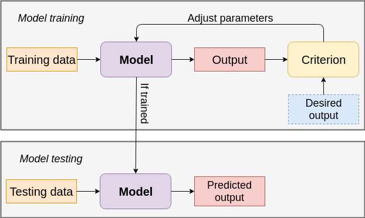
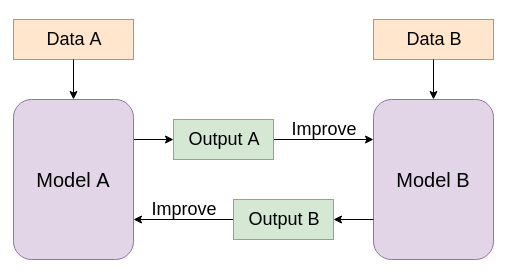
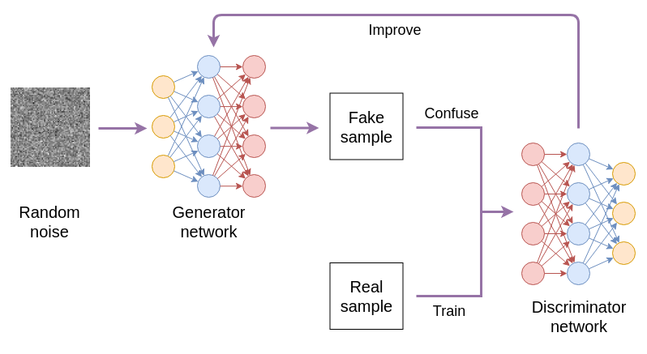
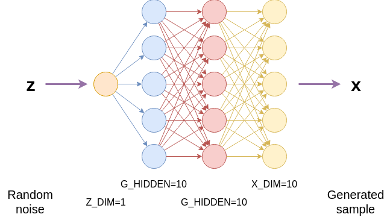
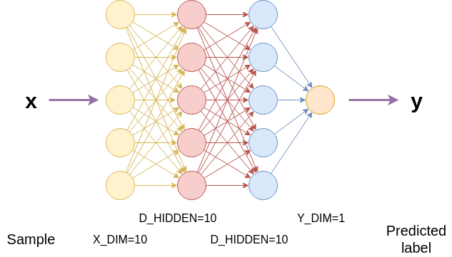
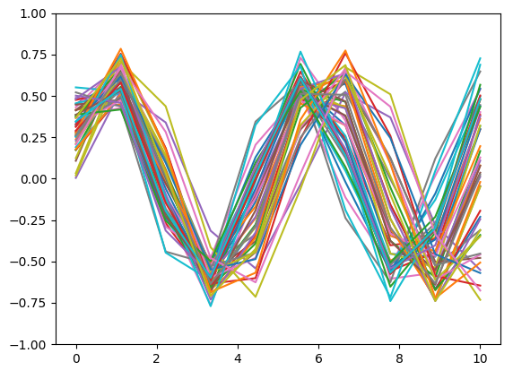
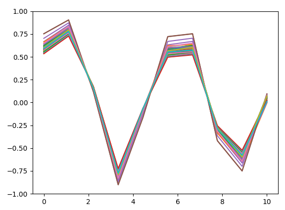
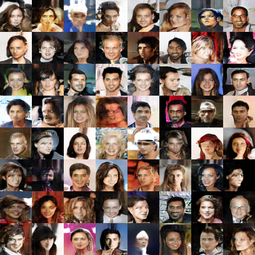

# 生成对抗网络基础

**生成对抗网络**（**GANs**）在 **机器学习**（**ML**）社区中掀起了一场革命性的风暴。它们在一定程度上改变了人们解决 **计算机视觉**（**CV**）和 **自然语言处理**（**NLP**）实际问题的方式。在我们深入探讨这场风暴之前，让我们先为你准备一些关于 GAN 的基础知识。

在本章中，你将理解对抗学习背后的理念和 GAN 模型的基本组成部分。你还将简要了解 GAN 的工作原理，以及如何使用 NumPy 构建 GAN。

在开始探索 PyTorch 中的新特性之前，我们将首先学习如何用 NumPy 构建一个简单的 GAN 来生成正弦信号，以便你能深刻理解 GAN 的机制。在本章结束时，你可以稍微放松一下，我们将通过多个实例展示 GAN 如何在 CV 和 NLP 领域解决实际问题。

本章将涵盖以下主题：

+   机器学习基础

+   生成器和判别器网络

+   GAN 的作用是什么？

+   参考资料和有用的阅读清单

# 机器学习基础

为了介绍 GAN 的工作原理，我们可以用一个类比：

很久很久以前，在一个岛屿上有两个相邻的王国，一个叫做 Netland，另一个叫做 Ganland。两个王国都生产优质的酒、盔甲和武器。在 Netland，国王要求专门制造盔甲的铁匠在城堡的东角工作，而制造剑的铁匠则在西侧工作，以便贵族和骑士可以选择王国提供的最佳装备。而 Ganland 的国王则把所有铁匠安排在同一个角落，并要求盔甲制造者和剑匠每天互相测试他们的作品。如果剑能突破盔甲，那么这把剑就会以好价钱卖出，而盔甲则会被熔化重新铸造。如果不能，剑将被重做，人们也会争相购买盔甲。一天，两个国王因哪一个王国酿造的酒更好而争论不休，直到争吵升级为战争。尽管 Ganland 的士兵数量较少，但他们身穿经过多年日常对抗测试改进的盔甲，手持锐利的剑，而 Netland 的士兵既无法突破他们强大的盔甲，也无法抵挡他们锋利的剑。最终，尽管 Netland 的国王不情愿，还是承认 Ganland 的酒和铁匠技艺更胜一筹。

# 机器学习 – 分类与生成

**机器学习（ML）**是研究如何从数据中识别模式，而无需人为硬编码规则。模式识别（**Pattern Recognition**或**PR**）是自动发现原始数据中的相似性和差异性，这是实现**人工智能（AI）**的关键方式，人工智能这一概念最初只存在于小说和电影中。虽然我们很难确切预测未来何时会出现真正的人工智能，但近年来机器学习的发展已经让我们充满信心。机器学习已经在许多领域得到了广泛应用，如计算机视觉（CV）、自然语言处理（NLP）、推荐系统、**智能交通系统（ITS）**、医疗诊断、机器人技术和广告。

一个机器学习（ML）模型通常被描述为一个接受数据并根据其包含的参数给出某些输出的系统。模型的**学习**实际上是调整参数以获得更好的输出。如下面的图所示，我们将训练数据输入模型，得到一个输出。然后，我们使用一个或多个标准来衡量输出，以判断我们的模型表现如何。在这一步，关于训练数据的一组期望输出（或实际结果）将非常有帮助。如果训练中使用了实际结果数据，这个过程通常被称为**监督学习**。如果没有使用，则通常被视为**无监督学习**。

我们根据模型的表现（换句话说，是否给出我们想要的结果）不断调整模型的参数，以便未来能够产生更好的结果。这个过程叫做**模型训练**。模型的训练时间由我们决定。通常，我们在经过一定数量的迭代后，或者当模型的表现足够好时，就会停止训练。训练过程完成后，我们将训练好的模型应用于对新数据（测试数据）的预测，这个过程叫做**模型测试**。有时，人们会使用不同的数据集进行训练和测试，以观察模型在遇到从未见过的样本时的表现，这被称为**泛化**能力。有时，模型评估（**model evaluation**）是一个额外的步骤，当模型的参数过于复杂，我们需要使用另一组数据来验证我们的模型或训练过程是否设计得当。



一个典型的机器学习系统，包括模型训练和测试

这个模型可以解决哪些类型的问题，实质上取决于我们想要的输入和输出数据的类型。例如，分类模型接受任意维度的数据输入（如音频、文本、图像或视频），并给出一维的输出（表示预测标签的单一值）。而生成模型通常接受一维输入（潜在向量），并生成高维的输出（图像、视频或 3D 模型）。它将低维数据映射到高维数据，同时尽力使输出样本看起来尽可能真实。然而，值得指出的是，在后续章节中，我们将遇到不遵循这一规则的生成模型。直到第五章，*基于标签信息生成图像*，这是一个需要牢记的简单规则。

说到 AI，社区里有两派信徒。符号主义者承认人类经验和知识的必要性。他们认为低级模式构成了基于人类明确规则的高级决策。连接主义者则认为，AI 可以通过类似于人类神经系统的类比网络实现，调整简单神经元之间的连接是这个系统的关键。显然，深度学习的爆炸性发展为连接主义者的一方加分。你怎么看？

# 引入对抗学习

传统上，生成问题是通过基于统计的方法解决的，如**玻尔兹曼机**、**马尔可夫链**或**变分编码器**。尽管这些方法在数学上非常深奥，但生成的样本还远未完美。分类模型将高维数据映射到低维数据，而生成模型通常将低维数据映射到高维数据。两者领域的人们一直在努力改进他们的模型。让我们回顾一下那个虚构的开场故事。我们能让这两种不同的模型相互对抗并同时提升自己吗？如果我们把生成模型的输出作为分类模型的输入，就可以用分类模型（剑）来衡量生成模型（盔甲）的性能。与此同时，我们也可以通过将生成样本（盔甲）与真实样本一起输入，来改善分类模型（剑），因为我们都同意更多的数据通常有利于机器学习模型的训练。

两个模型相互削弱并因此相互提升的训练过程被称为**对抗学习**。如下面的图所示，模型 A 和 B 有完全相反的目标（例如分类和生成）。然而，在每一步训练过程中，模型 A 的输出提升了模型 B，而模型 B 的输出又提升了模型 A：



一个典型的对抗学习系统

**生成对抗网络（GANs）** 是基于这一理念设计的，该理念由 Goodfellow、Pouget-Abadie、Mirza 等人在 2014 年提出。如今，生成对抗网络已成为机器学习领域中最为繁荣和流行的方法，用于合成音频、文本、图像、视频和 3D 模型。在本书中，我们将带您了解不同类型生成对抗网络的基本组成部分和机制，并学习如何使用它们解决各种实际问题。在接下来的部分，我们将介绍生成对抗网络的基本结构，以便向您展示它们是如何以及为何能如此有效地工作的。

# 生成器和判别器网络

在这里，我们将展示生成对抗网络的基本组件，并解释它们如何相互作用或对立，以实现我们生成真实样本的目标。以下是生成对抗网络的典型结构示意图。它包含两个不同的网络：生成器网络和判别器网络。**生成器** 网络通常以随机噪声为输入，并生成假样本。我们的目标是让这些假样本尽可能接近真实样本。此时，判别器就发挥了作用。**判别器** 实际上是一个分类网络，它的任务是判断给定的样本是假的还是现实的。生成器尽力欺骗并混淆判别器，使其做出错误的判断，而判别器则尽力区分真假样本。

在这个过程中，通过利用真假样本之间的差异来改进生成器。因此，生成器在生成看起来更真实的样本方面会变得越来越好，而判别器在识别这些样本时也会变得越来越强。由于使用真实样本来训练判别器，因此这个训练过程是有监督的。尽管生成器在没有真实标签的情况下总是生成假样本，生成对抗网络的整体训练仍然是**有监督的**：



生成对抗网络的基本过程

# 生成对抗网络的数学背景

让我们看看这个过程背后的数学原理，以便更好地理解其机制。假设  和  分别代表生成器和判别器网络。假设  代表系统的性能标准。优化目标描述如下：


在这个方程中，是实际样本，是生成的样本，是用来生成假样本的随机噪声。是对的期望，表示对所有样本中任何函数的平均值。

如前所述，判别器的目标，，是最大化真实样本的预测置信度。因此， 需要通过**梯度上升**（目标中的算子）进行训练。更新规则如下：


在这个公式中，是的参数（例如卷积核和全连接层中的权重），是小批量的大小（简称批量大小），是小批量中样本的索引。这里，我们假设使用小批量来输入训练数据，这是一种相当合理的假设，因为这是最常用且经验上有效的策略。因此，梯度需要在样本上进行平均。

向模型提供训练数据有三种不同的方式：（1）一次一个样本，这通常称为**随机**（例如，**随机梯度下降**或**SGD**）；（2）一次几个样本，这称为**小批量**；（3）一次所有样本，这实际上称为**批量**。随机方式引入了过多的随机性，导致一个坏样本可能会危及之前几个训练步骤的良好效果。全批量需要过多的内存来计算。因此，在本书中，我们通过小批量将数据提供给所有模型，尽管我们可能懒散地称其为批量。

生成器网络的目标，，是欺骗判别器，，让  认为生成的样本是真实的。因此， 的训练就是最大化  或最小化 。因此， 需要通过 **梯度下降** 进行训练（目标函数中的  操作符）。 的更新规则如下：


在这个公式中， 是 <q>，</q> 的参数， 是迷你批次的大小， 是迷你批次中样本的索引。

如果你不熟悉梯度下降（GD）的概念，可以把它想象成一个小男孩在崎岖的地形上踢一个粘乎乎的球。小男孩希望球停在最低的坑里，这样他就可以结束今天的任务回家了。球是粘的，所以它在落地后不会滚动，即使是在斜坡上。因此，球停在哪里是由小男孩踢球的方向和力度决定的。小男孩踢球的力度由步长（或 **学习率**）来描述。踢球的方向则由他脚下地形的特征决定。一个有效的选择是下坡方向，即损失函数相对于参数的负梯度。因此，我们通常使用梯度下降来最小化目标函数。然而，男孩太专注于球了，他只盯着球看，拒绝抬头去寻找更广范围内的最低坑。因此，梯度下降方法有时效率不高，因为它可能需要很长时间才能到达底部。我们将在 第三章 *模型设计和训练的最佳实践* 中介绍一些如何提高梯度下降效率的技巧。**梯度上升** 是梯度下降的相反操作，用于寻找最高峰。

# 使用 NumPy 训练正弦信号生成器

对一些人来说，数学可能比一大段代码还要让人困惑。现在，让我们看一些代码来消化我们刚才给你们抛出的方程式。在这里，我们将使用 Python 实现一个非常简单的对抗学习示例，用来生成正弦（sin）信号。

在以下示例中，我们将仅使用 NumPy，一个强大的线性代数 Python 库来实现 GAN 模型。我们需要自己计算梯度，以便你能深入理解在流行的深度学习工具包（如 PyTorch）背后可能发生的事情。放心，未来章节我们不再需要手动计算梯度，因为我们可以使用 PyTorch 提供的强大计算图来自动为我们计算梯度！

# 设计网络架构

生成器网络的架构如以下图所示。它以一个一维随机值作为输入，并给出一个十维向量作为输出。它有两个隐藏层，每个隐藏层包含 10 个神经元。每一层的计算都是矩阵乘法。因此，该网络实际上是一个**多层感知器**（**MLP**）：



生成器网络的结构

判别器网络的架构如以下图所示。它以一个十维向量作为输入，并给出一个一维值作为输出。该输出是对输入样本的预测标签（真实或假）。判别器网络同样是一个 MLP，具有两个隐藏层，每个隐藏层包含 10 个神经元：



判别器网络的结构

# 定义激活函数和损失函数

我们将仅使用 NumPy （[`www.numpy.org`](http://www.numpy.org)）来计算和训练我们的 GAN 模型（可选地使用 Matplotlib（[`matplotlib.org`](https://matplotlib.org)）来可视化信号）。如果你的机器上还没有 Python 环境，请参考第二章，*PyTorch 1.3 入门*，了解如何设置 Python 环境。如果你的 Python 环境已正确设置，让我们开始实际代码吧。

以下所有代码可以放入一个 `simple*.*py` 文件中（例如 `simple_gan.py`）。我们将一步一步地查看代码：

1.  导入 `NumPy` 库：

```py
import numpy as np
```

1.  定义模型中所需的一些常量变量：

```py
Z_DIM = 1
G_HIDDEN = 10
X_DIM = 10
D_HIDDEN = 10

step_size_G = 0.01
step_size_D = 0.01
ITER_NUM = 50000

GRADIENT_CLIP = 0.2
WEIGHT_CLIP = 0.25
```

1.  定义我们想要估计的真实正弦样本（使用 `numpy.sin`）：

```py
def get_samples(random=True):
    if random:
        x0 = np.random.uniform(0, 1)
        freq = np.random.uniform(1.2, 1.5)
        mult = np.random.uniform(0.5, 0.8)
    else:
        x0 = 0
        freq = 0.2
        mult = 1
    signal = [mult * np.sin(x0+freq*i) for i in range(X_DIM)]
    return np.array(signal)
```

在之前的代码片段中，我们使用了一个 `bool` 变量 `random` 来引入真实样本中的随机性，因为现实生活中的数据具有这种特性。真实样本如下所示（50 个样本，`random=True`）：



真实正弦样本

1.  定义激活函数及其导数。如果你不熟悉激活函数的概念，记住它们的作用是调整一层的输出，以便其下一层能够更好地理解这些输出值：

```py
def ReLU(x):
    return np.maximum(x, 0.)

def dReLU(x):
    return ReLU(x)

def LeakyReLU(x, k=0.2):
    return np.where(x >= 0, x, x * k)

def dLeakyReLU(x, k=0.2):
    return np.where(x >= 0, 1., k)

def Tanh(x):
    return np.tanh(x)

def dTanh(x):
    return 1\. - Tanh(x)**2

def Sigmoid(x):
    return 1\. / (1\. + np.exp(-x))

def dSigmoid(x):
    return Sigmoid(x) * (1\. - Sigmoid(x))

```

1.  定义一个 `helper` 函数来初始化层的参数：

```py
def weight_initializer(in_channels, out_channels):
    scale = np.sqrt(2\. / (in_channels + out_channels))
    return np.random.uniform(-scale, scale, (in_channels, out_channels))
```

1.  定义 `loss` 函数（包括前向和反向）：

```py
class LossFunc(object):
    def __init__(self):
        self.logit = None
        self.label = None

    def forward(self, logit, label):
        if logit[0, 0] < 1e-7:
            logit[0, 0] = 1e-7
        if 1\. - logit[0, 0] < 1e-7:
            logit[0, 0] = 1\. - 1e-7
        self.logit = logit
        self.label = label
        return - (label * np.log(logit) + (1-label) * np.log(1-logit))

    def backward(self):
        return (1-self.label) / (1-self.logit) - self.label / self.logit
```

这被称为**二元交叉熵**，通常用于二分类问题（即一个样本要么属于类别 A，要么属于类别 B）。有时，某个网络训练得过好，以至于判别器的`sigmoid`输出可能过于接近 0 或 1。两种情况都会导致`log`函数的数值错误。因此，我们需要限制输出值的最大值和最小值。

# 进行前向传播和反向传播

现在，让我们创建生成器和判别器网络。我们将代码放在与`simple_gan.py`相同的文件中：

1.  定义生成器网络的参数：

```py
class Generator(object):
    def __init__(self):
        self.z = None
        self.w1 = weight_initializer(Z_DIM, G_HIDDEN)
        self.b1 = weight_initializer(1, G_HIDDEN)
        self.x1 = None
        self.w2 = weight_initializer(G_HIDDEN, G_HIDDEN)
        self.b2 = weight_initializer(1, G_HIDDEN)
        self.x2 = None
        self.w3 = weight_initializer(G_HIDDEN, X_DIM)
        self.b3 = weight_initializer(1, X_DIM)
        self.x3 = None
        self.x = None
```

我们跟踪所有层的输入和输出，因为我们需要它们来计算导数，以便稍后更新参数。

1.  定义前向计算（根据随机噪声生成样本）：

```py
    def forward(self, inputs):
        self.z = inputs.reshape(1, Z_DIM)
        self.x1 = np.matmul(self.z, self.w1) + self.b1
        self.x1 = ReLU(self.x1)
        self.x2 = np.matmul(self.x1, self.w2) + self.b2
        self.x2 = ReLU(self.x2)
        self.x3 = np.matmul(self.x2, self.w3) + self.b3
        self.x = Tanh(self.x3)
        return self.x
```

基本上是重复相同的计算过程三次。每一层都按照这个公式计算它的输出：


在这个方程中，表示某一层的输出值，<q>f</q>表示激活函数，下标<q>l</q>表示层的索引。这里我们在隐藏层使用`ReLU`，在输出层使用`Tanh`。

现在是定义生成器网络的反向计算的时候了（计算导数并更新参数）。这部分代码有点长，实际上是重复同样的过程三次：

1.  1.  计算损失相对于此层输出的导数（例如，相对于`output`或`x2`的导数）。

    1.  计算损失相对于参数的导数（例如，相对于`w3`或`b3`的导数）。

    1.  使用导数更新参数。

    1.  将梯度传递给前一层。导数计算如下：


在这个过程中，损失相对于输出的导数，在代码中表示为`delta`，是关键，它用于从层<q>l+1</q>传播梯度到层<q>l</q>。因此，这个过程被称为**反向传播**。从层<q>l+1</q>到层<q>l</q>的传播过程描述如下：


1.  计算相对于输出的导数：

```py
    def backward(self, outputs):
        # Derivative with respect to output
        delta = outputs
        delta *= dTanh(self.x)
```

计算相对于第三层参数的导数：

```py
        # Derivative with respect to w3
        d_w3 = np.matmul(np.transpose(self.x2), delta)
        # Derivative with respect to b3
        d_b3 = delta.copy()
```

将梯度传递给第二层：

```py
        # Derivative with respect to x2
        delta = np.matmul(delta, np.transpose(self.w3))
```

并且更新第三层的参数：

```py
        # Update w3
        if (np.linalg.norm(d_w3) > GRADIENT_CLIP):
            d_w3 = GRADIENT_CLIP / np.linalg.norm(d_w3) * d_w3
        self.w3 -= step_size_G * d_w3
        self.w3 = np.maximum(-WEIGHT_CLIP, np.minimum(WEIGHT_CLIP,  
         self.w3))

        # Update b3
        self.b3 -= step_size_G * d_b3
        self.b3 = np.maximum(-WEIGHT_CLIP, np.minimum(WEIGHT_CLIP,  
         self.b3))
        delta *= dReLU(self.x2)
```

1.  更新第二层的参数并将梯度传递给第一层：

```py
        # Derivative with respect to w2
        d_w2 = np.matmul(np.transpose(self.x1), delta)
        # Derivative with respect to b2
        d_b2 = delta.copy()

        # Derivative with respect to x1
        delta = np.matmul(delta, np.transpose(self.w2))

        # Update w2
        if (np.linalg.norm(d_w2) > GRADIENT_CLIP):
            d_w2 = GRADIENT_CLIP / np.linalg.norm(d_w2) * d_w2
        self.w2 -= step_size_G * d_w2
        self.w2 = np.maximum(-WEIGHT_CLIP, np.minimum(WEIGHT_CLIP, 
          self.w2))

        # Update b2
        self.b2 -= step_size_G * d_b2
        self.b2 = np.maximum(-WEIGHT_CLIP, np.minimum(WEIGHT_CLIP, 
          self.b2))
        delta *= dReLU(self.x1)
```

1.  更新第一层的参数：

```py
        # Derivative with respect to w1
        d_w1 = np.matmul(np.transpose(self.z), delta)
        # Derivative with respect to b1
        d_b1 = delta.copy()

        # No need to calculate derivative with respect to z
        # Update w1
        if (np.linalg.norm(d_w1) > GRADIENT_CLIP):
            d_w1 = GRADIENT_CLIP / np.linalg.norm(d_w1) * d_w1
        self.w1 -= step_size_G * d_w1
        self.w1 = np.maximum(-WEIGHT_CLIP, np.minimum(WEIGHT_CLIP, 
          self.w1))

        # Update b1
        self.b1 -= step_size_G * d_b1
        self.b1 = np.maximum(-WEIGHT_CLIP, np.minimum(WEIGHT_CLIP, 
          self.b1))
```

你会注意到以下代码与前面的代码相似。这里只是为了指出这些代码行有助于保持数据的稳定性。你不必添加这三行：

```py
if (np.linalg.norm(d_w3) > GRADIENT_CLIP):
    d_w3 = GRADIENT_CLIP / np.linalg.norm(d_w3) * d_w3
self.w3 = np.maximum(-WEIGHT_CLIP, np.minimum(WEIGHT_CLIP, self.w3))
```

包括这段代码是因为 GAN 的训练可能非常不稳定，我们需要裁剪梯度和参数以确保稳定的训练过程。

我们将在第三章中详细阐述激活函数、损失函数、权重初始化、梯度裁剪、权重裁剪等话题，*模型设计和训练的最佳实践*。这些对于稳定和提高 GAN 的训练非常有用。

现在，让我们定义判别器网络：

```py
class Discriminator(object):
    def __init__(self):
        self.x = None
        self.w1 = weight_initializer(X_DIM, D_HIDDEN)
        self.b1 = weight_initializer(1, D_HIDDEN)
        self.y1 = None
        self.w2 = weight_initializer(D_HIDDEN, D_HIDDEN)
        self.b2 = weight_initializer(1, D_HIDDEN)
        self.y2 = None
        self.w3 = weight_initializer(D_HIDDEN, 1)
        self.b3 = weight_initializer(1, 1)
        self.y3 = None
        self.y = None
```

现在定义它的前向计算（根据输入样本预测标签）：

```py
    def forward(self, inputs):
        self.x = inputs.reshape(1, X_DIM)
        self.y1 = np.matmul(self.x, self.w1) + self.b1
        self.y1 = LeakyReLU(self.y1)
        self.y2 = np.matmul(self.y1, self.w2) + self.b2
        self.y2 = LeakyReLU(self.y2)
        self.y3 = np.matmul(self.y2, self.w3) + self.b3
        self.y = Sigmoid(self.y3)
        return self.y
```

这里，我们使用 LeakyReLU 作为隐藏层的激活函数，输出层使用 sigmoid 激活函数。现在，让我们定义判别器网络的反向计算（计算导数并更新参数）：

```py
    def backward(self, outputs, apply_grads=True):
        # Derivative with respect to output
        delta = outputs
        delta *= dSigmoid(self.y)
        # Derivative with respect to w3
        d_w3 = np.matmul(np.transpose(self.y2), delta)
        # Derivative with respect to b3
        d_b3 = delta.copy()
        # Derivative with respect to y2
        delta = np.matmul(delta, np.transpose(self.w3))
        if apply_grads:
            # Update w3
            if np.linalg.norm(d_w3) > GRADIENT_CLIP:
                d_w3 = GRADIENT_CLIP / np.linalg.norm(d_w3) * d_w3
            self.w3 += step_size_D * d_w3
            self.w3 = np.maximum(-WEIGHT_CLIP, np.minimum(WEIGHT_CLIP,  
              self.w3))
            # Update b3
            self.b3 += step_size_D * d_b3
            self.b3 = np.maximum(-WEIGHT_CLIP, np.minimum(WEIGHT_CLIP,  
              self.b3))
        delta *= dLeakyReLU(self.y2)
        # Derivative with respect to w2
        d_w2 = np.matmul(np.transpose(self.y1), delta)
        # Derivative with respect to b2
        d_b2 = delta.copy()
        # Derivative with respect to y1
        delta = np.matmul(delta, np.transpose(self.w2))
        if apply_grads:
            # Update w2
            if np.linalg.norm(d_w2) > GRADIENT_CLIP:
                d_w2 = GRADIENT_CLIP / np.linalg.norm(d_w2) * d_w2
            self.w2 += step_size_D * d_w2
            self.w2 = np.maximum(-WEIGHT_CLIP, np.minimum(WEIGHT_CLIP, 
              self.w2))
            # Update b2
            self.b2 += step_size_D * d_b2
            self.b2 = np.maximum(-WEIGHT_CLIP, np.minimum(WEIGHT_CLIP, 
              self.b2))
        delta *= dLeakyReLU(self.y1)
        # Derivative with respect to w1
        d_w1 = np.matmul(np.transpose(self.x), delta)
        # Derivative with respect to b1
        d_b1 = delta.copy()
        # Derivative with respect to x
        delta = np.matmul(delta, np.transpose(self.w1))
        # Update w1
        if apply_grads:
            if np.linalg.norm(d_w1) > GRADIENT_CLIP:
                d_w1 = GRADIENT_CLIP / np.linalg.norm(d_w1) * d_w1
            self.w1 += step_size_D * d_w1
            self.w1 = np.maximum(-WEIGHT_CLIP, np.minimum(WEIGHT_CLIP, 
              self.w1))
            # Update b1
            self.b1 += step_size_D * d_b1
            self.b1 = np.maximum(-WEIGHT_CLIP, np.minimum(WEIGHT_CLIP, 
              self.b1))
        return delta
```

请注意，判别器反向计算的主要区别在于它是通过梯度上升进行训练的。因此，为了更新它的参数，我们需要加上梯度。因此，在前面的代码中，你会看到类似这样的代码行，它为我们处理了这一过程：

```py
self.w3 += step_size_D * d_w3
```

# 训练我们的 GAN 模型

现在所有必要的组件都已定义，我们可以开始训练我们的 GAN 模型：

```py
G = Generator()
D = Discriminator()
criterion = LossFunc()

real_label = 1
fake_label = 0

for itr in range(ITER_NUM):
    # Update D with real data
    x_real = get_samples(True)
    y_real = D.forward(x_real)
    loss_D_r = criterion.forward(y_real, real_label)
    d_loss_D = criterion.backward()
    D.backward(d_loss_D)

    # Update D with fake data
    z_noise = np.random.randn(Z_DIM)
    x_fake = G.forward(z_noise)
    y_fake = D.forward(x_fake)
    loss_D_f = criterion.forward(y_fake, fake_label)
    d_loss_D = criterion.backward()
    D.backward(d_loss_D)

    # Update G with fake data
    y_fake_r = D.forward(x_fake)
    loss_G = criterion.forward(y_fake_r, real_label)
    d_loss_G = D.backward(loss_G, apply_grads=False)
    G.backward(d_loss_G)
    loss_D = loss_D_r + loss_D_f
    if itr % 100 == 0:
        print('{} {} {}'.format(loss_D_r.item((0, 0)), loss_D_f.item((0, 0)), loss_G.item((0, 0))))
```

如前面的代码所示，GAN 模型的训练主要分为 3 个步骤：

1.  用真实数据训练判别器（并将其识别为真实数据）。

1.  用虚假数据训练判别器（并将其识别为虚假数据）。

1.  用虚假数据训练生成器（并将其识别为真实数据）。

前两步教判别器如何区分真实数据和虚假数据。第三步教生成器如何通过生成与真实数据相似的虚假数据来欺骗判别器。这是对抗学习的核心思想，也是 GAN 能够生成相对逼真的音频、文本、图像和视频的原因。

这里，我们使用 SGD 训练模型 50,000 次。如果你感兴趣，欢迎实现 mini-batch GD，看看它是否能在更短的时间内产生更好的结果。你也可以更改网络架构（例如层数、每层的神经元数量以及数据维度 `X_DIM`），看看超参数变化对结果的影响。

最后，让我们使用 Matplotlib 来可视化生成的样本：

```py
import matplotlib.pyplot as plt
x_axis = np.linspace(0, 10, 10)
for i in range(50):
    z_noise = np.random.randn(Z_DIM)
    x_fake = G.forward(z_noise)
    plt.plot(x_axis, x_fake.reshape(X_DIM))
plt.ylim((-1, 1))
plt.show()
```

训练可能需要几秒钟，具体取决于你的 CPU 性能。训练完成后，生成器网络生成的样本可能看起来像这样（50 个样本）：



生成的正弦样本

相当有说服力吧？看到它如何捕捉原始正弦波的峰值和谷值真是令人惊叹。想象一下，GAN 在更复杂结构下能够做什么！

# GAN 能做什么？

GAN 能做的事情远不止生成正弦信号。通过改变生成器的输入和输出维度并结合其他方法，我们可以将 GAN 应用到许多不同的实际问题中。例如，我们可以基于随机输入生成文本和音频（一维），图像（二维），视频和 3D 模型（三维）。如果我们保持输入和输出的维度相同，就可以对这些类型的数据进行去噪和翻译。我们还可以将真实数据输入生成器，让它输出更大维度的数据，例如图像超分辨率。我们也可以输入一种类型的数据，让它输出另一种类型的数据，例如基于文本生成音频、基于文本生成图像等等。

尽管 GAN 首次提出仅仅过了 4 年（截至写作时），人们一直在努力改进 GAN，新的 GAN 模型几乎每周都会发布。如果你查看 [`github.com/hindupuravinash/the-gan-zoo`](https://github.com/hindupuravinash/the-gan-zoo)，你会发现至少有 500 种不同的 GAN 模型。要想学习并评估每一个模型几乎是不可能的。你会惊讶地发现，实际上有很多模型共享相同的名字！因此，在本书中，我们不会尝试向你介绍大多数现有的 GAN 模型。然而，我们将帮助你熟悉在不同应用中最典型的 GAN 模型，并学习如何使用它们来解决实际问题。

我们还将介绍一些实用的技巧和技术，以提高 GAN 的性能。我们希望，当你完成本书时，能够对各种 GAN 模型的机制有广泛而深入的理解，从而让你有信心设计自己的 GAN 来创造性地解决未来可能遇到的问题。

让我们来看看 GAN 能做些什么，以及它们在这些领域（图像处理、自然语言处理和 3D 建模）与传统方法相比有哪些优势。

# 图像处理

在图像处理领域，GAN 被应用于许多应用场景，包括图像合成、图像翻译和图像修复。这些话题是 GAN 学习和应用中最常见的内容，也是本书的主要内容。图像是互联网上最容易展示和传播的媒体形式之一；因此，GAN 在图像应用方面的任何最新突破都会在深度学习社区引起极大的关注。

# 图像合成

简而言之，图像合成就是创造新的图像。早在 2015 年，**DCGANs**（**深度卷积生成对抗网络**）就问世了。这是最早解决了之前 GAN 模型中难以训练问题的稳定且表现良好的方法之一。它基于一个长度为 100 的随机向量生成 64 x 64 的图像。以下截图展示了部分 DCGAN 生成的图像。你可能会注意到，由于像素的方块状外观，有些图像看起来远没有那么逼真。在 Radford、Metz 和 Chintala（2015）的论文中，他们展示了许多有趣且启发性的视觉实验，揭示了 GAN 更大的潜力。我们将在第四章中讨论 DCGAN 的架构和训练过程，*用 PyTorch 构建你的第一个 GAN*。



DCGAN 生成的图像（左：人脸；右：卧室）

目前，GAN 在图像合成方面表现异常出色。以 BigGAN 为例，它是在 ICLR 2019（*第 7 届国际学习表示会议*）上，Brock、Donahue 和 Simonyan 提交的论文中提出的。即使在开放评审过程中，它就受到了社交媒体的广泛关注。它能够生成高质量、最大达到 512 x 512 尺寸的图像。

在接下来的章节中，我们还将探讨一些 GAN 模型，这些模型不仅关注图像的类别条件，还深入探讨图像的其他属性。我们将讨论条件 GAN（Conditional GANs），它允许你互动式地生成图像，以及 Age-cGAN，它能够根据你的需求生成任意年龄段的人脸。我们还将研究如何利用 GAN 生成对抗样本，这些样本连最好的分类器也无法正确识别，相关内容请见第八章，*训练你的 GAN 以突破不同的模型*。

# 图像翻译

如果我们将图像合成描述为一个过程，即我们期望将 1 维向量输入模型后，输出为 2 维图像（再次强调，这里有例外，因为如果你愿意，也可以基于其他类型的数据生成图像），那么图像翻译（更准确地说，是图像到图像的翻译）就是将 2 维图像输入模型，并且模型输出仍为 2 维数据的过程。通过图像翻译，可以做很多有趣的事情。例如，pix2pix（Isola, Zhu, Zhou 等人，2016）可以将标签图转换为图像，包括将边缘草图转为彩色图像、根据语义分割信息生成街景照片、进行图像风格迁移等。我们将在第六章中详细探讨 pix2pix 的升级版 pix2pixHD，*图像到图像翻译及其应用*，并介绍其他图像到图像翻译方法，如 CycleGAN 和 DiscoGAN。

图像到图像的翻译可以应用于其他计算机视觉应用，并解决更传统的问题，比如图像恢复、图像修补和超分辨率。图像恢复是计算机视觉中最重要的研究领域之一。数学家和计算机科学家们几十年来一直在努力解决如何消除照片上的令人讨厌的噪音，或者从模糊图像中揭示更多信息的问题。传统上，这些问题通过迭代数值计算来解决，通常需要深厚的数学背景才能掌握。现在，有了生成对抗网络（GANs），这些问题可以通过图像到图像的翻译来解决。例如，SRGAN（Ledig, Theis, Huszar 等人，2016 年）可以高质量地将图像放大至原始尺寸的 4 倍，我们将在第七章中详细讨论，*使用 GAN 进行图像恢复*。是的，Chen, Lim 等人（2016 年）提出使用类似 DCGAN 的模型来解决人脸修补问题。更近期，Yu, Lin, Yang 等人（2018 年）设计了一个 GAN 模型，可以填补图像中任意形状的空白区域，生成的像素也非常令人信服。

文本到图像的翻译也是 GAN 的一个良好应用，根据描述文本生成新的图像。Reed, Akata, Yan 等人（2016 年）提出了一种从详细描述文本中提取区分特征并利用这些信息生成与描述完美匹配的花卉或鸟类图像的过程。几个月后，Zhang, Xu, Li 等人（2016 年）提出了 StackGAN，根据描述文本生成高保真度的 256 x 256 图像。我们将在第九章中详细讨论，*从描述文本生成图像*。

# 视频合成与翻译

视频是一系列图像。因此，大多数图像翻译方法可以直接应用于视频。然而，视频合成或翻译的一个关键性能指标是计算速度。例如，如果我们希望为移动设备开发具有不同图像风格的相机应用程序，我们的用户肯定希望能实时看到处理后的结果。以视频监控系统为例。完全可以使用 GAN 来去噪和增强视频信号（前提是您的客户完全信任您的模型）。一个快速处理每帧图像的模型，以毫秒级速度保持帧率，无疑是值得考虑的。

我们想指出一个有趣的手势转移项目，名为**Everybody Dance Now**。它从源视频中提取舞者的动作，然后通过图像到图像的翻译将相同的动作映射到目标视频中的人物。这样，任何人都可以使用这个模型制作自己的舞蹈视频！

# NLP

NLP 是研究如何使用计算机处理和分析自然人类语言的学科。除了生成图像外，GANs 还可以用于生成序列和时间相关的数据，如文本和音频。SeqGAN，由 Yu、Zhang、Wang 等人（2016）提出，旨在生成序列信号，如诗歌和音乐。随后，Mogren（2016）提出了 C-RNN-GAN，旨在生成受声学约束的古典音乐。2017 年，Dong、Hsiao、Yang 等人设计了 MuseGAN，用于生成多乐器的复调音乐，包括贝斯、鼓、吉他、钢琴和弦乐。可以随时访问以下网站¹⁰ 享受生成的音乐！

语音增强是音频信号处理的主要研究领域之一。传统上，人们使用频谱减法、维纳滤波、子空间方法等来去除音频或语音信号中的噪声。然而，这些方法的性能只有在特定情况下才令人满意。Pascual、Bonafonte 和 Serrà（2017）设计了 SEGAN 来解决这个问题，并取得了令人印象深刻的结果¹¹。我们将在 第十章，*使用 GAN 进行序列合成* 中讨论 GAN 在 NLP 领域的应用。

# 3D 建模

既然我们知道 GANs 可以基于 1D 输入生成 2D 数据，那么考虑将其升级到基于 1D 或 2D 信号生成 3D 数据也是自然而然的事情。3D-GAN（Wu、Zhang、Xue 等人，2016）正是为此目的设计的。它学习潜在向量与 3D 模型之间的映射，从而基于 1D 向量生成 3D 对象。使用 GANs 基于 2D 轮廓预测 3D 模型也是完全可行的。Gadelha、Maji 和 Wang（2016）设计了 PrGAN，用于基于任何视角的二进制轮廓图像生成 3D 对象。我们将在 第十一章，*使用 GAN 重建 3D 模型* 中详细讨论如何使用 GAN 生成 3D 对象。

# 总结

我们在第一章中已经涵盖了大量信息。你已经了解了 GANs 的起源，并且对生成器和判别器的角色有了基本的理解。你甚至已经看到了 GANs 可以做的一些示例。我们甚至使用 NumPy 创建了一个 GAN 程序。更不用说，现在我们知道为什么 Ganland 的铁匠和酒更好。

接下来，我们将深入探索 PyTorch 的神奇世界，了解它是什么以及如何安装它。

以下是参考文献和其他有用链接的列表。

# 参考文献和有用阅读列表

1.  Goodfellow I，Pouget-Abadie J，Mirza M 等（2014）。生成对抗网络。NIPS，2672-2680。

1.  Wang, J.（2017 年 12 月 23 日）。*符号主义与联结主义：人工智能中的一个逐渐弥合的鸿沟*，摘自 [`wangjieshu.com/2017/12/23/symbol-vs-connectionism-a-closing-gap-in-artificial-intelligence`](https://wangjieshu.com/2017/12/23/symbol-vs-connectionism-a-closing-gap-in-artificial-intelligence)。

1.  Radford A, Metz L, Chintala S.（2015）。*无监督表示学习与深度卷积生成对抗网络*。arXiv 预印本 arXiv:1511.06434。

1.  "Dev Nag"。（2017 年 2 月 11 日）。**生成对抗网络**（**GANs**）在 50 行代码中的实现（PyTorch），检索自[`medium.com/@devnag/generative-adversarial-networks-gans-in-50-lines-of-code-pytorch-e81b79659e3f`](https://medium.com/@devnag/generative-adversarial-networks-gans-in-50-lines-of-code-pytorch-e81b79659e3f)。

1.  Brock A, Donahue J, Simonyan K. (2018). *大规模 GAN 训练用于高保真自然图像合成*。arXiv 预印本 arXiv:1809.11096。

1.  Isola P, Zhu J Y, Zhou T, Efros A. (2016). *基于条件对抗网络的图像到图像转换*。arXiv 预印本 arXiv:1611.07004。

1.  Ledig C, Theis L, Huszar F, et al (2016). *使用生成对抗网络的照片真实单图像超分辨率*。arXiv 预印本 arXiv:1609.04802。

1.  Yeh R A, Chen C, Lim T Y, et al (2016). *基于深度生成模型的语义图像修复*。arXiv 预印本 arXiv:1607.07539。

1.  Yu J, Lin Z, Yang J, et al (2018). *自由形式图像修复与门控卷积*。arXiv 预印本 arXiv:1806.03589。

1.  Reed S, Akata Z, Yan X, et al (2016). *生成对抗文本到图像合成*。arXiv 预印本 arXiv:1605.05396。

1.  Zhang H, Xu T, Li H, et al (2016). *StackGAN：基于堆叠生成对抗网络的文本到照片真实图像合成*。arXiv 预印本 arXiv:1612.03242。

1.  Yu L, Zhang W, Wang J, et al (2016). *SeqGAN：具有策略梯度的序列生成对抗网络*。arXiv 预印本 arXiv:1609.05473。

1.  Mogren O. (2016). *C-RNN-GAN：具有对抗训练的连续递归神经网络*。arXiv 预印本 arXiv:1611.09904。

1.  Dong H W, Hsiao W Y, Yang L C, et al (2017). *MuseGAN：用于符号音乐生成与伴奏的多轨序列生成对抗网络*。arXiv 预印本 arXiv:1709.06298。

1.  Pascual S, Bonafonte A, Serrà J. (2017). *SEGAN：语音增强生成对抗网络*。arXiv 预印本 arXiv:1703.09452。

1.  Wu J, Zhang C, Xue T, et al (2016). *通过 3D 生成对抗建模学习物体形状的概率潜在空间*。arXiv 预印本 arXiv:1610.07584。

1.  Gadelha M, Maji S, Wang R. (2016). *从多个物体的 2D 视图推导 3D 形状*。arXiv 预印本 arXiv:1612.05872。
