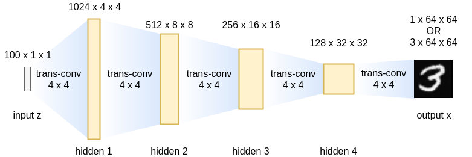
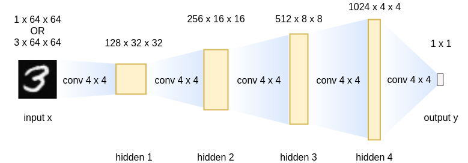
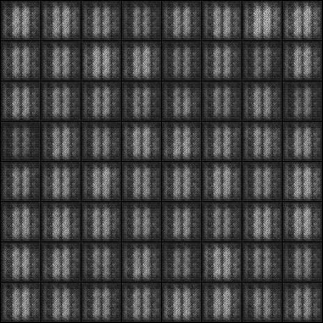
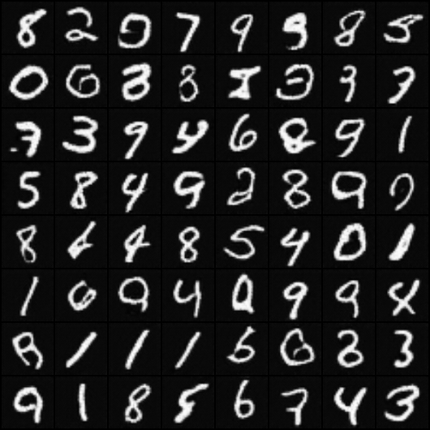
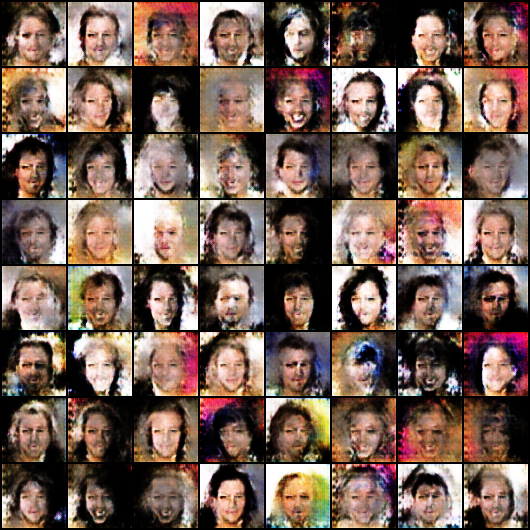
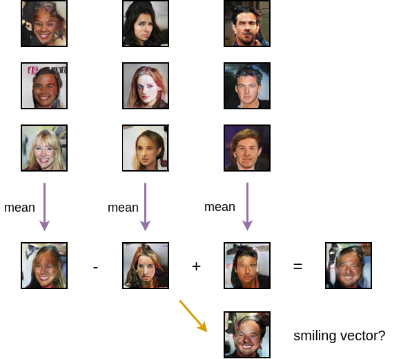

# 使用 PyTorch 构建您的第一个 GAN

在前几章中，我们讲解了使用对抗学习生成简单信号的概念，并学习了 PyTorch 1.3 的新特性和能力。现在是时候使用 PyTorch 来训练一个 GAN 模型，生成有趣的样本了。

在这一章中，我们将向您介绍一个经典且表现优异的 GAN 模型，称为 DCGAN，用于生成 2D 图像。您将学习以下内容：

+   DCGAN 的架构

+   DCGAN 的训练与评估

+   使用 DCGAN 生成手写数字、人脸图像

+   通过对潜在向量进行图像插值和算术计算，改变图像属性，与生成器网络一起玩乐

到本章结束时，您将掌握 GAN 模型生成图像数据的核心架构设计，并更好地理解潜在向量与生成样本之间的关系。

# 深度卷积生成对抗网络（DCGAN）简介

**DCGAN**（**深度卷积生成对抗网络**）是早期表现良好且稳定的生成图像的对抗训练方法之一。让我们回顾一下第一章中的简单例子，*生成对抗网络基础*。

在这里，即使我们只训练一个 GAN 来处理 1D 数据，我们也必须使用多种技术来确保训练的稳定性。在 GAN 的训练过程中，很多问题都可能出现。例如，如果生成器或判别器没有收敛，其中一个可能会过拟合。有时，生成器只能生成少数几种样本变体，这被称为**模式崩溃**。以下是模式崩溃的一个例子，我们想要训练一个 GAN 来生成一些中国的热门表情包，叫做**暴走**。我们可以看到，GAN 只能一次生成一两个表情包。其他机器学习算法中常见的梯度消失/爆炸和欠拟合等问题，在 GAN 训练中也很常见。因此，单纯将 1D 数据替换为 2D 图像并不能轻易保证训练成功：


GAN 训练中的模式崩溃（左：一些训练样本；中：第 492 次迭代的结果；右：第 500 次迭代的结果）

为了确保 GAN 在此类图像数据上的稳定训练，DCGAN 使用了三种技术：

+   摒弃全连接层，仅使用卷积层

+   使用步长卷积层进行下采样，而不是使用池化层

+   使用 ReLU/leakyReLU 激活函数替代隐藏层之间的 Tanh

本节将介绍 DCGAN 的生成器和判别器架构，并学习如何使用它生成图像。我们将使用 MNIST ([`yann.lecun.com/exdb/mnist`](http://yann.lecun.com/exdb/mnist)) 样本来说明 DCGAN 的架构，并在接下来的两节中使用它来训练模型。

# 生成器的架构

DCGAN 的生成器网络包含 4 个隐藏层（为简化起见，我们将输入层视为第 1 个隐藏层）和 1 个输出层。隐藏层中使用转置卷积层，后面跟随批量归一化层和 ReLU 激活函数。输出层也是一个转置卷积层，使用 Tanh 作为激活函数。生成器的架构如下图所示：



DCGAN 中的生成器架构

第 2、3、4 个隐藏层和输出层的步幅值为 2。第 1 层的填充值为 0，其余层的填充值为 1。随着图像（特征图）尺寸在更深的层中增加一倍，通道数减少一半。这是神经网络架构设计中的一种常见约定。所有转置卷积层的卷积核大小都设置为 4 x 4。输出通道可以是 1 或 3，具体取决于你是想生成灰度图像还是彩色图像。

转置卷积层可以被看作是普通卷积的**逆过程**。它曾一度被一些人称为反卷积层，这种叫法具有误导性，因为转置卷积并不是卷积的**逆**操作。从线性代数的角度来看，大多数卷积层是不可逆的，因为它们是病态的（具有极大的条件数），这使得它们的伪逆矩阵不适合表示逆过程。如果你有兴趣寻找卷积核的逆运算方法，可以在互联网上搜索数值反卷积方法。

# 判别器的架构

DCGAN 的判别器网络由 4 个隐藏层（同样，我们将输入层视为第 1 个隐藏层）和 1 个输出层组成。所有层中都使用卷积层，后面跟随批量归一化层，除了第一层没有批量归一化。隐藏层中使用 LeakyReLU 激活函数，输出层使用 Sigmoid 激活函数。判别器的架构如下所示：



DCGAN 中的判别器架构

输入通道可以是 1 或 3，具体取决于你处理的是灰度图像还是彩色图像。所有隐藏层的步幅值为 2，填充值为 1，因此它们的输出图像尺寸将是输入图像的一半。随着图像在更深层次的尺寸增大，通道的数量会翻倍。卷积层中的所有卷积核大小为 4 x 4。输出层的步幅值为 1，填充值为 0。它将 4 x 4 的特征图映射为单一值，以便 Sigmoid 函数能够将该值转换为预测置信度。

# 使用 PyTorch 创建 DCGAN

现在，让我们开始编写 PyTorch 代码来创建一个 DCGAN 模型。在这里，我们假设你正在使用 Ubuntu 18.04 的 Python 3.7 环境。如果不是，请参考 第二章，*PyTorch 1.3 入门*，了解如何创建 Anaconda 环境。

首先，我们创建一个名为 `dcgan.py` 的 Python 源文件，并导入我们需要的包：

```py
import os
import sys

import numpy as np
import torch
import torch.nn as nn
import torch.nn.parallel
import torch.backends.cudnn as cudnn
import torch.optim as optim
import torch.utils.data
import torchvision.datasets as dset
import torchvision.transforms as transforms
import torchvision.utils as vutils

import utils
```

这里，NumPy 仅用于初始化随机种子。如果你没有安装 NumPy，只需将 `np.random` 替换为 `random`，并在 `import os` 后插入 `import random`。在代码的最后一行，我们导入了一个名为 `utils` 的模块，它是一个自定义的实用程序包，定义在 `utils.py` 文件中。`utils.py` 的完整源代码可以在本章节的代码仓库中找到。

在本书中，我们将把大部分与 PyTorch 无关的辅助函数（包括文件组织、学习率调整、日志记录、张量可视化等）放在 `utils.py` 文件中。因此，在未来的章节中我们还会遇到这个模块。随着章节的推进，别忘了更新这个文件。

然后，我们定义输出路径和超参数。请注意，这里我们将生成器和判别器中隐藏层的最小通道大小设置为 `64`，因为我们发现之前展示的 `128` 可能导致判别器的过拟合：

```py
CUDA = True
DATA_PATH = '~/Data/mnist'
OUT_PATH = 'output'
LOG_FILE = os.path.join(OUT_PATH, 'log.txt')
BATCH_SIZE = 128
IMAGE_CHANNEL = 1
Z_DIM = 100
G_HIDDEN = 64
X_DIM = 64
D_HIDDEN = 64
EPOCH_NUM = 25
REAL_LABEL = 1
FAKE_LABEL = 0
lr = 2e-4
seed = 1
```

如果你没有 CUDA 支持的显卡，并且想在 CPU 上训练网络，你可以将 `CUDA` 设置为 `False`。`DATA_PATH` 指向 MNIST 数据集的根目录。如果你还没有下载并正确预处理 MNIST，只需将其指向任意目录（例如 `'.'`），稍后我们可以下载数据。`BATCH_SIZE` 会对代码消耗的 GPU 内存量产生重大影响。如果你不确定哪个批量大小适合你的系统，可以从一个较小的值开始，训练模型 1 个 epoch，然后将批量大小加倍，直到出现错误。

对于 MNIST，设置 `BATCH_SIZE` 为 128 应该足够，而且 GPU 内存消耗不到 1GB。`IMAGE_CHANNEL` 描述图像样本的颜色通道数。由于 MNIST 中的所有图像都是单通道的，因此我们应该将其设置为 1。`EPOCH_NUM` 对神经网络的训练时间有很大的影响。如果你希望得到更好的结果，通常将 epoch 数量设置大一点，学习率设置小一点是个不错的策略。我们将 `seed=1`，这样你的结果应该和我们在本书中得到的结果完全一致。

接下来，在创建网络之前，我们需要做一些准备工作：

```py
utils.clear_folder(OUT_PATH)
print("Logging to {}\n".format(LOG_FILE))
sys.stdout = utils.StdOut(LOG_FILE)
CUDA = CUDA and torch.cuda.is_available()
print("PyTorch version: {}".format(torch.__version__))
if CUDA:
    print("CUDA version: {}\n".format(torch.version.cuda))
if seed is None:
    seed = np.random.randint(1, 10000)
print("Random Seed: ", seed)
np.random.seed(seed)
torch.manual_seed(seed)
if CUDA:
    torch.cuda.manual_seed(seed)
cudnn.benchmark = True
device = torch.device("cuda:0" if CUDA else "cpu")
```

在这里，`utils.clear_folder(OUT_PATH)` 将清空输出文件夹，并在该文件夹不存在时创建一个。`sys.stdout = utils.StdOut(LOG_FILE)` 将把所有 `print` 的消息重定向到日志文件，并同时在控制台显示这些消息。如果你对实现感兴趣，可以参考 `utils.py` 文件。`cudnn.benchmark = True` 将告诉 cuDNN 为你的模型选择最优的算法集，如果输入数据的大小是固定的；否则，cuDNN 将在每次迭代时都寻找最佳算法。

如果你之前在使用 PyTorch 进行 CNN 训练时遇到过问题，你可能会注意到，有时候设置 `cudnn.benchmark = True` 会显著增加 GPU 内存消耗，特别是在模型架构在训练过程中发生变化且你在代码中同时进行训练和评估时。如果遇到奇怪的 **OOM** (**内存溢出**) 问题，请将其改为 `False`。

# 生成器网络

现在，让我们使用 PyTorch 来定义生成器网络：

```py
class Generator(nn.Module):
    def __init__(self):
        super(Generator, self).__init__()
        self.main = nn.Sequential(
            # 1st layer
            nn.ConvTranspose2d(Z_DIM, G_HIDDEN * 8, 4, 1, 0, bias=False),
            nn.BatchNorm2d(G_HIDDEN * 8),
            nn.ReLU(True),
            # 2nd layer
            nn.ConvTranspose2d(G_HIDDEN * 8, G_HIDDEN * 4, 4, 2, 1, bias=False),
            nn.BatchNorm2d(G_HIDDEN * 4),
            nn.ReLU(True),
            # 3rd layer
            nn.ConvTranspose2d(G_HIDDEN * 4, G_HIDDEN * 2, 4, 2, 1, bias=False),
            nn.BatchNorm2d(G_HIDDEN * 2),
            nn.ReLU(True),
            # 4th layer
            nn.ConvTranspose2d(G_HIDDEN * 2, G_HIDDEN, 4, 2, 1, bias=False),
            nn.BatchNorm2d(G_HIDDEN),
            nn.ReLU(True),
            # output layer
            nn.ConvTranspose2d(G_HIDDEN, IMAGE_CHANNEL, 4, 2, 1, bias=False),
            nn.Tanh()
        )

    def forward(self, input):
        return self.main(input)
```

请注意，输出层没有连接批归一化层。

让我们创建一个 `helper` 函数来初始化网络参数：

```py
def weights_init(m):
    classname = m.__class__.__name__
    if classname.find('Conv') != -1:
        m.weight.data.normal_(0.0, 0.02)
    elif classname.find('BatchNorm') != -1:
        m.weight.data.normal_(1.0, 0.02)
        m.bias.data.fill_(0)
```

在生成器网络中，只有两种类型的层包含可训练的参数：转置卷积层和批归一化层。在这里，我们根据高斯分布（正态分布）初始化卷积核，均值为 0，标准差为 0.02。我们还需要初始化批归一化中的仿射参数（缩放因子）。

现在，我们可以按照以下方式创建一个 `Generator` 对象：

```py
netG = Generator().to(device)
netG.apply(weights_init)
print(netG)
```

我们可以通过直接打印生成器网络来检查其中包含的模块。考虑到输出的长度，我们不会显示它的输出。

# 判别器网络

现在，让我们定义判别器网络：

```py
class Discriminator(nn.Module):
    def __init__(self):
        super(Discriminator, self).__init__()
        self.main = nn.Sequential(
            # 1st layer
            nn.Conv2d(IMAGE_CHANNEL, D_HIDDEN, 4, 2, 1, bias=False),
            nn.LeakyReLU(0.2, inplace=True),
            # 2nd layer
            nn.Conv2d(D_HIDDEN, D_HIDDEN * 2, 4, 2, 1, bias=False),
            nn.BatchNorm2d(D_HIDDEN * 2),
            nn.LeakyReLU(0.2, inplace=True),
            # 3rd layer
            nn.Conv2d(D_HIDDEN * 2, D_HIDDEN * 4, 4, 2, 1, bias=False),
            nn.BatchNorm2d(D_HIDDEN * 4),
            nn.LeakyReLU(0.2, inplace=True),
            # 4th layer
            nn.Conv2d(D_HIDDEN * 4, D_HIDDEN * 8, 4, 2, 1, bias=False),
            nn.BatchNorm2d(D_HIDDEN * 8),
            nn.LeakyReLU(0.2, inplace=True),
            # output layer
            nn.Conv2d(D_HIDDEN * 8, 1, 4, 1, 0, bias=False),
            nn.Sigmoid()
        )

    def forward(self, input):
        return self.main(input).view(-1, 1).squeeze(1)
```

请注意，输入层没有连接批归一化层。这是因为，当将批归一化应用到所有层时，可能会导致样本震荡和模型不稳定，正如原始论文中所指出的那样。

同样，我们可以按以下方式创建一个 `Discriminator` 对象：

```py
netD = Discriminator().to(device)
netD.apply(weights_init)
print(netD)
```

# 模型训练与评估

我们将使用 Adam 作为生成器和判别器网络的训练方法。如果你对梯度下降方法的细节感兴趣，请参考第三章，*模型设计与训练最佳实践*，以了解更多常见的训练方法。

让我们首先为判别器网络定义损失函数，并为两个网络定义`optimizers`：

```py
criterion = nn.BCELoss()

optimizerD = optim.Adam(netD.parameters(), lr=lr, betas=(0.5, 0.999))
optimizerG = optim.Adam(netG.parameters(), lr=lr, betas=(0.5, 0.999))
```

在这里，`nn.BCELoss()`表示二元交叉熵损失函数，我们在第一章，*生成对抗网络基础*中曾经使用过。

接下来，让我们将 MNIST 数据集加载到 GPU 内存中：

```py
dataset = dset.MNIST(root=DATA_PATH, download=True,
                     transform=transforms.Compose([
                     transforms.Resize(X_DIM),
                     transforms.ToTensor(),
                     transforms.Normalize((0.5,), (0.5,))
                     ]))
assert dataset
dataloader = torch.utils.data.DataLoader(dataset, batch_size=BATCH_SIZE,
                                         shuffle=True, num_workers=4)

```

在处理小数据集时，你还可以在调用`torch.utils.data.DataLoader()`时添加`pin_memory=True`参数，这样可以确保数据存储在固定的 GPU 内存地址，从而加快训练时的数据加载速度。

# 训练迭代

训练过程与第一章中的简单示例基本相同，*生成对抗网络基础*：

1.  使用真实数据训练判别器，并将其识别为真实数据。

1.  使用虚假数据训练判别器，并将其识别为虚假数据。

1.  使用虚假数据训练生成器，并将其识别为真实数据。

前两个步骤让判别器学习如何区分真实数据和虚假数据。第三步教会生成器如何用生成的样本混淆判别器：

```py
viz_noise = torch.randn(BATCH_SIZE, Z_DIM, 1, 1, device=device)
for epoch in range(EPOCH_NUM):
    for i, data in enumerate(dataloader):
        x_real = data[0].to(device)
        real_label = torch.full((x_real.size(0),), REAL_LABEL, device=device)
        fake_label = torch.full((x_real.size(0),), FAKE_LABEL, device=device)

        # Update D with real data
        netD.zero_grad()
        y_real = netD(x_real)
        loss_D_real = criterion(y_real, real_label)
        loss_D_real.backward()

        # Update D with fake data
        z_noise = torch.randn(x_real.size(0), Z_DIM, 1, 1, device=device)
        x_fake = netG(z_noise)
        y_fake = netD(x_fake.detach())
        loss_D_fake = criterion(y_fake, fake_label)
        loss_D_fake.backward()
        optimizerD.step()

        # Update G with fake data
        netG.zero_grad()
        y_fake_r = netD(x_fake)
        loss_G = criterion(y_fake_r, real_label)
        loss_G.backward()
        optimizerG.step()

        if i % 100 == 0:
            print('Epoch {} [{}/{}] loss_D_real: {:.4f} loss_D_fake: 
              {:.4f} loss_G: {:.4f}'.format(
                epoch, i, len(dataloader),
                loss_D_real.mean().item(),
                loss_D_fake.mean().item(),
                loss_G.mean().item()
            ))
```

在这里，我们实时创建`real_label`和`fake_label`张量，因为不能保证所有样本批次的大小相同（最后一个批次通常较小，具体取决于批量大小和训练样本的总数）。

# 可视化生成的样本

如果我们能够检查生成器的训练效果会更好。因此，我们需要在训练过程中导出生成的图像。请在`if`语句的末尾添加以下代码行：

```py
if i % 100 == 0:
            ...
            vutils.save_image(x_real, os.path.join(OUT_PATH, 'real_samples.png'), normalize=True)
            with torch.no_grad():
                viz_sample = netG(viz_noise)
                vutils.save_image(viz_sample, os.path.join(OUT_PATH, 'fake_samples_{}.png'.format(epoch)), normalize=True)
    torch.save(netG.state_dict(), os.path.join(OUT_PATH, 'netG_{}.pth'.format(epoch)))
    torch.save(netD.state_dict(), os.path.join(OUT_PATH, 'netD_{}.pth'.format(epoch)))
```

现在，你的 DCGAN 准备好进行训练了。打开终端，`activate` Anaconda 环境并开始训练 DCGAN：

```py
 $ conda activate torch
(torch)$ python dcgan.py
```

在 GTX 1080Ti 显卡上训练大约需要 13 分钟。如果你在训练未完成前就不喜欢生成的样本，你可以随时按<q>Ctrl</q> + <q>C</q>来取消训练。第 1 轮和第 25 轮后的生成图像如下所示。请注意，我们只展示生成图像的一半（即 64 个样本）。

我们可以看到，DCGAN 在生成手写数字方面表现不错：



DCGAN 在 MNIST 数据集上经过第 1 轮和第 25 轮后的生成图像

供你参考，以下是不同`BATCH_SIZE`值下 GPU 内存消耗的列表。请注意，无论批量大小如何，训练的总时间几乎不变，因为计算的总工作量基本相同：

| 批量大小 | 128 | 256 | 512 | 1024 | 2048 |
| --- | --- | --- | --- | --- | --- |
| GPU 内存 | 939 MB | 1283 MB | 1969 MB | 3305 MB | 6011 MB |

# 检查 GPU 使用信息

在这里，我们将讨论如何在 Windows 10 和 Ubuntu 18.04 中查看 GPU 使用情况以及其他硬件使用信息。

在 Windows 10 中，检查硬件使用情况（包括 GPU 使用情况）最简单的方法是使用任务管理器。你可以通过按<q>Ctrl</q> + <q>Shift</q> + <q>Esc</q>打开任务管理器，并切换到性能面板。现在，你可以查看所有硬件使用情况信息。

在 Ubuntu 18.04 中，你可以使用**GNOME 系统监视器**查看 CPU、RAM 和磁盘使用情况，它是系统自带的。你可以在应用菜单中搜索系统监视器，或者在终端中运行`gnome-system-monitor`来打开它。

或者，你可以安装一个 GNOME 扩展来在状态栏中显示使用图表。我们建议你使用**system-monitor 扩展**（[`extensions.gnome.org/extension/120/system-monitor`](https://extensions.gnome.org/extension/120/system-monitor)）来实现这个目的。要安装它，你首先需要安装几个先决条件：

```py
$ sudo apt-get install gir1.2-gtop-2.0 gir1.2-networkmanager-1.0 gir1.2-clutter-1.0 gir1.2-clutter-gst-3.0 gir1.2-gtkclutter-1.0
```

然后，打开 Firefox 浏览器，访问这个网站，[`addons.mozilla.org/en-US/firefox/addon/gnome-shell-integration`](https://addons.mozilla.org/en-US/firefox/addon/gnome-shell-integration/)，安装浏览器扩展程序，以便轻松安装[`gnome.org`](http://gnome.org)提供的 GNOME 扩展。你还需要在终端中运行`sudo apt-get install chrome-gnome-shell`。

接下来，打开网页，[`extensions.gnome.org/extension/120/system-monitor`](https://extensions.gnome.org/extension/120/system-monitor)，使用 Firefox 浏览器；你将看到扩展标题右侧的开关按钮。点击它将开关切换到`ON`，然后你将被提示安装 system-monitor 扩展。

最后，按下*Alt* + *F2*，输入`r`，然后按<q>Enter</q>。这将重新启动 GNOME shell，从而激活 system-monitor 扩展。

要在 Ubuntu 中检查 GPU 使用情况，你可以在终端中运行这个脚本，实时显示 GPU 使用情况：

```py
watch -n 0.5 nvidia-smi
```

你还可以在一个方便的目录中创建一个`.sh`文件，例如`~/gpu.sh`：将脚本复制到此文件中，然后运行`chmod +x ~/.gpu.sh`。然后，你可以在终端中简单地运行`./gpu.sh`，每当需要检查 GPU 使用情况时。

另外，Ubuntu 上还有许多其他工具可以使用，例如 NVTOP（[`github.com/Syllo/nvtop`](https://github.com/Syllo/nvtop)）。

# 迁移到更大的数据集

生成数字是有趣的。我们可以通过生成其他东西，比如人脸和卧室照片，获得更多的乐趣。为了生成像这样的复杂图像，我们需要比 MNIST 提供的 60,000 个样本更多的训练样本。在本节中，我们将下载两个更大的数据集（CelebA 和 LSUN），并在其上训练 DCGAN，以获得更复杂的生成样本。

# 从 CelebA 数据集中生成人脸

CelebFaces 属性（**CelebA**，[`mmlab.ie.cuhk.edu.hk/projects/CelebA.html`](http://mmlab.ie.cuhk.edu.hk/projects/CelebA.html)）数据集是一个大规模的面部属性数据集，包含超过 200,000 张名人图像，每张图像有 40 个属性标注。我们需要下载裁剪和对齐过的图像。由于我们在这里不需要任何属性标注，所以只需要下载名为`img_align_celeba.zip`的文件，文件大小不超过 2 GB。

如果你无法从官方链接下载 CelebA 数据集，可以尝试以下 Kaggle 提供的链接和 PyTorch 官方教程：[`www.kaggle.com/jessicali9530/celeba-dataset`](https://www.kaggle.com/jessicali9530/celeba-dataset) 和 [`drive.google.com/drive/folders/0B7EVK8r0v71pWEZsZE9oNnFzTm8`](https://drive.google.com/drive/folders/0B7EVK8r0v71pWEZsZE9oNnFzTm8)。请注意，你只需要从 Google Drive 链接下载`Img/img_align_celeba.zip`文件。

将下载的图像提取到一个目录中，例如`~/Data/CelebA`。确保所有的图像都存储在这个根目录下的独立子目录中，以便图像存储在像`~/Data/CelebA/img_align_celeba/000001.png`这样的路径下。

如果你的机器上有足够空间的**固态硬盘**（**SSD**），我们强烈建议将所有训练样本移至 SSD，特别是当你有一块强力的显卡时。因为在训练非常大的数据集时，如果数据集无法完全加载到 GPU 内存中，从物理硬盘读取数据的速度可能会成为训练性能的瓶颈。有时，SSD（50 MB/s）的读取速度相比传统硬盘（5 MB/s）可以大大缩短训练时间。

我们只需要在上一节中修改 3 个不同的代码部分，就可以在 CelebA 数据集上训练 DCGAN：

1.  更改数据集根目录：

```py
DATA_PATH = '/media/john/FastData/CelebA'    # Load data from SSD
```

如果你不确定在 Ubuntu 文件管理器中当前的绝对路径，可以按 *Ctrl* + *L*，此时完整路径会显示出来。

1.  更改图像通道数：

```py
IMAGE_CHANNEL = 3
```

1.  重新定义`dataset`对象：

```py
dataset = dset.ImageFolder(root=DATA_PATH,
                           transform=transforms.Compose([
                           transforms.Resize(X_DIM),
                           transforms.CenterCrop(X_DIM),
                           transforms.ToTensor(),
                           transforms.Normalize((0.5, 0.5, 0.5),  
                                               (0.5, 0.5, 0.5)),
                           ]))
```

现在，让我们在终端中运行`python dcgan.py`并等待一段时间。在 GTX 1080Ti 显卡上，完成 25 轮训练大约需要 88 分钟。生成的图像分别是第 1 轮和第 25 轮训练后的结果。这里我们仅展示 64 张生成的样本：



DCGAN 在 CelebA 数据集上经过第 1 轮和第 25 轮训练后生成的图像

下面是不同`BATCH_SIZE`值下的 GPU 内存使用情况：

| 批量大小 | 64 | 128 | 256 | 512 | 1024 | 2048 |
| --- | --- | --- | --- | --- | --- | --- |
| GPU 内存 | 773 MB | 963 MB | 1311 MB | 2029 MB | 3441 MB | 6283 MB |

# 从 LSUN 数据集生成卧室照片

LSUN（大规模场景理解，[`www.yf.io/p/lsun`](https://www.yf.io/p/lsun)）是一个包含 10 个场景类别和 20 个物体类别的大型图像数据集。你可以从[`github.com/fyu/lsun`](https://github.com/fyu/lsun)获取下载工具包。我们将使用`bedroom`类别来训练我们的 DCGAN，它包含超过 300 万张卧室照片：

```py
$ git clone https://github.com/fyu/lsun.git
$ cd lsun
$ python download.py -c bedroom
```

你还可以使用`python data.py export bedroom_train_lmdb --out_dir` `bedroom_train_img`将图像导出为单独的文件，这样你就可以轻松地将这些图像用于其他项目。但尽量不要直接通过文件管理器打开图像文件夹，因为这会占用大量内存和时间。

数据集保存在**LMDB**（**Lightning Memory-Mapped Database Manager**）数据库文件中，文件大小约为 54GB。确保数据库文件位于`bedroom_train_lmdb`目录下，以便 PyTorch 的数据加载器在指定根目录时能够识别它。

类似地，我们只需要更改代码中的 3 个部分，就能使用 LSUN 数据集来训练我们的模型：

1.  更改数据集根目录：

```py
DATA_PATH = '/media/john/FastData/lsun'    # Load data from SSD
```

1.  更改图像通道数：

```py
IMAGE_CHANNEL = 3
```

1.  重新定义`dataset`对象：

```py
dataset = dset.LSUN(root=DATA_PATH, classes=['bedroom_train'],
                    transform=transforms.Compose([
                    transforms.Resize(X_DIM),
                    transforms.CenterCrop(X_DIM),
                    transforms.ToTensor(),
                    transforms.Normalize((0.5, 0.5, 0.5), 
                                        (0.5, 0.5, 0.5)),
                    ]))
```

别忘了为 Python 安装`lmdb`库，这样我们才能读取数据库文件：

```py
$ pip install lmdb
```

现在，保存源文件并在终端中运行`python dcgan.py`。由于 LSUN 数据集中有更多的样本，我们不需要训练 25 个 epoch。一些生成的图像在第 1 个 epoch 训练后就已经相当出色了。在 GTX 1080Ti 显卡上，训练 5 个 epoch 大约需要 5 小时。以下是第 1 个 epoch 和第 25 个 epoch 生成的图像。这里我们只展示 64 个生成样本。由于 LSUN 和 CelebA 的输入图像都是 3 通道，并且网络结构没有变化，我们不展示 LSUN 的 GPU 内存消耗，它几乎与 CelebA 相同：


DCGAN 生成的 LSUN 图像，分别是在第 1 和第 5 个 epoch 后生成的

再次强调，如果你计划在大数据集上训练 GAN，务必考虑使用强大的 GPU，并将数据集放在 SSD 上。这里，我们提供了两组性能对比。在第一种配置中，我们使用 NVIDIA GTX 960 显卡，并将训练集放在**HDD**（**硬盘驱动器**）上。在第二种配置中，我们使用 NVIDIA GTX 1080Ti 显卡，并将训练集放在 SSD 上。我们可以看到强大平台的加速效果堪称改变人生：

| 数据集 | CelebA | LSUN |
| --- | --- | --- |
| GTX 960 + HDD | 2 小时/epoch | 16.6 小时/epoch |
| GTX 1080Ti + SSD | 3.5 分钟/epoch | 53 分钟/epoch |
| 加速 | 34X | 19X |

# 玩转生成器网络

现在我们的第一个图像生成器已经训练完成，你是否好奇它能做些什么，以及如何从随机噪声向量生成图像？在本节中，我们将通过生成器网络来进行一些有趣的操作。首先，我们将选择两个随机向量并计算它们之间的插值，看看会生成什么样的图像。其次，我们将选择一些典型的向量并对其进行算术运算，看看生成的样本中会出现什么变化。

首先，我们需要一个测试版本的 DCGAN 代码。

将原始的 `dcgan.py` 文件复制到 `dcgan_test.py`。接下来，我们需要对新文件进行一些修改。首先，我们需要替换掉这些仅包含 `Generator` 类的行：

```py
netG = Generator().to(device)
netG.apply(weights_init)
print(netG)

```

我们将它们替换为以下几行（你可以删除它们，或者只需注释掉它们）：

```py
netG = Generator()
negG.load_state_dict(torch.load(os.path.join(OUT_PATH, 'netG_24.pth')))
netG.to(device)
```

接下来，我们需要移除（或注释掉）`weights_init`、`Discriminator`、`dataset`、`dataloader`、`criterion` 和 `optimizer` 对象。

接下来，我们需要将整个训练迭代部分替换为以下内容：

```py
if VIZ_MODE == 0:
    viz_tensor = torch.randn(BATCH_SIZE, Z_DIM, 1, 1, device=device)
elif VIZ_MODE == 1:
    load_vector = np.loadtxt('vec_20190317-223131.txt')
    xp = [0, 1]
    yp = np.vstack([load_vector[2], load_vector[9]]) # choose two exemplar vectors
    xvals = np.linspace(0, 1, num=BATCH_SIZE)
    sample = interp1d(xp, yp, axis=0)
    viz_tensor = torch.tensor(sample(xvals).reshape(BATCH_SIZE, Z_DIM, 1, 1), dtype=torch.float32, device=device)
elif VIZ_MODE == 2:
    load_vector = np.loadtxt('vec_20190317-223131.txt')
    z1 = (load_vector[0] + load_vector[6] + load_vector[8]) / 3.
    z2 = (load_vector[1] + load_vector[2] + load_vector[4]) / 3.
    z3 = (load_vector[3] + load_vector[4] + load_vector[6]) / 3.
    z_new = z1 - z2 + z3
    sample = np.zeros(shape=(BATCH_SIZE, Z_DIM))
    for i in range(BATCH_SIZE):
        sample[i] = z_new + 0.1 * np.random.normal(-1.0, 1.0, 100)
    viz_tensor = torch.tensor(sample.reshape(BATCH_SIZE, Z_DIM, 1, 1), dtype=torch.float32,  device=device)
```

我们快完成了。我们需要在最后添加以下代码：

```py
with torch.no_grad():
    viz_sample = netG(viz_tensor)
    viz_vector = utils.to_np(viz_temsor).reshape(BATCH_SIZE, Z_DIM)
    cur_time = datetime.now().strftime("%Y%m%d-%H%M%S")
    np.savetxt('vec_{}.txt'.format(cur_time), viz_vector)
    vutils.save_image(viz_sample, 'img_{}.png'.format(cur_time), nrow=10, normalize=True
```

现在，回到代码文件的顶部，在 `import` 部分添加一行：

```py
from datetime import datetime
```

最后，我们需要在变量定义中添加一行代码。在写着 `CUDA = True` 的那一行之后，添加以下内容：

```py
VIZ_MODE = 0
```

`VIZ_MODE` 的值为 0 代表随机生成，1 代表插值，2 代表语义计算。这将在我们继续进行三组代码时使用。

我们需要将输入向量和生成的图像导出到文件。DCGAN 测试的完整代码可以在本章的代码库中找到，文件名为 `dcgan_test.py`。别忘了删除或注释掉 `utils.clear_folder(OUT_PATH)` 这一行，否则你所有的训练结果会被删除，这将是个坏消息。

# 图像插值

生成器网络将输入的随机向量（潜在向量）映射到生成的图像。如果我们对潜在向量进行线性插值，相应的输出图像也会遵循插值关系。我们以在 CelebA 上训练的模型为例：

首先，让我们随机选择两个生成干净图像的向量。这里为了简便，我们将 `BATCH_SIZE=10`。我们还将添加一个 `if` 条件语句的开始部分，以便轻松选择要运行的代码部分：

```py
if VIZ_MODE == 0:
    viz_tensor = torch.randn(BATCH_SIZE, Z_DIM, 1, 1, device=device)
```

生成的图像可能如下所示。这些图像的潜在向量将导出到一个文件（例如，`vec_20190317-223131.txt`）：


随机生成的图像

假设我们选择第 3 张和最后一张图像进行插值。现在，让我们用 SciPy 对它们的潜在向量进行线性插值（用以下几行代码替换之前以 `viz_tensor = ...` 开头的那一行）。确保将文件名改为刚刚在系统上生成的文件名：

```py
elif VIZ_MODE == 1:    
    load_vector = np.loadtxt('vec_20190317-223131.txt')
    xp = [0, 1]
    yp = np.vstack([load_vector[2], load_vector[9]])
    xvals = np.linspace(0, 1, num=BATCH_SIZE)
    sample = interp1d(xp, yp, axis=0)
    viz_tensor = torch.tensor(sample(xvals).reshape(BATCH_SIZE, Z_DIM, 1, 1), dtype=torch.float32, device=device)
```

你还需要将 `VIZ_MODE` 标志从 `0` 改为 `1`，以便进行插值：

```py
VIZ_MODE = 1
```

现在，运行你修改后的源代码。对应生成的图像如下：


图像插值

我们可以看到，左边的图像平滑地转变为右边的图像。因此，我们知道潜在向量的插值会导致生成图像的插值。

# 语义向量算术

线性插值是线性代数中的基本方法之一。我们可以通过对潜在向量进行算术计算，做更多的事情。

取前面步骤中随机生成的图像。我们注意到有些图像是微笑的女性（第 1、7、9 张图像），有些女性图像并没有微笑（第 2、3、5 张图像），而这些图像中的男性没有一个是在微笑。天哪，他们不是很严肃吗！我们怎么能在不重新生成一组新的随机向量的情况下，让一个男人微笑呢？

好吧，想象一下我们可以通过算术计算来解决这个问题：

<q>[微笑的女性] - [女性] = [微笑]</q>

<q>[微笑] + [男性] = [微笑的男性]</q>

我们能做到吗？让我们试试吧！

首先，再次设置`VIS_MODE`标志，这次设置为`2`进行语义计算：

```py
VIZ_MODE = 2 
```

接下来，继续用以下代码执行`if`条件。再次使用之前创建的文件名：

```py
elif VIZ_MODE == 2:    
    load_vector = np.loadtxt('vec_20190317-223131.txt')
    z1 = (load_vector[0] + load_vector[6] + load_vector[8]) / 3.
    z2 = (load_vector[1] + load_vector[2] + load_vector[4]) / 3.
    z3 = (load_vector[3] + load_vector[4] + load_vector[6]) / 3.
    z_new = z1 - z2 + z3
    sample = np.zeros(shape=(BATCH_SIZE, Z_DIM))
    for i in range(BATCH_SIZE):
        sample[i] = z_new + 0.1 * np.random.normal(-1.0, 1.0, 100)
    viz_tensor = torch.tensor(sample.reshape(BATCH_SIZE, Z_DIM, 1, 1), dtype=torch.float32, device=device)
```

在这里，通过执行`z1-z2`，我们得到一个微笑向量。而`z3`则给我们一个男性向量。将它们加在一起将得到以下结果。我们使用 3 个不同潜在向量的均值向量来获得更稳定的结果，并将小的随机值加入算术结果中，以引入轻微的随机性：


潜在向量的向量算术

向量算术计算过程可以描述如下：



向量算术

出于好奇，我们直接基于*z1-z2*生成图像，这给我们带来了前面截图右下角的样本。我们可以看出它是一个微笑的面孔，但面部其他部分显得相当不自然。看起来像是一个奇怪的人的脸。

现在，我们已经解锁了 GAN 在操作生成图像属性方面的潜力。然而，结果仍然不够自然和真实。在下一章中，我们将学习如何生成具有我们想要的确切属性的样本。

# 总结

在本章中，我们花费了大量时间学习深度卷积生成对抗网络（DCGAN）。我们处理了 MNIST 数据集，以及形式为 CelebA 和 LSUN 的大型数据集。我们还消耗了大量的计算资源。希望到现在为止，你对 DCGAN 已经有了较好的掌握。

接下来，我们将学习**条件生成对抗网络**（**CGAN**），以及如何在训练过程中添加标签信息。开始吧！

# 参考文献及有用的阅读清单

Hui J. (2018 年 6 月 21 日). GAN — *为什么训练生成对抗网络这么困难！* 从[`medium.com/@jonathan_hui/gan-why-it-is-so-hard-to-train-generative-advisory-networks-819a86b3750b`](https://medium.com/@jonathan_hui/gan-why-it-is-so-hard-to-train-generative-advisory-networks-819a86b3750b)获取。
