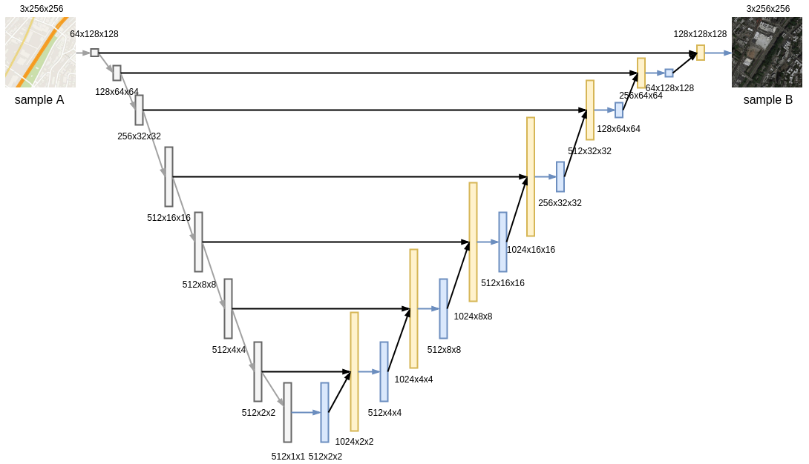
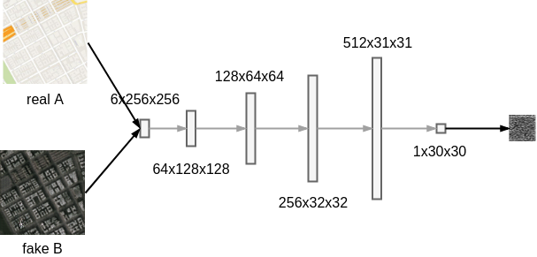
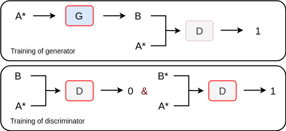
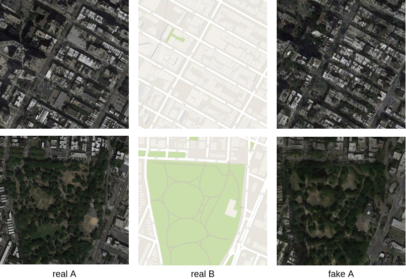
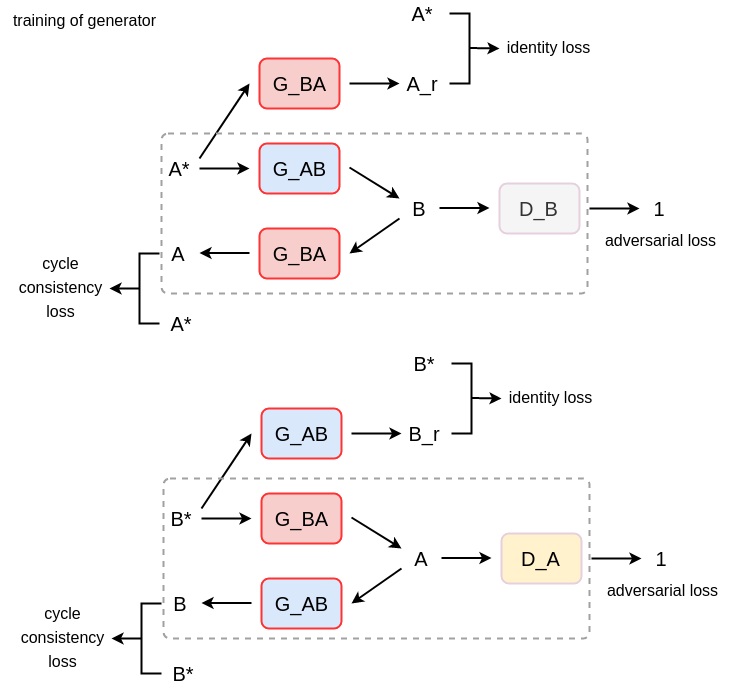
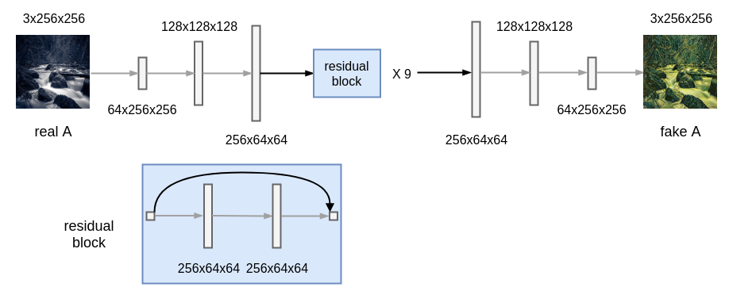
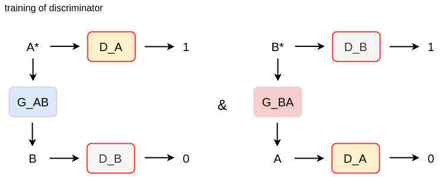

# 图像到图像翻译及其应用

在本章中，我们将把基于标签的图像生成推向一个新水平：我们将使用像素级标注来执行图像到图像的翻译，并传输图像风格。

您将学习如何使用像素级标签信息来执行 pix2pix 的图像到图像翻译，并使用 pix2pixHD 来翻译高分辨率图像。随后，您将学习如何在未成对的图像集合之间执行风格转移与 CycleGAN。

到本章末，结合前一章的知识，您将掌握使用基于图像和像素级标签信息来提高生成图像质量或操作生成图像属性的核心方法论。您还将学会如何灵活设计模型架构以实现您的目标，包括生成更大的图像或在不同风格的图像之间传输纹理。

本章将涵盖以下主题：

+   使用像素级标签来执行与 pix2pix 的图像翻译

+   Pix2pixHD – 高分辨率图像翻译

+   CycleGAN – 从未成对的集合进行图像到图像的翻译

# 使用像素级标签来执行与 pix2pix 的图像翻译

在上一章中，我们学习了如何使用标签和属性等辅助信息来提高 GAN 生成的图像质量。我们在上一章中使用的标签是基于图像的，这意味着每个图像只有一个或几个标签。标签可以分配给特定的像素，这些像素被称为像素级标签。像素级标签在深度学习领域中的作用越来越重要。例如，最著名的在线图像分类比赛之一，**ImageNet 大规模视觉识别挑战**（**ILSVRC**，[`www.image-net.org/challenges/LSVRC`](http://www.image-net.org/challenges/LSVRC/)），自 2017 年最后一次活动后不再举办，而像 COCO（[`cocodataset.org`](http://cocodataset.org)）这样的对象检测和分割挑战却越来越受到关注。

像素级标注的一个标志性应用是语义分割。**语义分割**（或图像/对象分割）是一个任务，其中图像中的每个像素必须属于一个对象。语义分割最有前途的应用是自动驾驶汽车。如果自动驾驶汽车上安装的摄像头捕获的每个像素都被正确分类，图像中的所有对象都将容易被识别，这使得车辆能够更轻松地分析当前环境并做出正确的决策，例如转弯或减速以避开其他车辆和行人。要了解更多关于语义分割的信息，请参考以下链接：[`devblogs.nvidia.com/image-segmentation-using-digits-5`](https://devblogs.nvidia.com/image-segmentation-using-digits-5)。

将原始彩色图像转换为分割图（如下图所示）可以视为图像到图像的翻译问题，这是一个更广泛的领域，包括风格迁移、图像上色等。**图像风格迁移**是指将一种图像中的标志性纹理和颜色转移到另一张图像上，例如将你的照片与文森特·梵高的画作结合，创作一幅独特的艺术肖像。**图像上色**是一个任务，我们将一张单通道的灰度图像输入模型，让它预测每个像素的颜色信息，从而得到一张三通道的彩色图像。

GANs 也可以用于图像到图像的翻译。在这一节中，我们将使用经典的图像到图像翻译模型 pix2pix，将图像从一个领域转换到另一个领域。Pix2pix 由 Phillip Isola、Jun-Yan Zhu、Tinghui Zhou 等人在他们的论文《*带条件对抗网络的图像到图像翻译*》中提出。Pix2pix 的设计旨在学习成对图像集合之间的关系，例如将卫星拍摄的航拍图像转换为普通地图，或者将素描图像转换为彩色图像，反之亦然。

论文的作者友好地提供了他们工作的完整源代码，该代码在 PyTorch 1.3 上运行完美。源代码也很好地组织起来。因此，我们将直接使用他们的代码来训练和评估 pix2pix 模型，并学习如何以不同的方式组织我们的模型。

首先，打开一个终端并使用以下命令下载本节的代码。此代码也可以在本章代码库中的`pix2pix`目录下找到：

```py
$ git clone https://github.com/junyanz/pytorch-CycleGAN-and-pix2pix.git
```

然后，`安装`必要的前提条件，以便在训练过程中能够可视化结果：

```py
$ pip install dominate visdom
```

# 生成器架构

pix2pix 生成器网络的架构如下：



pix2pix 的生成器架构

在这里，我们假设输入和输出数据都是三通道的 256x256 图像。为了说明 pix2pix 的生成器结构，特征图用彩色块表示，卷积操作用灰色和蓝色箭头表示，其中灰色箭头表示用于减少特征图大小的卷积层，蓝色箭头表示用于加倍特征图大小的卷积层。身份映射（包括跳跃连接）用黑色箭头表示。

我们可以看到，这个网络的前半部分逐步将输入图像转换为 1x1 的特征图（并且通道更宽），后半部分将这些非常小的特征图转换为与输入图像相同大小的输出图像。它将输入数据压缩为较低的维度，然后再将其恢复为原始维度。因此，这种 U 形的网络结构通常被称为 U-Net。U-Net 中还有许多跳跃连接，它们连接镜像层，以帮助信息（包括前向传播中来自先前层的细节和后向传播中来自后续层的梯度）在网络中流动。如果没有这些跳跃连接，这个网络也可以称为编码器-解码器模型，意思是我们在编码器的末尾堆叠了一个解码器。

pix2pix 模型在`models.pix2pix_model.Pix2PixModel`类中定义，该类继承自一个**抽象基类**（**ABC**），即`models.base_model.BaseModel`。

Python 中的**抽象基类**是一个包含至少一个**抽象方法**（已声明但未实现）的类。它不能被实例化。你只能在提供所有抽象方法的实现后，使用它的子类创建对象。

生成器网络`netG`是由`models.networks.define_G`方法创建的。默认情况下，它使用`'unet_256'`作为`netG`参数值（该值在`models/pix2pix_model.py`的第 32 行指定，并覆盖了`options/base_options.py`中第 34 行初始化的值，即`"resnet_9blocks"`）。因此，`models.networks.UnetGenerator`被用来创建 U-Net。为了展示 U-Net 是如何递归创建的，我们将参数替换为它们的实际值，如下代码所示：

```py

import torch.nn as nn
class UnetGenerator(nn.Module):
    def __init__(self):
        super(UnetGenerator, self).__init__()
        unet_block = UnetSkipConnectionBlock(64 * 8, 64 * 8, submodule=None, innermost=True)
        for i in range(8 - 5):
            unet_block = UnetSkipConnectionBlock(64 * 8, 64 * 8, submodule=unet_block, use_dropout=True)
        unet_block = UnetSkipConnectionBlock(64 * 4, 64 * 8, submodule=unet_block)
        unet_block = UnetSkipConnectionBlock(64 * 2, 64 * 4, submodule=unet_block)
        unet_block = UnetSkipConnectionBlock(64, 64 * 2, submodule=unet_block)
        self.model = UnetSkipConnectionBlock(3, 64, input_nc=3, submodule=unet_block, outermost=True)

    def forward(self, input):
        return self.model(input)
```

在前面的代码片段的第 4 行，定义了最内层的块，它创建了 U-Net 中间部分的层。最内层的块定义如下。请注意，以下代码应视为伪代码，因为它只是用来展示不同块是如何设计的：

```py
class UnetSkipConnectionBlock(nn.Module):
    # Innermost block */
    def __init__(self):
        down = [nn.LeakyReLU(0.2, inplace=True),
                nn.Conv2d(64 * 8, 64 * 8, kernel_size=4,
                          stride=2, padding=1, bias=False)]
        up = [nn.ReLU(inplace=True),
              nn.ConvTranspose2d(64 * 8, 64 * 8,
                                 kernel_size=4, stride=2,
                                 padding=1, bias=False),
              nn.BatchNorm2d(64 * 8)]
        model = down + up
        self.model = nn.Sequential(*model)

    def forward(self, x):
        return torch.cat([x, self.model(x)], 1)
```

`down`中的`nn.Conv2d`层将 2x2 的输入特征图转换为 1x1 的特征图（因为`kernel_size`=4 且`padding`=1），然后`nn.ConvTranspose2d`层将它们转置回 2x2 大小。

记得`nn.Conv2d`和`nn.ConvTranspose2d`的输出大小计算公式吗？卷积的输出大小是，而转置卷积的输出大小是。

在前向传播中，它将输出与跳跃连接（即输入 *x* 本身）沿深度通道拼接，这样就将通道数翻倍（并导致前面图中第一个 1,024 通道的特征图）。

在设计复杂网络时，已观察到将两个分支的特征图进行拼接比它们的求和效果更好，因为拼接保留了更多的信息。当然，拼接也会稍微增加内存的开销。

然后，其他层按递归方式构建，如下所示：

```py
class UnetSkipConnectionBlock(nn.Module):
    # Other blocks */
    def __init__(self, out_channels, in_channels, submodule, use_dropout):
        down = [nn.LeakyReLU(0.2, inplace=True),
                nn.Conv2d(out_channels, in_channels, kernel_size=4,
                          stride=2, padding=1, bias=False),
                nn.BatchNorm2d(in_channels)]
        up = [nn.ReLU(inplace=True),
              nn.ConvTranspose2d(in_channels * 2, out_channels,
                                 kernel_size=4, stride=2,
                                 padding=1, bias=False),
              nn.BatchNorm2d(out_channels)]
        if use_dropout:
            model = down + [submodule] + up + [nn.Dropout(0.5)]
        else:
            model = down + [submodule] + up
        self.model = nn.Sequential(*model)

    def forward(self, x):
        return torch.cat([x, self.model(x)], 1)
```

尽管在`models.networks.UnetGenerator`中，`unet_block`对象作为`submodule`递归传递给新的`unet_block`，但由于张量实现的紧凑设计，实际模块会正确地在内存中创建和保存。

最后，第一层和最后一层（可以在最外层块中看到）定义如下：

```py
class UnetSkipConnectionBlock(nn.Module):
    # Outermost block */
    def __init__(self):
        down = [nn.Conv2d(3, 64, kernel_size=4,
                          stride=2, padding=1, bias=False)]
        up = [nn.ReLU(inplace=True),
              nn.ConvTranspose2d(64 * 2, 3,
                                 kernel_size=4, stride=2,
                                 padding=1),
              nn.Tanh()]
        model = down + [submodule] + up
        self.model = nn.Sequential(*model)

    def forward(self, x):
        return self.model(x)
```

生成器网络中的所有卷积核都基于均值为 0、标准差为 0.02 的正态分布进行初始化。所有批量归一化层中的缩放因子则基于均值为 1、标准差为 0.02 的正态分布进行初始化。

# 判别器架构

pix2pix 的判别器网络架构如下：



pix2pix 的判别器架构

一对样本（每个集合中各取一个）沿深度通道进行拼接，这个 6 通道的图像被视为判别器网络的实际输入。判别器网络将 6 通道 256x256 的图像映射为 1 通道 30x30 的图像，用于计算判别器损失。

判别器网络`netD`是通过`models.networks.define_G`方法创建的。默认情况下，它将`"basic"`作为`netD`的参数值，这在`options/base_options.py`的第 33 行中定义。`models.networks.NLayerDiscriminator`模块（其`n_layer=3`）被初始化以作为判别器网络。为了简化代码，便于阅读，我们已经对代码进行了简化。你可以参考`models/networks.py`文件中的完整代码：

```py
class NLayerDiscriminator(nn.Module):
    def __init__(self, n_layers=3):
        super(NLayerDiscriminator, self).__init__()
        sequence = [nn.Conv2d(3 + 3, 64, kernel_size=4, stride=2, padding=1),
                    nn.LeakyReLU(0.2, True)]
        channel_scale = 1
        channel_scale_prev = 1
        for n in range(1, n_layers):
            channel_scale_prev = channel_scale
            channel_scale = 2**n
            sequence += [
                nn.Conv2d(64 * channel_scale_prev, 64 * channel_scale, kernel_size=4, stride=2, padding=1, bias=False),
                nn.BatchNorm2d(64 * channel_scale),
                nn.LeakyReLU(0.2, True)
            ]
        channel_scale_prev = channel_scale
        sequence += [
            nn.Conv2d(64 * channel_scale_prev, 64 * 8, kernel_size=4, stride=1, padding=1, bias=False),
            nn.BatchNorm2d(64 * 8),
            nn.LeakyReLU(0.2, True)
        ]
        sequence += [nn.Conv2d(64 * 8, 1, kernel_size=4, stride=1, padding=1)]
        self.model = nn.Sequential(*sequence)

    def forward(self, input):
        return self.model(input)
```

这里，我们提供了一段简短的代码，以便在模型创建时打印所有特征图的大小，如下所示：

```py
class SomeModel(nn.Module):
    def __init__(self):
        super(SomeModel, self).__init__()
        sequence = [layer1, layer2, ...]
        self.model = nn.Sequential(*sequence)

    def forward(self, input):
        return self.model(input)
```

你可以将`return self.model(input)`这一行替换为以下代码，以检查所有层中的特征图大小（包括归一化和激活函数层）：

```py
 def forward(self, input):
 x = input
 for i in range(len(self.model)):
 print(x.shape)
 x = self.modeli
 print(x.shape)
 return x
```

另外，你可以始终使用 TensorBoard 或其他工具，我们将在本书的最后一章介绍这些工具，以便你可以轻松查看模型的架构。

判别器网络生成一个 30x30 的特征图来表示损失。这样的架构被称为**PatchGAN**，意味着原始图像中的每个小图像块都会映射到最终损失图中的一个像素。PatchGAN 的一个大优点是，它可以处理任意大小的输入图像，只要标签已经转换为与损失图相同的大小。它还根据局部图像块的质量评估输入图像的质量，而不是根据其全局属性。这里，我们将展示如何计算图像块的大小（即 70）。

首先，让我们考虑一个单独的卷积层，卷积核大小为`k`，步幅为`s`。对于输出特征图中的每个像素，其值仅由输入图像中与卷积核大小相同的小块像素决定。

当卷积层超过两个时，输入补丁的大小可以通过以下公式计算：


因此，可以获得判别器网络中每一层输出特征图中单个像素对应的输入补丁大小：

+   第五层（k=4，s=1）：输入补丁的大小是 4（即卷积核的大小）

+   第四层（k=4，s=1）：输入补丁的大小是 4+1*(4-1)=7

+   第三层（k=4，s=2）：输入补丁的大小是 4+2*(7-1)=16

+   第二层（k=4，s=2）：输入补丁的大小是 4+2*(16-1)=34

+   第一层（k=4，s=2）：输入补丁的大小是 4+2*(34-1)=70

这意味着所有这些 70x70 重叠的图像块会通过卷积层转换为 30x30 损失图中的独立像素。任何超出这个 70x70 图像块的像素都不会对损失图中的相应像素产生影响。

# pix2pix 的训练和评估

pix2pix 的训练与我们在前一章中介绍的条件 GAN 非常相似。在训练判别器网络时，一对真实数据和标签应映射为 1，而一对生成的数据和标签（该假数据是由生成器生成的）应映射为 0。当训练生成器网络时，梯度会通过判别器和生成器网络，当生成器网络中的参数被更新时。这些生成的数据和标签应由判别器网络映射为 1。主要的区别是，条件 GAN 中的标签是基于图像的，而 pix2pix 中的标签是基于像素的。这个过程在下面的图示中进行了说明：



图像级和像素级标签 GAN 的基本训练过程。A* 和 B* 表示真实样本。红框中的网络实际上会被更新。

请注意，在训练 pix2pix 时，为了使生成的样本尽可能与真实样本相似，在训练生成器网络时，损失函数中会额外添加一个项，具体如下：


这里，表示生成样本与来自配对集合的真实样本之间的 L1 损失。L1 损失的目的是保留图像中的低频信息，以获得更好的图像质量。

值得一提的是，仅使用 L1 范数或 L2 范数将会生成模糊或块状的图像。对此的简短解释可以在此找到：[`wiseodd.github.io/techblog/2017/02/09/why-l2-blurry`](https://wiseodd.github.io/techblog/2017/02/09/why-l2-blurry)。在传统的图像恢复方法中，常常将它们用作正则化项，其中恢复图像的梯度控制图像的清晰度。如果你对 L1 损失和 L2 损失在图像处理领域的作用感兴趣，可以查看 Tony F. Chan 和 C.K. Wong 于 1998 年发表的著名论文《*Total variation blind deconvolution*》。

现在，我们可以定义 pix2pix 的训练过程，如下所示（伪代码）：

```py
class Pix2PixModel(BaseModel):
    def __init__(self):
        BaseModel.__init__(self)
        self.netG = networks.define_G()
        self.netD = networks.define_D()

        self.criterionGAN = torch.nn.BCEWithLogitsLoss()
        self.criterionL1 = torch.nn.L1Loss()
        self.optimizer_G = torch.optim.Adam(self.netG.parameters(), lr=0.0002, betas=(0.5, 0.999))
        self.optimizer_D = torch.optim.Adam(self.netD.parameters(), lr=0.0002, betas=(0.5, 0.999))
        self.optimizers.append(self.optimizer_G)
        self.optimizers.append(self.optimizer_D)

    def forward(self):
        self.fake_B = self.netG(self.real_A)

    def backward_D(self):
        fake_AB = torch.cat((self.real_A, self.fake_B), 1)
        pred_fake = self.netD(fake_AB.detach())
        self.loss_D_fake = self.criterionGAN(pred_fake, False)

        real_AB = torch.cat((self.real_A, self.real_B), 1)
        pred_real = self.netD(real_AB)
        self.loss_D_real = self.criterionGAN(pred_real, True)

        self.loss_D = (self.loss_D_fake + self.loss_D_real) * 0.5
        self.loss_D.backward()

    def backward_G(self):
        fake_AB = torch.cat((self.real_A, self.fake_B), 1)
        pred_fake = self.netD(fake_AB)
        self.loss_G_GAN = self.criterionGAN(pred_fake, True)

        self.loss_G_L1 = self.criterionL1(self.fake_B, self.real_B)

        self.loss_G = self.loss_G_GAN + self.loss_G_L1 * 100.0
        self.loss_G.backward()

    def optimize_parameters(self):
        self.forward()
        # update D
        self.set_requires_grad(self.netD, True)
        self.optimizer_D.zero_grad()
        self.backward_D()
        self.optimizer_D.step()
        # update G
        self.set_requires_grad(self.netD, False)
        self.optimizer_G.zero_grad()
        self.backward_G()
        self.optimizer_G.step()
```

`Pix2PixModel`类的作用类似于前一章`build_gan.py`中的`Model`类，用于创建生成器和判别器网络，定义它们的优化器，并控制网络的训练过程。

现在，让我们下载一些图像并训练 pix2pix 模型来执行图像到图像的转换。

运行`datasets/download_pix2pix_dataset.sh`脚本以下载数据集文件，具体如下：

```py
$ ./datasets/download_pix2pix_dataset.sh maps
```

或者，你可以访问[`efrosgans.eecs.berkeley.edu/pix2pix/datasets/`](http://efrosgans.eecs.berkeley.edu/pix2pix/datasets/)手动下载数据集文件，并将其解压到你喜欢的任何位置（例如，外部硬盘`/media/john/HouseOfData/image_transfer/maps`）。地图数据集文件大约为 239 MB，包含在训练集、验证集和测试集中的 1,000 多张图像。

请注意，地图数据集中的集合 A 包含卫星照片，而集合 B 包含地图图像，这与前面小节中所展示的图示相反。

接下来，打开终端并运行以下脚本以开始训练。确保修改`dataroot`参数以指定你自己的位置。你也可以尝试其他数据集，并将`direction`从`BtoA`更改为`AtoB`，以更改两个图像集合之间的转换方向：

```py
$ python train.py --dataroot /media/john/HouseOfData/image_transfer/maps --name maps_pix2pix --model pix2pix --direction BtoA
```

在第一次训练时，你可能会遇到错误提示`Could not connect to Visdom server`。这是因为训练脚本调用了`Visdom`模块来动态更新生成结果，以便我们通过网页浏览器监控训练过程。你可以手动打开`checkpoints/maps_pix2pix/web/index.html`文件，用你喜欢的浏览器来查看生成的图像，随着模型的训练进行监控。请注意，关闭浏览器中的`index.html`页面可能会导致训练过程冻结。

完成 200 个训练周期大约需要 6.7 小时，并且在 GTX 1080Ti 显卡上大约需要 1,519 MB 的 GPU 内存。

结果也保存在`checkpoints/maps_pix2pix/web/images`目录中。通过此方法生成的图像如下所示：



由 pix2pix 生成的图像

正如我们所看到的，生成的卫星照片看起来相当可信。与真实的卫星照片相比，它们在公园小径两旁的树木组织方面做得相当好。

在本节中，我们成功地生成了 256x256 的图像。在下一节中，我们将学习如何使用 pix2pix 的升级版本：pix2pixHD 生成高分辨率图像。

# Pix2pixHD - 高分辨率图像转换

Pix2pixHD 由 Ting-Chun Wang、Ming-Yu Liu 和 Jun-Yan Zhu 等人在他们的论文*《高分辨率图像合成与语义操作与条件 GANs》*中提出，是 pix2pix 模型的升级版。pix2pixHD 相比于 pix2pix 的最大改进在于，它支持 2,048x1,024 分辨率的图像到图像的转换，并且具有更高的质量。

# 模型架构

为了实现这一点，他们设计了一个两阶段的方案，逐步训练并优化网络，如下图所示。首先，一个分辨率为 1,024x512 的低分辨率图像由生成器网络生成，，称为**全局生成器**（红框）。其次，该图像由另一个生成器网络放大，，称为**局部增强网络**，使其大小接近 2,048x1,024（黑框）。也可以在最后加入另一个局部增强网络来生成 4,096x2,048 的图像。请注意，中的最后一个特征图也通过逐元素求和的方式插入到（在残差块之前），以便将更多的全局信息引入到更高分辨率的图像中：


pix2pixHD 中生成器模型的架构（图片摘自 T. C. Wang 等人 2018 年的论文）

pix2pixHD 中的判别器网络也是以多尺度的方式设计的。三个相同的判别器网络分别在不同的图像尺度（原始大小、1/2 大小和 1/4 大小）上工作，并且它们的损失值会加在一起。作者报告称，如果判别器没有多尺度设计，生成的图像中常常会出现重复的模式。此外，一个额外的项，称为**特征匹配损失**，被添加到最终的判别器损失中，如下公式所示：


这里， 测量生成图像与真实图像在判别器网络多个层次上特征图的 L1 损失。它迫使生成器在不同尺度上近似真实数据，从而生成更为逼真的图像。

有时候，几个具有相同标签的物体可能会被识别为同一物体，这会导致生成器难以正确区分这些物体。如果生成器能知道哪些像素属于哪个物体，而不是它们属于哪个类别，会有所帮助。因此，在 pix2pixHD 中，**实例边界图**（这是一个二值图，表示所有物体的边界）会按通道方式与语义标签图连接，然后再输入到生成器中。类似地，实例边界图也会与语义标签图和图像（生成的或真实的）连接，然后一起输入到判别器中。

此外，为了更方便地操作生成图像的属性，pix2pixHD 使用了一个额外的 **编码器** 来从真实图像中提取特征，并对特征进行实例级的平均池化（对每个物体的所有像素进行平均，然后将结果广播回这些像素）。这些特征也是生成器的输入之一。对每个类别中所有物体的特征进行 K-means 聚类，并在推理过程中为物体选择几种可用的纹理或颜色。

我们不会深入探讨 pix2pixHD 的具体架构设计，因为其源代码的主要结构与 pix2pix 类似。如果你感兴趣，可以查看源代码。

# 模型训练

pix2pixHD 的训练既耗时又耗内存。训练 2,048x1,024 图像大约需要 24 GB 的 GPU 内存。因此，我们将只在 1,024x512 分辨率下进行训练，以便将其适配到单张显卡上。

NVIDIA 已经将完整的 pix2pixHD 源代码开源，支持 PyTorch。我们需要做的就是下载源代码和数据集，来生成我们自己的高分辨率合成图像。现在就开始吧：

1.  安装先决条件（dominate 和 apex）。我们之前已经安装了 `dominate` 库。**Apex** 是由 NVIDIA 开发的一个混合精度和分布式训练库。

1.  使用 **自动混合精度** (**AMP**) 在训练过程中通过将标准浮点值替换为较低位数的浮点数来减少 GPU 内存消耗（甚至是训练时间）。

1.  在 Ubuntu 中打开终端，输入以下脚本来安装 `apex`：

```py
$ git clone https://github.com/NVIDIA/apex
$ cd apex
$ pip install -v --no-cache-dir --global-option="--cpp_ext" --global-option="--cuda_ext" .
```

1.  下载 pix2pixHD 的源代码（本章的代码库中也可以找到）：

```py
$ git clone https://github.com/NVIDIA/pix2pixHD
```

1.  使用 **Cityscapes** 数据集来训练 pix2pixHD 模型。它可以在 [`www.cityscapes-dataset.com`](https://www.cityscapes-dataset.com) 获取，您需要先注册才能获得下载链接。我们需要下载 `gtFine_trainvaltest.zip`（241 MB） 和 `leftImg8bit_trainvaltest.zip`（11 GB） 文件来进行此次实验。

1.  下载完成后，我们需要重新组织图像，以便训练脚本可以正确地获取图像：

+   将所有以 `_gtFine_instanceIds.png` 结尾的图像文件放入 `gtFine/train/*` 文件夹中，并将其放入 `datasets/cityscapes/train_inst` 目录中。

+   将所有以 `_gtFine_labelIds.png` 结尾的图像文件放入 `gtFine/train/*` 文件夹中，并将其放入 `datasets/cityscapes/train_label` 目录中。

+   将所有以 `_leftImg8bit.png` 结尾的图像文件放入 `leftImg8bit/train/*` 文件夹中，并将其放入 `datasets/cityscapes/train_img` 目录中。

1.  可以忽略测试和验证集，因为我们只需要训练图像。每个训练文件夹中应该有 2,975 张图像。

1.  运行 `scripts/train_512p.sh` 来启动训练过程，或者在终端中简单地输入以下内容：

```py
$ python train.py --name label2city_512p
```

所有中间结果（采用的参数、生成的图像、日志信息和模型文件）都将保存在 `checkpoints/label2city_512p` 文件夹中。您可以随时在您喜爱的浏览器中检查 `checkpoints/label2city_512p/web/index.html` 文件，或直接查看 `checkpoints/label2city_512p/web/images` 文件夹中的图像，以监视训练过程。

在经过 35 个周期（约 20 小时）的训练后，这里是结果：


在经过 35 个周期的 pix2pixHD 训练后生成的图像

在这里，我们可以看到模型已经根据实例地图中的标签信息找到了放置车辆、树木、建筑物和行人的位置，尽管这些对象在外观上仍有很大改进空间。有趣的是观察到模型试图将道路线放置在正确的位置，并且从被捕捉图像的汽车前盖上的徽章具有几乎完美的反射（这是有道理的，因为徽章和前盖在每张图像中都出现）。

如果你能够等待足够长的时间（大约 110 小时），结果将会非常令人印象深刻：


由 pix2pixHD 生成的图像（从 https://github.com/NVIDIA/pix2pixHD 检索的图像）

在 1,024x512 分辨率上训练大约需要 8,077 MB 的 GPU 内存。当启用 AMP（使用 `--fp16` 训练）时，GPU 内存消耗从一开始的 7,379 MB 逐渐增加到几个周期后的 7,829 MB，这确实比以前低。然而，训练时间几乎减少了一半。因此，目前应该不使用 AMP，直到未来其性能得到改进。

# CycleGAN – 来自无配对图像集的图像到图像翻译

你可能已经注意到，在训练 pix2pix 时，我们需要确定一个方向（`AtoB`或`BtoA`），即图像要被翻译到的方向。这是否意味着，如果我们想要在图像集 A 和图像集 B 之间自由地进行翻译，我们需要分别训练两个模型呢？我们要说的是，使用 CycleGAN 就不需要！

CycleGAN 是由 Jun-Yan Zhu、Taesung Park、Phillip Isola 等人提出的，发表在他们的论文《*使用循环一致性对抗网络进行无配对图像到图像的翻译*》中。它是一个基于无配对图像集的双向生成模型。CycleGAN 的核心思想基于循环一致性假设，这意味着如果我们有两个生成模型 G 和 F，它们在两个图像集 X 和 Y 之间进行翻译，其中 Y=G(X)，X=F(Y)，我们可以自然地假设 F(G(X))应该与 X 非常相似，而 G(F(Y))应该与 Y 非常相似。这意味着我们可以同时训练两组生成模型，它们可以在两个图像集之间自由翻译。

CycleGAN 专门为无配对图像集设计，这意味着训练样本不一定像我们在前几节中看到的 pix2pix 和 pix2pixHD 那样严格配对（例如，从相同视角的语义分割图与街景，或者常规地图与同一地点的卫星照片）。这使得 CycleGAN 不仅仅是一个图像到图像的翻译工具。它解锁了从任何类型的图像到你自己图像的**风格迁移**的潜力，例如，将苹果变成橙子、马变成斑马、照片变成油画，反之亦然。在这里，我们将使用风景照片和文森特·梵高的油画作为示例，展示 CycleGAN 是如何设计和训练的。

请注意，在本节中，代码布局与上一章中的 CGAN 类似。完整的源代码可以在本章的代码库中找到。模型在`cyclegan.py`中定义，训练过程在`build_gan.py`中定义，主入口位于`main.py`。源代码基于[`github.com/eriklindernoren/PyTorch-GAN`](https://github.com/eriklindernoren/PyTorch-GAN)提供的实现。值得一提的是，我们的实现训练速度比该实现快 1.2 倍，并且 GPU 内存占用减少了 28%。此外，在本章的第一部分，你可以找到 pix2pix 的源代码，其中也提供了 CycleGAN 的实现。你可以选择任何一个实现，因为两者之间没有太大区别。

# 基于循环一致性的模型设计

使用两对生成器和判别器网络，每对负责一个翻译方向。为了理解为什么 CycleGAN 是这样设计的，我们需要了解循环一致性是如何构建的。

在下图中，生成器，将样本 A 映射为样本 B，其性能由判别器，来衡量。与此同时，另一个生成器，，被训练来将样本 B 映射回样本 A，其性能由判别器，来衡量。在这个过程中，生成样本，与对应的真实样本，之间的距离，告诉我们模型中是否存在循环一致性，如下图中的虚线框所示。与之间的距离通过**循环一致性损失**来衡量，该损失形式为 L1 范数。

除了传统的**对抗损失**（与 1 之间的距离），还加入了**恒等损失**（意味着应该与非常接近），以帮助保持图像的颜色风格：



CycleGAN 中的损失计算。A*和 B*表示真实样本。由红框表示的网络在训练生成器时会更新。

这两个生成器网络，和，完全相同。生成器网络的架构可以在下图中看到。256x256 的输入图像经过多个卷积层下采样为 64x64，然后经过九个连续的残差块处理，最后通过卷积再次上采样回 256x256：



CycleGAN 中的生成器架构

我们将以一个名为`cyclegan.py`的空文件开始，如之前所提到的。让我们从导入开始：

```py
import torch
import torch.nn as nn
import torch.nn.functional as F
import numpy as np
```

接下来，我们将创建定义残差块的代码，如下所示：

```py
class ResidualBlock(nn.Module):
    def __init__(self, channels):
        super(ResidualBlock, self).__init__()

        block = [nn.ReflectionPad2d(1),
                 nn.Conv2d(channels, channels, 3),
                 nn.InstanceNorm2d(channels),
                 nn.ReLU(inplace=True),
                 nn.ReflectionPad2d(1),
                 nn.Conv2d(channels, channels, 3),
                 nn.InstanceNorm2d(channels)]
         self.block = nn.Sequential(*block)

     def forward(self, x):
         return x + self.block(x)
```

现在，我们可以定义生成器网络，如下所示：

```py
class Generator(nn.Module):
    def __init__(self, channels, num_blocks=9):
        super(Generator, self).__init__()
        self.channels = channels

        model = [nn.ReflectionPad2d(3)]
        model += self._create_layer(self.channels, 64, 7, stride=1, padding=0, transposed=False)
        # downsampling
        model += self._create_layer(64, 128, 3, stride=2, padding=1, transposed=False)
        model += self._create_layer(128, 256, 3, stride=2, padding=1, transposed=False)
        # residual blocks
        model += [ResidualBlock(256) for _ in range(num_blocks)]
        # upsampling
        model += self._create_layer(256, 128, 3, stride=2, padding=1, transposed=True)
        model += self._create_layer(128, 64, 3, stride=2, padding=1, transposed=True)
        # output
        model += [nn.ReflectionPad2d(3),
                  nn.Conv2d(64, self.channels, 7),
                  nn.Tanh()]

        self.model = nn.Sequential(*model)

    def _create_layer(self, size_in, size_out, kernel_size, stride=2, padding=1, transposed=False):
        layers = []
        if transposed:
            layers.append(nn.ConvTranspose2d(size_in, size_out, kernel_size, stride=stride, padding=padding, output_padding=1))
        else:
            layers.append(nn.Conv2d(size_in, size_out, kernel_size, stride=stride, padding=padding))
        layers.append(nn.InstanceNorm2d(size_out))
        layers.append(nn.ReLU(inplace=True))
        return layers

    def forward(self, x):
        return self.model(x)
```

如你所注意到的，在这里我们使用了`torch.nn.InstanceNorm2d`而不是`torch.nn.BatchNorm2d`。前者的归一化层更适合风格迁移。

同样，CycleGAN 中使用了两个相同的判别器网络，它们的关系可以在下图中看到：



CycleGAN 中两个判别器网络之间的关系。由红框表示的网络在训练时会更新。

判别器网络的架构几乎与 pix2pix 中的架构相同（该架构称为 PatchGAN），唯一不同的是输入图像的深度通道为 3，而不是 6，并且`torch.nn.BatchNorm2d`被替换成了`torch.nn.InstanceNorm2d`。

判别器网络定义的代码如下：

```py
class Discriminator(nn.Module):
    def __init__(self, channels):
        super(Discriminator, self).__init__()
        self.channels = channels

        self.model = nn.Sequential(
            *self._create_layer(self.channels, 64, 2, normalize=False),
            *self._create_layer(64, 128, 2),
            *self._create_layer(128, 256, 2),
            *self._create_layer(256, 512, 1),
            nn.Conv2d(512, 1, 4, stride=1, padding=1)
        )

    def _create_layer(self, size_in, size_out, stride, normalize=True):
        layers = [nn.Conv2d(size_in, size_out, 4, stride=stride, padding=1)]
        if normalize:
            layers.append(nn.InstanceNorm2d(size_out))
        layers.append(nn.LeakyReLU(0.2, inplace=True))
        return layers

    def forward(self, x):
        return self.model(x)
```

现在，让我们学习如何训练和评估模型。

# 模型训练与评估

现在，我们将创建`build_gan.py`文件。像往常一样，我们从导入开始：

```py
import itertools
import os
import time

from datetime import datetime

import numpy as np
import torch
import torchvision.utils as vutils
import utils

from cyclegan import Generator as cycG
from cyclegan import Discriminator as cycD
```

我们需要一个函数来初始化权重：

```py
def _weights_init(m):
    classname = m.__class__.__name__
    if classname.find('Conv') != -1:
        torch.nn.init.normal_(m.weight.data, 0.0, 0.02)
    elif classname.find('BatchNorm') != -1:
        torch.nn.init.normal_(m.weight.data, 1.0, 0.02)
        torch.nn.init.constant_(m.bias.data, 0.0)
```

现在，我们将创建`Model`类：

```py
class Model(object):
    def __init__(self,
                 name,
                 device,
                 data_loader,
                 test_data_loader,
                 channels,
                 img_size,
                 num_blocks):
        self.name = name
        self.device = device
        self.data_loader = data_loader
        self.test_data_loader = test_data_loader
        self.channels = channels
        self.img_size = img_size
        self.num_blocks = num_blocks
        assert self.name == 'cyclegan'
        self.netG_AB = cycG(self.channels, self.num_blocks)
        self.netG_AB.apply(_weights_init)
        self.netG_AB.to(self.device)
        self.netG_BA = cycG(self.channels, self.num_blocks)
        self.netG_BA.apply(_weights_init)
        self.netG_BA.to(self.device)
        self.netD_A = cycD(self.channels)
        self.netD_A.apply(_weights_init)
        self.netD_A.to(self.device)
        self.netD_B = cycD(self.channels)
        self.netD_B.apply(_weights_init)
        self.netD_B.to(self.device)
        self.optim_G = None
        self.optim_D_A = None
        self.optim_D_B = None
        self.loss_adv = torch.nn.MSELoss()
        self.loss_cyc = torch.nn.L1Loss()
        self.loss_iden = torch.nn.L1Loss()

    @property
    def generator_AB(self):
        return self.netG_AB

    @property
    def generator_BA(self):
        return self.netG_BA

    @property
    def discriminator_A(self):
        return self.netD_A

    @property
    def discriminator_B(self):
        return self.netD_B

    def create_optim(self, lr, alpha=0.5, beta=0.999):
        self.optim_G = torch.optim.Adam(itertools.chain(self.netG_AB.parameters(), self.netG_BA.parameters()),
                                        lr=lr,
                                        betas=(alpha, beta))
        self.optim_D_A = torch.optim.Adam(self.netD_A.parameters(),
                                          lr=lr,
                                          betas=(alpha, beta))
        self.optim_D_B = torch.optim.Adam(self.netD_B.parameters(),
                                          lr=lr,
                                          betas=(alpha, beta))
```

之前展示了生成器和判别器网络的训练过程。在这里，我们将深入探讨`build_gan.train()`的实现。

首先，我们需要训练生成器网络：

```py
def train(self,
          epochs,
          log_interval=100,
          out_dir='',
          verbose=True):
        self.netG_AB.train()
        self.netG_BA.train()
        self.netD_A.train()
        self.netD_B.train()
        lambda_cyc = 10
        lambda_iden = 5
        real_label = torch.ones((self.data_loader.batch_size, 1, self.img_size//2**4, self.img_size//2**4), device=self.device)
        fake_label = torch.zeros((self.data_loader.batch_size, 1, self.img_size//2**4, self.img_size//2**4), device=self.device)
        image_buffer_A = utils.ImageBuffer()
        image_buffer_B = utils.ImageBuffer()
        total_time = time.time()
        for epoch in range(epochs):
            batch_time = time.time()
            for batch_idx, data in enumerate(self.data_loader):
                real_A = data['trainA'].to(self.device)
                real_B = data['trainB'].to(self.device)

                # Train G
                self.optim_G.zero_grad()

                # adversarial loss
                fake_B = self.netG_AB(real_A)
                _loss_adv_AB = self.loss_adv(self.netD_B(fake_B),  
                  real_label)
                fake_A = self.netG_BA(real_B)
                _loss_adv_BA = self.loss_adv(self.netD_A(fake_A), 
                  real_label)
                adv_loss = (_loss_adv_AB + _loss_adv_BA) / 2

                # cycle loss
                recov_A = self.netG_BA(fake_B)
                _loss_cyc_A = self.loss_cyc(recov_A, real_A)
                recov_B = self.netG_AB(fake_A)
                _loss_cyc_B = self.loss_cyc(recov_B, real_B)
                cycle_loss = (_loss_cyc_A + _loss_cyc_B) / 2

                # identity loss
                _loss_iden_A = self.loss_iden(self.netG_BA(real_A), real_A)
                _loss_iden_B = self.loss_iden(self.netG_AB(real_B), real_B)
                iden_loss = (_loss_iden_A + _loss_iden_B) / 2

                g_loss = adv_loss + lambda_cyc * cycle_loss + 
                  lambda_iden * iden_loss
                g_loss.backward()
                self.optim_G.step()
```

然后，我们需要训练判别器网络：

```py
                # Train D_A
                self.optim_D_A.zero_grad()

                _loss_real = self.loss_adv(self.netD_A(real_A), real_label)
                fake_A = image_buffer_A.update(fake_A)
                _loss_fake = self.loss_adv(self.netD_A(fake_A.detach()), 
                 fake_label)
                d_loss_A = (_loss_real + _loss_fake) / 2

                d_loss_A.backward()
                self.optim_D_A.step()

                # Train D_B
                self.optim_D_B.zero_grad()

                _loss_real = self.loss_adv(self.netD_B(real_B), real_label)
                fake_B = image_buffer_B.update(fake_B)
                _loss_fake = self.loss_adv(self.netD_B(fake_B.detach()), 
                  fake_label)
                d_loss_B = (_loss_real + _loss_fake) / 2

                d_loss_B.backward()
                self.optim_D_B.step()

                d_loss = (d_loss_A + d_loss_B) / 2
```

最后的变量`d_loss`仅用于日志记录，这里已省略。如果你想了解更多关于日志打印和图像导出的内容，可以参考本章的源代码文件：

```py
                if verbose and batch_idx % log_interval == 0 and batch_idx > 0:
                    print('Epoch {} [{}/{}] loss_D: {:.4f} loss_G: {:.4f} time: {:.2f}'.format(
                          epoch, batch_idx, len(self.data_loader),
                          d_loss.mean().item(),
                          g_loss.mean().item(),
                          time.time() - batch_time))
                    with torch.no_grad():
                        imgs = next(iter(self.test_data_loader))
                        _real_A = imgs['testA'].to(self.device)
                        _fake_B = self.netG_AB(_real_A)
                        _real_B = imgs['testB'].to(self.device)
                        _fake_A = self.netG_BA(_real_B)
                        viz_sample = torch.cat(
                            (_real_A, _fake_B, _real_B, _fake_A), 0)
                        vutils.save_image(viz_sample,
                                          os.path.join(
                                              out_dir, 'samples_{}_{}.png'.format(epoch, batch_idx)),
                                          nrow=self.test_data_loader.batch_size,
                                          normalize=True)
                    batch_time = time.time()

            self.save_to(path=out_dir, name=self.name, verbose=False)
        if verbose:
            print('Total train time: {:.2f}'.format(time.time() - total_time))
   def eval(self,
             batch_size=None):
        self.netG_AB.eval()
        self.netG_BA.eval()
        self.netD_A.eval()
        self.netD_B.eval()
        if batch_size is None:
            batch_size = self.test_data_loader.batch_size

        with torch.no_grad():
            for batch_idx, data in enumerate(self.test_data_loader):
                _real_A = data['testA'].to(self.device)
                _fake_B = self.netG_AB(_real_A)
                _real_B = data['testB'].to(self.device)
                _fake_A = self.netG_BA(_real_B)
                viz_sample = torch.cat((_real_A, _fake_B, _real_B, _fake_A), 0)
                vutils.save_image(viz_sample,
                                  'img_{}.png'.format(batch_idx),
                                  nrow=batch_size,
                                  normalize=True)

    def save_to(self,
                path='',
                name=None,
                verbose=True):
        if name is None:
            name = self.name
        if verbose:
            print('\nSaving models to {}_G_AB.pt and such ...'.format(name))
        torch.save(self.netG_AB.state_dict(), os.path.join(
            path, '{}_G_AB.pt'.format(name)))
        torch.save(self.netG_BA.state_dict(), os.path.join(
            path, '{}_G_BA.pt'.format(name)))
        torch.save(self.netD_A.state_dict(), os.path.join(
            path, '{}_D_A.pt'.format(name)))
        torch.save(self.netD_B.state_dict(), os.path.join(
            path, '{}_D_B.pt'.format(name)))

    def load_from(self,
                  path='',
                  name=None,
                  verbose=True):
        if name is None:
            name = self.name
        if verbose:
            print('\nLoading models from {}_G_AB.pt and such ...'.format(name))
        ckpt_G_AB = torch.load(os.path.join(path, '{}_G_AB.pt'.format(name)))
        if isinstance(ckpt_G_AB, dict) and 'state_dict' in ckpt_G_AB:
            self.netG_AB.load_state_dict(ckpt_G_AB['state_dict'], strict=True)
        else:
            self.netG_AB.load_state_dict(ckpt_G_AB, strict=True)
        ckpt_G_BA = torch.load(os.path.join(path, '{}_G_BA.pt'.format(name)))
        if isinstance(ckpt_G_BA, dict) and 'state_dict' in ckpt_G_BA:
            self.netG_BA.load_state_dict(ckpt_G_BA['state_dict'], strict=True)
        else:
            self.netG_BA.load_state_dict(ckpt_G_BA, strict=True)
        ckpt_D_A = torch.load(os.path.join(path, '{}_D_A.pt'.format(name)))
        if isinstance(ckpt_D_A, dict) and 'state_dict' in ckpt_D_A:
            self.netD_A.load_state_dict(ckpt_D_A['state_dict'], strict=True)
        else:
            self.netD_A.load_state_dict(ckpt_D_A, strict=True)
        ckpt_D_B = torch.load(os.path.join(path, '{}_D_B.pt'.format(name)))
        if isinstance(ckpt_D_B, dict) and 'state_dict' in ckpt_D_B:
            self.netD_B.load_state_dict(ckpt_D_B['state_dict'], strict=True)
        else:            self.netD_B.load_state_dict(ckpt_D_B, strict=True)
```

在这里，正如论文中建议的那样，我们通过随机从生成的图像历史中选择一张图像来更新判别器，而不是实时从假样本中选择。生成图像的历史由`ImageBuffer`类维护，定义如下。请将上一章中的`utils.py`文件复制过来，并将`ImageBuffer`类添加到其中：

```py
class ImageBuffer(object):
    def __init__(self, depth=50):
        self.depth = depth
        self.buffer = []

    def update(self, image):
        if len(self.buffer) == self.depth:
            i = random.randint(0, self.depth-1)
            self.buffer[i] = image
        else:
            self.buffer.append(image)
        if random.uniform(0,1) > 0.5:
            i = random.randint(0, len(self.buffer)-1)
            return self.buffer[i]
        else:
            return image
```

我们还需要编写一个自定义数据集读取器，从不同的文件夹中提取未配对的图像。将以下内容放入一个名为`datasets.py`的新文件中：

```py
import glob
import random
import os

import torchvision

from torch.utils.data import Dataset
from PIL import Image

class ImageDataset(Dataset):
    def __init__(self, root_dir, transform=None, unaligned=False, mode='train'):
        self.transform = torchvision.transforms.Compose(transform)
        self.unaligned = unaligned
        self.train = (mode == 'train')

        self.files_A = sorted(glob.glob(os.path.join(root_dir, '%sA' % mode) + '/*.*'))
        self.files_B = sorted(glob.glob(os.path.join(root_dir, '%sB' % mode) + '/*.*'))

    def __getitem__(self, index):
        item_A = self.transform(Image.open(self.files_A[index % len(self.files_A)]))

        if self.unaligned:
            item_B = self.transform(Image.open(self.files_B[random.randint(0, len(self.files_B) - 1)]))
        else:
            item_B = self.transform(Image.open(self.files_B[index % len(self.files_B)]))

        if self.train:
            return {'trainA': item_A, 'trainB': item_B}
        else:
            return {'testA': item_A, 'testB': item_B}

    def __len__(self):
        return max(len(self.files_A), len(self.files_B))
```

画作和照片的形状并不总是方形的。因此，我们需要从原始图像中裁剪 256x256 的补丁。我们在`main.py`中预处理数据（**数据增强**）。这里我们只展示了一部分代码，你可以在`main.py`文件中找到其余部分：

```py
def main():
    device = torch.device("cuda:0" if FLAGS.cuda else "cpu")

    if FLAGS.train:
        print('Loading data...\n')
        transform = [transforms.Resize(int(FLAGS.img_size*1.12), Image.BICUBIC),
                     transforms.RandomCrop((FLAGS.img_size, FLAGS.img_size)),
                     transforms.RandomHorizontalFlip(),
                     transforms.ToTensor(),
                     transforms.Normalize((0.5,0.5,0.5), (0.5,0.5,0.5))]
        dataloader = DataLoader(ImageDataset(os.path.join(FLAGS.data_dir, FLAGS.dataset),
                                             transform=transform, unaligned=True, mode='train'),
                                batch_size=FLAGS.batch_size, shuffle=True, num_workers=2)
        test_dataloader = DataLoader(ImageDataset(os.path.join(FLAGS.data_dir, FLAGS.dataset),
                                                  transform=transform, unaligned=True, mode='test'),
                                     batch_size=FLAGS.test_batch_size, shuffle=True, num_workers=2)

        print('Creating model...\n')
        model = Model(FLAGS.model, device, dataloader, test_dataloader, FLAGS.channels, FLAGS.img_size, FLAGS.num_blocks)
        model.create_optim(FLAGS.lr)

        # Train
        model.train(FLAGS.epochs, FLAGS.log_interval, FLAGS.out_dir, True)
```

不要忘记调整 CycleGAN 的参数解析。记住，你应该更改`--data_dir`的默认值，使其与自己的设置匹配，因此请确保在命令行中包含以下内容：

```py
    parser.add_argument('--data_dir', type=str, default='/media/john/HouseOfData/image_transfer', help='Directory for dataset.')
    parser.add_argument('--dataset', type=str, default='vangogh2photo', help='Dataset name.')
    ...
    parser.add_argument('--num_blocks', type=int, default=9, help='number of residual blocks')
```

现在，是时候下载数据集并开始享受了！访问[`people.eecs.berkeley.edu/~taesung_park/CycleGAN/datasets`](https://people.eecs.berkeley.edu/~taesung_park/CycleGAN/datasets)手动下载数据集文件。或者，你可以使用位于 pix2pix 源代码中的`datasets/download_cyclegan_dataset.sh`脚本下载`vangogh2photo.zip`文件，该文件约为 292 MB，包含 400 张梵高画作和 7,038 张照片（其中 6,287 张用于训练，751 张用于测试）。下载完成后，将图像提取到一个文件夹中（例如，外部硬盘`/media/john/HouseOfData/image_transfer`）。

打开终端并键入以下脚本以开始训练：

```py
$ python main.py --dataset vangogh2photo
```

训练 CycleGAN 20 个周期大约需要 10 小时，并且在 GTX 1080Ti 显卡上消耗大约 4,031 MB 的 GPU 内存。以下图像中可以看到一些结果。在这里，我们可以看到 CycleGAN 的风格迁移能力非常惊人。你还可以访问这个网站，了解更多关于 CycleGAN 的应用：[`junyanz.github.io/CycleGAN`](https://junyanz.github.io/CycleGAN)：


CycleGAN 生成的图像。上面两行：从画作到照片；下面两行：从照片到画作。

# 摘要

我们已经在几个章节中熟悉了图像生成技术。尽管成功训练 GAN 生成惊艳图像总是充满挑战和成就感，但我们也应该认识到，GAN 还可以用来修复问题并恢复图像。

在下一章，我们将探讨 GAN 的生成能力，以解决图像修复中的一些挑战性问题。

# 进一步阅读

1.  Le J. (2018 年 5 月 3 日) *如何使用深度学习进行语义分割*。取自 [`medium.com/nanonets/how-to-do-image-segmentation-using-deep-learning-c673cc5862ef`](https://medium.com/nanonets/how-to-do-image-segmentation-using-deep-learning-c673cc5862ef)。

1.  Rainy J. (2018 年 2 月 12 日) *为视频稳定化神经风格转移*。取自 [`medium.com/element-ai-research-lab/stabilizing-neural-style-transfer-for-video-62675e203e42`](https://medium.com/element-ai-research-lab/stabilizing-neural-style-transfer-for-video-62675e203e42)。

1.  Isola P, Zhu JY, Zhou T, Efros A. (2017) *基于条件对抗网络的图像到图像翻译*。CVPR。

1.  Agustinus K. (2017 年 2 月 9 日) *为什么 L2 重建损失会导致模糊图像？* 取自 [`wiseodd.github.io/techblog/2017/02/09/why-l2-blurry`](https://wiseodd.github.io/techblog/2017/02/09/why-l2-blurry)。

1.  Chan T F, Wong C K. (1998) *总变分盲去卷积。IEEE 图像处理学报*。7(3): 370-375。

1.  Wang T C, Liu M Y, Zhu J Y, 等. (2018) *基于条件 GAN 的高分辨率图像合成与语义操作*。CVPR。

1.  Zhu J Y, Park T, Isola P, 等. (2017) *使用循环一致对抗网络的无配对图像到图像翻译*。ICCV。
