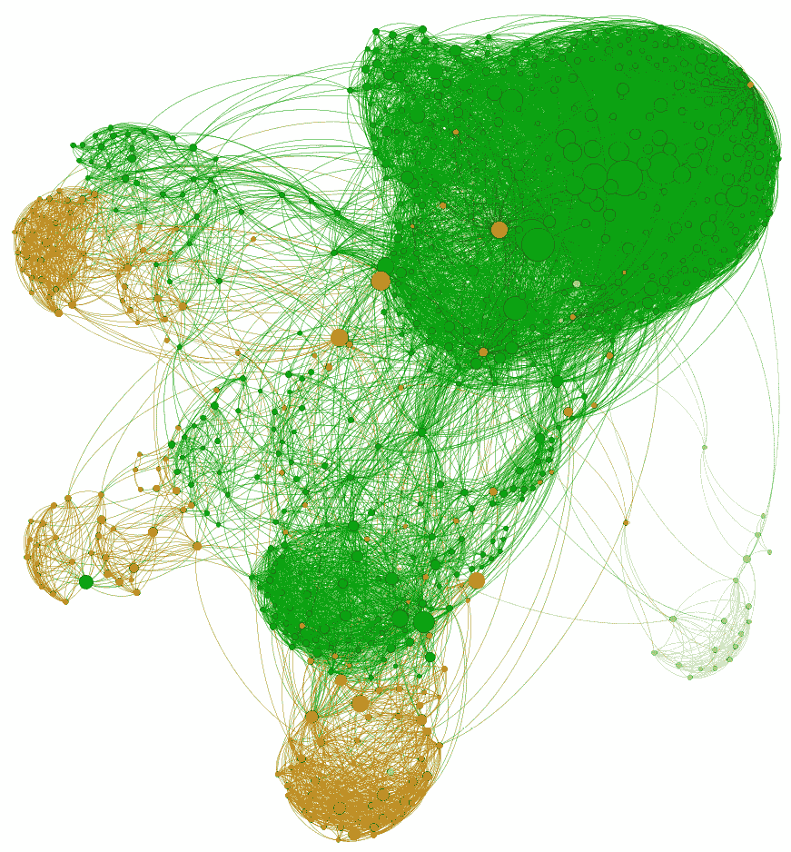
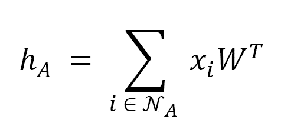

# 5

# 用香草神经网络在节点特征中包含节点特征

到目前为止，我们考虑的唯一类型的信息是图拓扑结构。然而，图形数据集往往比单纯的连接更丰富：节点和边缘也可以具有特征，用于表示分数、颜色、单词等等。将这些附加信息包含在我们的输入数据中对于产生最佳嵌入至关重要。事实上，这在机器学习中是自然而然的：节点和边缘特征具有与表格（非图形）数据集相同的结构。这意味着可以将传统技术应用于这些数据，例如神经网络。

在本章中，我们将介绍两个新的图形数据集：`Cora` 和 `Facebook Page-Page`。我们将看到**香草神经网络**如何仅将其视为表格数据集来处理节点特征。然后，我们将尝试在神经网络中包含拓扑信息。这将给我们带来我们第一个 GNN 架构：一个简单的模型，同时考虑节点特征和边缘。最后，我们将比较这两种架构的性能，并得到本书中最重要的结果之一。

通过本章结束时，您将掌握在 PyTorch 中实现香草神经网络和香草 GNN 的方法。您将能够将拓扑特征嵌入节点表示中，这是每个 GNN 架构的基础。这将允许您通过将表格数据集转换为图问题来大大提高模型的性能。

在本章中，我们将涵盖以下主题：

+   介绍图形数据集

+   使用香草神经网络对节点进行分类

+   使用香草图神经网络对节点进行分类

# 技术要求

本章的所有代码示例都可以在 GitHub 上找到：[`github.com/PacktPublishing/Hands-On-Graph-Neural-Networks-Using-Python/tree/main/Chapter05`](https://github.com/PacktPublishing/Hands-On-Graph-Neural-Networks-Using-Python/tree/main/Chapter05)。

在本书的*前言*中可以找到运行代码所需的安装步骤。

# 介绍图形数据集

我们在本章中将使用的图形数据集比 Zachary's Karate Club 更丰富：它们具有更多的节点、更多的边缘，并包含节点特征。在本节中，我们将介绍它们，以便更好地理解这些图形及如何使用 PyTorch Geometric 处理它们。以下是我们将使用的两个数据集：

+   `Cora` 数据集

+   `Facebook` `Page-Page` 数据集

让我们从较小的一个开始：流行的`Cora`数据集。

## Cora 数据集

由 Sen 等人于 2008 年提出 [1]，`Cora`（无许可）是科学文献中最流行的节点分类数据集。它代表了一个包含 2,708 篇出版物的网络，其中每个连接代表一个参考文献。每篇出版物用一个包含 1,433 个独特单词的二进制向量表示，其中 `0` 和 `1` 分别表示对应单词的缺失或存在。这种表示方法也被称为自然语言处理中的二进制 **词袋**。我们的目标是将每个节点分类到七个类别中的一个。

无论数据类型如何，可视化始终是理解我们面临问题的一个重要步骤。然而，图形很快就会变得太大，无法使用像 `networkx` 这样的 Python 库进行可视化。这就是为什么专门的工具被开发出来，专门用于图数据的可视化。在本书中，我们使用了两款最流行的工具：**yEd Live** ([`www.yworks.com/yed-live/`](https://www.yworks.com/yed-live/)) 和 **Gephi** ([`gephi.org/`](https://gephi.org/))。

以下图是使用 yEd Live 绘制的 `Cora` 数据集。你可以看到，节点以橙色表示对应的论文，绿色表示它们之间的连接。一些论文的互联性如此强，以至于它们形成了聚类。这些聚类应该比连接较差的节点更容易分类。


图 5.1 – 使用 yEd Live 可视化的 Cora 数据集

我们导入它并使用 PyTorch Geometric 分析它的主要特征。这个库有一个专门的类来下载数据集并返回相关的数据结构。我们假设这里已经安装了 PyTorch Geometric：

1.  我们从 PyTorch Geometric 导入 `Planetoid` 类：

    ```py
    from torch_geometric.datasets import Planetoid
    ```

1.  我们使用这个类下载它：

    ```py
    dataset = Planetoid(root=".", name="Cora")
    ```

1.  `Cora` 只有一个图，我们可以将其存储在一个专门的 `data` 变量中：

    ```py
    data = dataset[0]
    ```

1.  让我们打印出有关数据集的一般信息：

    ```py
    print(f'Dataset: {dataset}')
    print('---------------')
    print(f'Number of graphs: {len(dataset)}')
    print(f'Number of nodes: {data.x.shape[0]}')
    print(f'Number of features: {dataset.num_features}')
    print(f'Number of classes: {dataset.num_classes}')
    ```

1.  这给我们带来了以下输出：

    ```py
    Dataset: Cora()
    ---------------
    Number of graphs: 1
    Number of nodes: 2708
    Number of features: 1433
    Number of classes: 7
    ```

1.  我们还可以通过 PyTorch Geometric 的专门函数获得详细信息：

    ```py
    print(f'Graph:')
    print('------')
    print(f'Edges are directed: {data.is_directed()}')
    print(f'Graph has isolated nodes: {data.has_isolated_nodes()}')
    print(f'Graph has loops: {data.has_self_loops()}')
    ```

1.  这是前一个代码块的结果：

    ```py
    Graph:
    ------
    Edges are directed: False
    Graph has isolated nodes: False
    Graph has loops: False
    ```

第一个输出确认了关于节点数量、特征和类别的信息。第二个输出则提供了更多关于图形本身的见解：边是无向的，每个节点都有邻居，而且图中没有自环。我们可以使用 PyTorch Geometric 的 utils 函数测试其他属性，但在这个例子中不会学到任何新东西。

现在我们了解了更多关于 `Cora` 的信息，让我们来看一个更具代表性的，体现现实世界社交网络规模的数据集：`Facebook` `Page-Page` 数据集。

## Facebook Page-Page 数据集

该数据集由 Rozemberczki 等人在 2019 年提出[2]。它是通过 Facebook Graph API 于 2017 年 11 月创建的。在这个数据集中，22,470 个节点中的每一个代表一个官方 Facebook 页面。当两个页面之间有互相点赞时，它们会被连接。节点特征（128 维向量）是通过这些页面的所有者编写的文本描述创建的。我们的目标是将每个节点分类到四个类别之一：政治人物、公司、电视节目和政府组织。

`Facebook 页面-页面`数据集与前一个数据集相似：它是一个具有节点分类任务的社交网络。然而，它与`Cora`有三大不同之处：

+   节点的数量要高得多（2,708 与 22,470）

+   节点特征的维度大幅度降低（从 1,433 降到 128）

+   目标是将每个节点分类为四个类别，而不是七个类别（这更容易，因为选项更少）。

下图是使用 Gephi 可视化的数据集。首先，少量连接的节点已被过滤掉，以提高性能。剩余节点的大小取决于它们的连接数量，颜色表示它们所属的类别。最后，应用了两种布局：Fruchterman-Reingold 和 ForceAtlas2。



图 5.2 – 使用 Gephi 可视化的 Facebook 页面-页面数据集

我们可以以与`Cora`相同的方式导入`Facebook 页面-页面`数据集：

1.  我们从 PyTorch Geometric 导入`FacebookPagePage`类：

    ```py
    from torch_geometric.datasets import FacebookPagePage
    ```

1.  我们使用这个类下载它：

    ```py
    dataset = FacebookPagePage(root=".")
    ```

1.  我们将图存储在一个专用的`data`变量中：

    ```py
    data = dataset[0]
    ```

1.  让我们打印一下关于数据集的一般信息：

    ```py
    print(f'Dataset: {dataset}')
    print('-----------------------')
    print(f'Number of graphs: {len(dataset)}')
    print(f'Number of nodes: {data.x.shape[0]}')
    print(f'Number of features: {dataset.num_features}')
    print(f'Number of classes: {dataset.num_classes}')
    ```

1.  这会给我们以下输出：

    ```py
    Dataset: FacebookPagePage()
    -----------------------
    Number of graphs: 1
    Number of nodes: 22470
    Number of features: 128
    Number of classes: 4
    ```

1.  同样的专用函数可以在这里应用：

    ```py
    print(f'\nGraph:')
    print('------')
    print(f'Edges are directed: {data.is_directed()}')
    print(f'Graph has isolated nodes: {data.has_isolated_nodes()}')
    print(f'Graph has loops: {data.has_self_loops()}')
    ```

这是上一部分的结果：

```py
Graph:
------
Edges are directed: False
Graph has isolated nodes: False
Graph has loops: True
```

1.  与`Cora`不同，`Facebook 页面-页面`数据集默认没有训练、评估和测试掩码。我们可以使用`range()`函数随意创建掩码：

    ```py
    data.train_mask = range(18000)
    data.val_mask = range(18001, 20000)
    data.test_mask = range(20001, 22470)
    ```

另外，PyTorch Geometric 提供了一个转换函数，用来在加载数据集时计算随机掩码：

```py
import torch_geometric.transforms as T
dataset = Planetoid(root=".", name="Cora")
data = dataset[0]
```

第一个输出确认了我们在数据集描述中看到的节点和类别的数量。第二个输出告诉我们，这个图包含了`self`环路：一些页面与自己连接。这虽然让人惊讶，但实际上它不会影响结果，因为我们很快就会看到。

这是我们将在下一部分中使用的两个图数据集，用来比较普通神经网络与我们第一个图神经网络（GNN）的性能。让我们一步步实现它们。

# 使用普通神经网络进行节点分类

与 Zachary 的 Karate Club 数据集相比，这两个数据集包含了一种新的信息类型：节点特征。它们提供了关于图中节点的额外信息，例如社交网络中用户的年龄、性别或兴趣。在一个普通的神经网络（也称为**多层感知机**）中，这些嵌入将直接用于模型中执行下游任务，如节点分类。

在本节中，我们将把节点特征视为常规的表格数据集。我们将对该数据集训练一个简单的神经网络来对节点进行分类。请注意，这种架构并未考虑网络的拓扑结构。我们将在下一节中尝试解决这个问题并比较结果。

节点特征的表格数据集可以通过我们创建的`data`对象轻松访问。首先，我想将这个对象转换为常规的 pandas DataFrame，通过合并`data.x`（包含节点特征）和`data.y`（包含每个节点的类标签，标签来自七个类别）。在接下来的内容中，我们将使用`Cora`数据集：

```py
import pandas as pd
df_x = pd.DataFrame(data.x.numpy())
df_x['label'] = pd.DataFrame(data.y)
```

这将给我们带来以下数据集：

|  | **0** | **1** | **…** | **1432** | **标签** |
| --- | --- | --- | --- | --- | --- |
| **0** | 0 | 0 | … | 0 | 3 |
| **1** | 0 | 0 | … | 0 | 4 |
| **…** | … | … | … | … | … |
| **2707** | 0 | 0 | … | 0 | 3 |

图 5.3 – Cora 数据集的表格表示（不包含拓扑信息）

如果你熟悉机器学习，你可能会认识到一个典型的数据集，它包含数据和标签。我们可以开发一个简单的`data.x`，并用`data.y`提供的标签。

让我们创建我们自己的 MLP 类，并包含四个方法：

+   使用`__init__()`来初始化一个实例

+   使用`forward()`来执行前向传播

+   使用`fit()`来训练模型

+   使用`test()`来评估它

在训练模型之前，我们必须定义主要的评估指标。多分类问题有几种常见的评估指标：准确率、F1 分数、**接收者操作特征曲线下的面积**（**ROC AUC**）得分等。对于这项工作，我们实现一个简单的准确率，它定义为正确预测的比例。虽然这不是多分类问题中最好的评估指标，但它更容易理解。你可以自由地将其替换为你选择的指标：

```py
def accuracy(y_pred, y_true):
    return torch.sum(y_pred == y_true) / len(y_true)
```

现在，我们可以开始实际的实现。我们在本节中不需要使用 PyTorch Geometric 来实现 MLP。所有操作都可以通过常规的 PyTorch 按照以下步骤完成：

1.  我们从 PyTorch 导入所需的类：

    ```py
    import torch
    from torch.nn import Linear
    import torch.nn.functional as F
    ```

1.  我们创建了一个新的类`MLP`，它将继承`torch.nn.Module`的所有方法和属性：

    ```py
    class MLP(torch.nn.Module):
    ```

1.  `__init__()`方法有三个参数（`dim_in`、`dim_h` 和 `dim_out`），分别表示输入层、隐藏层和输出层中的神经元数量。我们还定义了两个线性层：

    ```py
        def __init__(self, dim_in, dim_h, dim_out):
            super().__init__()
            self.linear1 = Linear(dim_in, dim_h)
            self.linear2 = Linear(dim_h, dim_out)
    ```

1.  `forward()` 方法执行前向传递。输入传递给第一个线性层，并使用 **整流线性单元** (**ReLU**) 激活函数，然后结果传递给第二个线性层。我们返回这个最终结果的对数 softmax，用于分类：

    ```py
        def forward(self, x):
            x = self.linear1(x)
            x = torch.relu(x)
            x = self.linear2(x)
            return F.log_softmax(x, dim=1)
    ```

1.  `fit()` 方法负责训练循环。首先，我们初始化一个损失函数和一个优化器，这些将在训练过程中使用：

    ```py
        def fit(self, data, epochs):
            criterion = torch.nn.CrossEntropyLoss()
            optimizer = torch.optim.Adam(self.parameters(), lr=0.01, weight_decay=5e-4)
    ```

1.  然后实现一个常规的 PyTorch 训练循环。我们在损失函数的基础上使用 `accuracy()` 函数：

    ```py
            self.train()
            for epoch in range(epochs+1):
                optimizer.zero_grad()
                out = self(data.x)
                loss = criterion(out[data.train_mask], data.y[data.train_mask])
                acc = accuracy(out[data.train_mask].argmax(dim=1), data.y[data.train_mask])
                loss.backward()
                optimizer.step()
    ```

1.  在同一个循环中，我们每 20 个 epoch 绘制一次训练数据和评估数据的损失和准确度：

    ```py
                if epoch % 20 == 0:
                    val_loss = criterion(out[data.val_mask], data.y[data.val_mask])
                    val_acc = accuracy(out[data.val_mask].argmax(dim=1), data.y[data.val_mask])
                    print(f'Epoch {epoch:>3} | Train Loss: {loss:.3f} | Train Acc: {acc*100:>5.2f}% | Val Loss: {val_loss:.2f} | Val Acc: {val_acc*100:.2f}%')
    ```

1.  `test()` 方法在测试集上评估模型并返回准确度分数：

    ```py
        def test(self, data):
            self.eval()
            out = self(data.x)
            acc = accuracy(out.argmax(dim=1)[data.test_mask], data.y[data.test_mask])
            return acc
    ```

现在我们的类已完成，我们可以创建、训练并测试一个 MLP 实例。

我们有两个数据集，所以我们需要一个专门针对 `Cora` 的模型，以及另一个针对 `Facebook Page-Page` 的模型。首先，让我们在 `Cora` 上训练一个 MLP：

1.  我们创建一个 MLP 模型并打印它，检查我们的层是否正确：

    ```py
    mlp = MLP(dataset.num_features, 16, dataset.num_classes)
    print(mlp)
    ```

1.  这给出了以下输出：

    ```py
    MLP(
      (linear1): Linear(in_features=1433, out_features=16, bias=True)
      (linear2): Linear(in_features=16, out_features=7, bias=True)
    )
    ```

1.  好的，我们得到了正确数量的特征。让我们训练这个模型 100 个 epoch：

    ```py
    mlp.fit(data, epochs=100)
    ```

1.  以下是训练循环中打印的指标：

    ```py
    Epoch   0 | Train Loss: 1.954 | Train Acc: 14.29% | Val Loss: 1.93 | Val Acc: 30.80%
    Epoch  20 | Train Loss: 0.120 | Train Acc: 100.00% | Val Loss: 1.42 | Val Acc: 49.40%
    Epoch  40 | Train Loss: 0.015 | Train Acc: 100.00% | Val Loss: 1.46 | Val Acc: 50.40%
    Epoch  60 | Train Loss: 0.008 | Train Acc: 100.00% | Val Loss: 1.44 | Val Acc: 53.40%
    Epoch  80 | Train Loss: 0.008 | Train Acc: 100.00% | Val Loss: 1.40 | Val Acc: 54.60%
    Epoch 100 | Train Loss: 0.009 | Train Acc: 100.00% | Val Loss: 1.39 | Val Acc: 54.20%
    ```

1.  最后，我们可以通过以下代码评估它的准确度表现：

    ```py
    acc = mlp.test(data)
    print(f'MLP test accuracy: {acc*100:.2f}%')
    ```

1.  我们在测试数据上获得了以下准确度分数：

    ```py
    MLP test accuracy: 52.50%
    ```

1.  我们对 `Facebook Page-Page` 数据集重复相同的过程，以下是我们获得的输出：

    ```py
    Epoch   0 | Train Loss: 1.398 | Train Acc: 23.94% | Val Loss: 1.40 | Val Acc: 24.21%
    Epoch  20 | Train Loss: 0.652 | Train Acc: 74.52% | Val Loss: 0.67 | Val Acc: 72.64%
    Epoch  40 | Train Loss: 0.577 | Train Acc: 77.07% | Val Loss: 0.61 | Val Acc: 73.84%
    Epoch  60 | Train Loss: 0.550 | Train Acc: 78.30% | Val Loss: 0.60 | Val Acc: 75.09%
    Epoch  80 | Train Loss: 0.533 | Train Acc: 78.89% | Val Loss: 0.60 | Val Acc: 74.79%
    Epoch 100 | Train Loss: 0.520 | Train Acc: 79.49% | Val Loss: 0.61 | Val Acc: 74.94%
    MLP test accuracy: 74.52%
    ```

尽管这些数据集在某些方面相似，但我们可以看到我们获得的准确度分数差异很大。当我们将节点特征和网络拓扑结合在同一个模型中时，这将形成一个有趣的比较。

# 使用基础图神经网络对节点进行分类

与其直接引入著名的 GNN 架构，不如尝试构建我们自己的模型，以理解 GNN 背后的思维过程。首先，我们需要回顾简单线性层的定义。

基本的神经网络层对应于线性变换 ，其中  是节点  的输入向量， 是权重矩阵。在 PyTorch 中，这个方程可以通过 `torch.mm()` 函数实现，或者使用 `nn.Linear` 类，它会添加其他参数，比如偏置项。

对于我们的图数据集，输入向量是节点特征。这意味着节点彼此完全独立。这还不足以充分理解图：就像图像中的一个像素，节点的上下文对于理解它至关重要。如果你看一组像素而不是单个像素，你可以识别出边缘、图案等等。同样，为了理解一个节点，你需要观察它的邻域。

让我们称  为节点  的邻居集。我们的 **图线性层** 可以如下书写：



你可以想象这个方程的几种变体。例如，我们可以为中央节点设置一个权重矩阵 ，为邻居节点设置另一个权重矩阵 。需要注意的是，我们不能为每个邻居节点设置一个权重矩阵，因为邻居的数量会根据节点不同而变化。

我们讨论的是神经网络，所以我们不能对每个节点应用之前的方程。相反，我们执行矩阵乘法，这种方式更高效。例如，线性层的方程可以重写为 ，其中  是输入矩阵。

在我们的例子中，邻接矩阵  包含了图中每个节点之间的连接。将输入矩阵与这个邻接矩阵相乘，将直接累加邻居节点的特征。我们可以将 `self` 循环添加到邻接矩阵中，这样就可以在这个操作中考虑中央节点。我们称这个更新后的邻接矩阵为 。我们的图线性层可以重新编写如下：


让我们通过在 PyTorch Geometric 中实现这个层来测试它。然后我们就可以像普通层一样使用它来构建一个 GNN：

1.  首先，我们创建一个新的类，它是 `torch.nn.Module` 的子类：

    ```py
    class VanillaGNNLayer(torch.nn.Module):
    ```

1.  这个类接收两个参数，`dim_in` 和 `dim_out`，分别代表输入和输出的特征数量。我们添加一个没有偏置的基本线性变换：

    ```py
        def __init__(self, dim_in, dim_out):
            super().__init__()
            self.linear = Linear(dim_in, dim_out, bias=False)
    ```

1.  我们执行两个操作——线性变换，然后与邻接矩阵  相乘：

    ```py
        def forward(self, x, adjacency):
            x = self.linear(x)
            x = torch.sparse.mm(adjacency, x)
            return x
    ```

在创建我们的普通 GNN 之前，我们需要将数据集中的边索引（`data.edge_index`）从坐标格式转换为稠密的邻接矩阵。我们还需要包括 `self` 循环；否则，中央节点的嵌入不会被考虑。

1.  这个可以通过 `to_den_adj()` 和 `torch.eye()` 函数轻松实现：

    ```py
    from torch_geometric.utils import to_dense_adj
    adjacency = to_dense_adj(data.edge_index)[0]
    adjacency += torch.eye(len(adjacency))
    adjacency
    ```

这是邻接矩阵的样子：

```py
tensor([[0., 0., 0.,  ..., 0., 0., 0.],
        [0., 0., 0.,  ..., 0., 0., 0.],
        [0., 0., 0.,  ..., 0., 0., 0.],
        ...,
        [0., 0., 0.,  ..., 0., 0., 0.],
        [0., 0., 0.,  ..., 0., 0., 0.],
        [0., 0., 0.,  ..., 0., 0., 0.]])
```

不幸的是，我们在这个张量中只看到零，因为它是一个稀疏矩阵。更详细的打印会显示一些节点之间的连接（用 1 表示）。现在，我们已经有了专用层和邻接矩阵，实现普通的 GNN 与实现 MLP 非常相似。

1.  我们创建一个新的类，包含两个常规的图线性层：

    ```py
    class VanillaGNN(torch.nn.Module):
        def __init__(self, dim_in, dim_h, dim_out):
            super().__init__()
            self.gnn1 = VanillaGNNLayer(dim_in, dim_h)
            self.gnn2 = VanillaGNNLayer(dim_h, dim_out)
    ```

1.  我们使用新层执行相同的操作，这些层将之前计算的邻接矩阵作为额外输入：

    ```py
        def forward(self, x, adjacency):
            h = self.gnn1(x, adjacency)
            h = torch.relu(h)
            h = self.gnn2(h, adjacency)
            return F.log_softmax(h, dim=1)
    ```

1.  `fit()` 和 `test()` 方法的工作方式完全相同：

    ```py
        def fit(self, data, epochs):
            criterion = torch.nn.CrossEntropyLoss()
            optimizer = torch.optim.Adam(self.parameters(), lr=0.01, weight_decay=5e-4)
            self.train()
            for epoch in range(epochs+1):
                optimizer.zero_grad()
                out = self(data.x, adjacency)
                loss = criterion(out[data.train_mask], data.y[data.train_mask])
                acc = accuracy(out[data.train_mask].argmax(dim=1), data.y[data.train_mask])
                loss.backward()
                optimizer.step()
                if epoch % 20 == 0:
                    val_loss = criterion(out[data.val_mask], data.y[data.val_mask])
                    val_acc = accuracy(out[data.val_mask].argmax(dim=1), data.y[data.val_mask])
                    print(f'Epoch {epoch:>3} | Train Loss: {loss:.3f} | Train Acc: {acc*100:>5.2f}% | Val Loss: {val_loss:.2f} | Val Acc: {val_acc*100:.2f}%')
        def test(self, data):
            self.eval()
            out = self(data.x, adjacency)
            acc = accuracy(out.argmax(dim=1)[data.test_mask], data.y[data.test_mask])
            return acc
    ```

1.  我们可以使用以下几行代码来创建、训练和评估我们的模型：

    ```py
    gnn = VanillaGNN(dataset.num_features, 16, dataset.num_classes)
    print(gnn)
    gnn.fit(data, epochs=100)
    acc = gnn.test(data)
    print(f'\nGNN test accuracy: {acc*100:.2f}%')
    ```

1.  这给出了以下输出：

    ```py
    VanillaGNN(
      (gnn1): VanillaGNNLayer(
        (linear): Linear(in_features=1433, out_features=16, bias=False)
      )
      (gnn2): VanillaGNNLayer(
        (linear): Linear(in_features=16, out_features=7, bias=False)
      )
    )
    Epoch   0 | Train Loss: 2.008 | Train Acc: 20.00% | Val Loss: 1.96 | Val Acc: 23.40%
    Epoch  20 | Train Loss: 0.047 | Train Acc: 100.00% | Val Loss: 2.04 | Val Acc: 74.60%
    Epoch  40 | Train Loss: 0.004 | Train Acc: 100.00% | Val Loss: 2.49 | Val Acc: 75.20%
    Epoch  60 | Train Loss: 0.002 | Train Acc: 100.00% | Val Loss: 2.61 | Val Acc: 74.60%
    Epoch  80 | Train Loss: 0.001 | Train Acc: 100.00% | Val Loss: 2.61 | Val Acc: 75.20%
    Epoch 100 | Train Loss: 0.001 | Train Acc: 100.00% | Val Loss: 2.56 | Val Acc: 75.00%
    GNN test accuracy: 76.80%
    ```

我们使用`Facebook Page-Page`数据集复制了相同的训练过程。为了获得可比的结果，我们对每个模型和每个数据集重复了 100 次相同的实验。以下表格总结了结果：

|  | **MLP** | **GNN** |
| --- | --- | --- |
| **Cora** | 53.47%(±1.81%) | 74.98%(±1.50%) |
| **Facebook** | 75.21%(±0.40%) | 84.85%(±1.68%) |

图 5.4 – 带标准偏差的准确度得分总结

如我们所见，MLP 在`Cora`数据集上的准确率较低。它在`Facebook Page-Page`数据集上的表现较好，但仍然在这两个数据集中被我们的原始 GNN 超越。这些结果展示了在节点特征中包含拓扑信息的重要性。与表格数据集不同，我们的 GNN 考虑了每个节点的整个邻域，这在这些示例中带来了 10-20%的准确率提升。这个架构仍然很粗糙，但它为我们改进和构建更好的模型提供了指导。

# 总结

在这一章中，我们学习了原始神经网络和 GNN 之间缺失的联系。我们基于直觉和一些线性代数知识构建了自己的 GNN 架构。我们探索了来自科学文献的两个流行图数据集，以比较我们的两种架构。最后，我们在 PyTorch 中实现了它们，并评估了它们的性能。结果很明显：即使是我们直观版本的 GNN，在这两个数据集上的表现也完全超越了 MLP。

在*第六章*《使用图卷积网络对嵌入进行归一化》中，我们对原始的 GNN 架构进行了改进，以正确归一化其输入。这个图卷积网络模型是一个极其高效的基准模型，我们将在本书的后续部分继续使用它。我们将对其在之前两个数据集上的结果进行比较，并引入一个新的有趣任务：节点回归。

# 进一步阅读

+   [1] P. Sen, G. Namata, M. Bilgic, L. Getoor, B. Galligher, 和 T. Eliassi-Rad, “网络数据中的集体分类”，AIMag，第 29 卷，第 3 期，第 93 页，2008 年 9 月。可用链接：[`ojs.aaai.org//index.php/aimagazine/article/view/2157`](https://ojs.aaai.org//index.php/aimagazine/article/view/2157)

+   [2] B. Rozemberczki, C. Allen, 和 R. Sarkar, 《多尺度属性化节点嵌入》。arXiv, 2019。doi: 10.48550/ARXIV.1909.13021。可用链接：[`arxiv.org/abs/1909.13021`](https://arxiv.org/abs/1909.13021)
