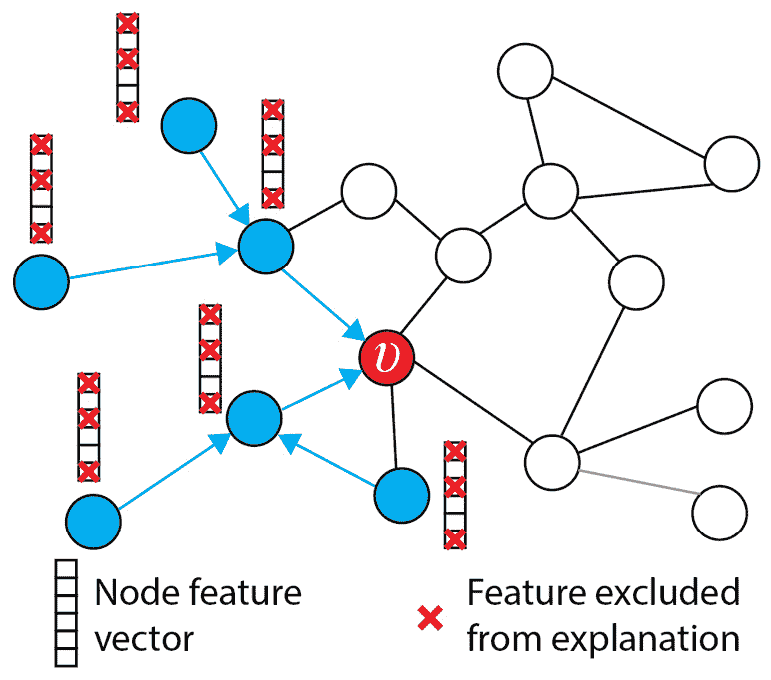
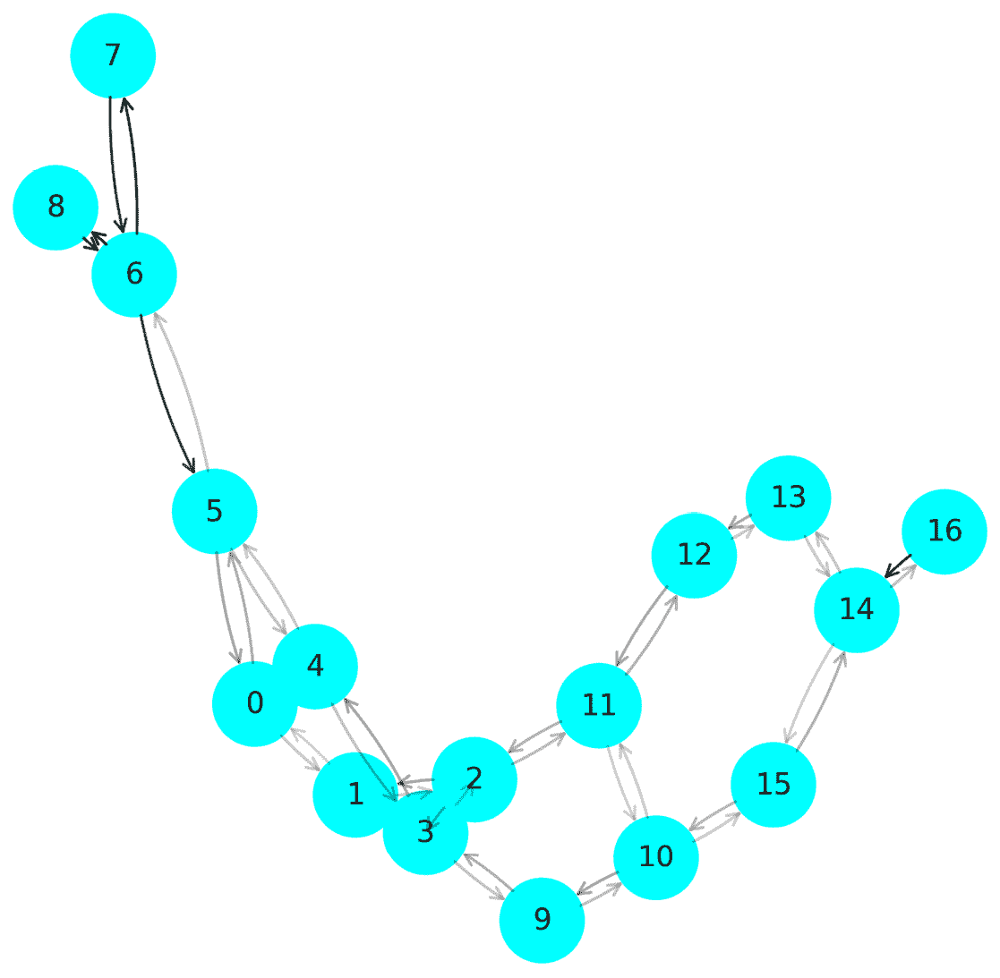
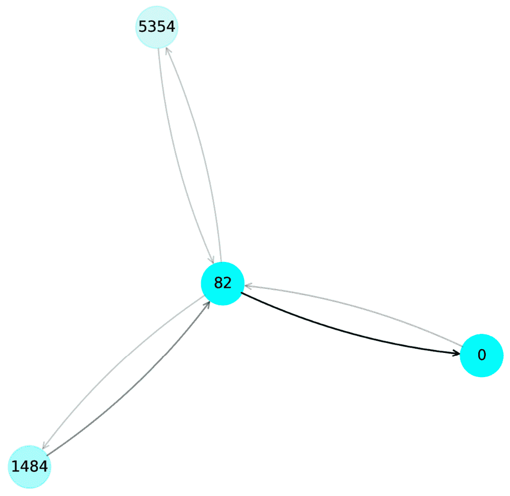
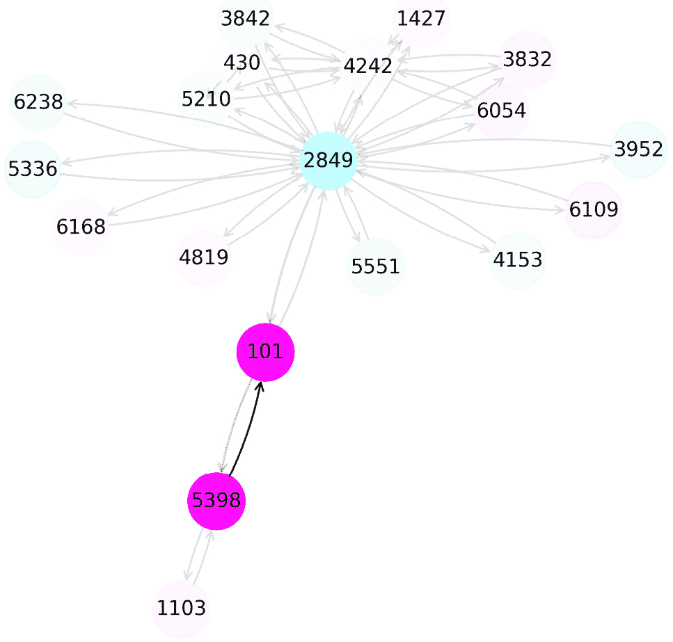

# 14

# 解释图神经网络

神经网络（NN）最常见的批评之一是它们的输出难以理解。不幸的是，GNN 也不例外：除了解释哪些特征很重要外，还必须考虑邻接节点和连接。为了应对这一问题，**可解释性**（以**可解释人工智能**或**XAI**的形式）领域开发了许多技术，以更好地理解预测背后的原因或模型的总体行为。部分技术已经被转移到 GNN 上，另一些则利用图结构提供更精确的解释。

在本章中，我们将探讨一些解释技术，了解为什么给定的预测会被做出。我们将看到不同的技术类型，并重点介绍两种最流行的：`MUTAG`数据集。接着，我们将介绍`Captum`，一个提供多种解释技术的 Python 库。最后，利用 Twitch 社交网络，我们将实现集成梯度技术，解释节点分类任务中的模型输出。

到本章结束时，你将能够理解并实施几种 XAI 技术在 GNN 上的应用。更具体地说，你将学习如何使用 GNNExplainer 和`Captum`库（结合集成梯度）来进行图形和节点分类任务。

在本章中，我们将涵盖以下主要主题：

+   介绍解释技术

+   使用 GNNExplainer 解释 GNN

+   使用 Captum 解释 GNN

# 技术要求

本章的所有代码示例可以在 GitHub 上找到：[`github.com/PacktPublishing/Hands-On-Graph-Neural-Networks-Using-Python/tree/main/Chapter14`](https://github.com/PacktPublishing/Hands-On-Graph-Neural-Networks-Using-Python/tree/main/Chapter14)。

在本书的*前言*中可以找到在本地计算机上运行代码所需的安装步骤。

# 介绍解释技术

GNN 解释是一个最近的领域，深受其他 XAI 技术的启发[1]。我们将其分为基于单次预测的局部解释和针对整个模型的全局解释。虽然理解 GNN 模型的行为是有意义的，但我们将重点关注更受欢迎和本质的局部解释，以便深入了解预测结果。

在本章中，我们区分了“可解释”和“可解释性”模型。如果一个模型是“可解释的”，则意味着它从设计上就可以被人类理解，例如决策树。另一方面，当一个模型作为黑箱工作，其预测只能通过解释技术事后理解时，才称之为“可解释性”。这通常适用于神经网络（NN）：它们的权重和偏置不像决策树那样提供明确的规则，但其结果可以通过间接方式解释。

本地解释技术有四种主要类别：

+   **基于梯度的方法**分析输出的梯度，以估计归因分数（例如，**集成梯度**）

+   **基于扰动的方法**遮盖或修改输入特征，以测量输出的变化（例如，**GNNExplainer**）

+   **分解方法**将模型的预测分解为多个项，以衡量它们的重要性（例如，图神经网络**逐层相关性传播**（**GNN-LRP**））

+   **替代方法**使用简单且可解释的模型，来近似原始模型在某一区域的预测（例如，**GraphLIME**）

这些技术是互补的：它们有时在边和特征的贡献上存在分歧，这可以用于进一步细化预测的解释。传统上，解释技术使用以下指标进行评估：

+   **保真度**，比较原始图像与修改后的图像之间的预测概率。修改后的图像仅保留基于的最重要特征（节点、边、节点特征）。换句话说，保真度衡量的是被认为重要的特征在获得正确预测方面的充分程度。它的正式定义如下：


+   **稀疏性**，衡量被认为重要的特征（节点、边、节点特征）所占的比例。过长的解释更难理解，这也是鼓励稀疏性的原因。它的计算方式如下：


在这里，是重要输入特征的数量，是特征的总数量。

除了我们在前几章看到的传统图形外，解释技术通常在合成数据集上进行评估，如`BA-Shapes`、`BA-Community`、`Tree-Cycles`和`Tree-Grid` [2]。这些数据集是通过图生成算法生成的，用于创建特定的模式。我们在本章中不会使用它们，但它们是一个有趣的替代方案，易于实现和理解。

在接下来的章节中，我们将描述一种基于梯度的方法（集成梯度）和一种基于扰动的技术（GNNExplainer）。

# 使用 GNNExplainer 解释 GNN

在本节中，我们将介绍我们的第一个 XAI 技术——GNNExplainer。我们将用它来理解 GIN 模型在`MUTAG`数据集上产生的预测。

## 引入 GNNExplainer

GNNExplainer 是由 Ying 等人于 2019 年提出的 [2]，它是一种旨在解释来自其他 GNN 模型预测的 GNN 架构。在表格数据中，我们希望知道哪些特征对预测最为重要。然而，在图数据中，这还不够：我们还需要知道哪些节点最具影响力。GNNExplainer 通过提供一个子图  和一组节点特征 ，生成包含这两个组件的解释。下图展示了 GNNExplainer 为给定节点提供的解释：



图 14.1 – 节点  的标签解释，绿色表示 ，非排除节点特征 

为了预测  和 ，GNNExplainer 实现了边掩码（用于隐藏连接）和特征掩码（用于隐藏节点特征）。如果一个连接或特征很重要，删除它应该会显著改变预测。另一方面，如果预测没有变化，说明这个信息是冗余的或完全不相关的。这个原理是基于扰动的技术，如 GNNExplainer 的核心。

在实践中，我们必须仔细设计损失函数，以找到最好的掩码。GNNExplainer 测量预测标签分布  和  之间的互依性，也叫做**互信息** (**MI**)。我们的目标是最大化 MI，这等同于最小化条件交叉熵。GNNExplainer 通过找到变量  和 ，最大化预测  的概率来进行训练。

除了这个优化框架，GNNExplainer 还学习了一个二进制特征掩码，并实现了几种正则化技术。最重要的技术是一个项，用于最小化解释的大小（稀疏性）。它是通过求和掩码参数的所有元素并将其添加到损失函数中来计算的。这样可以生成更具用户友好性和简洁性的解释，便于理解和解释。

GNNExplainer 可以应用于大多数 GNN 架构以及不同的任务，如节点分类、链接预测或图分类。它还可以生成类标签或整个图的解释。在进行图分类时，模型会考虑图中所有节点的邻接矩阵的并集，而不是单一的矩阵。在下一节中，我们将应用它来解释图分类。

## 实现 GNNExplainer

在本例中，我们将探索`MUTAG`数据集[3]。该数据集中的 188 张图每一张代表一个化学化合物，节点表示原子（有七种可能的原子），边表示化学键（有四种可能的化学键）。节点和边的特征分别表示原子和化学键类型的独热编码。目标是根据化合物对细菌*沙门氏菌*的致突变效应，将每个化合物分类为两类。

我们将重用*第九章*中介绍的 GIN 模型进行蛋白质分类。在*第九章*中，我们可视化了模型的正确和错误分类。然而，我们无法解释 GNN 做出的预测。这一次，我们将使用 GNNExplainer 来理解最重要的子图和节点特征，从而解释分类结果。在此示例中，为了简便起见，我们将忽略边特征。以下是步骤：

1.  我们从 PyTorch 和 PyTorch Geometric 中导入所需的类：

    ```py
    import matplotlib.pyplot as plt
    import torch.nn.functional as F
    from torch.nn import Linear, Sequential, BatchNorm1d, ReLU, Dropout
    from torch_geometric.datasets import TUDataset
    from torch_geometric.loader import DataLoader
    from torch_geometric.nn import GINConv, global_add_pool, GNNExplainer
    ```

1.  我们加载`MUTAG`数据集并进行洗牌：

    ```py
    dataset = TUDataset(root='.', name='MUTAG').shuffle()
    ```

1.  我们创建训练集、验证集和测试集：

    ```py
    train_dataset = dataset[:int(len(dataset)*0.8)]
    val_dataset   = dataset[int(len(dataset)*0.8):int(len(dataset)*0.9)]
    test_dataset  = dataset[int(len(dataset)*0.9):]
    ```

1.  我们创建数据加载器以实现小批量训练：

    ```py
    train_loader = DataLoader(train_dataset, batch_size=64, shuffle=True)
    val_loader   = DataLoader(val_dataset, batch_size=64, shuffle=True)
    test_loader  = DataLoader(test_dataset, batch_size=64, shuffle=True)
    ```

1.  我们使用*第九章*中的代码创建一个具有 32 个隐藏维度的 GIN 模型：

    ```py
    class GIN(torch.nn.Module):
    ...
    model = GIN(dim_h=32)
    ```

1.  我们训练此模型 100 轮，并使用*第九章*中的代码进行测试：

    ```py
    def train(model, loader):
     ...
    model = train(model, train_loader)
    test_loss, test_acc = test(model, test_loader)
    print(f'Test Loss: {test_loss:.2f} | Test Acc: {test_acc*100:.2f}%')
    Test Loss: 0.48 | Test Acc: 84.21%
    ```

1.  我们的 GIN 模型已经训练完成，并取得了较高的准确率（`84.21%`）。现在，让我们使用 PyTorch Geometric 中的`GNNExplainer`类创建一个 GNNExplainer 模型，并进行 100 轮训练：

    ```py
    explainer = GNNExplainer(model, epochs=100, num_hops=1)
    ```

1.  GNNExplainer 可用于解释节点的预测（`.explain_node()`）或整个图的预测（`.explain_graph()`）。在本例中，我们将其应用于测试集中的最后一张图：

    ```py
    data = dataset[-1]
    feature_mask, edge_mask = explainer.explain_graph(data.x, data.edge_index)
    ```

1.  最后一步返回了特征和边掩码。让我们打印特征掩码，查看最重要的值：

    ```py
    feature_mask
    tensor([0.7401, 0.7375, 0.7203, 0.2692, 0.2587, 0.7516, 0.2872])
    ```

这些值被标准化到 0（较不重要）和 1（较重要）之间。这七个值对应于数据集中按以下顺序找到的七种原子：碳（C）、氮（N）、氧（O）、氟（F）、碘（I）、氯（Cl）和溴（Br）。特征具有类似的重要性：最有用的是最后一个，表示溴（Br），而最不重要的是第五个，表示碘（I）。

1.  我们可以通过`.visualize_graph()`方法将边掩码绘制在图形上，而不是直接打印出来。箭头的透明度表示每个连接的重要性：

    ```py
    ax, G = explainer.visualize_subgraph(-1, data.edge_index, edge_mask, y=data.y)
    plt.show()
    ```

这给出了*图 14.2*。



图 14.2 – 化学化合物的图表示：边的透明度表示每个连接的重要性

最后一张图展示了对预测贡献最大的连接。在这种情况下，GIN 模型正确地对图进行了分类。我们可以看到节点之间的连接 `data.edge_attr`，以获取与其化学键（芳香键、单键、双键或三键）相关的标签。在此示例中，它对应的是 **16** 到 **19** 的边，这些边都是单键或双键。

通过打印 `data.x`，我们还可以查看节点 **6**、**7** 和 **8** 来获取更多信息。节点 **6** 代表氮原子，而节点 **7** 和 **8** 代表两个氧原子。这些结果应该报告给具备相关领域知识的人，以便对我们的模型进行反馈。

GNNExplainer 并没有提供关于决策过程的精确规则，而是提供了对 GNN 模型在做出预测时关注的内容的洞察。仍然需要人类的专业知识来确保这些观点是连贯的，并且与传统领域知识相符。

在下一节中，我们将使用 Captum 来解释新社交网络上的节点分类。

# 使用 Captum 解释 GNN

在本节中，我们将首先介绍 Captum 和应用于图数据的集成梯度技术。然后，我们将在 Twitch 社交网络上使用 PyTorch Geometric 模型实现这一技术。

## 介绍 Captum 和集成梯度

`Captum` ([captum.ai](http://captum.ai)) 是一个 Python 库，实施了许多用于 PyTorch 模型的最先进的解释算法。这个库并非专门针对 GNN：它也可以应用于文本、图像、表格数据等。它特别有用，因为它允许用户快速测试各种技术，并比较对同一预测的不同解释。此外，`Captum` 实现了如 LIME 和 Gradient SHAP 等流行算法，用于主特征、层和神经元的归因。

在本节中，我们将使用它来应用图版本的集成梯度 [4]。这一技术旨在为每个输入特征分配一个归因分数。为此，它使用相对于模型输入的梯度。具体来说，它使用输入  和基线输入 （在我们的情况下，所有边的权重为零）。它计算沿着  和  之间路径的所有点的梯度，并对其进行累加。

从形式上看，沿着  维度的集成梯度，对于输入  的定义如下：


实际上，我们并不是直接计算这个积分，而是通过离散求和来近似它。

集成梯度是与模型无关的，并基于两个公理：

+   **敏感性**：每个对预测有贡献的输入必须获得非零的归因

+   **实现不变性**：对于所有输入输出相等的两个神经网络（这些网络被称为功能上等效的），它们的归因必须完全相同。

我们将使用的图版本稍有不同：它考虑节点和边*而非*特征。因此，您可以看到输出与 GNNExplainer 不同，后者同时考虑节点特征*和*边。这就是为什么这两种方法可以互为补充的原因。

现在，让我们实现这个技术并可视化结果。

## 实现集成梯度

我们将在一个新的数据集上实现集成梯度：Twitch 社交网络数据集（英文版）[5]。该数据集表示一个用户-用户图，其中节点代表 Twitch 主播，连接代表相互友谊。128 个节点特征表示诸如直播习惯、地点、喜欢的游戏等信息。目标是判断一个主播是否使用过激语言（二分类任务）。

我们将使用 PyTorch Geometric 实现一个简单的两层 GCN 来完成此任务。然后我们将模型转换为 Captum，使用集成梯度算法并解释我们的结果。以下是步骤：

1.  我们安装`captum`库：

    ```py
    !pip install captum
    ```

1.  我们导入所需的库：

    ```py
    import numpy as np
    import matplotlib.pyplot as plt
    import torch.nn.functional as F
    from captum.attr import IntegratedGradients
    import torch_geometric.transforms as T
    from torch_geometric.datasets import Twitch
    from torch_geometric.nn import Explainer, GCNConv, to_captum
    ```

1.  让我们固定随机种子，以使计算具有确定性：

    ```py
    torch.manual_seed(0)
    np.random.seed(0)
    ```

1.  我们加载 Twitch 玩家网络数据集（英文版）：

    ```py
    dataset = Twitch('.', name="EN")
    data = dataset[0]
    ```

1.  这次，我们将使用一个简单的两层 GCN，并加上`dropout`：

    ```py
    class GCN(torch.nn.Module):
        def __init__(self, dim_h):
            super().__init__()
            self.conv1 = GCNConv(dataset.num_features, dim_h)
            self.conv2 = GCNConv(dim_h, dataset.num_classes)
        def forward(self, x, edge_index):
            h = self.conv1(x, edge_index).relu()
            h = F.dropout(h, p=0.5, training=self.training)
            h = self.conv2(h, edge_index)
            return F.log_softmax(h, dim=1)
    ```

1.  我们尝试在有 GPU 的情况下使用`Adam`优化器训练模型：

    ```py
    device = torch.device('cuda' if torch.cuda.is_available() else 'cpu')
    model = GCN(64).to(device)
    data = data.to(device)
    optimizer = torch.optim.Adam(model.parameters(), lr=0.01, weight_decay=5e-4)
    ```

1.  我们使用负对数似然损失函数训练模型 200 个周期：

    ```py
    for epoch in range(200):
        model.train()
        optimizer.zero_grad()
        log_logits = model(data.x, data.edge_index)
        loss = F.nll_loss(log_logits, data.y)
        loss.backward()
        optimizer.step()
    ```

1.  我们测试训练好的模型。请注意，我们没有指定任何测试，因此在这种情况下我们将评估 GCN 在训练集上的准确度：

    ```py
    def accuracy(pred_y, y):
        return ((pred_y == y).sum() / len(y)).item()
    @torch.no_grad()
    def test(model, data):
        model.eval()
        out = model(data.x, data.edge_index)
        acc = accuracy(out.argmax(dim=1), data.y)
        return acc
    acc = test(model, data)
    print(f'Accuracy: {acc*100:.2f}%')
    Accuracy: 79.75%
    ```

模型达到了`79.75%`的准确率，考虑到它是在训练集上评估的，这个分数相对较低。

1.  现在我们可以开始实现我们选择的解释方法：集成梯度。首先，我们必须指定我们想要解释的节点（在本例中为节点`0`），并将 PyTorch Geometric 模型转换为`Captum`。在这里，我们还指定我们想使用特征和边掩码，`mask_type=node_and_feature`：

    ```py
    node_idx = 0
    captum_model = to_captum(model, mask_type='node_and_edge', output_idx=node_idx)
    ```

1.  让我们使用`Captum`创建集成梯度对象。我们将上一步的结果作为输入：

    ```py
    ig = IntegratedGradients(captum_model)
    ```

1.  我们已经拥有需要传递给`Captum`的节点掩码（`data.x`），但我们需要为边掩码创建一个张量。在这个例子中，我们希望考虑图中的每一条边，因此初始化一个大小为`data.num_edges`的全 1 张量：

    ```py
    edge_mask = torch.ones(data.num_edges, requires_grad=True, device=device)
    ```

1.  `.attribute()`方法对节点和边掩码的输入格式有特定要求（因此使用`.unsqueeze(0)`来重新格式化这些张量）。目标对应于我们目标节点的类别。最后，我们将邻接矩阵（`data.edge_index`）作为额外的前向参数传递：

    ```py
    attr_node, attr_edge = ig.attribute(
        (data.x.unsqueeze(0), edge_mask.unsqueeze(0)),
        target=int(data.y[node_idx]),
        additional_forward_args=(data.edge_index),
        internal_batch_size=1)
    ```

1.  我们将归一化归因分数，使其范围在`0`到`1`之间：

    ```py
    attr_node = attr_node.squeeze(0).abs().sum(dim=1)
    attr_node /= attr_node.max()
    attr_edge = attr_edge.squeeze(0).abs()
    attr_edge /= attr_edge.max()
    ```

1.  使用 PyTorch Geometric 的`Explainer`类，我们可视化这些归因的图形表示：

    ```py
    explainer = Explainer(model)
    ax, G = explainer.visualize_subgraph(node_idx, data.edge_index, attr_edge, node_alpha=attr_node, y=data.y)
    plt.show()
    ```

这给我们带来了以下输出：



图 14.3 – 节点 0 分类的解释，边和节点归因分数以不同的透明度值表示

节点 **0** 的子图由蓝色节点组成，这些节点属于同一类别。我们可以看到，节点 **82** 是最重要的节点（除了 0 以外），这两个节点之间的连接是最关键的边。这是一个直接的解释：我们有一组使用相同语言的四个直播者。节点 **0** 和 **82** 之间的互相友谊是这一预测的有力依据。

现在让我们来看一下图 **14.4** 中展示的另一个图，节点 **101** 分类的解释：



图 14.4 – 节点 101 分类的解释，边和节点归因分数以不同的透明度值表示

在这种情况下，我们的目标节点与不同类别的邻居（节点 **5398** 和 **2849**）相连。集成梯度赋予与节点 **101** 同类别的节点更大的重要性。我们还看到，它们的连接是对该分类贡献最大的部分。这个子图更丰富；你可以看到，甚至两跳邻居也有一定的贡献。

然而，这些解释不应被视为灵丹妙药。AI 的可解释性是一个复杂的话题，通常涉及不同背景的人。因此，沟通结果并获得定期反馈尤为重要。了解边、节点和特征的重要性至关重要，但这应该只是讨论的开始。来自其他领域的专家可以利用或完善这些解释，甚至发现可能导致架构变化的问题。

# 总结

在本章中，我们探讨了应用于图神经网络（GNN）的可解释性人工智能（XAI）领域。可解释性是许多领域的关键组成部分，有助于我们构建更好的模型。我们看到了提供局部解释的不同技术，并重点介绍了 GNNExplainer（一种基于扰动的方法）和集成梯度（一种基于梯度的方法）。我们在两个不同的数据集上使用 PyTorch Geometric 和 Captum 实现了这些方法，以获得图和节点分类的解释。最后，我们对这些技术的结果进行了可视化和讨论。

在 *第十五章*，*使用 A3T-GCN 预测交通流量* 中，我们将重新审视时序 GNN，以预测道路网络上的未来交通。在这个实际应用中，我们将看到如何将道路转化为图，并应用一种最新的 GNN 架构来准确预测短期交通。

# 进一步阅读

+   [1] H. Yuan, H. Yu, S. Gui, 和 S. Ji。*图神经网络中的可解释性：一项分类调查*。arXiv，2020。DOI: 10.48550/ARXIV.2012.15445。可在[`arxiv.org/abs/2012.15445`](https://arxiv.org/abs/2012.15445)获取。

+   [2] R. Ying, D. Bourgeois, J. You, M. Zitnik, 和 J. Leskovec。*GNNExplainer：为图神经网络生成解释*。arXiv，2019。DOI: 10.48550/ARXIV.1903.03894。可在[`arxiv.org/abs/1903.03894`](https://arxiv.org/abs/1903.03894)获取。

+   [3] Debnath, A. K., Lopez de Compadre, R. L., Debnath, G., Shusterman, A. J., 和 Hansch, C.（1991）。*突变性芳香族和杂芳香族硝基化合物的结构-活性关系。与分子轨道能量和疏水性的相关性*。DOI: 10.1021/jm00106a046。*药物化学杂志*，34(2)，786–797。可在[`doi.org/10.1021/jm00106a046`](https://doi.org/10.1021/jm00106a046)获取。

+   [4] M. Sundararajan, A. Taly, 和 Q. Yan。*深度网络的公理化归因*。arXiv，2017。DOI: 10.48550/ARXIV.1703.01365。可在[`arxiv.org/abs/1703.01365`](https://arxiv.org/abs/1703.01365)获取。

+   [5] B. Rozemberczki, C. Allen, 和 R. Sarkar。*多尺度属性节点嵌入*。*arXiv*，*2019*。DOI: 10.48550/ARXIV.1909.13021。可在[`arxiv.org/pdf/1909.13021.pdf`](https://arxiv.org/pdf/1909.13021.pdf)获取。

# 第四部分：应用

在本书的第四部分，也是最后一部分，我们深入探讨了利用真实世界数据开发全面应用的过程。我们将重点关注前几章中未涉及的方面，如探索性数据分析和数据处理。我们的目标是提供关于机器学习管道的详尽概述，从原始数据到模型输出分析。我们还将强调所讨论技术的优点和局限性。

本节中的项目设计为适应性强且可定制，使读者能够轻松地将其应用于其他数据集和任务。这使其成为希望构建应用程序组合并展示自己工作（如在 GitHub 上的工作）的读者的理想资源。

到本部分结束时，你将学会如何实现 GNNs 用于交通预测、异常检测和推荐系统。这些项目的选择旨在展示 GNNs 在解决现实问题中的多样性和潜力。通过这些项目获得的知识和技能将为读者开发自己的应用程序并为图学习领域作出贡献做好准备。

本部分包括以下章节：

+   *第十五章**，使用 A3T-GCN 预测交通流量*

+   *第十六章**，使用异质图神经网络检测异常*

+   *第十七章**，使用 LightGCN 推荐书籍*

+   *第十八章**，解锁图神经网络在现实世界应用中的潜力*
