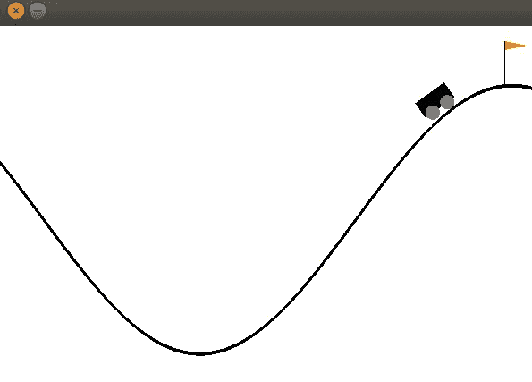
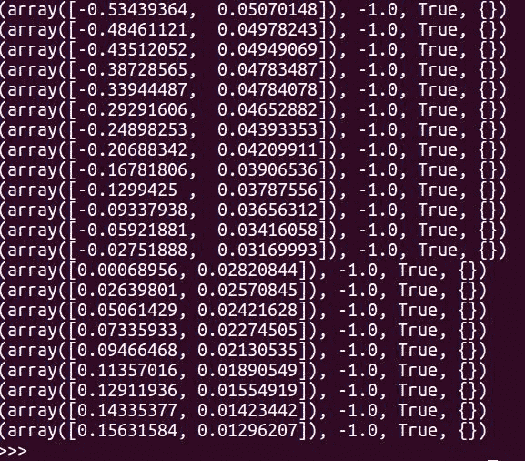
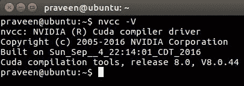

# 开始使用 OpenAI Gym 和深度强化学习

介绍章节让你对 OpenAI Gym 工具包和强化学习有了很好的了解。在本章中，我们将直接进入正题，确保你和你的计算机做好了所有必要的准备、安装和配置，以开始开发你的智能体。更重要的是，你还会找到访问本书代码库的说明，这些代码库包含了你跟随本书学习所需的所有代码，并且有许多其他的代码示例、有用的说明和更新。

在本章中，我们将涵盖以下主题：

+   访问本书的代码库

+   为本书创建一个 Anaconda 环境

+   如何在你的系统上安装和配置 OpenAI Gym 及其依赖项

+   安装深度强化学习的工具、库和依赖项

# 代码库、设置和配置

首先，让我们确保你拥有访问本书代码库的所有信息。源代码为你提供了本书中讨论的所有必要代码示例，并提供了有关如何设置和运行每章训练或测试脚本的详细说明。要开始，请访问本书的 GitHub 代码库，链接如下：[`github.com/PacktPublishing/Hands-On-Intelligent-Agents-with-OpenAI-Gym`](https://github.com/PacktPublishing/Hands-On-Intelligent-Agents-with-OpenAI-Gym)。

如果你还没有 GitHub 账户，请创建一个，并且将代码库 fork 到你自己的 GitHub 账户中。这样做是推荐的，因为它允许你在跟随学习的同时，随意修改代码，也能在你有有趣的内容时，发送 pull request，并且可能会在本书的博客中展示！

你可以使用以下命令将代码库克隆到主目录中的一个名为 `HOIAWOG` 的文件夹：

```py
git clone https://github.com/PacktPublishing/Hands-On-Intelligent-Agents-with-OpenAI-Gym.git ~/HOIAWOG
```

请注意，本书假设你已经将代码库设置在以下位置：`~/HOIAWOG`。如果你因某些原因更改了这个位置，请务必记住它，并相应地修改书中的一些命令。

如果你在想为什么目录名称选为 `HOIAWOG`，不要再想了。这是本书标题 **Hands On Intelligent Agents With OpenAI Gym**（**HOIAWOG**）的缩写！

本书的代码库将会保持更新，以应对外部库或其他软件的变化，确保智能体实现代码和其他代码示例能够正常运行。偶尔也会添加新的代码和更新，帮助你进一步探索智能体的开发。为了及时了解变化并接收更新通知，建议你在 GitHub 账户中为本书的代码库加星标。

在第一章 *智能体和学习环境简介*的最后，我们快速安装了 OpenAI Gym，简单了解了 Gym 的功能。那是一次最小化的安装，目的是让我们迅速入门。在接下来的部分，我们将逐步介绍安装过程，确保你所需要的用于开发 Gym 智能体的所有内容都已正确安装和配置。我们将在这里讨论不同级别和方法的安装方式，确保你了解整个安装过程。你可能最终会修改系统，或者在家里或工作中使用其他系统，甚至更换电脑。这一部分将确保你能以正确的方式完成所有设置。可以根据你的实际需求选择合适的安装方式。

# 先决条件

使用 OpenAI Gym 的唯一主要前提条件是 Python 3.5 及以上版本。为了让进一步的开发更简单且有组织，我们将使用 Anaconda Python 发行版。如果你不熟悉 Anaconda，它是一个 Python 发行版（虽然也有 R 语言的发行版），包含了数百个流行的机器学习和数据科学包，并配有一个名为 *conda* 的易用包和虚拟环境管理器。好消息是，Anaconda Python 发行版支持 Linux、macOS 和 Windows！另一个使用 Anaconda 发行版的主要原因是，它能帮助我们轻松创建、安装、管理和升级一个独立的 Python 虚拟环境。这确保了我们在本书中学习和开发的代码无论在哪个操作系统上执行，都能得到相同的结果。这将让你摆脱手动处理依赖问题或库版本不匹配问题的麻烦，而如果不使用像 Anaconda 这样的 Python 发行版，你本来得自己处理这些问题。你会发现它只是“有效”，这非常好，令人开心。让我们开始吧，安装 Anaconda Python 发行版。

打开命令提示符或终端，并输入以下内容：

```py
praveen@ubuntu:~$wget http://repo.continuum.io/archive/Anaconda3-4.3.0-Linux-x86_64.sh -O ~/anaconda.sh
```

该命令使用 `wget` 工具来获取/下载 Anaconda 版本 3-4.3 的安装脚本，并将其保存为 `anaconda.sh` 文件在你的主目录下。此命令应该适用于预装了 `wget` 工具的 macOS 和 Linux（如 Ubuntu、Kubuntu 等）。请注意，我们下载的是特定版本的 Anaconda（3-4.3），这将确保本书中的配置保持一致。即使这不是最新版本，也不用担心。你可以稍后通过以下命令升级发行版：

```py
conda update conda
```

`anaconda.sh` 是一个 shell 脚本，包含了安装 Anaconda 所需的所有内容！如果你感兴趣，可以使用你喜欢的文本编辑器打开它，看看如何巧妙地将二进制文件、安装过程说明和 shell 命令都合并到一个文件中。

现在让我们在你的主目录下安装 Anaconda Python 发行版。以下安装过程已经精心安排，确保它能在 Linux 和 macOS 系统上都能正常工作。在输入命令之前，你需要注意一件事。以下命令将在*静默模式*下运行安装程序。这意味着它将使用默认的安装参数并继续安装，而不会逐一询问你是否继续进行每个配置。这也意味着你同意 Anaconda 发行版的许可条款。如果你想手动一步步进行安装过程，可以运行以下命令，但不带`-b`和`-f`参数：

```py
praveen@ubuntu:~$bash ~/anaconda.sh -b -f -p $HOME/anaconda
```

等待安装过程完成，接着我们就完成了！

为了开始使用*conda*和 Anaconda Python 发行版中的其他工具，我们需要确保系统知道在哪里找到 Anaconda 工具。让我们通过将 Anaconda 二进制目录的路径添加到`PATH`环境变量中，如下所示：

```py
praveen@ubuntu:~$export PATH=$HOME/anaconda/bin:$PATH
```

我强烈建议你将这一行添加到`~/.bashrc`文件的末尾，这样每次打开新的 bash 终端时，Anaconda 工具都会可用。

你可以输入以下命令来确认安装是否成功：

```py
praveen@ubuntu:~$conda list
```

这个命令将仅仅打印出你默认环境中可用的包列表。

# 创建 conda 环境

现在我们已经设置好了 Anaconda，让我们使用 conda 创建一个 Python 虚拟环境，在本书中我们将使用这个环境。

如果你更倾向于一键安装并且不想逐步进行安装过程，一个大大简化的方法是使用`conda_env.yaml`conda 环境配置文件，该文件可以在本书的代码库中找到。你只需从本书代码库目录（`HOIAWOG`）运行以下命令，即可创建包含所有必要包的环境，前提是我们在上一节中已经创建了该目录：

`praveen@ubuntu:~/HOIAWOG$ conda create -f conda_env.yaml -n rl_gym_book`

此时，我们将仅创建一个新的最小环境以继续进行。请在终端中输入以下命令：

```py
praveen@ubuntu:~$conda create --name rl_gym_book python=3.5
```

这将创建一个名为`rl_gym_book`的 conda 环境，并使用 Python3 解释器。它会打印一些即将下载的信息以及将要安装的包。你可能会被提示是否要继续，输入`y`并按*Enter*键。环境创建过程完成后，你可以使用以下命令激活该环境：

```py
praveen@ubuntu:~$source activate rl_gym_book
```

现在你会看到命令提示符的前缀变成类似于这样，表示你已经进入了`rl_gym_book`虚拟环境：

```py
(rl_gym_book) praveen@ubuntu:~$
```

你可以将其作为进度的指示，帮助你了解何时需要在这个环境中输入命令，何时可以在环境外输入命令。要退出或停用环境，只需输入以下命令：

```py
praveen@ubuntu:~$source deactivate
```

# 最小安装——快速简便的方法

OpenAI Gym 是一个 Python 包，已发布在 **Python 包索引** (**PyPI**) 仓库中。你可以使用 `easy_install` 或 `pip` 从 PyPI 仓库获取并安装包。如果你有 Python 脚本经验，`pip` 是你可能熟悉的一个 Python 包管理工具：

```py
(rl_gym_book) praveen@ubuntu:~$pip install gym
```

就这些！

让我们通过运行以下代码快速检查安装是否成功。创建一个 `gym_install_test.py` 文件并保存在 `~/rl_gym_book` 目录下，将以下代码输入/复制到该文件中并保存。你也可以从书本的代码仓库下载 `gym_quick_install_test.py` 文件：

```py
#! /usr/bin/env python  
import gym
env = gym.make("MountainCar-v0") # Create a MountainCar environment
env.reset()
for _ in range(2000): # Run for 2000 steps
    env.render()
    env.step(env.action_space.sample()) # Send a random action
```

让我们尝试运行这个脚本：

```py
(rl_gym_book) praveen@ubuntu:~/HOIAWOG$python gym_quick_install_test.py
```

这应该会弹出一个新窗口，显示一辆车/纸箱和一个 V 形山脉，你应该会看到汽车左右随机移动。山地车窗口应该看起来像这样的截图：



你还会在控制台/终端看到一些类似如下的值：



如果你看到这种情况，那就恭喜你！你现在已经拥有了一个（最小）版本的 OpenAI Gym 设置！

# 完整安装 OpenAI Gym 学习环境

不是所有的环境都能通过最小安装使用。为了能够使用 Gym 中的大部分或所有环境，我们将安装所需的依赖项，并从主分支的最新源代码构建 OpenAI Gym。

要开始，我们首先需要安装所需的系统包。接下来，你将找到 Ubuntu 和 macOS 的安装指南。根据你的开发平台选择相应的安装指南。

# Ubuntu 安装指南

以下命令已在 Ubuntu 14.04 LTS 和 Ubuntu 16.04 LTS 上测试过，但应该也能在其他/未来的 Ubuntu 版本中正常运行。

让我们通过在终端/控制台运行以下命令来安装所需的系统包：

```py
sudo apt-get update

sudo apt-get install -y build-essential cmake python-dev python-numpy python-opengl libboost-all-dev zlib1g-dev libsdl2-dev libav-tools xorg-dev libjpeg-dev swig
```

此命令将安装所需的系统包。请注意，`-y` 标志将自动确认安装包，无需你手动确认。如果你想查看将要安装的包，可以不加该标志运行命令。

# macOS 安装指南

在 macOS 上，所需安装的额外系统包数量比在 Ubuntu 系统上要少。

从终端运行以下命令：

```py
brew install cmake boost sdl2 swig wget

brew install boost-python --with-python3
```

这些命令将安装所需的系统包。

OpenAI Gym 中的机器人和控制环境使用 **多关节动力学与接触** (**MuJoCo**) 作为物理引擎，模拟刚体动力学及其他特性。我们在第一章《智能体与学习环境介绍》中简要看过 MuJoCo 环境，了解到你可以开发算法使 2D 机器人行走、奔跑、游泳或跳跃，或使 3D 多足机器人行走或奔跑，均可通过 MuJoCo 环境实现。MuJoCo 是一个专有引擎，因此需要许可证。幸运的是，我们可以获得 30 天免费的许可证！

此外，如果你是学生，他们提供 1 年免费的 MuJoCo Pro 个人许可证，这样更好！对于其他人来说，30 天后，遗憾的是，1 年许可证的费用相当高（约 500 美元）。我们在本书中不会使用 MuJoCo 环境，因为并不是每个人都能获得许可证。如果你拥有许可证，可以将本书中关于其他环境的学习应用到 MuJoCo 环境中。如果你计划使用这些环境，接下来你需要按照 MuJoCo 安装部分的说明进行操作。如果不打算使用，可以跳过这一部分，继续设置 OpenAI Gym 的下一部分。

# MuJoCo 安装

希望你已经阅读了之前的信息框。MuJoCo 是本书中会遇到的一个特殊库，因为与我们在本书中使用的其他库和软件不同，MuJoCo 使用时需要许可证。MuJoCo 的 Python 接口（可在 Gym 库中找到）只与 MuJoCo 版本 1.31 兼容（截至本章写作时），尽管最新的 MuJoCo 版本已经更高（截至写作时为 1.50）。请按照以下两步设置 MuJoCo 以用于 OpenAI Gym 环境：

1.  从以下网址下载适合你平台的 MuJoCo 1.31（Linux/macOS）版本：[`www.roboti.us/index.html`](https://www.roboti.us/index.html)

1.  从以下网址获取 MuJoCo Pro 许可证：[`www.roboti.us/license.html`](https://www.roboti.us/license.html)

# 完成 OpenAI Gym 设置

首先，让我们更新我们的 pip 版本：

```py
(rl_gym_book) praveen@ubuntu:~$ pip install --ignore-installed pip
```

然后，让我们从 GitHub 仓库中下载 OpenAI Gym 的源代码到我们的主目录：

```py
(rl_gym_book) praveen@ubuntu:~$cd ~

(rl_gym_book) praveen@ubuntu:~$git clone https://github.com/openai/gym.git

(rl_gym_book) praveen@ubuntu:~$cd gym
```

如果你遇到类似 `git command not found` 的错误，你可能需要安装 Git。在 Ubuntu 系统中，你可以通过运行以下命令来安装 Git：`sudo apt-get install git`。在 macOS 上，如果你尚未安装 Git，运行 `git clone` 命令时会提示你安装它。

现在我们已经进入完整 Gym 安装的最后阶段！如果你获得了 MuJoCo 许可证并成功按照 MuJoCo 安装说明进行操作，那么可以继续通过运行以下命令来完成完整安装：

```py
(rl_gym_book) praveen@ubuntu:~/gym$pip install -e '.[all]'
```

如果你没有安装 MuJoCo，那么此命令将返回错误。我们将安装我们将使用的 Gym 环境，除了 MuJoCo（它需要许可证）。确保你仍然在`gym`目录下的`home`文件夹中，并且仍然在`rl_gym_book` conda 环境中。你的提示符应包含`rl_gym_book`前缀，如下所示，其中`~/gym`表示提示符位于`home`文件夹下的 gym 目录中：

```py
(rl_gym_book) praveen@ubuntu:~/gym$

```

以下是一个表格，汇总了安装第一章，*智能体与学习环境简介*中讨论过的环境的安装命令。

| **环境** | **安装命令** |
| --- | --- |
| Atari | `pip install -e '.[atari]'` |
| Box2D | `pip install -e '.[box2d]'``conda install -c https://conda.anaconda.org/kne pybox2d` |
| 经典控制 | `pip install -e '.[classic_control]'` |
| MuJoCo（需要许可） | `pip install -e '.[mujoco]'` |
| 机器人学（需要许可） | `pip install -e '.[robotics]'` |

让我们继续安装不需要许可证的环境。运行以下命令安装 Atari、Box2D 和经典控制环境：

```py
(rl_gym_book) praveen@ubuntu:~/gym$pip install -e '.[atari]'

(rl_gym_book) praveen@ubuntu:~/gym$pip install -e '.[box2d]'

(rl_gym_book) praveen@ubuntu:~/gym$conda install -c https://conda.anaconda.org/kne pybox2d

(rl_gym_book) praveen@ubuntu:~/gym$pip install -e '.[classic_control]'
test_box2d.pyunder the ~/rl_gym_book directory:
```

```py
#!/usr/bin/env python
import gym
env = gym.make('BipedalWalker-v2')
env.reset()
for _ in range(1000):
    env.render()
    env.step(env.action_space.sample())
```

使用以下命令运行代码：

```py
(rl_gym_book) praveen@ubuntu:~/gym$cd ~/rl_gym_book

(rl_gym_book) praveen@ubuntu:~/rl_gym_book$python test_box2d.py
```

你将看到一个窗口弹出，展示 BipedalWalker-v2 环境，行走者正在尝试随机执行一些动作：


所以，我们已经设置好了 Gym 环境。你可能会问，接下来是什么？在下一节中，我们将设置开发深度强化学习代理所需的工具和库，以便在这些环境中进行训练！

# 安装深度强化学习所需的工具和库

第二章，*强化学习与深度强化学习*，为你提供了强化学习的基础知识。有了这些理论背景，我们将能够实现一些很酷的算法。在那之前，我们将确保我们拥有所需的工具和库。

我们实际上可以在 Python 中编写很酷的强化学习算法，而不使用任何高级库。然而，当我们开始使用函数逼近器来近似价值函数或策略，尤其是当我们使用深度神经网络作为函数逼近器时，最好使用经过高度优化的深度学习库，而不是编写自己的代码。深度学习库是我们需要安装的主要工具/库。如今有许多不同的库：PyTorch、TensorFlow、Caffe、Chainer、MxNet 和 CNTK 等。每个库都有自己的哲学、优点和缺点，具体取决于使用场景。由于 PyTorch 易于使用并且支持动态图定义，我们将在本书中使用 PyTorch 来开发深度强化学习算法。本书中讨论的算法及其实现方式将以一种方式进行解释，以便你可以轻松地使用你选择的框架重新实现它们。

如果你的机器没有 GPU，或者如果你不打算使用 GPU 进行训练，你可以跳过 GPU 驱动安装步骤，并使用以下 conda 命令安装仅限 CPU 的 PyTorch 二进制版本：

```py
(rl_gym_book) praveen@ubuntu:~$ conda install pytorch-cpu torchvision -c pytorch
```

请注意，你将*无法*加速我们将在本书中开发的部分代理的训练，这些代理可以利用 GPU 来加速训练。

# 安装前置系统软件包

让我们首先确保我们从 Ubuntu 上游仓库获得最新的软件包版本。我们可以通过运行以下命令来实现：

```py
sudo apt-get update

sudo apt-get upgrade
```

接下来，我们将安装所需的前置软件包。注意

其中一些软件包可能已经在你的系统上安装，但最好确保我们拥有所有必要的软件包：

```py
sudo apt-get install -y gfortran pkg-config software-properties-common
```

# 安装计算统一设备架构（CUDA）

如果你没有 Nvidia GPU，或者如果你有一块较旧的 Nvidia GPU 且不支持 CUDA，你可以跳过这一步，继续执行下一部分，在其中我们将介绍 PyTorch 的安装：

1.  从 Nvidia 官方网站下载适用于你的 Nvidia GPU 的最新 CUDA 驱动程序，网址为：[`developer.nvidia.com/cuda-downloads`](https://developer.nvidia.com/cuda-downloads)。

1.  在操作系统下选择 Linux 以及你的架构（通常是 x86_64），然后根据你的版本选择相应的 Linux 操作系统发行版（Ubuntu）版本 14.04、16.04 或 18.04，并选择 deb(local)作为安装类型。这样会下载名为`cuda-repo-ubuntu1604-8-0-local_8.0.44-1_amd64`的 CUDA 本地安装文件。记下你的 CUDA 版本（在本例中为 8.0）。稍后我们将使用这个 CUDA 版本来安装 PyTorch。

1.  然后，你可以按照说明或运行以下命令来安装 CUDA：

```py
sudo dpkg -i cuda-repo-ubuntu*.deb

sudo apt-get update

sudo apt-get install -y cuda
```

如果一切顺利，你应该已经成功安装了 CUDA。为了快速检查一切是否正常，请运行以下命令：

```py
nvcc -V
```

这会打印出 CUDA 版本信息，类似于以下截图中显示的输出。请注意，你的输出可能不同，取决于你安装的 CUDA 版本：



如果你得到了类似的输出，那么这是个好消息！

你可以继续在系统上安装最新的**CUDA 深度神经网络**（**cuDNN**）。本书不会详细讲解安装步骤，但安装步骤很简单，并列出了 Nvidia 官方 CuDNN 下载页面，网址为：[`developer.nvidia.com/rdp/form/cudnn-download-survey`](https://developer.nvidia.com/rdp/form/cudnn-download-survey)。请注意，你需要注册一个免费的 Nvidia 开发者账户才能下载。

# 安装 PyTorch

现在我们准备好安装 PyTorch 了！幸运的是，在我们的`rl_gym_book`conda 环境中运行以下命令就能轻松完成：

```py
(rl_gym_book) praveen@ubuntu:~$ conda install pytorch torchvision -c pytorch
```

请注意，这个命令会安装带有 CUDA 8.0 的 PyTorch。你应该已经注意到之前安装的 CUDA 版本，命令可能会根据你安装的 CUDA 版本有所不同。例如，如果你安装了 CUDA 9.1，安装命令会是：

`conda install pytorch torchvision cuda91 -c pytorch`

你可以在[`pytorch.org`](http://pytorch.org)找到根据你的操作系统、包管理器（conda 或 pip 或源码安装）、Python 版本（我们使用的是 3.5）和 CUDA 版本更新的安装命令。

就这样！我们快速尝试导入 PyTorch 库，确保它能够正常工作。将以下代码行输入或复制到名为`pytorch_test.py`的文件中，并将其保存在`~/rl_gym_book`目录下：

```py
#!/usr/bin/env python
import torch
t = torch.Tensor(3,3) # Create a 3,3 Tensor
print(t)
```

在`rl_gym_book`conda 环境中运行此脚本。以下截图作为示例提供：


请注意，你可能会看到张量的不同值，并且每次运行脚本时看到的值可能也不同。这是由于`torch`的原因。`Tensor()`函数会生成给定形状的随机张量，在我们的例子中是（3, 3）。PyTorch 采用与 NumPy 相似的语法。如果你熟悉 NumPy，学习 PyTorch 会很容易。如果你不熟悉 NumPy 或 PyTorch，建议你先参考官方 PyTorch 教程来熟悉它。

你可能会注意到，在一些示例控制台截图中使用的文件夹名称是`read rl_gym_book`而不是 HOIAWOG。这两个目录名是可以互换的，实际上它们是指向同一目录的符号链接。

# 总结

在本章中，我们详细讲解了使用 conda、OpenAI Gym 和 Pytorch 安装和配置开发环境的**逐步**设置过程！本章帮助我们确保已经安装了所有必需的工具和库，以便开始在 Gym 环境中开发我们的智能体。在下一章中，我们将探索 Gym 环境的功能，了解它们是如何工作的，以及我们如何使用它们来训练智能体。在第五章，*实现你的第一个学习智能体——解决山地车问题*，我们将直接开始开发第一个强化学习智能体来解决山地车问题！随后，我们将逐步实现更复杂的强化学习算法，敬请期待后续章节。
