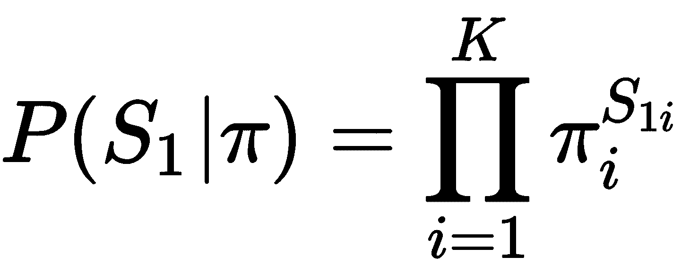
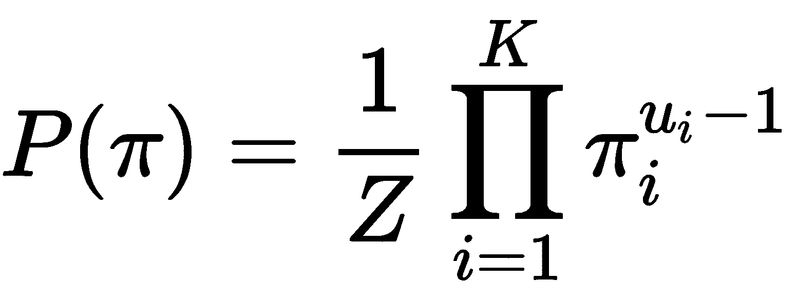
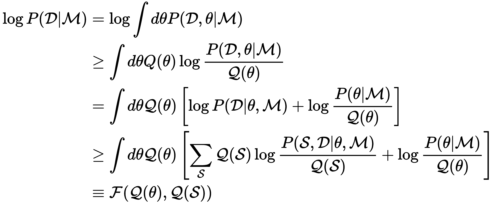

# 使用贝叶斯方法进行参数推断

在上一章中，我们讨论了使用最大似然法推断参数。在本章中，我们将通过贝叶斯方法探讨相同的问题。主要内容如下：

+   贝叶斯学习简介

+   隐马尔可夫模型中的贝叶斯学习

+   用于估计分布的近似算法

# 贝叶斯学习

在最大似然学习方法中，我们试图找到使得似然函数最大化的最优参数。但现实中的数据通常是非常嘈杂的，并且在大多数情况下，它并不能代表真实的底层分布。在这种情况下，最大似然方法会失败。例如，考虑投掷一枚公平的硬币几次。可能我们的所有投掷结果都是正面或反面。如果我们对这些数据使用最大似然方法，它会将正面或反面分别赋予概率 1，意味着我们永远不会得到另一面。或者，假设我们投掷硬币 10 次，得到了三次正面和七次反面。在这种情况下，最大似然方法会将正面的概率定为 0.3，反面的概率定为 0.7，这并不是公平硬币的真实分布。这个问题也通常被称为**过拟合**。

贝叶斯学习采用略有不同的方法来学习这些参数。我们首先为模型的参数分配一个先验分布。先验使我们对模型的假设变得显式。在投掷硬币的例子中，我们可以从一个将正面和反面赋予相等概率的先验开始。然后，我们应用贝叶斯定理根据数据计算参数的后验分布。这使我们能够根据数据将我们的信念（先验）向数据的指向转移，从而进行更为温和的参数估计。通过这种方式，贝叶斯学习能够解决最大似然方法的一个主要缺点。

更一般来说，在贝叶斯学习的情况下，我们尝试学习模型参数的分布，而不是学习一个能够最大化似然的单一参数。为了学习这种参数分布，我们使用贝叶斯定理，公式如下：

这里，*P(θ)* 是我们对模型参数的先验分布，*P(D|θ)* 是给定参数下数据的似然，*P(D)* 是观察到数据的概率。*P(D)* 也可以通过先验和似然表示如下：

现在让我们分别讨论这些术语，看看我们如何计算它们。先验，*P(θ)*，是一个参数的概率分布，代表我们对参数值的信念。例如，在抛硬币的情况下，我们可以将初始信念设为*θ*在 0 到 1 之间，并且是均匀分布的。似然项，*P(D|θ)*，是我们在第四章中尝试最大化的相同项，*使用最大似然进行参数推断*。它表示给定模型参数的情况下，观测数据的可能性。下一个术语，*P(D)*，是观测到数据的概率，它充当归一化项。由于它要求我们对所有可能的*θ*值求和，因此计算上非常困难，对于任何足够多的参数，计算会迅速变得不可处理。在本章的接下来的部分中，我们将看到可以用来近似这些值的不同算法。我们试图计算的术语，*P(D|θ)*，被称为**后验**。它表示给定我们的观测数据后，模型参数的最终概率分布。基本上，我们的先验通过使用似然项来更新，得到最终的分布。

贝叶斯学习解决的另一个问题是模型选择。由于贝叶斯学习为不同的可能模型提供了一个分布，而不是单一的模型，我们有几种方式可以从这些模型中进行预测。第一种方法是选择具有最大概率的特定模型，这也通常被称为**最大后验（MAP）**估计。另一种可能的方法是基于后验分布计算所有模型的预测期望。这使我们能够对预测进行正则化，因为我们是在对所有可能的模型进行期望计算。

# 选择先验

在进行贝叶斯学习时，一个常见的问题是如何选择合适的先验。正如大卫·麦凯所说，*没有假设就没有推理，我们需要对先验做出一个猜测*。我们的先验应该代表我们认为模型中最可能的参数。使用我们自己的先验的一个巨大好处是，我们使得关于模型的假设变得明确。一旦我们开始应用贝叶斯定理，使用我们的先验和观测数据，后验分布就会从我们的先验向一个更能代表数据的分布偏移。

从理论上讲，这听起来不错，因为我们可以选择非常复杂的先验分布来捕捉我们对模型的理解，但在应用贝叶斯定理时，我们需要将先验与似然相乘，而对于复杂的分布，这很快会变得计算上不可处理。因此，在实践中，我们通常选择与似然分布共轭的先验分布。共轭先验使我们能够得到贝叶斯定理的闭式解。正因为如此，高斯分布被用作先验和似然，因为将一个高斯分布与另一个高斯分布相乘的结果仍然是一个高斯分布。而且，计算两个高斯分布的乘积并不昂贵。

# 不可处理性

除了选择困难的先验分布外，贝叶斯学习中的另一个不可处理性的来源是贝叶斯定理中的分母项：

正如我们在前面的公式中看到的，为了计算*P(D)*，我们需要对所有可能的*θ*值求和，而*θ*是我们模型中所有参数的集合。如果我们模型中的参数很多，那么计算这个项在计算上是不可处理的，因为项的大小会随着参数数量的增加而呈指数增长。很多工作已经致力于近似这个值，正如我们在本章的下一节中将看到的那样。

# HMM 中的贝叶斯学习

正如我们在前一节中看到的，在贝叶斯学习的情况下，我们假设所有变量都是随机变量，给它们分配一个先验，然后根据这个先验计算后验。因此，在 HMM 的情况下，我们可以对我们的转移概率、发射概率或观测状态的数量分配先验。

因此，我们需要解决的第一个问题是选择先验。从理论上讲，先验可以是模型参数上的任何分布，但在实践中，我们通常尝试使用与似然分布共轭的先验，这样我们就可以得到方程的闭式解。例如，在 HMM 输出为离散的情况下，常见的先验选择是 Dirichlet 分布。这主要有两个原因，第一个原因是 Dirichlet 分布是多项式分布的共轭分布，允许我们轻松地将它们相乘。

**共轭分布**：如果通过将先验与似然相乘得到的后验分布属于与先验分布相同的分布族，则称一族先验分布是与一族似然分布共轭的。

例如，由于给定*π*参数向量时，初始状态的似然是多项式分布：

如果*π*的先验概率是 Dirichlet 分布：

其中 *u = [u[1], u[2], ..., u[K]]* 是超参数向量，*Z* 是归一化常数。我们现在可以根据似然函数和先验来计算后验，其公式如下：

我们可以看到后验分布也是一个狄利克雷分布。因此，我们可以说狄利克雷分布是多项式分布的共轭先验。以类似的方式，我们可以为我们的转移矩阵和发射矩阵设定狄利克雷先验。

选择狄利克雷先验的第二个原因是它具有一个理想的性质，即其超参数可以解释为假设的观测次数。在前面的例子中，如果 *u[i] = 2* 且 *u[j] = 1* （对于 *j ≠ i*），那么 *π* 的 MAP 估计将与最大似然估计相同，假设训练数据中有一个额外的数据点，其初始状态为 *i*。这种共轭性质使得我们可以通过对 Baum-Welch 算法做一个小的变动来进行 MAP 估计。这也为隐马尔可夫模型中看似临时但非常常见的正则化方法提供了理论依据，该方法只是将一个小的正数加到参数向量的所有元素上。

在前面的几段中，我们专门讨论了输出为离散的情况。但相同的概念也可以扩展到连续输出的情况。在连续分布的情况下也存在共轭分布。最常用的分布之一是高斯分布，因为它在进行不同操作后仍然保持在同一分布族中。

# 近似所需的积分

如前所述，贝叶斯方法将所有未知量视为随机变量。我们为这些变量分配先验分布，然后在观察到数据后估计这些变量的后验分布。在隐马尔可夫模型（HMM）的情况下，未知量包括 HMM 的结构，即状态的数量、网络的参数和隐藏状态。与最大似然估计或 MAP 估计不同，在这些方法中我们为这些参数找到点估计，而现在我们有这些参数的分布。这使得我们可以在模型结构之间进行比较，但为了做到这一点，我们需要对模型的参数和隐藏状态进行积分。这通常被称为贝叶斯积分。

由于这些积分在计算上难以处理，我们采用近似方法来计算这些值。在接下来的几个小节中，我们将概述其中的一些方法。这些方法的详细分析超出了本书的范围。

# 采样方法

采样方法是估计难以处理的分布的最常见方式之一。其基本思想是以某种方式从分布空间中采样，使得我们能从高概率区域获得更多的样本。然后基于这些样本，我们估计分布。

# 拉普拉斯近似

拉普拉斯近似使用中央极限定理，该定理从表现良好的先验和数据中得出，后验参数将在大量训练样本的极限中收敛到围绕参数 MAP 估计的高斯分布。为了使用拉普拉斯近似估计证据，首先在常规优化过程中找到 MAP 参数，然后在 MAP 估计处计算对数似然的海森矩阵。证据通过在 MAP 估计的 *θ* 处评估 *P(θ,D)/P(θ|D)* 比率来近似，分母使用高斯近似。拉普拉斯近似有几个缺点：

+   从参数计算海森矩阵通常非常昂贵。

+   高斯近似对于参数为正且总和为 1 的模型并不适用，特别是当相对于数据集的大小有许多参数时。

出于这些原因，拉普拉斯近似通常不用于隐马尔可夫模型（HMM）。

# Stolke 和 Omohundro 的方法

在著名的论文 *HMM 通过贝叶斯模型合并进行归纳* 中，Stolke 和 Omohundro 提出了一种新的技术，用于近似 HMM 的贝叶斯积分。考虑一种情况，所有的 HMM 状态都是观察到的，且先验是狄利克雷分布。在这种情况下，当使用贝叶斯学习法学习参数时，后验也将是狄利克雷分布，然后证据积分可以表示为狄利克雷积分的乘积，这些积分可以轻松计算。因此，从某种意义上讲，我们可以说，证据积分难以处理的原因是状态和参数是隐藏的。

Stolke 和 Omohundro 提出了一种方法，旨在使用类似维特比算法的方法找到最可能的隐藏状态序列，并将此序列作为观察状态。使用这些观察值，我们可以轻松进行证据积分。该方法建议在这两个步骤之间迭代，逐步搜索模型结构，根据近似证据的比较合并或拆分状态。在他们的论文中，Stolke 和 Omohundro 表明，通过将对隐藏变量的积分替代为对参数的积分，这种方法能够获得良好的结果。

# 变分方法

变分方法是另一种非常常见的近似分布的方法。一般思路是从选择一个更简单的分布族开始，然后尝试找到这个分布的超参数，使得该分布尽可能接近我们的原始分布。用于确定两个分布接近度的度量有多种；最常用的度量是 Kullback-Leibler 散度。这种方法本质上将推理问题转化为一个优化问题，在这个问题中我们尝试最小化我们的散度度量。

在 HMMs 的情况下，我们通常假设隐藏状态与模型的参数是独立的。这使得我们可以同时近似隐藏状态和参数的分布。更具体地说，通过应用 Jensen 不等式两次，可以对证据进行下界估计：

变分贝叶斯方法通过迭代地最大化  作为两个自由分布，*Q(S)* 和 *Q(θ)* 的泛函。在前述方程中，我们可以看到，这种最大化等价于最小化 *Q(S)Q(θ)* 和隐藏状态及 *P(S,θ|D,M)* 参数的联合后验之间的 KL 散度。David MacKay 首次提出了一种变分贝叶斯方法来进行 HMMs 中的学习。他假设先验是一个狄利克雷分布，并且假设参数与隐藏状态是独立的，他展示了最优的 *Q(θ)* 是一个狄利克雷分布。此外，他还展示了可以通过将前向-后向算法应用于具有伪参数的 HMM 来获得最优的 *Q(S)*，这些伪参数由  给出，且可以对狄利克雷分布进行评估。因此，整个变分贝叶斯方法可以作为 Baum-Welch 算法的简单修改来实现。本质上，我们可以说，变分贝叶斯方法是 MAP 方法和 Stolke 与 Omohundro 方法的特殊情况的结合。这是非常有前景的，尤其是考虑到它在其他模型中已成功应用于非平凡的模型结构学习；它在 HMMs 及其扩展中的潜力尚未得到充分探索。

# 代码

目前，Python 中没有支持使用贝叶斯学习进行学习的包，而且编写完整的代码以适应本书的内容是非常困难的。尽管使用贝叶斯学习有很多优点，但在很多情况下，它通常在计算上是不可行的。基于这些原因，我们跳过了隐藏马尔可夫模型（HMMs）中的贝叶斯学习代码。

# 摘要

在本章中，我们讨论了在隐马尔可夫模型（HMMs）中应用贝叶斯学习来学习参数。贝叶斯学习相比最大似然估计器有一些优势，但除非我们有闭式解，否则它在计算上是相当昂贵的。闭式解只有在使用共轭先验时才有可能。接下来的章节中，我们将讨论隐马尔可夫模型在各种问题中的详细应用。
