# 使用 GAN 进行图像翻译以实现风格迁移

欢迎来到关于**生成对抗网络**（**GANs**）的章节。在本章中，我们将构建一个神经网络，填补手写数字缺失的部分。之前，我们为餐饮连锁店构建了一个数字分类器。但他们也注意到，有时当顾客写下电话号码时，数字的某些小部分缺失。这可能是由于顾客在 iPad 应用程序上写字时没有流畅的书写动作，也可能是因为 iPad 应用程序没有正确处理用户在屏幕上的完整手势。这使得手写数字分类器很难预测出与手写数字对应的正确数字。现在，他们希望我们重建（生成回）手写数字缺失的部分，以便分类器能够接收到清晰的手写数字并转化为数字。这样，分类器将能够更准确地分类手写数字，通知也能发送到正确的饥饿顾客！

我们将主要关注数字缺失部分的生成/重建，并且我们将借助 GAN 的神经修复来完成这一点；请参见以下流程图：

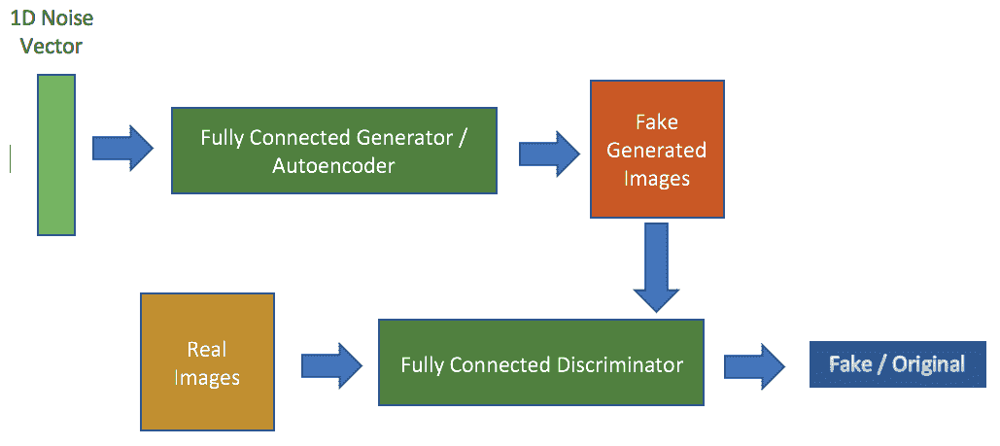

图 13.1：GAN 流程图

本章我们将学习以下内容：

+   什么是 GAN

+   什么是生成器和判别器

+   编写模型并定义超参数

+   构建并理解训练循环

+   测试模型

+   将模型扩展到新的数据集

在本章中，你将实现以下内容：

+   构建一个 MNIST 数字分类器

+   模拟一个手写数字数据集，其中部分手写数字缺失

+   使用 MNIST 分类器预测带噪声/掩码的 MNIST 数字数据集（模拟数据集）

+   实现 GAN 来恢复数字缺失的部分

+   使用 MNIST 分类器预测来自 GAN 生成的数字

+   比较掩码数据和生成数据的性能

最好在本章中边学边实现代码片段，可以在 Jupyter Notebook 或任何源代码编辑器中进行。这将帮助你更容易地跟随课程，并理解每一部分代码的作用。

本章的所有 Python 文件和 Jupyter Notebook 文件可以在这里找到：[`github.com/PacktPublishing/Python-Deep-Learning-Projects/tree/master/Chapter13`](https://github.com/PacktPublishing/Python-Deep-Learning-Projects/tree/master/Chapter13)。

# 让我们开始实现代码吧！

在这个练习中，我们将使用 Keras 深度学习库，它是一个高级神经网络 API，可以在 Tensorflow、Theano 或 Cognitive Toolkit (CNTK) 上运行。

了解代码！我们不会花时间去理解 Keras 的工作原理，但如果你感兴趣，可以参考这个通俗易懂的 Keras 官方文档：[`keras.io/`](https://keras.io/)。

# 导入所有依赖包

在这个练习中，我们将使用 `numpy`、`matplotlib`、`keras`、`tensorflow` 和 `tqdm` 包。这里，TensorFlow 被用作 Keras 的后端。你可以使用 `pip` 安装这些包。对于 MNIST 数据，我们将使用 `keras` 模块中的数据集，只需简单导入即可：

```py
import numpy as np
import random
import matplotlib.pyplot as plt
%matplotlib inline

from tqdm import tqdm

from keras.layers import Input, Conv2D
from keras.layers import AveragePooling2D, BatchNormalization
from keras.layers import UpSampling2D, Flatten, Activation
from keras.models import Model, Sequential
from keras.layers.core import Dense, Dropout
from keras.layers.advanced_activations import LeakyReLU
from keras.optimizers import Adam
from keras import backend as k

from keras.datasets import mnist
```

设置 `seed` 以确保可重现性是很重要的：

```py
# set seed for reproducibility
seed_val = 9000
np.random.seed(seed_val)
random.seed(seed_val)
```

# 探索数据

我们将从 `keras` 模块中使用 `mnist.load_data()` 加载 MNIST 数据到会话中。完成后，我们将打印数据集的形状和大小，以及数据集中类别的数量和唯一标签：

```py
(X_train, y_train), (X_test, y_test) =  mnist.load_data()

print('Size of the training_set: ', X_train.shape)
print('Size of the test_set: ', X_test.shape)
print('Shape of each image: ', X_train[0].shape)
print('Total number of classes: ', len(np.unique(y_train)))
print('Unique class labels: ', np.unique(y_train))
```

我们有一个包含 10 个不同类别、60,000 张图像的数据集，每张图像的形状是 28*28，每个类别有 6,000 张图像。

让我们绘制并看看这些手写图像是什么样子的：

```py
# Plot of 9 random images
for i in range(0, 9):
    plt.subplot(331+i) # plot of 3 rows and 3 columns
    plt.axis('off') # turn off axis
    plt.imshow(X_train[i], cmap='gray') # gray scale
```

输出结果如下：

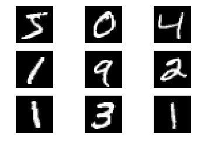

图 13.2：来自训练集的九个 MNIST 数字图

让我们绘制来自每个类别的一个手写数字：

```py
# plotting image from each class
fig=plt.figure(figsize=(8, 4))
columns = 5
rows = 2
for i in range(0, rows*columns):
    fig.add_subplot(rows, columns, i+1)
    plt.title(str(i)) # label 
    plt.axis('off') # turn off axis
    plt.imshow(X_train[np.where(y_train==i)][0], cmap='gray') # gray scale
plt.show()
```

输出结果如下：

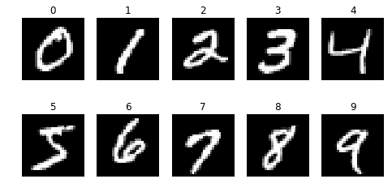

图 13.3：来自每个类别的一个 MNIST 数字图

查看数据集中最大和最小的像素值：

```py
print('Maximum pixel value in the training_set: ', np.max(X_train))
print('Minimum pixel value in the training_set: ', np.min(X_train))
```

输出结果如下：


图 13.5：九个带噪声/掩蔽的 MNIST 数字图

我们看到数据集中的最大像素值为 255，最小值为 0。

# 准备数据

类型转换、居中、缩放和重塑是我们将在本章中实现的一些预处理操作。

# 类型转换、居中和缩放

将类型设置为 `np.float32`。

**重要**：这样做的主要原因之一是权重将全部为 `float` 类型，而浮动数值间的乘法运算比整数和浮动数值间的乘法运算要快得多。因此，将输入转换为 `float` 类型是更好的选择。

对于居中，我们通过 127.5 从数据集中减去。数据集中的值将现在介于 -127.5 到 127.5 之间。

对于缩放，我们通过数据集中最大像素值的一半，即 *255/2*，来除以居中的数据集。这将导致一个值范围介于 -1 和 1 之间的数据集：

```py
# Converting integer values to float types 
X_train = X_train.astype(np.float32)
X_test = X_test.astype(np.float32)

# Scaling and centering
X_train = (X_train - 127.5) / 127.5
X_test = (X_test - 127.5)/ 127.5
print('Maximum pixel value in the training_set after Centering and Scaling: ', np.max(X_train))
print('Minimum pixel value in the training_set after Centering and Scaling: ', np.min(X_train))
```

让我们定义一个函数，将缩放后的图像的像素值重新缩放到 0 到 255 之间：

```py
# Rescale the pixel values (0 and 255)
def upscale(image):
    return (image*127.5 + 127.5).astype(np.uint8)

# Lets see if this works
z = upscale(X_train[0])
print('Maximum pixel value after upscaling scaled image: ',np.max(z))
print('Maximum pixel value after upscaling scaled image: ',np.min(z))
```

**Matplotlib 提示**：需要进行缩放，以避免在使用未经放大的缩放图像时遇到 Matplotlib 错误。

放大后的 9 张居中和缩放后的图像：

```py
for i in range(0, 9):
    plt.subplot(331+i) # plot of 3 rows and 3 columns
    plt.axis('off') # turn off axis
    plt.imshow(upscale(X_train[i]), cmap='gray') # gray scale
```

输出结果如下：


图 13.4：放大后九个居中和缩放的 MNIST 数字图

# 掩蔽/插入噪声

根据本项目的需求，我们需要模拟一个不完整数字的数据集。因此，让我们编写一个函数，遮挡原始图像中的小区域，形成噪声数据集。

这里的想法是将图像的一个 8*8 区域进行遮挡，遮挡区域的左上角落在图像的第 9 到第 13 个像素之间（即在 x 和 y 轴上索引 8 到 12 之间）。目的是确保我们总是遮住图像的中心部分：

```py
def noising(image):
    array = np.array(image)
    i = random.choice(range(8,12)) # x coordinate for the top left corner of the mask
    j = random.choice(range(8,12)) # y coordinate for the top left corner of the mask
    array[i:i+8, j:j+8]=-1.0 # setting the pixels in the masked region to -1
    return array

noised_train_data = np.array([*map(noising, X_train)])
noised_test_data = np.array([*map(noising, X_test)])
print('Noised train data Shape/Dimension : ', noised_train_data.shape)
print('Noised test data Shape/Dimension : ', noised_train_data.shape)
```

蒙版的大小越大，MNIST 分类器预测正确数字的难度就越大。

随意尝试不同的遮挡区域大小，可以尝试更小或更大，也可以尝试不同的遮挡位置。

`9` 张经过放大处理的噪声图像的图：

```py
# Plot of 9 scaled noised images after upscaling
for i in range(0, 9):
    plt.subplot(331+i) # plot of 3 rows and 3 columns
    plt.axis('off') # turn off axis
    plt.imshow(upscale(noised_train_data[i]), cmap='gray') # gray scale
```

输出如下：

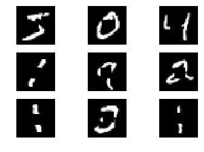

图 13.5：九个带噪声/遮挡的 MNIST 数字的图示

# 重塑

将原始数据集和噪声数据集重塑为 60000*28*28*1 的形状。这非常重要，因为 2D 卷积期望接收的图像形状是 28*28*1：

```py
# Reshaping the training data
X_train = X_train.reshape(X_train.shape[0], X_train.shape[1], X_train.shape[2], 1)
print('Size/Shape of the original training set: ', X_train.shape)

# Reshaping the noised training data
noised_train_data = noised_train_data.reshape(noised_train_data.shape[0],
                                              noised_train_data.shape[1],
                                              noised_train_data.shape[2], 1)
print('Size/Shape of the noised training set: ', noised_train_data.shape)

# Reshaping the testing data
X_test = X_test.reshape(X_test.shape[0], X_test.shape[1], X_test.shape[2], 1)
print('Size/Shape of the original test set: ', X_test.shape)

# Reshaping the noised testing data
noised_test_data = noised_test_data.reshape(noised_test_data.shape[0],
                                            noised_test_data.shape[1],
                                            noised_test_data.shape[2], 1)
print('Size/Shape of the noised test set: ', noised_test_data.shape)
```

如果你在 GPU 上进行多次训练，最好在每次训练后清理 GPU 空间，以确保下次训练能够高效执行，避免**资源耗尽**相关的错误，这在 GPU 上比较常见。可以使用以下代码来完成：

`from keras import backend as k`

`k.clear_session()`

# MNIST 分类器

为了开始建模，让我们构建一个简单的**卷积神经网络**（**CNN**）。

数字分类器。

第一层是一个卷积层，包含 32 个 3*3 大小的滤波器，使用 `relu` 激活函数，并且使用 `Dropout` 作为正则化。第二层是一个卷积层，包含 64 个 3*3 大小的滤波器，使用 `relu` 激活函数，并且使用 `Dropout` 作为正则化。第三层是一个卷积层，包含 128 个 3*3 大小的滤波器，使用 `relu` 激活函数，并且使用 `Dropout` 作为正则化，最后进行展平处理。第四层是一个 `Dense` 层，包含 1024 个神经元，使用 `relu` 激活函数。最后一层是一个 `Dense` 层，包含 10 个神经元，对应于 MNIST 数据集中的 10 个类别，使用 `softmax` 激活函数，`batch_size` 设置为 128，使用的 `optimizer` 是 `adam`，`validation_split` 设置为 0.2。这意味着 20% 的训练集将作为验证集使用：

```py
# input image shape
input_shape = (28,28,1)

def train_mnist(input_shape, X_train, y_train):
    model = Sequential()
    model.add(Conv2D(32, (3, 3), strides=2, padding='same',
                     input_shape=input_shape))
    model.add(Activation('relu'))
    model.add(Dropout(0.2))

    model.add(Conv2D(64, (3, 3), strides=2, padding='same'))
    model.add(Activation('relu'))
    model.add(Dropout(0.2)) 

    model.add(Conv2D(128, (3, 3), padding='same'))
    model.add(Activation('relu'))
    model.add(Dropout(0.2))
    model.add(Flatten())

    model.add(Dense(1024, activation = 'relu'))
    model.add(Dense(10, activation='softmax'))
    model.compile(loss = 'sparse_categorical_crossentropy',
                  optimizer = 'adam', metrics = ['accuracy'])
    model.fit(X_train, y_train, batch_size = 128,  
              epochs = 3, validation_split=0.2, verbose = 1 )
    return model

mnist_model = train_mnist(input_shape, X_train, y_train)
```

输出如下：


图 13.6：MNIST CNN 分类器训练三轮

使用已构建的 CNN 数字分类器在被遮挡的图像上进行测试，来评估其在缺少部分数字的图像上的表现：

```py
# prediction on the masked images
pred_labels = mnist_model.predict_classes(noised_test_data)
print('The model model accuracy on the masked images is:',np.mean(pred_labels==y_test)*100)
```

在被遮挡的图像上，CNN 数字分类器的准确率为 74.9%。当你运行时，结果可能会略有不同，但应该会非常接近。

在前面的分类器中，我们没有使用最大池化（maxpooling）。尝试使用最大池化或其他池化选项构建相同的分类器。

# 定义 GAN 的超参数

以下是一些在代码中定义并将使用的超参数，完全可以配置：

```py
# Smoothing value
smooth_real = 0.9

# Number of epochs
epochs = 5

# Batchsize
batch_size = 128

# Optimizer for the generator
optimizer_g = Adam(lr=0.0002, beta_1=0.5)

# Optimizer for the discriminator
optimizer_d = Adam(lr=0.0004, beta_1=0.5)

# Shape of the input image
input_shape = (28,28,1)
```

尝试不同的学习率、优化器、批大小和光滑值，观察这些因素如何影响模型的质量，如果得到更好的结果，展示给深度学习社区。

# 构建 GAN 模型组件

基于最终的 GAN 模型能够填充缺失（被遮蔽）图像部分的想法，让我们来定义生成器。

# 定义生成器

我们在这里使用的生成器是一个简单的卷积自编码器，它由两部分组成——编码器和解码器。

在编码器中，我们有以下内容：

+   第一层是一个卷积 2D 层，使用`32`个 3x3 大小的滤波器，接着进行批归一化，激活函数为`relu`，然后是使用`AveragePooling2D`进行 2x2 大小的下采样。

+   第二层是一个卷积 2D 层，使用`64`个 3x3 大小的滤波器，接着进行批归一化，激活函数为`relu`，然后是使用`AveragePooling2D`进行 2x2 大小的下采样。

+   第三层或该编码器部分的最终层仍然是一个卷积 2D 层，使用`128`个 3x3 大小的滤波器，进行批归一化，激活函数为`relu`。

在解码器中，我们有以下内容：

+   第一层是一个卷积 2D 层，使用`128`个 3x3 大小的滤波器，激活函数为`relu`，接着是使用`UpSampling2D`进行上采样。

+   第二层是一个卷积 2D 层，使用`64`个 3x3 大小的滤波器，激活函数为`relu`，接着是使用`UpSampling2D`进行上采样。

+   第三层或该解码器部分的最终层仍然是一个卷积 2D 层，使用`1`个 3x3 大小的滤波器，激活函数为`tanh`。

记住，在编码器中，如果你有`32`、`64`、`128`个滤波器，那么在解码器中应该跟随`128`、`64`、`image_channels`个滤波器。`image_channels`是输入图像的通道数，在 MNIST 数据集中为 1。如果编码器的第一、第二、第三和第四层有`64`、`128`、`256`、`512`个滤波器，那么解码器中的对应滤波器应该是`256`、`128`、`64`、`image_channels`。

```py
def img_generator(input_shape):
    generator = Sequential()
    generator.add(Conv2D(32, (3, 3), padding='same', input_shape=input_shape)) # 32 filters
    generator.add(BatchNormalization())
    generator.add(Activation('relu'))
    generator.add(AveragePooling2D(pool_size=(2, 2)))

    generator.add(Conv2D(64, (3, 3), padding='same')) # 64 filters
    generator.add(BatchNormalization())
    generator.add(Activation('relu'))
    generator.add(AveragePooling2D(pool_size=(2, 2)))

    generator.add(Conv2D(128, (3, 3), padding='same')) # 128 filters
    generator.add(BatchNormalization())
    generator.add(Activation('relu')) 

    generator.add(Conv2D(128, (3, 3), padding='same')) # 128 filters
    generator.add(Activation('relu'))
    generator.add(UpSampling2D((2,2)))

    generator.add(Conv2D(64, (3, 3), padding='same')) # 64 filters
    generator.add(Activation('relu'))
    generator.add(UpSampling2D((2,2)))

    generator.add(Conv2D(1, (3, 3), activation='tanh', padding='same')) # 1 filter
    return generator
```

关于生成器中最终卷积层，有两点需要记住。一是使用`tanh`作为激活函数，因为数据集的范围是-1 到 1，另一个是使用与输入图像通道数相同数量的滤波器。这是为了确保生成的图像与输入图像有相同数量的通道。

如果你决定像我们在本次练习中做的那样对数据进行居中和缩放，你需要在生成器中使用批归一化进行下采样，否则损失将无法收敛。你可以通过在没有批归一化层的情况下训练生成器，亲自见证不使用批归一化的效果。

在以下的生成器`summary`中，如果查看输出形状，您会看到网络前半部分是图像的降采样或压缩，后半部分是图像的放大：

```py
# print generator summary
img_generator(input_shape).summary()
```

输出如下：


图 13.7：生成器概述（自动编码器）

在使用自动编码器时，如果没有得到好的结果，请考虑以下几点。首先使用`AveragePooling2D`，然后尝试`MaxPooling2D`进行降采样。先使用`LeakyReLU`，然后再尝试`relu`。除了最后一层的卷积层外，所有卷积层都使用`LeakyReLU`或`relu`激活函数。尝试使用更深的自动编码器。可以在卷积层中使用更多的滤波器，调整滤波器和池化层的大小。

# 定义判别器

判别器是一个简单的 CNN 二分类器，接收由生成器生成的图像，并尝试将其分类为原始图像或伪造图像。

第一层是一个卷积 2D 层，具有`64`个 3*3 大小的滤波器，激活函数为`LeakyReLU`，并使用`Dropout`作为正则化器。第二层和第三层与第一层相同，唯一不同的是第二层有`128`个滤波器，第三层有`256`个滤波器。最后一层是一个`Dense`层，使用`sigmoid`激活函数，因为我们正在进行二分类：

```py
def img_discriminator(input_shape):
    discriminator = Sequential()
    discriminator.add(Conv2D(64, (3, 3), strides=2, padding='same', input_shape=input_shape, activation = 'linear'))
    discriminator.add(LeakyReLU(0.2))
    discriminator.add(Dropout(0.2))

    discriminator.add(Conv2D(128, (3, 3), strides=2, padding='same', activation = 'linear'))
    discriminator.add(LeakyReLU(0.2))
    discriminator.add(Dropout(0.2))

    discriminator.add(Conv2D(256, (3, 3), padding='same', activation = 'linear'))
    discriminator.add(LeakyReLU(0.2))
    discriminator.add(Dropout(0.2))

    discriminator.add(Flatten())
    discriminator.add(Dense(1, activation='sigmoid'))

    return discriminator

# print summary of the discriminator
img_discriminator(input_shape).summary()
```

输出如下：

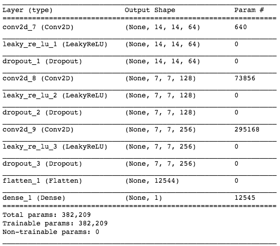

图 13.8：判别器概述

根据你需要解决的问题，调整判别器的参数。如果需要，可以在模型中加入`MaxPooling`层。

# 定义 DCGAN

以下函数将输入传递给生成器，然后是判别器，从而形成 DCGAN 架构：

```py
def dcgan(discriminator, generator, input_shape):
    # Set discriminator as non trainable before compiling GAN
    discriminator.trainable = False

    # Accepts the noised input
    gan_input = Input(shape=input_shape)

    # Generates image by passing the above received input to the generator
    gen_img = generator(gan_input)

    # Feeds the generated image to the discriminator
    gan_output = discriminator(gen_img)

    # Compile everything as a model with binary crossentropy loss
    gan = Model(inputs=gan_input, outputs=gan_output)
    return gan
```

如果你以前没有使用过`Model`函数 API，请访问 Keras 的详细文档，了解如何使用`Model`函数 API 并进行编译，链接：[`keras.io/models/model/`](https://keras.io/models/model/)。

# 训练 GAN

我们已经构建了 GAN 的各个组件。接下来，让我们开始训练模型吧！

# 绘制训练过程 - 第一部分

在每个 epoch 中，以下函数将绘制`9`张生成的图像。为了对比，它还将绘制对应的`9`张原始目标图像和`9`张带噪声的输入图像。绘制时我们需要使用已经定义的`upscale`函数，确保图像缩放到 0 到 255 之间，以避免绘图时出现问题：

```py
def generated_images_plot(original, noised_data, generator):

    print('NOISED')
    for i in range(9):
        plt.subplot(331 + i)
        plt.axis('off')
        plt.imshow(upscale(np.squeeze(noised_data[i])), cmap='gray') # upscale for plotting
    plt.show()

    print('GENERATED')
    for i in range(9):
        pred = generator.predict(noised_data[i:i+1], verbose=0)
        plt.subplot(331 + i)
        plt.axis('off')
        plt.imshow(upscale(np.squeeze(pred[0])), cmap='gray') # upscale to avoid plotting errors
    plt.show()

    print('ORIGINAL')
    for i in range(9):
        plt.subplot(331 + i)
        plt.axis('off')
        plt.imshow(upscale(np.squeeze(original[i])), cmap='gray') # upscale for plotting
    plt.show()
```

此函数的输出如下：

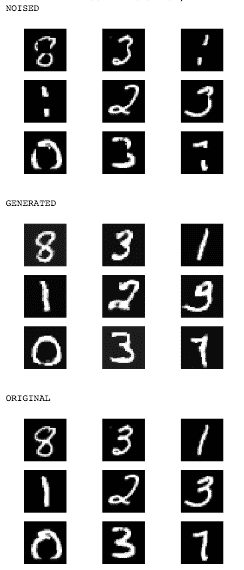

图 13.9：生成图像绘制函数的示例/预期输出

# 绘制训练过程 - 第二部分

让我们定义另一个函数，用于绘制每个 epoch 生成的图像。为了反映差异，我们还将在图中包含原始图像和带噪声/掩码的图像。

顶行是原始图像，中间行是遮罩图像，底行是生成的图像。

绘图有`12`行，顺序为：第 1 行 - 原始图像，第 2 行 - 遮罩图像，第 3 行 - 生成图像，第 4 行 - 原始图像，第 5 行 - 遮罩图像，...，第 12 行 - 生成图像。

让我们来看看相应的代码：

```py
def plot_generated_images_combined(original, noised_data, generator):
    rows, cols = 4, 12
    num = rows * cols
    image_size = 28

    generated_images = generator.predict(noised_data[0:num])

    imgs = np.concatenate([original[0:num], noised_data[0:num], generated_images])
    imgs = imgs.reshape((rows * 3, cols, image_size, image_size))
    imgs = np.vstack(np.split(imgs, rows, axis=1))
    imgs = imgs.reshape((rows * 3, -1, image_size, image_size))
    imgs = np.vstack([np.hstack(i) for i in imgs])
    imgs = upscale(imgs)
    plt.figure(figsize=(8,16))
    plt.axis('off')
    plt.title('Original Images: top rows, '
              'Corrupted Input: middle rows, '
              'Generated Images: bottom rows')
    plt.imshow(imgs, cmap='gray')
    plt.show() 
```

输出如下：

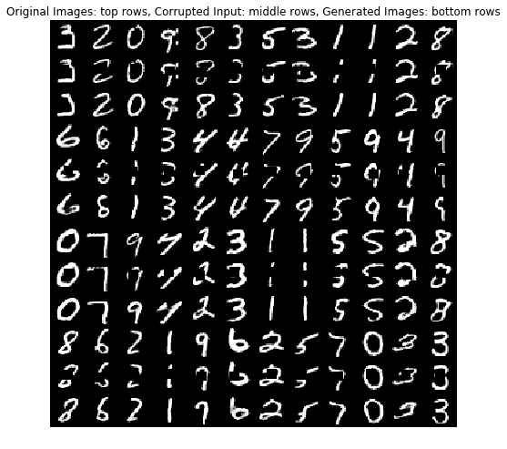

图 13.10：来自`plot_generated_images_combined`函数的样本/预期输出

# 训练循环

现在我们来到了代码中最重要的部分；即之前定义的所有函数将会在这一部分使用。以下是步骤：

1.  通过调用`img_generator()`函数加载生成器。

1.  通过调用`img_discriminator()`函数加载判别器，并使用二元交叉熵损失和优化器`optimizer_d`进行编译，该优化器在超参数部分已定义。

1.  将生成器和判别器输入到`dcgan()`函数中，并使用二元交叉熵损失和优化器`optimizer_g`进行编译，该优化器在超参数部分已定义。

1.  创建一批新的原始图像和遮罩图像。通过将这批遮罩图像输入生成器，生成新的假图像。

1.  将原始图像和生成的图像拼接，使得前 128 张图像为原始图像，接下来的 128 张为假图像。重要的是，这里不要打乱数据，否则训练会变得困难。将生成的图像标记为`0`，将原始图像标记为`0.9`，而不是 1。 这就是对原始图像进行的单边标签平滑。使用标签平滑的原因是使网络能够抵抗对抗样本。这是单边标签平滑，因为我们只对真实图像进行标签平滑。

1.  设置`discriminator.trainable`为`True`，以启用判别器的训练，并将这 256 张图像及其相应的标签输入判别器进行分类。

1.  现在，将`discriminator.trainable`设置为`False`，并将新的 128 张标记为 1 的遮罩图像输入 GAN（DCGAN）进行分类。将`discriminator.trainable`设置为`False`非常重要，以确保在训练生成器时，判别器不会参与训练。

1.  重复步骤 4 至 7，直到达到期望的训练轮次。

这里使用的批量大小为 128。

我们已经将`plot_generated_images_combined()`函数和`generated_images_plot()`函数放置在一起，以便在第一轮的第一次迭代和每轮结束后，通过这两个函数生成一个绘图。

根据你需要显示图像的频率，随意放置这些绘图函数：

```py
def train(X_train, noised_train_data,
 input_shape, smooth_real,
 epochs, batch_size,
 optimizer_g, optimizer_d):

    # define two empty lists to store the discriminator
 # and the generator losses
    discriminator_losses = []
    generator_losses = []

    # Number of iteration possible with batches of size 128
    iterations = X_train.shape[0] // batch_size

    # Load the generator and the discriminator
    generator = img_generator(input_shape)
    discriminator = img_discriminator(input_shape)

    # Compile the discriminator with binary_crossentropy loss
    discriminator.compile(loss='binary_crossentropy',optimizer=optimizer_d)

    # Feed the generator and the discriminator to the function dcgan
 # to form the DCGAN architecture
    gan = dcgan(discriminator, generator, input_shape)

    # Compile the DCGAN with binary_crossentropy loss
    gan.compile(loss='binary_crossentropy', optimizer=optimizer_g)

    for i in range(epochs):
        print ('Epoch %d' % (i+1))
        # Use tqdm to get an estimate of time remaining
        for j in tqdm(range(1, iterations+1)):

            # batch of original images (batch = batchsize)
            original = X_train[np.random.randint(0, X_train.shape[0], size=batch_size)]

            # batch of noised images (batch = batchsize)
            noise = noised_train_data[np.random.randint(0, noised_train_data.shape[0], size=batch_size)]

            # Generate fake images
            generated_images = generator.predict(noise)

            # Labels for generated data
            dis_lab = np.zeros(2*batch_size)

            # data for discriminator
            dis_train = np.concatenate([original, generated_images])

            # label smoothing for original images
            dis_lab[:batch_size] = smooth_real

            # Train discriminator on original images
            discriminator.trainable = True
            discriminator_loss = discriminator.train_on_batch(dis_train, dis_lab)

            # save the losses 
            discriminator_losses.append(discriminator_loss)

            # Train generator
            gen_lab = np.ones(batch_size)
            discriminator.trainable = False
            sample_indices = np.random.randint(0, X_train.shape[0], size=batch_size)
            original = X_train[sample_indices]
            noise = noised_train_data[sample_indices]

            generator_loss = gan.train_on_batch(noise, gen_lab)

            # save the losses
            generator_losses.append(generator_loss)

            if i == 0 and j == 1:
                print('Iteration - %d', j)
                generated_images_plot(original, noise, generator)
                plot_generated_images_combined(original, noise, generator)

        print("Discriminator Loss: ", discriminator_loss,\
              ", Adversarial Loss: ", generator_loss)

        # training plot 1
        generated_images_plot(original, noise, generator)
        # training plot 2
        plot_generated_images_combined(original, noise, generator)

    # plot the training losses
    plt.figure()
    plt.plot(range(len(discriminator_losses)), discriminator_losses,
             color='red', label='Discriminator loss')
    plt.plot(range(len(generator_losses)), generator_losses,
             color='blue', label='Adversarial loss')
    plt.title('Discriminator and Adversarial loss')
    plt.xlabel('Iterations')
    plt.ylabel('Loss (Adversarial/Discriminator)')
    plt.legend()
    plt.show()

    return generator

generator = train(X_train, noised_train_data,
                  input_shape, smooth_real,
                  epochs, batch_size,
                  optimizer_g, optimizer_d)
```

输出如下：


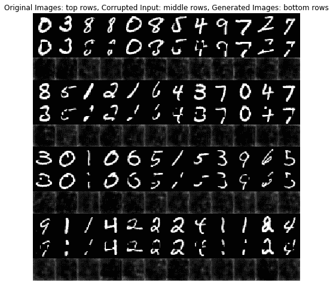

图 13.11.1：在第 1 轮的第一次迭代结束时，绘制的生成图像与训练图像一起显示

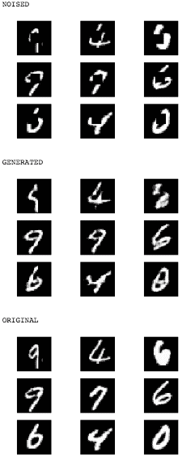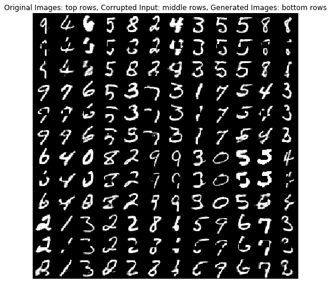

图 13.11.2：第 2 轮训练结束时，生成的图像与训练图表的结合

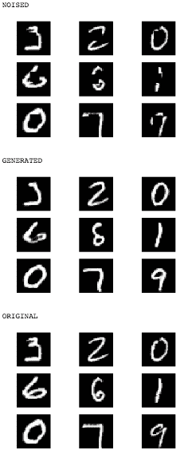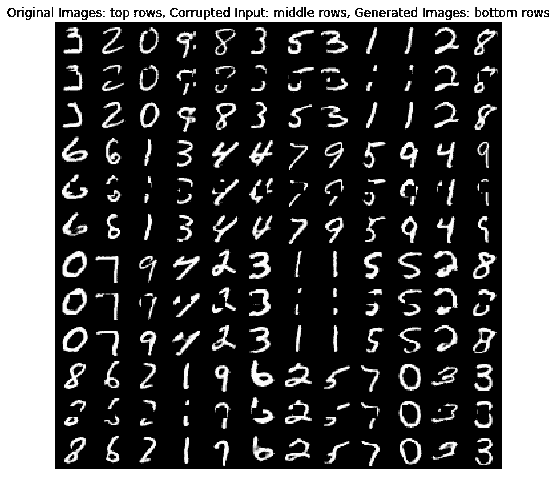

图 13.11.3：第 5 轮训练结束时，生成的图像与训练图表的结合

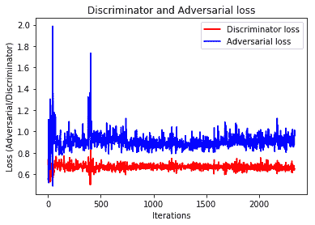

图 13.12：训练过程中判别器与对抗损失的变化图

尝试调整生成器和判别器的学习率，找出最适合你使用场景的最优值。通常，在训练 GAN 时，你需要训练多个轮次，然后使用前述的损失与迭代次数图来找到你希望训练停止时的最小点。

# 预测

这就是我们一直在构建的目标：进行预测！

# CNN 分类器对噪声和生成图像的预测

现在，我们将在遮蔽的 MNIST 测试数据上调用生成器生成图像，也就是填补数字缺失的部分：

```py
# restore missing parts of the digit with the generator
gen_imgs_test = generator.predict(noised_test_data)
```

然后，我们将把生成的 MNIST 数字传递给已经建好的数字分类器：

```py
# predict on the restored/generated digits
gen_pred_lab = mnist_model.predict_classes(gen_imgs_test)
print('The model model accuracy on the generated images is:',np.mean(gen_pred_lab==y_test)*100)
```

MNIST CNN 分类器在生成数据上的准确率为 87.82%。

以下是一个图表，展示了生成器生成的 10 张图像、生成图像的实际标签以及经过处理后由数字分类器预测的标签：

```py
# plot of 10 generated images and their predicted label
fig=plt.figure(figsize=(8, 4))
plt.title('Generated Images')
plt.axis('off') 
columns = 5
rows = 2
for i in range(0, rows*columns):
    fig.add_subplot(rows, columns, i+1)
    plt.title('Act: %d, Pred: %d'%(gen_pred_lab[i],y_test[i])) # label 
    plt.axis('off') # turn off axis
    plt.imshow(upscale(np.squeeze(gen_imgs_test[i])), cmap='gray') # gray scale
plt.show()
```

输出结果如下：

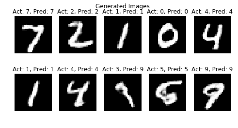

图 13.13：MNIST 分类器对生成图像的预测图

# 模块化形式的脚本

整个脚本可以分为四个模块，分别为 `train_mnist.py`、`training_plots.py`、`GAN.py` 和 `train_gan.py`。将这些文件保存在你选择的文件夹中，例如 `gan`。将 `gan` 设为项目文件夹，然后在你喜欢的源代码编辑器中运行 `train_gan.py` 文件。

`train_gan.py` Python 文件将从其他模块导入函数，在需要执行的地方调用它们。

现在，让我们逐一浏览每个文件的内容。

# 模块 1 – train_mnist.py

这个 Python 文件包含了我们之前用来训练 MNIST 数字 CNN 分类器的 `train_mnist()` 函数：

```py
"""This module is used to train a CNN on mnist."""
from keras.layers import Conv2D
from keras.layers import Flatten, Activation
from keras.models import Sequential
from keras.layers.core import Dense, Dropout

def train_mnist(input_shape, X_train, y_train):
    """Train CNN on mnist data."""
    model = Sequential()
    model.add(Conv2D(32, (3, 3), strides=2, padding='same',
                     input_shape=input_shape))
    model.add(Activation('relu'))
    model.add(Dropout(0.2))
    model.add(Conv2D(64, (3, 3), strides=2, padding='same'))
    model.add(Activation('relu'))
    model.add(Dropout(0.2))
    model.add(Conv2D(128, (3, 3), padding='same'))
    model.add(Activation('relu'))
    model.add(Dropout(0.2))
    model.add(Flatten())
    model.add(Dense(1024, activation='relu'))
    model.add(Dense(10, activation='softmax'))
    model.compile(loss='sparse_categorical_crossentropy',
                  optimizer='adam', metrics=['accuracy'])
    model.fit(X_train, y_train, batch_size=128,
              epochs=3, validation_split=0.2, verbose=1)
    return model
```

# 模块 2 – training_plots.py

这个 Python 文件包含了四个函数：`upscale()`、`generated_images_plot()`、`plot_generated_images_combined()` 和 `plot_training_loss()`：

```py
"""This module contains functions to plot image generated when training GAN."""

import matplotlib.pyplot as plt
import numpy as np

def upscale(image):
    """Scale the image to 0-255 scale."""
    return (image*127.5 + 127.5).astype(np.uint8)

def generated_images_plot(original, noised_data, generator):
    """Plot subplot of images during training."""
    print('NOISED')
    for i in range(9):
        plt.subplot(331 + i)
        plt.axis('off')
        plt.imshow(upscale(np.squeeze(noised_data[i])), cmap='gray')
    plt.show()
    print('GENERATED')
    for i in range(9):
        pred = generator.predict(noised_data[i:i+1], verbose=0)
        plt.subplot(331 + i)
        plt.axis('off')
        plt.imshow(upscale(np.squeeze(pred[0])), cmap='gray')
    plt.show()
```

若要查看代码的其余部分，请访问：[`github.com/PacktPublishing/Python-Deep-Learning-Projects/blob/master/Chapter13/training_plots.py`](https://github.com/PacktPublishing/Python-Deep-Learning-Projects/blob/master/Chapter13/training_plots.py)

# 模块 3 – GAN.py

该模块包含了 DCGAN 组件，即 `img_generator()`、`img_discriminator()` 和 `dcgan()`：

```py
"""This module contains the DCGAN components."""
from keras.layers import Input, Conv2D, AveragePooling2D
from keras.layers import UpSampling2D, Flatten, Activation, BatchNormalization
from keras.models import Model, Sequential
from keras.layers.core import Dense, Dropout
from keras.layers.advanced_activations import LeakyReLU

def img_generator(input_shape):
    """Generator."""
    generator = Sequential()
    generator.add(Conv2D(32, (3, 3), padding='same', input_shape=input_shape))
    generator.add(BatchNormalization())
    generator.add(Activation('relu'))
    generator.add(AveragePooling2D(pool_size=(2, 2)))
    generator.add(Conv2D(64, (3, 3), padding='same'))
    generator.add(BatchNormalization())
    generator.add(Activation('relu'))
    generator.add(AveragePooling2D(pool_size=(2, 2)))
    generator.add(Conv2D(128, (3, 3), padding='same'))
    generator.add(BatchNormalization())
    generator.add(Activation('relu'))
    generator.add(Conv2D(128, (3, 3), padding='same'))
    generator.add(Activation('relu'))
    generator.add(UpSampling2D((2, 2)))
    generator.add(Conv2D(64, (3, 3), padding='same'))
    generator.add(Activation('relu'))
    generator.add(UpSampling2D((2, 2)))
    generator.add(Conv2D(1, (3, 3), activation='tanh', padding='same'))
    return generator
```

对于此代码的其余部分，请访问：[`github.com/PacktPublishing/Python-Deep-Learning-Projects/blob/master/Chapter13/GAN.py`](https://github.com/PacktPublishing/Python-Deep-Learning-Projects/blob/master/Chapter13/GAN.py)

# 模块 4 – train_gan.py

在本模块中，我们将包括超参数，预处理数据，生成合成数据，训练 GAN，训练 CNN 分类器，并从其他模块导入所有必要的函数：

```py
import numpy as np
from training_plots import upscale, generated_images_plot, plot_training_loss
from training_plots import plot_generated_images_combined
from keras.optimizers import Adam
from keras import backend as k
import matplotlib.pyplot as plt
from tqdm import tqdm

from GAN import img_generator, img_discriminator, dcgan

from keras.datasets import mnist
from train_mnist import train_mnist

%matplotlib inline
# Smoothing value
smooth_real = 0.9
# Number of epochs
epochs = 5
# Batchsize
batch_size = 128
# Optimizer for the generator
optimizer_g = Adam(lr=0.0002, beta_1=0.5)
# Optimizer for the discriminator
optimizer_d = Adam(lr=0.0004, beta_1=0.5)
# Shape of the input image
input_shape = (28, 28, 1)
```

对于本模块的其余部分，请访问：[`github.com/PacktPublishing/Python-Deep-Learning-Projects/blob/master/Chapter13/train_gan.py`](https://github.com/PacktPublishing/Python-Deep-Learning-Projects/blob/master/Chapter13/train_gan.py)

你可以使用你创建的相同模块来训练时尚 MNIST 数据。你需要做的就是将`train_gan.py`文件中的第 11 行替换为（`from keras.datasets import fashion_mnist`），并将第 28 行替换为（`(X_train, y_train), (X_test, y_test) = fashion_mnist.load_data()`）。结果会很好，但不会非常出色，因为这里设置的参数在 MNIST 数字数据上表现最佳。这将是一个很好的练习，你可以在不费力的情况下获得令人难以置信的结果。

这里有一些关于训练 GAN 的技巧资源，你一定要查看：

[`github.com/soumith/ganhacks.`](https://github.com/soumith/ganhacks)

前述 DCGAN MNIST 修复的 Jupyter Notebook 代码文件可以在[`github.com/PacktPublishing/Python-Deep-Learning-Projects/blob/master/Chapter%2014/DCGAN_MNIST.ipynb`](https://github.com/PacktPublishing/Python-Deep-Learning-Projects/blob/master/Chapter%2014/DCGAN_MNIST.ipynb)找到。DCGAN 时尚 MNIST 修复的 Jupyter Notebook 代码文件可以在[`github.com/PacktPublishing/Python-Deep-Learning-Projects/blob/master/Chapter%2014/DCGAN_Fashion_MNIST.ipynb`](https://github.com/PacktPublishing/Python-Deep-Learning-Projects/blob/master/Chapter%2014/DCGAN_Fashion_MNIST.ipynb)找到。

# 项目的结论

本项目的目标是构建一个 GAN，解决手写数字缺失部分/区域重生的问题。在最初的章节中，我们应用深度学习技术，使餐饮连锁店的顾客可以通过一个简单的 iPad 应用写下他们的电话号码，以便收到通知，提示他们的座位已准备好。本章节的使用案例是应用深度学习技术生成电话号码中缺失的数字部分，从而能将文本通知发送给正确的人。

CNN 数字分类器在 MNIST 验证数据上的准确率达到了 98.84%。使用我们生成的数据来模拟数字缺失部分时，输入到 CNN 数字分类器中时，模型的准确率仅为 74.90%。

相同的缺失部分数字数据被传递给生成器，以恢复丢失的部分。然后，生成的数字被传递给 CNN 分类器，模型的准确率为 87.82%。看看你能否调整 CNN 分类器和 GAN，生成更清晰的数字，以及大幅提高这些生成图像的准确性。

让我们沿用之前章节中评估模型表现的相同方法，从餐饮连锁的角度进行分析。

这种准确性有什么意义呢？我们来计算一下错误发生的几率，错误导致客户服务问题的情况（也就是说，客户没有收到他们的桌子准备好的通知，反而因为餐厅等待时间过长而感到不满）。

每个客户的电话号码由十位数字组成。假设我们假设的餐厅在每个地点平均有 30 张桌子，这些桌子在高峰时段，每晚翻台两次，并且餐厅连锁有 35 个地点。这意味着每天的运营中大约会捕获 21,000 个手写数字（30 张桌子 × 每天 2 次翻台 × 35 个地点 × 10 位数字的电话号码）。

显然，所有数字必须正确分类，才能确保文本通知发送到正确的等待餐厅顾客。因此，任何一个数字的错误分类都会导致失败。在模拟数据上，模型准确率为 74.90%，意味着总共有 5,271 个数字被误分类。通过从训练好的 GAN 的生成器中恢复的数据（基于模拟数据），模型的准确率为 87.82%，这意味着在我们的例子中每天会错误分类 2,558 个数字。假设最坏的情况是每个电话号码中只发生一个错误分类数字。那么，考虑到只有 2,100 个顾客及相应的电话号码，这就意味着每个电话号码都会有一个分类错误（100%的失败率），没有一个顾客能收到通知，知道他们的聚会可以入座！最好的情况是每个电话号码中的 10 个数字都被误分类，这将导致 2,100 个电话号码中有 263 个错误（12.5%的失败率）。这仍然不是餐饮连锁可能满意的表现水平，因此你可以看到为什么我们需要继续微调模型，以获得可能的最大性能。

# 总结

在本章的项目中，我们成功地在 Keras 中构建了一个深度卷积 GAN，应用于手写的 MNIST 数字。我们了解了 GAN 中生成器和判别器组件的功能，定义了一些关键的超参数，并且在某些地方解释了我们为何使用这些参数。最后，我们在未见过的数据上测试了 GAN 的表现，并确定我们达成了预期目标。
