# 入门

在本章中，我们将覆盖以下主题：

+   使用 IDE 安装 R

+   安装 Jupyter Notebook 应用程序

+   从 R 中的机器学习基础开始

+   在 R 中设置深度学习工具/包

+   在 R 中安装 MXNet

+   在 R 中安装 TensorFlow

+   在 R 中安装 H2O

+   使用 Docker 一次性安装所有三个包

# 介绍

本章将帮助你开始深度学习，并帮助你设置系统以开发深度学习模型。本章更侧重于让读者了解本书的期望内容以及阅读本书所需的前置条件。本书面向那些希望快速建立深度学习应用背景的学生或专业人士。本书将更侧重于实践和应用，使用 R 作为工具来构建深度学习模型。

深度学习的详细理论请参考*《深度学习》*（*Goodfellow 等人，2016*）。对于机器学习的背景知识，请参考 *《Python 机器学习》*（S. Raschka，2015）。

我们将使用 R 编程语言来演示深度学习的应用。你在本书中需要具备以下前置知识：

+   基本的 R 编程知识

+   基本了解 Linux；我们将使用 Ubuntu（16.04）操作系统

+   机器学习概念的基础理解

+   对于 Windows 或 macOS，基本了解 Docker

# 使用 IDE 安装 R

在我们开始之前，让我们先为 R 安装一个 IDE。对于 R，最受欢迎的 IDE 是 Rstudio 和 Jupyter。Rstudio 专注于 R，而 Jupyter 提供包括 R 在内的多语言支持。Jupyter 还提供一个交互式环境，允许你将代码、文本和图形合并成一个单一的笔记本。

# 准备工作

R 支持多种操作系统，如 Windows、macOS X 和 Linux。R 的安装文件可以从 **Comprehensive R Archive Network**（**CRAN**）的任何一个镜像站点下载，网址为 [`cran.r-project.org/`](https://cran.r-project.org/)。CRAN 也是 R 包的一个主要仓库。编程语言 R 有 32 位和 64 位架构可供选择。

# 如何做到...

1.  强烈推荐安装 r-base-dev，因为它有许多内建函数。它还启用了 `install.packages()` 命令，可用于通过 **R 控制台**直接从 CRAN 编译并安装新的 R 包。默认的 **R 控制台**如下所示：


默认 R 控制台

1.  为了编程目的，推荐使用 **集成开发环境**（**IDE**），因为它有助于提高生产力。最受欢迎的开源 IDE 之一是 Rstudio。Rstudio 还提供了一个 Rstudio 服务器，便于你在基于 Web 的环境中编程。Rstudio IDE 的界面如下所示：

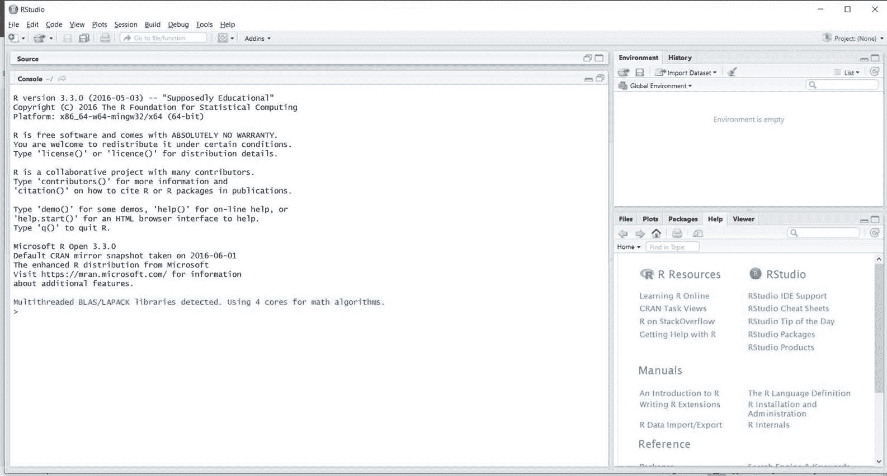

Rstudio 集成开发环境

# 安装 Jupyter Notebook 应用程序

近年来，另一个著名的编辑器是 Jupyter Notebook 应用程序。该应用程序生成整合了文档、代码和分析的 notebook 文件。它支持多种计算内核，包括 R。它是一个基于浏览器的客户端服务器应用程序，可以通过浏览器访问。

# 如何操作...

Jupyter Notebook 可以通过以下步骤进行安装：

1.  可以使用 `pip` 安装 Jupyter Notebook：

```py
pip3 install --upgrade pip
pip3 install jupyter

```

1.  如果您已安装 Anaconda，那么默认安装的计算内核是 Python。要在同一环境中为 Jupyter 安装 R 计算内核，请在终端中输入以下命令：

```py
conda install -c r r-essentials

```

1.  要在 conda 中安装名为 `new-env` 的新环境中的 R 计算内核，请输入以下命令：

```py
conda create -n new-env -c r r-essentials

```

1.  另一种将 R 计算内核添加到 Jupyter Notebook 的方式是使用 `IRkernel` 包。通过此方法安装时，请启动 R IDE。第一步是安装 `IRkernel` 安装所需的依赖项：

```py
chooseCRANmirror(ind=55) # choose mirror for installation
install.packages(c('repr', 'IRdisplay', 'crayon', 'pbdZMQ',
'devtools'), dependencies=TRUE)

```

1.  一旦所有依赖项从 CRAN 安装完成，便可以从 GitHub 安装 `IRkernel` 包：

```py
library(devtools)
library(methods)
options(repos=c(CRAN='https://cran.rstudio.com'))
devtools::install_github('IRkernel/IRkernel')

```

1.  一旦满足所有要求，可以使用以下脚本在 Jupyter Notebook 中设置 R 计算内核：

```py
library(IRkernel)
IRkernel::installspec(name = 'ir32', displayname = 'R 3.2')

```

1.  可以通过打开 shell/终端启动 Jupyter Notebook。运行以下命令即可在浏览器中启动 Jupyter Notebook 界面，如代码后的截图所示：

```py
jupyter notebook

```


带有 R 计算引擎的 Jupyter Notebook

# 还有更多...

R 和本书中使用的大多数软件包一样，支持大多数操作系统。然而，您可以使用 Docker 或 VirtualBox 来设置一个与本书中使用的工作环境类似的环境。

有关 Docker 安装和设置的详细信息，请参考 [`docs.docker.com/`](https://docs.docker.com/)，并选择适合您操作系统的 Docker 镜像。同样，VirtualBox 的二进制文件可以在 [`www.virtualbox.org/wiki/Downloads`](https://www.virtualbox.org/wiki/Downloads) 下载并安装。

# 从 R 中学习机器学习基础

深度学习是受人类大脑结构和功能启发的机器学习的一个子领域。近年来，深度学习因更强的计算能力、更大的数据集、更好的算法（具有人工智能学习能力）以及对数据驱动见解的更高需求而得到了广泛关注。在我们深入探讨深度学习的细节之前，让我们先了解一些机器学习的基本概念，这些概念构成了大多数分析解决方案的基础。

机器学习是一个开发算法的领域，这些算法能够从数据中挖掘自然模式，从而通过预测性洞察做出更好的决策。这些洞察力在多个现实世界应用中都具有重要意义，从医学诊断（使用计算生物学）到实时股票交易（使用计算金融），从天气预测到自然语言处理，从预测性维护（在自动化和制造业中）到处方推荐（在电子商务和电子零售中）等。

以下图表阐明了机器学习的两种主要技术：即监督学习和无监督学习：

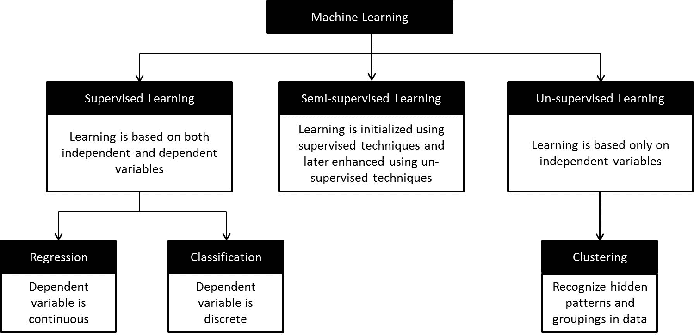

机器学习中不同技术的分类

**监督学习**：监督学习是一种基于证据的学习方式。证据是给定输入的已知结果，进而用来训练预测模型。模型进一步根据结果数据类型分为回归和分类。在回归中，结果是连续的，而在分类中，结果是离散的。股票交易和天气预测是回归模型的广泛应用，跨度检测、语音识别和图像分类是分类模型的广泛应用。

回归算法包括线性回归、**广义线性模型**（**GLM**）、**支持向量回归**（**SVR**）、神经网络、决策树等；在分类问题中，我们有逻辑回归、**支持向量机**（**SVM**）、**线性判别分析**（**LDA**）、朴素贝叶斯、最近邻等。

**半监督学习**：半监督学习是一类使用无监督技术的监督学习。这种技术在需要对整个数据集进行标注的成本过高，而获取和分析未标注数据的成本较低的场景中非常有用。

**无监督学习**：顾名思义，学习没有结果（或监督）的数据称为无监督学习。这是一种基于给定数据中隐藏模式和内在分组的推理性学习方式。其应用包括市场模式识别、基因聚类等。

一些广泛使用的聚类算法包括 *k*-均值、层次聚类、*k*-中值、模糊 C 均值、隐马尔可夫、神经网络等。

# 如何做到...

让我们来看一下监督学习中的线性回归：

1.  让我们从一个简单的线性回归示例开始，其中我们需要确定男性身高（以厘米为单位）和体重（以千克为单位）之间的关系。以下样本数据代表了 10 个随机男性的身高和体重：

```py
data <- data.frame("height" = c(131, 154, 120, 166, 108, 115,
158, 144, 131, 112), 
"weight" = c(54, 70, 47, 79, 36, 48, 65,
63, 54, 40))

```

1.  现在，生成一个线性回归模型，如下所示：

```py
lm_model <- lm(weight ~ height, data)

```

1.  下图展示了男性身高与体重之间的关系，并且包含了拟合线：

```py
plot(data, col = "red", main = "Relationship between height and
weight",cex = 1.7, pch = 1, xlab = "Height in cms", ylab = "Weight
in kgs")
abline(lm(weight ~ height, data))

```

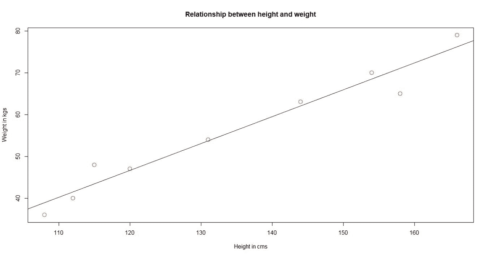

体重和身高之间的线性关系

1.  在半监督模型中，学习主要是通过使用标签数据（通常量较小）来启动的，然后使用未标签数据（通常量较大）进行增强。

让我们对一个广泛使用的数据集——鸢尾花（iris）执行 K-means 聚类（无监督学习）。

1.  该数据集包含三种不同的鸢尾花种类（**Setosa**、**Versicolor** 和 **Virginica**），以及它们的不同特征，如萼片长度、萼片宽度、花瓣长度和花瓣宽度：

```py
data(iris)
head(iris)
Sepal.Length Sepal.Width Petal.Length Petal.Width Species
1 5.1 3.5 1.4 0.2 setosa
2 4.9 3.0 1.4 0.2 setosa
3 4.7 3.2 1.3 0.2 setosa
4 4.6 3.1 1.5 0.2 setosa
5 5.0 3.6 1.4 0.2 setosa
6 5.4 3.9 1.7 0.4 setosa

```

1.  下图展示了鸢尾花特征的变异。与萼片特征相比，花瓣特征表现出明显的变化：

```py
library(ggplot2)
library(gridExtra)
plot1 <- ggplot(iris, aes(Sepal.Length, Sepal.Width, color =
Species)) 
  geom_point(size = 2) 
  ggtitle("Variation by Sepal features")
plot2 <- ggplot(iris, aes(Petal.Length, Petal.Width, color =
  Species)) 
   geom_point(size = 2) 
   ggtitle("Variation by Petal features")
grid.arrange(plot1, plot2, ncol=2)

```

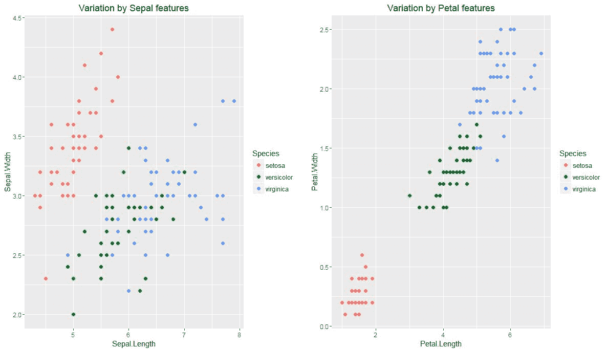

按长度和宽度划分的萼片和花瓣特征的变异

1.  由于花瓣特征在鸢尾花中有很好的变异性，让我们使用花瓣长度和花瓣宽度来执行 K-means 聚类：

```py
set.seed(1234567)
iris.cluster <- kmeans(iris[, c("Petal.Length","Petal.Width")],
 3, nstart = 10)
iris.cluster$cluster <- as.factor(iris.cluster$cluster)

```

1.  以下代码片段展示了聚类与物种（鸢尾花）之间的交叉表。我们可以看到，聚类 1 主要归为 Setosa，聚类 2 主要归为 Versicolor，而聚类 3 主要归为 Virginica：

```py
> table(cluster=iris.cluster$cluster,species= iris$Species)
species
cluster setosa versicolor virginica
1 50 0 0
2 0 48 4
3 0 2 46

ggplot(iris, aes(Petal.Length, Petal.Width, color =
iris.cluster$cluster)) + geom_point() + ggtitle("Variation by
Clusters")

```

1.  下图展示了聚类的分布：

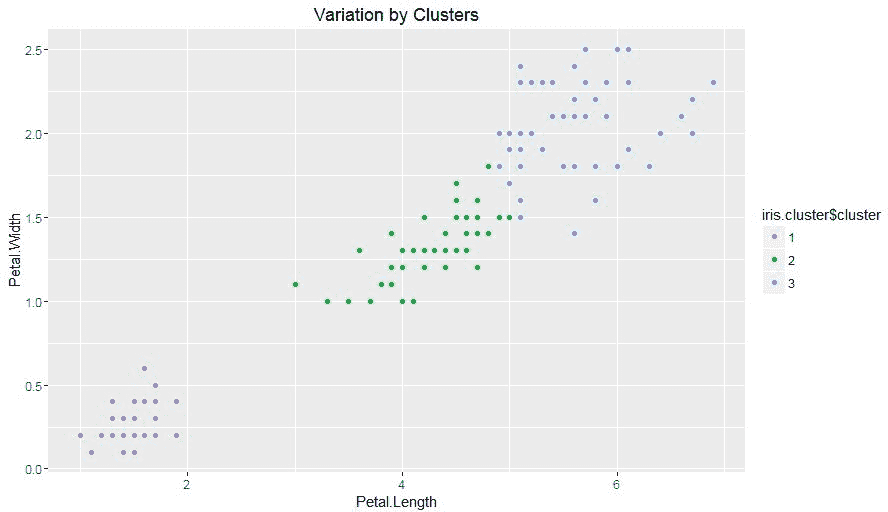

三个聚类中的鸢尾花变异

# 它是如何工作的...

模型评估是任何机器学习过程中的关键步骤。它对于监督模型和无监督模型有所不同。在监督模型中，预测起着重要作用；而在无监督模型中，聚类内部的同质性和聚类之间的异质性起着重要作用。

一些广泛使用的回归模型评估参数（包括交叉验证）如下：

+   确定系数

+   均方根误差

+   平均绝对误差

+   赤池信息量准则（AIC）或贝叶斯信息量准则（BIC）

一些广泛使用的分类模型评估参数（包括交叉验证）如下：

+   混淆矩阵（准确率、精确度、召回率和 F1 分数）

+   增益或提升图

+   ROC（接收操作特征）曲线下的面积

+   一致比率和不一致比率

一些广泛使用的无监督模型（聚类）评估参数如下：

+   列联表

+   聚类对象与聚类中心或质心之间的平方误差和

+   轮廓值

+   兰德指数

+   匹配指数

+   成对及调整后的成对精度和召回率（主要用于自然语言处理）

偏差和方差是任何监督学习模型的两个关键误差组成部分；它们的权衡在模型调优和选择中起着至关重要的作用。偏差是由于预测模型在学习结果时做出的不正确假设，而方差是由于模型对训练数据集的僵化。换句话说，较高的偏差会导致欠拟合，较高的方差会导致过拟合。

在偏差中，假设是关于目标函数形式的。因此，这在参数模型中占主导地位，例如线性回归、逻辑回归和线性判别分析，因为它们的结果是输入变量的函数形式。

另一方面，方差展示了模型对数据集变化的敏感度。通常，目标函数形式控制方差。因此，这在非参数化模型中占主导地位，例如决策树、支持向量机和 K 最近邻，因为它们的结果不是输入变量的直接函数形式。换句话说，非参数化模型的超参数可能会导致预测模型的过拟合。  

# 在 R 中设置深度学习工具/包  

主要的深度学习包都是用 C/C++ 开发的，以提高效率，而 R 中则开发了包装器，旨在高效地开发、扩展和执行深度学习模型。  

有许多开源深度学习库可供使用。该领域的主要库如下：  

+   Theano  

+   TensorFlow  

+   Torch  

+   Caffe  

市面上还有其他一些知名的包，如 H2O、CNTK（微软认知工具包）、darch、Mocha 和 ConvNetJS。围绕这些包，已经开发了许多包装器，支持深度学习模型的便捷开发，例如 Python 中的 Keras 和 Lasagne 以及支持多种语言的 MXNet。  

# 如何操作...  

1.  本章将介绍 MXNet 和 TensorFlow 包（这两个包使用 C++ 和 CUDA 开发，以便在 GPU 上实现高度优化的性能）。  

1.  此外，`h2o` 包将用于开发一些深度学习模型。R 中的 `h2o` 包作为 REST API 实现，连接到 H2O 服务器（它作为 **Java 虚拟机**（**JVM**）运行）。我们将在接下来的部分中提供这些包的快速设置说明。  

# 在 R 中安装 MXNet  

本节将介绍如何在 R 中安装 MXNet。  

# 准备工作  

MXNet 包是一个轻量级的深度学习架构，支持 R、Python 和 Julia 等多种编程语言。从编程角度看，它结合了符号式和命令式编程，支持 CPU 和 GPU。  

R 中的基于 CPU 的 MXNet 可以通过预构建的二进制包或源代码安装，源代码需要构建相关的库。在 Windows/mac 上，预构建的二进制包可以直接从 R 控制台下载并安装。MXNet 要求 R 版本为 3.2.0 或更高版本。安装过程需要 CRAN 中的 `drat` 包。`drat` 包帮助维护 R 仓库，可以通过 `install.packages()` 命令安装。  

要在 Linux（13.10 或更高版本）上安装 MXNet，以下是一些依赖项：  

+   Git（从 GitHub 获取代码）  

+   libatlas-base-dev（用于执行线性代数运算）  

+   libopencv-dev（用于执行计算机视觉操作）  

要安装带 GPU 处理器的 MXNet，以下是一些依赖项：  

+   Microsoft Visual Studio 2013  

+   NVIDIA CUDA 工具包

+   MXNet 包  

+   cuDNN（提供深度神经网络库）  

安装 `mxnet` 及其所有依赖项的另一种快速方法是使用 `chstone` 仓库中的预构建 Docker 镜像。以下工具将用于安装 `chstone`/`mxnet-gpu` Docker 镜像：

+   R 和 Python 中的 MXNet

+   Ubuntu 16.04

+   CUDA（可选，适用于 GPU）

+   cuDNN（可选，适用于 GPU）

# 如何操作...

1.  以下 R 命令通过使用预构建的二进制包来安装 MXNet，操作简单方便。然后使用 `drat` 包从 Git 添加 `dlmc` 仓库，并随后安装 `mxnet`：

```py
install.packages("drat", repos="https://cran.rstudio.com")
drat:::addRepo("dmlc")
install.packages("mxnet")

```

2\. 以下代码帮助在 Ubuntu（V16.04）中安装 MXNet。前两行用于安装依赖项，剩余的行用于安装 MXNet，前提是满足所有依赖项：

```py
sudo apt-get update
sudo apt-get install -y build-essential git libatlas-base-dev
libopencv-dev
git clone https://github.com/dmlc/mxnet.git ~/mxnet --recursive
cd ~/mxnet
cp make/config.mk .
echo "USE_BLAS=openblas" >>config.mk
make -j$(nproc)

```

3\. 如果要为 GPU 构建 MXNet，则需要在运行 `make` 命令之前更新以下 `config`：

```py
echo "USE_CUDA=1" >>config.mk
echo "USE_CUDA_PATH=/usr/local/cuda" >>config.mk
echo "USE_CUDNN=1" >>config.mk

```

有关其他操作系统的 MXNet 详细安装说明，请访问 [`mxnet.io/get_started/setup.html`](http://mxnet.io/get_started/setup.html4)。

4\. 使用以下命令通过 Docker 安装 MXNet（基于 GPU），并安装所有依赖项：

```py
docker pull chstone/mxnet-gpu

```

# 在 R 中安装 TensorFlow

本节将介绍另一个非常流行的开源机器学习包——TensorFlow，它在构建深度学习模型方面非常有效。

# 准备就绪

TensorFlow 是由 Google Brain 团队开发的另一个开源库，旨在使用数据流图构建数值计算模型。TensorFlow 的核心是用 C++ 开发的，并且在 Python 中提供了封装。R 中的 `tensorflow` 包使您能够访问由 Python 模块组成的 TensorFlow API 来执行计算模型。TensorFlow 支持基于 CPU 和 GPU 的计算。

R 中的 `tensorflow` 包调用 Python tensorflow API 执行计算，这就需要在 R 和 Python 中都安装 `tensorflow` 包，以便让 R 正常工作。以下是 `tensorflow` 的依赖项：

+   Python 2.7 / 3.x

+   R (>3.2)

+   R 中用于从 GitHub 安装 TensorFlow 的 devtools 包

+   Python 中的 TensorFlow

+   pip

# 如何操作...

1.  一旦安装了所有提到的依赖项，可以通过 `devtools` 使用以下 `install_github` 命令直接安装 `tensorflow`：

```py
devtools::install_github("rstudio/tensorflow")

```

1.  在 R 中加载 `tensorflow` 之前，您需要将 Python 的路径设置为系统环境变量。这可以直接从 R 环境中完成，方法如下命令所示：

```py
Sys.setenv(TENSORFLOW_PYTHON="/usr/bin/python")
library(tensorflow)

```

如果未安装 Python `tensorflow` 模块，R 将显示以下错误：

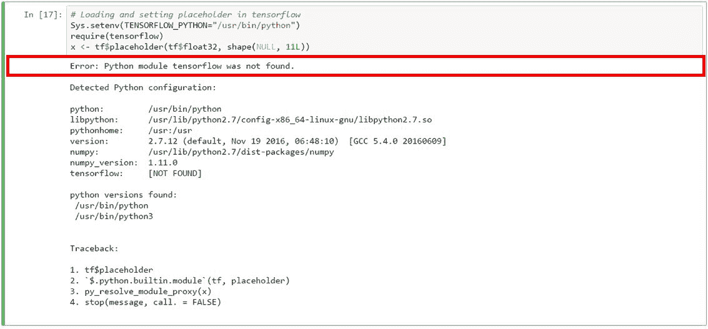

如果 Python 中未安装 tensorflow，R 会引发错误

`tensorflow` 在 Python 中可以通过 `pip` 安装：

```py
pip install tensorflow # Python 2.7 with no GPU support
pip3 install tensorflow # Python 3.x with no GPU support
pip install tensorflow-gpu # Python 2.7 with GPU support
pip3 install tensorflow-gpu # Python 3.x with GPU support

```

# 它是如何工作的...

TensorFlow 遵循有向图哲学来设置计算模型，其中数学操作表示为节点，每个节点支持多个输入和输出，而边缘代表节点间数据的传输。TensorFlow 中还有一些边缘被称为**控制依赖**，它们不代表数据流；而是提供与控制依赖相关的信息，如控制依赖的节点必须在目标控制依赖节点开始执行之前完成处理。

以下图示出了一个示例 TensorFlow 图，用于逻辑回归评分：

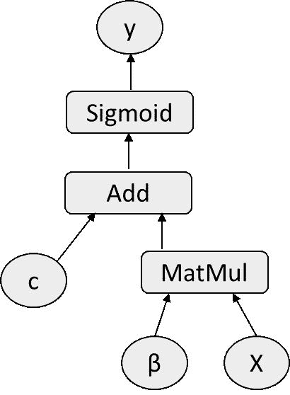

逻辑回归的 TensorFlow 图

上图展示了一个 TensorFlow 图，说明如何用优化后的权重对逻辑回归进行评分：


*MatMul*节点执行输入特征矩阵*X*与优化后的权重β之间的矩阵乘法。常数*C*随后被加到*MatMul*节点的输出上。然后，*Add*的输出会通过*Sigmoid*函数转化，最终输出*Pr(y=1|X)*。

# 另见

使用[`rstudio.github.io/tensorflow/`](https://rstudio.github.io/tensorflow/)中的资源，在 R 中开始使用 TensorFlow。

# 在 R 中安装 H2O

H2O 是另一个非常流行的开源库，用于构建机器学习模型。它由 H2O.ai 开发，支持包括 R 和 Python 在内的多种语言。H2O 包是一个多功能的机器学习库，专为分布式环境而开发，用于在大数据上运行算法。

# 准备工作

要设置 H2O，以下系统是必需的：

+   64 位 Java 运行时环境（版本 1.6 或更高）

+   最小 2GB RAM

可以通过`h2o`包从 R 中调用 H2O。`h2o`包有以下依赖项：

+   RCurl

+   rjson

+   statmod

+   生存分析

+   stats

+   tools

+   utils

+   methods

对于没有安装 curl-config 的机器，RCurl 依赖项在 R 中安装会失败，curl-config 需要在 R 之外进行安装。

# 如何操作...

1.  可以直接从 CRAN 安装 H2O，并使用依赖参数 TRUE 来安装所有与 CRAN 相关的`h2o`依赖项。此命令将安装`h2o`包所需的所有 R 依赖项：

```py
install.packages("h2o", dependencies = T)

```

1.  以下命令用于在当前 R 环境中调用`h2o`包。第一次执行`h2o`包时，会自动下载 JAR 文件，然后启动 H2O，如下图所示：

```py
library(h2o) 
localH2O = h2o.init()

```

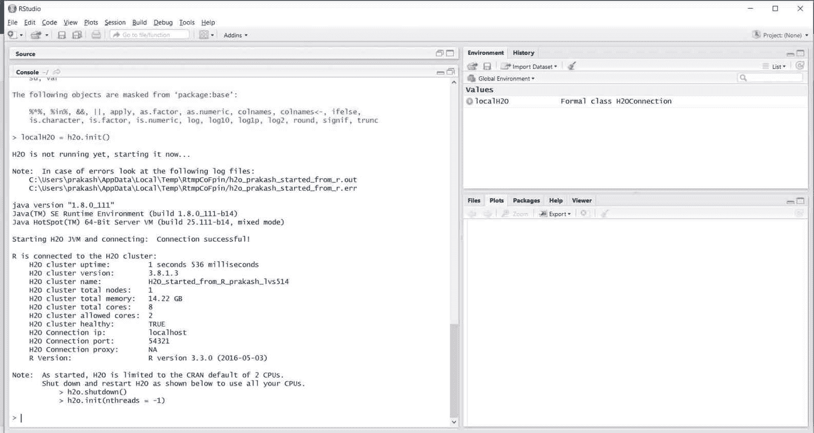

启动 H2O 集群

1.  可以通过**集群**的**IP 地址**和**端口信息**访问 H2O 集群。目前，H2O 集群在本地主机的`54321`端口上运行，如下截图所示：

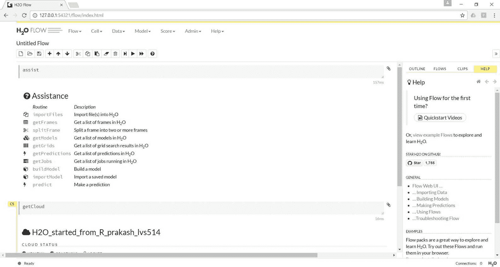

在浏览器中运行 H2O 集群

可以通过浏览器交互式地开发 H2O 中的模型，或者通过 R 脚本进行开发。H2O 建模就像创建一个 Jupyter Notebook，但你在其中创建一个包含不同操作的流程，如导入数据、拆分数据、设置模型和评分。

# 它是如何工作的...

让我们使用 H2O 浏览器互动地构建一个逻辑回归模型。

1.  开始一个新流程，如下图所示：


在 H2O 中创建一个新流程

1.  使用“数据”菜单导入数据集，如下图所示：

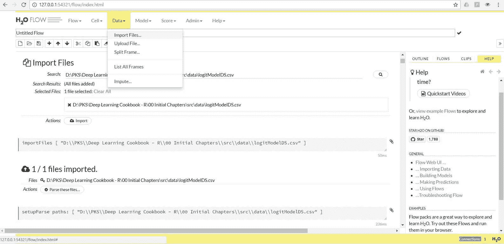

将文件导入到 H2O 环境

1.  导入到 H2O 中的文件可以通过 **解析这些文件** 操作转换为 hex 格式（H2O 的原生文件格式），该操作将在文件导入到 H2O 环境后出现：

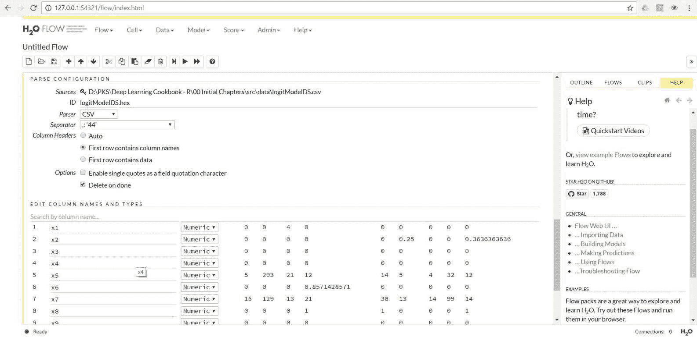

将文件解析为 hex 格式

1.  解析后的数据框可以使用 *数据 |* 拆分框架操作，在 H2O 中拆分为训练集和验证集，如下图所示：

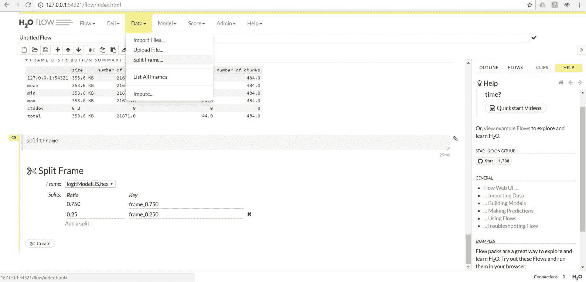

将数据集拆分为训练集和验证集

1.  从“模型”菜单中选择模型并设置模型相关的参数。以下截图展示了一个 glm 模型的示例：


在 H2O 中构建模型

1.  *|* 预测操作可以用来对另一个 H2O 数据框进行评分：

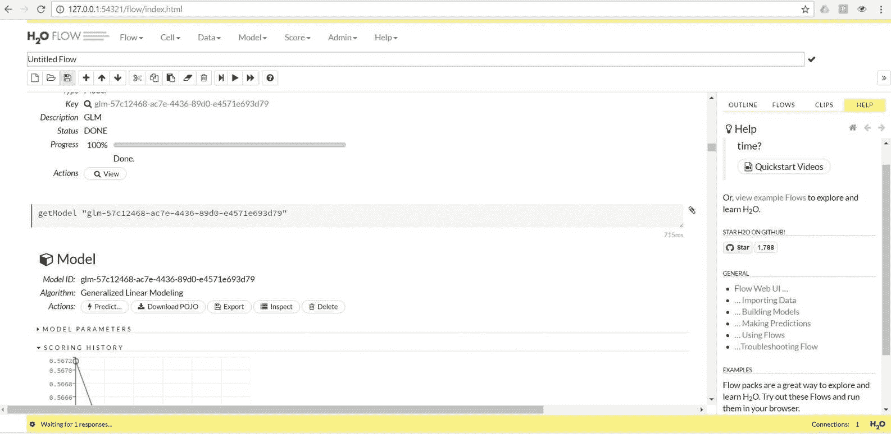

在 H2O 中进行评分

# 还有更多...

对于涉及大量预处理的复杂场景，可以直接从 R 调用 H2O。本书将更多关注如何直接从 R 使用 H2O 构建模型。如果 H2O 被设置在本地主机以外的位置，则可以通过在 R 中定义正确的 `ip` 和 `port` 来连接该集群：

```py
localH2O = h2o.init(ip = "localhost", port = 54321, nthreads = -1) 

```

另一个关键参数是构建模型时使用的线程数；默认情况下，*n* 线程设置为 -2，这意味着将使用两个核心。*n* 线程值为 -1 时，将使用所有可用核心。

[`docs.h2o.ai/h2o/latest-stable/index.html#gettingstarted`](http://docs.h2o.ai/h2o/latest-stable/index.html#gettingstarted) 在交互模式下使用 H2O 非常好。

# 使用 Docker 一次性安装所有三个软件包

Docker 是一个软件容器平台，用于在隔离的容器中并行托管多个软件或应用，以提高计算密度。与虚拟机不同，容器仅使用所需的库和设置来构建软件，但不包含整个操作系统，因此更加轻量和高效。

# 准备工作

设置所有三个软件包可能会很麻烦，具体取决于所使用的操作系统。以下的 dockerfile 代码可以用来设置一个安装了 `tensorflow`、带 GPU 的 `mxnet` 和 `h2o` 的环境，并且包含所有依赖项：

```py
FROM chstone/mxnet-gpu:latest
MAINTAINER PKS Prakash <prakash5801>

# Install dependencies
RUN apt-get update && apt-get install -y
 python2.7 
 python-pip 
 python-dev 
 ipython 
 ipython-notebook 
 python-pip 
 default-jre

# Install pip and Jupyter notebook
RUN pip install --upgrade pip && 
 pip install jupyter

# Add R to Jupyter kernel 
RUN Rscript -e "install.packages(c('repr', 'IRdisplay', 'crayon', 'pbdZMQ'), dependencies=TRUE, repos='https://cran.rstudio.com')" && 
 Rscript -e "library(devtools); library(methods); options(repos=c(CRAN='https://cran.rstudio.com')); devtools::install_github('IRkernel/IRkernel')" && 
 Rscript -e "library(IRkernel); IRkernel::installspec(name = 'ir32', displayname = 'R 3.2')" 

# Install H2O
RUN Rscript -e "install.packages('h2o', dependencies=TRUE, repos='http://cran.rstudio.com')"

# Install tensorflow fixing the proxy port
RUN pip install tensorflow-gpu
RUN Rscript -e "library(devtools); devtools::install_github('rstudio/tensorflow')"

```

当前的镜像是基于 `chstone/mxnet-gpu` Docker 镜像创建的。

chstone/mxnet-gpu 是一个 Docker Hub 仓库，地址为 [`hub.docker.com/r/chstone/mxnet-gpu/`](https://hub.docker.com/r/chstone/mxnet-gpu/)。

# 如何操作...

Docker 将通过以下步骤安装所有依赖项：

1.  将前面的代码保存到一个位置，命名为 `Dockerfile`。

1.  使用命令行，进入文件所在位置，并运行以下命令，命令后面的截图也展示了相同内容：

```py
docker run -t "TagName:FILENAME"

```


构建 Docker 镜像

1.  使用`docker images`命令查看镜像，方法如下：


查看 Docker 镜像

1.  Docker 镜像可以使用以下命令来执行：

```py
docker run -it -p 8888:8888 -p 54321:54321 <<IMAGE ID>>

```


运行 Docker 镜像

这里，选项*-i*表示交互模式，*-t*用于分配--*tty*。选项*-p*用于端口转发。由于我们将 Jupyter 运行在端口`8888`，将 H2O 运行在端口`54321`，因此我们将两个端口转发以便从本地浏览器访问。

# 还有更多...

更多 Docker 选项可以通过运行`docker run --help`来查看。
