# 使用自编码器的数据表示

本章将介绍自编码器的无监督深度学习应用。我们将覆盖以下主题：

+   设置自编码器

+   数据归一化

+   设置正则化自编码器

+   微调自编码器的参数

+   设置堆叠自编码器

+   设置去噪自编码器

+   构建和比较随机编码器和解码器

+   从自编码器学习流形

+   评估稀疏分解

# 介绍

神经网络旨在找到输入*X*与输出*y*之间的非线性关系，即*y=f(x)*。自编码器是一种无监督神经网络，试图找到空间中特征之间的关系，使得*h*=*f(x)*，帮助我们学习输入空间之间的关系，可用于数据压缩、降维和特征学习。

自编码器由编码器和解码器组成。编码器帮助将输入*x*编码为潜在表示*y*，而解码器则将*y*转换回*x*。编码器和解码器具有相似的形式表示。

下面是单层自编码器的表示：

****

编码器将输入*X*编码为*H*，并通过隐藏层处理，而解码器则帮助从编码输出*H*恢复原始数据。矩阵*W[e]*和*W[d]*分别表示编码器和解码器层的权重。函数*f*是激活函数。

以下是自编码器的示意图：

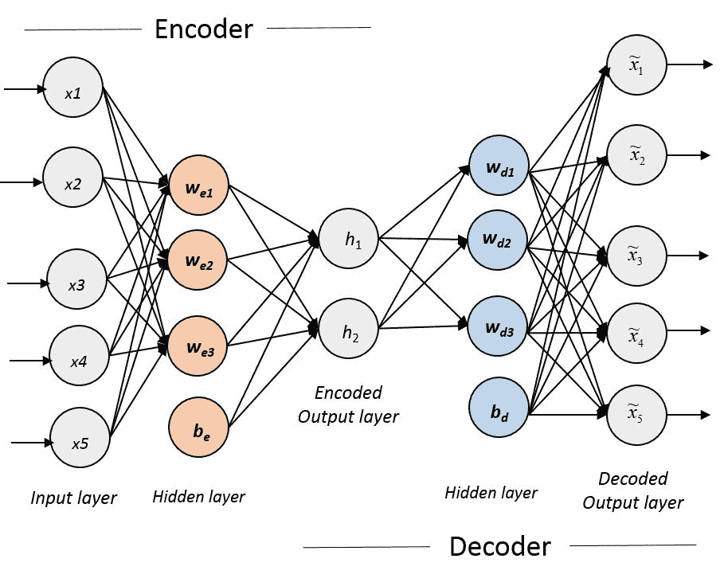

以节点形式的约束使自编码器能够发现数据中的有趣结构。例如，在前面的图中，编码器的五个输入数据集必须经过三个节点的压缩才能得到编码值*h*。**编码输出层**的维度可以与**输入/输出解码输出层**相同、较低或较高。输入层节点数少于编码层的**编码输出层**称为欠完备表示，可以视为将数据压缩成低维表示。

**编码输出层**具有较多输入层的情况称为过完备表示，并在**稀疏自编码器**中作为正则化策略使用。自编码器的目标是找到*y*，捕捉数据变化的主要因素，这与**主成分分析（PCA）**类似，因此也可以用于压缩。

# 设置自编码器

存在多种不同架构的自编码器，这些架构通过使用不同的代价函数来捕捉数据表示。最基本的自编码器被称为香草自编码器（vanilla autoencoder）。它是一个包含两个层的神经网络，其中隐藏层的节点数与输入层和输出层相同，目标是最小化代价函数。常用的（但不限于）损失函数包括回归问题中的**均方误差**(**MSE**)和分类问题中的交叉熵。当前方法可以轻松扩展到多个层次，这种扩展被称为多层自编码器。

节点数量在自编码器中起着至关重要的作用。如果隐藏层中的节点数少于输入层的节点数，那么该自编码器被称为**欠完备**自编码器。隐藏层中节点数较多则表示**过完备**自编码器或稀疏自编码器。

稀疏自编码器旨在对隐藏层施加稀疏性。这种稀疏性可以通过在隐藏层引入比输入层更多的节点，或者通过在损失函数中引入惩罚来实现，从而使隐藏层的权重趋向于零。有些自编码器通过手动将节点的权重置为零来实现稀疏性，这些被称为**K-稀疏自编码器**。我们将在第一章《入门指南》中讨论的`Occupancy`数据集上设置自编码器。当前示例的隐藏层可以进行调整。

# 准备就绪

让我们使用`Occupancy`数据集来设置自编码器：

+   下载`Occupancy`数据集，如第一章《入门指南》中所述。

+   在 R 和 Python 中安装 TensorFlow

# 如何操作...

当前的`Occupancy`数据集，如第一章《入门指南》中所述，用于演示如何在 R 中使用 TensorFlow 设置自编码器：

1.  设置 R TensorFlow 环境。

1.  `load_occupancy_data`函数可以通过使用`setwd`设置正确的工作目录路径来加载数据：

```py
# Function to load Occupancy data
load_occupancy_data<-function(train){
xFeatures = c("Temperature", "Humidity", "Light", "CO2",
  "HumidityRatio")
yFeatures = "Occupancy"
  if(train){
    occupancy_ds <-  as.matrix(read.csv("datatraining.txt",stringsAsFactors = T))
  } else
  {
    occupancy_ds <- as.matrix(read.csv("datatest.txt",stringsAsFactors = T))
  }
  occupancy_ds<-apply(occupancy_ds[, c(xFeatures, yFeatures)], 2, FUN=as.numeric) 
  return(occupancy_ds)
}

```

1.  可以使用以下脚本将训练和测试的`Occupancy`数据集加载到 R 环境中：

```py
occupancy_train <-load_occupancy_data(train=T)
occupancy_test <- load_occupancy_data(train = F)

```

# 数据归一化

**数据归一化**是机器学习中的一个关键步骤，用于将数据转换为相似的尺度。它也称为特征缩放，通常作为数据预处理的一部分进行。

正确的归一化对于神经网络至关重要，否则它会导致隐藏层的饱和，从而导致梯度为零，无法进行学习。

# 准备就绪

有多种方式可以执行归一化：

+   **最小-最大标准化**：最小-最大标准化保持原始分布，并将特征值缩放到*【0, 1】*之间，其中*0*为特征的最小值，*1*为最大值。标准化的过程如下：


这里，*x*' 是特征的归一化值。该方法对数据集中的异常值较为敏感。

+   **十进制缩放**：这种缩放形式用于存在不同十进制范围值的情况。例如，两个具有不同边界的特征可以通过如下方式使用十进制缩放将其带到相似的尺度：

*x'=x/10^n*

+   **Z-得分**：这种转换将值缩放到具有零均值和单位方差的正态分布。Z-得分计算公式为：

*Z*=(**x-µ)/σ**

这里，*µ* 是均值，σ 是特征的标准差。这些分布对具有高斯分布的数据集非常有效。

所有前述方法对异常值敏感；你可以探索其他更稳健的归一化方法，例如**中位数绝对偏差** (**MAD**)、tanh 估计器和双重 sigmoid。

# 数据集分布的可视化

我们来看看职业数据的特征分布：

```py
> ggpairs(occupancy_train$data[, occupancy_train$xFeatures])

```

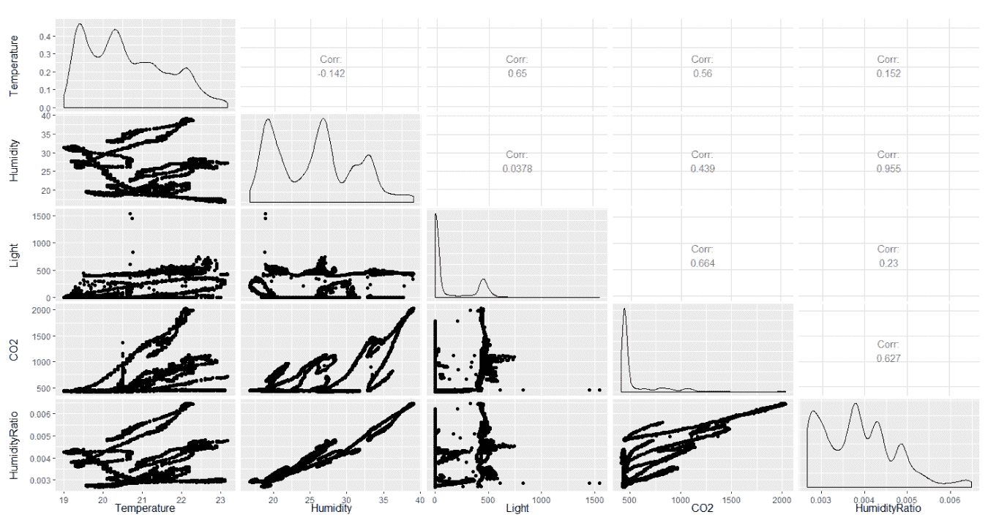

图表显示特征具有线性相关性，并且分布是非正态的。可以通过使用 Shapiro-Wilk 测试进一步验证非正态性，使用 R 中的 `shapiro.test` 函数。我们将对职业数据使用最小-最大标准化。

# 如何操作...

1.  执行以下操作以进行数据归一化：

```py
minmax.normalize<-function(ds, scaler=NULL){
  if(is.null(scaler)){
    for(f in ds$xFeatures){
      scaler[[f]]$minval<-min(ds$data[,f])
      scaler[[f]]$maxval<-max(ds$data[,f])
      ds$data[,f]<-(ds$data[,f]-scaler[[f]]$minval)/(scaler[[f]]$maxval-scaler[[f]]$minval)
    }
    ds$scaler<-scaler
  } else
  {
    for(f in ds$xFeatures){
      ds$data[,f]<-(ds$data[,f]-scaler[[f]]$minval)/(scaler[[f]]$maxval-scaler[[f]]$minval)
    }
  }
  return(ds)
}

```

1.  `minmax.normalize` 函数使用最小-最大标准化对数据进行归一化。当 `scaler` 变量为 `NULL` 时，它使用提供的数据集进行归一化，或者使用 `scaler` 的值进行归一化。归一化后的数据对图如下面的图所示：


此图显示了最小-最大归一化将值限制在 *[0, 1]* 范围内，并且没有改变特征之间的分布和相关性。

# 如何设置自编码器模型

下一步是设置自编码器模型。让我们使用 TensorFlow 设置一个基础的自编码器：

1.  重置 `graph` 并启动 `InteractiveSession`：

```py
# Reset the graph and set-up a interactive session
tf$reset_default_graph()
sess<-tf$InteractiveSession()

```

1.  定义输入参数，其中 `n` 和 `m` 分别是样本数和特征数。为了构建网络，`m` 用来设置输入参数：

```py
# Network Parameters
n_hidden_1 = 5 # 1st layer num features
n_input = length(xFeatures) # Number of input features
nRow<-nrow(occupancy_train)

```

当 `n_hidden_1` 很低时，自编码器会压缩数据，称为欠完备自编码器；而当 `n_hidden_1` 很大时，自编码器则是稀疏的，称为过完备自编码器。

1.  定义包括输入张量和编码器、解码器层定义的图输入参数：

```py
# Define input feature
x <- tf$constant(unlist(occupancy_train[, xFeatures]), shape=c(nRow, n_input), dtype=np$float32) 

# Define hidden and bias layer for encoder and decoders
hiddenLayerEncoder<-tf$Variable(tf$random_normal(shape(n_input, n_hidden_1)), dtype=np$float32)
biasEncoder <- tf$Variable(tf$zeros(shape(n_hidden_1)), dtype=np$float32)
hiddenLayerDecoder<-tf$Variable(tf$random_normal(shape(n_hidden_1, n_input)))
biasDecoder <- tf$Variable(tf$zeros(shape(n_input)))

```

前述脚本设计了一个单层编码器和解码器。

1.  定义一个函数来评估响应：

```py
auto_encoder<-function(x, hiddenLayerEncoder, biasEncoder){
  x_transform <- tf$nn$sigmoid(tf$add(tf$matmul(x, hiddenLayerEncoder), biasEncoder))
  x_transform
}

```

`auto_encoder` 函数接收节点偏置权重并计算输出。通过传递相应的权重，可以使用相同的函数来处理 `encoder` 和 `decoder`。

1.  通过传递符号化的 TensorFlow 变量创建 `encoder` 和 `decoder` 对象：

```py
encoder_obj = auto_encoder(x,hiddenLayerEncoder, biasEncoder)
y_pred = auto_encoder(encoder_obj, hiddenLayerDecoder, biasDecoder)

```

1.  `y_pred` 是来自 `decoder` 的输出，它将 `encoder` 对象作为输入，包含节点和偏置权重：

```py
Define loss function and optimizer module. 
learning_rate = 0.01
cost = tf$reduce_mean(tf$pow(x - y_pred, 2))
optimizer = tf$train$RMSPropOptimizer(learning_rate)$minimize(cost)

```

上述脚本将均方误差定义为成本函数，并使用 TensorFlow 中的`RMSPropOptimizer`，学习率为 0.1，来优化权重。上述模型的 TensorFlow 图如下所示：

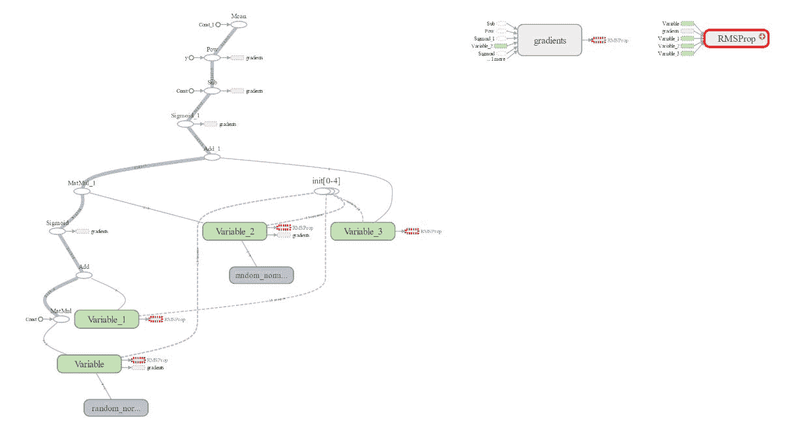

# 运行优化

下一步是执行优化器优化。执行此过程的 TensorFlow 步骤包括两部分：

1.  第一步是对图中定义的变量进行参数初始化。初始化通过调用 TensorFlow 中的`global_variables_initializer`函数来完成：

```py
# Initializing the variables
init = tf$global_variables_initializer()
sess$run(init)

```

优化是基于优化和监控训练和测试性能进行的：

```py
costconvergence<-NULL
for (step in 1:1000) {
  sess$run(optimizer)
  if (step %% 20==0){
    costconvergence<-rbind(costconvergence, c(step, sess$run(cost), sess$run(costt)))
    cat(step, "-", "Traing Cost ==>", sess$run(cost), "\n")
  }
}

```

1.  可以观察训练和测试中的成本函数，以了解模型的收敛情况，如下图所示：

```py
costconvergence<-data.frame(costconvergence)
colnames(costconvergence)<-c("iter", "train", "test")
plot(costconvergence[, "iter"], costconvergence[, "train"], type = "l", col="blue", xlab = "Iteration", ylab = "MSE")
lines(costconvergence[, "iter"], costconvergence[, "test"], col="red")
legend(500,0.25, c("Train","Test"), lty=c(1,1), lwd=c(2.5,2.5),col=c("blue","red"))

```

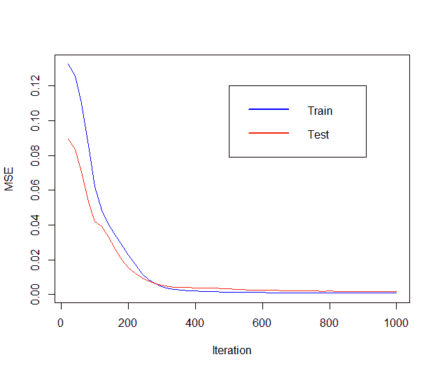

该图显示，模型的主要`收敛`发生在大约**400**次迭代时；然而，即使经过**1,000**次迭代后，收敛速度依然很慢。该模型在训练数据集和保留测试数据集中都很稳定。

# 设置正则化自编码器

正则化自编码器通过在`cost`函数中添加正则化参数来扩展标准自编码器。

# 准备工作

正则化自编码器是标准自编码器的扩展。设置将需要：

1.  在 R 和 Python 中的 TensorFlow 安装。

1.  标准自编码器的实现。

# 如何操作...

自编码器的代码设置可以通过将成本定义替换为以下几行，直接转换为正则化自编码器：

```py
Lambda=0.01
cost = tf$reduce_mean(tf$pow(x - y_pred, 2))
Regularize_weights = tf$nn$l2_loss(weights)
cost = tf$reduce_mean(cost + lambda * Regularize_weights)

```

# 它是如何工作的...

如前所述，正则化自编码器通过在成本函数中添加正则化参数来扩展标准自编码器，如下所示：


这里，*λ*是正则化参数，*i*和*j*是节点索引，*W*表示自编码器的隐藏层权重。正则化自编码器的目的是确保更强大的编码，并偏好低权重*h*函数。这个概念进一步被用于开发收缩自编码器，它利用输入上雅可比矩阵的 Frobenius 范数，表示如下：


其中**J(x)**是雅可比矩阵，计算方法如下：


对于线性编码器，收缩编码器和正则化编码器收敛到 L2 权重衰减。正则化有助于使自编码器对输入的敏感度降低；然而，成本函数的最小化帮助模型捕捉变化，并保持对高密度流形的敏感性。这些自编码器也被称为**收缩自编码器**。

# 微调自编码器的参数

自编码器涉及一些需要调整的参数，这取决于我们所使用的自编码器类型。自编码器中的主要参数包括：

+   任何隐藏层中的节点数量

+   适用于深度自编码器的隐藏层数量

+   激活单元，例如 sigmoid、tanh、softmax 和 ReLU 激活函数

+   隐藏单元权重上的正则化参数或权重衰减项

+   在去噪自编码器中，信号损坏的比例

+   稀疏自编码器中的稀疏性参数，用于控制隐藏层中神经元的期望激活值

+   如果使用批量梯度下降学习，批次大小；如果使用随机梯度下降，学习率和动量参数

+   训练时使用的最大迭代次数

+   权重初始化

+   如果使用了 dropout，进行 dropout 正则化

这些超参数可以通过将问题设定为网格搜索问题来训练。然而，每个超参数组合都需要训练隐藏层的神经元权重，这导致随着层数和每层节点数的增加，计算复杂性也会增加。为了解决这些关键参数和训练问题，提出了堆叠自编码器概念，它逐层训练每一层，以获取预训练权重，然后使用获得的权重对模型进行微调。这种方法大大提高了训练性能，相比传统的训练方式。

# 设置堆叠自编码器

堆叠自编码器是一种训练深度网络的方法，包含多个层，使用贪婪算法逐层训练。下面的图示展示了堆叠自编码器的一个示例：

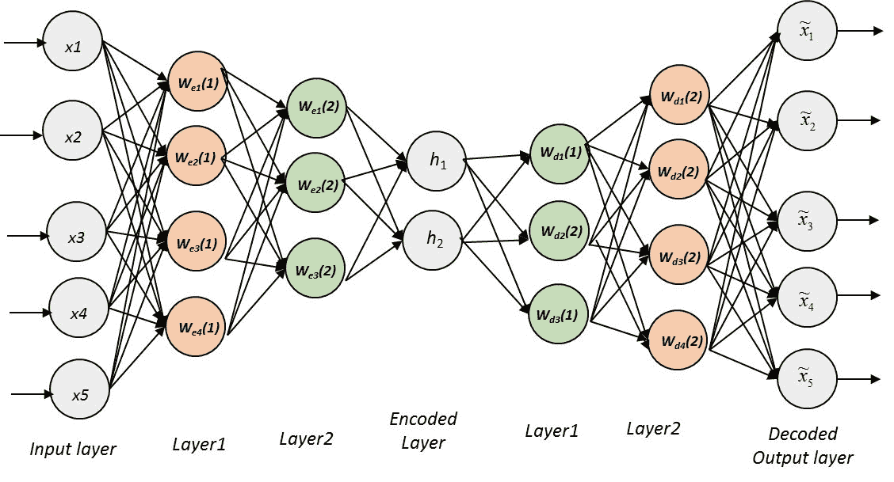

堆叠自编码器的示例

# 准备就绪

前面的图示展示了一个具有两层的堆叠自编码器。堆叠自编码器可以有*n*层，其中每一层是逐层训练的。例如，前一层的训练过程如下：

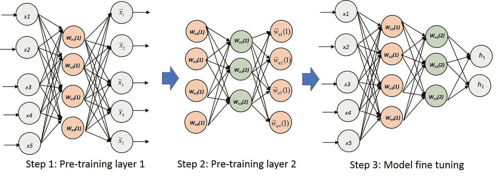

堆叠自编码器的训练

第 1 层的初步训练是通过在实际输入*x[i]*上进行训练得到的。第一步是优化编码器的*We(1)*层，以适应输出 X。上面的第二步是通过使用*We(1)*作为输入和输出，优化第二层的权重*We(2)*。一旦所有*We(i)*层（其中*i*=1, 2, ..., *n*为层数）都经过预训练，就可以通过将所有层连接在一起进行模型微调，正如前图中的第 3 步所示。该概念还可以应用于去噪训练多层网络，这被称为堆叠去噪自编码器。去噪自编码器中开发的代码可以轻松调整为开发**堆叠去噪自编码器**，它是堆叠自编码器的扩展。

本配方的要求如下：

1.  需要安装 R。

1.  `SAENET`包，可以通过命令`install.packages("SAENET")`从 Cran 下载安装该包。

# 如何操作...

在 R 中还有其他流行的库用于开发堆叠自编码器。让我们使用 R 中的`SAENET`包来搭建一个堆叠自编码器。`SAENET`是一个堆叠自编码器的实现，使用的是`neuralnet`包中的前馈神经网络（来自 CRAN）：

1.  如果尚未安装，可以从 CRAN 仓库获取`SAENET`包：

```py
install.packages("SAENET")

```

1.  加载所有库依赖项：

```py
require(SAENET)

```

1.  使用`load_occupancy_data`加载训练和测试占用数据集：

```py
occupancy_train <-load_occupancy_data(train=T)
occupancy_test <- load_occupancy_data(train = F)

```

1.  使用`minmax.normalize`函数对数据集进行归一化：

```py
# Normalize dataset
occupancy_train<-minmax.normalize(occupancy_train, scaler = NULL)
occupancy_test<-minmax.normalize(occupancy_test, scaler = occupancy_train$scaler)

```

1.  堆叠自编码器模型可以使用`SAENET.train`训练函数从`SAENET`包中构建：

```py
# Building Stacked Autoencoder
SAE_obj<-SAENET.train(X.train= subset(occupancy_train$data, select=-c(Occupancy)), n.nodes=c(4, 3, 2), unit.type ="tanh", lambda = 1e-5, beta = 1e-5, rho = 0.01, epsilon = 0.01, max.iterations=1000)

```

可以使用`SAE_obj[[n]]$X.output`命令提取最后一个节点的输出。

# 设置去噪自编码器

去噪自编码器是一种特殊类型的自编码器，专注于从输入数据集中提取稳健的特征。去噪自编码器与之前的模型类似，唯一的主要区别是数据在训练网络之前会被破坏。可以使用不同的破坏方法，例如遮罩，它会在数据中引入随机错误。

# 准备工作

让我们使用 CIFAR-10 图像数据来设置去噪数据集：

+   使用`download_cifar_data`函数下载 CIFAR-10 数据集（见第三章，*卷积神经网络*）

+   在 R 和 Python 中安装 TensorFlow

# 如何操作...

我们首先需要读取数据集。

# 读取数据集

1.  使用第三章中解释的步骤加载`CIFAR`数据集，*卷积神经网络*。使用`data_batch_1`和`data_batch_2`文件进行训练，`data_batch_5`和`test_batch`文件分别用于验证和测试。数据可以通过`flat_data`函数进行展平：

```py
train_data <- flat_data(x_listdata = images.rgb.train)
test_data <- flat_data(x_listdata = images.rgb.test)
valid_data <- flat_data(x_listdata = images.rgb.valid)

```

1.  `flat_data`函数将数据集展平为*NCOL = (高度 * 宽度 * 通道数)*，因此数据集的维度是（图像数 × NCOL）。`CIFAR`中的图像大小为 32 x 32，包含三个 RGB 通道；因此，在数据展平后，我们得到 3,072 列：

```py
> dim(train_data$images)
[1] 40000  3072

```

# 破坏数据以进行训练

1.  设置去噪自编码器所需的下一个关键功能是数据破坏：

```py
# Add noise using masking or salt & pepper noise method
add_noise<-function(data, frac=0.10, corr_type=c("masking", "saltPepper", "none")){
  if(length(corr_type)>1) corr_type<-corr_type[1] 

  # Assign a copy of data
  data_noise = data

  # Evaluate chaining parameters for autoencoder
  nROW<-nrow(data)
  nCOL<-ncol(data)
  nMask<-floor(frac*nCOL)

  if(corr_type=="masking"){
    for( i in 1:nROW){
      maskCol<-sample(nCOL, nMask)
      data_noise[i,maskCol,,]<-0
    }
  } else if(corr_type=="saltPepper"){
    minval<-min(data[,,1,])
    maxval<-max(data[,,1,])
    for( i in 1:nROW){
      maskCol<-sample(nCOL, nMask)
      randval<-runif(length(maskCol))
      ixmin<-randval<0.5
      ixmax<-randval>=0.5
      if(sum(ixmin)>0) data_noise[i,maskCol[ixmin],,]<-minval
      if(sum(ixmax)>0) data_noise[i,maskCol[ixmax],,]<-maxval
    }
  } else
  {
    data_noise<-data
  }
  return(data_noise)
}

```

1.  可以使用以下脚本来破坏 CIFAR-10 数据：

```py
# Corrupting input signal
xcorr<-add_noise(train_data$images, frac=0.10, corr_type="masking")

```

1.  破坏后的示例图像如下：

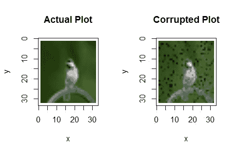

1.  上图使用了遮罩方法来添加噪声。此方法在随机图像位置添加零值，且定义了一个比例。另一种添加噪声的方法是使用椒盐噪声。此方法在图像中选择随机位置并进行替换，使用抛硬币原理为图像添加最小值或最大值。以下是使用椒盐方法进行数据破坏的示例：

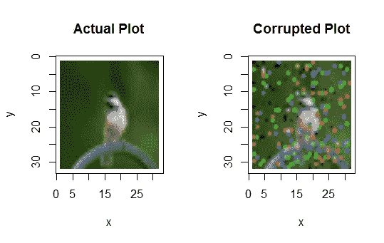

数据破坏有助于自编码器学习更稳健的表示。

# 设置去噪自编码器

下一步是设置自编码器模型：

1.  首先，重置图并开始一个交互式会话，如下所示：

```py
# Reset the graph and set-up an interactive session
tf$reset_default_graph()
sess<-tf$InteractiveSession()

```

1.  下一步是为输入信号和破坏信号定义两个占位符：

```py
# Define Input as Placeholder variables
x = tf$placeholder(tf$float32, shape=shape(NULL, img_size_flat), name='x')
x_corrput<-tf$placeholder(tf$float32, shape=shape(NULL, img_size_flat), name='x_corrput')

```

`x_corrupt` 将作为自编码器的输入，而 *x* 是实际的图像，将用作输出。

1.  设置去噪自编码器函数，如下代码所示：

```py
# Setting-up denoising autoencoder
denoisingAutoencoder<-function(x, x_corrput, img_size_flat=3072, hidden_layer=c(1024, 512), out_img_size=256){

  # Building Encoder
  encoder = NULL
  n_input<-img_size_flat
  curentInput<-x_corrput
  layer<-c(hidden_layer, out_img_size)
  for(i in 1:length(layer)){
    n_output<-layer[i]
    W = tf$Variable(tf$random_uniform(shape(n_input, n_output), -1.0 / tf$sqrt(n_input), 1.0 / tf$sqrt(n_input)))
    b = tf$Variable(tf$zeros(shape(n_output)))
    encoder<-c(encoder, W)
    output = tf$nn$tanh(tf$matmul(curentInput, W) + b)
    curentInput = output
    n_input<-n_output
  }

  # latent representation
  z = curentInput
  encoder<-rev(encoder)
  layer_rev<-c(rev(hidden_layer), img_size_flat)

  # Build the decoder using the same weights
  decoder<-NULL
  for(i in 1:length(layer_rev)){
    n_output<-layer_rev[i]
    W = tf$transpose(encoder[[i]])
    b = tf$Variable(tf$zeros(shape(n_output)))
    output = tf$nn$tanh(tf$matmul(curentInput, W) + b)
    curentInput = output
  }

  # now have the reconstruction through the network
  y = curentInput

  # cost function measures pixel-wise difference
  cost = tf$sqrt(tf$reduce_mean(tf$square(y - x)))
  return(list("x"=x, "z"=z, "y"=y, "x_corrput"=x_corrput, "cost"=cost))
}

```

1.  创建去噪对象：

```py
# Create denoising AE object
dae_obj<-denoisingAutoencoder(x, x_corrput, img_size_flat=3072, hidden_layer=c(1024, 512), out_img_size=256)

```

1.  设置代价函数：

```py
# Learning set-up
learning_rate = 0.001
optimizer = tf$train$AdamOptimizer(learning_rate)$minimize(dae_obj$cost)

```

1.  运行优化：

```py
# We create a session to use the graph
sess$run(tf$global_variables_initializer())
for(i in 1:500){
  spls <- sample(1:dim(xcorr)[1],1000L)
  if (i %% 1 == 0) {
    x_corrput_ds<-add_noise(train_data$images[spls, ], frac = 0.3, corr_type = "masking")
    optimizer$run(feed_dict = dict(x=train_data$images[spls, ], x_corrput=x_corrput_ds))
    trainingCost<-dae_obj$cost$eval((feed_dict = dict(x=train_data$images[spls, ], x_corrput=x_corrput_ds)))
    cat("Training Cost - ", trainingCost, "\n")
  }
}

```

# 它是如何工作的...

自编码器继续学习关于特征的函数形式，以捕捉输入和输出之间的关系。计算机在 1,000 次迭代后如何可视化图像的示例如下所示：


在进行 1,000 次迭代后，计算机能够区分物体和环境的主要部分。随着我们继续运行算法来微调权重，计算机会继续学习更多关于物体本身的特征，如下图所示：

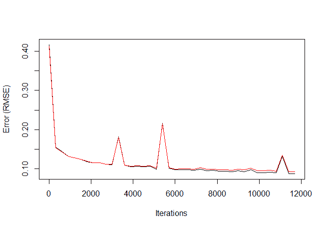

上图显示了模型仍在学习，但随着它开始学习关于物体的精细特征，学习率在迭代过程中逐渐变小，如下图所示。有时，模型开始上升而不是下降，这是由于批量梯度下降引起的：

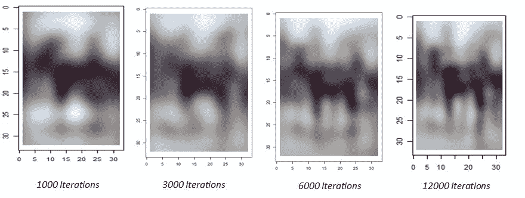

使用去噪自编码器进行学习的示意图

# 构建和比较随机编码器和解码器

随机编码器属于生成建模领域，目标是学习给定数据 *X* 在转换到另一个高维空间后的联合概率 *P(X)*。例如，我们想学习图像并通过学习像素依赖关系和分布生成类似但不完全相同的图像。生成建模中一种流行的方法是**变分自编码器**（**VAE**），它通过对 *h ~ P(h)* 做出强假设，如高斯分布或伯努利分布，将深度学习与统计推理相结合。对于给定的权重 *W*，*X* 可以从分布中采样为 *Pw(X|h)*。下面的图示展示了 VAE 的架构：


VAE 的代价函数基于对数似然最大化。代价函数由重建误差和正则化误差项组成：

*代价 = 重建误差 + 正则化误差*

**重建误差** 是我们如何将结果与训练数据进行映射的准确度，而 **正则化误差** 对编码器和解码器形成的分布施加了惩罚。

# 准备工作

TensorFlow 需要在环境中安装并加载：

```py
require(tensorflow)

```

需要加载依赖项：

```py
require(imager)
require(caret)

```

`MNIST` 数据集需要被加载。数据集使用以下脚本进行归一化：

```py
# Normalize Dataset
normalizeObj<-preProcess(trainData, method="range")
trainData<-predict(normalizeObj, trainData)
validData<-predict(normalizeObj, validData)

```

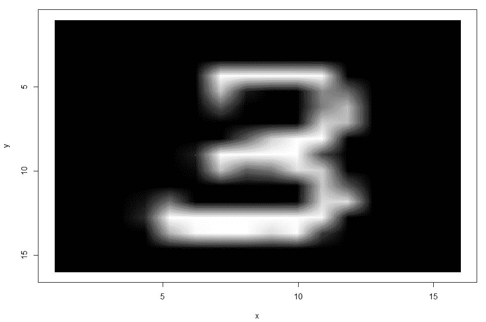

# 如何做...

1.  `MNIST` 数据集被用来演示稀疏分解的概念。`MNIST` 数据集包含手写数字。它是从 `tensorflow` 数据集库下载的。数据集包含 `28 x 28` 像素的手写图像，包含 55,000 个训练样本，10,000 个测试样本和 5,000 个测试样本。可以通过以下脚本从 `tensorflow` 库下载数据集：

```py
library(tensorflow)
datasets <- tf$contrib$learn$datasets
mnist <- datasets$mnist$read_data_sets("MNIST-data", one_hot = TRUE) 

```

1.  为了简化计算，`MNIST` 图像的大小从 `28 x 28` 像素减小为 `16 x 16` 像素，使用以下函数：

```py
# Function to reduce image size
reduceImage<-function(actds, n.pixel.x=16, n.pixel.y=16){
  actImage<-matrix(actds, ncol=28, byrow=FALSE)
  img.col.mat <- imappend(list(as.cimg(actImage)),"c")
  thmb <- resize(img.col.mat, n.pixel.x, n.pixel.y)
  outputImage<-matrix(thmb[,,1,1], nrow = 1, byrow = F)
  return(outputImage)
} 

```

1.  以下脚本可以用来准备具有 `16 x 16` 像素图像的 `MNIST` 训练数据：

```py
# Covert train data to 16 x 16  image
trainData<-t(apply(mnist$train$images, 1, FUN=reduceImage))
validData<-t(apply(mnist$test$images, 1, FUN=reduceImage))

```

1.  `plot_mnist` 函数可以用来可视化选择的 `MNIST` 图像：

```py
# Function to plot MNIST dataset
plot_mnist<-function(imageD, pixel.y=16){
  actImage<-matrix(imageD, ncol=pixel.y, byrow=FALSE)
  img.col.mat <- imappend(list(as.cimg(actImage)), "c")
  plot(img.col.mat)
}

```

# 设置 VAE 模型：

1.  启动一个新的 TensorFlow 环境：

```py
tf$reset_default_graph()
sess<-tf$InteractiveSession()

```

1.  定义网络参数：

```py
n_input=256
n.hidden.enc.1<-64

```

1.  启动一个新的 TensorFlow 环境：

```py
tf$reset_default_graph()
sess<-tf$InteractiveSession()

```

1.  定义网络参数：

```py
n_input=256
n.hidden.enc.1<-64

```

前述参数将形成如下的 VAE 网络：


1.  定义模型初始化函数，定义每一层 `encoder` 和 `decoder` 的权重和偏差：

```py
model_init<-function(n.hidden.enc.1, n.hidden.enc.2, 
                               n.hidden.dec.1,  n.hidden.dec.2, 
                               n_input, n_h)
{ weights<-NULL
 ############################
 # Set-up Encoder
 ############################
 # Initialize Layer 1 of encoder
 weights[["encoder_w"]][["h1"]]=tf$Variable(xavier_init(n_input,
 n.hidden.enc.1))
 weights[["encoder_w"]]
[["h2"]]=tf$Variable(xavier_init(n.hidden.enc.1, n.hidden.enc.2))
  weights[["encoder_w"]][["out_mean"]]=tf$Variable(xavier_init(n.hidden.enc.2, n_h))
  weights[["encoder_w"]][["out_log_sigma"]]=tf$Variable(xavier_init(n.hidden.enc.2, n_h))
  weights[["encoder_b"]][["b1"]]=tf$Variable(tf$zeros(shape(n.hidden.enc.1), dtype=tf$float32))
  weights[["encoder_b"]][["b2"]]=tf$Variable(tf$zeros(shape(n.hidden.enc.2), dtype=tf$float32))
  weights[["encoder_b"]][["out_mean"]]=tf$Variable(tf$zeros(shape(n_h), dtype=tf$float32))
  weights[["encoder_b"]][["out_log_sigma"]]=tf$Variable(tf$zeros(shape(n_h), dtype=tf$float32))

 ############################
 # Set-up Decoder
 ############################
 weights[['decoder_w']][["h1"]]=tf$Variable(xavier_init(n_h, n.hidden.dec.1))
 weights[['decoder_w']][["h2"]]=tf$Variable(xavier_init(n.hidden.dec.1, n.hidden.dec.2))
 weights[['decoder_w']][["out_mean"]]=tf$Variable(xavier_init(n.hidden.dec.2, n_input))
 weights[['decoder_w']][["out_log_sigma"]]=tf$Variable(xavier_init(n.hidden.dec.2, n_input))
 weights[['decoder_b']][["b1"]]=tf$Variable(tf$zeros(shape(n.hidden.dec.1), dtype=tf$float32))
 weights[['decoder_b']][["b2"]]=tf$Variable(tf$zeros(shape(n.hidden.dec.2), dtype=tf$float32))
 weights[['decoder_b']][["out_mean"]]=tf$Variable(tf$zeros(shape(n_input), dtype=tf$float32))
 weights[['decoder_b']][["out_log_sigma"]]=tf$Variable(tf$zeros(shape(n_input), dtype=tf$float32))
 return(weights)
} 

```

`model_init` 函数返回 `weights`，它是一个二维列表。第一个维度表示权重的关联和类型。例如，它描述了 `weights` 变量是分配给编码器还是解码器，并且它是否存储节点的权重或偏差。`model_init` 中的 `xavier_init` 函数用于为模型训练分配初始权重：

```py
# Xavier Initialization using Uniform distribution 
xavier_init<-function(n_inputs, n_outputs, constant=1){
  low = -constant*sqrt(6.0/(n_inputs + n_outputs)) 
  high = constant*sqrt(6.0/(n_inputs + n_outputs))
  return(tf$random_uniform(shape(n_inputs, n_outputs), minval=low, maxval=high, dtype=tf$float32))
}

```

1.  设置编码器评估函数：

```py
# Encoder update function
vae_encoder<-function(x, weights, biases){
  layer_1 = tf$nn$softplus(tf$add(tf$matmul(x, weights[['h1']]), biases[['b1']])) 
  layer_2 = tf$nn$softplus(tf$add(tf$matmul(layer_1, weights[['h2']]), biases[['b2']])) 
  z_mean = tf$add(tf$matmul(layer_2, weights[['out_mean']]), biases[['out_mean']])
  z_log_sigma_sq = tf$add(tf$matmul(layer_2, weights[['out_log_sigma']]), biases[['out_log_sigma']])
  return (list("z_mean"=z_mean, "z_log_sigma_sq"=z_log_sigma_sq))
} 

```

`vae_encoder` 计算均值和方差，用于从隐藏层的权重和偏差中采样：

1.  设置解码器评估函数：

```py
# Decoder update function
vae_decoder<-function(z, weights, biases){
  layer1<-tf$nn$softplus(tf$add(tf$matmul(z, weights[["h1"]]), biases[["b1"]]))
  layer2<-tf$nn$softplus(tf$add(tf$matmul(layer1, weights[["h2"]]), biases[["b2"]]))
  x_reconstr_mean<-tf$nn$sigmoid(tf$add(tf$matmul(layer2, weights[['out_mean']]), biases[['out_mean']]))
  return(x_reconstr_mean)
}

```

`vae_decoder` 函数计算与采样层相关的均值和标准差，以及输出和平均输出：

1.  设置重构估计的函数：

```py
# Parameter evaluation
network_ParEval<-function(x, network_weights, n_h){

  distParameter<-vae_encoder(x, network_weights[["encoder_w"]], network_weights[["encoder_b"]])
  z_mean<-distParameter$z_mean
  z_log_sigma_sq <-distParameter$z_log_sigma_sq

  # Draw one sample z from Gaussian distribution
  eps = tf$random_normal(shape(BATCH, n_h), 0, 1, dtype=tf$float32)

  # z = mu + sigma*epsilon
  z = tf$add(z_mean, tf$multiply(tf$sqrt(tf$exp(z_log_sigma_sq)), eps))

  # Use generator to determine mean of
  # Bernoulli distribution of reconstructed input
  x_reconstr_mean <- vae_decoder(z, network_weights[["decoder_w"]], network_weights[["decoder_b"]])
  return(list("x_reconstr_mean"=x_reconstr_mean, "z_log_sigma_sq"=z_log_sigma_sq, "z_mean"=z_mean))
}

```

1.  定义优化的成本函数：

```py
# VAE cost function
vae_optimizer<-function(x, networkOutput){
  x_reconstr_mean<-networkOutput$x_reconstr_mean
  z_log_sigma_sq<-networkOutput$z_log_sigma_sq
  z_mean<-networkOutput$z_mean
  loss_reconstruction<--1*tf$reduce_sum(x*tf$log(1e-10 + x_reconstr_mean)+
                                       (1-x)*tf$log(1e-10 + 1 - x_reconstr_mean), reduction_indices=shape(1))
  loss_latent<--0.5*tf$reduce_sum(1+z_log_sigma_sq-tf$square(z_mean)-
                                    tf$exp(z_log_sigma_sq), reduction_indices=shape(1))
  cost = tf$reduce_mean(loss_reconstruction + loss_latent)
  return(cost)
}

```

1.  设置模型进行训练：

```py
# VAE Initialization
x = tf$placeholder(tf$float32, shape=shape(NULL, img_size_flat), name='x')
network_weights<-model_init(n.hidden.enc.1, n.hidden.enc.2, 
                            n.hidden.dec.1,  n.hidden.dec.2, 
                            n_input, n_h)
networkOutput<-network_ParEval(x, network_weights, n_h)
cost=vae_optimizer(x, networkOutput)
optimizer = tf$train$AdamOptimizer(lr)$minimize(cost) 

```

1.  运行优化：

```py
sess$run(tf$global_variables_initializer())
for(i in 1:ITERATION){
  spls <- sample(1:dim(trainData)[1],BATCH)
  out<-optimizer$run(feed_dict = dict(x=trainData[spls,]))
  if (i %% 100 == 0){
  cat("Iteration - ", i, "Training Loss - ",  cost$eval(feed_dict = dict(x=trainData[spls,])), "\n")
  }
}

```

# VAE 自编码器的输出：

1.  可以使用以下脚本生成结果：

```py
spls <- sample(1:dim(trainData)[1],BATCH)
networkOutput_run<-sess$run(networkOutput, feed_dict = dict(x=trainData[spls,]))

# Plot reconstructured Image
x_sample<-trainData[spls,]
NROW<-nrow(networkOutput_run$x_reconstr_mean)
n.plot<-5
par(mfrow = c(n.plot, 2), mar = c(0.2, 0.2, 0.2, 0.2), oma = c(3, 3, 3, 3))
pltImages<-sample(1:NROW,n.plot)
for(i in pltImages){
  plot_mnist(x_sample[i,])
  plot_mnist(networkOutput_run$x_reconstr_mean[i,])
}

```

以下图所示是从前述 VAE 自编码器经过 `20,000` 次迭代后的结果：


此外，由于 VAE 是生成模型，输出结果不是输入的精确复制，而是会随着运行的不同而有所变化，因为从估计的分布中提取了一个代表性样本。

# 从自编码器学习流形：

流形学习是机器学习中的一种方法，它假设数据位于一个维度远低于原始数据的流形上。这些流形可以是线性或非线性的。因此，该方法尝试将数据从高维空间投影到低维空间。例如，**主成分分析**（**PCA**）是线性流形学习的一个例子，而自编码器则是一个**非线性降维**（**NDR**）方法，具有学习低维空间中非线性流形的能力。线性与非线性流形学习的比较见下图：

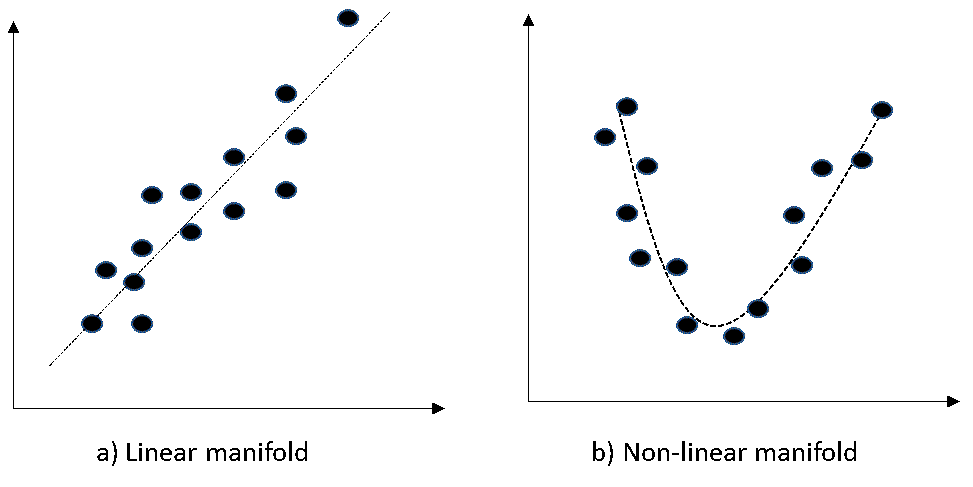

如图**a)**所示，数据位于一个线性流形上，而在图**b)**中，数据则位于二阶非线性流形上。

# 如何操作...

让我们取堆叠自编码器部分的输出，分析数据在转移到不同维度时，流形的表现。

# 设置主成分分析

1.  在进入非线性流形之前，让我们分析占用数据上的主成分分析：

```py
# Setting-up principal component analysis 
pca_obj <- prcomp(occupancy_train$data,
                 center = TRUE,
                 scale. = TRUE)
                 scale. = TRUE)

```

1.  上述函数将数据转化为六个正交方向，这些方向是特征的线性组合。每个维度所解释的方差可以通过以下脚本查看：

```py
plot(pca_obj, type = "l")

```

1.  上述命令将绘制主成分的方差，如下图所示：

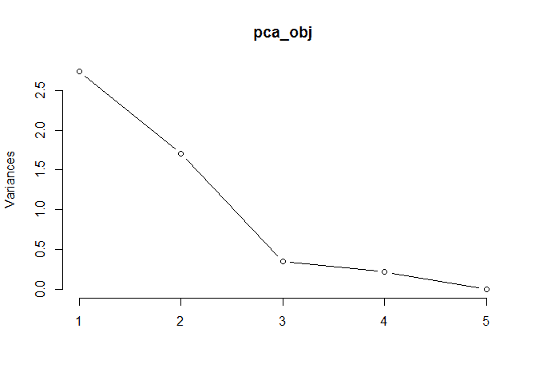

1.  对于占用数据集，前两个主成分捕捉了大部分变异，当绘制主成分时，显示出占用的正负类之间的分离，如下图所示：

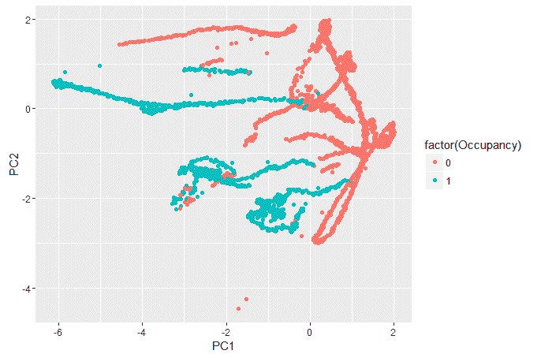

前两个主成分的输出

1.  让我们可视化自编码器学习到的低维流形。我们只使用一个维度来可视化结果，如下所示：

```py
SAE_obj<-SAENET.train(X.train= subset(occupancy_train$data, select=-c(Occupancy)), n.nodes=c(4, 3, 1), unit.type ="tanh", lambda = 1e-5, beta = 1e-5, rho = 0.01, epsilon = 0.01, max.iterations=1000) 

```

1.  上述脚本的编码器架构如下所示：


堆叠自编码器中一个潜在节点的隐藏层输出如下所示：

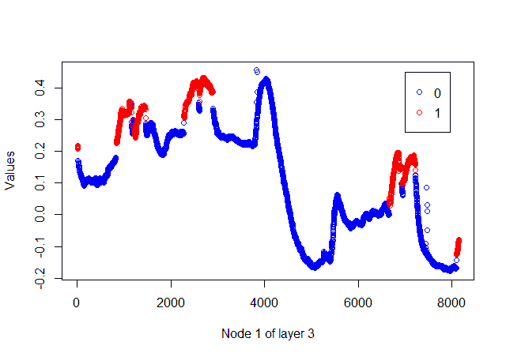

1.  上述图表显示，占用在潜在变量的峰值处为真。然而，峰值出现在不同的值上。让我们增加潜在变量 2，这是通过 PCA 捕获的。可以使用以下脚本开发模型并绘制数据：

```py
SAE_obj<-SAENET.train(X.train= subset(occupancy_train$data, select=-c(Occupancy)), n.nodes=c(4, 3, 2), unit.type ="tanh", lambda = 1e-5, beta = 1e-5, rho = 0.01, epsilon = 0.01, max.iterations=1000)  

# plotting encoder values
plot(SAE_obj[[3]]$X.output[,1], SAE_obj[[3]]$X.output[,2], col="blue", xlab = "Node 1 of layer 3", ylab = "Node 2 of layer 3")
ix<-occupancy_train$data[,6]==1  
points(SAE_obj[[3]]$X.output[ix,1], SAE_obj[[3]]$X.output[ix,2], col="red")

```

1.  带有两层编码的值在下图中显示：

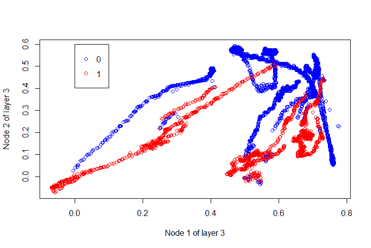

# 评估稀疏分解

稀疏自编码器也被称为过完备表示，并且在隐藏层中具有更多的节点。稀疏自编码器通常使用稀疏性参数（正则化）执行，该参数充当约束，限制节点的激活。稀疏性也可以被看作是由于稀疏性约束而导致的节点丢弃。稀疏自编码器的损失函数由重建误差、用于控制权重衰减的正则化项以及用于稀疏性约束的 KL 散度组成。以下表示很好地说明了我们所讲的内容：

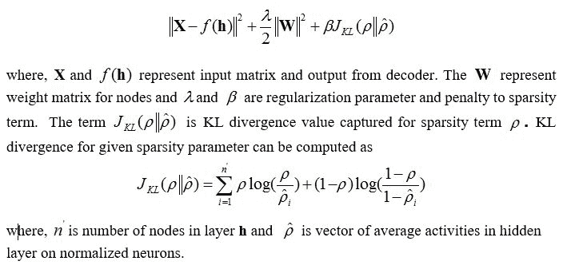

# 准备工作

1.  数据集已加载并设置好。

1.  使用以下脚本安装并加载`autoencoder`包：

```py
install.packages("autoencoder")
require(autoencoder)

```

# 如何操作...

1.  TensorFlow 的标准自编码器代码可以通过更新成本函数轻松扩展到稀疏自编码器模块。本节将介绍 R 的自编码器包，该包内置了运行稀疏自编码器的功能：

```py
### Setting-up parameter
nl<-3 
N.hidden<-100 
unit.type<-"logistic" 
lambda<-0.001 
rho<-0.01 
beta<-6 
max.iterations<-2000 
epsilon<-0.001 

### Running sparse autoencoder
spe_ae_obj <- autoencode(X.train=trainData,  X.test = validData, nl=nl, N.hidden=N.hidden, unit.type=unit.type,lambda=lambda,beta=beta,              epsilon=epsilon,rho=rho,max.iterations=max.iterations, rescale.flag = T)

```

`autoencode`函数中的主要参数如下：

+   `nl`：这是包括输入层和输出层在内的层数（默认值为三层）。

+   `N.hidden`：这是每个隐藏层中神经元数量的向量。

+   `unit.type`：这是要使用的激活函数类型。

+   `lambda`：这是正则化参数。

+   `rho`：这是稀疏性参数。

+   `beta`：这是稀疏项的惩罚。

+   `max.iterations`：这是最大迭代次数。

+   `epsilon`：这是权重初始化的参数。权重是使用高斯分布 ~N(0, epsilon2) 初始化的。

# 它是如何工作的...

下图展示了稀疏自编码器捕获的来自`MNIST`的数字形状和方向：

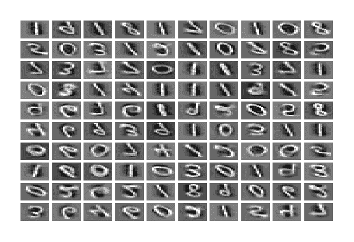

通过稀疏自编码器生成的滤波器得到数字结果

稀疏自编码器学习到的滤波器可以使用来自自编码器包的`visualize.hidden.units`函数进行可视化。该包绘制了最终层的权重与输出之间的关系。在当前场景中，100 是隐藏层中的神经元数量，256 是输出层中的节点数量。
