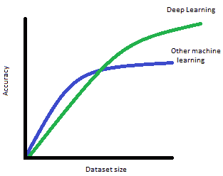
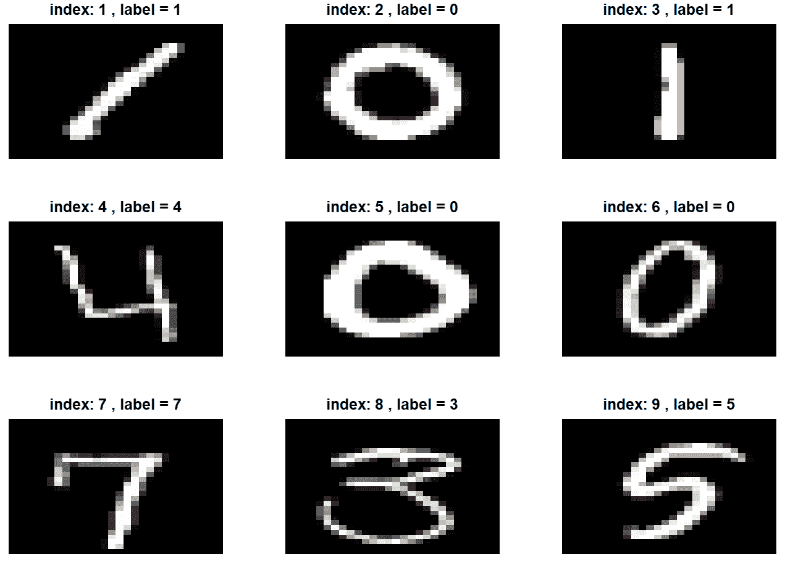
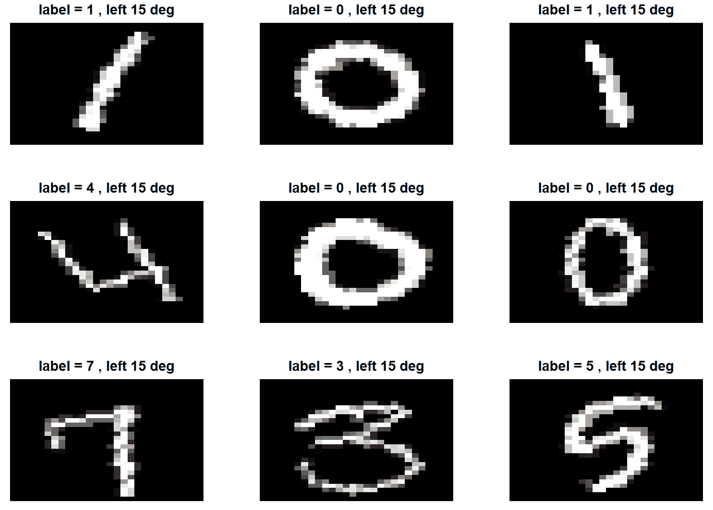
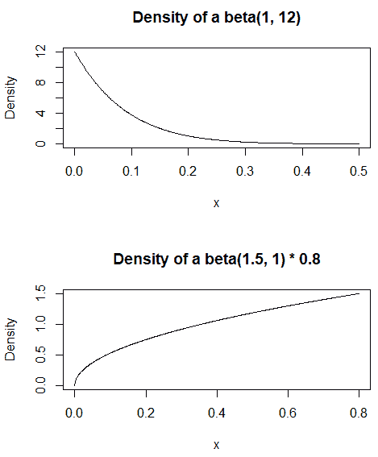
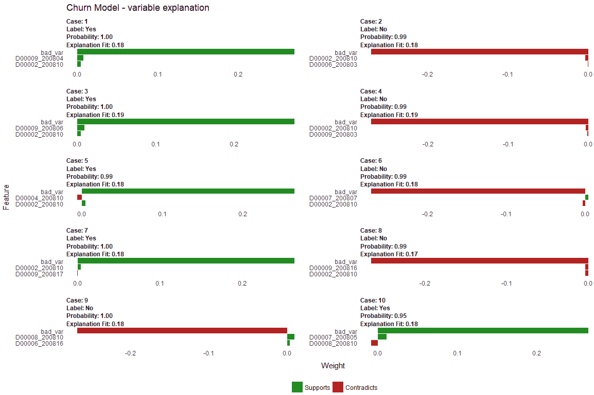
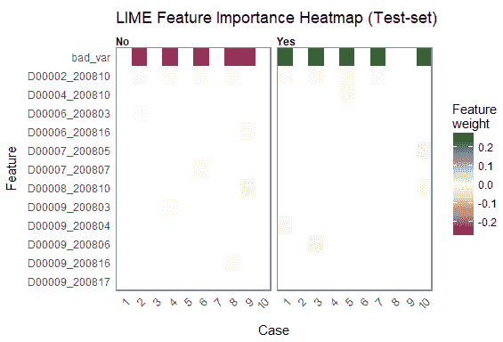
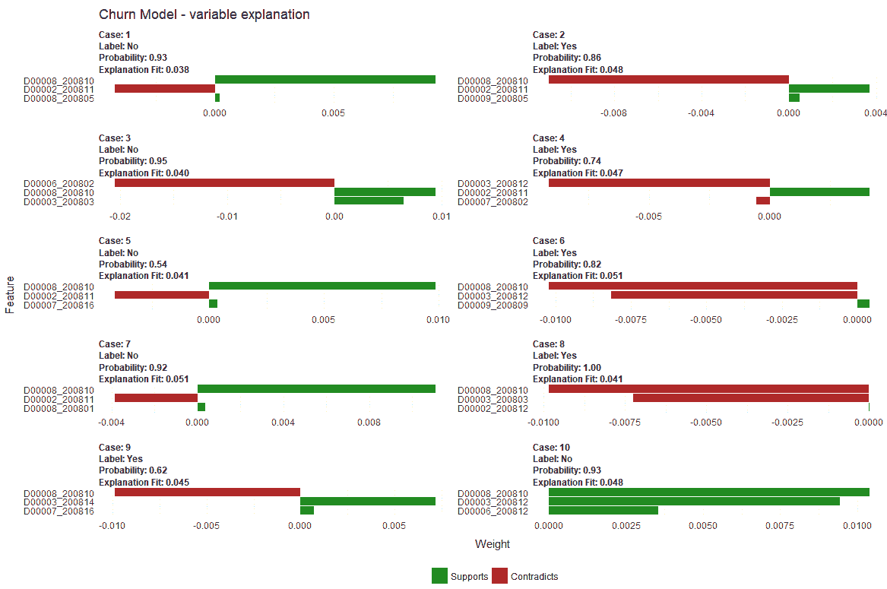
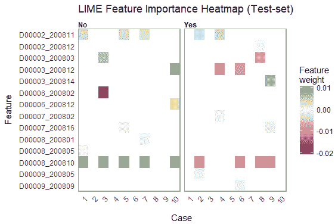

# 调整和优化模型

在过去的两章中，我们训练了用于分类、回归和图像识别任务的深度学习模型。在本章中，我们将讨论管理深度学习项目的一些重要问题。虽然本章可能显得有些理论性，但如果没有正确管理讨论的任何问题，可能会导致深度学习项目的失败。我们将探讨如何选择评估指标，以及如何在开始建模之前评估深度学习模型的性能。接下来，我们将讨论数据分布及在将数据划分为训练集时常见的错误。许多机器学习项目在生产环境中失败，原因是数据分布与模型训练时的数据分布不同。我们将讨论数据增强，这是提升模型准确性的一个重要方法。最后，我们将讨论超参数，并学习如何调整它们。

本章我们将讨论以下主题：

+   评估指标与性能评估

+   数据准备

+   数据预处理

+   数据增强

+   调整超参数

+   用例——可解释性

# 评估指标与性能评估

本节将讨论如何设置深度学习项目以及如何选择评估指标。我们将探讨如何选择评估标准，并如何判断模型是否接近最佳性能。我们还将讨论所有深度学习模型通常会出现过拟合问题，以及如何管理偏差/方差的权衡。此部分将为在模型准确率较低时应采取的措施提供指导。

# 评估指标的类型

不同的评估指标用于分类和回归任务。在分类任务中，准确率是最常用的评估指标。然而，准确率只有在所有类别的错误成本相同的情况下才有效，但这并非总是如此。例如，在医疗诊断中，假阴性的成本要远高于假阳性的成本。假阴性意味着认为某人没有生病，而实际上他们有病，延误诊断可能会带来严重甚至致命的后果。另一方面，假阳性则是认为某人生病了，而实际上并没有，这虽然让病人感到不安，但不会威胁到生命。

当数据集不平衡时，这个问题会变得更加复杂，即某一类别比另一类别更为常见。以我们的医疗诊断示例为例，如果接受测试的人中只有 1%的人实际患有疾病，那么机器学习算法仅通过判断没有人患病就能获得 99%的准确率。在这种情况下，可以考虑其他的评估指标，而非准确率。对于不平衡的数据集，F1 评估指标是一个有用的选择，它是精确率和召回率的加权平均。F1 分数的计算公式如下：

*F1 = 2 * (精确率 * 召回率) / (精确率 + 召回率)*

精度和召回率的公式如下：

*精度 = true_positives / (true_positives + false_positives)*

*召回率 = true_positives / (true_positives + false_negatives)*

对于回归问题，您可以选择评估指标：MAE、MSE 和 RMSE。**MAE**，或称为**平均绝对误差**，是最简单的；它只是实际值与预测值之间绝对差的平均值。MAE 的优点是易于理解；如果 MAE 是 3.5，那么预测值与实际值之间的差异平均为 3.5。**MSE**，或称为**均方误差**，是误差平方的平均值，也就是说，它计算实际值与预测值之间的差异，平方后再求这些值的平均值。使用 MSE 相较于 MAE 的优点在于，它根据误差的严重程度进行惩罚。如果实际值和预测值之间的差异为 2 和 5，那么 MSE 会对第二个例子赋予更多的权重，因为误差较大。**RMSE**，或称为**均方根误差**，是 MSE 的平方根。使用 MSE 的优点在于，它将误差项转回与实际值可比较的单位。对于回归任务，RMSE 通常是首选的评估指标。

欲了解有关 MXNet 中评估指标的更多信息，请参见 [`mxnet.incubator.apache.org/api/python/metric/metric.html`](https://mxnet.incubator.apache.org/api/python/metric/metric.html)。

欲了解有关 Keras 中评估指标的更多信息，请参见 [`keras.io/metrics/`](https://keras.io/metrics/)。

# 评估性能

我们在前几章中探讨了一些深度学习模型。在 第五章 *使用卷积神经网络进行图像分类* 中，我们在 `MNIST` 数据集上的图像分类任务中获得了 98.36% 的准确率。对于 第四章 *训练深度预测模型* 中的二分类任务（预测哪些客户将在接下来的 14 天内返回），我们获得了 77.88% 的准确率。但这到底意味着什么呢？我们如何评估深度学习模型的性能？

评估深度学习模型是否具有良好预测能力的显而易见的起点是与其他模型进行比较。`MNIST` 数据集在许多深度学习研究的基准测试中都有使用，因此我们知道有些模型的准确率可以达到 99.5%。因此，我们的模型是可以接受的，但并不出色。在本章的 *数据增强* 部分，我们将通过对现有图像数据进行修改来生成新图像，从而显著提高模型的准确性，从 98.36% 提升到 98.95%。通常，对于图像分类任务，任何低于 95% 的准确率可能意味着您的深度学习模型存在问题。要么模型设计不正确，要么您的任务没有足够的数据。

我们的二分类模型只有 77.54%的准确率，远低于图像分类任务。那么，这是不是一个糟糕的模型？其实不然；它仍然是一个有用的模型。我们也有来自其他机器学习模型（如随机森林和 xgboost）的基准，它们是在数据的小部分上运行的。我们还看到，当我们从一个包含 3,900 行的数据的模型转到一个更深的包含 390,000 行的数据的模型时，准确率有所提高。这表明，深度学习模型随着数据量的增加而改进。

评估模型性能的一个步骤是查看更多数据是否会显著提高准确率。这些数据可以通过更多的训练数据获取，或者通过数据增强来获得，后者我们将在后续章节中讨论。你可以使用学习曲线来评估这是否有助于性能提升。要创建学习曲线，你需要训练一系列逐步增加数据量的机器学习模型，例如，从 10,000 行到 200,000 行，每次增加 1,000 行。对于每一步，运行`5`个不同的机器学习模型来平滑结果，并根据样本量绘制平均准确率。以下是执行此任务的伪代码：

```py
For k=10000 to 200000 step 1000
   For n=1 to 5
       [sample] = Take k rows from dataset
       Split [sample] into train (80%) / test (20%)
       Run ML (DT) algorithm
       Calculate Accuracy on test
       Save accuracy value
Plot k, avg(Accuracy)
```

这是一个与客户流失问题类似任务的学习曲线示例：


图 6.1：一个学习曲线示例，展示了数据量与准确率的关系

在这种情况下，准确率处于一个非常狭窄的范围，并且随着实例数量的增加而稳定。因此，对于该算法和超参数选择，增加更多的数据不会显著提高准确率。

如果我们得到一个像本例中一样平坦的学习曲线，那么向现有模型中添加更多数据不会提高准确率。我们可以尝试通过更改模型架构或增加更多特征来提高性能。我们在第五章，*使用卷积神经网络进行图像分类*中讨论了这一些选项。

回到我们的二分类模型，我们来考虑如何将它应用于生产环境。回想一下，该模型试图预测客户是否会在接下来的 *x* 天内返回。这里是该模型的混淆矩阵：

```py
      Predicted
Actual     0     1
 0     10714  4756
 1      3870 19649
```

如果我们观察模型在每个类别中的表现，会得到不同的准确率：

+   对于`Actual=0`，我们得到 *10714 / (10714 + 4756) = 69.3%* 的正确值。这被称为特异性或真负率。

+   对于`Actual=1`，我们得到 *19649 / (3466** + 19649) = 85.0%* 的正确值。这被称为敏感性或真正例率。

对于这个用例，灵敏度可能比特异性更为重要。如果我是高级经理，我会更关心哪些客户被预测会回归但实际上没有回归。可以向这一群体发送优惠以吸引他们回归。假设该模型是用来预测某人在 9 月 1 日至 9 月 14 日之间是否会回归，那么 9 月 15 日，我们得到前面的混淆矩阵。经理应该如何分配有限的营销预算？

+   我可以看到我得到了 4,756 个被预测不会回归但实际上回归的客户。这很好，但我不能真正对其采取行动。我可以尝试向 10,135 个未回归的客户发送优惠，但由于我的模型已经预测他们不会回归，我预计响应率会很低。

+   预测到会回归但未回归的 3,870 名客户更为有趣。这些人应该收到优惠以吸引他们在行为变化成为永久之前回归。这仅占我的客户基础的 9.9%，因此只向这些客户发送优惠，我不会通过向大量客户发送优惠而浪费预算。

预测模型不应该单独使用；应该将其他指标与之结合，制定营销策略。例如，**客户生命周期价值**（**CLV**），它衡量的是一个客户的预期未来收入减去重新获得该客户的成本，可以与预测模型结合使用。通过结合使用预测模型和 CLV，我们可以优先考虑那些根据预测未来价值可能回归的客户。

总结这一部分，过分沉迷于优化评估指标是很容易的，尤其是当你是该领域的新手时。作为数据科学家，你应该始终记住，优化机器学习任务的评估指标并不是最终目标——它只是改善某一部分业务的代理。你必须能够将机器学习模型的结果与业务用例联系起来。例如，在`MNIST`数据集中的数字识别任务，评估指标与业务用例之间有直接联系。但有时候这种联系并不那么明显，你需要与业务合作，找出如何利用分析结果来最大化公司收益的方法。

# 数据准备

机器学习是训练一个模型，使其能够在见过的案例上进行泛化，以便它能对未见过的数据做出预测。因此，用来训练深度学习模型的数据应该与模型在生产中看到的数据相似。然而，在产品的早期阶段，你可能几乎没有数据来训练模型，那么你该怎么办呢？例如，一个移动应用可能包含一个机器学习模型，用来预测由手机摄像头拍摄的图像的主题。当应用程序编写时，可能没有足够的数据来使用深度学习网络训练模型。一种方法是通过其他来源的图像来增强数据集，以训练深度学习网络。然而，你需要知道如何管理这一点，以及如何处理它引入的不确定性。另一种方法是迁移学习，我们将在第十一章，*深度学习的下一个层次*中讨论。

深度学习与传统机器学习之间的另一个区别是数据集的大小。这会影响数据拆分的比例——用于机器学习的数据拆分推荐指南（如 70/30 或 80/20 拆分）需要在训练深度学习模型时进行修订。

# 不同的数据分布

在前面的章节中，我们使用了 MNIST 数据集进行分类任务。虽然该数据集包含手写数字，但这些数据并不代表真实世界的数据。在第五章，*使用卷积神经网络进行图像分类*中，我们可视化了其中的一些数字，如果你回去看这些图像，会发现这些图像是标准格式的：

+   所有图像都是灰度的

+   所有图像都是 28 x 28

+   所有图像的边界似乎至少有 1 像素

+   所有图像的尺度相同，也就是说，每个图像几乎占据了整个图像

+   扭曲非常小，因为边框是黑色的，前景是白色的

+   图像是*正立的*，也就是说，我们没有进行过大的旋转

MNIST 数据集的最初用途是识别信件上的 5 位数字邮政编码。假设我们使用 MNIST 数据集中的 60,000 张图像来训练一个模型，并希望在生产环境中使用它来识别信件和包裹上的邮政编码。生产系统必须在应用深度学习之前执行以下步骤：

+   扫描字母

+   找到邮政编码部分

+   将邮政编码的数字分成 5 个不同的区域（每个数字一个区域）

在任何一个数据转换步骤中，可能会出现额外的数据偏差。如果我们使用*干净*的 MNIST 数据来训练模型，然后尝试预测*有偏*的转换数据，那么我们的模型可能效果不好。数据偏差对生产数据的影响示例如下：

+   正确定位邮政编码本身就是一个难题

+   字母将具有不同颜色和对比度的背景和前景，因此将它们转换为灰度图像可能不一致，这取决于字母和笔在字母/包裹上的使用类型。

+   扫描过程的结果可能会有所不同，因为使用了不同的硬件和软件——这是将深度学习应用于医学图像数据时的一个持续性问题。

+   最后，将邮政编码分成 5 个不同区域的难度，取决于字母和笔的使用方式，以及前面步骤的质量。

在这个例子中，用来训练数据的分布与估计模型性能的数据，与生产数据是不同的。如果数据科学家承诺在模型部署之前提供 99%的准确度，那么当应用程序在生产环境中运行时，管理层很可能会感到失望！在创建一个新模型时，我们将数据分为训练集和测试集，因此测试数据集的主要目的是估计模型的准确性。但如果测试数据集中的数据与模型在生产环境中将会见到的数据不同，那么测试数据集上的评估指标就无法准确指导模型在生产环境中的表现。

如果问题是一开始几乎没有或完全没有实际的标注数据，那么在任何模型训练之前，首先需要考虑的一步是调查是否可以获取更多数据。获取数据可能需要搭建一个小型生产环境，或者与客户合作，使用半监督学习与人工标注相结合的方法。在我们刚才看到的用例中，我会认为，设置提取数字化图像的流程比查看任何机器学习方法更为重要。一旦这个过程搭建好，我会着手建立一些训练数据——这些数据仍然可能不足以建立一个模型，但可以用来作为一个合适的测试集，以创建能够反映实际性能的评估指标。这一点可能看起来显而易见，因为基于有缺陷的评估指标所产生的过于乐观的期望，很可能是数据科学项目中排名前三的问题之一。

一个非常成功地处理这个问题的大型项目案例是 Airbnb 中的这个用例：[`medium.com/airbnb-engineering/categorizing-listing-photos-at-airbnb-f9483f3ab7e3`](https://medium.com/airbnb-engineering/categorizing-listing-photos-at-airbnb-f9483f3ab7e3)。他们有大量的房屋室内照片，但这些照片没有标注房间类型。他们利用现有的标注数据，并且进行质量保证，以检查标签的准确性。在数据科学中，常说创建机器学习模型可能只占实际工作量的 20%——获取一个准确且能代表模型在生产环境中实际见到的数据集，通常是深度学习项目中最困难的任务。

一旦你有了数据集，你需要在建模之前将数据分为训练集和测试集。如果你有传统机器学习的经验，你可能会从 70/30 的划分开始，即 70%用于训练模型，30%用于评估模型。然而，在大数据集和深度学习模型训练的领域，这条规则就不那么适用了。再次强调，将数据分为训练集和测试集的唯一原因，是为了有一个留存集来估计模型的表现。因此，你只需要在这个数据集中拥有足够的记录，以便你得到的准确度估计是可靠的，并且具有你所要求的精度。如果你一开始就有一个大数据集，那么测试数据集的比例较小可能就足够了。让我通过一个例子来解释，你想在现有的机器学习模型上进行改进：

+   先前的机器学习模型具有 99.0%的准确度。

+   有一个带标签的数据集，包含 1,000,000 条记录。

如果要训练一个新的机器学习模型，那么它至少应该达到 99.1%的准确度，才能让你确信它比现有模型有改进。那么在评估现有模型时需要多少记录呢？你只需要足够的记录，以便你能比较确定新模型的准确度在 0.1%的范围内。因此，测试集中的 50,000 条记录（即数据集的 5%）就足够评估你的模型。如果在这 50,000 条记录上的准确度为 99.1%，则有 49,550 条记录是正确分类的。这比基准模型多了 50 条正确分类的记录，这强烈表明第二个模型是一个更好的模型——差异不太可能仅仅是偶然的结果。

你可能会对只使用 5%的数据来评估模型的建议感到抵触。然而，70/30 数据划分的想法源自于小型数据集的时代，比如包含 150 条记录的鸢尾花数据集。我们之前在第四章中看到过以下图表，*训练深度预测模型*，该图展示了机器学习算法的准确度在数据量增加时往往会停滞。因此，最大化可用于训练的数据量的动机较小。深度学习模型可以利用更多的数据，因此如果我们可以为测试集使用更少的数据，我们应该能得到一个更好的模型：



图 6.2：数据集大小如何影响深度学习模型与其他机器学习模型的准确度

# 数据在训练集、测试集和验证集之间的划分。

前一节强调了在项目早期阶段获取一些数据的重要性。但如果你没有足够的数据来训练深度学习模型，仍然可以使用其他数据进行训练并将其应用到你的数据上。例如，你可以使用在 ImageNet 数据上训练的模型来进行图像分类任务。在这种情况下，你需要明智地使用收集到的真实数据。本节讨论了关于这一主题的一些好实践。

如果你曾经想过，为什么像谷歌、苹果、Facebook、亚马逊等大公司在人工智能方面具有如此大的领先优势，原因就在于此。虽然他们有世界上最优秀的 AI 专家为他们工作，但他们的最大优势在于他们可以使用大量的*标注*数据来构建他们的机器学习模型。

在前一节中，我们说过测试集的唯一目的是评估模型。但是，如果这些数据和模型在预测任务中将会遇到的数据不来自相同的分布，那么评估结果会产生误导。项目的一个重要优先事项应该是尽早获取与现实数据相似的标注数据。一旦你获得了这些数据，你需要聪明地使用这一宝贵资产。根据优先级，最好的数据使用方式如下：

+   我可以使用一些数据来创建更多的训练数据吗？这可以通过数据增强，或者实现一个早期原型让用户进行互动来实现。

+   如果你正在构建多个模型（这是应该做的），请使用验证集中的一些数据来调整模型。

+   使用测试集中的数据来评估模型。

+   使用训练集中的数据。

其中一些建议可能会引发争议，尤其是建议你应该在测试集之前使用验证集的数据。记住，测试集的唯一目的是用来评估模型，它应该只使用一次，所以你只有一次使用这些数据的机会。如果我只有少量的真实数据，我更倾向于用它来调整模型，并接受较不精确的评估指标，而不是用它来获得一个评估指标非常精确但表现差劲的模型。

这种方法有风险，理想情况下，你希望验证数据集和测试数据集来自相同的分布，并且能够代表模型在生产环境中遇到的数据。不幸的是，当你处于机器学习项目的早期阶段，且现实数据有限时，你必须决定如何最佳地使用这些数据，在这种情况下，最好将有限的数据用在验证数据集上，而不是测试数据集上。

# 标准化

数据准备的另一个重要步骤是标准化数据。在上一章中，对于 MNIST 数据，所有像素值都被除以 255，使得输入数据在 0.0 到 1.0 之间。在我们的案例中，我们应用了最小-最大归一化，它使用以下函数线性地转换数据：

*xnew = (x - min(x)) / (max(x) - min(x))*

由于我们已经知道 *min(x) = 0* 和 *max(x) = 255*，因此这可以简化为以下形式：

*xnew = x / 255.0*

另一种最常见的标准化形式是将特征缩放，使得均值为 0，标准差为 1。这也被称为**z 分数**，其公式如下：

*xnew = (x - mean(x)) / std.dev(x)*

我们需要执行标准化的原因有三点：

+   如果特征处于不同的尺度，特别重要的是对输入特征进行归一化。机器学习中常见的一个例子是根据卧室数量和面积来预测房价。卧室数量的范围从 1 到 10，而面积可以从 500 平方英尺到 20000 平方英尺不等。深度学习模型要求特征处于相同的范围内。

+   即使我们的所有特征已经处于相同范围内，仍然建议对输入特征进行归一化。回想一下在第三章《深度学习基础》中，我们讨论了在模型训练前初始化权重的问题。如果我们的特征没有归一化，初始化权重的任何好处都将被抵消。我们还讨论了梯度爆炸和梯度消失的问题。当特征处于不同的尺度时，这个问题更容易发生。

+   即使我们避免了前述两个问题，如果不进行归一化，模型的训练时间也会更长。

在第四章《训练深度预测模型》中，流失模型的所有列都表示消费金额，因此它们已经处于相同的尺度。当我们对每个变量应用对数变换时，这会将它们缩小到-4.6 到 11 之间，因此无需将它们缩放到 0 和 1 之间。标准化正确应用时没有负面影响，因此应该是数据准备中的第一步。

# 数据泄露

**数据泄露**是指用于训练模型的特征具有在生产环境中无法存在的值。它在时间序列数据中最为常见。例如，在我们在第四章《训练深度预测模型》中讨论的客户流失案例中，数据中有一些类别变量表示客户分群。数据建模者可能认为这些是良好的预测变量，但我们无法知道这些变量何时以及如何设置。它们可能基于客户的消费金额，这意味着如果这些变量被用于预测算法中，就会出现循环引用——外部过程根据消费金额计算分群，然后这个变量被用来预测消费金额！

在提取数据来构建模型时，你应该小心类别属性，并思考这些变量何时可能被创建和修改。不幸的是，大多数数据库系统在追踪数据来源方面较弱，因此如果有疑虑，你可以考虑将这些变量从模型中省略。

在图像分类任务中，数据泄露的另一个例子是当图像中的属性信息被用于模型时。例如，如果我们建立一个模型，其中文件名作为属性包含在内，这些文件名可能暗示了类别名称。当该模型在生产环境中使用时，这些线索将不再存在，因此这也被视为数据泄露。

我们将在本章稍后的*使用案例—可解释性*部分看到数据泄露的实际例子。

# 数据增强

增加模型准确性的一个方法，不论你拥有多少数据，就是基于现有数据创建人工示例。这就是所谓的**数据增强**。数据增强也可以在测试时使用，以提高预测准确性。

# 使用数据增强来增加训练数据

我们将对之前章节中使用的`MNIST`数据集应用数据增强。如果你想跟着做，本部分的代码位于`Chapter6/explore.Rmd`。在第五章《使用卷积神经网络进行图像分类》中，我们绘制了一些来自 MNIST 数据集的例子，因此我们不再重复这些代码。它已包含在代码文件中，你也可以参考第五章中的图像，《使用卷积神经网络进行图像分类》：



图 6.3：MNIST 数据集中的前 9 张图像

我们将数据增强描述为从现有数据集中创建新数据。这意味着创建一个与原始实例有足够差异的新实例，但又不会如此不同以至于它不再代表数据标签。对于图像数据，这可能意味着对图像执行以下操作：

+   **缩放**：通过放大图像的中心，模型可能更好地处理不同尺度的图像。

+   **平移**：将图像向上、下、左或右移动，可以让深度学习模型更好地识别偏离中心的图像示例。

+   **旋转**：通过旋转图像，模型将能够识别偏离中心的数据。

+   **翻转**：对于许多物体，图像翻转 90 度是有效的。例如，从左侧拍摄的汽车照片可以翻转，呈现出右侧的汽车图像。深度模型可以利用这一新视角。

+   **添加噪声**：有时候，故意向图像中添加噪声可以迫使深度学习模型发现更深层次的意义。

+   **修改颜色**：通过向图像添加滤镜，你可以模拟不同的光照条件。例如，你可以将一张在强光下拍摄的图像更改为看起来像是在光线不足的情况下拍摄的图像。

这个任务的目标是提高测试数据集的准确性。然而，数据增强的重要规则是，新数据应该尽力模拟模型在生产环境中使用的数据，而不是试图提高现有数据上的模型准确性。我无法强调这一点的重要性。如果模型在生产环境中无法正常工作，而用于训练和评估模型的数据并不代表现实生活中的数据，那么在留出的数据集上获得 99%的准确率是毫无意义的。在我们的例子中，我们可以看到 MNIST 图像是灰度图且整齐居中的，等等。在生产环境中，图像通常是偏离中心的，并且背景和前景各异（例如，带有棕色背景和蓝色文字），因此无法正确分类。你可以尝试对图像进行预处理，以便将其格式化为类似的方式（28 x 28 灰度图，黑色背景，数据居中并有 2 x 2 的边距），但更好的解决方案是训练模型以应对其将在生产环境中遇到的典型数据。

如果我们查看前面的图像，可以发现大多数数据增强任务并不适用于 MNIST 数据。所有图像似乎已经处于相同的缩放级别，因此创建放大版的人工图像不会有所帮助。同样，平移也不太可能有效，因为图像已经是居中的。翻转图像肯定无效，因为许多数字翻转后并不有效，例如*7*。我们的数据中没有现有的随机噪声，因此这一方法也行不通。

我们可以尝试的一种技术是旋转图像。我们将为每个现有图像创建两个新的人工图像，第一个人工图像将向左旋转 15 度，第二个人工图像将向右旋转 15 度。以下是我们将原始图像向左旋转 15 度后的部分人工图像：



图 6.4：MNIST 数据向左旋转 15 度

如果我们查看前面的截图，会发现一个奇怪的异常。我们有 10 个类别，使用这种方法可能会提高整体准确率，但有一个类别的提升不那么显著。数字 0 就是其中的一个例外，因为旋转数字 0 看起来仍然像 0——虽然这个类别的准确率可能会有所提高，但可能不如其他类别那么显著。旋转图像数据的函数在`Chapter6/img_ftns.R`中。它使用了`OpenImageR`包中的`rotateImage`函数：

```py
rotateInstance <-function (df,degrees)
{
  mat <- as.matrix(df)
  mat2 <- rotateImage(mat, degrees, threads = 1)
  df <- data.frame(mat2)
  return (df)
}
```

实际上，我们可以对数据集应用两种类型的数据增强。第一种类型是从现有样本创建新的训练数据。我们还可以使用一种叫做**测试时增强**（**TTA**）的技术，这可以在模型评估期间使用。它会对每一行测试数据进行复制，然后使用这些复制和原始数据一起投票决定类别。稍后我们会看到这个例子的展示。

创建数据增强数据集的代码在`Chapter6/augment.R`中。请注意，这个过程运行时间较长，可能需要 6 到 10 小时，具体取决于你的机器。它还需要大约 300MB 的空闲空间来创建新的数据集。代码并不复杂，它加载数据并将其分割成训练集和测试集。对于训练数据，它创建两个新实例：一个旋转 15 度向左，另一个旋转 15 度向右。需要注意的是，用于评估模型性能的数据不能包含在数据增强过程中，也就是说，首先要将数据分割成训练集，并且只对训练集应用数据增强。

当数据增强完成后，数据文件夹中将会生成一个名为`train_augment.csv`的新文件。这个文件应该包含 113,400 行。我们原始的`MNIST`数据集有 42,000 行；我们抽取了其中的 10%作为测试数据（即用于验证我们的模型），剩下 37,800 行。然后我们为这些行做了两个副本，这意味着现在每一行都有 3 个副本。因此，训练数据文件中将包含*37,800 x 3 = **113,400*行数据。`augment.R`还会输出测试数据（4,200 行），保存为`test0.csv`，以及增强后的测试集（`test_augment.csv`），稍后我们将进一步讲解。

运行神经网络的代码在`Chapter6/mnist.Rmd`中。第一部分使用增强后的数据进行训练，几乎与第五章的代码完全相同，*卷积神经网络的图像分类*。唯一的区别是，它加载了`augment.R`中创建的数据文件（`train_augment.csv`和`test0.csv`），所以我们在这里不再重复模型的所有代码。以下是混淆矩阵和测试数据集上的最终准确度：

```py
## pred.label
## test.y   0   1   2   3   4   5   6   7   8   9
##      0 412   0   0   1   0   0   3   0   0   0
##      1   0 447   1   2   0   0   0   5   0   0
##      2   0   0 437   1   2   0   0   1   0   0
##      3   0   0   3 432   0   0   0   1   1   0
##      4   0   0   0   0 396   1   0   0   0   3
##      5   1   0   0   1   0 378   1   0   0   1
##      6   1   1   0   0   0   0 434   0   1   0
##      7   0   1   2   0   1   0   0 398   0   1
##      8   0   0   2   1   0   0   0   1 419   0
##      9   0   0   0   0   5   0   0   1   1 399
accuracy2 <- sum(res$test.y == res$pred.label) / nrow(res)
The accuracy of our model with augmented train data is 0.9885714.
```

这与我们在第五章中模型的准确度`0.9821429`相比，取得了显著的改进。我们的错误率已经降低了超过 30%*(0.9885714-0.9835714**) / (1.0-0.9835714)*。

# 测试时数据增强

我们还可以在测试时使用数据增强。在`augment.R`文件中，它创建了一个包含原始测试集 4,200 行数据（`data/test0.csv`）的文件，并用它来评估模型。`augment.R`文件还创建了一个名为`test_augment.csv`的文件，包含原始的 4,200 行数据，每个图像有 2 个副本。这些副本类似于我们在增强训练数据时所做的操作，即一行数据是将图像旋转 15 度向左，另一行数据是将图像旋转 15 度向右。三行数据按顺序输出，我们将使用这三行数据来*投票*决定最终结果。我们需要从`test_augment.csv`中每次取出 3 条记录，并计算这些值的平均预测值。以下是执行测试时数据增强的代码：

```py
test_data <- read.csv("../data/test_augment.csv", header=TRUE)
test.y <- test_data[,1]
test <- data.matrix(test_data)
test <- test[,-1]
test <- t(test/255)
test.array <- test
dim(test.array) <- c(28, 28, 1, ncol(test))

preds3 <- predict(model2, test.array)
dfPreds3 <- as.data.frame(t(preds3))
# res is a data frame with our predictions after train data augmentation,
# i.e. 4200 rows
res$pred.label2 <- 0
for (i in 1:nrow(res))
{
   sum_r <- dfPreds3[((i-1)*3)+1,] +
            dfPreds3[((i-1)*3)+2,] + dfPreds3[(i*3),] 
   res[i,"pred.label2"] <- max.col(sum_r)-1
}
accuracy3 <- sum(res$test.y == res$pred.label2) / nrow(res)
The accuracy of our CNN model with augmented train data and Test Time Augmentation (TTA) is 0.9895238.
```

通过这种方式，我们得到了 12,600 行数据的预测（*4,200 x 3*）。for 循环会运行 4,200 次，每次取出 3 条记录，计算平均准确度。使用增强训练数据的准确度提升较小，从`0.9885714`到`0.9895238`，约为 0.1%（4 行）。我们可以在以下代码中查看 TTA 的效果：

```py
tta_incorrect <- nrow(res[res$test.y != res$pred.label2 & res$test.y == res$pred.label,])
tta <- res[res$test.y == res$pred.label2 & res$test.y != res$pred.label,c("pred.label","pred.label2")]

Number of rows where Test Time Augmentation (TTA) changed the prediction to the correct value 9 (nrow(tta)).
Number of rows where Test Time Augmentation (TTA) changed the prediction to the incorrect value 5 (tta_incorrect).

tta
##     pred.label pred.label2
## 39           9           4
## 268          9           4
## 409          9           4
## 506          8           6
## 1079         2           3
## 1146         7           2
## 3163         4           9
## 3526         4           2
## 3965         2           8
```

这张表显示了测试时数据增强正确的 9 行数据，而之前的模型是错误的。我们可以看到三种情况，其中之前的模型（`pred.model`）预测为`9`，而测试时数据增强模型正确预测了`4`。虽然在这个案例中，测试时数据增强并未显著提高我们的准确度，但它在其他计算机视觉任务中可能会带来差异。

# 在深度学习库中使用数据增强

我们使用 R 包实现了数据增强，但生成增强数据花费了很长时间。它对于演示目的很有用，但 MXNet 和 Keras 都支持数据增强功能。在 MXNet 中，`mx.image.*`有一系列函数可以实现此功能（[`mxnet.incubator.apache.org/tutorials/python/data_augmentation.html`](https://mxnet.incubator.apache.org/tutorials/python/data_augmentation.html)）。在 Keras 中，这些功能位于`keras.preprocessing.*`（[`keras.io/preprocessing/image/`](https://keras.io/preprocessing/image/)），可以自动应用到你的模型中。在第十一章，*深度学习的下一个层级*中，我们展示了如何使用 Keras 进行数据增强。

# 调整超参数

所有的机器学习算法都有超参数或设置，这些超参数可以改变算法的运行方式。这些超参数能够提高模型的准确性或减少训练时间。我们在前面的章节中已经见过一些超参数，特别是第三章《深度学习基础》，在这一章中，我们探讨了可以在`mx.model.FeedForward.create`函数中设置的超参数。本节中的技术可以帮助我们找到更好的超参数值。

选择超参数并不是灵丹妙药；如果原始数据质量较差，或者数据量不足以支持训练，那么调整超参数也只能起到有限的作用。在这种情况下，可能需要获取额外的变量/特征作为预测变量，或者增加更多的案例数据。

# 网格搜索

欲了解更多关于调整超参数的信息，请参见 Bengio, Y.（2012），特别是第三部分《超参数》，讨论了各种超参数的选择和特点。除了手动试错法之外，还有两种改善超参数的方法：网格搜索和随机搜索。在网格搜索中，指定多个超参数值并尝试所有可能的组合。这种方法可能是最容易理解的。在 R 中，我们可以使用`expand.grid()`函数来创建所有可能的变量组合：

```py
expand.grid(
 layers=c(1,4),
 lr=c(0.01,0.1,0.5,1.0),
 l1=c(0.1,0.5))
   layers    lr   l1
1       1  0.01  0.1
2       4  0.01  0.1
3       1  0.10  0.1
4       4  0.10  0.1
5       1  0.50  0.1
6       4  0.50  0.1
7       1  1.00  0.1
8       4  1.00  0.1
9       1  0.01  0.5
10      4  0.01  0.5
11      1  0.10  0.5
12      4  0.10  0.5
13      1  0.50  0.5
14      4  0.50  0.5
15      1  1.00  0.5
16      4  1.00  0.5
```

网格搜索在超参数值较少的情况下是有效的。然而，当某些或许多超参数的值很多时，它很快就变得不可行。例如，即使每个超参数只有两个值，对于八个超参数来说，也有*2⁸ = 256*种组合，这很快就变得计算上不切实际。此外，如果超参数与模型性能之间的相互作用较小，那么使用网格搜索就是一种低效的方法。

# 随机搜索

超参数选择的另一种方法是通过随机采样进行搜索。与预先指定所有要尝试的值并创建所有可能的组合不同，可以随机采样参数的值，拟合模型，存储结果，然后重复这一过程。为了获得非常大的样本量，这也需要很高的计算要求，但你可以指定你愿意运行的不同模型的数量。因此，这种方法能让你在超参数组合上分布广泛。

对于随机采样，只需要指定要随机采样的值，或者指定要随机抽取的分布。通常还会设定一些限制。例如，虽然理论上模型可以有任何整数层数，但通常会使用一个合理的数字范围（如 1 到 10），而不是从 1 到十亿中采样整数。

为了进行随机抽样，我们将编写一个函数，接受一个种子，然后随机抽样多个超参数，存储抽样的参数，运行模型并返回结果。尽管我们进行随机搜索以寻找更好的值，但我们并没有从所有可能的超参数中进行抽样。许多超参数仍保持在我们指定的值或其默认值上。

对于某些超参数，指定如何随机抽样值可能需要一些工作。例如，当使用 dropout 进行正则化时，通常在较早的隐藏层（0%-20%）使用较小的 dropout，而在较晚的隐藏层（50%-80%）使用较大的 dropout。选择合适的分布使我们能够将这些先验信息编码到我们的随机搜索中。以下代码绘制了两个 Beta 分布的密度，结果如 *图 6.5* 所示：

```py
par(mfrow = c(2, 1))
plot(
  seq(0, .5, by = .001),
  dbeta(seq(0, .5, by = .001), 1, 12),
  type = "l", xlab = "x", ylab = "Density",
  main = "Density of a beta(1, 12)")

plot(
  seq(0, 1, by = .001)/2,
  dbeta(seq(0, 1, by = .001), 1.5, 1),
  type = "l", xlab = "x", ylab = "Density",
  main = "Density of a beta(1.5, 1) / 2")
```

通过从这些分布中进行抽样，我们可以确保我们的搜索聚焦于早期隐藏层的小比例 dropout，并且在 **0** 到 **0.50** 范围内的隐藏神经元，具有从接近 **0.50** 的值过度抽样的趋势：



图 6.5：使用 Beta 分布来选择超参数

# 使用案例—使用 LIME 进行可解释性分析

深度学习模型被认为难以解释。一些模型可解释性的方法，包括 LIME，允许我们深入了解模型是如何得出结论的。在演示 LIME 之前，我将展示不同的数据分布和/或数据泄漏如何在构建深度学习模型时引发问题。我们将重用 第四章 中的深度学习客户流失模型，*训练深度预测模型*，但我们将对数据做一个改动。我们将引入一个与 *y* 值高度相关的坏变量。我们只会在用于训练和评估模型的数据中包含该变量。一个来自原始数据的单独测试集将被保留，代表模型在生产环境中将看到的数据，测试集不会包含坏变量。创建这个坏变量可以模拟我们之前讨论的两种可能的情景：

+   **不同的数据分布**：坏变量确实存在于模型在生产环境中看到的数据中，但其分布不同，这意味着模型的表现没有达到预期。

+   **数据泄漏**：我们的坏变量被用来训练和评估模型，但当模型在生产环境中使用时，这个变量不可用，因此我们为它分配一个零值，这也意味着模型的表现没有达到预期。

本例的代码位于`Chapter6/binary_predict_lime.R`。我们不会再次深入讲解深度学习模型，如果你需要回顾如何实现，可以参考第四章，*训练深度预测模型*。我们将对模型代码做两个修改：

+   我们将数据分成三部分：训练集、验证集和测试集。训练集用于训练模型，验证集用于评估已训练的模型，而测试集则代表模型在生产环境中会看到的数据。

+   我们将创建`bad_var`变量，并将其包含在训练集和验证集中，但不包含在测试集中。

下面是分割数据并创建`bad_var`变量的代码：

```py
# add feature (bad_var) that is highly correlated to the variable to be predicted
dfData$bad_var <- 0
dfData[dfData$Y_categ==1,]$bad_var <- 1
dfData[sample(nrow(dfData), 0.02*nrow(dfData)),]$bad_var <- 0
dfData[sample(nrow(dfData), 0.02*nrow(dfData)),]$bad_var <- 1
table(dfData$Y_categ,dfData$bad_var)
       0    1
  0 1529   33
  1   46 2325
cor(dfData$Y_categ,dfData$bad_var)
[1] 0.9581345

nobs <- nrow(dfData)
train <- sample(nobs, 0.8*nobs)
validate <- sample(setdiff(seq_len(nobs), train), 0.1*nobs)
test <- setdiff(setdiff(seq_len(nobs), train),validate)
predictorCols <- colnames(dfData)[!(colnames(dfData) %in% c("CUST_CODE","Y_numeric","Y_categ"))]

# remove columns with zero variance in train-set
predictorCols <- predictorCols[apply(dfData[train, predictorCols], 2, var, na.rm=TRUE) != 0]

# for our test data, set the bad_var to zero
# our test dataset is not from the same distribution
# as the data used to train and evaluate the model
dfData[test,]$bad_var <- 0

# look at all our predictor variables and 
# see how they correlate with the y variable
corr <- as.data.frame(cor(dfData[,c(predictorCols,"Y_categ")]))
corr <- corr[order(-corr$Y_categ),]
old.par <- par(mar=c(7,4,3,1))

barplot(corr[2:11,]$Y_categ,names.arg=row.names(corr)[2:11],
        main="Feature Correlation to target variable",cex.names=0.8,las=2)
par(old.par)
```

我们的新变量与`y`变量的相关性为`0.958`。我们还创建了一个条形图，显示了与`y`变量相关性最高的特征，从中可以看到，这个新变量与`y`变量的相关性远高于其他变量与`y`变量之间的相关性。如果某个特征与`y`变量的相关性非常高，通常表明数据准备过程中存在问题。这也意味着不需要机器学习解决方案，因为一个简单的数学公式就能预测结果变量。对于实际项目，这个变量应该被排除在模型之外。以下是与`y`变量相关性最高的特征图，`bad_var`变量的相关性超过`0.9`：


图 6.6：从特征到目标变量的前 10 大相关性

在我们继续构建模型之前，请注意我们如何将这个新特征在测试集中设为零。这个测试集实际上代表了模型在生产环境中会看到的数据，因此我们将其设为零，表示可能存在不同的数据分布或数据泄露问题。下面是展示模型在验证集和测试集上表现的代码：

```py
#### Verifying the model using LIME

# compare performance on validation and test set 
print(sprintf(" Deep Learning Model accuracy on validate (expected in production) = %1.2f%%",acc_v))
[1] " Deep Learning Model accuracy on validate (expected in production) = 90.08%"
print(sprintf(" Deep Learning Model accuracy in (actual in production) = %1.2f%%",acc_t))
[1] " Deep Learning Model accuracy in (actual in production) = 66.50%"
```

这里的验证集代表了在模型构建过程中用于评估模型的数据，而测试集代表未来的生产数据。验证集上的准确率超过 90%，但测试集上的准确率不到 70%。这表明，不同的数据分布和/或数据泄露问题会导致模型准确率的过高估计。

# 使用 LIME 进行模型可解释性分析

**LIME**代表**局部可解释模型无关解释**。LIME 可以解释任何机器学习分类器的预测结果，而不仅仅是深度学习模型。它的工作原理是对每个实例的输入进行小的变化，并尝试映射该实例的局部决策边界。通过这样做，它可以看到哪个变量对该实例的影响最大。相关内容可以参考以下论文：Ribeiro, Marco Tulio, Sameer Singh, and Carlos Guestrin*. 为什么我应该信任你？：解释任何分类器的预测结果。第 22 届 ACM SIGKDD 国际会议——知识发现与数据挖掘，ACM，2016*。

让我们来看一下如何使用 LIME 分析上一节中的模型。我们需要设置一些样板代码来连接 MXNet 和 LIME 结构，然后我们可以基于训练数据创建 LIME 对象：

```py
# apply LIME to MXNet deep learning model
model_type.MXFeedForwardModel <- function(x, ...) {return("classification")}
predict_model.MXFeedForwardModel <- function(m, newdata, ...)
{
  pred <- predict(m, as.matrix(newdata),array.layout="rowmajor")
  pred <- as.data.frame(t(pred))
  colnames(pred) <- c("No","Yes")
  return(pred)
}
explain <- lime(dfData[train, predictorCols], model, bin_continuous = FALSE)
```

然后我们可以传入测试集中的前 10 条记录，并创建一个图表来显示特征重要性：

```py
val_first_10 <- validate[1:10]

explaination <- lime::explain(dfData[val_first_10, predictorCols],explainer=explain,
                              n_labels=1,n_features=3)
plot_features(explaination) + labs(title="Churn Model - variable explanation")
```

这将生成如下图表，展示对模型预测结果影响最大的特征：



图 6.7：使用 LIME 的特征重要性

请注意，在每个案例中，`bad_var`变量是最重要的变量，其尺度远大于其他特征。这与我们在*图 6.6*中看到的情况一致。以下图展示了针对 10 个测试案例的特征组合的热图可视化：



图 6.8：使用 LIME 的特征热图

本示例展示了如何将 LIME 应用于一个已经使用 MXNet 训练的深度学习模型，以可视化哪些特征对模型的一些预测结果最为重要。从图 6.7 和图 6.8 中可以看出，单个特征几乎完全负责预测`y`变量，这表明存在数据分布不同和/或数据泄漏的问题。实际上，这样的变量应当从模型中排除。

做个对比，如果我们在没有这个字段的情况下训练一个模型，再次绘制特征重要性图，我们会看到没有单一特征占主导地位：



图 6.9：使用 LIME 的特征重要性（不包含`bad_var`特征）

并没有一个特征是最重要的，拟合的解释度是 0.05，相比于*图 6.7*中的 0.18，三个变量的显著性条形图在相似的尺度上。下图展示了使用 LIME 的特征热图：



图 6.10：使用 LIME 的特征热图（不包含`bad_var`特征）

再次，图表向我们展示了使用了多个特征。我们可以看到前一张图中，特征权重的图例范围是从 0.01 到 0.02。而在*图 6.8*中，特征权重的图例范围是从 -0.2 到 0.2，这表明有些特征（实际上只有一个）主导了模型。

# 总结

本章涵盖了深度学习项目成功的关键主题。这些内容包括可用于评估模型的不同类型的评估指标。我们还讨论了数据准备中可能出现的一些问题，包括在训练数据量较少时的处理方法，以及如何在数据中创建不同的划分，即如何创建适当的训练集、测试集和验证集。我们探讨了两个可能导致模型在生产环境中表现不佳的重要问题：数据分布的差异和数据泄露。我们看到了如何通过数据增强技术来改善现有模型，方法是通过创建人工数据，并讨论了如何调节超参数以提高深度学习模型的性能。最后，我们通过模拟数据分布差异/数据泄露的问题，并使用 LIME 解释现有的深度学习模型，结束了本章的讨论。

本章中的一些概念可能看起来有些理论性；然而，它们对于机器学习项目的成功至关重要！许多书籍会在最后才涉及这些内容，但本书在相对较早的阶段就涵盖了它们，以突出其重要性。

在下一章中，我们将探讨如何使用深度学习进行**自然语言处理**（**NLP**），即文本数据。使用深度学习处理文本数据更高效、更简单，且通常优于传统的 NLP 方法。
