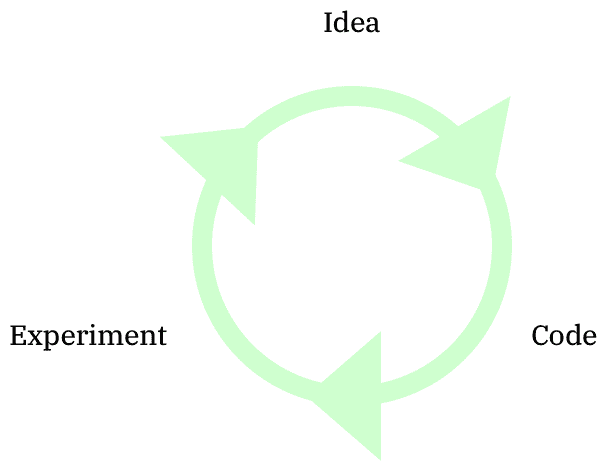
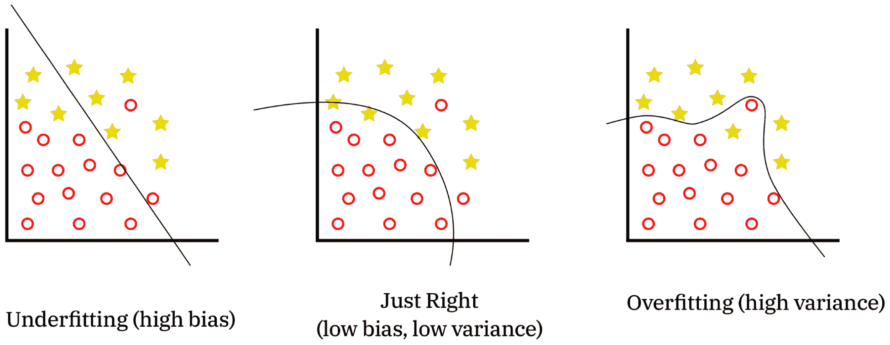
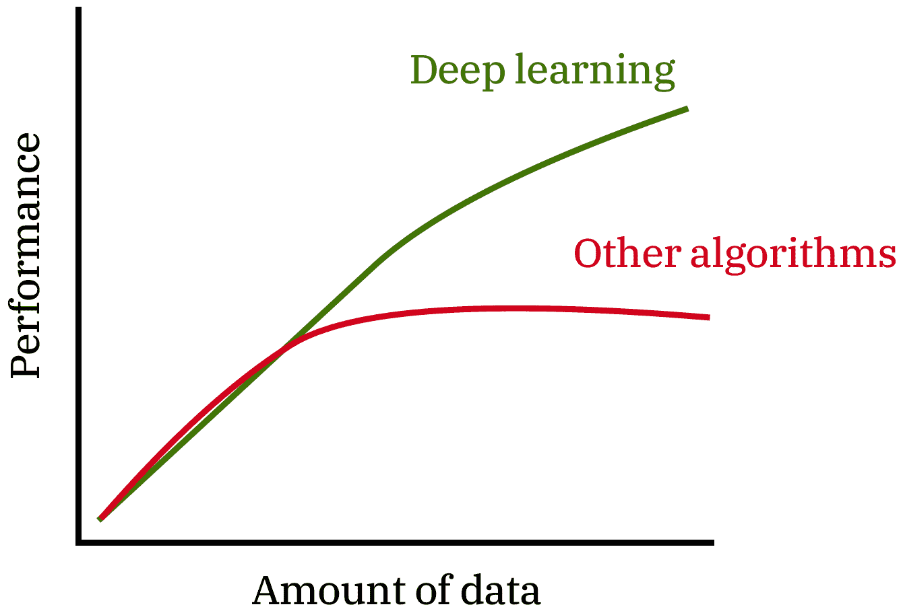
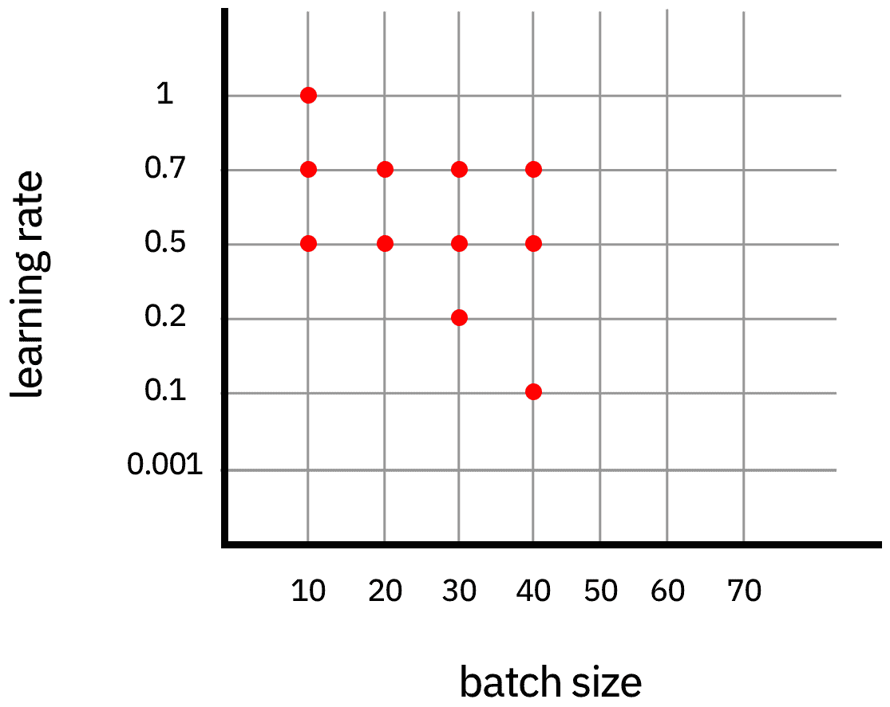
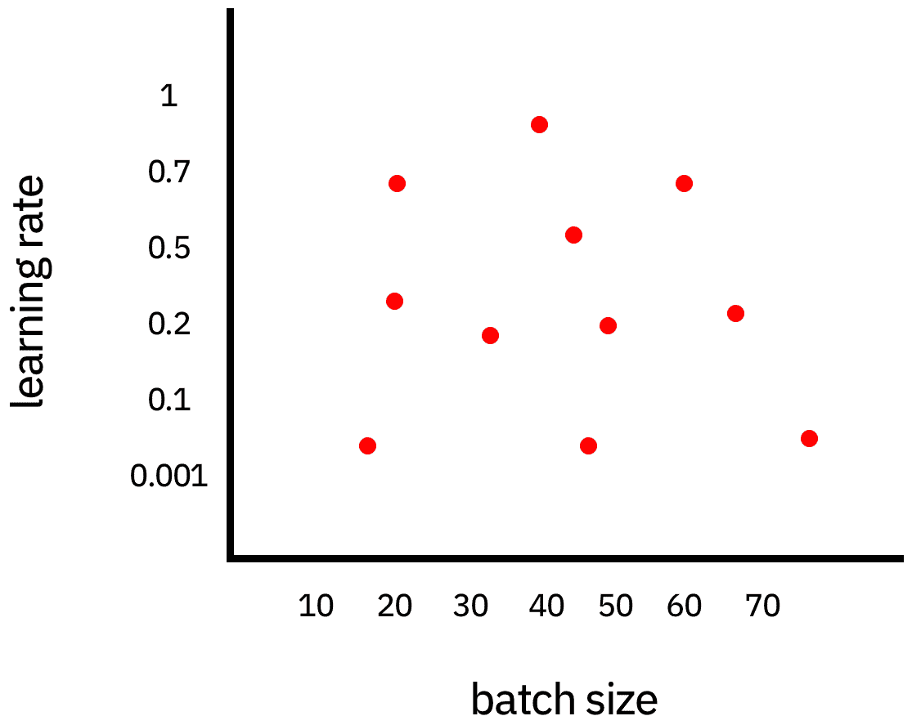
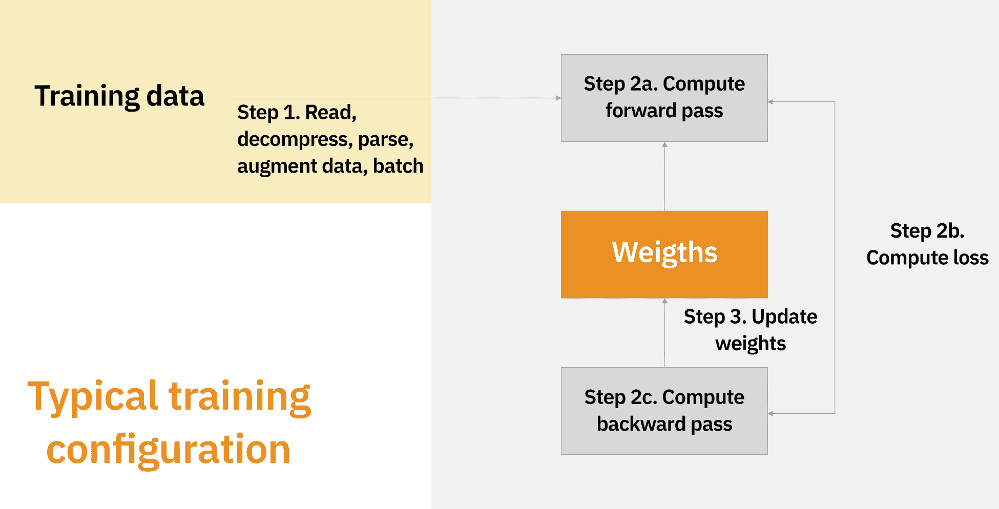

# 提高你的 RNN 性能

本章介绍了一些提高递归神经网络模型效果的技术。通常，模型的初始结果可能令人失望，因此你需要找到改善它们的方法。可以通过多种方法和工具来实现这一点，但我们将重点关注两个主要领域：

+   通过数据和调整来改善 RNN 模型性能

+   优化 TensorFlow 库以获得更好的结果

首先，我们将看到如何通过增加数据量以及调整超参数，来获得显著更好的结果。然后，我们将重点放在如何充分利用 TensorFlow 的内建功能。这两种方法适用于任何涉及神经网络模型的任务，因此，下次你想使用卷积网络进行图像识别或用 GAN 修复一个重新缩放的图像时，可以应用相同的技巧来完善你的模型。

# 改善你的 RNN 模型

在使用 RNN（或任何其他网络）解决问题时，你的过程大致如下：



首先，你提出**模型的想法**，其超参数、层数、网络的深度等。然后，**实现并训练**模型，以产生一些结果。最后，**评估**这些结果并进行必要的修改。通常情况下，你不会在第一次运行时得到有意义的结果。这个周期可能会多次发生，直到你对结果感到满意为止。

考虑到这种方法，一个重要的问题浮现出来：*我们如何改变模型，使得下一个周期产生更好的结果？*

这个问题与理解网络结果密切相关。现在让我们来讨论这个问题。

如你所知，在每次模型训练的开始，你需要准备大量优质数据。这一步应发生在上述循环的**想法**部分之前。然后，在想法阶段，你应该构思出实际的神经网络及其特征。接下来是代码阶段，在该阶段，你用数据来支持模型并进行实际训练。有一点很重要——*一旦你的数据收集完成，你需要将其分为三部分：训练（80%）、验证（10%）和测试（10%）*。

代码阶段仅使用训练部分数据。然后，实验阶段使用验证部分数据来评估模型。根据这两项操作的结果，我们将进行必要的调整。

在你完成所有必要的循环并确定模型表现良好后，你**只应**使用测试数据。测试数据将帮助你理解在未见过的数据上你得到的准确率。

在每个周期结束时，你需要评估你的模型表现如何。根据结果，你会发现你的模型总是出现**欠拟合**（**高偏差**）或**过拟合**（**高方差**）（程度不同）。你应该努力使偏差和方差都很低，这样几乎不会发生欠拟合或过拟合。下图可能帮助你更好地理解这一概念：



通过查看前面的图表，我们可以给出以下定义：

+   **欠拟合（高偏差）**：当网络没有足够地受到训练数据的影响，并且过于泛化预测时，就会发生欠拟合。

+   **恰到好处（低偏差，低方差）**：当网络能够做出高质量的预测时，无论是在训练期间，还是在测试时的通用情况下。

+   **过拟合（高方差）**：当网络受到训练数据的影响过大，并且对新输入做出错误决策时，就会发生过拟合。

前面的图表有助于理解高偏差和高方差的概念，但将这些应用到实际案例中比较困难。问题在于我们通常处理的是多于两维的数据。因此，我们将使用模型生成的损失（错误）函数值来对更高维的数据进行相同的评估。

假设我们正在评估第四章中的西班牙语到英语的翻译神经网络，*创建一个西班牙语到英语的翻译器*。我们可以假设，最小的错误率是由人类完成的，约为 1.5%。现在我们将基于我们网络可能给出的所有错误组合来评估结果：

+   训练数据误差：~2%；验证数据误差：~14%：**高方差**

+   训练数据误差：~14%；验证数据误差：~15%：**高偏差**

+   训练数据误差：~14%；验证数据误差：~30%：**高方差，高偏差**

+   训练数据误差：~2%；验证数据误差：~2.4%：**低方差，低偏差**

所期望的结果是既有低方差又有低偏差。当然，得到这种改进需要大量的时间和精力，但最终是值得的。

现在你已经熟悉了如何读取模型结果并评估模型的表现。接下来，我们来看一下如何**降低模型的方差和偏差**。

***我们如何降低方差？（解决过拟合）***

一种非常有用的方法是收集和转换更多的数据。这将使模型具有更好的泛化能力，并在训练集和验证集上都表现良好。

***我们如何降低偏差？*（解决欠拟合）***

这可以通过增加网络的深度来实现——即改变层数和隐藏单元的数量，并调整超参数。

接下来，我们将讨论这两种方法，并了解如何有效地使用它们来提高我们神经网络的性能。

# 通过数据改善性能

大量的优质数据对于任何深度学习模型的成功至关重要。可以做一个很好的比较：对于其他算法，数据量的增加并不一定能提高性能：



但这并不意味着收集更多数据总是正确的方法。例如，如果我们的模型出现了欠拟合，更多数据并不会提高性能。另一方面，解决过拟合问题可以通过使用正是这种方法来完成。

使用数据提升模型性能分为三个步骤：**选择数据**、**处理数据**和**转换数据**。需要注意的是，所有这三步应该根据你具体的问题来完成。例如，对于某些任务，如识别图像中的数字，一个格式良好的数据集很容易找到。而对于更为具体的任务（例如分析植物图像），你可能需要进行实验并做出一些非平凡的决策。

# 选择数据

这是一种相当直接的技术。你要么收集更多数据，要么发明更多的训练示例。

查找更多数据可以通过在线数据集集合来完成 ([`skymind.ai/wiki/open-datasetshttps://skymind.ai/wiki/open-datasets`](https://skymind.ai/wiki/open-datasetshttps://skymind.ai/wiki/open-datasets))。其他方法包括抓取网页，或者使用 Google 搜索的高级选项 ([`www.google.com/advanced_search`](https://www.google.com/advanced_search))。

另一方面，发明或增加数据是一个具有挑战性和复杂的问题，特别是当我们尝试生成文本或图像时。例如，最近创建了一种增强文本的新方法 ([`www.quora.com/What-data-augmentation-techniques-are-available-for-deep-learning-on-text`](https://www.quora.com/What-data-augmentation-techniques-are-available-for-deep-learning-on-text))。这个方法通过将一句英语句子翻译成另一种语言，然后再翻译回英语来完成。这样，我们得到了两句稍有不同但有意义的句子，从而大大增加和多样化了我们的数据集。另一种增强数据的有趣技术，专门针对 RNN 语言模型，可以在论文*《神经网络语言模型中的数据噪声作为平滑》*中找到 ([`arxiv.org/abs/1703.02573`](https://arxiv.org/abs/1703.02573))。

# 处理数据

在选择所需数据后，接下来是处理阶段。这可以通过以下三个步骤来完成：

+   **格式化**：这涉及将数据转换为最适合你应用的格式。例如，假设你的数据是来自成千上万的 PDF 文件中的文本。你应该提取文本并将数据转换为 CSV 格式。

+   **清理**：通常情况下，数据可能是缺失的。例如，如果你从互联网上抓取了书籍元数据，某些条目可能会缺少数据（例如 ISBN、写作日期等）。你的任务是决定是修复这些元数据还是舍弃整个书籍的元数据。

+   **采样**：使用数据集的一小部分可以减少计算时间，并在确定模型准确性时加速训练过程。

前面步骤的顺序并没有固定，你可以多次回头再做。

# 数据转换

最后，你需要使用缩放、分解和特征选择等技术来转换数据。首先，最好使用 Matplotlib（一个 Python 库）或 TensorFlow 的 TensorBoard（[`www.tensorflow.org/guide/summaries_and_tensorboard`](https://www.tensorflow.org/guide/summaries_and_tensorboard)）来绘制/可视化你的数据。

*缩放*是一种将每个条目转换为特定范围内（0-1）的数字，而不降低其有效性的技术。通常，缩放是在激活函数的范围内完成的。如果你使用的是 sigmoid 激活函数，请将数据缩放到 0 到 1 之间的值。如果使用的是双曲正切（tanh）激活函数，则将数据缩放到-1 到 1 之间的值。这适用于输入（x）和输出（y）。

*分解*是一种将某些特征分解为其组件并使用它们的技术。例如，特征“时间”可能包含分钟和小时，但我们只关心分钟。

*特征选择*是构建模型时最重要的决策之一。选择最合适特征的一个很好的教程是 Jason Brownlee 的*特征选择简介*（[`machinelearningmastery.com/an-introduction-to-feature-selection/`](https://machinelearningmastery.com/an-introduction-to-feature-selection/)）。

数据的处理和转换可以使用众多 Python 库来实现，例如 NumPy 等。这些工具在数据处理时非常有用。

在完成所有前面的步骤（可能需要多次操作）之后，你可以继续构建你的神经网络模型。

# 通过调优提高性能

在选择、处理和转换数据之后，是时候进行第二次优化技术——超参数调优。这种方法是构建模型中最重要的组成部分之一，你需要花时间将其执行得当。

每个神经网络模型都有参数和超参数。这是两个不同的值集合。参数是模型在训练过程中学习到的，例如权重和偏差。另一方面，超参数是预先定义的值，这些值在仔细观察后选择。在标准的递归神经网络中，超参数集合包括隐藏单元数、层数、RNN 模型类型、序列长度、批次大小、迭代次数（epoch）和学习率。

你的任务是识别所有可能组合中的最佳选择，以使网络表现得相当好。这是一个相当具有挑战性的任务，通常需要大量时间（几个小时、几天甚至几个月）和计算能力。

根据 Andrew Ng 关于超参数调优的教程（[`www.coursera.org/lecture/deep-neural-network/hyperparameters-tuning-in-practice-pandas-vs-caviar-DHNcc`](https://www.coursera.org/lecture/deep-neural-network/hyperparameters-tuning-in-practice-pandas-vs-caviar-DHNcc)），我们可以将此过程分为两种不同的技术：*Pandas*与*Caviar*。

*Pandas*方法遵循熊猫（即动物）养育后代的方式。我们用一组特定的参数初始化模型，然后在每次训练操作后改进这些值，直到取得令人满意的结果。如果你缺乏计算能力或多 GPU 来同时训练神经网络，这种方法是理想的选择。

*Caviar*方法遵循鱼类繁殖的方式。我们同时引入多个模型（使用不同的参数集），并在训练的同时追踪结果。这种技术可能需要更多的计算能力。

现在问题变成了：*我们如何决定哪些内容应包含在超参数集内？*

总结一篇关于超参数优化的精彩文章（[`neupy.com/2016/12/17/hyperparameter_optimization_for_neural_networks.html#tree-structured-parzen-estimators-tpe`](http://neupy.com/2016/12/17/hyperparameter_optimization_for_neural_networks.html#tree-structured-parzen-estimators-tpe)），我们可以定义五种调优方法：

+   **网格搜索**

+   **随机搜索**

+   **手动调优**

+   **贝叶斯优化**

+   **树结构 Parzen 估计器**（**TPE**）

在深度学习之旅的初期阶段，你主要会使用网格搜索、随机搜索和手动调优。后两种技术在理解和实施上更为复杂。我们将在接下来的部分讨论这两种方法，但请记住，对于简单的任务，你可以选择正常的手动调优。

# 网格搜索

这是找到合适超参数的最直接方法。它遵循以下图表中的方法：



在这里，我们生成所有可能的超参数值组合，并进行单独的训练周期。对于小型神经网络来说，这种方法可行，但对于更复杂的任务来说则不切实际。这就是为什么我们应该使用以下部分列出的更好的方法。

# 随机搜索

这种技术类似于网格搜索。你可以参考这里的图表：



我们不是考虑所有可能的组合，而是随机抽取一小部分值，并用这些值来训练模型。如果我们发现某一组位置接近的点表现较好，我们可以更仔细地检查这个区域，并专注于它。

# 手动调优

更大的网络通常需要更多的训练时间。这就是为什么前述方法不适用于这种情况。在这些情况下，我们通常使用手动调优技术。其理念是初步尝试一组值，然后评估性能。之后，我们的直觉和学习经验可能会引导我们提出一系列特定的修改步骤。我们进行这些调整，并学到新的东西。经过若干次迭代，我们对未来改进所需的变动有了充分的理解。

# 贝叶斯优化

这种方法是一种无需手动确定不同值的超参数学习方式。它使用高斯过程，利用一组先前评估过的参数及其结果精度，对未观察到的参数做出假设。一个采集函数利用这些信息来建议下一组参数。更多信息，我建议观看 Hinton 教授的讲座，*超参数的贝叶斯优化*（[`www.youtube.com/watch?v=cWQDeB9WqvU`](https://www.youtube.com/watch?v=cWQDeB9WqvU)）。

# 树状帕尔岑估计器（TPE）

这种方法背后的理念是，在每次迭代中，TPE 会收集新的观察结果，迭代结束时，算法会决定应该尝试哪一组参数。更多信息，我建议阅读这篇精彩的文章，*神经网络超参数优化*（[`neupy.com/2016/12/17/hyperparameter_optimization_for_neural_networks.html#tree-structured-parzen-estimators-tpe`](http://neupy.com/2016/12/17/hyperparameter_optimization_for_neural_networks.html#tree-structured-parzen-estimators-tpe)）。

# 优化 TensorFlow 库

本节主要关注可以直接在代码中实现的实用建议。TensorFlow 团队提供了一套庞大的工具集，可以用来提高你的性能。这些技术正在不断更新，以取得更好的结果。我强烈推荐观看 TensorFlow 2018 年大会上的训练性能视频（[`www.youtube.com/watch?v=SxOsJPaxHME`](https://www.youtube.com/watch?v=SxOsJPaxHME)）。此视频附带了精心整理的文档，也是必读之物（[`www.tensorflow.org/performance/`](https://www.tensorflow.org/performance/)）。

现在，让我们更详细地探讨如何实现更快、更可靠的训练。

首先，我们从 TensorFlow 提供的插图开始，展示了训练神经网络的总体步骤。你可以将这个过程分为三个阶段：**数据处理**、**执行训练**和**优化梯度**：

1.  **数据处理** **(第 1 步)**：此阶段包括获取数据（本地或来自网络）并将其转化为符合我们需求的格式。这些转换可能包括数据增强、批处理等。通常，这些操作是在**CPU**上执行的。

1.  **执行训练（第 2a、2b 和 2c 步）**：此阶段包括在训练期间进行前向传播计算，这需要一个特定的神经网络模型——LSTM、GPU，或者在我们这个案例中是基础的 RNN。这些操作使用强大的**GPU**和**TPU**。

1.  **优化梯度（第 3 步）**：此阶段包括最小化损失函数以优化权重的过程。这个操作同样是在**GRU**和**TPU**上执行的。

这张图展示了上述步骤：



接下来，让我们解释如何改进这些步骤。

# 数据处理

你需要检查数据加载和转换是否成为性能瓶颈。你可以通过几种方法来进行检查，其中一些方法包括估算执行这些任务所需的时间，并跟踪 CPU 使用情况。

一旦你确定这些操作会降低模型的性能，就该应用一些有效的技巧来加速这一过程。

如我们所说，这些操作（数据加载和转换）应该在 CPU 上执行，而不是 GPU 上，这样你就可以为训练腾出 GPU。为确保这一点，可以按照以下方式包装你的代码：

```py
with tf.device('/cpu:0'):
    # call a function that fetches and transforms the data
    final_data = fetch_and_process_data()
```

然后，你需要专注于数据的加载（获取）和转换过程。

# 改进数据加载

TensorFlow 团队一直在努力使这一过程尽可能简单，提供了`tf.data` API（[`www.tensorflow.org/performance/performance_guide`](https://www.tensorflow.org/performance/performance_guide)），其效果非常好。要了解更多内容并学习如何高效使用它，我推荐观看 TensorFlow 关于`tf.data`的演讲（[`www.youtube.com/watch?v=uIcqeP7MFH0`](https://www.youtube.com/watch?v=uIcqeP7MFH0)）。在此之前，你所看到的标准`feed_dict`方法应该始终被替代。

# 改善数据转换

数据转换可以有不同的形式，例如裁剪图像、分割文本、渲染和批处理文件。TensorFlow 为这些技术提供了解决方案。例如，如果你在训练前裁剪图像，最好使用`tf.image.decode_and_crop_jpeg`，该函数只解码图像中需要的部分。另一个可以优化的地方是批处理过程。TensorFlow 库提供了两种方法：

```py
batch_normalization = tf.layers.batch_normalization(input_layer, fused=True, data_format='NCHW')
```

第二种方法如下：

```py
batch_normalizaton = tf.contrib.layers.batch_norm(input_layer, fused=True, data_format='NCHW')
```

让我们澄清一下这些行：

+   批量归一化是对神经网络模型进行的一种操作，目的是加速训练过程。有关更多细节，请参阅这篇精彩的文章，*神经网络中的批量归一化*：[`towardsdatascience.com/batch-normalization-in-neural-networks-1ac91516821c`](https://towardsdatascience.com/batch-normalization-in-neural-networks-1ac91516821c)。

+   `fused`参数指示该方法是否应将执行批量归一化所需的多个操作合并为一个内核。

+   `data_format`参数指的是传递给某个操作（如求和、除法、训练等）的张量的结构。可以在 TensorFlow 性能指南中的*数据格式*部分找到一个很好的解释（[`www.tensorflow.org/performance/`](https://www.tensorflow.org/performance/)）。

# 执行训练

现在，让我们进入训练阶段。在这里，我们使用 TensorFlow 内置的函数来初始化递归神经网络单元，并使用预处理过的数据计算它们的权重。

根据你的情况，优化训练的不同技术可能更合适：

+   对于小型和实验性的模型，你可以使用`tf.nn.rnn_cell.BasicLSTMCell`。不幸的是，这种方法效率低下，并且比以下优化版本占用更多的内存。因此，除非你只是做实验，否则**不**推荐使用它。

+   上述代码的优化版本是`tf.contrib.rnn.LSTMBlockFusedCell`。当你无法使用 GPU 或 TPU，并且想要运行更高效的单元时，应使用此方法。

+   最佳的单元集可以在`tf.contrib.cudnn_rnn.*`下找到（例如，GPU 单元的`CuddnnCompatibleGPUCell`等）。这些方法在 GPU 上进行了高度优化，比前面的那些方法性能更好。

最后，你应该始终使用 `tf.nn.dynamic_rnn` 进行训练（参见 TensorFlow 文档：[`www.tensorflow.org/api_docs/python/tf/nn/dynamic_rnn`](https://www.tensorflow.org/api_docs/python/tf/nn/dynamic_rnn)）并传递特定的单元。此方法通过偶尔在 GPU 和 CPU 之间交换内存，优化了递归神经网络的训练，从而使得训练大型序列成为可能。

# 优化梯度

最后一种优化技巧实际上会提升我们反向传播算法的性能。回顾前几章，你在训练过程中要通过调整模型的权重和偏差来最小化损失函数。通过不同的内置 TensorFlow 优化器（如 `tf.train.AdamOptimizer` 和 `tf.train.GradientDescentOptimizer`）可以实现这些权重和偏差的调整（优化）。

TensorFlow 提供了通过此代码在多个 TPU 上分布处理的能力：

```py
optimizer = tf.contrib.tpu.CrossShardOptimizer(existing_optimizer)
```

在这里，`existing_optimizer = tf.train.AdamOptimizer()`，你的训练步骤将如下所示：`train_step = optimizer.minimize(loss)`。

# 总结

在本章中，我们讨论了许多优化模型性能的新颖且令人兴奋的方法，既有通用的策略，也有特别使用 TensorFlow 库的优化方法。

第一部分介绍了通过选择、处理和转换数据，以及调优超参数来提升 RNN 性能的技巧。你还学习了如何更深入地理解模型，现在你知道该怎么做才能让模型表现得更好。

第二部分专门聚焦于使用内置的 TensorFlow 函数以提升模型性能的实际方法。TensorFlow 团队旨在通过提供分布式环境和优化技术，让你可以通过少量代码快速实现想要的结果。

将本章中介绍的两种技巧结合起来，将有助于你在深度学习领域的知识，并且让你能够在不担心性能问题的情况下，尝试更复杂的模型。你获得的知识适用于任何神经网络模型，因此你可以自信地将相同的技术应用于更广泛的问题集。

# 外部链接

+   开源数据集收集：[`skymind.ai/wiki/open-datasets`](https://skymind.ai/wiki/open-datasets) 或 awesome-public-datasets GitHub 仓库：[`github.com/awesomedata/awesome-public-datasets`](https://github.com/awesomedata/awesome-public-datasets)

+   谷歌高级搜索：[`www.google.com/advanced_search`](https://www.google.com/advanced_search)

+   文本增强：[`www.quora.com/What-data-augmentation-techniques-are-available-for-deep-learning-on-text`](https://www.quora.com/What-data-augmentation-techniques-are-available-for-deep-learning-on-text)

+   数据噪声化作为神经网络语言模型中的平滑处理：[`arxiv.org/abs/1703.02573`](https://arxiv.org/abs/1703.02573)

+   TensorBoard：[`www.tensorflow.org/guide/summaries_and_tensorboard`](https://www.tensorflow.org/guide/summaries_and_tensorboard)

+   特征选择简介：[`machinelearningmastery.com/an-introduction-to-feature-selection/`](https://machinelearningmastery.com/an-introduction-to-feature-selection/)

+   Andrew Ng 的超参数调优课程：[`www.coursera.org/lecture/deep-neural-network/hyperparameters-tuning-in-practice-pandas-vs-caviar-DHNcc`](https://www.coursera.org/lecture/deep-neural-network/hyperparameters-tuning-in-practice-pandas-vs-caviar-DHNcc)

+   神经网络的超参数优化：[`neupy.com/2016/12/17/hyperparameter_optimization_for_neural_networks.html#tree-structured-parzen-estimators-tpe`](http://neupy.com/2016/12/17/hyperparameter_optimization_for_neural_networks.html#tree-structured-parzen-estimators-tpe)

+   超参数的贝叶斯优化：[`www.youtube.com/watch?v=cWQDeB9WqvU`](https://www.youtube.com/watch?v=cWQDeB9WqvU)

+   训练性能（TensorFlow Summit 2018）：[`www.youtube.com/watch?v=SxOsJPaxHME`](https://www.youtube.com/watch?v=SxOsJPaxHME)

+   TensorFlow 性能指南：[`www.tensorflow.org/performance/`](https://www.tensorflow.org/performance/)

+   tf.data API：[`www.tensorflow.org/performance/performance_guide`](https://www.tensorflow.org/performance/performance_guide)

+   `tf.data`（TensorFlow Summit 2018）：[`www.youtube.com/watch?v=uIcqeP7MFH0`](https://www.youtube.com/watch?v=uIcqeP7MFH0)

+   神经网络中的批量归一化：[`towardsdatascience.com/batch-normalization-in-neural-networks-1ac91516821c`](https://towardsdatascience.com/batch-normalization-in-neural-networks-1ac91516821c)
