# 使用 TF-IDF 进行自然语言处理

本章将涉及以下内容：

+   下载治疗机器人会话文本数据集

+   分析治疗机器人会话数据集

+   可视化数据集中的词频

+   计算文本的情感分析

+   从文本中去除停用词

+   训练 TF-IDF 模型

+   评估 TF-IDF 模型性能

+   将模型性能与基准分数进行比较

# 介绍

**自然语言处理**（**NLP**）最近在新闻中频繁出现，如果你问五个人，你可能会得到十个不同的定义。最近，NLP 被用来帮助识别互联网上的机器人或水军，这些人试图传播假新闻，甚至更糟，像网络欺凌这样的战术。事实上，最近在西班牙发生了一起案件，一名学生在社交媒体账号上遭遇网络欺凌，这对学生的健康产生了严重影响，老师们开始介入。学校联系了研究人员，他们利用 NLP 方法，如 TF-IDF，帮助识别出几个可能的网络水军来源。最终，潜在的学生名单被提交给学校，并且在对质时，实际嫌疑人承认了自己是施害者。这一故事被发表在题为《*监督式机器学习用于 Twitter 社交网络中水军档案的检测：应用于一起真实的网络欺凌案例*》的论文中，作者为 Patxi Galan-García、Jose Gaviria de la Puerta、Carlos Laorden Gomez、Igor Santos 和 Pablo García Bringas。

本文重点介绍了利用多种方法分析文本并开发类人语言处理的能力。正是这种方法论将自然语言处理（NLP）融入到机器学习、深度学习和人工智能中。让机器能够理解文本数据并从中做出可能的决策，是自然语言处理的核心。用于自然语言处理的算法有很多，如下所示：

+   TF-IDF

+   Word2Vec

+   N-grams

+   潜在狄利克雷分配（LDA）

+   长短期记忆（LSTM）

本章将重点讨论一个包含个体与在线治疗网站上的聊天机器人对话的数据集。该聊天机器人的目的是识别需要立即转交给个体而不是继续与聊天机器人讨论的对话。最终，我们将重点使用 TF-IDF 算法对数据集进行文本分析，以确定聊天对话是否需要被分类为需要升级给个体处理的情况。**TF-IDF**代表**词频-逆文档频率**。这是一种常用于算法中的技术，用于识别一个单词在文档中的重要性。此外，TF-IDF 特别容易计算，尤其是在处理文档中的高词汇量时，并且能够衡量一个词的独特性。在处理聊天机器人数据时，这一点非常有用。主要目标是快速识别出一个独特的词，触发升级到个体的处理，从而提供即时支持。

# 下载治疗机器人会话文本数据集

本节将重点介绍下载和设置将用于本章自然语言处理（NLP）的数据集。

# 准备工作

本章使用的数据集基于治疗机器人与在线治疗网站访客之间的互动。它包含 100 次互动，每次互动都被标记为`escalate`或`do_not_escalate`。如果讨论需要更严肃的对话，机器人将标记讨论为`escalate`，转交给个体处理。否则，机器人将继续与用户讨论。

# 它是如何工作的……

本节将介绍下载聊天机器人数据集的步骤。

1.  通过以下 GitHub 仓库访问数据集：[`github.com/asherif844/ApacheSparkDeepLearningCookbook/tree/master/CH07/data`](https://github.com/asherif844/ApacheSparkDeepLearningCookbook/tree/master/CH07/data)

1.  到达仓库后，右键点击下图所示的文件：

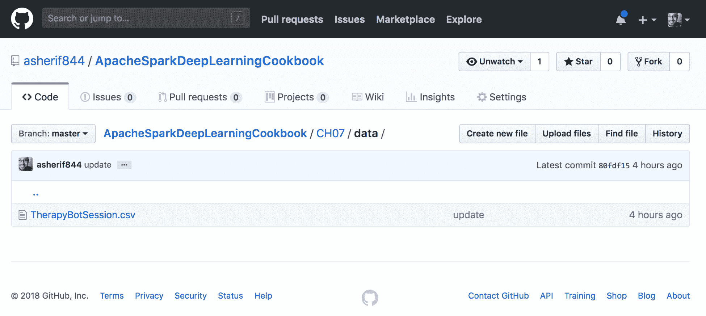

1.  下载`TherapyBotSession.csv`并保存到与 Jupyter 笔记本`SparkSession`相同的本地目录中。

1.  通过 Jupyter 笔记本使用以下脚本访问数据集，以构建名为`spark`的`SparkSession`，并将数据集分配给 Spark 中的一个数据框（dataframe），名为`df`：

```py
spark = SparkSession.builder \
        .master("local") \
        .appName("Natural Language Processing") \
        .config("spark.executor.memory", "6gb") \
        .getOrCreate()
df = spark.read.format('com.databricks.spark.csv')\
     .options(header='true', inferschema='true')\
     .load('TherapyBotSession.csv')  
```

# 如何操作……

本节解释了聊天机器人数据如何进入我们的 Jupyter 笔记本。

1.  可以通过点击仓库中的 TherapyBotSession.csv 查看数据集的内容，如下图所示：

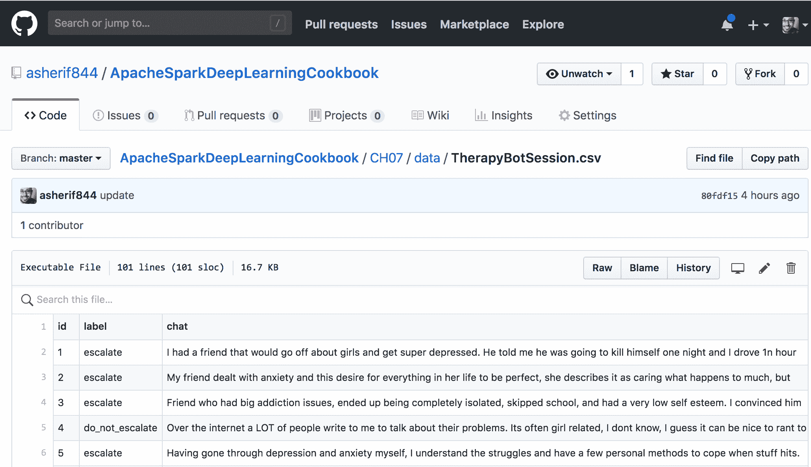

1.  一旦数据集下载完成，它就可以上传并转换成数据框`df`。可以通过执行`df.show()`来查看数据框，如下图所示：

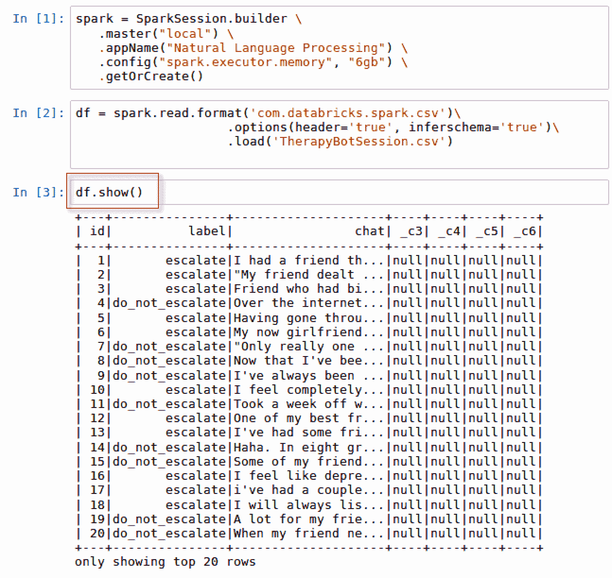

1.  数据框中有 3 个主要字段是我们特别关注的：

    1.  `id`：每次访客与网站聊天机器人之间交易的唯一 ID。

    1.  `label`：由于这是一个监督学习方法，我们已经知道我们试图预测的结果，因此每笔交易已被分类为`escalate`或`do_not_escalate`。这个字段将在建模过程中使用，用来训练文本识别哪些单词会被归类为这两种情况之一。

    1.  `chat`：最后，我们有网站访客的`chat`文本，模型将对其进行分类。

# 还有更多...

数据框`df`有一些额外的列，`_c3`、`_c4`、`_c5`和`_c6`，这些列在模型中不会使用，因此可以使用以下脚本将其从数据集中排除：

```py
df = df.select('id', 'label', 'chat')
df.show()
```

脚本的输出可以在下图中看到：

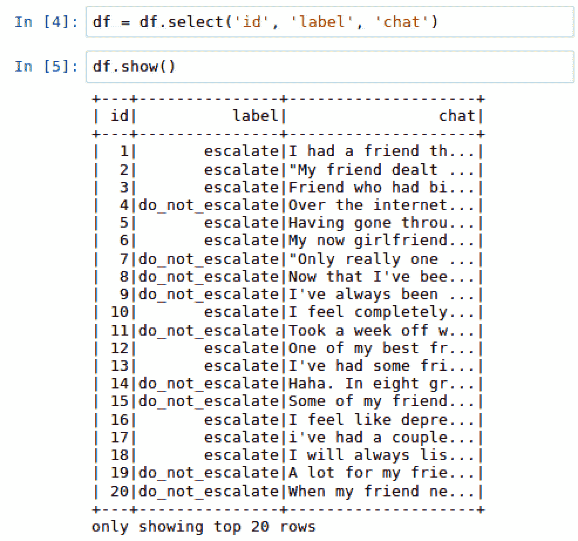

# 分析治疗机器人会话数据集

在对数据集应用模型之前，首先分析数据集总是很重要的。

# 准备工作

本节需要从`pyspark.sql`导入`functions`，以便在我们的数据框上执行。

```py
import pyspark.sql.functions as F
```

# 如何操作...

以下部分将演示如何对文本数据进行剖析。

1.  执行以下脚本以对`label`列进行分组并生成计数分布：

```py
df.groupBy("label") \
   .count() \
   .orderBy("count", ascending = False) \
   .show()
```

1.  使用以下脚本将一个新列`word_count`添加到数据框`df`中：

```py
import pyspark.sql.functions as F
df = df.withColumn('word_count', F.size(F.split(F.col('response_text'),' ')))
```

1.  使用以下脚本按`label`聚合平均单词数，`avg_word_count`：

```py
df.groupBy('label')\
  .agg(F.avg('word_count').alias('avg_word_count'))\
  .orderBy('avg_word_count', ascending = False) \
  .show()
```

# 它是如何工作的...

以下部分解释了通过分析文本数据获得的反馈。

1.  收集跨多行的数据并按维度对结果进行分组是非常有用的。在这种情况下，维度是`label`。使用`df.groupby()`函数来衡量按`label`分布的 100 次治疗交易的计数。我们可以看到，`do_not_escalate`与`escalate`的比例为`65`:`35`，如下图所示：

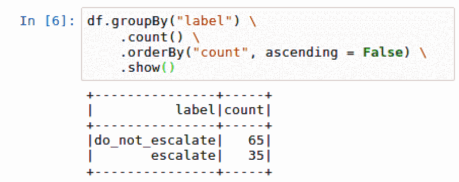

1.  创建了一个新的列，`word_count`，用于计算聊天机器人与在线访客之间 100 次交易中使用的单词数量。新创建的列`word_count`可以在下图中看到：

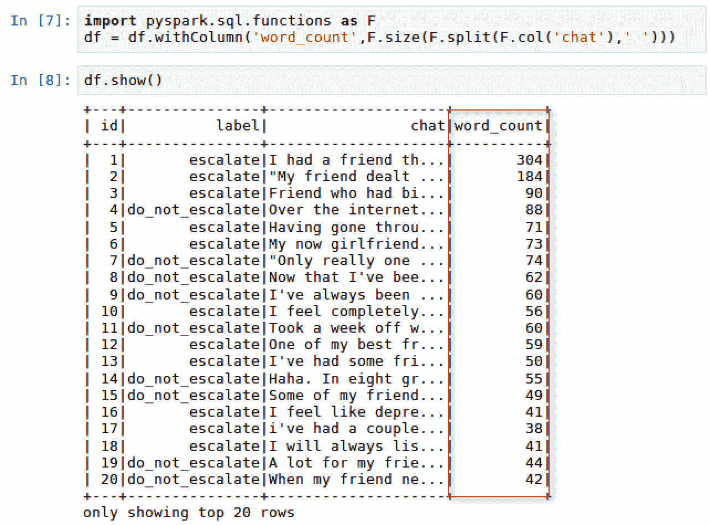

1.  由于`word_count`现已添加到数据框中，可以对其进行聚合，按`label`计算平均单词数。完成此操作后，我们可以看到，`escalate`会话的平均长度是`do_not_escalate`会话的两倍多，如下图所示：


# 可视化数据集中的单词计数

一张图片胜过千言万语，本节将证明这一点。不幸的是，从版本 2.2 开始，Spark 没有任何内建的绘图能力。为了在数据框中绘制值，我们必须转换为`pandas`。

# 准备工作

本节需要导入`matplotlib`用于绘图：

```py
import matplotlib.pyplot as plt
%matplotlib inline
```

# 如何操作...

本部分详细说明了如何将 Spark 数据框转换为可在 Jupyter notebook 中查看的可视化图表。

1.  使用以下脚本将 Spark 数据框转换为 `pandas` 数据框：

```py
df_plot = df.select('id', 'word_count').toPandas()
```

1.  使用以下脚本绘制数据框：

```py
import matplotlib.pyplot as plt
%matplotlib inline

df_plot.set_index('id', inplace=True)
df_plot.plot(kind='bar', figsize=(16, 6))
plt.ylabel('Word Count')
plt.title('Word Count distribution')
plt.show()
```

# 它是如何工作的...

本部分解释了如何将 Spark 数据框转换为 `pandas`，然后进行绘制。

1.  Spark 数据框的一个子集被收集并使用 Spark 中的 `toPandas()` 方法转换为 `pandas`。

1.  然后使用 matplotlib 绘制该数据子集，将 y 值设置为 `word_count`，将 x 值设置为 `id`，如下图所示：

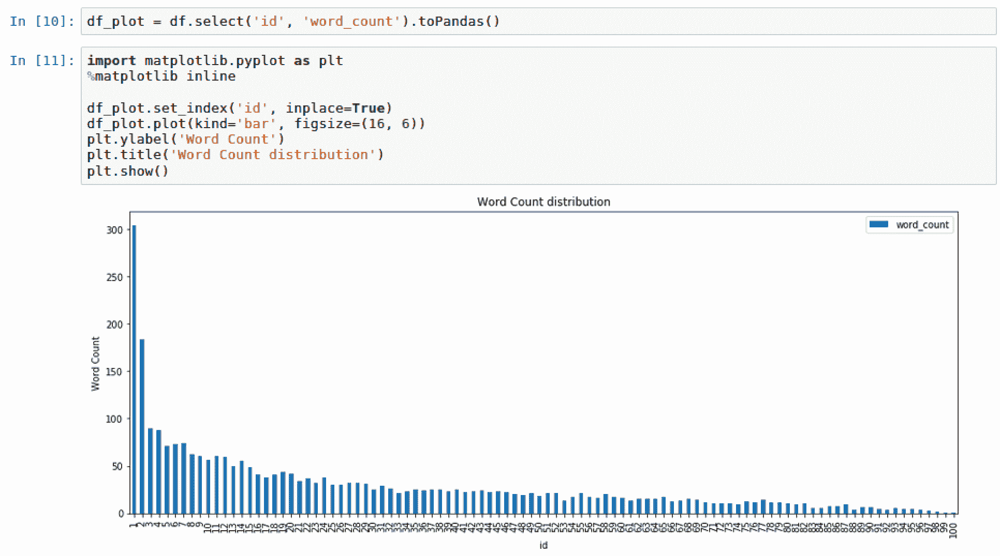

# 另见

除了 `matplotlib` 之外，Python 还有其他绘图库，如 `bokeh`、`plotly` 和 `seaborn`。

要了解更多关于 `bokeh` 的信息，请访问以下网站：

[`bokeh.pydata.org/en/latest/`](https://bokeh.pydata.org/en/latest/)

要了解更多关于 `plotly` 的信息，请访问以下网站：

[`plot.ly/`](https://plot.ly/)

要了解更多关于 `seaborn` 的信息，请访问以下网站：

[`seaborn.pydata.org/`](https://seaborn.pydata.org/)

# 计算文本的情感分析

情感分析是从单词或一系列单词中提取语气和情感的能力。本部分将利用 Python 中的技术计算数据集中 100 个事务的情感分析得分。

# 准备工作

本部分将需要使用 PySpark 中的函数和数据类型。此外，我们还将导入用于情感分析的 `TextBlob` 库。为了在 PySpark 中使用 SQL 和数据类型函数，必须导入以下内容：

```py
from pyspark.sql.types import FloatType 
```

此外，为了使用 `TextBlob`，必须导入以下库：

```py
from textblob import TextBlob
```

# 如何实现...

以下部分将详细介绍如何将情感评分应用于数据集。

1.  使用以下脚本创建一个情感评分函数 `sentiment_score`：

```py
from textblob import TextBlob
def sentiment_score(chat):
    return TextBlob(chat).sentiment.polarity
```

1.  使用以下脚本将 `sentiment_score` 应用于数据框中的每个对话回复：

1.  创建一个名为 `sentiment_score_udf` 的 `lambda` 函数，将 `sentiment_score` 映射到 Spark 中的用户定义函数 `udf`，并指定输出类型为 `FloatType()`，如下脚本所示：

```py
from pyspark.sql.types import FloatType
sentiment_score_udf = F.udf(lambda x: sentiment_score(x), FloatType())
```

1.  如下脚本所示，将函数 `sentiment_score_udf` 应用于数据框中的每个 `chat` 列：

```py
df = df.select('id', 'label', 'chat','word_count',
                   sentiment_score_udf('chat').alias('sentiment_score'))
```

1.  使用以下脚本按 `label` 计算平均情感得分 `avg_sentiment_score`：

```py
df.groupBy('label')\
     .agg(F.avg('sentiment_score').alias('avg_sentiment_score'))\
     .orderBy('avg_sentiment_score', ascending = False) \
     .show()
```

# 它是如何工作的...

本部分解释了如何将 Python 函数转换为 Spark 中的用户定义函数 `udf`，以便将情感分析得分应用于数据框中的每一列。

1.  `Textblob` 是一个 Python 中的情感分析库。它可以通过一个名为 `sentiment.polarity` 的方法计算情感得分，得分范围为 -1（非常负面）到 +1（非常正面），0 则表示中立。此外，`Textblob` 还可以衡量主观性，范围从 0（非常客观）到 1（非常主观）；不过，本章不会涉及主观性测量。

1.  将 Python 函数应用到 Spark 数据框有几个步骤：

    1.  `Textblob` 被导入，并且对 `chat` 列应用了一个名为 `sentiment_score` 的函数，以生成每个聊天对话的情感极性，结果会生成一个新的列，亦称为 `sentiment_score`。

    1.  在 Spark 数据框上直接应用 Python 函数之前，必须首先通过 Spark 中的用户自定义函数转换 `udf`。

    1.  此外，函数的输出也必须明确声明，无论是整数还是浮动数据类型。在我们的例子中，我们明确声明函数的输出将使用来自 `pyspark.sql.types` 的 `FloatType()`。最后，情感得分会通过 `lambda` 函数应用到每一行数据中，这个 `lambda` 函数是在 `udf` 中调用的，称为 `sentiment_score_udf`。

1.  可以通过执行 `df.show()` 来查看更新后的数据框，其中包含新创建的字段 `sentiment_score`，如下所示的屏幕截图：


1.  现在已经计算出了每个聊天对话的 `sentiment_score`，我们可以为每一行的情感极性指定一个从 -1（非常负面）到 +1（非常正面）的数值范围。就像我们处理词汇计数和平均词数一样，我们可以比较 `escalate` 对话和 `do_not_escalate` 对话的情感得分，看看它们是否有显著差异。我们可以按 `label` 计算一个平均情感得分 `avg_sentiment_score`，如下所示的屏幕截图：


1.  初步推测，`escalate` 的对话情感极性得分应该比 `do_not_escalate` 更负面。但实际上我们发现，`escalate` 的情感极性比 `do_not_escalate` 稍微正面一些；然而，二者的情感极性都相当中立，接近 0。

# 另见

要了解更多关于 `TextBlob` 库的信息，请访问以下网站：

[`textblob.readthedocs.io/en/dev/`](http://textblob.readthedocs.io/en/dev/)

# 从文本中去除停用词

停用词是英语中常见的单词，通常在常见的自然语言处理（NLP）技术中被移除，因为它们可能会干扰分析。常见的停用词包括如 *the* 或 *and* 这样的词。

# 准备工作

本节需要导入以下库：

```py
from pyspark.ml.feature import StopWordsRemover 
from pyspark.ml import Pipeline
```

# 如何操作...

本节将演示如何去除停用词。

1.  执行以下脚本，将 `chat` 中的每个词提取到一个数组中的字符串：

```py
df = df.withColumn('words',F.split(F.col('chat'),' '))
```

1.  将一组常见的词语分配给一个变量 `stop_words`，并使用以下脚本将其视为停用词：

```py
stop_words = ['i','me','my','myself','we','our','ours','ourselves',
'you','your','yours','yourself','yourselves','he','him',
'his','himself','she','her','hers','herself','it','its',
'itself','they','them','their','theirs','themselves',
'what','which','who','whom','this','that','these','those',
'am','is','are','was','were','be','been','being','have',
'has','had','having','do','does','did','doing','a','an',
'the','and','but','if','or','because','as','until','while',
'of','at','by','for','with','about','against','between',
'into','through','during','before','after','above','below',
'to','from','up','down','in','out','on','off','over','under',
'again','further','then','once','here','there','when','where',
'why','how','all','any','both','each','few','more','most',
'other','some','such','no','nor','not','only','own','same',
'so','than','too','very','can','will','just','don','should','now']
```

1.  执行以下脚本来从 PySpark 导入 `StopWordsRemover` 函数，并配置输入和输出列 `words` 和 `word without stop`：

```py
from pyspark.ml.feature import StopWordsRemover 

stopwordsRemovalFeature = StopWordsRemover(inputCol="words", 
                   outputCol="words without stop").setStopWords(stop_words)
```

1.  执行以下脚本导入管道并定义停用词转换过程的 `阶段`，这些将应用到数据框：

```py
from pyspark.ml import Pipeline

stopWordRemovalPipeline = Pipeline(stages=[stopwordsRemovalFeature])
pipelineFitRemoveStopWords = stopWordRemovalPipeline.fit(df)
```

1.  最后，使用以下脚本将停用词移除转换 `pipelineFitRemoveStopWords` 应用到数据框 `df`：

```py
df = pipelineFitRemoveStopWords.transform(df)
```

# 它是如何工作的...

本节解释了如何从文本中删除停用词。

1.  正如我们在对 `chat` 数据进行分析和探索时所做的那样，我们也可以调整 `chat` 对话的文本，将每个词分割成一个单独的数组。这将用于隔离停用词并将其移除。

1.  提取的每个词作为字符串的新列称为 `words`，可以在以下截图中看到：

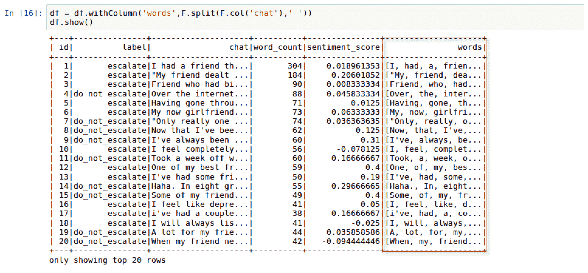

1.  有多种方法可以将一组词汇分配给停用词列表。这些词汇中的一些可以通过一个名为 `nltk` 的 Python 库自动下载和更新，`nltk` 代表自然语言工具包。为了我们的目的，我们将利用一个包含 124 个常见停用词的列表来生成我们自己的列表。额外的词汇可以轻松地手动添加或删除。

1.  停用词对文本没有任何价值，因此会通过指定 `outputCol="words without stop"` 从新创建的列中删除。此外，通过指定 `inputCol = "words"` 来设置作为转换源的列。

1.  我们创建了一个管道 `stopWordRemovalPipeline`，用来定义将转换数据的步骤或 `阶段` 序列。在这种情况下，用于转换数据的唯一阶段是特征 `stopwordsRemover`。

1.  管道中的每个阶段都可以有一个转换角色和一个估算角色。估算角色 `pipeline.fit(df)` 被调用以生成一个名为 `pipelineFitRemoveStopWords` 的转换器函数。最后，调用 `transform(df)` 函数对数据框进行转换，以生成一个新的数据框，其中包含一个名为 `words without stop` 的新列。我们可以将两个列并排比较，检查它们之间的差异，如以下截图所示：

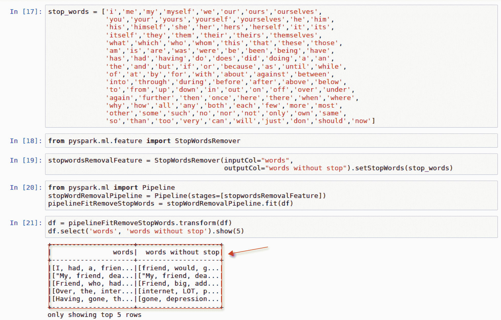

1.  新列 `words without stop` 不包含原始列 `words` 中被视为停用词的任何字符串。

# 另见：

要了解更多关于 `nltk` 停用词的信息，请访问以下网站：

[`www.nltk.org/data.html`](https://www.nltk.org/data.html)

要了解更多关于 Spark 机器学习管道的信息，请访问以下网站：

[`spark.apache.org/docs/2.2.0/ml-pipeline.html`](https://spark.apache.org/docs/2.2.0/ml-pipeline.html)

要了解更多关于 PySpark 中 `StopWordsRemover` 特征的信息，请访问以下网站：

[`spark.apache.org/docs/2.2.0/api/python/pyspark.ml.html#pyspark.ml.feature.StopWordsRemover`](https://spark.apache.org/docs/2.2.0/api/python/pyspark.ml.html#pyspark.ml.feature.StopWordsRemover)

# 训练 TF-IDF 模型

我们现在准备训练我们的 TF-IDF 自然语言处理（NLP）模型，并看看我们是否能将这些事务分类为 `escalate` 或 `do_not_escalate`。

# 准备工作

本节需要从 `spark.ml.feature` 和 `spark.ml.classification` 导入内容。

# 如何操作...

以下部分将逐步讲解训练 TF-IDF 模型的步骤。

1.  创建一个新的用户定义函数 `udf`，用以下脚本为 `label` 列定义数值：

```py
label = F.udf(lambda x: 1.0 if x == 'escalate' else 0.0, FloatType())
df = df.withColumn('label', label('label'))
```

1.  执行以下脚本，以设置词向量化的 TF 和 IDF 列：

```py
import pyspark.ml.feature as feat
TF_ = feat.HashingTF(inputCol="words without stop", 
                     outputCol="rawFeatures", numFeatures=100000)
IDF_ = feat.IDF(inputCol="rawFeatures", outputCol="features")
```

1.  设置管道 `pipelineTFIDF`，按以下脚本设置 `TF_` 和 `IDF_` 阶段的顺序：

```py
pipelineTFIDF = Pipeline(stages=[TF_, IDF_])
```

1.  使用以下脚本，将 IDF 估算器拟合并转换为数据框 `df`：

```py
pipelineFit = pipelineTFIDF.fit(df)
df = pipelineFit.transform(df)
```

1.  使用以下脚本将数据框按 75:25 的比例拆分，以进行模型评估：

```py
(trainingDF, testDF) = df.randomSplit([0.75, 0.25], seed = 1234)
```

1.  使用以下脚本导入并配置分类模型 `LogisticRegression`：

```py
from pyspark.ml.classification import LogisticRegression
logreg = LogisticRegression(regParam=0.25)
```

1.  将逻辑回归模型 `logreg` 拟合到训练数据框 `trainingDF` 上。基于逻辑回归模型的 `transform()` 方法，会创建一个新的数据框 `predictionDF`，如下脚本所示：

```py
logregModel = logreg.fit(trainingDF)
predictionDF = logregModel.transform(testDF)
```

# 它是如何工作的...

以下部分解释了如何有效地训练一个 TF-IDF 自然语言处理模型。

1.  理想情况下，标签应以数字格式而非类别形式出现，因为模型能够解释数字值，并在 0 和 1 之间进行输出分类。因此，`label` 列下的所有标签都会转换为数值形式的 `label`，其值为 0.0 或 1.0，如下图所示：

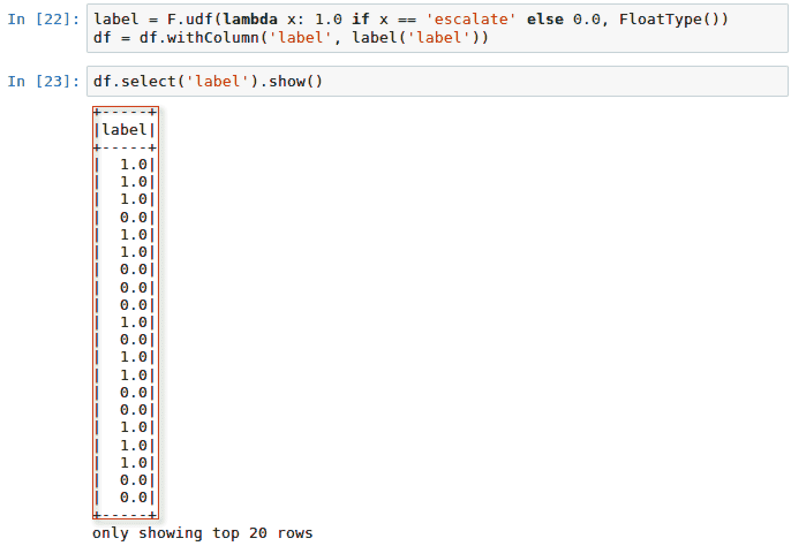

1.  TF-IDF 模型需要采用两步法，通过从 `pyspark.ml.feature` 导入 `HashingTF` 和 `IDF` 来处理不同的任务。第一步仅涉及导入 `HashingTF` 和 `IDF`，并为输入和输出列分配相应的值。`numfeatures` 参数被设置为 100,000，以确保它大于数据框中不同词汇的数量。如果 `numfeatures` 小于词汇的不同数量，模型将不准确。

1.  如前所述，管道的每个步骤都包含转换过程和估算过程。管道 `pipelineTFIDF` 被配置为顺序排列各个步骤，其中 `IDF` 将紧随 `HashingTF`。

1.  `HashingTF` 用于将“去除停用词后的词汇”转换为向量，存储在一个新的列 `rawFeatures` 中。随后，`rawFeatures` 会被 `IDF` 处理，以估算大小并拟合数据框，生成一个新的列 `features`，如下图所示：

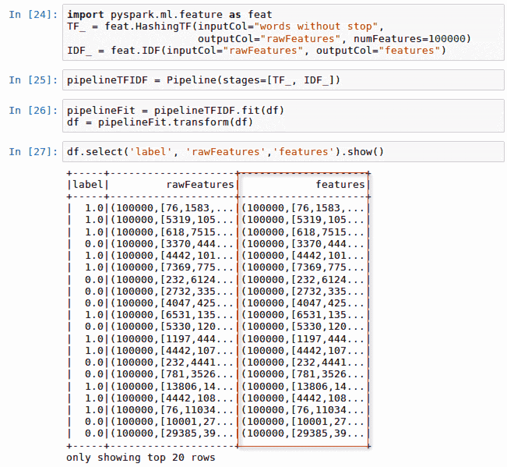

1.  为了进行训练，我们的数据框将以 `75`:`25` 的比例保守地拆分，并且随机种子设置为 `1234`。

1.  由于我们的主要目标是将每个对话分类为 `escalate`（升级）或 `do_not_escalate`（继续与机器人对话），因此我们可以使用传统的分类算法，如来自 PySpark 库的逻辑回归模型。逻辑回归模型配置了一个正则化参数 `regParam`，其值为 0.025。我们使用该参数通过在稍微增加偏差的情况下最小化过拟合，从而稍微改善模型。

1.  逻辑回归模型在 `trainingDF` 上训练并拟合，然后创建一个新的数据框 `predictionDF`，其中包含新转换的字段 `prediction`，如以下截图所示：

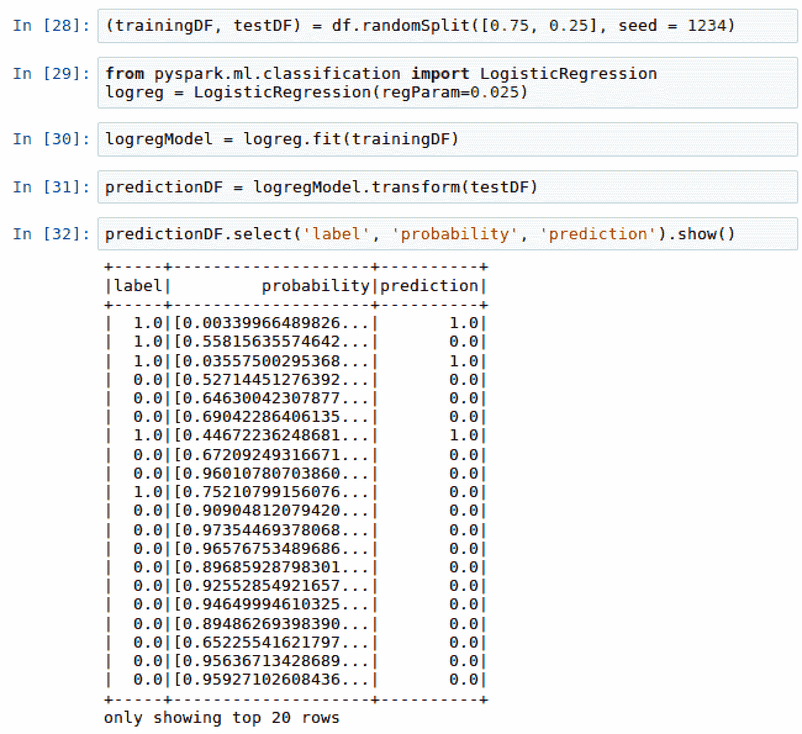

# 还有更多...

虽然我们确实使用了用户定义函数 `udf` 来手动创建数值标签列，但我们也可以使用 PySpark 中的内置特性 `StringIndexer` 来为分类标签分配数值。要查看 `StringIndexer` 的实际操作，请访问 第五章，*使用 Spark ML 预测消防部门电话*。

# 另见

要了解更多关于 PySpark 中的 TF-IDF 模型，请访问以下网站：

[`spark.apache.org/docs/latest/mllib-feature-extraction.html#tf-idf`](https://spark.apache.org/docs/latest/mllib-feature-extraction.html#tf-idf)

# 评估 TF-IDF 模型性能

此时，我们准备好评估模型的性能

# 准备工作

本节需要导入以下库：

+   `metrics` 来自 `sklearn`

+   来自 `pyspark.ml.evaluation` 的 `BinaryClassificationEvaluator`

# 如何执行...

本节介绍了评估 TF-IDF NLP 模型的步骤。

1.  使用以下脚本创建混淆矩阵：

```py
predictionDF.crosstab('label', 'prediction').show()
```

1.  使用来自 sklearn 的 `metrics` 评估模型，使用以下脚本：

```py
from sklearn import metrics

actual = predictionDF.select('label').toPandas()
predicted = predictionDF.select('prediction').toPandas()
print('accuracy score: {}%'.format(round(metrics.accuracy_score(actual,         predicted),3)*100))
```

1.  使用以下脚本计算 ROC 分数：

```py
from pyspark.ml.evaluation import BinaryClassificationEvaluator

scores = predictionDF.select('label', 'rawPrediction')
evaluator = BinaryClassificationEvaluator()
print('The ROC score is {}%'.format(round(evaluator.evaluate(scores),3)*100))
```

# 它是如何工作的...

本节解释了我们如何使用评估计算来确定模型的准确性。

1.  混淆矩阵有助于快速总结实际结果和预测结果之间的准确性。由于我们使用了 75:25 的拆分，因此应该从我们的训练数据集中看到 25 个预测结果。我们可以使用以下脚本来构建混淆矩阵：`predictionDF.crosstab('label', 'prediction').show()`。脚本的输出可以在以下截图中看到：


1.  我们现在处于评估模型准确性的阶段，通过将 `prediction` 值与实际的 `label` 值进行比较。`sklearn.metrics` 接受两个参数，分别是与 `label` 列关联的 `actual`（实际）值和从逻辑回归模型中得出的 `predicted`（预测）值。

请注意，我们再次使用 `toPandas()` 方法将 Spark 数据框的列值转换为 Pandas 数据框。

1.  创建了两个变量，`actual`和`predicted`，并使用`metrics.accuracy_score()`函数计算了 91.7%的准确率，如下截图所示：


1.  ROC（接收者操作特征）通常与测量真阳性率与假阳性率之间的曲线相关。曲线下的面积越大越好。与曲线相关的 ROC 得分是另一个可以用来衡量模型性能的指标。我们可以使用`BinaryClassificationEvaluator`计算`ROC`，如以下截图所示：


# 另见

要了解更多关于 PySpark 中`BinaryClassificationEvaluator`的信息，请访问以下网站：

[`spark.apache.org/docs/2.2.0/api/java/index.html?org/apache/spark/ml/evaluation/BinaryClassificationEvaluator.html`](https://spark.apache.org/docs/2.2.0/api/java/index.html?org/apache/spark/ml/evaluation/BinaryClassificationEvaluator.html)

# 将模型性能与基准得分进行比较

虽然我们的模型准确率为 91.7%，这已经是很棒的结果，但与基准得分进行比较同样重要。本节将深入探讨这个概念。

# 如何做到这一点...

本节详细介绍了计算基准准确率的步骤。

1.  执行以下脚本以从`describe()`方法中检索平均值：

```py
predictionDF.describe('label').show()
```

1.  通过减去`1 - 平均值得分`来计算基准准确率。

# 它是如何工作的...

本节解释了基准准确率背后的概念，以及如何利用它来理解我们模型的效果。

1.  如果每个`chat`对话都被标记为`do_not_escalate`，反之亦然，会不会使我们的基准准确率超过 91.7%？找出这个问题最简单的方法是运行`predictionDF`的`label`列上的`describe()`方法，使用以下脚本：`predictionDF.describe('label').show()`

1.  脚本的输出可以在下方的截图中看到：

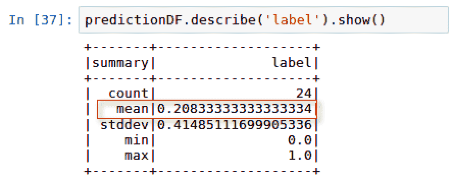

1.  `label`的平均值为 0.2083，约为 21%，这意味着`label`为 1 的情况仅占 21%。因此，如果我们将每个对话标记为`do_not_escalate`，我们将大约 79%的时间是正确的，这比我们模型的准确率 91.7%还低。

1.  因此，我们可以说我们的模型表现优于盲目基准性能模型。

# 另见

要了解有关 PySpark 数据框中`describe()`方法的更多信息，请访问以下网站：

[`spark.apache.org/docs/2.2.0/api/python/pyspark.sql.html#pyspark.sql.DataFrame.describe`](http://spark.apache.org/docs/2.2.0/api/python/pyspark.sql.html#pyspark.sql.DataFrame.describe)
