# 使用深度卷积网络进行面部识别

在本章中，我们将涵盖以下几个教程：

+   下载并将 MIT-CBCL 数据集加载到内存中

+   从目录中绘制和可视化图像

+   图像预处理

+   模型构建、训练和分析

# 介绍

在当今世界，信息安全的维护变得越来越重要，同时也越来越困难。有多种方法可以加强这种安全性（如密码、指纹识别、PIN 码等）。然而，在使用方便性、准确性和低干扰性方面，面部识别算法表现非常出色。随着高速计算的普及和深度卷积网络的发展，这些算法的鲁棒性得到了进一步提高。它们已经发展得如此先进，以至于现在在许多电子设备（例如 iPhoneX）甚至银行应用中作为主要的安全特性。 本章的目标是开发一个稳健的、对姿势不变的面部识别算法，用于安全系统。在本章中，我们将使用公开提供的`MIT-CBCL`数据集，其中包含 10 个不同主题的面部图像。

# 下载并将 MIT-CBCL 数据集加载到内存中

在这个教程中，我们将了解如何下载 MIT-CBCL 数据集并将其加载到内存中。

随着到 2025 年预计价值达到 150 亿美元，生物识别行业正准备迎来前所未有的增长。一些用于生物识别认证的生理特征包括指纹、DNA、面部、视网膜或耳朵特征以及声音。虽然 DNA 认证和指纹技术已经相当先进，但面部识别也带来了其独特的优势。

由于深度学习模型的最新发展，使用便捷性和鲁棒性是面部识别算法如此受欢迎的驱动因素之一。

# 准备工作

以下关键点需要在此教程中考虑：

+   `MIT-CBCL` 数据集包含 3,240 张图片（每个主题 324 张图片）。在我们的模型中，我们将安排数据增强，以提高模型的鲁棒性。我们将采用诸如平移、旋转、缩放和剪切等技术来获得这些增强数据。

+   我们将使用 20%的数据集来测试我们的模型（648 张图片），通过从数据集中随机选择这些图片。类似地，我们随机选择数据集中 80%的图片，并将其作为我们的训练数据集（2,592 张图片）。

+   最大的挑战是将图像裁剪成完全相同的大小，以便可以输入神经网络。

+   众所周知，当所有输入图像的大小相同时，设计网络要容易得多。然而，由于这些图像中的一些主题有侧面或旋转/倾斜的侧面，我们必须调整我们的网络以接受不同大小的输入图像。

# 如何实现...

步骤如下。

1.  通过访问 FACE RECOGNITION HOMEPAGE 下载 `MIT-CBCL` 数据集，其中包含多个用于人脸识别实验的数据库。以下提供了该主页的链接及截图：

    [`www.face-rec.org/databases/`](http://www.face-rec.org/databases/):

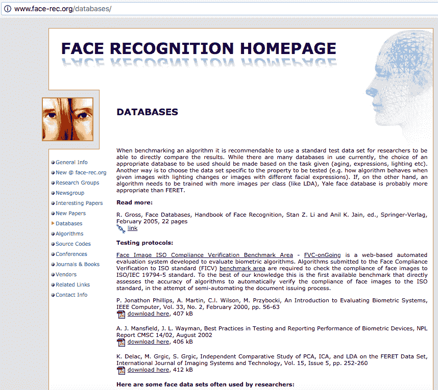

1.  导航到名为 MIT-CBCL 人脸识别数据库的链接并点击，如下图所示：

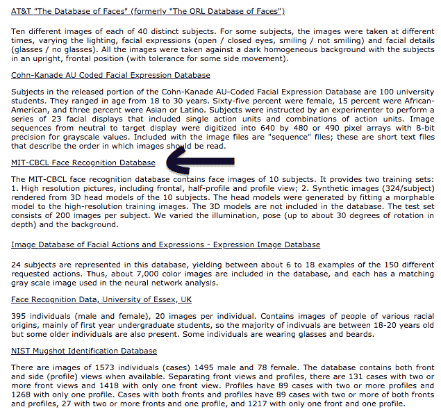

1.  一旦点击它，您将进入一个许可页面，您需要接受许可协议并继续前往下载页面。在下载页面，点击 `download now`，下载一个约 116 MB 的 zip 文件。然后解压该文件到工作目录中。

# 它是如何工作的...

功能如下：

1.  许可协议要求在任何项目中使用该数据库时进行适当引用。该数据库由麻省理工学院的研究团队开发。

1.  特此感谢麻省理工学院以及生物与计算学习中心提供的人脸图像数据库。许可协议还要求提及论文标题 *Component-based Face Recognition with 3D Morphable Models, First IEEE Workshop on Face Processing in Video,* Washington, D.C., 2004, B. Weyrauch, J. Huang, B. Heisele, 和 V. Blanz。

1.  以下截图描述了许可协议以及下载数据集的链接：

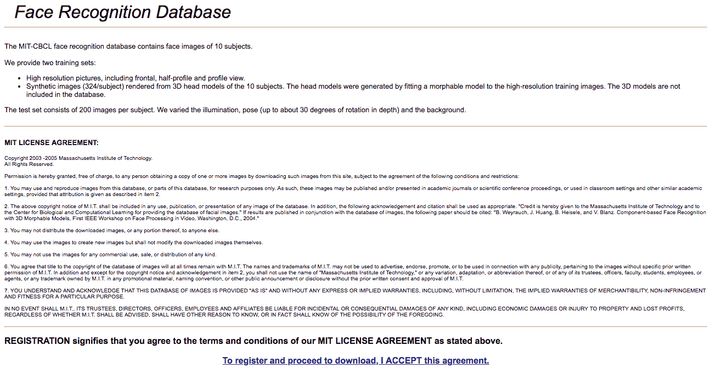

人脸识别数据库主页

1.  下载并解压数据集后，您将看到一个名为 MIT-CBCL-facerec-database 的文件夹。

1.  对于本章内容，我们只使用 **`training-synthetic`** 文件夹中的图像，该文件夹包含所有 3,240 张图像，如下图所示：

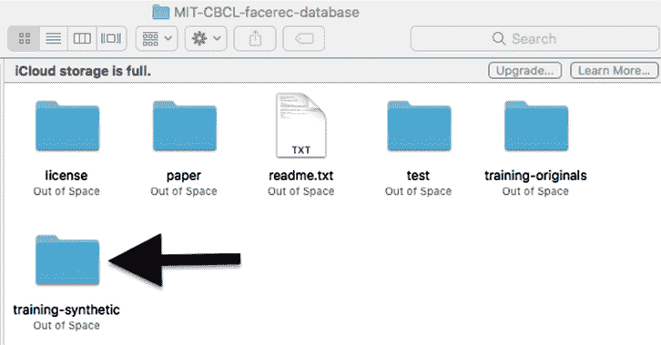

# 还有更多内容...

本章内容中，您需要通过 Python 导入以下库：

+   `os`

+   `matplotlib`

+   `numpy`

+   `keras`

+   `TensorFlow`

本章的以下部分将处理导入必要的库以及在构建神经网络模型并将其加载之前对图像进行预处理。

# 另见

有关本章中使用的包的完整信息，请访问以下链接：

+   [`matplotlib.org/`](https://matplotlib.org/)

+   [`docs.python.org/2/library/os.html`](https://docs.python.org/2/library/os.html)

+   [`www.tensorflow.org/get_started/`](https://www.tensorflow.org/get_started/)

+   [`keras.io/layers/about-keras-layers/`](https://keras.io/layers/about-keras-layers/)

+   [`docs.scipy.org/doc/numpy-1.9.1/reference/`](https://docs.scipy.org/doc/numpy-1.9.1/reference/)

# 从目录中绘制和可视化图像

本节将描述如何在图像被预处理并输入神经网络进行训练之前，读取和可视化下载的图像。这是本章的重要步骤，因为需要可视化图像，以便更好地理解图像的大小，从而准确裁剪去除背景，仅保留必要的面部特征。

# 准备工作

在开始之前，完成导入必要库和函数的初始设置，并设置工作目录的路径。

# 如何操作...

步骤如下：

1.  使用以下代码行下载所需的库。输出应该显示一行 `Using TensorFlow backend`，如接下来的截图所示：

```py
%matplotlib inline
from os import listdir
from os.path import isfile, join
import matplotlib.pyplot as plt
import matplotlib.image as mpimg
import numpy as np
from keras.models import Sequential
from keras.layers import Dense, Dropout, Activation, Flatten, Conv2D
from keras.optimizers import Adam
from keras.layers.normalization import BatchNormalization
from keras.utils import np_utils
from keras.layers import MaxPooling2D
from keras.preprocessing.image import ImageDataGenerator
```

库的导入如图所示：

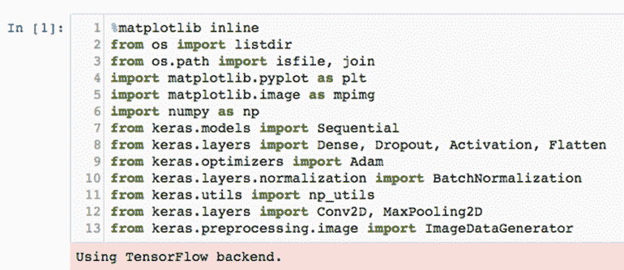

1.  打印并设置当前工作目录，如下图所示。在我们的例子中，桌面被设置为工作目录：

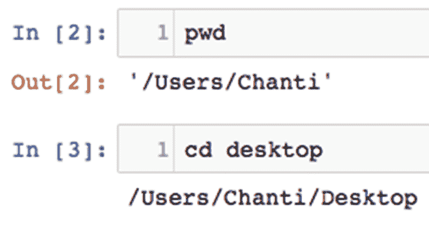

1.  使用下图所示的命令，直接从文件夹中读取所有图像：


1.  使用 `plt.imshow(images[])` 命令打印数据集中的一些随机图像，如下图所示，以便更好地了解图像中的面部轮廓。这也有助于了解图像的大小，后续步骤中需要用到：

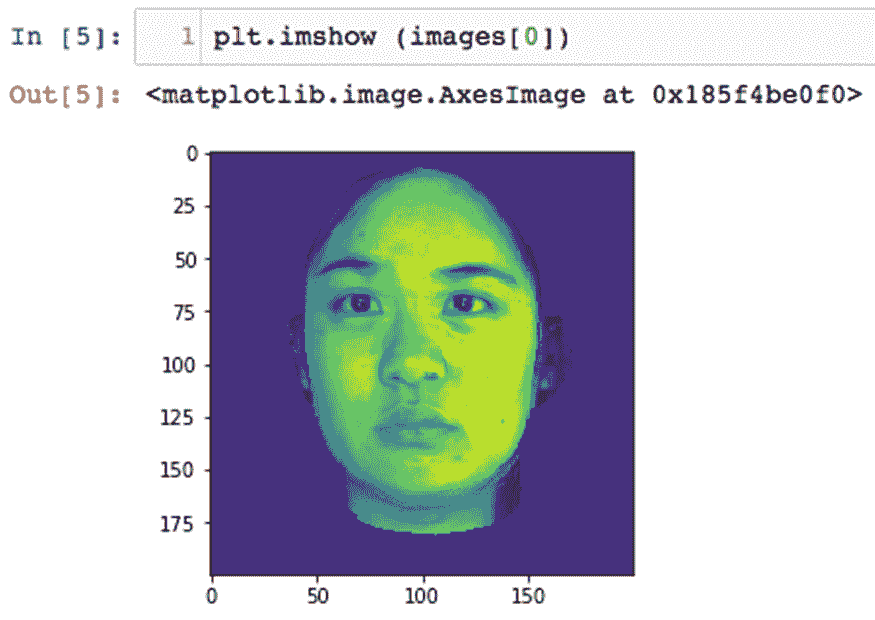

1.  这里展示的是来自第一张图片的不同测试对象的图像。

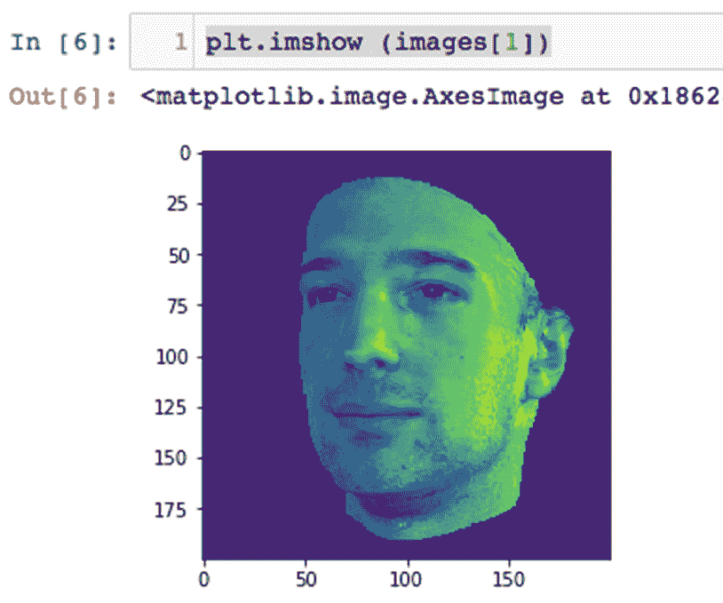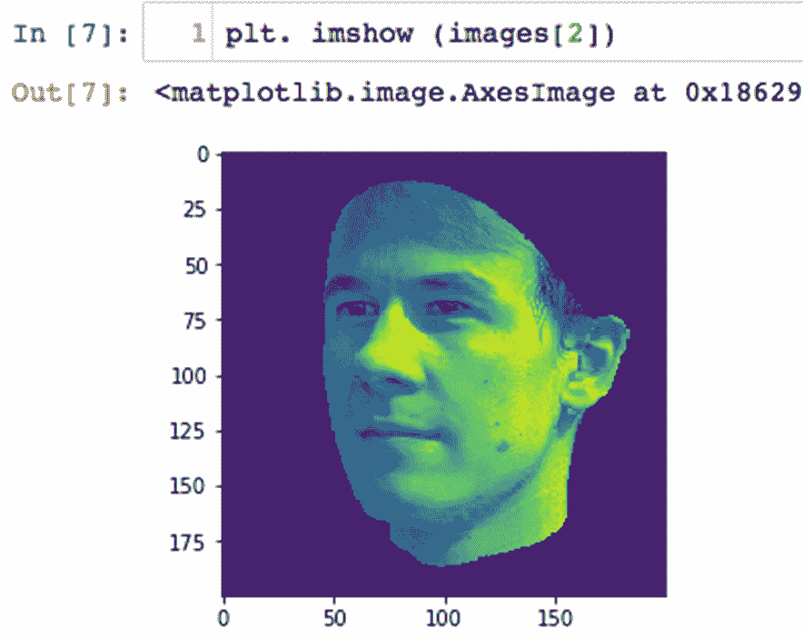

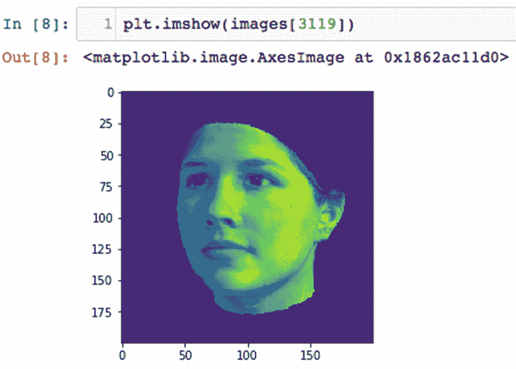

# 工作原理...

功能如下：

1.  `mypath` 变量设置了读取所有文件的路径。在这一步中，指定了 `training-synthetic` 文件夹，因为本章将只使用该文件夹中的文件。

1.  `onlyfiles` 变量用于计算在前一步提供的文件夹路径下的所有文件，通过遍历文件夹中的所有文件。这将在下一步中用于读取和存储图像。

1.  `images` 变量用于创建一个大小为 3,240 的空数组，用于存储图像，这些图像的大小为 200 x 200 像素。

1.  接下来，通过在 for 循环中使用 `onlyfiles` 变量作为参数遍历所有文件，读取文件夹中包含的每个图像，并使用 `matplotlib.image` 函数将其存储到之前定义的 `images` 数组中。

1.  最后，通过指定不同的图像索引打印随机选择的图像时，您会注意到每张图像是一个 200 x 200 像素的数组，每个主体可能正面朝向，或者在左右两侧之间旋转零至十五度。

# 还有更多内容...

以下几点需要注意：

+   这个数据库的一个有趣特征是，每个文件名的第四个数字描述了该图像中的主体。

+   图像的名称是唯一的，第四个数字表示该图像中的个人。两个图像名称的例子是`0001_-4_0_0_60_45_1.pgm`和`0006_-24_0_0_0_75_15_1.pgm`。可以很容易地理解，第四个数字分别代表第二个和第七个个体。

+   我们需要为后续预测存储这些信息。这将帮助神经网络在训练时知道它正在学习哪个主体的面部特征。

+   每个图像的文件名可以读入一个数组中，并且通过以下代码行，可以将十个主体分开：

```py
y =np.empty([3240,1],dtype=int)
for x in range(0, len(onlyfiles)):
    if onlyfiles[x][3]=='0': y[x]=0
    elif onlyfiles[x][3]=='1': y[x]=1
    elif onlyfiles[x][3]=='2': y[x]=2
    elif onlyfiles[x][3]=='3': y[x]=3
    elif onlyfiles[x][3]=='4': y[x]=4
    elif onlyfiles[x][3]=='5': y[x]=5
    elif onlyfiles[x][3]=='6': y[x]=6
    elif onlyfiles[x][3]=='7': y[x]=7
    elif onlyfiles[x][3]=='8': y[x]=8
    elif onlyfiles[x][3]=='9': y[x]=9
```

+   上述代码将初始化一个大小为 3,240 的空一维`numpy`数组（`training-synthetic`文件夹中的图像数量），并通过循环遍历整个文件集，将相关的主体存储在不同的数组中。

+   `if`语句基本上是在检查每个文件名中的第四个数字，并将该数字存储在已初始化的`numpy`数组中。

+   以下截图显示了 iPython 笔记本中的输出：

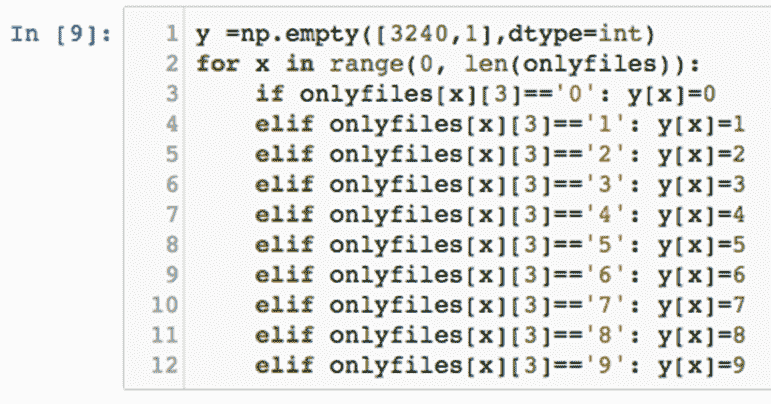

# 另见

以下博客描述了一种在 Python 中裁剪图像的方法，可以用于图像预处理，这在接下来的章节中会用到：

+   [`www.blog.pythonlibrary.org/2017/10/03/how-to-crop-a-photo-with-python/`](https://www.blog.pythonlibrary.org/2017/10/03/how-to-crop-a-photo-with-python/)

关于 Adam 优化器及其使用案例的更多信息，可以通过访问以下链接找到：

+   [`www.tensorflow.org/api_docs/python/tf/train/AdamOptimizer`](https://www.tensorflow.org/api_docs/python/tf/train/AdamOptimizer)

+   [`arxiv.org/abs/1412.6980`](https://arxiv.org/abs/1412.6980)

+   [`www.coursera.org/lecture/deep-neural-network/adam-optimization-algorithm-w9VCZ`](https://www.coursera.org/lecture/deep-neural-network/adam-optimization-algorithm-w9VCZ)

# 图像预处理

在上一节中，您可能已经注意到，并非所有图像都是面部的正面视图，还有些略微旋转的侧面轮廓。您可能还注意到每张图像中有些不必要的背景区域需要去除。本节将描述如何预处理和处理图像，使其准备好输入到网络中进行训练。

# 准备就绪

请考虑以下内容：

+   有许多算法被设计用来裁剪图像的显著部分；例如，SIFT、LBP、Haar-cascade 滤波器等等。

+   然而，我们将通过一个非常简单的朴素代码来解决这个问题，从图像中裁剪出面部部分。这是这个算法的一大创新。

+   我们发现不必要的背景部分的像素强度为 28。

+   记住，每个图像都是一个 200 x 200 像素的三通道矩阵。这意味着每个图像包含三个矩阵或张量，分别代表红色、绿色和蓝色的像素，强度范围从 0 到 255。

+   因此，我们将丢弃任何包含仅为 28 的像素强度的图像的行或列。

+   我们还将确保在裁剪操作后，所有图像都具有相同的像素大小，以实现卷积神经网络的最高并行化能力。

# 如何实现...

步骤如下：

1.  定义`crop()`函数来裁剪图像，只保留显著部分，如以下代码所示：

```py
 #function for cropping images to obtain only the significant part
 def crop(img):
      a=28*np.ones(len(img)) 
      b=np.where((img== a).all(axis=1)) 
      img=np.delete(img,(b),0) 
      plt.imshow(img)
      img=img.transpose()
      d=28*np.ones(len(img[0]))
      e=np.where((img== d).all(axis=1))
      img=np.delete(img,e,0) 
      img=img.transpose()
      print(img.shape) 
      super_threshold_indices = img < 29 
      img[super_threshold_indices] = 0
      plt.imshow (img)
      return img[0:150, 0:128]
```

1.  使用以下代码行循环遍历文件夹中的每个图像，并使用前面定义的函数裁剪它：

```py
#cropping all the images
 image = np.empty([3240,150,128],dtype=int)
 for n in range(0, len(images)):
     image[n]=crop(images[n])
```

1.  接下来，随机选择一张图像并打印出来，检查它是否已经从 200 x 200 大小的图像裁剪为不同的尺寸。我们在这个案例中选择了图像 23。可以使用以下代码行完成此操作：

```py
 print (image[22])
 print (image[22].shape)
```

1.  接下来，将数据拆分为测试集和训练集，使用文件夹中的`80%`图像作为训练集，剩余的`20%`作为测试集。可以使用以下命令完成此操作：

```py
# Split data into 80/20 split for testing and training
test_ind=np.random.choice(range(3240), 648, replace=False) train_ind=np.delete(range(0,len(onlyfiles)),test_ind)
```

1.  一旦数据完成拆分，使用以下命令将训练图像和测试图像分开：

```py
 # slicing the training and test images 
 y1_train=y[train_ind]
 x_test=image[test_ind]
 y1_test=y[test_ind]
```

1.  接下来，将所有裁剪后的图像调整为 128 x 150 的大小，因为这是要输入神经网络的大小。可以使用以下命令完成此操作：

```py
#reshaping the input images
 x_train = x_train.reshape(x_train.shape[0], 128, 150, 1)
 x_test = x_test.reshape(x_test.shape[0], 128, 150, 1)
```

1.  一旦数据完成调整形状，将其转换为`float32`类型，这将使得在下一个步骤进行归一化时更容易处理。从 int 类型转换为 float32 类型可以使用以下命令：

```py
 #converting data to float32
 x_train = x_train.astype('float32')
 x_test = x_test.astype('float32')
```

1.  在重新调整形状并将数据转换为 float32 类型后，必须对其进行归一化，以便将所有值调整到相似的尺度。这是防止数据冗余的一个重要步骤。使用以下命令进行归一化：

```py
 #normalizing data
 x_train/=255
 x_test/=255
 #10 digits represent the 10 classes
 number_of_persons = 10
```

1.  最后一步是将调整形状并归一化后的图像转换为向量，因为这是神经网络能够理解的唯一输入形式。使用以下命令将图像转换为向量：

```py
 #convert data to vectors
 y_train = np_utils.to_categorical(y1_train, number_of_persons)
 y_test = np_utils.to_categorical(y1_test, number_of_persons)
```

# 它是如何工作的...

功能如下：

1.  `crop()`函数执行以下任务：

    1.  将所有强度为 28 的像素与一个全是 1 的 numpy 数组相乘，并存储在变量`a`中。

    1.  检查所有完全由像素强度为 28 的列组成的实例，并将其存储在变量`b`中。

    1.  删除所有列（或*Y*轴），如果整个列的像素强度都是 28。

    1.  绘制结果图像。

1.  1.  转置图像，以便在所有行（或*X*轴）上执行前述一系列操作。

1.  1.  将所有像素强度为 28 的像素与 1 的`numpy`数组相乘，并将其存储在变量`d`中。

    1.  检查所有实例，其中整列仅由像素强度为 28 的像素组成，并将其存储在变量`e`中。

    1.  删除所有列（来自转置图像），其中整列的像素强度为 28。

    1.  转置图像，以恢复原始图像。

    1.  打印图像的形状。

    1.  每当发现像素强度小于 29 时，将这些像素的强度替换为零，这将通过将它们变为白色来裁剪所有这些像素。

    1.  绘制结果图像。

    1.  将结果图像的尺寸调整为 150 x 128 像素。

`crop()`函数的输出，如在 Jupyter Notebook 执行期间所见，展示在以下截图中：


1.  接下来，定义的`crop()`函数将应用于`training-synthetic`文件夹中包含的所有文件，通过遍历每个文件。这将导致如下所示的输出：

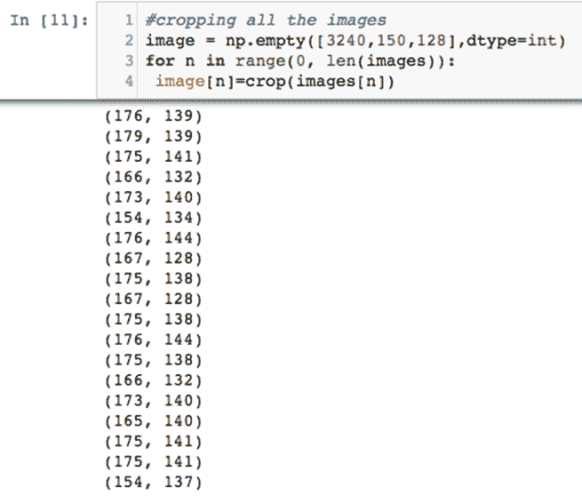

输出继续如下：

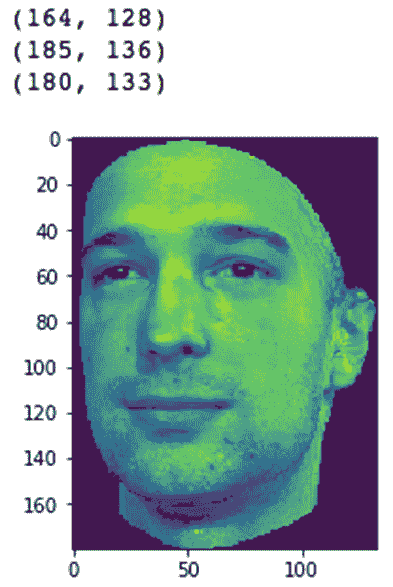

请注意，只有相关的面部特征被保留下来，所有裁剪后的图像的尺寸都小于 200 x 200，这是最初的尺寸。

1.  在打印任意图像及其形状时，你会注意到每个图像现在都已调整为 150 x 128 像素的数组，你将看到以下输出：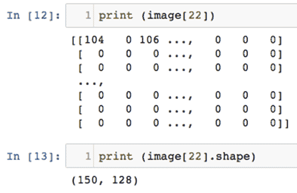

1.  将图像拆分为测试集和训练集，并将其划分为命名为`x_train`、`y1_train`、`x_test`和`y1_test`的变量，将得到以下截图所示的输出：

1.  数据的分隔如下进行：


1.  重新调整训练和测试图像的形状，并将数据类型转换为 float32，结果如以下截图所示：

# 还有更多内容...

请考虑以下内容：

+   一旦图像完成预处理，它们仍然需要标准化并转换为向量（在这种情况下是张量），然后才能输入到网络中。

+   标准化，在最简单的情况下，意味着将不同尺度上测量的值调整为一个公认的共同尺度，通常是在平均化之前。标准化数据始终是个好主意，因为它可以防止在梯度下降过程中出现梯度爆炸或消失问题，如梯度消失和爆炸问题所示。标准化还确保没有数据冗余。

+   数据归一化是通过将每张图像中的每个像素值除以`255`来完成的，因为像素值范围是从 0 到`255`。这将产生如下所示的输出：

+   接下来，使用来自`numpy_utils`的`to_categorical()`函数，将图像转换为具有十个不同类别的输入向量，如下图所示：

    

# 另见

其他资源如下：

+   有关数据归一化的更多信息，请查看以下链接：

    [`www.quora.com/What-is-normalization-in-machine-learning`](https://www.quora.com/What-is-normalization-in-machine-learning)

+   有关过拟合以及为什么数据需要分成测试集和训练集的更多信息，请访问以下链接：

    [`towardsdatascience.com/train-test-split-and-cross-validation-in-python-80b61beca4b6`](https://towardsdatascience.com/train-test-split-and-cross-validation-in-python-80b61beca4b6)

+   有关编码变量及其重要性的更多信息，请访问以下链接：

    [`pbpython.com/categorical-encoding.html`](http://pbpython.com/categorical-encoding.html)

# 模型构建、训练和分析

我们将使用`keras`库中的标准顺序模型来构建 CNN。该网络将包括三层卷积层、两层最大池化层和四层全连接层。输入层和后续的隐藏层有 16 个神经元，而最大池化层的池大小为(2,2)。四个全连接层由两层密集层、一层展平层和一层丢弃层组成。使用丢弃率 0.25 来减少过拟合问题。这个算法的另一个创新之处在于使用数据增强来对抗过拟合现象。数据增强通过旋转、平移、剪切和缩放图像到不同程度来适应模型。

`relu`函数作为输入层和隐藏层的激活函数，而`softmax`分类器则用于输出层，以根据预测输出对测试图像进行分类。

# 准备开始

将要构建的网络可以通过下图进行可视化：

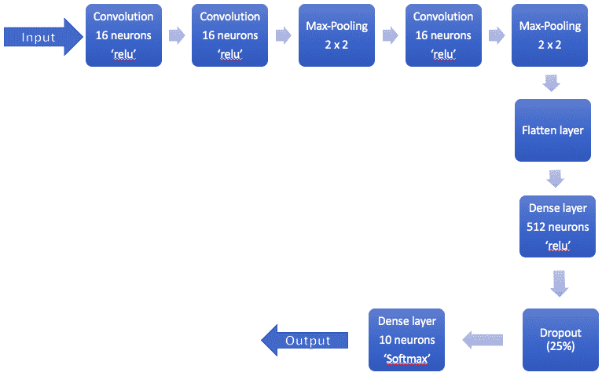

# 如何做...

步骤如下：

1.  使用以下命令，在 Keras 框架中使用`Sequential()`函数定义模型：

```py
model = Sequential()
model.add(Conv2D(16, (3, 3), input_shape=(128,150,1)))  
model.add(Activation('relu')) 
model.add(Conv2D(16, (3, 3))) 
model.add(Activation('relu'))
model.add(MaxPooling2D(pool_size=(2,2))) 
model.add(Conv2D(16,(3, 3))) 
model.add(Activation('relu'))
model.add(MaxPooling2D(pool_size=(2,2))) 
model.add(Flatten()) 

model.add(Dense(512))
model.add(Activation('relu'))
model.add(Dropout(0.25)) 
model.add(Dense(10))

model.add(Activation('softmax')) 
```

1.  打印模型的摘要，以便更好地理解模型的构建方式，并确保它按照前面的规格构建。这可以通过使用`model.summary()`命令来完成。

1.  接下来，使用以下命令编译模型：

```py
model.compile(loss='categorical_crossentropy', optimizer=Adam(), metrics=        ['accuracy'])
```

1.  为了防止过拟合并进一步提高模型的准确性，实现某种形式的数据增强。在此步骤中，图像将进行剪切、水平和垂直轴上的平移、缩放和旋转。模型学习并识别这些异常的能力将决定模型的鲁棒性。使用以下命令对数据进行增强：

```py
# data augmentation to minimize overfitting
gen = ImageDataGenerator(rotation_range=8, 
        width_shift_range=0.08, shear_range=0.3,
        height_shift_range=0.08,zoom_range=0.08)
test_gen = ImageDataGenerator()
train_generator = gen.flow(x_train, y_train, batch_size=16) 
test_generator = test_gen.flow(x_test, y_test, batch_size=16)
```

1.  最后，使用以下命令在数据增强后拟合和评估模型：

```py
model.fit_generator(train_generator, epochs=5, validation_data=test_generator)

scores = model.evaluate(x_test, y_test, verbose=0)
print("Recognition Error: %.2f%%" % (100-scores[1]*100))
```

# 它是如何工作的...

功能如下：

1.  通过使用顺序函数，定义了一个九层的卷积神经网络，每一层执行以下功能：

    1.  第一层是一个卷积层，具有 16 个神经元，并对输入张量/矩阵进行卷积。特征图的大小定义为 3 x 3 的矩阵。需要为第一层指定输入形状，因为神经网络需要知道期望的输入类型。由于所有图像已被裁剪为 128 x 150 像素的大小，因此这也将是定义第一层输入形状的标准。该层使用的激活函数是**修正线性单元**（**relu**）。

    1.  网络的第二层（第一个隐藏层）是另一个卷积层，同样包含 16 个神经元。此层的激活函数也将使用`relu`。

    1.  网络的第三层（第二个隐藏层）是一个最大池化层，池化大小为 2 x 2。该层的功能是提取通过前两层卷积学习到的所有有效特征，并减少包含所有学习到的特征的矩阵的大小。卷积不过是特征图和输入矩阵之间的矩阵乘法（在我们的例子中是图像）。形成卷积过程的结果值会被网络存储在矩阵中。这些存储值中的最大值将定义输入图像中的某个特征。最大池化层将保留这些最大值，并丢弃与之无关的特征。

    1.  网络的第四层（第三个隐藏层）是另一个卷积层，特征图大小再次为 3 x 3。该层使用的激活函数仍然是`relu`函数。

    1.  网络的第五层（第四个隐藏层）是一个最大池化层，池化大小为 2 x 2。

    1.  网络的第六层（第五个隐藏层）是一个展平层，将包含所有学习到的特征（以数字形式存储）的矩阵转换为单行，而不是多维矩阵。

1.  1.  网络中的第七层（第六个隐藏层）是一个具有 512 个神经元的全连接层，并使用`relu`激活函数。每个神经元基本上会处理某个权重和偏置，这只是对特定图像所学习到的所有特征的表示。这样做是为了通过在全连接层上使用`softmax`分类器，轻松对图像进行分类。

    1.  网络中的第八层（第七个隐藏层）是一个丢弃层，丢弃概率为 0.25 或 25%。该层将在训练过程中随机`dropout` 25%的神经元，并通过鼓励网络使用多条替代路径来学习给定特征，从而帮助防止过拟合。

    1.  网络中的最终层是一个密集层，只有 10 个神经元和`softmax`分类器。这是第八个隐藏层，也将作为网络的输出层。

1.  定义模型后的输出应该类似以下截图：

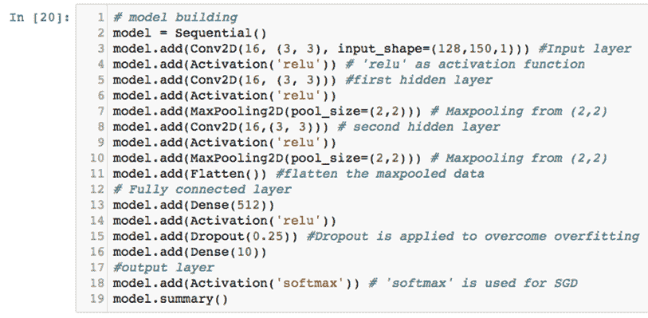

1.  打印`model.summary()`函数时，您必须看到类似以下截图的输出：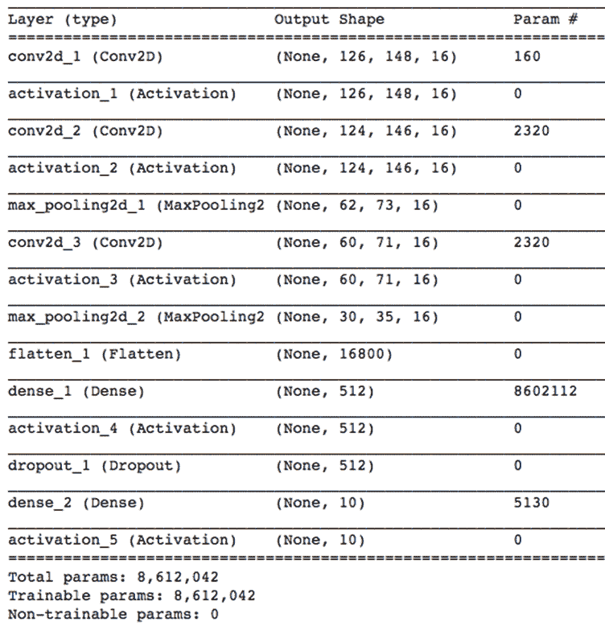

1.  该模型使用类别交叉熵（categorical crossentropy）进行编译，这是一个衡量和计算网络损失的函数，用于在层与层之间传递信息。模型将使用 Keras 框架中的`Adam()`优化器函数，该函数将基本决定网络在学习特征时如何优化权重和偏差。`model.compile()`函数的输出应该类似以下截图：


1.  由于神经网络相当密集，并且总图像数量仅为 3,240，我们设计了一种方法来防止过拟合。通过执行数据增强，从训练集生成更多图像来实现这一点。在此步骤中，图像通过`ImageDataGenerator()`函数生成。此函数将训练集和测试集作为输入，通过以下方式增强图像：

    +   旋转它们

    +   剪切它们

    +   水平平移图像，实际上就是扩宽图像

    +   在水平方向上平移图像

    +   在垂直方向上平移图像

前面的函数的输出应该类似以下截图：


1.  最后，模型在训练 5 个 epoch 后被拟合到数据并评估。我们得到的输出如以下截图所示：

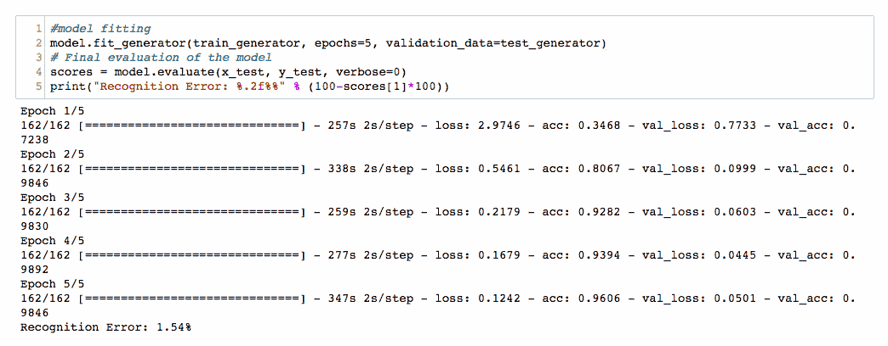

1.  如您所见，我们获得了 98.46%的准确率，导致了 1.54%的误差率。这个结果相当不错，但卷积网络已经取得了很大进展，我们可以通过调优一些超参数或使用更深的网络来改善这个误差率。

# 还有更多...

使用更深的 CNN，增加了 12 层（多了一层卷积层和一层最大池化层），将准确率提升至 99.07%，如以下截图所示：


在每两层后使用数据归一化，进一步提高了准确率，达到了 99.85%，如以下截图所示：

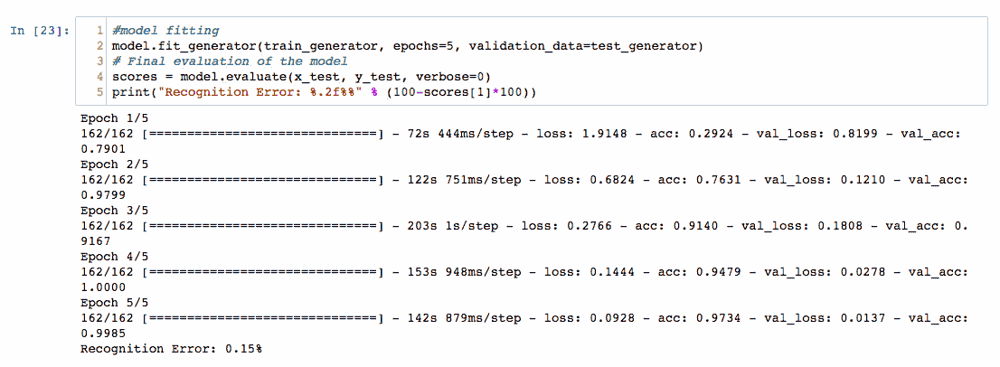

你可能会得到不同的结果，但可以多次运行训练步骤。以下是一些你可以在未来进行实验的步骤，以更好地理解网络：

+   尝试更好地调整超参数，并实施更高的丢弃率，看看网络如何响应。

+   当我们尝试使用不同的激活函数或较小（较稀疏）的网络时，准确性大幅下降。

+   同时，改变特征图和最大池化层的大小，观察这如何影响训练时间和模型准确性。

+   尝试在一个较稀疏的卷积神经网络中增加更多的神经元，并调整它以提高准确性。这也可能导致更快的网络，在更短的时间内完成训练。

+   使用更多的训练数据。探索其他在线仓库，找到更大的数据库来训练网络。卷积神经网络通常在训练数据量增大时表现更好。

# 另见

以下已发布的论文是了解卷积神经网络的好资源。它们可以作为进一步阅读材料，帮助你更深入地了解卷积神经网络在各类应用中的应用：

+   [`papers.nips.cc/paper/4824-imagenet-classification-with-deep-convolutional-neural-networks`](http://papers.nips.cc/paper/4824-imagenet-classification-with-deep-convolutional-neural-networks)

+   [`arxiv.org/abs/1408.5882`](https://arxiv.org/abs/1408.5882)

+   [`www.cv-foundation.org/openaccess/content_cvpr_2014/papers/Karpathy_Large-scale_Video_Classification_2014_CVPR_paper.pdf`](https://www.cv-foundation.org/openaccess/content_cvpr_2014/papers/Karpathy_Large-scale_Video_Classification_2014_CVPR_paper.pdf)

+   [`www.cs.cmu.edu/~bhiksha/courses/deeplearning/Fall.2016/pdfs/Simard.pdf`](http://www.cs.cmu.edu/~bhiksha/courses/deeplearning/Fall.2016/pdfs/Simard.pdf)

+   [`dl.acm.org/citation.cfm?id=2807412`](https://dl.acm.org/citation.cfm?id=2807412)

+   [`ieeexplore.ieee.org/abstract/document/6165309/`](https://ieeexplore.ieee.org/abstract/document/6165309/)

+   [`openaccess.thecvf.com/content_cvpr_2014/papers/Oquab_Learning_and_Transferring_2014_CVPR_paper.pdf`](http://openaccess.thecvf.com/content_cvpr_2014/papers/Oquab_Learning_and_Transferring_2014_CVPR_paper.pdf)

+   [`www.aaai.org/ocs/index.php/IJCAI/IJCAI11/paper/download/3098/3425`](http://www.aaai.org/ocs/index.php/IJCAI/IJCAI11/paper/download/3098/3425)

+   [`ieeexplore.ieee.org/abstract/document/6288864/`](https://ieeexplore.ieee.org/abstract/document/6288864/)
